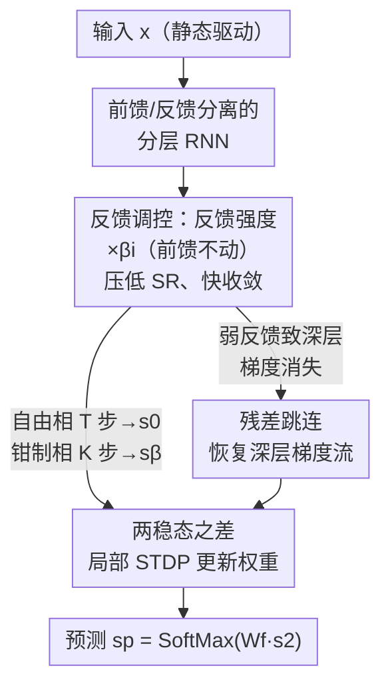

# Toward Practical Equilibrium Propagation: Brain-Inspired Recurrent Neural Network with Feedback Regulation and Residual Connections

**会议**: ICLR 2026  
**OpenReview**: [https://openreview.net/forum?id=e5l1sD0nk2](https://openreview.net/forum?id=e5l1sD0nk2)  
**领域**: 类脑学习 / 生物可塑学习算法  
**关键词**: Equilibrium Propagation, 生物可塑学习, 反馈调控, 残差连接, 收敛性

## 一句话总结
针对平衡传播（Equilibrium Propagation, EP）训练慢、不稳定的老大难问题，本文提出一种受大脑启发的反馈调控残差递归网络 FRE-RNN——只把反馈通路的强度乘上一个小系数 $\beta_i$ 来加速 RNN 收敛、用残差跳连补救由此带来的梯度消失，使 EP 的训练时间相比已有实现快了一到两个数量级，同时在 MNIST/CIFAR-10 上达到与反向传播（BP）相当的精度。

## 研究背景与动机
**领域现状**：反向传播（BP）撑起了现代 AI，但它依赖非局部的误差信号、权重转置（weight transport）以及对激活函数导数的精确访问，这些都不符合大脑的生物机制，在神经形态硬件上实现的开销也极大。平衡传播（EP）是一条对硬件友好的替代路线：它把一个递归网络（RNN）当作动力系统，先让网络在输入驱动下自然收敛到稳态（自由相），再让输出层被预测误差"轻推"（nudge）到新稳态（钳制相），权重更新只用两个稳态之差这一**局部信息**，天然兼容 STDP，不需要显式求激活导数。

**现有痛点**：EP 看起来很美，但工程上几乎不可用——RNN 往往要迭代几十甚至上百步才能稳定到一个稳态，自由相、钳制相都要跑这么多步，导致训练极慢且数值不稳定。此前为了提速所做的改造（如各种反向迭代、解析法）又把流程搞得非常复杂。

**核心矛盾**：EP 的成本与稳定性都卡在 RNN 的**收敛性**上。RNN 的动力学由权重矩阵的谱半径（spectral radius, SR）决定，SR 越大越容易振荡甚至混沌、收敛越慢。一个直觉的提速办法是缩小前馈权重 $W_i$ 来压低 SR，但前馈通路同时承载着推理信号，缩小它会直接削弱逐层的信息传递、损害精度——**提速和保精度在"缩前馈权重"这条路上直接冲突**。

**本文目标**：（1）在不破坏前馈推理信号的前提下让 RNN 快速收敛，把 EP 的训练/推理成本降下来；（2）解决随之而来的深层网络梯度消失，让 EP 能训练到 10–20 层。

**切入角度**：作者从大脑皮层的结构与动力学取灵感——皮层会**动态调控前馈与反馈连接的强度**（刺激刚出现时前馈主导，自发活动时反馈凸显），而且皮层不是严格的分层链，而是布满横向与跨区反馈回路、含大量长程跳连的"递归网络"，这种拓扑天然有较短的平均路径。

**核心 idea**：把"调谐网络动力学"这件事从前馈通路挪到反馈通路——**只把反馈强度乘以一个缩放系数 $\beta_i$**（前馈权重原样保留），用弱反馈换来快收敛与稳定；再用**残差跳连**补回弱反馈造成的梯度消失。

## 方法详解

### 整体框架
FRE-RNN 仍在标准 EP 的"两相"框架里跑，但对网络做了两处结构改动。把输入层、输出层从递归核心里分离出来（输出层用 SoftMax，便于和前馈网络对比），中间的若干隐层 $s_1, s_2, \dots$ 构成真正的 RNN：每个隐层既有前馈权重 $W_i$（乘系数 $\alpha_i$，默认 $\alpha_i=1$）把信号往上送，又有反馈权重 $B_i$（乘系数 $\beta_i$，默认取 0.01–0.1 的小值）把上层状态送回。整个网络的状态更新写作

$$s^{\beta_f}[t+1] = \rho\big(W \cdot s^{\beta_f}[t] + b\big),\qquad b = [\,W_0 s_0,\ \beta_f B_f e_p\,],$$

其中 $\rho$ 是激活函数，$e_p = s_{\star} - s_p$ 是预测误差，$\beta_f$ 是"轻推系数"（nudging factor），本质上也是在缩放误差反馈强度。

训练分两相：**自由相**令 $\beta_f=0$，RNN 在输入下迭代 $T$ 步收敛到稳态 $s^0$，得到预测 $s_p = \text{SoftMax}(W_f s_2)$；**钳制相**让误差 $e_p$ 通过反馈通路 $B_f$（乘 $\beta_{f1}$，分层结构默认 0.1、卷积结构默认 0.25）轻推网络，再迭代 $K=T/2$ 步到新稳态 $s^{\beta_{f1}}$。权重更新只用两稳态之差，遵循 STDP 兼容规则

$$\Delta W_i = ds_{i+1}\cdot (s^0_i)^\top,\qquad ds_{i+1}=s^{\beta_{f1}}_{i+1}-s^0_{i+1},$$

输出权重 $\Delta W_f = (s_\star - s^0_p)\cdot (s^0_2)^\top$。关键在于：把 $\beta_i$ 调小后，RNN 收敛所需的 $T,K$ 大幅减少，于是同样的两相流程跑得快得多；而弱反馈在深层会引发梯度消失，于是再叠加残差跳连恢复梯度流。

### 关键设计

**1. 反馈调控：只缩反馈强度 $\beta_i$，用弱反馈换快收敛而不伤前馈信号**

这一步直接回应"提速与保精度冲突"的核心矛盾。RNN 的收敛快慢由谱半径 SR 决定，SR 小则注入信号随时间衰减、网络稳定且收敛快；SR 大则会振荡乃至混沌。压低 SR 最朴素的办法是缩小整张权重矩阵，但前馈权重 $W_i$ 同时是推理信号的载体，缩它等于让信号一层层衰减、精度崩掉（实验里下调 $\alpha_i$ 的那几行精度明显变差）。作者的做法是**把缩放只施加在反馈通路上**：前馈权重 $W_i$ 保持原样（$\alpha_i=1$），只让反馈权重乘一个小系数 $\beta_i$（默认 0.01–0.1）。$\beta_i$ 与轻推系数 $\beta_f$ 同理，都是在缩放回传的梯度强度。这样既压住了 SR、把收敛迭代数从上百步降到十几步，又不动前馈推理信号。文中用 SR 与有限时间最大 Lyapunov 指数（FTMLE，刻画系统对扰动的敏感性，越大越不稳定）量化了这一点：$\beta_i$ 与 SR 正相关，$\beta_i<1$ 时 SR 与 FTMLE 都被压低、收敛时间显著缩短。需要注意 $\beta_i>1$（上调反馈）也能让 FTMLE 和收敛时间下降，但那是因为神经元状态进入**饱和**，会同时拉低精度——所以真正可用的是"弱反馈"区间而非"强反馈"。反馈权重在训练中保持固定，这也与向量场版 EP 不同，进一步简化了实现。

**2. 残差连接：给弱反馈造成的深层梯度消失补一条短路径**

弱反馈是把双刃剑——它带来快收敛，却会在深层 RNN 里加剧梯度消失（误差信号经过每一层的弱反馈被反复衰减，传不到底层，5 层以上、$\beta_i$ 过小时精度直接塌方）。作者借鉴皮层的长程跳连，在深层 RNN 里加入**跨非相邻层的残差连接**。对称连接的 10 层 RNN 加 3 条长程双向残差链跳过相邻层；非对称连接则在任意非相邻层之间以概率 $P=20\%$ 随机连边，构成"任意图拓扑"（arbitrary graph topology, AGT），任意两层都可能随机成连。残差跳连的作用是**缩短信用分配（credit assignment）的路径**，让梯度有一条不经过逐层弱反馈衰减的"近道"回传，从而把因弱反馈而消失的梯度补回来。效果上，10 层网络加残差后 MNIST 精度涨约 5%、CIFAR-10 涨约 9%，甚至能训练到 20 层；非对称 AGT 在 MNIST 上还反超了反馈对齐（FA）。这一设计与反馈调控是配套的：前者负责快与稳，后者负责让"快与稳"在深层不以牺牲可训练性为代价。

**3. 弱反馈隐式协调各层可塑性，免去逐层调学习率**

这是反馈调控顺带带来的一个额外好处，也对应它在大脑里的生物含义。此前 EP 的研究认为弱反馈下各层梯度差异巨大，必须给不同层设置相差数量级的学习率才能训得动。本文发现：正因为弱反馈天然在不同层之间制造了梯度强度的差异，一个 $\beta_i=0.01$ 的 3 层 RNN 用**统一学习率**就能学好（Table 1 的 "ours (tanh)"），不再需要逐层调学习率。换句话说，$\beta_i$ 这一个系数同时扮演了"调收敛"和"隐式调各层可塑性"两个角色，这与大脑不同皮层区域因功能不同而具备不同可塑性的假设相呼应——可塑性的差异既可显式靠学习率、也可隐式靠调制梯度强度来实现。

### 损失函数 / 训练策略
训练沿用 EP 的对比式更新（见上文 $\Delta W_i$、$\Delta W_f$ 两式），不需要显式反传链。默认超参：$T = 10\times N_{\text{隐层}}$、$K=T/2$（Table 2 中为保证 $\beta_i=0.1$ 下精度饱和取 $K=5\times N_{\text{隐层}}$）；分层结构 $\beta_i$ 默认 0.01、卷积结构 0.01；浅网络（<4 层）反馈缩放取 0.01–0.1，更深结构取 0.1–0.25。优化器多用 Adam，激活用 tanh / hard-sigmoid。反馈权重在训练中固定不更新。

## 实验关键数据

数据集为 MNIST（70k 张 28×28 手写数字）与 CIFAR-10（60k 张 32×32 彩色图），对比对象为原型 EP（P-EP）、BP 与反馈对齐 FA，每组实验重复 5 次。

### 主实验：与 P-EP / BP 的精度和成本对比（Table 1）

| 结构 | 方法 | 测试精度 | 墙钟时间 (HH:MM:SS) |
|------|------|---------|---------------------|
| 2HL | P-EP (sigmoid-s) | 98.05%±0.10% | 1:56:– |
| 2HL | **Ours (tanh, Adam)** | **98.39%±0.04%** | **0:01:16** |
| 2HL | BP (tanh, Adam) | 98.26%±0.06% | 0:00:18 |
| 3HL | P-EP (sigmoid-s) | 97.99%±0.18% | 8:27:– |
| 3HL | **Ours (tanh, Adam)** | **98.36%±0.06%** | **0:02:11** |
| 3HL | BP (tanh, Adam) | 98.36%±0.08% | 0:00:24 |
| Conv | P-EP (hard-sigmoid) | 98.98%±0.04% | 8:58:– |
| Conv | **Ours (hard-sigmoid)** | **99.14%±0.02%** | **0:12:28** |

相比 P-EP，本文在分层与卷积结构上的训练速度都至少快一个数量级（3HL 从 8 小时 27 分降到 2 分 11 秒），精度反而略有提升，与 BP 持平。提速主要来自收敛所需迭代步数的大幅减少。

### 消融实验：残差连接的作用与深度可扩展性（Table 2）

| 结构-连接 | 方法 | MNIST 测试 | CIFAR-10 测试 |
|-----------|------|-----------|---------------|
| 5-symm | BP | 97.69%±0.10% | 49.23%±0.81% |
| 5-symm | Ours | 97.64%±0.10% | 50.72%±0.17% |
| 10-symm | Ours（无残差） | 92.49%±0.32% | 34.90%±0.38% |
| 10-symm | **Ours-Residual** | **97.49%±0.05%** | **44.46%±0.51%** |
| 10-asymm | FA | 94.52%±0.26% | 30.16%±6.12% |
| 10-asymm | **Ours-AGT** | **96.87%±0.11%** | 30.94%±4.90% |
| 20-symm | Ours-Residual | 95.95%±0.18% | 43.61%±1.17% |
| Conv | Ours | 99.27%±0.07% | 75.04%±0.51% |

### 关键发现
- **残差是深层 EP 的命门**：10 层对称网络不加残差，MNIST 只有 92.49%、CIFAR-10 只有 34.90%；加残差后分别回到 97.49%（+5%）和 44.46%（+9%），逼近同深度 BP，且可训练到 20 层。
- **$\beta_i$ 存在与深度耦合的最优区间**：浅网络偏好小 $\beta_i$（0.01–0.1），但深网络 $\beta_i$ 过小会因梯度消失掉点；3/5/10 层各自的最优 $\beta_i$ 随深度上移。$\beta_i=4$ 时即便 $T=100$ 也过不了 95%，因为大 $\beta_i$→大 SR/FTMLE→不稳定。
- **下调反馈带来确凿提速**：$\beta_i=0.01$ 时 $T=10,K=5$ 的模型与 $T=100,K=50$ 表现相当，迭代步数可压缩 10 倍。
- **非对称随机反馈的局限**：CIFAR-10 上 10 层非对称 AGT 比对称版低近 14%，作者归因于误差经多条随机固定反馈连接后被严重扭曲，难以协调前馈权重学习。

## 亮点与洞察
- **把"调动力学"从前馈搬到反馈**是最关键的一招：同样是压低谱半径，缩反馈不伤推理信号、缩前馈则两败俱伤——一个系数 $\beta_i$ 的位置之差，决定了 EP 能否实用化。
- **一个系数身兼三职**：$\beta_i$ 同时控制收敛速度、稳定性（SR/FTMLE）和各层可塑性差异，使得统一学习率即可训练，省掉了 EP 历来棘手的逐层调学习率。
- **生物启发落到了可量化的工程收益上**：皮层"动态调反馈强度 + 长程跳连"这两条观察，分别精确对应到反馈缩放与残差连接，而非停留在比喻层面，且方法对权重/状态噪声有显著鲁棒性，对神经形态硬件的原位学习有直接指导意义。
- 这套结构改动与其它算法级加速（如解析法）正交，可叠加使用，拓展了高效 EP 的设计空间。

## 局限与展望
- **复杂数据集上与 BP 仍有差距**：深层全连接在 CIFAR-10 上明显不及 BP，作者归因于 EP 对真实梯度的近似不够精确；深层 CNN 上的适用性尚未验证。
- **非对称深层退化快**：随机误差反馈不准，导致非对称连接随深度增加精度下降更快，残差拓扑如何设计才能扩展到大规模深网仍待研究。
- **超参靠经验**：$\beta_i$ 的可用区间（浅网 0.01–0.1、深网 0.1–0.25）目前是经验调出来的，缺乏自动确定的通法。
- **仅限静态输入**：与多数 EP 工作一样只做静态输入分类，如何把自然收敛的 EP-RNN 扩展到序列任务仍是开放问题。

## 相关工作与启发
- **vs P-EP（原型 EP）**：P-EP 把输入输出层也并入递归核心、用对称能量模型，收敛慢（数小时级）。本文从向量场设定出发、分离输入输出层并只缩反馈强度，训练快一到两个数量级，精度反超。
- **vs BP**：BP 依赖非局部误差与权重转置、需显式激活导数；本文是局部、STDP 兼容、无需激活导数的生物可塑替代，浅层/卷积已能与 BP 持平，但深层复杂任务仍有差距。
- **vs 反馈对齐 FA**：FA 用随机固定反馈传误差。本文非对称 AGT 在 MNIST 上反超 FA，CIFAR-10 上互有胜负，且额外提供了收敛性与稳定性的可控手段。
- **理论联系**：作者论证在"弱钳制 + 弱反馈"的无穷小推理极限下，FRE-RNN 的 EP 等价于局部表征对齐（LRA）与 BP，弱反馈使其动力学更接近前馈网络。

## 评分
- 新颖性: ⭐⭐⭐⭐ 把网络动力学调谐从前馈挪到反馈这一观察简单却关键，配合残差解决深层梯度消失，思路干净。
- 实验充分度: ⭐⭐⭐⭐ 在 SR/FTMLE/收敛时间/精度多维度上系统扫了 $\beta_i$ 与深度，消融到位；但仅限 MNIST/CIFAR-10，缺更大规模验证。
- 写作质量: ⭐⭐⭐⭐ 动机与生物对应讲得清楚，公式与算法伪代码完整。
- 价值: ⭐⭐⭐⭐ 把 EP 从"理论好看、工程难用"推进到训练快一两个数量级、可达 BP 水平，对神经形态硬件原位学习有实际指导意义。

<!-- RELATED:START -->

## 相关论文

- [\[ICLR 2026\] Online Learning and Equilibrium Computation with Ranking Feedback](online_learning_and_equilibrium_computation_with_ranking_feedback.md)
- [\[ICLR 2026\] Parameterized Hardness of Zonotope Containment and Neural Network Verification](parameterized_hardness_of_zonotope_containment_and_neural_network_verification.md)
- [\[ICLR 2026\] Training-Free Determination of Network Width via Neural Tangent Kernel](training-free_determination_of_network_width_via_neural_tangent_kernel.md)
- [\[ICLR 2026\] Residual Feature Integration is Sufficient to Prevent Negative Transfer](residual_feature_integration_is_sufficient_to_prevent_negative_transfer.md)
- [\[ICLR 2026\] DeepWeightFlow: Re-Basined Flow Matching for Generating Neural Network Weights](deepweightflow_re-basined_flow_matching_for_generating_neural_network_weights.md)

<!-- RELATED:END -->
