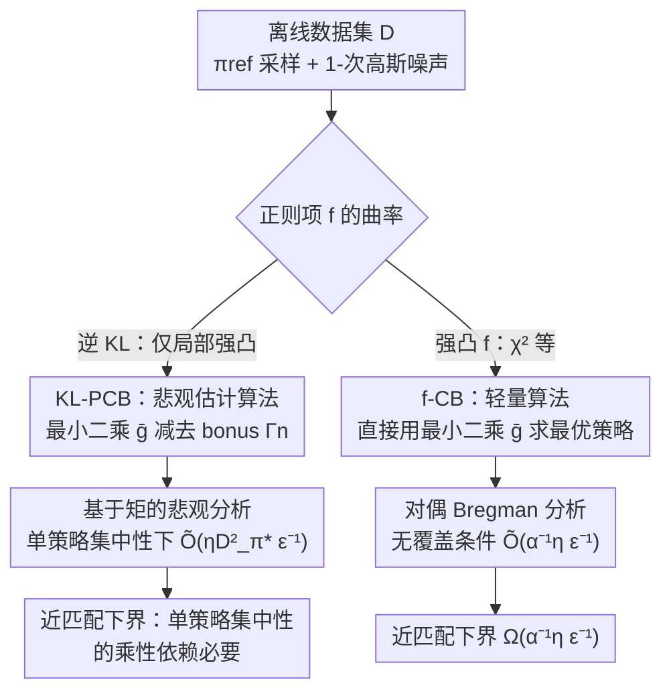

# Towards a Sharp Analysis of Offline Policy Learning for f-Divergence-Regularized Contextual Bandits

**会议**: ICLR 2026  
**OpenReview**: [https://openreview.net/forum?id=ly6MB2Cfx2](https://openreview.net/forum?id=ly6MB2Cfx2)  
**代码**: 无  
**领域**: 学习理论 / 离线强化学习 / 上下文老虎机  
**关键词**: 离线策略学习, f-散度正则, 样本复杂度, 集中性条件, 悲观估计

## 一句话总结
本文给出离线 $f$-散度正则上下文老虎机在正则化目标下达到 $\widetilde{\Theta}(\epsilon^{-1})$ 样本复杂度所需的**最弱数据覆盖条件**：对最常用的逆 KL 正则，首次用一套新的悲观估计分析在**单策略集中性**下做到 $\widetilde{O}(\epsilon^{-1})$ 并配上近乎匹配的下界；对强凸 $f$ 的散度，则证明**完全不需要悲观估计、也不需要任何覆盖条件**就能达到 $\widetilde{\Theta}(\epsilon^{-1})$。

## 研究背景与动机

**领域现状**：很多离线强化学习算法都靠 $f$-散度正则来稳定训练、约束策略不要跑离参考策略 $\pi_{\mathrm{ref}}$，其中逆 KL 正则的目标 $J(\pi)=\mathbb{E}_\pi[r]-\eta^{-1}\mathrm{KL}(\pi\|\pi_{\mathrm{ref}})$ 是实践中最流行的形式（熵正则 RL、RLHF/DPO 微调大模型都在用）。理论上 KL 也很特殊——它是唯一同时属于 $f$-散度和 Bregman 散度的散度，兼具计算与统计上的优势。

**现有痛点**：过去大量理论工作分析的是**未正则化**的奖励最大化目标，那种目标的样本复杂度天然有 $\Omega(\epsilon^{-2})$ 的下界，跑不快。最近一批工作（Xiong et al. 2024；Zhao et al. 2024 等）转向分析**正则化目标**下的次优性，原则上能做到 $\Omega(\epsilon^{-1})$，但已有结果要么仍卡在 $\widetilde{O}(\epsilon^{-2})$，要么虽然拿到了 $\widetilde{O}(\epsilon^{-1})$ 却依赖很苛刻的**全策略集中性**（all-policy concentrability）——也就是要求行为策略几乎覆盖所有可能动作，这在离线场景里几乎不现实。

**核心矛盾**：离线学习的本质难点是**分布偏移**，刻画它的就是覆盖条件（集中性）。但「达到快速率 $\epsilon^{-1}$」和「只需要弱覆盖条件」这两件事一直没法同时拿到——要么收敛慢，要么对数据覆盖要求高。同时，所有分析都默认把 KL 当成正确的正则目标，可逆 KL 对应的 $f(x)=x\log x$ 只是**凸**而非**强凸**，那么换成曲率更好（强凸 $f$）的散度，会不会有更松的覆盖依赖？这两点都没有答案。

**本文目标**：回答一个核心开放问题——**离线学习要在 $f$-散度正则目标下近似最优，所需的最弱覆盖条件到底是什么？** 并把它拆成两类代表性散度分别求解：(1) 逆 KL（仅局部强凸）；(2) 强凸 $f$ 诱导的散度。

**切入角度**：作者注意到正则化目标 $J(\pi)$ 因为正则项的凸性而是**强凹**的——既然目标函数在最优点附近有曲率，那次优间隙 $J(\pi^*)-J(\widehat\pi)$ 就有可能被压成 $[\mathrm{TV}(\pi^*\|\widehat\pi)]^2\approx\widetilde{O}(n^{-1})$ 的二阶量，而不是一阶量。问题在于如何把这条曲率红利和离线场景的悲观估计正确耦合起来，使得最终只依赖单策略集中性。

**核心 idea**：对逆 KL，用「悲观奖励估计 + 利用 KL 强凸性」精炼出一个**基于矩的风险上界**，绕开「对函数类中任意两个函数的差做一致控制」的需求，从而把覆盖依赖从全策略降到单策略；对强凸 $f$，则从**对偶 Bregman** 视角把次优间隙写成对偶函数的 Bregman 散度，证明它压根不依赖任何集中性。

## 方法详解

### 整体框架

本文不是提算法刷榜，而是一篇**样本复杂度的紧致分析**：设定是离线上下文老虎机 $(\mathcal{S},\mathcal{A},r,\pi_{\mathrm{ref}})$，agent 只拿到一份由行为策略 $\pi_{\mathrm{ref}}$ 采的 i.i.d. 数据集 $\mathcal{D}=\{(s_i,a_i,r_i)\}_{i=1}^n$（奖励带 1-次高斯噪声），目标是输出一个对正则化目标 $\epsilon$-最优的策略 $\widehat\pi$，并问清楚「需要多少样本 $n$、需要什么覆盖条件」。

作者把 $f$-散度劈成两条线分别处理，针对各自的曲率性质设计算法与证明：

两条线的产物分别是 Table 1 里的上下界，再加数值实验验证斜率，并把整套思路推广到上下文对决老虎机（CDB）。

### 关键设计

**1. 集中性与 $D^2$-散度：把「覆盖条件」量化成函数类敏感的两档强度**

离线学习能不能学好，取决于行为策略 $\pi_{\mathrm{ref}}$ 的数据有没有覆盖到最优策略要去的地方，这就是集中性（concentrability）。作者用两套口径刻画它。一是基于密度比的：全策略版 $C_\Pi:=\sup_{\pi,s,a}\pi(a|s)/\pi_{\mathrm{ref}}(a|s)$ 要求覆盖所有策略，单策略版 $C_{\pi^*}:=\sup_{s,a}\pi^*(a|s)/\pi_{\mathrm{ref}}(a|s)$ 只要求覆盖最优策略，后者严格更弱、更现实。二是更贴合函数类 $\mathcal{G}$ 的 $D^2$-散度（受 eluder 维度启发）：

$$D^2_{\mathcal{G}}((s,a);\pi):=\sup_{g,h\in\mathcal{G}}\frac{(g(s,a)-h(s,a))^2}{\mathbb{E}_{(s',a')\sim\rho\times\pi}[(g(s',a')-h(s',a'))^2]}.$$

它的含义是：如果两个候选奖励函数在行为分布下接近，那它们在 $(s,a)$ 上有多接近——刻画的是「在 $\pi_{\mathrm{ref}}$ 数据上的估计能泛化到某个具体状态-动作对」的能力。由此定义全策略版 $D^2=\sup_{s,a}D^2_{\mathcal{G}}((s,a);\pi_{\mathrm{ref}})$ 和单策略版 $D^2_{\pi^*}=\mathbb{E}_{(s,a)\sim\rho\times\pi^*}D^2_{\mathcal{G}}((s,a);\pi_{\mathrm{ref}})$。表格化看（线性情形 $D^2(s,a)=\|\phi(s,a)\|^2_{\Sigma^{-1}}$、表格情形 $D^2(s,a)=(\rho(s)\pi_{\mathrm{ref}}(a|s))^{-1}$），这套量化让后面的复杂度界能直接挂在「数据有多好」上。注意 $C_{\pi^*}$ 和 $D^2_{\pi^*}$ 一般互相界不住，但有 $D^2_{\pi^*}\le|\mathcal{S}||\mathcal{A}|C_{\pi^*}$。

**2. KL-PCB：用悲观估计 + 基于矩的分析，把覆盖依赖压到单策略**

针对逆 KL，痛点是 Zhao et al. (2024) 虽拿到 $\widetilde{O}(\epsilon^{-1})$ 却要全策略集中性。本文的算法 KL-PCB（Algorithm 1）先用最小二乘求出奖励估计 $\bar g=\arg\min_{g\in\mathcal{G}}\sum(g(s_i,a_i)-r_i)^2$，关键在于**不直接用 $\bar g$**，而是按离线 RL 的悲观原则减去一个 bonus 项构造**悲观估计** $\widehat g=\bar g-\Gamma_n$，其中 $\Gamma_n(s,a)=\beta D_{\mathcal{G}}((s,a),\pi_{\mathrm{ref}})$、置信半径 $\beta=\sqrt{128\log(2N_{\mathcal{G}}(\epsilon)/\delta)/3n}+18\epsilon$。在高概率事件下 $\widehat g\le g^*$，再输出 $\widehat\pi(a|s)\propto\pi_{\mathrm{ref}}(a|s)\exp(\eta\widehat g(s,a))$。

证明的精髓在于「为什么悲观估计能把覆盖依赖从全策略降到单策略」。沿用 Zhao et al. 的回归分解（Lemma 2.14），次优间隙被一个中点策略 $\pi_\gamma$ 下的期望平方误差界住：$J(\pi^*)-J(\pi_g)\le\eta\mathbb{E}_{\rho\times\pi_\gamma}[(g^*-g)^2]$。Zhao et al. 因为 $g$ 是无结构的 $\bar g$，只能用全策略集中性去控制这个中点策略 $\pi_\gamma$；而本文把 $g$ 换成悲观估计 $\widehat g$ 后，由于 $\widehat g-g^*\le0$ 恒成立，令 $G(\gamma)=\mathbb{E}_{\rho\times\pi_\gamma}[(\widehat g-g^*)^2]$ 可直接算出 $G'(\gamma)\le0$，于是 $\pi_\gamma$ 被免费替换成 $\pi^*$：

$$J(\pi^*)-J(\widehat\pi)\le\eta\,\mathbb{E}_{\rho\times\pi^*}[(\widehat g-g^*)^2(s,a)].$$

这一步靠的是一个**基于矩的引理**（Lemma 2.15）：若 $X\le0$ 几乎处处成立且三阶矩有限，则 $\mathbb{E}[X^3]-\mathbb{E}[X^2]\mathbb{E}[X]\le0$（直觉是 $X$ 和 $X^2$ 不可能正相关）。把误差换成 $\pi^*$ 下的期望后就能用单策略 $D^2_{\pi^*}$ 来界，得到主定理 $n=\widetilde{O}(\eta D^2_{\pi^*}\epsilon^{-1}\log N_{\mathcal{G}}(\epsilon))$（Theorem 2.10）。作者强调这套「矩结构」此前没在标准离线 RL 分析里出现过，是本文独立有意思的技术贡献。

**3. f-CB：对强凸 $f$ 用对偶 Bregman 视角，彻底甩掉覆盖条件**

逆 KL 只是局部强凸，那如果换成**真·强凸**的 $f$（$\alpha$-强凸、二次可微、$f(1)=0$，如 $f(x)=(x-1)^2/2$ 诱导的 $\chi^2$ 散度）呢？直觉上强凸 $f$ 对跑出 $\pi_{\mathrm{ref}}$ 覆盖范围的动作惩罚更狠，所以 $\pi^*$ 和 $\widehat\pi$ 都被拽得离 $\pi_{\mathrm{ref}}$ 很近。本文的算法 f-CB（Algorithm 2）因此**极其轻量**：只做最小二乘 $\bar g$，然后直接解 $\widehat\pi(\cdot|s)=\arg\max_\pi\langle\pi,\bar g\rangle+\eta^{-1}D_f(\pi\|\pi_{\mathrm{ref}})$，**完全不需要任何悲观 bonus**。

证明难点是强凸 $f$ 下 $\pi^*$ 没有闭式解，Lemma 2.14 那套用不上。作者改走**对偶 Bregman** 路线：令正则项 $H(\pi)=\eta^{-1}D_f(\pi\|\pi_{\mathrm{ref}})$，其凸共轭 $H^*(r)=\sup_\pi\{\langle\pi,r\rangle-H(\pi)\}$ 恰好是给定奖励 $r$ 时最优策略拿到的期望奖励，且 $\nabla H^*(r)=\pi_r$。于是次优间隙可改写成对偶函数 $H^*$ 的 Bregman 散度：

$$J(\pi^*)-J(\widehat\pi)=H^*(g^*)-H^*(\bar g)-\langle\nabla H^*(\bar g),g^*-\bar g\rangle,$$

它能被 $(g^*-\bar g)^\top\nabla^2H^*(\widetilde g)(g^*-\bar g)$ 界住。再由 $H$ 强凸推出 $\nabla^2H^*(\widetilde g)\preceq\alpha^{-1}\eta\,\mathrm{diag}(\pi_{\mathrm{ref}}(a_1),\dots)$，最终把间隙界成 $\alpha^{-1}\eta\,\mathbb{E}_{\pi_{\mathrm{ref}}}[(g^*-\widehat g)^2]$。关键是这个上界里的期望是在 $\pi_{\mathrm{ref}}$ 下取的，**和 $\pi^*$ 无关**，于是复杂度 $n=\widetilde{O}(\alpha^{-1}\eta\epsilon^{-1}\log N_{\mathcal{G}}(\epsilon))$（Theorem 3.2）里没有任何集中性项。

### 损失函数 / 训练策略

两个算法的「训练」都只是一步最小二乘奖励回归 $\bar g\in\arg\min_{g\in\mathcal{G}}\sum_{(s_i,a_i,r_i)\in\mathcal{D}}(g(s_i,a_i)-r_i)^2$，区别仅在于 KL-PCB 在回归后再减去 bonus $\Gamma_n$ 做悲观化，f-CB 直接拿 $\bar g$ 解正则化最优策略。函数类 $\mathcal{G}$ 在可实现性（$g^*=r\in\mathcal{G}$）与覆盖数 $\log N_{\mathcal{G}}(\epsilon)=\mathrm{poly}(\log)$ 的温和假设下即可，适用于线性类乃至神经网络（$D^2$ 可用启发式近似）。

## 实验关键数据

实验目的不是刷指标，而是验证理论斜率：因为所有上下界对 $\epsilon$ 都是 $\widetilde{\Theta}(\epsilon^{-1})$，所以次优间隙应随样本量 $n$ 大致按 $n^{-1}$ 下降，即 $\log_2 n$ 对 $\log_2\mathrm{SubOpt}$ 的回归斜率应接近 $-1$。

### 主实验（多臂老虎机上的速率验证）

在 Theorem 2.11 / 3.4 证明里构造的硬实例（两臂老虎机）上测，每个点是 100 次独立试验平均。

| 设置 | $\pi_{\mathrm{ref}}$ | 拟合斜率 | 结论 |
|------|------|------|------|
| 逆 KL（KL-PCB） | $[1/2,1/2]$ | $-0.98$ | 达到近最优 $n^{-1}$ 速率 |
| 逆 KL（KL-PCB） | $[1/10,9/10]$ | $-0.97$ | 不同覆盖下仍 $\approx n^{-1}$ |
| $\chi^2$（f-CB） | $[1/2,1/2]$ | $-0.98$ | 强凸 $f$ 同样 $\approx n^{-1}$ |
| $\chi^2$（f-CB） | $[1/10,9/10]$ | $-0.99$ | 与覆盖无关 |

### 消融 / 分析实验

| 配置 | 关键观察 | 说明 |
|------|---------|------|
| 改变 $\pi_{\mathrm{ref}}$（KL 情形，线性老虎机 Fig.2a） | 间隙随 $C_{\pi^*},D^2_{\pi^*}$ 增大而抬高 | KL 目标的复杂度**正依赖**集中性 |
| 改变 $\pi_{\mathrm{ref}}$（$\chi^2$ 情形，Fig.2b） | 不同覆盖曲线几乎重合 | $\chi^2$ 目标复杂度**不随覆盖变化** |
| 固定 $n\alpha\equiv 2^{15}$ 扫 $\alpha$ | $\mathrm{SubOpt}_{fdiv}$ 保持稳定 | 验证间隙反比于强凸模数 $\alpha$ |

### 关键发现
- 逆 KL 与强凸 $f$ 对 $\epsilon$ 都达到 $n^{-1}$ 速率，但两者对**覆盖条件**的依赖截然不同——这正是本文最核心的理论分界在数值上的体现。
- KL 情形里，覆盖系数 $C_{\pi^*}$、$D^2_{\pi^*}$ 越大间隙越高；$\chi^2$ 情形里改变 $\pi_{\mathrm{ref}}$ 曲线基本不动，直接坐实「强凸 $f$ 免覆盖」的论断。
- 固定 $n\alpha$ 时间隙不变，定量验证了复杂度对 $\alpha^{-1}$ 的线性依赖。

## 亮点与洞察
- **悲观估计 + 矩结构的耦合**是真正的技术新意：以往离线 RL 的悲观分析都停在 performance difference / simulation lemma，捕捉不到 KL 目标的强凹性；本文用「$\widehat g-g^*\le 0$ 恒成立 ⇒ $\mathbb{E}[X^3]-\mathbb{E}[X^2]\mathbb{E}[X]\le0$」把中点策略 $\pi_\gamma$ 免费替换成 $\pi^*$，是把悲观性翻译成单策略覆盖的巧妙一招。
- **对偶 Bregman 视角**优雅地处理了 $\pi^*$ 无闭式解的强凸 $f$：把次优间隙直接写成对偶函数 $H^*$ 的 Bregman 散度，再用 $\nabla^2 H^*\preceq(\nabla^2 H)^{-1}$ 把界压到 $\pi_{\mathrm{ref}}$ 期望上，从根上消掉覆盖依赖。
- **下界配套**让结论闭环：不仅证明 $C_{\pi^*}$ 的乘性依赖对 KL 是必要的（首次），还给强凸 $f$ 配了匹配下界，说明 $\alpha^{-1}\eta\epsilon^{-1}$ 已经到顶。
- 「正则化目标本身有曲率 ⇒ 可绕过 $\epsilon^{-2}$ 壁垒」这个洞察，对 RLHF/DPO 这类 KL 正则微调的样本效率分析有直接借鉴意义。

## 局限与展望
- 分析限定在**上下文老虎机**（单步），虽推广到了对决老虎机，但没有覆盖带状态转移的完整 MDP——多步情形下曲率红利能否保留是开放问题。
- 假设 $\pi_{\mathrm{ref}}$ 同时是行为策略（behavior regularization），且奖励可实现（$r\in\mathcal{G}$）、覆盖数温和；现实里行为策略与参考策略不一致、misspecification 等情况未处理。
- 逆 KL 的界含 $\exp(\mathrm{poly}(\eta))$ 量级的 $C_{\pi^*}\le\exp(\eta)$（作者指出不可避免），强正则下覆盖系数可能爆炸。
- $D^2$ 在一般函数类（神经网络）上只能启发式近似，理论保证到实践之间还有缝。

## 相关工作与启发
- **vs Zhao et al. (2024)**: 同样拿到逆 KL 的 $\widetilde{O}(\epsilon^{-1})$，但他们需要更强的**全策略集中性**（Assumption 2.7），本文靠悲观估计 + 矩分析只用**单策略集中性**（Assumption 2.8），严格更弱。
- **vs Xiong et al. (2024) / Xie et al. (2024)**: 这些工作分析正则化目标但仍停在 $\widetilde{O}(\epsilon^{-2})$，本文把对 $\epsilon$ 的依赖压到 $\epsilon^{-1}$。
- **vs Foster et al. (2025)**: 他们给出 $\Omega(C_{\pi^*})$ 的下界论证覆盖必要性，本文进一步证明 $C_{\pi^*}$ 的**乘性**依赖必要，并在强凸 $f$ 下反向证明覆盖**可被完全消除**。
- **vs 传统悲观离线 RL（Jin et al. 2021；Di et al. 2024）**: 算法上同样用悲观最小二乘，但他们的次优间隙被 bonus 之和界住，无法导出本文正则目标所需的快速率；本文的 risk decomposition 越过了 performance difference lemma。

## 评分
- 新颖性: ⭐⭐⭐⭐⭐ 首次在单策略集中性下给出逆 KL 的紧致 $\epsilon^{-1}$ 上下界，并揭示强凸 $f$ 免覆盖，矩结构与对偶 Bregman 两套分析都是新的。
- 实验充分度: ⭐⭐⭐⭐ 作为理论文章，数值实验恰当地验证了斜率与覆盖依赖，但仅限合成老虎机。
- 写作质量: ⭐⭐⭐⭐ 问题动机清晰、Table 1 对比一目了然，证明概览写得克制易读。
- 价值: ⭐⭐⭐⭐⭐ 对理解 KL/f-散度正则 RL（含 RLHF）的样本效率与覆盖条件是实质性一步。

<!-- RELATED:START -->

## 相关论文

- [\[ICLR 2026\] Variance-Dependent Regret Lower Bounds for Contextual Bandits](variance-dependent_regret_lower_bounds_for_contextual_bandits.md)
- [\[ICLR 2026\] Diversified Multinomial Logit Contextual Bandits](diversified_multinomial_logit_contextual_bandits.md)
- [\[ICLR 2026\] Queue Length Regret Bounds for Contextual Queueing Bandits](queue_length_regret_bounds_for_contextual_queueing_bandits.md)
- [\[ICLR 2026\] Contextual Multi-Armed Bandits with Minimum Aggregated Revenue Constraints](contextual_multi-armed_bandits_with_minimum_aggregated_revenue_constraints.md)
- [\[ICLR 2026\] Best-of-N through the Smoothing Lens: KL Divergence and Regret Analysis](best-of-n_through_the_smoothing_lens_kl_divergence_and_regret_analysis.md)

<!-- RELATED:END -->
