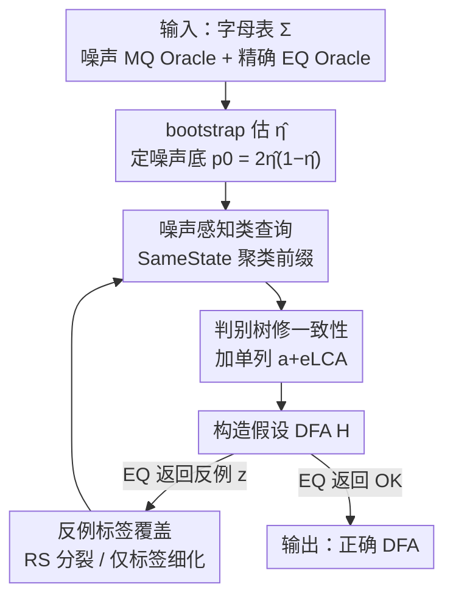

# Towards Persistent Noise-Tolerant Active Learning of Regular Languages with Class Query

**会议**: ICLR 2026  
**OpenReview**: [https://openreview.net/forum?id=1XMUe2dGRr](https://openreview.net/forum?id=1XMUe2dGRr)  
**代码**: https://github.com/lkwargs/CAPAL  
**领域**: 学习理论 / 自动机学习 / 神经符号  
**关键词**: DFA 主动学习, 持久性噪声, 类查询, 判别树, LLM 作为 Oracle

## 一句话总结
本文提出 pMAT（概率最小充分教师）形式化框架，把"LLM 当作会持久犯错的成员查询 Oracle、模拟器/检查器当作精确等价查询 Oracle"的场景刻画清楚，并设计 CAPAL 算法——用统计式的"同态类查询"代替对单条 MQ 标签的盲信、用判别树压缩判别后缀集——在成员查询持续被翻转的噪声下仍能可证明地学到正确的 DFA，且把 LLM 调用量大幅降低（代码化 Oracle 下每个任务仅需 1 次调用）。

## 研究背景与动机

**领域现状**：形式语言（正则语言、LTL、reward machine）是把人类意图精确、可验证地对齐到神经网络行为的好工具，其中 DFA 因可解释、表达力和可学习性成为"形式对齐"的核心载体。学 DFA 的经典范式是 Angluin 的 $L^\star$ 主动学习：学习者向一个 Oracle 发**成员查询（MQ，问某个词是否在目标语言里）**和**等价查询（EQ，提交一个假设 DFA 让 Oracle 判对错或给反例）**，迭代细化假设直到与目标语言一致。

**现有痛点**：当人们想用 LLM 来当那个 Oracle（让它判断"轨迹是否满足自然语言描述的规则"）时，鲁棒性立刻崩了。已有两条路线——把 LLM 当噪声 MQ Oracle（通常还需人类示范来 bootstrap），或直接让 LLM 合成 DFA 转移——都给不了正确性保证，因为幻觉产生的错误标签很难被系统性地检测和纠正。更糟的是经典的 $L^\star$、TTT 在噪声 MQ 下极其脆弱，一旦被系统性错标就基本无法恢复。

**核心矛盾**：LLM 的错误是**持久性（persistent）的**——对同一个查询 $\pi$ 反复采样、做多数投票或 self-consistency，只会让经验分布收敛到它**偏置的那个标签**上。如果某个词的正确率 $p^\star(\pi)<\tfrac12$，那么重采样降低了方差却**消除不了偏置**，多数投票几乎必然收敛到**错误**答案。也就是说，"多问几遍取众数"这条最自然的去噪手段在持久性噪声面前根本失效。

**本文目标**：在 MQ 可能持久出错、但 EQ 始终精确的设定下，设计一个**无需人类示范**、**有理论正确性保证**、且**省 LLM 调用**的 DFA 主动学习算法。

**切入角度**：作者的关键观察是——既然单条 MQ 标签不可信，那就**不要去信任单条标签**，而是把噪声 MQ 当作统计证据来用，去回答一个更鲁棒的问题："两个前缀 $u,v$ 是否属于同一个 Myhill–Nerode 等价类？"只要每条 MQ 的正确率 $p^\star>\tfrac12$，在一小撮后缀上聚合证据就能给出统计可靠的类判定；而真正的纠错则交给精确的 EQ 反例来兜底。

**核心 idea**：用"噪声容忍的统计同态类查询 + 判别树 + 反例标签覆盖"替换 $L^\star$ 中对单条 MQ 的盲信，把"无法去除的持久偏置"转化为"可被统计聚合和精确 EQ 共同压制"的可学习问题。

## 方法详解

### 整体框架

CAPAL（Class-query Active, Persistent-noise-Aware Learning）运行在 pMAT 设定下：学习者面对一个**持久噪声的成员 Oracle** $O_{MQ}$（对词 $w$ 返回的缓存标签 $C_{MQ}[w]$ 以概率 $1-\eta$ 等于真标签、以概率 $\eta<\tfrac12$ 被翻转，且**重复问得到的是同一个被缓存的持久值**）和一个**精确等价 Oracle** $O_{EQ}$（对假设 $H$ 要么返回 OK、要么返回一个无噪反例 $z$ 满足 $H(z)\neq M(z)$）。

整个流程是在经典 $L^\star$ 观察表循环外面包一层"噪声感知"：先用小预算 bootstrap 估出噪声率 $\hat\eta$ 并定下噪声底 $p_0=2\hat\eta(1-\hat\eta)$；然后每一轮做四件事——① 用噪声感知的同态测试 `SameState` 在前缀集 $S$ 上做并查集聚类；② 检查**闭性（closedness）**，缺前缀就补；③ 用**判别树（DT）**修**一致性（consistency）**，每次只加一个派生列；④ 构造假设 $H$ 交给 $O_{EQ}$；若返回反例则用其**无噪标签**覆盖对应状态的接受性，并按 Rivest–Schapire 分裂决定是补后缀还是仅记录标签。

### 关键设计

**1. pMAT 形式化与持久错误：刻画"为什么重采样救不了 LLM Oracle"**

本文先把场景形式化为 pMAT：成员 Oracle 是随机的，对查询实例 $\pi$ 返回 $X\sim P(\cdot\mid\pi)$（这里 $\pi$ 是完整的、面向 LLM 的查询对象，含系统提示、语言定义、字母表、示例和被查词）；等价 Oracle 是精确的。对单个实例定义正确率 $p^\star(\pi)=\Pr_{X\sim P(\cdot\mid\pi)}[X=M(w(\pi))]$，错误率 $\epsilon(\pi)=1-p^\star(\pi)$。**持久错误**的定义是 Oracle 分布的众数与真标签不符，等价地

$$\operatorname{mode}_{x\in\{0,1\}}P(x\mid\pi)\neq M(w(\pi))\iff p^\star(\pi)<\tfrac12.$$

这个定义点出了核心：对同一 $\pi$ 做 $m$ 次 i.i.d. 采样、用任何返回经验众数的聚合器 $A_m$，由大数定律 $A_m(X_{1:m})\xrightarrow{a.s.}\operatorname{mode}_x P(x\mid\pi)$；于是当 $p^\star(\pi)<\tfrac12$ 时 $\Pr[A_m\neq M(w(\pi))]\to1$——**重采样降方差但不降偏置**，self-consistency 反而把错误标签夯得更死。作者在"被 3 整除"语言上用 GPT-4o-mini 实测，确实有相当多查询的正确率 $<50\%$。这一节的价值在于：它从根上否定了"多问几遍取众数"这条朴素去噪路线，逼出后面"用类查询 + 精确 EQ"的设计。

**2. 噪声感知的同态类查询：不信单条标签，信统计聚合**

既然单条 MQ 不可信，CAPAL 改去判定"两个前缀是否同 Myhill–Nerode 类"。给定噪声率估计 $\hat\eta$，定义噪声底 $p_0=2\hat\eta(1-\hat\eta)$（即两条都被独立翻转一条、导致它们在某后缀上"看起来不同"的概率上界）。对 $u,v\in S$，在后缀集 $E=E_{core}\cup E_{pool}$（共 $m=|E|$ 个）上统计经验分歧率

$$D(u,v)=\frac{1}{m}\bigl|\{\,e\in E:\widetilde y(ue)\neq\widetilde y(ve)\,\}\bigr|.$$

`SameState`$(u,v;p_0,\alpha)$ 当且仅当 $D(u,v)\le p_0+\tau$ 时判"同类"，其中 Hoeffding 容差 $\tau=\min\bigl(\tau_{\max},\sqrt{\ln(2/\alpha)/(2m)}\bigr)$。直觉是：若两前缀真同类，它们的分歧只来自噪声、期望不超过 $p_0$；若真不同类，必有某后缀以高概率把它们区分开使 $D$ 超阈值。实现上**只缓存"不同类（DIFFERENT）"这种负结果**并支持早停——一旦已检后缀的分歧计数 $d_t/m>p_0+\tau$ 就立即判定并缓存，省掉剩余 MQ。为保证负缓存的可靠性，作者保守地把估计上限封顶 $\hat\eta\le\bar\eta$（$\bar\eta\ge\eta$），抬高 $p_0$ 让"误判为 DIFFERENT"更难发生。这一步是把"噪声 Bernoulli 答案"转成"统计可靠的类细化信号"的核心。

**3. 判别树驱动的一致性修复：用单列派生后缀压住 $|E_{core}|$**

经典 $L^\star$ 修一致性靠往观察表里加后缀，表会越来越宽、反复重问脆弱的 MQ；LA（LearnAnyway）则靠长反例反复修补。CAPAL 改用 **判别树**：内部节点存判别后缀 $e\in E_{core}$，叶子存互斥的类集合。当某个类 $C$ 在符号 $a$ 下的后继落到两个不同类 $C_1\neq C_2$ 时，取它们在树上的**最近公共祖先（LCA）**所携带的判别后缀 $e_{LCA}$，只往 $E_{core}$ 里加**一个**派生列 $a+e_{LCA}$ 即可修复（并惰性缓存所需单元格）；若该判别后缀因噪声失效，则退回到对短 $a+e$ 的小范围枚举搜索。这样每次细化只走一条根到叶路径、复用已验证的分隔后缀，把核心后缀数严格控制在 $|E_{core}|\le n-1$（$n$ 为目标状态数），既减少查询量又降低在长词上踩噪声的暴露面。

**4. 反例标签覆盖与门控处理：用无噪 EQ 兜底、又不放噪声进来**

EQ 返回的反例 $z$ 标签是**无噪可信**的，CAPAL 拿它做两件事。其一，**接受性覆盖**：构造假设时，若到达类 $C$ 的已存反例有共同 gold 标签 $\ell$ 就把 $C$ 的接受性设为 $\ell$，否则才退回到类内成员标签的多数表决；这直接修正了"因 $a$ 被持久错标导致两个状态都被标成接受"这类错误。其二，**Rivest–Schapire 门控**：对反例 $z=uae$ 扫描最早出现 $\delta_H(H[u],a)\neq H[ua]$ 的位置，若找到（结构性错误）就把 $e$ 加进 $E_{core}$ 并把 $z$ 的前缀补进 $S$；若找不到分裂点，说明这条反例更可能是**状态错标**而非结构错误，于是当作"仅标签反例"先只记录、第一次不加列，只有当同一个 $z$ 再次出现才最小化升级（把 $z$ 的所有后缀加进 $E_{core}$）。这种门控的意义是：避免每条反例都触发一波新 MQ——而新 MQ 又会注入新的持久错误，形成恶性循环。

### 一个例子：学 SIMPLE-01（偶数个 a）

以 $\Sigma=\{a,b\}$、目标语言"含偶数个 $a$ 的词"为例，配持久噪声 $\eta=0.1$ 的 MQ 和精确 EQ。

- **第 1 轮**：从 $S=\{\varepsilon\}$、$E_{core}=\varnothing$ 出发。闭性检查 $s=\varepsilon,a=a$ 失败（没有 $u\in S$ 使 $a\sim u$），于是把 $a$ 及其前缀加入，$S=\{\varepsilon,a\}$。并查集得两类 $\{\varepsilon\},\{a\}$；因 $E_{core}$ 为空，判别树退化成单叶、一致性平凡满足。构造两状态假设 $H_1$，转移已经对了，但因为 $a$ 被持久错标，**两个状态都被标成接受**，EQ 返回反例 $c=a$。
- **第 2 轮**：用 EQ 的可信标签先**纠正 $a$ 的标签**。RS 扫描在 $c$ 上找不到转移失配，故 $c$ 是"仅标签反例"，把其短后缀 $a$ 提升进 $E_{core}$，$S$ 不变、闭性仍满足。用核心后缀 $a$ 重建判别树后两类被分开（把 $a$ 接到 $\varepsilon$ 和接到 $a$ 后接受性不同）。一致性表确认无需再细化，重建假设 $H_2$ 只把"偶数 a"状态标为接受，EQ 不再返回反例，CAPAL 以正确的偶校验 DFA 终止。

### 损失函数 / 训练策略

本文非梯度学习，无损失函数。其"训练策略"体现为收敛性保证：**定理 1（查询复杂度）** 设目标最小 DFA 有 $n$ 个状态、可达直径 $\rho$、反例最大长度 $L_{CE}$，在精确 EQ 与持久噪声 $\eta<\tfrac12$ 下，CAPAL 以高概率终止并返回**精确**语言，且

$$\#EQ=O(n),\qquad \#MQ=O\!\bigl(|\Sigma|\,n^2\rho+nL_{CE}\bigr)+O\!\bigl(m\,|\Sigma|\,n\rho\bigr),$$

其中 $m=O(\gamma^{-2}\log(1/\alpha))$ 是每次类判定的后缀预算（噪声间隔 $\gamma$、置信 $1-\alpha$）。对固定的噪声/置信，$m$ 是常数，渐近复杂度与经典 $L^\star$ 一致；其中 $|E_{core}|\le n-1$ 由判别树保证。

## 实验关键数据

实验基于 LearnLib 实现，用 200 个 2–50 状态、可由短自然语言描述的人类可解释 DFA（来自 Sipser、RegexLib、KB13）。默认 Oracle 为 gpt-4o，温度 0.9。

### 主实验

提示策略对 MQ 错误率 $\epsilon$ 与 LLM 调用量的影响（LA = LearnAnyway，CAPAL 为本文）：

| Oracle 类型 | LA 调用数 | CAPAL 调用数 | $\epsilon$ |
|------|------|------|------|
| Baseline（直接 True/False） | 46.07 (±33.0) | 43.75 (±30.2) | 0.156 |
| CoT | 52.64 (±37.3) | 30.93 (±16.5) | 0.068 |
| Verification & CoT | 51.57 (±36.5) | 28.96 (±19.7) | 0.044 |
| Discriminator & CoT | 51.82 (±40.1) | 29.14 (±15.8) | 0.047 |
| Code-based（合成可执行检查器） | 1 (±0) | 1 (±0) | 0.013 |

学习准确率（精确学到目标 DFA 的比例），此表含 TTT、$L^\star$：

| Oracle 类型 | TTT | $L^\star$ | LA | CAPAL |
|------|------|------|------|------|
| Baseline | 0.107 | 0.071 | 0.107 | **0.250** |
| CoT | 0.429 | 0.393 | 0.500 | **0.571** |
| Verification & CoT | 0.464 | 0.429 | **0.714** | 0.679 |
| Discriminator & CoT | 0.571 | 0.536 | 0.714 | **0.821** |
| Code-based | 0.750 | 0.678 | 0.786 | **0.928** |

### 消融实验

文中的"消融"以组件的机制对比与噪声扫描呈现：

| 配置 / 维度 | 关键指标 | 说明 |
|------|---------|------|
| 朴素重采样 / 多数投票 | $\Pr[\text{错}]\to1$（当 $p^\star<\tfrac12$） | 持久噪声下众数收敛到错标签，去噪失效 |
| 类查询替代单条 MQ | 类判定统计可靠 | 在小后缀集上聚合 $p^\star>\tfrac12$ 的证据 |
| 判别树替代宽观察表 | $|E_{core}|\le n-1$，每次细化 $O(\log|Q|)$ | 单根到叶路径复用已验证分隔后缀 |
| 噪声扫描 $\epsilon\in[0,0.2]$ | $\epsilon<0.1$ 时 CAPAL 全面占优 | $\epsilon\gtrsim0.18$ 时纯被动 RPNI-EDSM 更省查询（因其完全不发 MQ） |

### 关键发现
- **提示越强、$\epsilon$ 越低，CAPAL 的优势越大**：在 Discriminator&CoT 下 CAPAL 0.821 vs LA 0.714；在 code-based 下 0.928 vs 0.786。
- **代码化 Oracle 是降本质变**：用 LLM 仅一次合成可执行谓词，之后所有 MQ 由谓词确定性回答，$\epsilon$ 降到 0.013（相对 Baseline −92%），LLM 预算压到每任务 1 次（相对任何纯提示方法 ≥97% 削减）。
- **CAPAL 比 LA 更省 MQ 且反例使用稳定**：随噪声增大不需要多项式级更多反例；但当 $\epsilon\gtrsim0.18$ 时纯被动的 RPNI-EDSM 反而更省查询（因其完全不发 MQ），不过现实提示策略通常能把 $\epsilon$ 压到 0.1 以下，此区间 CAPAL 明显胜出。
- **经典学习器在噪声下崩**：TTT、$L^\star$ 在系统性错标下基本无法恢复，故主查询成本表里把它们略去（其查询数无可比性）。

## 亮点与洞察
- **把"持久错误"讲透并给出形式定义**：$p^\star(\pi)<\tfrac12\Leftrightarrow$ 持久错误，配大数定律说明 self-consistency 只会放大偏置——这把"LLM 当 Oracle 为什么不能简单去噪"的直觉变成了可证明的结论，非常有迁移价值。
- **"类查询"是核心范式转移**：从"信任单条标签"转向"用统计聚合判同态类"，本质是把不可去除的偏置稀释成可被 Hoeffding 容差控制的统计误差，再用精确 EQ 做最终兜底纠错。
- **只缓存负结果 + 早停**的工程细节巧妙：因为保守抬高 $p_0$ 让"误判 DIFFERENT"更难发生，所以负缓存是安全的，单调不回退，避免反复重问同一对前缀。
- **CAPAL 模式可外推**：类查询 + DT 修复 + 反例标签覆盖 + 门控反例处理这套组合，作者指出可自然推广到 Mealy/Moore 机、寄存器自动机、符号自动机。

## 局限与展望
- **强依赖精确 EQ**：理论保证建立在"等价 Oracle 永远正确（要么 OK 要么给无噪反例）"上；若 EQ 近似（漏掉反例、偶发错误 OK），现有理论不再适用，需要扩展以容忍偶发误判。
- **$\hat\eta$ 低估的风险**：若噪声率估计偏低，负缓存原则上可能锁死虚假的状态分裂；作者用保守封顶 $\hat\eta\le\bar\eta$ 缓解，但缺一个跨多次测试的、完全自适应的 PAC 式控制。
- **持久噪声会随提示上下文漂移**：错误剖面 $\epsilon(\pi_c(w))$ 依赖上下文 $c$，长期运行需要自适应再校准与漂移检测，本文未实现。
- **评测局限于小型可解释 DFA**：200 个 2–50 状态、可短自然语言描述的语言，离真实复杂规约还有距离；且默认温度 0.9 下的 $\epsilon$ 是否代表更广模型/任务有待验证。

## 相关工作与启发
- **vs $L^\star$ / TTT**：经典主动学习信任单条 MQ，噪声下系统性错标无法恢复（准确率仅 0.07–0.57）；CAPAL 用类查询 + 反例标签覆盖把噪声压制住，在相同 Oracle 下准确率显著更高。
- **vs LearnAnyway (LA)**：LA 也借精确 EQ 反例提升鲁棒性，但靠长反例反复修补、且每条反例可能触发一波新 MQ；当反例变长时 LLM 错标会超线性增长。CAPAL 用判别树把判别后缀压到 $\le n-1$、并门控"仅标签反例"避免新 MQ 爆发，更省查询、低噪区间准确率更高。
- **vs RPNI / RPNI-EDSM（被动学习）**：被动方法从固定标注样本用状态合并学 DFA、完全不发 MQ，在极高噪声（$\epsilon\gtrsim0.18$）反而更省；但受限于数据量与过拟合，且在现实提示能把 $\epsilon$ 压到 0.1 以下的常见区间被 CAPAL 全面超过。
- **vs 直接让 LLM 合成 DFA 转移**：那类方法隐含假设"自然语言→精确转移结构"可靠翻译，幻觉无法系统检测；CAPAL 不要求可靠翻译，而是把 LLM 当可证明可纠错的噪声 Oracle，最终用 EQ 认证正确性。

## 评分
- 新颖性: ⭐⭐⭐⭐⭐ 把 LLM-as-Oracle 的持久偏置形式化为 pMAT，并用"类查询"范式转移给出首个持久噪声下可证明正确的 DFA 主动学习算法
- 实验充分度: ⭐⭐⭐⭐ 200 个 DFA、四种提示族 + 代码化 Oracle、噪声扫描齐全；但局限于小型可解释语言、单一模型族
- 写作质量: ⭐⭐⭐⭐⭐ 动机—形式化—算法—保证—实验链条清晰，持久错误的反例论证尤其有说服力
- 价值: ⭐⭐⭐⭐ 为"用可错 LLM 合成可认证形式产物"的神经符号管线提供了实用且有保证的路径，模式可外推到多类自动机

<!-- RELATED:START -->

## 相关论文

- [\[ICLR 2026\] Noise Tolerance of Distributionally Robust Learning](noise_tolerance_of_distributionally_robust_learning.md)
- [\[ICLR 2026\] The Lie of the Average: How Class Incremental Learning Evaluation Deceives You?](the_lie_of_the_average_how_class_incremental_learning_evaluation_deceives_you.md)
- [\[ICML 2026\] Active Learning with Low-Rank Structure for Data Selection](../../ICML2026/learning_theory/active_learning_with_low-rank_structure_for_data_selection.md)
- [\[ICLR 2026\] Revisiting Active Sequential Prediction-Powered Mean Estimation](revisiting_active_sequential_prediction-powered_mean_estimation.md)
- [\[ICML 2026\] Efficiently Learning Drifting Halfspaces with Massart Noise](../../ICML2026/learning_theory/efficiently_learning_drifting_halfspaces_with_massart_noise.md)

<!-- RELATED:END -->
