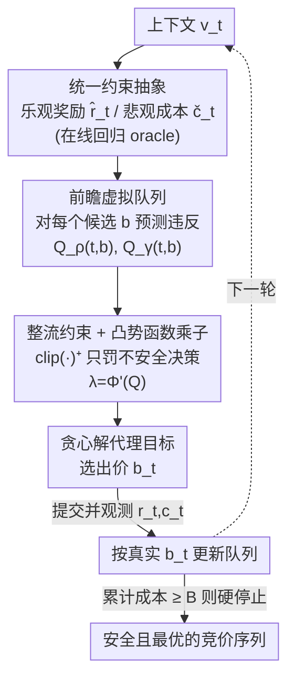

# Towards Safe and Optimal Online Bidding: A Modular Look-Ahead Lyapunov Framework

**会议**: ICLR 2026  
**OpenReview**: [https://openreview.net/forum?id=AtbRCnvcrZ](https://openreview.net/forum?id=AtbRCnvcrZ)  
**领域**: 学习理论 / 在线学习 / 约束优化  
**关键词**: 在线竞价, 预算约束, ROI 约束, 虚拟队列, Lyapunov 稳定性

## 一句话总结
本文提出 L2FOB——一个面向「同时受预算与 ROI 约束」的在线竞价的模块化框架：用乐观奖励 / 悲观成本估计 + **前瞻虚拟队列** + 凸势函数塑形的乘子，在**不依赖 Slater 条件**的前提下给出自适应的 regret 与「任意时刻 ROI 违反」上界，并在多种拍卖 / 反馈设定下达到或超过已有最优结果。

## 研究背景与动机

**领域现状**：自动竞价（autobidding）是在线广告的核心，广告主要在一天 / 一周的预算上限内最大化累计收益。绝大多数已有在线竞价工作只考虑**预算约束**（Balseiro、Wang 等）——预算约束相对好处理，因为成本非负，可行性退化为单边地控制一个「累计资源」不超支。

**现有痛点**：现代广告市场还要求**盈利能力控制**，即 ROI（return-on-investment）约束 $\sum_t r(v_t,b_t)\ge\gamma\sum_t c(v_t,b_t)$。ROI 约束同时具有「packing + covering」性质：单步违反可以在后续轮次被弥补回来，所以必须做长视野规划。这带来两个麻烦：(1) Castiglioni et al. (2022) 用了合适的违反度量，但分析依赖 **Slater 条件**（存在严格可行的策略），而 ROI 约束的 Slater 条件难以验证，且与「预算耗尽即硬停止」不兼容；(2) Castiglioni et al. (2025) 同时纳入了预算与 ROI，但其度量只数「违反**次数**」而非「违反**量**」，因而无法真正在收益与违反量之间做权衡。

**核心矛盾**：在线竞价本质上要在「跑量（volume）↔ 盈利（profitability）」之间走钢丝——花得太快牺牲后期机会，花得太慢库存浪费，一味追量则压低 ROI。要把这件事做对，需要一个能**精确控制违反量**、又**不依赖 Slater**、还能**适配各种拍卖 / 反馈**（一价 / 二价、full / partial information）的统一框架，而现有方法都是为某个特定环境定制的。

**本文目标**：设计一个统一、模块化的安全竞价框架，对**预算 + ROI 双约束**给出自适应的可证明保证，且**不需要 Slater 条件**。

**切入角度**：作者把竞价抽象成一个一般的**约束在线学习**问题——把奖励 $r(v,b)$ 与成本 $c(v,b)$ 当作上下文 $v$ 与出价 $b$ 的一般函数，只要能提供奖励 / 成本的**在线回归 oracle**（业界标配），框架就能套到任意环境。再借鉴控制论里的 **Lyapunov 漂移分析 + 虚拟队列**思想，把约束违反建模成需要「稳定」的队列。

**核心 idea**：用**前瞻（look-ahead）虚拟队列**在出价前就预测每个候选出价会引起的违反量，配合「只追踪不安全决策」的整流（clip）和凸势函数塑形的时变乘子，把可行性「内化」到决策时刻，从而在不假设 Slater 的情况下获得安全且最优的竞价。

## 方法详解

### 整体框架

L2FOB（Look-ahead Lyapunov Framework for Online Bidding）是一个逐轮运行的 primal–dual 型框架。每一轮 $t$：观测上下文 $v_t$ → 用在线回归 oracle 构造**乐观奖励估计** $\hat r_t$ 与**悲观成本估计** $\check c_t$ → 对**每个候选出价 $b$** 计算两条**前瞻虚拟队列** $Q_\rho(t,b)$（预算）、$Q_\gamma(t,b)$（ROI）→ 贪心地最大化一个「奖励 − 约束惩罚」的代理目标选出 $b_t$ → 提交出价、观测真实 $r_t,c_t$、用真实出价 $b_t$ 更新队列 → 若累计成本达到预算 $B$ 则**硬停止**。

这里的几个名词：

- 乐观 / 悲观估计：在高概率事件下，$\hat r_t(v,b):=\bar r_t(v,b)+\varepsilon^r_t$ 是奖励的上置信界（鼓励探索），$\check c_t(v,b):=\bar c_t(v,b)-\varepsilon^c_t$ 是成本的下置信界（保守计费），其中 $\varepsilon^r_t,\varepsilon^c_t$ 是 oracle 误差，满足 $|\bar r_t-r|\le\varepsilon^r_t$、$|\bar c_t-c|\le\varepsilon^c_t$（Assumption 1）。
- 两条虚拟队列 $Q_\rho,Q_\gamma$：分别追踪预算与 ROI 的实时可行性，可视为随机 / 马尔可夫过程，是 Lyapunov 分析里要「稳定」的状态。
- 势函数 $\Phi(\cdot)=(\cdot)^2$：把队列长度映射成时变乘子 $\lambda_\rho(t):=\Phi'(Q_\rho(t,b))$、$\lambda_\gamma(t):=\Phi'(Q_\gamma(t,b))$，用导数当 Lagrange 乘子。

### 关键设计

**1. 统一的约束在线学习抽象 + 乐观/悲观插值估计：让一个框架吃下所有拍卖与反馈设定**

已有方法都是为「一价 / 二价」「bandit / 凸优化」「full / partial information」某一种环境定制的，换个环境就要重做分析。L2FOB 把竞价写成一个一般的约束优化（式 1）：

$$\max_{\{b_t\}}\sum_{t=1}^T r(v_t,b_t)\quad\text{s.t.}\quad\sum_t c(v_t,b_t)\le B,\quad\sum_t r(v_t,b_t)\ge\gamma\sum_t c(v_t,b_t),$$

刻意**不指定** $v,r,c$ 的具体形式——$v$ 可以是私有价值，也可以是 pCTR / pCVR 等预测特征，$r,c$ 可以是用户自定义函数。框架只要求一个温和的 oracle 假设（Assumption 1）：存在在线学习 oracle 使估计误差被 $\varepsilon^r_t,\varepsilon^c_t$ 控住，并定义累计误差 $E_r(T,p):=\sum_t\varepsilon^r_t$、$E_c(T,p):=\sum_t\varepsilon^c_t$。在高概率事件下构造的乐观奖励 / 悲观成本满足 $0\le\hat r_t-r\le 2\varepsilon^r_t$、$0\le c-\check c_t\le 2\varepsilon^c_t$，把「估计不确定性」干净地转嫁到累计误差项上。这套抽象的价值在于：所有理论保证最终都写成 $E_r,E_c$ 的函数，换环境只需换 oracle、代入对应的 $\varepsilon$ 即可，无需重证。

**2. 前瞻虚拟队列：在出价前就预测违反，把可行性内化到决策时刻**

这是 L2FOB 区别于以往工作的核心。以往的 primal–dual / 虚拟队列方法（Slivkins、Guo & Liu 等）都是**观测到成本反馈之后**才更新对偶变量 / 队列——队列只记录「过去发生过的违反」，本质是「事后追责」。L2FOB 反过来：对**每个候选出价 $b$**，先算一条前瞻队列，把这步出价**将会引起**的违反预测进去：

$$Q_\rho(t,b)=Q_\rho(t-1)+\eta_\rho\big(\mathbb{E}_v[\check c_t(v,b)]-\rho\big)^+,\quad Q_\gamma(t,b)=Q_\gamma(t-1)+\eta_\gamma\big(\mathbb{E}_v[\gamma\check c_t(v,b)-\hat r_t(v,b)]\big)^+.$$

队列在这里充当**动态配速（pacing）变量**，调节探索与保守的程度。因为把「预测违反」装进了队列，算法在决策时就「内化」了可行性，而不是只盯着历史，从而获得更精准的安全控制。作者点明这与**一步模型预测控制（MPC）**精神相通：用 Lyapunov 函数当长期性能的代理，控制器贪心优化一步预测；不同之处在于这里 Lyapunov 的「状态」是追踪约束的虚拟队列，而非被控对象的物理状态。

**3. 整流约束（clip）+ 凸势函数塑形乘子：在没有 Slater 条件的前提下保证 Lyapunov 稳定**

选出 $b_t$ 时，L2FOB 贪心最大化如下代理目标（式 8）：

$$\hat r_t(v_t,b)-\Phi'(Q_\rho(t,b))\,\eta_\rho\big(\mathbb{E}_v[\check c_t(v,b)]-\rho\big)^+-\Phi'(Q_\gamma(t,b))\,\eta_\gamma\big(\mathbb{E}_v[\gamma\check c_t(v,b)-\hat r_t(v,b)]\big)^+.$$

它形如一个近似 Lagrangian，但有三处关键区别。**其一，整流算子 $(\cdot)^+$**：罚项只在「估计约束被违反」时才激活，约束看似满足时算法专注于最大化奖励——与以往「虚拟队列直接累积违反量」不同，L2FOB **只追踪「不安全决策」**，从而得到更严格的安全性与更强的保证。**其二，mean-field 方式**：用 $\mathbb{E}_v[\cdot]$ 对上下文边缘分布取期望来施加约束，把惩罚聚焦在「系统性风险」上而非逐上下文的噪声，得到更平滑的安全控制。**其三，凸势函数塑形**：对偶乘子取 $\lambda=\Phi'(Q)$，论文用经典二次势 $\Phi(x)=x^2$ 即足够，但保留可调设计以灵活控制违反。整流约束 + 前瞻队列 + 凸势函数三者合力，使分析（Lemma 1→2）能在**不假设 Slater 条件**的情况下证明虚拟队列的稳定性 $\mathbb{E}[Q_\rho(t)],\mathbb{E}[Q_\gamma(t)]=O(\sqrt T)$——这正是以往工作绕不开 Slater 的地方。

### 损失函数 / 训练策略

无需训练神经网络；核心是逐轮的 primal–dual 在线更新。关键超参为对偶步长 $\eta_\rho,\eta_\gamma$，理论上取 $\sqrt T$，但得益于整流设计，$\eta$ 可在 $\Theta(1)$ 到 $\Theta(T)$ 之间自由取值而不影响保证（实验里用常数 $0.6$）。势函数默认 $\Phi(x)=x^2$。

## 实验关键数据

理论结果（主定理）：在 Assumption 1 下，L2FOB 达到

$$\text{Regret}(T)=O\!\Big(E_r(T,p)+\tfrac{\nu^\*}{\rho}E_c(T,p)\Big),\qquad V_{\text{ROI}}(t)=O\big(E_r(T,p)+E_c(T,p)\big),\ \forall t\in[T],$$

其中 $\rho$ 为每轮平均预算、$\nu^\*$ 为离线最优平均奖励。这是已知**首个**对安全在线竞价同时给出 regret 与 ROI 违反的自适应保证，且 ROI 违反是**任意时刻（anytime）**的（以往工作只在终点 $T$ 给保证）。

### 主实验（理论实例化对比）

| 设定 | 对照工作 | L2FOB 的 regret / 违反 | 相对改进 |
|------|---------|----------------------|---------|
| 一价拍卖 + 预算 | Wang et al. (2023) | $\tilde O\big((1+\nu^\*/\rho)\sqrt T\big)$，anytime ROI $\tilde O(\sqrt T)$ | 把 $\tilde O\big((1+\nu^\*/\rho^2)\sqrt T\big)$ 改进了 $1/\rho$ 倍，小预算 $B=\Omega(\sqrt T)$ 仍有意义 |
| 二价拍卖 + 预算 + ROI | Castiglioni et al. (2025) | sublinear regret + sublinear 违反，且显式考虑硬停止 | 对方无 ROI 违反度量、未考虑硬停止 |
| 约束上下文 bandit | Guo et al. (2025) | 匹配 best-known，oracle 更准时还能更紧 | 持平 SOTA，且可随更强 oracle 收紧 |

### 数值实验

| 实验 | 设置 | 结果 |
|------|------|------|
| 一价拍卖（Fig.1） | $T=10^4,\ B=100,\ \rho=0.01,\ \gamma=1.8$，$v_t\sim N(0.6,0.1)$、$d_t\sim N(0.4,0.1)$ | L2FOB 在奖励与 ROI 上都显著优于 Wang et al. (2023)；ROI 稳定达到阈值 1.8，对照方法（不显式管 ROI）持续低于阈值 |
| 约束 bandit / MSLR-WEB30k（Fig.2） | $T=5000,\ B=1000,\ \rho=0.2,\ \gamma=1.3$，GBDT 当奖励 oracle | L2FOB 在平均奖励与 ROI 上持续优于 Guo et al. (2025)，并稳定满足 ROI 目标 |

### 消融实验（$\eta_\gamma$ 敏感性，Fig.3）

| $\eta_\gamma$ | 现象 | 说明 |
|---------------|------|------|
| 0.06 / 0.6 / 6 | 在累计奖励与 ROI 违反间温和权衡 | 步长越大越偏保守满足约束 |
| 60 | 与 $\eta_\gamma=6$ 几乎无差别 | 整流设计使大步长不致过度保守 |

每条曲线为 20 个随机种子均值、阴影为 95% 置信区间。

### 关键发现
- **前瞻 + 整流是关键**：把违反预测进队列、且只罚不安全决策，使 ROI 在整段时间内稳定贴着阈值（anytime 保证的实证），而仅有预算控制的基线达不到目标盈利。
- **对步长鲁棒**：$\eta_\gamma$ 跨三个数量级（0.06→6）结果平滑变化，到 60 几乎饱和——印证「步长足够大后再加无明显影响」的理论分析，实践中不必精调。
- **理论实践有缝但稳健**：理论假设可访问上下文分布做 mean-field 评估，实践中直接用当前 $v_t$ 选 $b_t$ 的变体在所有实验里仍表现优越。

## 亮点与洞察
- **把控制论的 Lyapunov 漂移 + 虚拟队列搬进竞价**，并创新地做成「前瞻」队列——决策前预测违反，类比一步 MPC，是把「事后追责」改成「事前内化」的漂亮迁移。
- **去掉 Slater 条件**：整流约束 $(\cdot)^+$ + 凸势函数让稳定性证明不再依赖「存在严格可行策略」，这对 ROI 约束这种难验证 Slater、又要兼容预算硬停止的实际场景特别有价值。
- **模块化 oracle 抽象**让所有保证写成累计误差 $E_r,E_c$ 的函数，换环境只换 oracle——这种「分析与环境解耦」的写法可迁移到其他约束在线决策问题。

## 局限与展望
- **不提供严格零违反**：作者坦言只在「存在 Slater」且额外收紧问题（如把 $\gamma$ 替成 $\gamma+\delta$）时才能强制零违反；默认设定下只能保证低违反量。
- **mean-field 假设与实现有落差**：理论要访问上下文分布，实践用单点 $v_t$ 近似，虽实证稳健但缺理论刻画。
- **实验规模偏小 / 偏合成**：一价实验是合成分布，bandit 用 MSLR-WEB30k，离真实大规模 autobidding 流量仍有距离；可在更复杂的 partial-information / 二价真实数据上进一步验证。

## 相关工作与启发
- **vs Wang et al. (2023)**：他们只管预算、一价，regret 实为 $\tilde O((1+\nu^\*/\rho^2)\sqrt T)$，小预算下失效；L2FOB 同管预算 + ROI，改进到 $\tilde O((1+\nu^\*/\rho)\sqrt T)$，小预算仍有效，且给出显式违反量保证。
- **vs Castiglioni et al. (2025)**：他们同纳预算 + ROI，但只数违反**次数**、不数违反**量**，也不显式处理硬停止；L2FOB 控制违反量、显式考虑硬停止、给 anytime 保证。
- **vs Guo et al. (2025)**：他们用 mean-field 绕过 Slater，但只针对单约束的上下文 bandit；L2FOB 把这套思想推广到「预算 + ROI 双约束 + 多环境」，持平其 SOTA 并能随更强 oracle 收紧。

## 评分
- 新颖性: ⭐⭐⭐⭐⭐ 前瞻虚拟队列 + 去 Slater 的 Lyapunov 框架，首个对安全竞价给 regret 与 anytime ROI 双自适应保证。
- 实验充分度: ⭐⭐⭐⭐ 理论实例化对比扎实，但数值实验规模偏小、偏合成。
- 写作质量: ⭐⭐⭐⭐⭐ 问题动机清晰，理论与实例化层层递进，可读性强。
- 价值: ⭐⭐⭐⭐⭐ 直击真实 autobidding 的预算 + 盈利双约束，模块化设计落地友好。

<!-- RELATED:START -->

## 相关论文

- [\[AAAI 2026\] A Switching Framework for Online Interval Scheduling with Predictions](../../AAAI2026/learning_theory/a_switching_framework_for_online_interval_scheduling_with_pr.md)
- [\[ICLR 2026\] Online Decision-Focused Learning](online_decision-focused_learning.md)
- [\[ICLR 2026\] Online Learning and Equilibrium Computation with Ranking Feedback](online_learning_and_equilibrium_computation_with_ranking_feedback.md)
- [\[ICLR 2026\] Oracle-Efficient Hybrid Online Learning with Constrained Adversaries](oracle-efficient_hybrid_learning_with_constrained_adversaries.md)
- [\[ICLR 2026\] Online Conformal Prediction with Adversarial Semi-bandit Feedback via Regret Minimization](online_conformal_prediction_with_adversarial_semi-bandit_feedback_via_regret_min.md)

<!-- RELATED:END -->
