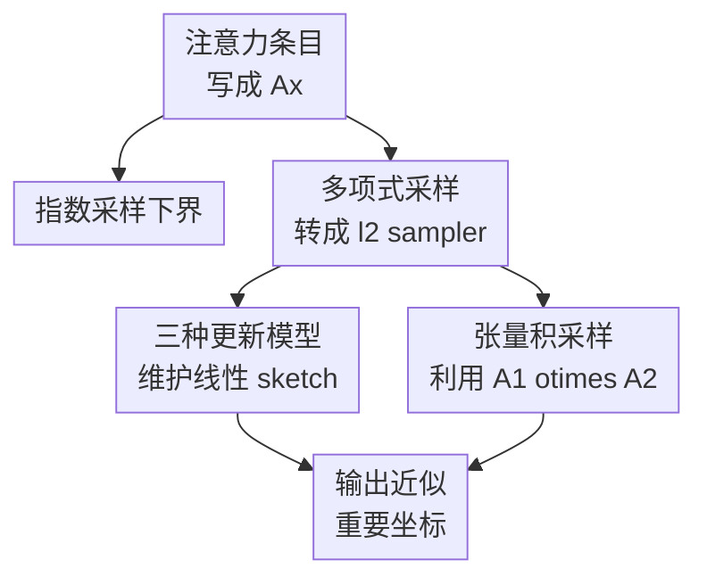

# Towards Sampling Data Structures for Tensor Products in Turnstile Streams

**会议**: ICLR2026  
**OpenReview**: [https://openreview.net/forum?id=ZgLEEp7AwL](https://openreview.net/forum?id=ZgLEEp7AwL)  
**代码**: 无  
**领域**: 学习理论 / 流算法 / 随机化数据结构  
**关键词**: 注意力采样, turnstile stream, 张量积, $\ell_2$ sampler, sketching  

## 一句话总结

这篇论文把注意力矩阵里的“重要坐标”形式化为流式采样问题，证明 softmax/指数采样在一般 turnstile stream 中避不开二次空间障碍，同时给出 polynomial attention 对应的 $\ell_2$ 采样器与 tensor product 版本的数据结构。

## 研究背景与动机

**领域现状**：Transformer 的注意力机制本质上要处理 $QK^\top$ 这样的两两交互矩阵。若序列长度为 $n$，完整注意力矩阵有 $n^2$ 个条目；在长上下文、流式生成、在线检索或动态 KV cache 场景中，显式维护全部条目会很快变成空间和更新时间瓶颈。理论上，近年的 fast attention、sparse attention、kernel attention 与 sketching 工作都在试图避免完整二次矩阵。

**现有痛点**：许多稀疏注意力方法会先找出 attention matrix 中最重要的一批条目，再用这些条目构造 mask 或近似计算。但“找重要条目”本身往往被当成一个离线操作：如果已经有完整矩阵，当然可以直接算每个 entry 的权重；真正困难的是，当输入矩阵或权重向量以数据流方式不断更新，而且更新可以增加也可以删除时，算法是否还能用远小于 $n^2$ 的空间持续报告重要坐标。

**核心矛盾**：softmax attention 采用 $\exp(\cdot)$ 权重，少数大 entry 会被指数放大，这使采样分布非常尖锐；而 streaming algorithm 只能保留 sketch 或摘要，不能存下所有 entry。论文要回答的不是“能不能近似注意力值”，而是更具体的“能不能在流式更新下按注意力权重采样出重要坐标”。这个问题比普通矩阵向量乘更贴近 sparse attention mask 的构造，也更容易暴露 softmax 与 polynomial attention 在数据结构上的差异。

**本文目标**：作者把问题拆成三层。第一层定义 general attention sampler：给定隐式向量 $Ax$，按某个函数 $g((Ax)_i)$ 诱导的分布抽样坐标。第二层分别研究指数函数 $g(z)=\exp(z)$ 与多项式/平方函数 $g(z)=|z|^2$，说明前者有强下界、后者可用 $\ell_2$ sampler 技术处理。第三层回到注意力矩阵的 tensor product 形式 $A=A_1\otimes A_2$，在只更新 $A_1$ 或 $A_2$ 的场景中避免显式维护 $n^2\times d^2$ 的张量矩阵。

**切入角度**：论文的关键观察是，线性注意力矩阵可以写成一个张量积矩阵与向量的乘积。若 $X=W_QW_K^\top$，$x=\mathrm{vec}(X)$，则 $\mathrm{vec}(A_1XA_2^\top)=(A_1\otimes A_2)x$。这样，注意力条目采样可以被转化成“从隐式向量 $Ax$ 或 $(A_1\otimes A_2)x$ 中按坐标权重采样”的流算法问题。

**核心 idea**：用 streaming sampler 的视角重新审视 attention sparsification：softmax 的指数采样在一般情形下需要近二次空间，而 polynomial attention 对应的 $\ell_2$ 分布可以通过线性 sketch、AMS 估计与 CountSketch 在 turnstile stream 中高效维护。

## 方法详解

### 整体框架

论文没有提出一个可训练模型，而是给出一套理论数据结构框架。输入是动态更新的矩阵 $A$、向量 $x$，或更结构化的 $A_1,A_2,x$；输出是在任意时刻采样一个坐标 $i$，其概率近似正比于注意力条目的某种权重。作者先定义 attention sampler，再用下界说明 softmax/指数权重在 streaming 中无法普遍高效，随后把 polynomial attention 转成 $\ell_2$ sampling，并在三个更新模型与一个 tensor product 模型中给出空间和更新时间保证。

这张图里的分叉也对应论文的论证结构：指数采样给出负面结果，说明直接模拟 softmax 的采样分布很难；多项式采样给出正面结果，说明如果把权重换成平方幅值，经典 $\ell_2$ sampler 可以被接到 attention 的张量结构上。

### 关键设计

**1. 注意力采样器：把 sparse attention 的“找重条目”变成可证明的采样分布**

论文首先定义 attention sampler：给定 $A\in\mathbb{R}^{n^2\times d^2}$、$x\in\mathbb{R}^{d^2}$ 和分布函数 $g$，采样坐标 $i$ 的概率为 $p_i=g((Ax)_i)/\sum_j g((Ax)_j)$。这个定义看似直接，但它把 attention sparsification 中常见的“挑重要 entry”从启发式选择变成了一个明确的数据结构目标：算法不需要恢复整张注意力矩阵，只需要按正确分布返回一个坐标。

更重要的是，$Ax$ 不是随便来的向量。对线性 cross-attention，有 $QK^\top=A_1W_QW_K^\top A_2^\top$；令 $X=W_QW_K^\top$、$x=\mathrm{vec}(X)$，就有 $\mathrm{vec}(QK^\top)=(A_1\otimes A_2)x$。因此，sampling data structure 的对象正是 tensor product 诱导出的隐式注意力条目，而不是普通稠密向量。这一步把 LLM/attention 的二次矩阵瓶颈翻译成了流算法里熟悉的隐式向量采样问题。

**2. 指数采样下界：softmax 分布的尖锐性会放大 streaming 空间需求**

对于 $g(z)=\exp(z)$ 的 exponential sampler，论文证明即使允许采样概率有多项式因子 $n^C$ 的扭曲，并且 $\|Ax\|_\infty=O(\log n)$，任何算法仍需要 $\Omega(n^2)$ 量级空间。证明思路来自 set-disjointness 通信复杂度：Alice 和 Bob 各持有一个集合，把它们编码成流式更新后的向量；如果两集合有唯一交点，对应坐标的值会比其他坐标大 $\Theta(\log n)$，指数函数会把这个差距放大到 sampler 必须以常数概率返回交点。

这个构造的锋利处在于，它不是依赖极端巨大 entry 才成立。即便所有坐标被限制在 $O(\log n)$ 范围内，softmax 的指数放大仍足以让采样器承担通信复杂度问题的判别能力。于是，若一个 streaming sampler 真能小空间实现这种采样，Alice 只需把算法状态发给 Bob，Bob 再查询样本就能解决 set-disjointness；这与 $\Omega(n)$ 通信下界矛盾。回到原始注意力矩阵有 $n^2$ 条目时，就得到二次空间屏障。

**3. 多项式采样上界：把 polynomial attention 归约到 $\ell_2$ sampler 的 sketch 维护**

正面结果来自把采样权重改为 $g(z)=|z|^2$，也就是按 $p_i\propto |(Ax)_i|^2$ 抽样。这个分布正好对应经典 $\ell_2$ sampling：若 $y=Ax$，目标是输出 $I$，使 $\Pr[I=j]=(1\pm\epsilon)|y_j|^2/\|y\|_2^2+1/\mathrm{poly}(n)$。因为许多 polynomial attention 或 softmax-free attention 已被用来近似 softmax，这个选择不是随意降级，而是在理论可处理性与 attention 近似之间找一个可证明接口。

论文分别处理三种流式更新模型。若 $A$ 更新而 $x$ 固定，维护标准 $\ell_2$ sampler 需要的线性 sketch $\Phi y=\Phi Ax$；单次 $A_{ij}$ 更新 $\Delta$ 时，可以用 $\Phi e_i e_j^\top\Delta x$ 更新 sketch，空间约为 $d\log n+\mathrm{poly}(1/\epsilon,\log n)$。若 $A$ 固定而 $x$ 更新，则提前维护 $\Phi A$，每次 $x$ 单坐标变化只需改动 $x$ 自身，更新时间为 $O(1)$，空间为 $d\cdot\mathrm{poly}(1/\epsilon,\log n)$。若 $A$ 与 $x$ 都更新，则同时维护 $\Phi A$ 和 $x$，更新时间回到 $\mathrm{poly}(1/\epsilon,\log n)$，空间仍只线性依赖 $d$ 的 sketch 规模。

**4. 张量积采样：不显式展开 $A_1\otimes A_2$，而是在结构上做 CountSketch 与尾部估计**

最后一部分回到真正的 tensor product 形式 $y=(A_1\otimes A_2)x\in\mathbb{R}^{n^2}$。如果直接展开 $A=A_1\otimes A_2$ 再套前面的算法，就会面对 $n^2$ 级别的对象。论文考虑更结构化也更贴近 autoregressive attention 的情形：$x$ 固定，$A_1$ 和 $A_2$ 中只有一个以流方式更新，另一个是静态参考矩阵。此时可以存储 $A_1,A_2$ 的原始 $O(nd)$ 信息，而不是 $O(n^2d^2)$ 的 Kronecker 展开。

采样机制沿用 $\ell_2$ sampler 的“随机放大再取最大”套路：对每个坐标生成均匀随机数 $u_i$，构造 $w_i=y_i/\sqrt{u_i}$；若能估计 $\|y\|_2$、尾部向量 $z$ 的范数，并用 CountSketch 近似每个 $w_i$ 到 $\epsilon\|z\|_2$ 加性误差，就能按 $y_i^2/\|y\|_2^2$ 的概率返回坐标。TensorSketch/CountSketch 的作用是让算法在不枚举所有 $(i_1,i_2)$ 的情况下估计这些候选值；Nisan PRG 则用于控制随机性所需空间。最终 tensor 版本使用 $O(nd)+\mathrm{poly}(1/\epsilon,\log n)$ 空间和 $O(n)$ 更新时间，比显式 $O(n^2)$ 存储更贴合长序列注意力场景。

### 一个完整示例

可以把一个流式检索增强模型想成下面的例子。系统有 $n$ 个静态知识库向量作为 key 侧 $A_2$，当前对话不断产生 query 侧表示 $A_1$ 的更新；某些用户请求被撤回或隐私删除时，turnstile stream 允许对应条目做负更新。完整注意力矩阵会包含所有 query-key 对的 $n^2$ 个交互条目，但 sparse attention 只想知道哪些坐标最值得保留。

在 softmax 采样视角下，算法要按 $\exp((A_1\otimes A_2)x)_i$ 的比例抽样。论文的下界说，在最坏情况下，这件事本身就携带足够的信息来恢复 set-disjointness 的交点，因此一般不能期望小空间完成。换成 polynomial attention 后，目标变为按 $|(A_1\otimes A_2)x_i|^2$ 采样；算法为坐标分配随机缩放 $u_i$，用 sketch 估计被放大的候选 $w_i$，并通过尾部范数门槛判断最大候选是否可靠。若某个 query-key pair 的平方幅值确实占主导，它更可能在随机放大后成为可检出的最大项，从而被 sampler 返回。

这个例子也说明论文的“采样”不是为了生成 token，而是为了构造稀疏注意力 mask 或找到重要 attention entry。它给的是数据结构层面的可行性边界：哪些权重函数在动态流式环境下可维护，哪些权重函数即便放宽近似也会撞上通信复杂度下界。

### 损失函数 / 训练策略

本文不是训练方法论文，没有神经网络损失函数或优化策略。理论保证主要由四类工具组成：set-disjointness 与 INDEX 的通信复杂度下界、标准 $\ell_2$ sampler、AMS $\ell_2$ 范数估计、CountSketch/TensorSketch 的尾部误差控制。论文的“训练策略”可理解为数据结构维护策略：流中每次更新只改动 sketch 状态，查询时利用 sketch 输出近似符合目标分布的坐标。

## 实验关键数据

### 主实验

论文没有真实数据集实验，主结果是理论复杂度对比。下面把核心 theorem 按“任务设置—空间—更新时间—结论”整理出来。

| 设置 | 目标分布 | 空间复杂度 | 更新时间 | 主要结论 |
|------|----------|------------|----------|----------|
| 指数采样，$A$ 或 $x$ 流式更新 | $p_i\propto \exp((Ax)_i)$ | $\Omega(n^2)$ bits（注意力矩阵规模） | 下界结果 | 即使允许 $n^C$ 概率扭曲且 $\|Ax\|_\infty=O(\log n)$，仍无法小空间实现 |
| $A$ 更新、$x$ 固定 | $p_i\propto |(Ax)_i|^2$ | $d^2\log n+\mathrm{poly}(1/\epsilon,\log n)$ bits（原文总述采用 attention 维度） | $\mathrm{poly}(1/\epsilon,\log n)$ | 可维护 $\Phi Ax$，支持 polynomial attention 采样 |
| $A$ 固定、$x$ 更新 | $p_i\propto |(Ax)_i|^2$ | $d^2\mathrm{poly}(1/\epsilon,\log n)$ bits | $O(1)$ | 预存 $\Phi A$ 后，单坐标 $x$ 更新很便宜 |
| $A$ 与 $x$ 都更新 | $p_i\propto |(Ax)_i|^2$ | $d^2\mathrm{poly}(1/\epsilon,\log n)$ bits | $\mathrm{poly}(1/\epsilon,\log n)$ | 两边动态时仍可保持对 $n$ 的次线性依赖 |
| Tensor 版本，$A_1$ 或 $A_2$ 更新 | $p_i\propto |((A_1\otimes A_2)x)_i|^2$ | $O(nd)+\mathrm{poly}(1/\epsilon,\log n)$ | $O(n)$ | 避免显式存储 $O(n^2)$ 个 attention entry |

### 消融实验

这里没有传统消融，最接近消融的是不同函数、不同更新模型和不同结构假设带来的复杂度变化。

| 配置 | 关键指标 | 说明 |
|------|----------|------|
| softmax / exponential sampler | 空间 $\Omega(n^2)$ | 指数函数让重坐标过度放大，最坏情况下可以编码通信复杂度难题 |
| polynomial / $\ell_2$ sampler | 空间对 $n$ 次线性或只在 tensor 版为 $O(nd)$ | 平方权重可接入成熟的 $\ell_2$ sampling 与 sketch 技术 |
| 只更新 $x$，固定 $A$ | 更新时间 $O(1)$ | 预维护 $\Phi A$ 后，流式更新只落在低维 $x$ 上 |
| 同时更新 $A,x$ | 下界 $\Omega(d^2)$（attention 维度表述） | 论文还证明这类问题至少要存与特征维度平方同阶的信息 |
| 显式 Kronecker 展开 | 空间 $O(n^2)$ 或更高 | 作为 naive baseline，会直接失去长序列注意力场景的意义 |
| 结构化 tensor sampler | 空间 $O(nd)+\mathrm{poly}(1/\epsilon,\log n)$ | 利用 $A_1\otimes A_2$ 的结构而不是把它当普通稠密矩阵 |

### 关键发现

- softmax attention 的采样难点不是单纯来自“矩阵很大”，而是来自指数权重对坐标差异的放大；即使 entry 被限制到 $O(\log n)$，下界仍然成立。
- polynomial attention 与 $\ell_2$ sampler 的匹配非常自然：$|z|^2$ 权重既有 attention 近似背景，又能被线性 sketch 与 CountSketch 维护。
- 更新模型决定复杂度的关键常数：固定 $A$、更新 $x$ 最容易，因为可预存 $\Phi A$；更新 $A$ 时，每次流更新会影响 sketch 的一列或一组条目。
- Tensor 版本的价值在于保留 $A_1\otimes A_2$ 的结构，避免把 attention matrix 当作普通 $n^2$ 维向量硬处理。
- 论文给出的是理论 feasibility map，而不是系统 benchmark；它回答“是否存在小空间采样器”，还没有回答“实际 Transformer 中这个 sampler 的质量和开销如何”。

## 亮点与洞察

- 把 sparse attention 的 mask 选择问题抽象成 sampling data structure，是这篇论文最清晰的贡献。它让“重要 attention entry”不再只是工程启发式，而是一个可以讨论概率分布、空间复杂度和更新复杂度的对象。
- softmax 下界很有启发性：很多 fast attention 工作会从近似 softmax 值入手，而这里说明如果目标是按 softmax 权重采样重坐标，那么最坏情况下甚至宽松近似都不够。这解释了为什么 polynomial attention、kernel attention 或 sparse approximation 往往更容易得到可维护结构。
- 多项式采样部分并没有发明全新的 sampler，而是把经典 $\ell_2$ sampler 放到了 attention 的隐式矩阵语境中。这个迁移很实用：一旦目标分布变成平方权重，已有 streaming sketch 工具就可以直接发挥作用。
- Tensor product 版本抓住了 attention 的真实结构。$A_1\otimes A_2$ 如果展开会非常吓人，但它来自两个 $n\times d$ 矩阵；算法复杂度从 $O(n^2)$ 存储降到 $O(nd)$，正是利用结构化数据表示的典型收益。
- 论文对 machine unlearning 和流式 LLM 的动机连接也比较自然。turnstile stream 允许负更新，能表达删除、撤回或遗忘数据，这比只 append 的 streaming 模型更贴近动态部署系统。

## 局限与展望

- 最大局限是没有真实模型实验。论文证明 polynomial sampler 可行，但没有展示在长上下文 Transformer、sparse attention mask 或 streaming KV cache 中实际能带来多少速度、显存或质量收益。
- 指数采样下界是最坏情况结果。实际 attention matrix 可能有低秩、局部性、稀疏性、bounded entries 或分布假设；在这些结构化条件下，是否能实现 $o(n^2)$ 的 softmax 采样仍是开放问题。
- polynomial attention 能否稳定替代 softmax，取决于具体模型、训练方式和任务。论文引用了相关经验结果，但自身没有验证 sampler 与模型精度之间的闭环。
- Tensor 版本目前只覆盖 $x$ 固定且 $A_1,A_2$ 中一个更新的设置。更一般的动态权重、双侧更新、多头注意力和层间复用还需要额外设计。
- 复杂度表达中有多处 $\mathrm{poly}(1/\epsilon,\log n)$ 隐藏因子；实际实现时这些因子、随机数生成、hash 冲突和常数开销可能决定方法是否可用。

## 相关工作与启发

- **vs 经典 $\ell_p$ sampler**: 经典流算法研究从显式流式向量中按 $|v_i|^p$ 采样；本文把向量换成隐式的 $Ax$ 或 $(A_1\otimes A_2)x$，难点在于流更新落在矩阵、向量或张量因子上，而不是直接给出 $y_i$。
- **vs sparse attention / long-context attention**: Sparse Transformer、Reformer、Linformer、HyperAttention 等工作多从模型结构或近似计算角度减少注意力开销；本文更底层，研究“按注意力条目重要性采样”这个子问题本身的 streaming 数据结构边界。
- **vs softmax approximation lower bounds**: Alman 与 Song 等工作讨论 softmax attention 的离线复杂度屏障；本文给出流式采样版本的空间下界，并且强调即使允许较大概率扭曲也无法绕过。
- **vs polynomial attention / PolySketchFormer**: Polynomial attention 工作说明 softmax-free 或 polynomial kernel 注意力有实际潜力；本文提供理论补充，解释为什么平方权重下可以接入 $\ell_2$ sketch，从而在流式场景中更容易维护。
- **vs TensorSketch / Kronecker sketching**: TensorSketch 传统上用于 polynomial kernels、Kronecker regression 和 tensor approximation；本文把它用于 attention matrix 的坐标采样，启发后续把张量 sketch 直接嵌入高效 attention 系统。

## 评分

- 新颖性: ⭐⭐⭐⭐☆ 从 attention sampler 角度统一 softmax 下界、polynomial 上界和 tensor product 采样，问题定义很有辨识度。
- 实验充分度: ⭐⭐☆☆☆ 作为理论论文证明较完整，但没有实证实验或系统实现，应用效果仍待验证。
- 写作质量: ⭐⭐⭐⭐☆ 主线清楚，定理分层明确；少数地方符号维度在主文简化版和 attention 版之间切换，需要读者自己对齐。
- 价值: ⭐⭐⭐⭐☆ 对 streaming algorithms、theoretical attention 和 sparse attention 数据结构都有参考价值，尤其适合作为后续系统化实现的理论边界。

<!-- RELATED:START -->

## 相关论文

- [\[ICML 2025\] Maximum Coverage in Turnstile Streams with Applications to Fingerprinting Measures](../../ICML2025/learning_theory/maximum_coverage_in_turnstile_streams_with_applications_to_fingerprinting_measur.md)
- [\[ICLR 2026\] Nearly Space-Optimal Graph and Hypergraph Sparsification in Insertion-Only Data Streams](nearly_space-optimal_graph_and_hypergraph_sparsification_in_insertion-only_data_.md)
- [\[ICLR 2026\] Characterizing Pattern Matching and Its Limits on Compositional Task Structures](characterizing_pattern_matching_and_its_limits_on_compositional_task_structures.md)
- [\[ICLR 2026\] Subspace Kernel Learning on Tensor Sequences](subspace_kernel_learning_on_tensor_sequences.md)
- [\[ICLR 2026\] How to Square Tensor Networks and Circuits Without Squaring Them](how_to_square_tensor_networks_and_circuits_without_squaring_them.md)

<!-- RELATED:END -->
