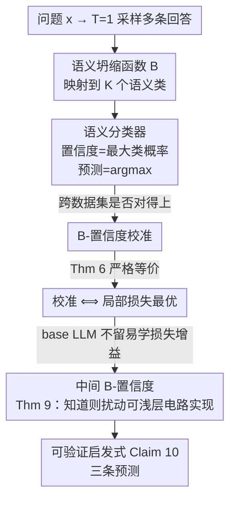

# Trained on Tokens, Calibrated on Concepts: The Emergence of Semantic Calibration in LLMs

**会议**: ICLR 2026  
**OpenReview**: [https://openreview.net/forum?id=0sCyk9Tr5J](https://openreview.net/forum?id=0sCyk9Tr5J)  
**代码**: 无  
**领域**: 学习理论 / 校准 / LLM 不确定性  
**关键词**: 语义校准, 置信度, 局部损失最优, B-校准, 涌现现象

## 一句话总结
这篇论文发现：只用 next-token 预测训练的 base LLM，竟然在**语义层面**也是良好校准的（它对自己答案"含义"的置信度能对得上真实正确率），并给出了一个基于"校准 ⟺ 局部损失最优"的理论机制来解释这种涌现，进而预测出 instruction-tuning 和 chain-of-thought 会破坏这种校准——三条预测都被实验证实。

## 研究背景与动机

**领域现状**：要知道一个 LLM"靠不靠谱"，常用的标准是**校准**（calibration）——模型说自己 80% 有把握的那批问题，实际正确率也应该是 80%。已有大量证据表明 base LLM（只用最大似然预训练）在 **next-token 级别**是校准的：在 True/False、单选这类一个 token 就编码了整个答案的任务上，这个 next-token 置信度直接可用。

**现有痛点**：但开放式问答的答案是长文本，"Paris is the capital"和"It's Paris"是同一个意思却由完全不同的 token 序列组成。我们真正关心的是模型对答案**语义**的置信度，而 next-token 校准根本不刻画这个。已有的语义置信度度量（verbalized confidence、semantic entropy 等）很多，但从经验数据看，**没人知道 LLM 在不专门训练校准的情况下，是否天然对这些语义置信度校准**。

**核心矛盾**：先验上，标准最大似然预训练没有任何理由会"顺带"产生语义校准——训练目标是 token 级的句法目标，校准是序列级的语义性质，两者隔着十万八千里。而且经验上校准看起来受太多因素影响（测试分布、后训练方式 RLHF/DPO、推理方式 CoT/few-shot、模型大小……），机理一团乱麻。

**本文目标**：① 定义一个合适的语义校准概念并测它；② 给出一个**原理性机制**解释它为何/何时涌现；③ 用这个机制预测哪些设置会破坏校准。

**切入角度**：作者把 LLM 当成一个**多类分类器**——把语义相同的输出"坍缩"成同一个类，于是开放式问答就变成了一个标准的 K 类分类问题，从而可以套用近年分类器校准理论中"校准与局部损失最优等价"的结果（Błasiok et al. 2023/2024）。

**核心 idea**：用一个"语义坍缩函数 $B$"把 LLM 变成语义分类器，证明 **B-校准 ⟺ 关于一族特定扰动 $\mathcal{W}_B$ 的局部损失最优**；base LLM 因为预训练时盯着 test loss、不留"容易学到的损失改进"，所以只要模型"知道"自己答案的语义类分布，就会自动语义校准。

## 方法详解

### 整体框架

整篇论文做两件事：**怎么测**语义校准，和**为什么会**涌现语义校准。

测量侧很直接：给定问题 $x$，按温度 $T=1$ 采样多条回答，用一个语义坍缩函数 $B$（实现上是用一个强 LLM 提取每条回答的"一词答案"）把每条回答映射到 $K$ 个语义类之一（如 Paris / Rome / Berlin）。这样就得到一个语义类上的经验分布，把它当作分类器输出：**语义置信度 = 最大类概率**，**语义预测 = argmax 的类**。如果在整个数据集上"置信度"和"是否命中真实语义类"对得上（70% 置信度的那批问题平均 70% 正确），就说模型是语义置信度校准的。

机制侧是核心贡献：作者沿着一条逻辑链（图 3）论证 base LLM 为何会满足上面这个性质。链条从右往左是——LLM 能否"知道"自己的语义类分布 → 若能则扰动族 $\mathcal{W}_B$ 容易表示 → base LLM 对易学扰动局部损失最优 → 因而 B-置信度校准。其中第一环（校准 ⟺ 损失最优）有严格证明，后面两环有"道义上相似"的弱化证明，整条链由实验兜底。

下图按"测量管线 → 理论机制链"自上而下展开（节点名即下方关键设计名）：

### 关键设计

**1. B-校准：把"语义"参数化成一个坍缩函数**

痛点是 next-token 校准在长文本上没意义，而"语义置信度"以往定义零散、无法纳入统一的分类器校准理论。作者引入一个坍缩函数 $B: V^* \times V^N \to [K]$，把"问题 + 回答"分到 $K$ 个类之一（$K$ 可任意大），通常取为"语义坍缩"——把意思相同的字符串归为一类。通过把 LLM 的输出分布沿 $B$ 做 pushforward，得到语义类上的分布

$$(B_x \sharp p_x)(k) = \Pr_{z\sim p_\theta(\cdot|x)}[B_x(z)=k] = \sum_{z:\,B_x(z)=k} p_\theta(z\mid x).$$

于是 $(x,y)$ 被转成 $(B_x\sharp p_x,\, B_x(y))$ 这样一个标准的"预测分布 + 真实标签"对，**B-置信度校准**就定义为这个 $K$ 类分类器满足 Definition 1 的置信度校准。妙处在于：$B$ 是任意可计算函数，因此同一个框架既能描述 next-token 校准（$B$ 取某个 token），也能描述语义校准（$B$ 取语义坍缩），把一堆零散概念统一成"对哪个 $B$ 校准"这一个问题。

**2. 校准 ⟺ 局部损失最优：用优化性质刻画统计性质**

这是全文的理论支点（Thm 6）。直觉是：一个**失校准**的模型，必然存在一个"简单"的后处理扰动能降低它的 test loss。比如模型在 70% 置信度处只有 60% 正确（过度自信），那把这批问题上多数语义类的概率质量往下压一点，cross-entropy 就能降——这是"白捡的便宜"。作者用**指数倾斜**（exponential tilting）定义扰动算子

$$(f \star w)[z] := \mathrm{softmax}\big(w[z] + \log f[z]\big),$$

并构造一族专门改"最可能语义类概率"的扰动 $\mathcal{W}_B$（按回答所属的 $B$ 类、用一个 $\tau(\cdot)$ 来加权）。Thm 6 证明：模型完美 B-置信度校准 **当且仅当** 它关于 $\mathcal{W}_B$ 局部损失最优。这把一个统计问题（校准）等价转成了优化问题（损失还能不能被这类扰动改进），并且附录里还推广到"近似校准 ⟺ 近似损失最优"以及任意 proper loss。

**3. 中间 B-置信度：为什么自回归模型"知道答案就能实现扰动"**

痛点在于 $\mathcal{W}_B$ 是定义在**整条序列**分布上的，而 LLM 只能逐 token 地修改概率——序列级扰动怎么落到 token 级？作者定义**中间 B-置信度**

$$g_i(z_{\le i}; x) := \Pr_{z\sim p_\theta(\cdot|x,z_{\le i})}[B_x(z)=k^*],$$

即在已生成前缀 $z_{\le i}$ 的条件下，模型放在自己最可能语义类上的概率。Thm 9 证明：只要模型"知道"这些 $g_i$（每个 $g_i$ 能由 LLM 之上一个小电路算出），那么任意 $w\in\mathcal{W}_B$ 扰动后的 next-token 分布就能写成原分布的一个简单重加权——$(p_x\star w_x)(z_i|z_{<i}) \propto C_w(a, g_i, g_0)$，$C_w$ 是常数深度、$\Theta(K)$ 宽度的算术电路。关键洞察：模型**不需要知道正确答案**，只要在开始生成前就能预测**自己**会落到哪个语义类。这正解释了为什么"我知道我大概要答 Paris-型答案"这件事，是校准的充要条件式前提。

**4. 三条可验证预测：把理论落到能做实验的启发式**

合起来得到主结论 Claim 10/Corollary 11：base LLM 会语义校准，**当且仅当** 映射 $G: x \mapsto B_x\sharp p_x$（问题 → 自身语义答案分布）对 LLM"易学"（如能用一个 LoRA adapter 拟合）。由此推出三条可证伪的预测：(1) **语义校准从标准预训练涌现**——因为多数问题模型"心里有数"自己要答哪类，所以一大类 base LLM 应天然语义校准；(2) **instruction-tuning 会破坏校准**——RLHF/DPO/RLVR 不是 proper loss，Thm 6 的等价不再成立，没理由保持校准；(3) **CoT 会破坏校准**——数学推理类问题模型在"想完"之前根本不知道最终答案，$G$ 难学，机制失效。CoT 之所以强（用更多算力换更好答案）恰恰是它破坏校准的原因。

## 实验关键数据

实验在 6 个开放式问答数据集（GSM8K、OpenMathInstruct-2、MATH500、TriviaQA、SimpleQA、TruthfulQA）上，跑 Qwen / Gemini / Mistral / Llama 系列（0.5B~72B、base 与 instruct）、3 种回答风格（concise / sentence / cot），共 **650+ 组实验**。校准误差用 SmoothECE（smECE）度量，全程 5-shot、$T=1$ 采样。

### 主实验

base 模型在 concise / sentence 风格下普遍良好校准（smECE 在 0.03~0.05 量级）：

| 数据集 | 模型 | 风格 | smECE |
|--------|------|------|-------|
| TriviaQA | Mistral-7B-v0.1 | sentence | 0.036 |
| TriviaQA | Qwen2.5-7B | sentence | 0.030 |
| SimpleQA | Llama-3.1-70B | sentence | 0.031 |
| GSM8K | Qwen2.5-7B | concise | 0.047 |
| GSM8K | gemma-3-27b-pt | concise | 0.031 |
| OpenMathInstruct | Qwen2.5-Math-72B | concise | 0.038 |

### 消融 / 配置对比

| 配置 | 是否校准 | 说明 |
|------|---------|------|
| base-concise / base-sentence | ✅ 可靠校准 | 理论预测校准，实验确认 |
| base-cot | ❌ 失校准（欠自信） | 数学题想完才知道答案，$G$ 难学 |
| instruct-* (concise/sentence/cot) | ❌ 多数失校准（过度自信） | RL 目标非 proper loss |
| Mistral-7B-v0.1 (base) | ✅ | proper loss |
| zephyr-7b-sft-full (仅 SFT) | ✅ 较好 | SFT 仍是 cross-entropy / proper loss |
| zephyr-7b-dpo-full (SFT+DPO) | ❌ 显著失校准 | DPO 非 proper loss，破坏校准 |

### 关键发现

- **语义校准基本与模型大小无关**：即便 ≤1B 的小 base 模型也相当校准，且 sentence 与 concise 风格都校准——印证理论"校准取决于模型是否在生成前知道语义类分布，而非具体措辞"。
- **同源对照最有说服力**：Mistral-7B 一脉中，base 和仅 SFT 版（proper loss）校准，加了 DPO 后显著失校准——精确隔离出"非 proper loss 后训练"是破坏校准的原因。
- **可学习性探针定量验证机制**：在 Qwen2.5 各尺寸上训 rank-8 LoRA 直接预测 $B_x\sharp p_x$，把 LoRA 的"到最优的 KL gap"（x 轴）与模型校准误差（y 轴）作图，二者正相关——越容易预测自身语义分布（KL gap 越小）的模型越校准，直接支撑 Claim 10。
- **TruthfulQA 是预期内的例外**：它专收人类常见误解，违反"in-distribution"假设，因此理论不适用、实测也失校准。

## 亮点与洞察
- **把"语义置信度"这个模糊概念彻底数学化**：一个任意坍缩函数 $B$ 就把 next-token 校准、语义校准统一成"对哪个 $B$ 校准"，框架极其干净，可复用到任何自定义等价类（不止语义）。
- **"校准 ⟺ 损失最优"这个等价非常解释性强**：它把"模型为什么校准"翻译成"模型有没有留下白捡的损失便宜"，顺带解释了 LLM 与图像分类器校准状态迥异的原因——LLM 训练盯 test loss 且早停（接近 loss 最优 → 校准），分类器训练盯分类错误、常过拟合 test loss（→ 失校准）。
- **CoT 破坏校准的解释很反直觉又很到位**：让 CoT 变强的东西（生成前不知道答案、靠思考产出更好答案）恰恰是让校准机制失效的东西，把"能力"和"自知之明"的张力讲透了。
- **LoRA 探针把抽象理论变成可操作工具**：想知道某模型在某任务上会不会校准，不用跑完整校准评估，训个小 LoRA 看它能不能预测自身语义分布即可。

## 局限与展望
- 作者明说**只提出了一种可能机制**，不排除还有别的校准（如 verbalized calibration）因尚未发现的原因涌现。
- 理论链条中只有第一环（Thm 6）是严格证明，后两环（base LLM 损失最优假设、$\mathcal{W}_B$ 易表示）是"道义相似"的弱化结论 + 实验兜底，严格性上有缺口。
- 核心结论依赖"in-distribution"假设——TruthfulQA 这类含分布偏移/误解的数据会失效；现实部署里分布偏移普遍，适用范围需谨慎。
- 语义坍缩函数 $B$ 由一个强辅助 LLM 实现，$B$ 本身的噪声/偏差会进入校准测量，论文未深入分析这层敏感性。
- 改进方向：把"$G$ 是否易学"从启发式做成可计算的、无需训 LoRA 的判据；以及把机制推广到 instruct 模型上、刻画后训练到底改了哪部分分布。

## 相关工作与启发
- **vs 语义熵（Farquhar et al. 2024）**: 语义熵也走"采样 + 语义聚类"路线度量不确定性，但只是一个度量；本文给的是**为什么这种语义置信度天然校准**的机制性解释，并把它纳入分类器校准理论。
- **vs Błasiok et al. 2023/2024（校准 ⟺ 损失最优）**: 本文站在其肩膀上，把"proper loss 下校准涌现"的一般结论**特化到自回归 LLM 的序列级语义**，并通过中间 B-置信度（Thm 9）解决"序列级扰动如何 token 级实现"这一 LLM 独有的难点。
- **vs next-token 校准研究（OpenAI 2023; Kadavath et al. 2022）**: 它们证明 base LLM 在 token / 单选层面校准；本文把校准从 token 抬到**语义**层面，并解释了 instruction-tuning、CoT 为何破坏它——回答了前人观察到却没机理的现象。

## 评分
- 新颖性: ⭐⭐⭐⭐⭐ 首个给"LLM 语义校准何时、为何涌现"的原理性机制，框架统一且预测可证伪。
- 实验充分度: ⭐⭐⭐⭐ 650+ 实验跨模型/数据/风格，含同源对照与 LoRA 定量探针；缺真实分布偏移下的系统验证。
- 写作质量: ⭐⭐⭐⭐⭐ 理论与实验、直觉与形式化衔接清晰，逻辑链（图 3）讲得很透。
- 价值: ⭐⭐⭐⭐⭐ 给"LLM 不确定性"研究提供了坚实理论地基，并给出可操作的校准预测工具。

<!-- RELATED:START -->

## 相关论文

- [\[ICLR 2026\] Robust Decision Making with Partially Calibrated Forecasts](robust_decision-making_with_partially_calibrated_forecasters.md)
- [\[ICLR 2026\] Practical Estimation of the Optimal Classification Error with Soft Labels and Calibration](practical_estimation_of_the_optimal_classification_error_with_soft_labels_and_ca.md)
- [\[ICLR 2026\] The Softmax Bottleneck Does Not Limit the Probabilities of the Most Likely Tokens](the_softmax_bottleneck_does_not_limit_the_probabilities_of_the_most_likely_token.md)
- [\[ICLR 2026\] CLEAR: Calibrated Learning for Epistemic and Aleatoric Risk](clear_calibrated_learning_for_epistemic_and_aleatoric_risk.md)
- [\[ICLR 2026\] Intrinsic Entropy of Context Length Scaling in LLMs](intrinsic_entropy_of_context_length_scaling_in_llms.md)

<!-- RELATED:END -->
