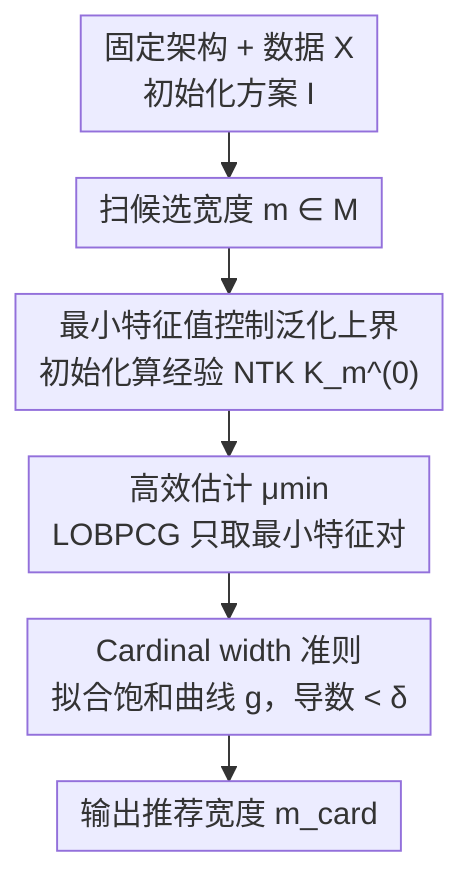

# Training-Free Determination of Network Width via Neural Tangent Kernel

**会议**: ICLR 2026  
**OpenReview**: [https://openreview.net/forum?id=0elvad3gEu](https://openreview.net/forum?id=0elvad3gEu)  
**代码**: https://github.com/Suna-D/cardinal-width  
**领域**: 学习理论 / 神经正切核 / 网络宽度选择  
**关键词**: Neural Tangent Kernel, 最小特征值, 泛化误差上界, 网络宽度, training-free

## 一句话总结
本文用神经正切核（NTK）的**最小特征值** $\mu_{\min}$ 在理论上界定了无限宽与有限宽网络的测试误差，并据此提出一个**无需训练**的指标：在初始化时扫描不同宽度的 $\mu_{\min}$，找到它增长饱和的拐点作为"基数宽度（cardinal width）"，即再加宽也不再带来泛化收益的宽度。

## 研究背景与动机

**领域现状**：在过参数化（overparameterized）区间，加宽网络通常会降低泛化误差，但当宽度足够大后，这种改善会饱和——再加宽只是浪费算力。如何在算力受限下确定一个"够用就好"的宽度，是一个基础问题。现有路线主要有三类：训练中调整结构的 supernet（network slimming、once-for-all 等）、免训练的 NAS 打分指标（NASWOT、TE-NAS 等）、以及模型尺度的 scaling law（Kaplan、Chinchilla）。

**现有痛点**：这些方法能给候选结构排序、或约束搜索空间，但**缺乏一条有理论支撑的"停止规则"**——没人能明确告诉你"宽度到这里就别再加了"。即便像 TE-NAS（Chen et al. 2021）用到了 NTK 作为打分工具，也没有给出把 NTK 显式连到模型性能的理论。结果就是宽度选择仍然靠反复试错（trial-and-error），ad hoc 而无原则。

**核心矛盾**：KRR（核岭回归）的泛化理论虽然成熟，但经典结论要用**整条核谱**（full eigenspectrum）来刻画风险，计算昂贵；而 NTK 文献里虽然早就知道最小特征值 $\mu_{\min}$ 对优化和泛化都重要（它控制核的条件数），却**始终没有把 $\mu_{\min}$ 直接连到泛化误差**——以往工作只证明 NTK 正定、或给 $\mu_{\min}$ 本身定界，停在了"它很重要"的层面。

**本文目标**：(1) 在理论上把测试误差的上界归结到**单个标量** $\mu_{\min}$ 上；(2) 把这个理论从无限宽推广到有限宽；(3) 据此设计一个免训练、初始化即可计算的宽度选择准则。

**切入角度**：无限宽下，平方损失的梯度训练等价于以 NTK 为核的**无岭核回归（kernel ridgeless regression）**（Jacot 2018；Lee 2019）。作者从 Canatar et al. (2021) 的 KRR 闭式风险表达式出发，用"谱滤波函数随 $\mu_k$ 单调"这一点，把整条谱的求和**放缩**成只依赖最小特征值的上界。

**核心 idea**：用 NTK 在初始化时的**最小特征值 $\mu_{\min}$ 的饱和拐点**，作为"测试损失饱和拐点"的免训练代理，从而一次性、无需训练地读出 cardinal width。

## 方法详解

### 整体框架

本文是一篇"理论 + 据理论导出的算法"的工作。它要解决的是"加宽到多大就够"，整体可分两段：**先在理论上证明 $\mu_{\min}$ 控制测试误差上界**（无限宽 Theorem 3.2 → 有限宽 Theorem 3.7/3.8），**再把这个结论变成一个可执行算法**——既然测试误差被 $\mu_{\min}$ 主导，而实验上 $\mu_{\min}$ 随宽度增长会饱和，那么 $\mu_{\min}$ 的饱和点就是测试损失饱和点的代理。算法侧只需在**初始化**时对一系列候选宽度计算经验 NTK 的最小特征值，拟合一条饱和曲线，取导数趋平的最小宽度作为 cardinal width。

### 关键设计

**1. 最小特征值控制泛化误差上界：从无限宽到有限宽**

这是全文理论核心，针对"以往 KRR 风险要用整条谱、且 $\mu_{\min}$ 没被直接连到泛化误差"这个痛点。**无限宽**情形下，作者把 Canatar et al. (2021) 的 KRR 闭式风险写成偏差–方差的逐模分解 $E_g=\frac{1}{1-\gamma}(B+V)$，其中谱滤波 $\mu_k/(\kappa+\mu_k)^2$、偏差项 $\kappa^2 w_k^2$、方差项 $\sigma^2\mu_k$。关键放缩是：由于 $x\mapsto(\kappa/(\kappa+x))^2$ 在 $[0,\infty)$ 上单调递减，偏差项可被最小特征值统一控制，$B\le \frac{\kappa^2}{(\kappa+\mu_{\min})^2}\|f^*\|^2$；再配合 Assumption 3.1（远离 double-descent 插值峰，使 $1-\gamma=\Theta(1)$）得到

$$E_g \le C_1\,\mu_{\min}^{-2} + C_2\,\sigma^2 n\,\mu_{\min}^{-2}.$$

对固定数据集，$n,\sigma$ 视作常数，于是 $E_g\le C\,\mu_{\min}^{-2}$——**单个标量** $\mu_{\min}$ 就给出了测试误差的最坏情形上界。它之所以有效，是因为只需估一个极端特征值，远比做整条谱的特征分解便宜。

**有限宽**情形（Theorem 3.7）则通过三角不等式把有限宽网络 $f_m(T)$ 与无限宽 NTK 回归器 $f_\infty$ 的差拆成三段：(G1) 网络与其自身经验 NTK 回归器之差、(G2) 训练前后经验核回归器之差、(G3) 初始化经验核与无限宽核之差。用 Duhamel 原理和 KRR 闭式解逐项放缩，最终

$$E^{(m)}_g \le E^{(\infty)}_g + C_3\,\frac{\sup_u\|K^{(u)}_m-K^{(0)}_m\| + \|K^{(T)}_m-K^{(0)}_m\| + \|K^{(0)}_m-K_\infty\|}{\mu_{\min}(K^{(0)}_m)^2}.$$

直觉上：lazy training 下核几乎不变、分子很小；feature learning 下 $\|K^{(T)}_m-K^{(0)}_m\|$ 变大，差距才显著。进一步在 lazy training（Assumption 3.6，核漂移 $\le C\phi(m)$，可取 $\phi(m)=m^{-1/2}$）下退化为 Theorem 3.8：

$$E^{(m)}_g \le \frac{C_4}{\mu_{\min}(K^{(0)}_m)^2} + C_5\,\frac{\phi(m)}{\mu_{\min}(K^{(0)}_m)^2},$$

即**初始化经验 NTK 的最小特征值**就同时控制了无限宽与有限宽的泛化，且修正项 $\phi(m)$ 随 $m\to\infty$ 消失。据作者所知，这是首个把有限宽经验 NTK 的最小特征值**直接**连到泛化误差上界的工作。

**2. Cardinal width：用 $\mu_{\min}$ 的饱和点做免训练宽度代理**

有了 Theorem 3.8，作者把理论翻译成可操作准则，针对的是"宽度选择缺乏停止规则"的痛点。由于 $E^{(m)}_g$ 被 $\mu_{\min}(K^{(0)}_m)^{-2}$ 主导，而实验观察到 $\mu_{\min}$ 随宽度 $m$ 增大会**单调上升并饱和**，因此 $E^{(m)}_g$ 随宽度下降也会随之饱和。于是定义 **cardinal width** 为"泛化性能饱和处的宽度"，并用 $\mu_{\min}$ 的饱和拐点作为它的免训练代理。

具体算法（Algorithm 1）：给定固定架构、数据 $X$（**不用标签**）、初始化方案 $I$ 和宽度网格 $M$，对每个 $m$ 在初始化时计算经验 NTK $(K^{(0)}_m)_{ij}=\nabla_\theta f_{\theta_0}(x_i)^\top\nabla_\theta f_{\theta_0}(x_j)$，估其最小特征值 $\hat\mu_{\min}(m)$。把散点 $\{(m,\hat\mu_{\min}(m))\}$ 用一条简单饱和曲线最小二乘拟合：

$$g(x) = -\frac{a x}{b+x} + c,$$

再取拟合曲线导数 $\frac{d}{dm}\hat g(m)<\delta$（阈值）的**最小宽度**作为 $m_{\text{card}}$。这样模型设计者无需训练任何模型、不需要标签，就能读出"再加宽不划算"的拐点。

**3. 高效估计：只取最小特征对的 LOBPCG + 子集采样**

完整的 NTK 特征分解很贵，本设计针对"要把方法做到实际可用"的算力痛点。作者用 **LOBPCG**（Locally Optimal Block Preconditioned Conjugate Gradient，Knyazev 2001）在小子空间上最小化 Rayleigh 商，只求若干极端特征对，从而**只估最小特征值**而非整条谱。文中报告：在约 20K 样本的 California Housing 上，每个宽度估一次 $\mu_{\min}$ 约一分钟量级。此外，在数据**子集**上计算 $\mu_{\min}$ 还能进一步降本，且"跨宽度的相对饱和趋势"在适度子采样下保持稳定——这保证了准则真正可落地。

### 损失函数 / 训练策略
理论侧基于平方损失 + 梯度流（gradient flow）训练，权重用 Lee et al. 的 NTK 参数化初始化。方法本身**无需训练**：cardinal width 只依赖初始化时的经验 NTK，不涉及优化目标。验证实验中实际训练用 SGD（学习率 0.001、batch 32、1000 epoch）来画"测试损失 vs 宽度"曲线，与预测拐点对照。

## 实验关键数据

### 主实验

两层网络的理论验证（合成回归数据，2000 样本 × 20 特征，噪声 std=10，宽度 $\{16,32,\dots,1024\}$）：

| 验证项 | 观察结果 | 与理论的关系 |
|--------|----------|--------------|
| 测试损失 vs 宽度 | 随宽度下降并饱和 | 与 $E_g$ 随 $\mu_{\min}$ 上升而下降一致 |
| $\mu_{\min}$ vs 宽度 | 随宽度上升并饱和 | 饱和点与测试损失饱和点重合 |
| $E_g$ vs $\mu_{\min}^{-2}$ | 所有经验点落在斜率为 1 的虚线**下方** | 满足 Theorem 3.8 的 $O(\mu_{\min}^{-2})$ 最坏上界 |
| 实际斜率 | 更接近 $O(1/\sqrt{\mu_{\min}})$ | 真实依赖比最坏界温和得多 |

cardinal width 预测（多架构 × 多数据集）：

| 架构 | 数据集 | 结果 |
|------|--------|------|
| DNN | UCI Diabetes / California Housing | 拟合 $g$ 导数 < δ 的绿线宽度，与测试损失 plateau 处重合 |
| CNN | MNIST / CIFAR-10 | 同上，$\mu_{\min}$ 饱和点对齐测试损失饱和点 |
| ResNet | MNIST / CIFAR-10 | 同上 |

> 所有 $\mu_{\min}$ 与测试损失均为 5 次独立运行取平均。

### 消融实验

| 配置 / 分析 | 关键发现 | 说明 |
|------------|----------|------|
| Lazy training vs Feature learning | feature learning 区也对齐 | Theorem 3.8 只在 lazy training 成立，但实验**不加 lazy 约束**时 $\mu_{\min}$ 饱和仍与测试损失饱和重合 |
| 训练配方扰动（optimizer/lr） | cardinal width 变化很小（Appendix D.1） | 推荐宽度对实际超参广泛稳定 |
| 子集采样估 $\mu_{\min}$ | 跨宽度相对饱和趋势稳定（Appendix D.2） | 进一步降算力 |

### 关键发现
- **最坏界 vs 实际**：理论给的是 $O(\mu_{\min}^{-2})$ 最坏上界，但实际经验关系温和得多（约 $1/\sqrt{\mu_{\min}}$），说明 $\mu_{\min}$ 作为指示器比理论界更"好用"。
- **超出 lazy training 仍有效**：尽管 Theorem 3.8 形式上只覆盖 lazy training，feature learning 区 $\mu_{\min}$ 饱和依然对齐测试损失饱和；作者借 Bordelon & Pehlevan (2023) 的 DMFT 结果论证：feature learning 下核漂移收敛到一个**小常数**（而非 0），因此"$\mu_{\min}$ 控制泛化上界"的主信息在两种区间都成立。
- **per-recipe 定义**：NTK 依赖架构/数据/初始化，所以推荐宽度是"按架构、按数据、按初始化"给出的；但跨训练配方经验上变化很小。

## 亮点与洞察
- **把整条谱压成一个标量**：以往 KRR 风险界要用 full eigenspectrum，本文用"谱滤波单调"这一简单单调性，把界归结到单个 $\mu_{\min}$，让估计成本从特征分解降到只求最小特征对——理论简化直接换来工程可行性，很优雅。
- **理论拐点 = 工程停止规则**：把抽象的"$\mu_{\min}$ 控制泛化"翻译成"监测 $\mu_{\min}$ 饱和"，给宽度选择第一次提供了有理论背书的 stopping rule，可迁移到任何"加资源边际递减"的场景（如深度、通道数选择）。
- **首次连接有限宽经验 NTK 与泛化误差**：三角拆分 (G1)/(G2)/(G3) 把"网络 ↔ 其经验核回归器 ↔ 无限宽核回归器"的偏差逐段控制，是把无限宽理论落到有限宽的可复用范式。
- **不用标签即可选宽度**：cardinal width 只依赖初始化 NTK 与输入，连标签都不需要，特别适合算力/数据受限的早期架构设计。

## 局限与展望
- **理论受限于 lazy training + 平方损失 + 梯度流**：作者承认理论不直接覆盖强 feature learning、其他损失、实际优化器；虽实验上 feature learning 区仍对齐，但缺严格保证。
- **主要限于回归任务**：分类任务虽然 NTK 也能算、方法技术上可扩展，但目前**无理论保证**。
- **依赖远离插值峰的假设**（Assumption 3.1）：靠近 double-descent 峰时 $1-\gamma\to 0$，上界会爆，准则可能失效。
- **拟合形式非唯一**：饱和曲线 $g(x)=-ax/(b+x)+c$ 是作者选的一种，导数阈值 $\delta$ 也是超参，换函数族/阈值可能影响读出的拐点。
- **改进思路**：把分析推到 feature-learning 理论与分类任务；研究 $\delta$ 与拟合族的鲁棒性；探索把同一"最小特征值饱和"思想用于深度/其他容量维度的选择。

## 相关工作与启发
- **vs 训练中调结构（network slimming / once-for-all 等）**：它们在训练中改尺寸或并行训多个尺寸，成本高；本文完全免训练、初始化即出结果。
- **vs 免训练 NAS 打分（NASWOT / TE-NAS / KNAS）**：它们用免训练指标给结构**排序**，TE-NAS 虽也用 NTK 但没把 NTK 显式连到性能；本文给的是有理论的**绝对停止规则**而非相对排名。
- **vs scaling law（Kaplan / Chinchilla）**：scaling law 基于经验拟合、指导随数据量缩放尺寸，缺乏"何时停止加宽"的理论停止规则；本文用 NTK 理论补上这一规则。
- **vs 经典 KRR 谱理论（Caponnetto、Canatar、Simon、Cheng）**：它们用整条核谱给紧界；本文证明**单个最小特征值**即可控制上界，换来计算高效。
- **vs NTK 最小特征值文献（Nguyen 2021、Montanari & Zhong 2022、Karhadkar 2024）**：它们证 NTK 正定或给 $\mu_{\min}$ 定界，但停在"$\mu_{\min}$ 重要"；本文首次把它**直接**连到泛化误差。

## 评分
- 新颖性: ⭐⭐⭐⭐⭐ 首次把有限宽经验 NTK 的最小特征值直接连到泛化误差上界，并据此给出有理论背书的宽度停止规则。
- 实验充分度: ⭐⭐⭐⭐ 覆盖 DNN/CNN/ResNet 与多数据集、含理论验证与配方/子集消融；但仅限回归任务，分类缺验证。
- 写作质量: ⭐⭐⭐⭐⭐ 理论推导清晰、放缩动机明确，理论→算法的桥接讲得很顺。
- 价值: ⭐⭐⭐⭐ 给"加宽到多大就够"提供了实用且廉价（免训练、不用标签）的判据，对算力受限的架构设计很有用。

<!-- RELATED:START -->

## 相关论文

- [\[ICML 2026\] Finite-Width Neural Tangent Kernels from Feynman Diagrams](../../ICML2026/learning_theory/finite-width_neural_tangent_kernels_from_feynman_diagrams.md)
- [\[ICLR 2026\] Understanding the Dynamics of Forgetting and Generalization in Continual Learning via the Neural Tangent Kernel](understanding_the_dynamics_of_forgetting_and_generalization_in_continual_learnin.md)
- [\[ICLR 2026\] Parameterized Hardness of Zonotope Containment and Neural Network Verification](parameterized_hardness_of_zonotope_containment_and_neural_network_verification.md)
- [\[ICLR 2026\] Tractability via Low Dimensionality: The Parameterized Complexity of Training Quantized Neural Networks](tractability_via_low_dimensionality_the_parameterized_complexity_of_training_qua.md)
- [\[ICLR 2026\] Convergence Analysis of Tsetlin Machines under Noise-Free and Noisy Training Conditions: From 2 Bits to k Bits](convergence_analysis_of_tsetlin_machines_under_noise-free_and_noisy_training_con.md)

<!-- RELATED:END -->
