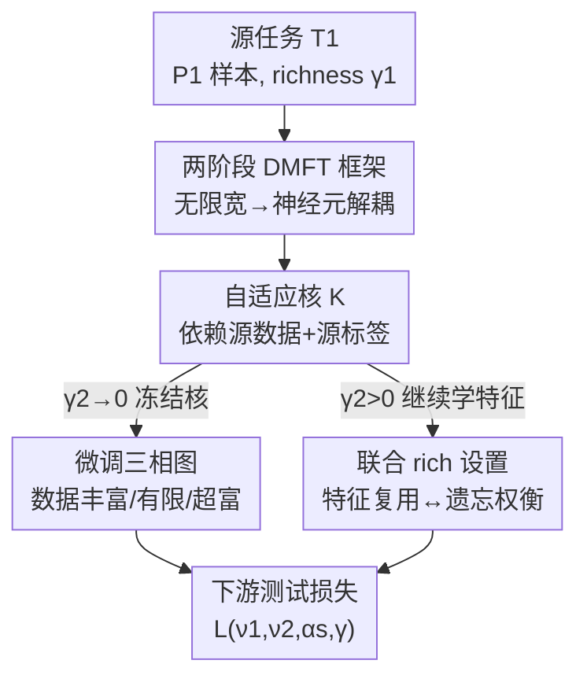

# Transfer Learning in Infinite Width Feature Learning Networks

**会议**: ICLR 2026  
**OpenReview**: [https://openreview.net/forum?id=Oox4QOhmi9](https://openreview.net/forum?id=Oox4QOhmi9)  
**领域**: 学习理论 / 无限宽网络 / 迁移学习  
**关键词**: 无限宽神经网络, 特征学习, 迁移学习, 动力学平均场理论 (DMFT), 自适应核

## 一句话总结
在 mean-field/µP 参数化下用梯度流训练无限宽 MLP，作者用动力学平均场理论 (DMFT) 推出一套迁移学习理论，把"预训练到底有没有用"量化为源/目标任务对齐度 $\alpha_s$、两任务数据量 $\nu_1,\nu_2$ 与特征学习强度 $\gamma_1,\gamma_2$ 的闭式函数，并给出何时正迁移、何时负迁移的相图。

## 研究背景与动机

**领域现状**：迁移学习靠在数据丰富的源任务上学到的表示去缓解下游任务的数据瓶颈，实践中极其成功（预训练 + 微调几乎是现代深度学习的默认范式）。但它"什么时候有用、为什么有用"长期缺一套能做定量预测的理论。

**现有痛点**：已有的无限宽理论大多停在 NTK/NNGP 这种"惰性 (lazy)"极限——网络等价于一个**固定**的核，表示在训练中根本不变。可现实里预训练之所以值钱，恰恰是因为它**改变了表示**。固定核的理论从原理上就无法刻画"特征被源任务塑造、再被目标任务复用"这件事。

**核心矛盾**：要分析迁移，就必须让无限宽网络**保留特征学习**；但一旦保留特征学习，预测器的动力学就变成强非线性、还带历史依赖，难以求解。惰性极限好算但没特征学习，rich 极限有特征学习但难算——这是横在迁移学习理论面前的根本张力。

**本文目标**：在能保留特征学习的无限宽极限里，定量回答三个子问题——(1) 预训练学到的"自适应核"长什么样、依赖源任务的哪些性质；(2) 用这个核去微调下游任务，相对从头训练能省多少样本、什么时候反而更差；(3) 如果下游也开启特征学习（联合 rich），又会怎样。

**切入角度**：作者采用 mean-field/µP（也叫 $\mu$P）参数化——它的关键性质是即便宽度 $N\to\infty$，只要 richness 参数 $\gamma>0$，特征学习就不会消失。再借助 DMFT 把"无穷多个神经元的耦合动力学"约化为"单个神经元的随机过程 + 一组确定性的核演化方程"，从而把难算的 rich 极限变得可解析。

**核心 idea**：把迁移学习看成"两阶段梯度流"——源任务塑造出一个**依赖源数据与源标签的自适应核**，下游任务再在这个核上继续学；用 DMFT 求出自适应核的谱结构（信号尖峰 + 有限样本噪声尖峰 + 串扰项），就能把迁移成败写成数据量、对齐度、特征强度的闭式函数。

## 方法详解

### 整体框架

考虑一个宽度 $N$、深度 $L$ 的 MLP，$f(x)=\frac1N w_L\cdot\phi(h_L(x))$，隐藏层 $h_{\ell+1}=\frac1{\sqrt N}W_\ell\phi(h_\ell)$。训练分两阶段：先在源任务 $T_1$（$P_1$ 个样本）上用 richness $\gamma_1$ 跑梯度流得到参数 $\theta_1$，再以 $\theta_1$ 为初值在目标任务 $T_2$（$P_2$ 个样本）上用 richness $\gamma_2$ 继续训练。richness 参数 $\gamma$ 控制"惰性↔特征学习"：$\gamma\to0$ 是惰性/核学习（表示不动），$\gamma>0$ 才有特征学习；下游 $\gamma_2\to0$ 的特例就叫**微调 (fine-tuning)**。

整条理论的骨架是：**预训练在源任务上塑造出一个自适应核 → 该核携带源任务信息进入下游 → 下游要么冻结核做惰性微调、要么继续 rich 训练**。在 $N\to\infty$ 且 µP 参数化下，所有宏观量（尤其是预测器）由确定性的 DMFT 方程刻画，因而能对"宽但有限"的真实网络做准确预测。

### 关键设计

**1. 两阶段梯度流的 DMFT 框架：把无限宽 rich 动力学约化成可解的单点随机过程**

迁移学习难分析的根子在于：rich 极限下隐藏表示会随训练剧烈变化，预测器动力学强非线性、还跨两阶段带历史依赖。作者用 DMFT 解决这一点——在 $N\to\infty$ 极限下，神经元之间的相互作用渐近**解耦**，群体平均 $\frac1N\sum_i g(h_i)$ 由大数定律收敛到对极限分布的期望 $\langle g(h)\rangle$，于是整张网络的宏观量（包括两阶段预测器 $f_1,f_2$）服从一组**确定性方程**。对一般深层网络，这套方程带非马尔可夫的历史依赖、非常复杂；但作者证明**两层网络 ($L=1$) 在特征空间的动力学是马尔可夫的**：下游任务对预训练的全部依赖只通过一组初值随机变量 $\{h(t_1),z(t_1)\}$ 传入。具体地，预测器 $f(x,t)=\gamma_1^{-1}\langle z(t)\phi(h(x,t))\rangle$，其中预激活 $h$ 与读出 $z$ 按单点随机过程演化：

$$h(x,t)=\chi(x)+\gamma_1\!\int_0^{t_1}\!\!ds\!\sum_{\mu\in T_1}\!\Delta_\mu(s)g_\mu(s)K_x(x,x_\mu)+\gamma_2\!\int_{t_1}^{t}\!\!ds\!\sum_{\nu\in T_2}\!\Delta_\nu(s)g_\nu(s)K_x(x,x_\nu)$$

误差信号 $\Delta_\mu(t)=-\partial_{f_\mu}\ell(f_\mu,y_\mu)$。两个积分项清楚地分出"源任务塑造"与"目标任务塑造"两段贡献，正是这种马尔可夫结构让两层网络可被进一步解析；深层网络则不再成立（见原文附录 B）。

**2. 自适应核：迁移的真正载体，其谱结构由源数据与源标签共同决定**

惰性理论的核在初始化时就定死了，所以学不到迁移。本文的关键转变是：预训练在源任务上诱导出一个**自适应特征核** $K(t)=\langle h(t)h(t)^\top\rangle$，它**同时依赖源数据 $x$ 和源标签 $y$**，这才是携带"预训练知识"进入下游的载体。在可解析的两层线性模型里（源任务 $y_s=\frac1{\sqrt D}\beta_s\cdot x$），作者算出三种典型谱结构：

数据无限富 ($P_1\to\infty$) 时，核收敛到沿源方向的**秩一信号尖峰**
$$K_\ell(X,X')=X\Big(I+\tfrac{\chi_\ell}{D}\beta_s\beta_s^\top\Big)X'^\top,$$
其中 $\chi_\ell$ 随 $\gamma_1$ 严格增大（$L=1$ 时 $\chi=\sqrt{1+\gamma_1^2}-1$）——预训练越 rich，沿源方向的"增益"越大。数据有限 ($P_1=\nu_1 D$) 时，核在信号尖峰外还多出一个**噪声尖峰** $gg^\top$ 与一个**串扰项** $g\beta_s^\top+\beta_s g^\top$，其中高斯向量 $g$ 捕捉有限样本涨落、与 $\beta_s$ 不相关，系数 $c_1,c_2,c_3$ 由 DMFT 鞍点方程决定。正是"信号—噪声—串扰"这三项的相对大小，决定了迁移到底帮忙还是帮倒忙。

**3. 微调三相图：用源任务的数据/richness 制度把"何时正迁移、何时负迁移"讲清**

冻结源任务的自适应核、在 $T_2$ 上做核回归微调（即 $\gamma_2\to0$），作者按预训练制度给出三条结论。设源/目标对齐度 $\alpha_s=\frac1D\beta_s\cdot\beta_t$、目标数据比 $\nu_2=P_2/D$：

(i) **源数据丰富恒正迁移**：population 极限下下游测试损失
$$L(\nu_2,\alpha_s,\chi_\ell)=(1-\nu_2)\Big[1-\tfrac{2\chi_\ell\alpha_s^2\nu_2}{1+\chi_\ell\nu_2}+\tfrac{(\chi_\ell)^2\alpha_s^2\nu_2^2}{(1+\chi_\ell\nu_2)^2}\Big]\le 1-\nu_2,$$
即只要 $\chi_\ell>0$ 且 $\alpha_s\neq0$，微调严格优于从随机初始化训练的基线 $1-\nu_2$。
(ii) **源数据有限可致负迁移**：此时损失 Eq.13 由 $c_1,c_2,c_3$ 决定——信号项 $c_2$ 越大越好；串扰 $c_1$ 总是有害（它把高增益方向旋向噪声）；噪声项 $c_3$ 在噪声与目标无关 ($\alpha_g=0$) 时反而像高维 ridge 起正则化作用。当串扰/噪声压过信号，迁移损失会**高于**基线，出现负迁移，尤其在目标数据 $\nu_2$ 较大时不如从头学。
(iii) **超富预训练反而坏事**：$\gamma_1\to\infty$ 时权重塌缩成秩一 $W=wv^\top$，自适应核退化为单一方向，目标只有**在源张成子空间内的投影**能被学到，渐近损失
$$L(\nu_1,\alpha_s,\alpha_g)=1-(\sqrt{\nu_1}\,\alpha_s+\sqrt{1-\nu_1}\,\alpha_g)^2,$$
该式**不再依赖目标数据量 $\nu_2$**——因为秩一特征里只剩一个标量系数要估。$\alpha_g=0$ 时最多学到 $L=1-\alpha_s^2$，唯有源/目标完全对齐 ($\alpha_s=1$) 才能完美插值。结论是：无限 rich 的预训练原则上有害。

**4. 联合 rich 设置：下游也学特征时的"复用 ↔ 遗忘"权衡**

当下游 $\gamma_2>0$、目标任务也开启特征学习，自适应核会继续吸收来自 $T_2$ 的特征，最终统计量是"源 + 目标"两套特征的混合。这里出现一个核心权衡：$\gamma_2$ 越大、下游早期收益越快，但同时**对源特征的遗忘**也越严重（与 Graldi 等人持续学习的观察一致）；因此存在一个**中间的 $\gamma_2$** 同时最小化 $T_2$ 目标损失与 $T_1$ 灾难性遗忘。这一设置解释了多项现象：从简单（低次多项式）迁移到复杂（高次多项式）有正收益，反向（难→易）则无益（预训练把表示偏向了简单任务用不上的高频成分）；而无论哪种情形，**下游数据稀缺时特征学习尤其关键**，数据充裕时迁移带来的额外提升就很有限。

### 损失函数 / 训练策略
源/目标任务均用平方损失上的梯度流（线性/多项式合成任务）或回归损失（真实图像）；惰性微调对应 $\gamma_2\to0$ 的核回归动力学 $\frac{d}{dt}f_2(x)=k(x)^\top K(y-f_2)$。DMFT 预测通过对单点随机过程做蒙特卡洛近似（Euler 离散 + 群体平均估计）来数值验证，可对照真实有限宽（如 $N=20000$ 的两层 ReLU）网络。

## 实验关键数据

### 主实验
作者在线性/多项式合成任务与 CIFAR-10 上验证理论。核心定性结论与各 Result 的预测一致：

| 设置 | 现象 | 对应理论 |
|------|------|----------|
| 源数据无限富 ($\nu_1\to\infty$) | 测试损失随对齐度 $\alpha_s$ 单调下降，恒正迁移 | Result 2 |
| 源数据有限 + 目标与噪声有对齐 ($\alpha_g\neq0$) | 高 $\nu_2$ 时出现负迁移 | Result 3 |
| 超富预训练 ($\gamma_0\to\infty$) | 损失只依赖 $\nu_1,\alpha_s,\alpha_g$，最多学到 $1-\alpha_s^2$ | Result 4 |
| CIFAR-10 微调（{0,1}→{0,9} 回归） | 大 $\gamma_1$ 在小 $P_2$ 时损失更低，$P_2$ 增大后曲线收敛 | Result 1/惰性微调 |

### 消融 / 分析实验

| 配置 | 关键发现 | 说明 |
|------|---------|------|
| 多项式 易→难（线性源→二次目标） | 预训练降低目标损失 | 正迁移；存在最优 $\gamma_2$ 同时压目标损失与遗忘 |
| 多项式 难→易（高次 He5→低次 He2） | 迁移相比无预训练无收益 | 表示偏向了简单任务不需要的高频成分 |
| CIFAR-10 联合 rich（{1,2}→{8,9}，$P_2=200$） | 任意 $\gamma_2$ 下迁移都降损失，且有最优早停 | DMFT (Result 1) 准确预测 |
| 改变下游数据量 $P_2$ | 小 $P_2$ 时源特征学习至关重要；大 $P_2$ 时迁移增益微弱 | 数据稀缺才是迁移的高价值区 |

### 关键发现
- 决定迁移成败的不是单一因素，而是 (数据量 $\nu_1,\nu_2$, 对齐度 $\alpha_s$, 特征强度 $\gamma_1,\gamma_2$) 的联合相图；自适应核里"信号尖峰 vs 噪声尖峰 vs 串扰"的此消彼长是底层机制。
- 存在最优特征强度：$\gamma_1^\star(\nu_2)$ 在小 $\nu_2$ 时偏大（方差缩减占主导），随 $\nu_2$ 增大而减小（特征漂移带来的偏差开始伤害）；超富 ($\gamma_1\to\infty$) 反而坏事。
- 联合 rich 下 $\gamma_2$ 越大，目标任务的预激活分布 $p(h)$ 越偏离高斯——这正是特征学习真实发生的"指纹"，惰性极限下不会出现。

## 亮点与洞察
- **把"预训练有没有用"写成闭式损失**：Eq.8/13/15 把迁移收益直接表达为数据量、对齐度、richness 的函数，给出了可解释、可预测的相图，而非只有定性叙述——这是 NTK/NNGP 固定核理论给不出的。
- **自适应核的三项分解极具洞见**：把有限样本的危害精确拆成"噪声尖峰 + 串扰项"，并指出串扰恒有害、噪声在与目标无关时反而起 ridge 正则——这种细颗粒度的机制解释可迁移到理解任意预训练表示的质量。
- **"无限 rich 有害"是反直觉的好结论**：通常以为特征学得越狠越好，但 Result 4 证明超富预训练会让核塌缩成秩一、丢掉除源方向外的所有可学性，提示实践中 richness 需要适度。

## 局限与展望
- 线性玩具模型依赖各向同性数据等强简化假设，便于闭式求解但限制了定量预测的适用范围；结构化/重尾数据下结论可能改变。
- 可解析结论集中在两层网络（特征空间动力学才马尔可夫）；深层网络带非马尔可夫历史依赖，本文只给出一般框架而未深入求解。
- 作者提出的未来方向：研究迁移时应保留几层隐藏层、把框架接到课程学习（任务按结构化序列而非独立处理）以解释 curriculum 何时改善泛化与特征复用。

## 相关工作与启发
- **vs NTK/NNGP 固定核理论 (Canatar 2021, Jacot 2020)**：他们在无限宽下得到初始化时就定死的固定核、表示不变；本文用 µP/mean-field 参数化保留特征学习，核会随源/目标数据自适应，因而能刻画真正的迁移。
- **vs 贝叶斯多任务迁移 (Ingrosso 2025, Shan 2025)**：他们把目标模型正则化到源后验权重附近、源权重当作固定实现；本文走的是梯度流 + DMFT 路线，且专门刻画有限源数据下的样本涨落如何损害微调。
- **vs 深线性微调 (Tahir 2024) / mean-field 微调 (Aminian 2024)**：前者只在源数据无限、核低秩的特例下分析；本文覆盖有限数据涨落致负迁移，并把理论扩展到非线性网络与联合 rich 设置。

## 评分
- 新颖性: ⭐⭐⭐⭐⭐ 首个在保留特征学习的无限宽极限下给出迁移成败闭式相图的理论。
- 实验充分度: ⭐⭐⭐⭐ 合成任务 + CIFAR-10 充分验证理论，但真实大规模数据集偏少。
- 写作质量: ⭐⭐⭐⭐ 结构清晰、Result 分层递进，但公式密度高、对非理论读者门槛偏大。
- 价值: ⭐⭐⭐⭐⭐ 为"何时该预训练 / 何时会负迁移"提供了可解释的理论指南。

<!-- RELATED:START -->

## 相关论文

- [\[ICLR 2026\] Scaling Laws and Spectra of Shallow Neural Networks in the Feature Learning Regime](scaling_laws_and_spectra_of_shallow_neural_networks_in_the_feature_learning_regi.md)
- [\[ICLR 2026\] Residual Feature Integration is Sufficient to Prevent Negative Transfer](residual_feature_integration_is_sufficient_to_prevent_negative_transfer.md)
- [\[ICLR 2026\] Mitigating the Curse of Detail: Scaling Arguments for Feature Learning and Sample Complexity](mitigating_the_curse_of_detail_scaling_arguments_for_feature_learning_and_sample.md)
- [\[ICLR 2026\] Feature Compression is the Root Cause of Adversarial Fragility in Neural Networks](feature_compression_is_the_root_cause_of_adversarial_fragility_in_neural_network.md)
- [\[ICLR 2026\] Infinite Horizon Markov Economies](infinite_horizon_markov_economies.md)

<!-- RELATED:END -->
