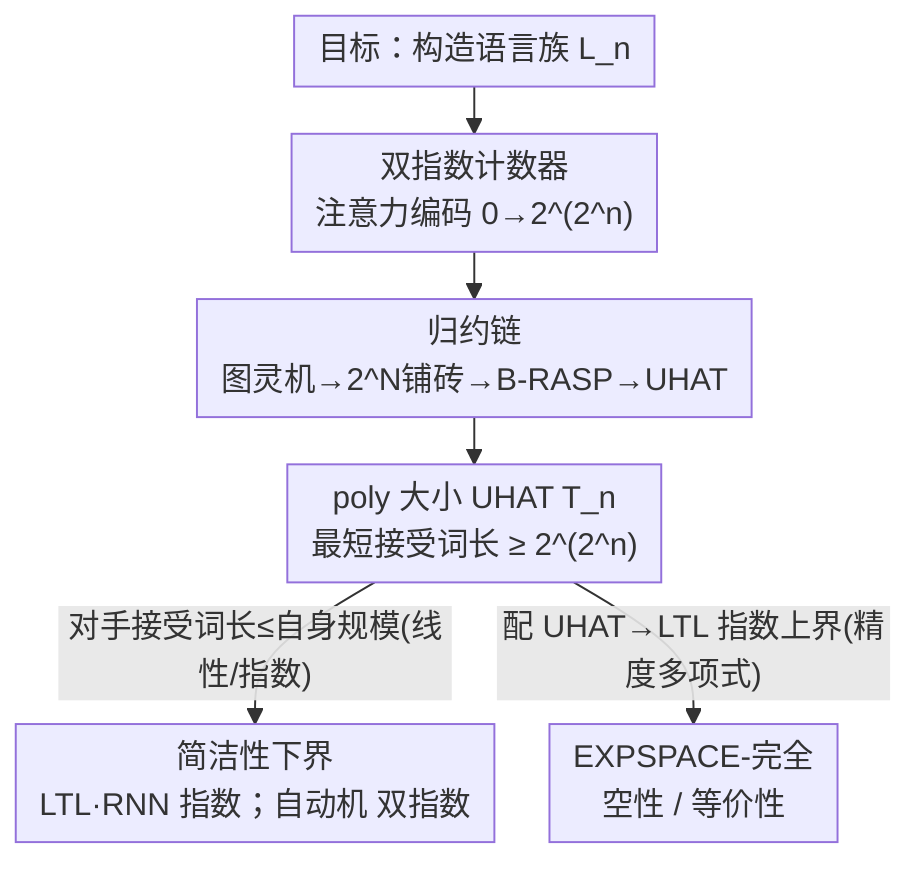

# Transformers Are Inherently Succinct

**会议**: ICLR 2026  
**OpenReview**: [https://openreview.net/forum?id=Yxz92UuPLQ](https://openreview.net/forum?id=Yxz92UuPLQ)  
**代码**: 无（纯理论）  
**领域**: 学习理论 / Transformer 表达力  
**关键词**: Transformer 表达力, 简洁性(succinctness), 形式语言, UHAT, EXPSPACE

## 一句话总结
这篇论文换了一把尺子看 Transformer 的能力：不问"它能识别哪些语言"，而问"它描述一个语言要多省"——结果证明固定精度 Transformer（UHAT）极其"简洁"，描述某些语言可以比 LTL 和 RNN 指数级地省、比有限自动机双指数级地省，代价是它的空性/等价性验证问题是 EXPSPACE-完全（最坏情况下不可能高效求解）。

## 研究背景与动机

**领域现状**：近年一大批理论工作在刻画 Transformer 的"表达力"——固定精度（即最贴近真实硬件的设定）下的 Transformer，被证明只能识别**亚正则语言**（subregular languages）中的某些子类，典型是**无星语言**（star-free languages，等价于 LTL、等价于 counter-free 自动机）。例如 $a^*b^*$ 是无星的，而 $(aa)^*$ 不是。

**现有痛点**：从"能识别哪些语言"这个角度看，Transformer 反而**输给** RNN——RNN 在固定精度下能识别全部正则语言，严格比 Transformer 强。可经验上 Transformer 又明显更好用。这说明"表达容量（expressive capacity）"这把尺子量错了东西：它只回答"能不能识别"，回答不了"为什么 Transformer 这么强"。

**核心矛盾**：表达力相等的两个形式系统，描述同一个语言所需的**规模**可以差天差地。逻辑/自动机理论里早有先例：LTL 和 counter-free 自动机表达力完全相等，但 LTL 可以比自动机**指数级地简洁**（某些语言 LTL 公式是多项式大小、等价自动机却要指数大）；代价是 LTL 的判定问题相应更难。这把"表达力"细化成了一个复杂度层面的精修。

**本文目标**：把这个"简洁性（succinctness）"的视角搬到 Transformer 上——量一量 Transformer 描述语言到底有多省，省到什么程度，以及为这份"省"付出的验证代价有多大。

**切入角度**：作者选定一个被广泛使用的自注意力抽象——**唯一硬注意力 Transformer（UHAT，unique-hard attention transformer）**，每个位置的注意力只挑选分数最大的那个位置（用最左/最右打破平局）。已有结果表明 UHAT 上的表达力界限能传导到固定精度 softmax Transformer，所以结论落在最贴近真实实现的设定里。

**核心 idea**：证明 poly 大小的 UHAT 能用注意力**编码出双指数大的计数器**（从 0 数到 $2^{2^N}$），从而识别"最短接受词长达双指数"的语言；而 LTL/RNN/自动机要识别同一语言，规模必然被撑大——这就同时给出了简洁性的指数/双指数差距，以及验证问题的 EXPSPACE-完全。

## 方法详解

### 整体框架

整篇论文是一台"用一个构造同时撬动两个结论"的证明机器。它要解决的核心问题是：**怎样证明 Transformer 比别的模型更省？** 思路是构造一族语言 $L_n$，使得识别它的 UHAT $T_n$ 只有 poly($n$) 大小，但 $T_n$ 能接受的**最短词**长度至少是 $2^{2^n}$。一旦做到这点，两件事立刻成立：(1) 任何对手模型（LTL/RNN/自动机）只要接受非空语言，它接受的最短词长度就被自身规模卡死（自动机 ≤ 线性、LTL ≤ 指数），所以要识别 $L_n$ 它们必须很大——这就是简洁性差距；(2) 判定一个 UHAT 是否空，等价于去搜这条可能双指数长的最短词，所以验证天然困难。

整个引擎分四块串起来（见下图）：先用注意力造一个**双指数计数器**当地基；再用一条**归约链**（图灵机 → 铺砖问题 → B-RASP → UHAT）把一个已知 EXPSPACE-完全的问题搬进 UHAT 的空性问题；由此得到 poly 大小却接受超长词的 $T_n$；最后两路收口——一路推出**简洁性下界**，一路（配上一个新的 UHAT→LTL 指数级**上界**）夹出 **EXPSPACE-完全**。

### 关键设计

**1. 用"简洁性"替换"表达力"这把尺子**

针对的痛点是：表达容量这个二值问题（"能/不能识别"）把 Transformer 排在 RNN 之下，和经验完全矛盾。作者改问规模——一个语言 $L$ 相对模型类 $C$ 的简洁性，定义为 $C$ 中能识别 $L$ 的**最小**表示的规模 $|R|$（最小二进制编码长度）。为了严谨地"夹住"两个模型类的差距，论文给了一对互为对偶的定义。一个是存在性的**下界**——$C^{(1)}$ 比 $C^{(2)}$ "$f$-更简洁"，意思是存在一族语言 $\{L_n\}$，$C^{(1)}$ 里有 size 为 $R^{(1)}_n$ 的表示，而 $C^{(2)}$ 里任何表示都满足

$$|R^{(2)}_n| \ge f(|R^{(1)}_n|).$$

另一个是全称性的**上界**（$g$-bounded expansion）：对**每个**语言、每个 $C^{(2)}$ 表示，$C^{(1)}$ 都有一个规模 $\le g(|R^{(2)}|)$ 的等价表示。当 $f$ 指数、$g$ 多项式时，两者合起来就把差距精确钉死："在某个见证族上至少差 $f$，在所有语言上至多差 $g$"。这套语言是后面所有定理的度量衡。（为公平起见，RNN 的精度 $k$ 以一进制计入其 size，避免拿"低精度 Transformer"去碰"高精度 RNN"占便宜。）

**2. 用注意力编码双指数计数器**

这是整篇论文的技术内核，要解决的是"怎么让一个 poly 大小的模型逼出超长的最短词"。关键观察：UHAT 的**严格掩码 + 平局打破**机制天然能做"找最近一次同值出现"。作者先用等价于 UHAT 的 **B-RASP** 程序演示（Ex. 2）：让程序接受形如 $0000\,a_1\#\,0001\,a_2\#\,\dots\#\,1111\,a_{16}\#$ 的词，即一个 4-bit 二进制计数器从 $0000$ 递增到 $1111$、且相邻符号满足约束集 $H$。检查"计数器正确加一"用的是一次注意力操作（Eq. 7）：当前 $\#$ 位置 $i$ 通过**严格未来掩码 + 最右平局**选中它左边最近的 $\#$ 位置 $j$，再用值谓词逐位核对 $b^i_{1..4}$ 是否等于 $b^j_{1..4}$ 加一；相邻符号约束 $H$ 同理用一次注意力核对（Eq. 8）。一个 $N$-bit 计数器就把最短接受词逼到 $2^N$ 长。

要从指数升到**双指数**，作者把这种"一行"的计数器**纵向叠成二维**：多行多列（用 $\#$ 分隔），除了行内的水平约束 $H$，再加入行间的垂直约束。最右平局的注意力既能比对"同一行的相邻 tile"，也能比对"上一行同一列（即最近一次同计数值出现）的 tile"。于是程序能逼出最短词长达 $2^{2^n}$ 的语言。直觉上：第一层指数来自单个计数器的位宽，第二层指数来自把这些超长行又堆了指数多行。

**3. 从 $2^N$-铺砖问题归约，证空性 EXPSPACE-完全**

光有"能造长词"还不够，要把它锚到一个已知的硬问题上。作者用 **$2^N$-铺砖问题**（$2^N$-tiling problem）当源头——它要求在 $2^N$ 列、任意 $M$ 行的网格里放 tile，使相邻 tile 边缘匹配、边界为 0、右上角是指定终止 tile；该问题已知是 **EXPSPACE-完全**的（取 Schwarzentruber 2019 的 $k=1$）。归约分两步：Lem. 8 把任意 $2^N$-铺砖实例在 $N$ 的多项式时间内编码成一个 B-RASP 程序，使其语言非空 **当且仅当** 该铺砖实例有解（核心正是上面那套严格未来掩码 + 最右平局，能同时表达行内和行间约束）；Lem. 9 进一步证明这种特殊形式的 B-RASP（注意力的分数谓词只比对若干位的相等性）可以**多项式时间**翻译成等价的 UHAT——每个 B-RASP 注意力操作对应一层 UHA 层，逐位相等的检查交给一个让"两二进制数相等时注意力分数最大"的打分函数。两步串起来即 Prop. 10：UHAT 的非空性是 EXPSPACE-hard。

**4. 配套的指数级 UHAT→LTL 上界**

要把 EXPSPACE-hard 收紧成 **EXPSPACE-完全**，还需要一个匹配的上界，这也是相对前人的硬改进。难点在于 UHAT 里出现的有理数值看起来可能很复杂。作者先证 Prop. 12：任何 UHAT $T$ 在任意输入上计算时出现的有理数，精度都只要 poly($|T|$) 比特。这条很关键——它意味着计算中能出现的数值集合是**有限、可枚举、且每个数多项式位长**（基数至多 $2^{\text{poly}(|T|)}$，指数时间内可枚举）。于是逐层翻译成 LTL 时，公式只需模拟注意力**逐位置的行为**（掩码 + 选哪个位置当注意力向量），完全不必去模拟数值的真实计算。由此 Prop. 13 给出"UHAT → 指数大小 LTL 公式"的构造，把 Yang et al. (2024) 那条先翻成 B-RASP 再翻成 LTL 的**双指数**翻译，改进成了**单指数**。由于 LTL 语言的非空性在 PSPACE，这就给了 UHAT 空性的 EXPSPACE 上界，与 Thm. 4 的下界合上。

### 一个完整示例
用 Ex. 2（$N=4$）走一遍 design 2 的计数器机制，能看清"长词"是怎么被逼出来的：字母表 $\Sigma=\{0,1,\#,a,b,c\}$，约束 $H=\{(a,b),(b,c),(b,a),(c,b)\}$。程序要接受
$$0000\,a_1\#\,0001\,a_2\#\,0010\,a_3\#\dots\#\,1111\,a_{16}\#,$$
即 4-bit 计数器从 $0000$ 跑到 $1111$（共 $2^4=16$ 段），且每段携带的符号 $a_n$ 与下一段满足 $(a_n,a_{n+1})\in H$。对每个 $\#$ 位置 $i$：注意力（严格未来掩码、最右平局）锁定左边最近的 $\#$ 位置 $j$，值谓词核对 $i$ 处的 4-bit 串确实是 $j$ 处的串加一；同时另一条注意力核对相邻符号在 $H$ 里。再加两个边界检查（最左 $\#$ 处四位必须全 0、最右 $\#$ 处全 1），整个程序大小只是 $N$ 的多项式，但它接受的**最短**词长是 $\Theta(2^N)$。把这套结构纵向叠成二维铺砖，最短词进一步涨到 $2^{2^n}$——poly 大小的描述、双指数长的见证，简洁性差距就来源于此。

## 实验关键数据

纯理论论文，无数值实验。以下两表汇总核心定理结论。

### 主结果：简洁性差距（及匹配上界）

| 对手模型 | UHAT 比它更简洁的程度（下界） | 反向翻译上界 | 出处 |
|----------|------------------------------|--------------|------|
| LTL | 指数级（exponentially） | LTL→UHAT 多项式（poly bounded expansion） | Thm. 15 / Prop. 16 |
| 有限自动机 | **双指数级**（doubly exp.） | counter-free 自动机→UHAT 指数级 | Thm. 17 |
| RNN（固定精度） | 指数级 | —（由 Prop. 1：RNN→ $2^{kD}$ 状态自动机） | Cor. 18 |
| SSM / 状态空间模型 | 指数级（经 RNN 推广） | — | §1, Cor. 18 |

要点：见证族 $\{L_n\}$ 用同一个构造——poly($n$) 大小的 UHAT $T_n$、最短接受词长 $\ge 2^{2^n}$。自动机接受词长至多线性于自身规模 → 自动机必须双指数大；LTL 接受词长至多指数于公式规模 → LTL 必须指数大。

### 验证问题复杂度

| 问题 | 模型 | 复杂度 | 出处 |
|------|------|--------|------|
| 非空性（non-emptiness） | UHAT / B-RASP | EXPSPACE-完全 | Thm. 4 |
| 等价性（equivalence） | 两个 UHAT | EXPSPACE-完全 | Thm. 19 |
| 非空性（受限：仅严格未来掩码 + 最左平局，或对偶） | UHAT | NEXP（上界改进） | Cor. 14 |
| 非空性 | LTL | PSPACE-完全（已知，作对比） | Sistla & Clarke 1985 |
| 非空性 / 等价性 | 确定型有限自动机 | 多项式时间（作对比） | Kozen 1997 |

### 关键发现
- **"更简洁"和"更难验证"是同一枚硬币的两面**：UHAT 描述语言比 LTL 省一个指数、比自动机省两个指数，相应地它的空性/等价性验证从自动机的多项式时间一路飙到 EXPSPACE-完全——简洁是有代价的。
- **双指数计数器是全部结论的唯一发动机**：简洁性下界（Thm 15/17）和 EXPSPACE-hardness（Thm 4）共用同一族 $L_n$，差别只是"读出哪个推论"。
- **改进点很具体**：UHAT→LTL 从前人的双指数压到单指数（Prop 13），靠的是"精度多项式"这条朴素但关键的观察（Prop 12）。
- **结论落在真实设定**：下界在更强的固定精度整数下也成立，上界对任意有理权重成立，因此对最贴近硬件的固定精度算术有效。

## 亮点与洞察
- **换尺子的眼光**：把"表达力"这个二值问题精修成"简洁性"这个复杂度问题，一举解释了"Transformer 表达力更弱却更好用"的悖论——它弱在能识别的语言类，强在描述这些语言时极其省。这个 lens 可迁移到任何"两个模型表达力相等但经验差异大"的比较。
- **注意力当计数器用**：用"严格未来掩码 + 最右平局 = 找最近一次同值出现"这一招，把注意力机制变成可叠加的计数/比对原语，二维堆叠就榨出双指数。这种"用注意力的选择性做状态比对"的视角，对理解 Transformer 为何能处理长程结构很有启发。
- **对偶定义钉死差距**：$f$-more succinct（存在性下界）与 $g$-bounded expansion（全称性上界）配成对，避免了"只证一边"的常见漏洞，是写表达力/简洁性证明值得复用的范式。

## 局限与展望
- **模型是 UHAT，不是真实 Transformer**：唯一硬注意力 + 位置掩码（无任意位置编码、无 softmax）是真实自注意力的简化抽象。虽然 Jerad et al. (2025) 表明 UHAT 界限能传导到固定精度 softmax，但固定精度 softmax / average-hard 注意力本身的简洁性仍是 open（作者列为未来工作）。
- **最坏情况复杂度，不代表实际不可解**：EXPSPACE-完全是最坏界。作者明确把"把符号方法/模拟等验证技术用到 Transformer 上"当作挑战，并提议找"无法编码大计数器、因而验证更易"的子类。
- **可学习性没碰**：这些"简洁"的 Transformer 是否真能被训练学到，经验证据是混合的（Garg 2022、Huang 2025 等），论文不涉及。
- **下界依赖大计数器构造**：硬度来自能编码大计数器的人工语言族，对"自然语言任务里 Transformer 是否真这么简洁"没有直接断言。

## 相关工作与启发
- **vs Yang et al. (2024)**：他们建立 UHAT↔B-RASP↔LTL 的等价并给出 UHAT→LTL 的**双指数**翻译；本文用"精度多项式"观察把它压到**单指数**（Prop 13），且首次从中读出简洁性与复杂度结论。
- **vs Sälzer et al. (2025)**：他们研究多种精度 Transformer 的验证，证明固定精度 Transformer 至少 NEXP-hard，并隐含"比自动机指数级简洁"；本文结论更强（比自动机**双指数**简洁、比 LTL/RNN 指数简洁）、模型更简单（纯硬注意力 + 仅位置掩码），并把验证精确刻画为 EXPSPACE-完全。
- **vs 经典 LTL 简洁性（Sistla & Clarke 1985）**：LTL 可比自动机指数级简洁、其判定问题相应更难——本文把这套"简洁 ⇄ 难判定"的经典叙事完整搬到 Transformer 上，并量化出更陡的差距。
- **vs RNN/SSM 表达力工作**：RNN 在固定精度下识别全部正则语言（表达力强于 Transformer），但本文表明 Transformer 在简洁性上反超 RNN/SSM 一个指数——提示比较架构时"省不省"可能比"能不能"更贴近经验。

## 评分
- 新颖性: ⭐⭐⭐⭐⭐ 首次把"简洁性"这把经典尺子系统搬到 Transformer，结论与改进都很硬。
- 实验充分度: ⭐⭐⭐⭐ 纯理论，定理链条完整自洽（下界 + 匹配上界），无实证但本就不需要。
- 写作质量: ⭐⭐⭐⭐⭐ 动机—定义—构造—推论层层递进，对偶定义与归约链交代清晰。
- 价值: ⭐⭐⭐⭐⭐ 同时澄清"表达力悖论"、给出验证不可解性、并改进了已有翻译界限，对 Transformer 理论与形式验证都有分量。

<!-- RELATED:START -->

## 相关论文

- [\[ICLR 2026\] Probability Distributions Computed by Autoregressive Transformers](probability_distributions_computed_by_autoregressive_transformers.md)
- [\[ICLR 2026\] Softmax Transformers are Turing-Complete](softmax_transformers_are_turing-complete.md)
- [\[ICLR 2026\] Efficient Turing Machine Simulation with Transformers](efficient_turing_machine_simulation_with_transformers.md)
- [\[ICLR 2026\] Quantitative Bounds for Length Generalization in Transformers](quantitative_bounds_for_length_generalization_in_transformers.md)
- [\[ICLR 2026\] Understanding and Relaxing the Limitations of Transformers for Linear Algebra](understanding_and_relaxing_the_limitations_of_transformers_for_linear_algebra.md)

<!-- RELATED:END -->
