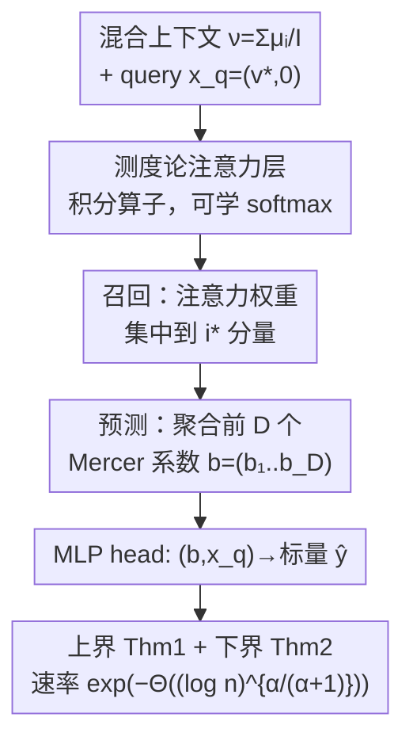

# Transformers as Measure-Theoretic Associative Memory: A Statistical Perspective and Minimax Optimality

**会议**: ICLR 2026  
**OpenReview**: [https://openreview.net/forum?id=2JilrTRyhh](https://openreview.net/forum?id=2JilrTRyhh)  
**代码**: 待确认  
**领域**: 学习理论 / Transformer 理论  
**关键词**: 联想记忆, 测度论, softmax 注意力, 极小极大最优, 泛化界

## 一句话总结
本文把 Transformer 的"联想记忆"重新建模在概率测度层面——上下文是一族 token 分布的混合，注意力是作用在测度上的积分算子——并证明一个浅层（深度 2）"测度论 Transformer + MLP"经过经验风险最小化（ERM）能学到"召回相关分量分布、再从中预测标量"这一映射，泛化误差以亚多项式速率 $\exp(-\Theta((\log n)^{\alpha/(\alpha+1)}))$ 收敛，且给出指数项完全匹配的极小极大下界，说明这个收敛阶是最优的。

## 研究背景与动机

**领域现状**：Transformer 之所以强，业界普遍归因于两个特性：一是"内容寻址检索"（content-addressable retrieval）——给一个 query，注意力能从上下文里挑出相关信息，这正是经典联想记忆（Hopfield 网络那一脉）的功能；二是能处理原则上任意长、变长的上下文。已有理论工作沿两条线展开：一条研究 Transformer 里联想记忆如何涌现、容量多大（Bietti、Cabannes、Nichani 等）；另一条把"长上下文"形式化成 token 上的概率测度，从而得到与文本长度无关的结论，并把注意力看成作用在分布上的映射（Vuckovic、Sander、Geshkovski、Furuya 等）。

**现有痛点**：这两条线几乎没有交汇。把上下文当测度的统计分析里，要么假设注意力核是**冻结的、不可学的**（Liu & Zhou 2025 的分布回归），要么只分析**线性注意力**（Kim et al. 2024 的序列式 in-context learning）。冻结核没法解释"学出来的注意力怎么去检索相关测度"；线性注意力本质上是在做平均，达不到 softmax 注意力那种尖锐的、近似 one-hot 的权重分布，所以分析时被迫额外假设召回候选之间严格正交/松弛稀疏。换句话说，**"可学的 softmax 注意力到底能不能在无穷维测度层面完成召回+预测、并带可证泛化保证"这件最贴近 Transformer 真实机制的事，一直没人回答**。

**核心矛盾**：要刻画联想记忆，就得允许注意力是**学出来的 softmax**（才能产生尖锐召回）；但 softmax 在无穷维测度上的统计分析远比线性/冻结核难——这正是已有工作绕开它的原因。

**本文目标**：回答中心问题 Q——一个学习得到的 softmax-attention Transformer，能否召回一个无穷维（测度值）的上下文，并从中预测，且带可证泛化保证？这又分解为：(i) 给出测度层面"召回+预测"任务的严格数学框架；(ii) 证明浅层测度论 Transformer 的泛化上界；(iii) 证明匹配的极小极大下界。

**切入角度**：把一篇文档的 token 经验分布在"文档无限长"极限下看成一个概率测度 $\mu^{(i)}_0$，整个语料就是这些分量测度的混合 $\nu=\frac1I\sum_i \mu^{(i)}_{v^{(i)}}$；query 通过文档级特征 $v^{(i^\star)}$ 指定要召回哪一篇。再借助核方法：假设每个内容密度落在某 RKHS 球里、核的 Mercer 特征值**指数衰减** $\lambda_j\asymp\exp(-cj^\alpha)$，这意味着分布非常光滑、有效维度很小——正是这个"有效维度"决定了学习速率。

**核心 idea**：用"测度上的积分算子"刻画 softmax 注意力，把"从无穷维测度预测"在召回之后**压缩成"学一个关于前 $D$ 个 Mercer 系数的有限维 Lipschitz 函数"**，从而用核的谱衰减 $\alpha$ 同时刻画上界与下界。

## 方法详解

### 整体框架

本文不是提出一个新网络去刷点，而是搭一套"测度论 Transformer"的统计学习框架，并在其中证明一个具体构造能最优地完成"召回+预测"。先把任务讲清：每个 token 写成 $x=(v,z)\in\mathbb{R}^{d_1}\times\mathbb{R}^{d_2}$，$v$ 是文档级特征（如主题），$z$ 是 token 级内容。文档 $i$ 的内容服从 $\mu^{(i)}_0$，其 token 分布是乘积测度 $\mu^{(i)}_{v^{(i)}}=\delta_{v^{(i)}}\otimes\mu^{(i)}_0$；上下文是 $I$ 篇文档的均匀混合 $\nu=\frac1I\sum_{i=1}^{I}\mu^{(i)}_{v^{(i)}}$。给定 query $x_q=(v^{(i^\star)},\mathbf{0})$（只填文档特征、内容位补零），ground-truth 映射 $F^\star(\nu,x_q)=\tilde F^\star(\mu^{(i^\star)}_0,x_q)$ 的关键结构假设是：**输出只通过 query 选中的那一个分量 $\mu^{(i^\star)}_0$ 依赖于 $\nu$**。于是任务天然分两步：

$$
(\nu,x_q)\ \xrightarrow{\ \text{召回 } i^\star\ }\ \mu^{(i^\star)}_0\ \xrightarrow{\ \text{预测}\ }\ \tilde F^\star(\mu^{(i^\star)}_0,x_q).
$$

统计上观测 $n$ 个 i.i.d. 样本 $(\nu_t,x_{qt},y_t)$，$y=F^\star(\nu,x_q)+\xi$，$\xi\sim\mathcal{N}(0,\sigma^2)$，目标是 ERM $\hat F=\arg\min_{F\in\mathcal{F}}\hat{\mathbb{E}}_n(y-F(\nu,x_q))^2$，用 $L^2$ 风险 $R(F^\star,\hat F)$ 衡量。整条 pipeline 如下：

整体框架里点名了四个贡献组件：**测度论注意力（把注意力写成测度上的积分算子）**、**学习得到的 softmax 召回机制**、**Mercer 截断带来的有效维度压缩**、**极小极大下界**——它们在下面"关键设计"里逐一交代。

### 关键设计

**1. 测度论注意力：把注意力写成作用在分布上的积分算子**

痛点是：要分析变长/无穷长上下文，离散求和 $\sum_\ell$ 的形式没法直接做无穷维统计。本文沿 Furuya et al. (2025) 把无掩码注意力的置换等变性利用起来——既然对 token 下标置换等变，就可以用 token 的经验测度表示输入，并在 $w\to\infty$ 极限下把求和换成积分。于是一个测度论注意力层定义为

$$
\mathrm{Attn}_\theta(\nu,x)=Ax+\sum_{h=1}^{H}W^h\int \mathrm{Softmax}(\langle Q^h x,K^h y\rangle)\,V^h y\,\mathrm{d}\nu(y),
$$

其中 $\mathrm{Softmax}(\langle Qx,Ky\rangle)=\exp(\langle Qx,Ky\rangle)/\int\exp(\langle Qx,Kz\rangle)\mathrm{d}\nu(z)$，$A$ 是 skip-connection 的可学线性变换。当 $\nu$ 退化成经验混合测度 $\nu_X$ 时，这就还原成标准离散注意力。学生模型是这种注意力层与 MLP 层（MLP 不依赖测度 $\mu$）按"测度论复合" $\Gamma_2\diamond\Gamma_1$ 交替堆叠而成的 Transformer 类，每层参数被约束在有界假设类里（$\|W^h\|_\infty,\|Q^h\|_\infty$ 等 $\le B_a$，非零元个数 $\le S_a$ 等）。**关键在于这里分析的是可学的 softmax（不是冻结核、也不是线性注意力）**，正是它能产生尖锐召回。

**2. 召回机制：softmax 让权重近似 one-hot 地落到 query 选中的分量上**

这是"联想记忆"的核心一步，针对的痛点是"如何只从混合 $\nu$ 里挑出相关的那一篇"。构造上，第一层 MLP 把每个 token $y=(v^{(i)},z)$ 嵌入成包含前 $D$ 个 Mercer 特征 $(e_j(z))_{j=1}^{D}$ 的向量；softmax 打分 $\langle Q h(x_q),K h(y)\rangle$ 被参数化成"当文档标签 $v^{(i)}$ 与 query 的 $v^{(i^\star)}$ 匹配时分数大、否则小"。这里用到 Assumption 2（上下文向量分离：$\langle v^{(i)},v^{(i')}\rangle\le0$ 且 $I\le d_1$），保证不同文档可区分。归一化后权重 $w_{x_q}(y)$ 几乎全部集中在来自 $\mu^{(i^\star)}_{v^{(i^\star)}}$ 的样本上——这种近 one-hot、query 相关的过滤是冻结核（Zhou et al. 2024）和线性注意力（Kim et al. 2024，本质做平均）都达不到的。

**3. Mercer 有效维度：召回之后把无穷维测度压成 $D$ 维描述子**

召回完之后还要"预测"，痛点是 $\mu^{(i^\star)}_0$ 本身是无穷维对象。这里谱假设 $\lambda_j\asymp\exp(-cj^\alpha)$ 发挥作用：只有头几个 Mercer 模态携带显著信号。注意力的 value 路径对每个 $j$ 计算

$$
\hat b_j\approx\int e_j(z)\,w_{x_q}(y)\,\mathrm{d}\nu(y)\approx\int e_j(z)\,\mathrm{d}\mu^{(i^\star)}_0(z),\quad j=1,\dots,D,
$$

得到 $D$ 维描述子 $b=(\hat b_1,\dots,\hat b_D)$，最后一个 MLP 把 $(b,x_q)$ 映射到标量预测。于是"从无穷维测度预测"被化简成"学一个关于 $D$ 个统计量的 Lipschitz 函数"，行为像一个 $D$ 维问题（误差约 $n^{-\Theta(1/D)}\simeq\exp(-\Theta((\log n)/D))$）；而截断到 $D$ 个模态又带来约 $\exp(-cD^\alpha)$ 的偏差。两项平衡给出**有效维度** $D_{\mathrm{eff}}(n)\asymp(\log n)^{1/(\alpha+1)}$，进而得到亚多项式速率 $R\approx\exp(-\Theta((\log n)^{\alpha/(\alpha+1)}))$（即 Theorem 1）。直觉上，尽管每个分量是无穷维测度，估计器表现得像只在拟合 $D_{\mathrm{eff}}(n)$ 个自由度。

**4. 极小极大下界：证明这个收敛阶不可再改进**

仅有上界不够，还要说明"没有更好的方法"。本文在结构化设定（Setting 2，密度按随机 Mercer 系数 $\mathrm{d}\mu_0/\mathrm{d}\lambda=\sum_j\lambda_j^{\Theta(1)}Z_j e_j$ 生成，沿 Lanthaler 2024）下证明：任意估计器 $\hat F$ 满足

$$
\sup_{\tilde F^\star\in\mathcal{F}^\star} R(\hat F,F^\star)\ \gtrsim\ \exp\!\big(-O((\ln n)^{\alpha/(\alpha+1)})\big).
$$

技术路线是：先把"从混合 $\nu$ 估计"归约为"从纯测度 $\mu^{(i^\star)}_0$ 估计"（前者不会更容易），再把 Mercer 系数截断 + 各向异性重缩放（把 Lanthaler 的重缩放论证推广到指数衰减的一般几何），使诱导几何近似各向同性，从而能嵌入经典 $d$ 维 Lipschitz 类、套用标准 packing 下界，配合 Yang & Barron (1999) 的经典结果得到与上界匹配的速率。**两个定理合起来说明：ERM-over-Transformer 在指数项上达到了极小极大速率（最多差乘性常数），softmax 注意力对"测度层面召回"提供了正确的归纳偏置**。

### 一个完整示例

附录 D 的合成实验恰好把上述机制走了一遍，可当作具象示例。取截断 $M=16$、三角基 $\phi_j$、特征值 $\lambda_j=\exp(-j^\alpha)$，对每个样本采两组随机系数生成两条 $[0,1]$ 上的密度 $\mu_1,\mu_2$（裁非负 + 归一化成离散分布）。再抽 query 标签 $v^{(1)}\in\{-1,+1\}$、令 $v^{(2)}=-v^{(1)}$，构造乘积测度混合 $\nu=\frac12(\mu_1\otimes\delta_{v^{(1)}})+\frac12(\mu_2\otimes\delta_{v^{(2)}})$。从 $\nu$ 里 Monte-Carlo 采 $n_{\text{tokens}}=5000$ 个 token，末尾再拼一个 query token $(0,v^{(1)})$。目标 $Y=v^{(1)}\cdot\sum_j\lambda_j Z_{1,j}^2$ **只依赖于关联测度 $\mu_1$**，与 $\mu_2,v^{(2)}$ 无关。模型用最小架构 `context/query MLP → 4 头 softmax measure-attention → MLP head`（$d_{\text{model}}=d_{\text{hidden}}=8$）：query 嵌入给 $Q$，context 嵌入给 $K,V$，输出经 head 得标量预测。模型必须靠末尾 query token 去 attend 到与 $v^{(1)}$ 一致的 token、从这些 Monte-Carlo 样本里恢复隐藏系数 $Z_1$——正是"召回 → 聚合 Mercer 系数 → 预测"三步。

### 损失函数 / 训练策略

合成实验用平方损失 $\ell(\hat Y,Y)=(\hat Y-Y)^2$、Adam + 指数衰减学习率训 20 个 epoch；训练时加 std$=0.01$ 的小高斯噪声。对每个 $\alpha$，在 $n=2^k\,(k=2,\dots,6)$ 上独立训练，并在 held-out 验证集（$n_{\text{val}}=2000$）测经验风险 $L(n)$。理论侧的核心训练假设是 ERM over 有界参数的 Transformer 假设类（深度 2），并要求召回候选数 $I\le d_1$ 不太大（$I\le d_1\lesssim(\log n)^{1/(\alpha+1)}$，或当 $\tilde F^\star$ 不依赖 $x_q$ 时 $I\le d_1=n^{o(1)}$）。

## 实验关键数据

本文是理论论文，附录 D 仅给出"sanity check"级别的合成实验，不追求精确拟合渐近常数。

### 主实验（风险随谱衰减 $\alpha$ 的标度）

把 $\log L(n)$ 拟合成 $A_\alpha-C_\alpha(\log n)^{\alpha/(\alpha+1)}$，在变换坐标轴 $(\log n)^{\alpha/(\alpha+1)}$ 上画 $\log L(n)$ 与拟合曲线。

| 配置 | 现象 | 与理论是否一致 |
|------|------|----------------|
| 较大 $\alpha$（谱衰减快） | 经验风险 $L(n)$ 随 $n$ 衰减明显更快 | 一致 |
| 较小 $\alpha$（重尾谱） | $L(n)$ 衰减肉眼可见更慢 | 一致 |

结论：谱衰减参数 $\alpha$ 系统性地影响收敛速度，定性上与预测 $L^\star(n)\approx\exp(-c(\log n)^{\alpha/(\alpha+1)})$ 吻合。

### 注意力权重分析（召回是否真的发生）

在验证集上检查 4 个注意力头对"同标签 / 异标签" token 的平均权重 $\bar w_{\text{same}},\bar w_{\text{diff}}$。由于上下文长 $T_{\text{ctx}}\approx5000$，近似均匀基线为 $\bar w_{\text{unif}}\approx1/T_{\text{ctx}}\approx2\times10^{-4}$。

| 度量 / 操作 | 数值 | 说明 |
|------|------|------|
| $\bar w_{\text{same}}$（集中头） | $\approx4\times10^{-4}$ | 几乎全部注意力落在同标签子集 |
| $\bar w_{\text{diff}}$（集中头） | $\approx0$ | 异标签几乎不分配 |
| 原始 query 的 val MSE | $1.44\times10^{-2}$ | 正常预测 |
| 打乱 query 的 val MSE | $7.75\times10^{-1}$ | 升高约 50 倍 |

### 关键发现
- **召回机制可观测**：4 个头里有 2 个把注意力质量几乎全压到"与 query 标签匹配"的 token 上，1 个偏好相反、1 个近似对称；平均看 query token 对同标签 token 的总质量更大，呈现出标签条件检索（tag-conditioned retrieval）的净偏置。
- **query 确实被用到**：在评估时把 batch 内各样本的 query token 互相打乱（context 与 target 不动），验证 MSE 从 $1.44\times10^{-2}$ 暴涨到 $7.75\times10^{-1}$，说明模型对 query 输入有非平凡依赖，而不是无视 query 去拟合。
- **谱衰减主导速率**：$\alpha$ 越大召回越快，定性印证"有效维度 $\approx(\log n)^{1/(\alpha+1)}$ 越小、问题越易学"的理论直觉。

## 亮点与洞察
- **把"上下文"抬升到测度层面**：用概率测度统一刻画变长/无穷长上下文，让结论与文本长度脱钩，这是绕开"序列长度"这一维度做统计分析的关键抽象，可迁移到其他需要处理变长集合输入的理论问题。
- **召回 = 注意力把无穷维压成有效维度**：最"啊哈"的地方是——softmax 召回之后，整个无穷维测度只剩前 $D_{\mathrm{eff}}(n)\asymp(\log n)^{1/(\alpha+1)}$ 个 Mercer 系数真正参与预测，于是无穷维问题在统计上等价于一个低维 Lipschitz 回归。"偏差 $\exp(-cD^\alpha)$ vs 方差 $\exp(-(\log n)/D)$"的平衡是这套速率的引擎。
- **上下界指数项严丝合缝**：很多 Transformer 理论只给上界，这里把匹配的极小极大下界也做出来了（虽然下界在结构略不同的 Setting 2 下），从而把"softmax 注意力是这个问题的正确归纳偏置"坐实成"最优"，而非仅仅"可行"。
- **可学 softmax vs 冻结核/线性注意力**：明确点出线性注意力本质在做平均、冻结核没法 query 相关地尖锐召回，把"为什么非得是可学 softmax"用统计速率讲清楚，这种"机制—统计后果"对应关系很有启发。

## 局限与展望
- **谱假设偏强**：只覆盖指数衰减谱 $\lambda_j\asymp\exp(-cj^\alpha)$（即高斯核/热核那种非常光滑的区域）；作者明说这是"第一步、为保持分析透明"。推广到多项式衰减谱、并把特征函数光滑度纳入分析，是自然的下一步。
- **上下界设定不完全一致**：上界在 Setting 1（概率设定），下界在 Setting 2（密度按随机 Mercer 系数生成的结构化设定），两者技术假设不同；"严丝合缝"是指指数项的阶，乘性常数可能不同，严格意义上不是同一设定下的紧界。
- **召回候选数受限**：需要 $I\le d_1$ 且 $I$ 增长不能太快（$\lesssim(\log n)^{1/(\alpha+1)}$，除非 $\tilde F^\star$ 不依赖 query），且上下文向量要满足 $\langle v^{(i)},v^{(i')}\rangle\le0$ 的分离条件——这对应"文档主题彼此可区分"，但真实语料里召回候选可能远多于 $d_1$。
- **实验只是 sanity check**：单 block、合成数据、$n$ 最大才 $2^6$，作者自己强调"不构成严谨实证研究"；理论是否在真实尺度的 Transformer 上成立仍开放。
- **深度 2 是构造性结论**：泛化保证基于一个特定的浅层构造（MLP→Attn→MLP），并非对任意训练得到的深层 Transformer 都成立，工程相关性需谨慎解读。

## 相关工作与启发
- **vs Liu & Zhou (2025) 分布回归**：他们也在测度上做回归，但用**冻结的注意力核**，无法解释"学出来的注意力如何检索相关测度"；本文用可学 softmax，直接刻画 query 相关的尖锐召回。
- **vs Kim et al. (2024) 线性注意力 in-context learning**：他们的线性注意力本质是平均，难以实现尖锐的 one-hot 召回，因而被迫假设候选正交/松弛稀疏；本文证明 softmax 能产生近 one-hot 召回，去掉了这类强假设。
- **vs Geshkovski et al. (2024) / Furuya et al. (2025) 万有逼近**：他们证明 Transformer 能逼近任意输入—输出测度对、或在分布上做一致逼近，是**表达力**结论；本文给的是**统计/泛化**结论（带样本复杂度与极小极大最优），互补而非重复。
- **vs Hopfield 联想记忆一脉（Ramsauer et al. 2021 等）**：把经典联想记忆从"有限向量模式"推广到"无穷维测度值上下文"，并配上可证的统计速率，是对"注意力≈联想记忆"这一类比的定量化深化。

## 评分
- 新颖性: ⭐⭐⭐⭐⭐ 首次在概率测度层面统一"联想记忆召回 + 无穷维上下文"，并对可学 softmax 注意力给出极小极大最优的统计速率。
- 实验充分度: ⭐⭐⭐ 理论为主，实验仅为单 block 合成 sanity check，作者自陈不构成严谨实证。
- 写作质量: ⭐⭐⭐⭐ 框架—构造—上界—下界结构清晰，"有效维度"直觉讲得很到位；但谱假设、双设定等前提需读者自行拎清。
- 价值: ⭐⭐⭐⭐ 为"Transformer 为何擅长长上下文检索"提供了原理性的统计解释，给后续推广（多项式谱、深层、真实尺度）铺了路。

<!-- RELATED:START -->

## 相关论文

- [\[ICLR 2026\] Dynamical properties of dense associative memory](dynamical_properties_of_dense_associative_memory.md)
- [\[ICLR 2026\] A Biologically Plausible Dense Associative Memory with Exponential Capacity](a_biologically_plausible_dense_associative_memory_with_exponential_capacity.md)
- [\[ICLR 2026\] Curse of Slicing: Why Sliced Mutual Information is a Deceptive Measure of Statistical Dependence](curse_of_slicing_why_sliced_mutual_information_is_a_deceptive_measure_of_statist.md)
- [\[ICLR 2026\] A Statistical Learning Perspective on Semi-dual Adversarial Neural Optimal Transport Solvers](a_statistical_learning_perspective_on_semi-dual_adversarial_neural_optimal_trans.md)
- [\[ICLR 2026\] Best-of-Majority: Minimax-Optimal Strategy for Pass@k Inference Scaling](best-of-majority_minimax-optimal_strategy_for_passk_inference_scaling.md)

<!-- RELATED:END -->
