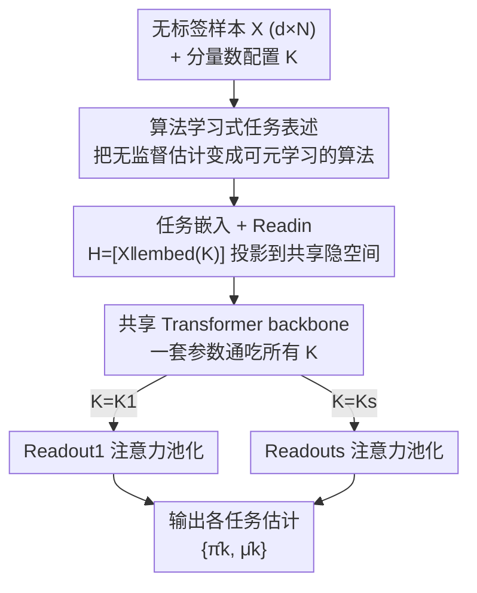

# Transformers as Unsupervised Learning Algorithms: A study on Gaussian Mixtures

**会议**: ICLR2026  
**OpenReview**: [https://openreview.net/forum?id=4hKNGmjXVQ](https://openreview.net/forum?id=4hKNGmjXVQ)  
**代码**: https://github.com/Rorschach1989/transformer-for-gmm  
**领域**: 学习理论  
**关键词**: Transformer, 高斯混合模型, 无监督学习, EM 算法, 谱方法, in-context learning

## 一句话总结
这篇论文用元学习训练一个共享的 transformer（TGMM）去同时求解不同分量数的高斯混合模型参数估计，实验上同时打过 EM 和谱方法各自的软肋，理论上首次证明 transformer 既能近似 EM 算法、又能近似谱方法的核心——三阶张量幂迭代。

## 研究背景与动机
**领域现状**：理解 transformer "为什么强" 的一条主流路线，是把它当成一个能在推理时**隐式跑算法**的工具箱——已有大量工作证明它能 in-context 实现梯度下降、牛顿法、UCB 等。但这些研究几乎全部集中在**监督学习**（回归、分类）上，因为监督任务有现成的标签可以喂进 context。

**现有痛点**：无监督学习这一大块几乎没人从理论上碰过。原因很直接：transformer 本身是用监督方式训练的，而无监督任务**没有标签**，连"该让它学什么"都不好定义。可现实世界里无标签数据才是绝对多数，所以"transformer 能不能、怎么做无监督"是个有实际意义却悬而未决的问题。

**核心矛盾**：要研究无监督，先得找一个干净、有深厚统计学根基、又有清晰"标准答案算法"的任务。高斯混合模型（GMM）正是这样的标杆。但 GMM 的两类经典解法各有死穴：**EM 算法**容易陷入局部最优、对初始化极度敏感；**谱方法**（基于矩/张量分解）不依赖初始化，却要求分量数 $K$ 小于数据维度 $d$，在"低维多分量"场景下直接失效。两者各有一块解不动的地方。

**本文目标**：(i) 能否**可证明地**让 transformer 在 in-context 下求解 GMM？(ii) 能否在**经验上**同时绕开 EM 和谱方法各自的缺陷？

**切入角度**：作者不把 GMM 当成"预测任务"（in-context learning 的标准设定是 context 里有特征+标签），而是把它重新表述成"学习一个**估计算法**"——transformer 吃进一堆无标签样本 $X$ 和一个分量数配置 $K$，直接吐出参数估计 $\hat\theta$。这样无监督的"没有标签"就不再是障碍，因为监督信号来自元训练时已知的真值 $\theta$。

**核心 idea**：用一个共享 backbone 的 transformer，通过在大量合成 GMM 任务上元训练，学出一个"通吃不同 $K$"的 GMM 求解器，并从理论上证明这个 backbone 既能逼近 EM、又能逼近谱方法的张量幂迭代——从而解释它为何能在两种经典方法之间插值取长补短。

## 方法详解

### 整体框架
TGMM（Transformer for Gaussian Mixture Models）要解决的是：**一个模型、一套参数，同时求解多种分量数 $K$ 的 GMM 参数估计**。整条流水线是：把无标签样本矩阵 $X\in\mathbb{R}^{d\times N}$ 和分量数配置 $K$ 拼接 → 投影到共享隐空间 → 过一个共享 transformer backbone → 由"任务专属"的 Readout 模块解码出该 $K$ 对应的 $\{\hat\pi_k,\hat\mu_k\}$。整个模型靠在海量随机合成 GMM 任务上做元训练得到。

GMM 本身定义为 $K$ 个各向同性高斯的混合：

$$p(x\mid\theta)=\sum_{k=1}^{K}\pi_k\,\phi(x;\mu_k),\qquad \phi(x;\mu)=\frac{1}{(2\pi)^{d/2}}\exp\!\Big(-\tfrac12\|x-\mu\|^2\Big),$$

参数 $\theta=\pi\cup\mu$。一个 GMM 任务被定义为三元组 $T=(\theta,X,K)$，求解就是用某算法 $\mathcal A$ 输出 $\hat\theta=\mathcal A(X;K)$。TGMM 把整套 forward 写成：

$$\text{TGMM}_\Theta(X;K)=\text{Readout}_{\Theta_{out}}\big(\text{TF}_{\Theta_{TF}}(\text{Readin}_{\Theta_{in}}([X\,\|\,\text{embed}(K)]))\big).$$

### 关键设计

**1. 算法学习式任务表述：把"没有标签"从障碍变成可元学习的目标**

无监督的核心难点是没有标签，常规 in-context learning 的 context 里必须有 (特征, 标签) 对，GMM 里根本没有。作者的破局点是**不学预测、改学估计**：把要学的对象从"给新样本打标签"换成"输出参数 $\hat\theta=\mathcal A(X;K)$"。这样监督信号来自元训练阶段——每个合成任务的真值 $\theta$ 是已知的，模型只是在学一个把无标签样本映射到参数的**算法**。另一个被显式处理的麻烦是 GMM 的估计对象**结构随未知 $K$ 而变**（$K$ 个均值向量、$K$ 个权重），作者把 $K$ 当成任务配置显式喂进去，让一个模型能服务于一族 $\mathcal K=\{K_1,\dots,K_s\}$。这一步是后面所有设计的地基：正因为问题被表述成"学算法"，才谈得上证明它逼近 EM/谱方法。

**2. 共享 backbone + 任务嵌入 + 任务专属 Readout：一个模型通吃多种 $K$ 且参数高效**

如果对每个 $K$ 单训一个模型，既浪费又无法共享跨任务的统计规律。TGMM 的做法是：先把分量数编码成任务嵌入 $P=\text{embed}(K)$ 并和数据拼接 $H=[X\,\|\,P]$，用一个线性 Readin 投到共享隐空间；中间是**所有 $K$ 共享的** transformer backbone，产出"任务感知"的隐表示；最后由**每个 $K$ 专属的 Readout** 解码。Readout 用一次注意力池化（attentive pooling）：

$$O=(V_oH)\,\text{SoftMax}\big((K_oH)^\top Q_o\big)\in\mathbb{R}^{(d+K)\times K},$$

混合权重 $\hat\pi$ 取 $O$ 前 $K$ 行的行均值池化、均值向量 $\hat\mu$ 取后 $d$ 行。关键的"高效"体现在：除 backbone 外只额外引入 $O(sdD)$ 量级参数（$s$ 个任务、维度 $d$、隐维 $D$），即支持多任务的代价只是若干轻量 Readout，而非复制整个骨干。

**3. 元训练：用随机合成任务逼模型学出"算法"而非记住分布**

TGMM 靠纯合成任务训练。每步先用 TaskSampler 采一批任务：先采分量数 $K\sim p_K$（实现里从 $\{2,3,4,5\}$ 均匀采），再采 GMM 真值 $\theta=(\mu,\pi)$（均值在 $[-5,5]^d$ 均匀采，并用最大成对余弦相似度 0.8 的阈值过滤防止分量塌缩），再采样本量 $N\sim p_N$ 和数据 $X$。训练目标对均值用平方损失、对权重用交叉熵：

$$\hat L_n(\Theta)=\frac1n\sum_{i=1}^n \ell_\mu(\hat\mu_i,\mu_i)+\ell_\pi(\hat\pi_i,\pi_i).$$

由于每个任务的真值分布都现采、样本量也在变，模型无法靠"背下某个固定分布"取巧，只能学到一个对任务分布鲁棒的估计**算法**——这点后面被分布偏移实验直接验证。

**4. 双重逼近定理：transformer 既能逼近 EM、又能逼近谱方法的张量幂迭代**

这是全文的理论核心，回答了"TGMM 为什么能同时占 EM 和谱方法的便宜"。

*定理 1（近似 EM）*：存在一个 $2L$ 层 transformer，对任意 $d\le d_0$、$K\le K_0$ 和满足正则条件的任务 $T$，在合适嵌入下能近似 $L$ 步 EM 并高效估出 $\theta$。证明的灵魂是 **softmax 注意力天然的加权平均性质恰好对应 EM 的更新结构**：E 步算责任度 $\{w_k(X_i)\}$ 本质是一次 softmax 加权，M 步按这些权重重算 $\{\pi_k,\mu_k\}$ 又是一次加权平均，于是"一层注意力 + 一层 MLP（用来近似 $\log x$、$x^2$ 并清理中间项）"刚好实现一步 EM。相对前人（He et al. 2025b）这一结果更"锋利"：层数只需 $O(L)$ 而非依赖分量数的 $O(KL)$；注意力头数只要 $M=O(1)$ 而非趋于无穷；近似界对维度 $d$ 是**多项式**而非指数依赖——这对高维场景至关重要。

*定理 2（近似张量幂迭代）*：直接用 transformer 实现整个谱算法太复杂，作者退一步证明它能精确实现谱方法的核心计算步——三阶张量的幂迭代

$$v^{(j+1)}=T\big(I,\,v^{(j)},\,v^{(j)}\big),$$

并指出它可改写为 $v^{(j+1)}=\sum_{j,m\in[d]} v_jv_m\,T_{:,j,m}$。证明**高度依赖 transformer 的多头结构**：用 $d$ 个注意力头分别处理张量的一个维度，每个头用 Q/K/V 结构算 $\sum_j \sigma(\langle Q_mh_i,K_mh_j\rangle)V_mh_j$（这里 $\sigma$ 取 ReLU 以便技术处理），正好拼出二维求和。作者称这是**首次**证明 transformer 有能力做高阶张量运算。两条定理合起来解释了实验现象：元训练学出的算法能在 EM 与谱方法之间插值，于是哪边经典方法失效（EM 陷局部最优 / 谱方法 $K>d$ 失效），TGMM 都能靠另一边的能力补上。

## 实验关键数据

实验围绕三个研究问题：RQ1 有效性、RQ2 鲁棒性、RQ3 灵活性。默认 backbone 是 GPT-2 式编码器（12 层、4 头、隐维 128），AdamW 训 $10^6$ 步，评测用 $\ell_2$-error（在最优分量置换下比对 $\hat\mu,\hat\pi$）。

### 主实验（RQ1 有效性）
维度 $d\in\{2,8,32,128\}$、分量数 $K\in\{2,3,4,5\}$，对比 EM、谱方法、TGMM（$\ell_2$-error，越低越好）。

| 场景 | EM | 谱方法 | TGMM |
|------|----|--------|------|
| $K=2$（简单） | ≈0 | ≈0 | ≈0，三者都好 |
| $K$ 增大（更难） | 陷局部最优、明显变差 | 较好 | 与谱方法相当，明显优于 EM |
| $K>d$（低维多分量） | 可跑但差 | **直接失效**（假设要求 $K<d$） | 正常工作，优于 EM |

结论：TGMM 在 EM 失效（局部最优）和谱方法失效（$K>d$）的两类硬场景下都能站住，是唯一全程不"塌"的方法。

### 鲁棒性与灵活性（RQ2 / RQ3）

| 配置 | 关键现象 | 说明 |
|------|---------|------|
| 样本量偏移 $N_{train}\!\to\!128$ | 32→128 / 64→128 仅"优雅退化" | OOD 测试只比 in-domain 略差，没崩 |
| 采样分布偏移（均值扰动 $\sigma_p\in[0,10]$，$d=8$） | $K>2$ 时仍优于 EM | 证明学到的是算法、不是过拟合训练分布 |
| 换 backbone 为 Mamba2 | 有非平凡效果但整体逊于 transformer | 线性注意力也行，但同复杂度下不如 transformer |
| 放松为各向异性 GMM | 趋势与各向同性一致，优于 EM（谱方法不适用） | TGMM 可扩展到更复杂任务 |

### 关键发现
- **TGMM 的价值在"补短"而非"全面碾压"**：$K=2$ 时三者并列，真正拉开差距是在 EM 陷局部最优、谱方法因 $K>d$ 失效的场景——TGMM 像是在两种经典方法之间插值取长补短，与理论的双重逼近结论完全对应。
- **分布偏移下不崩 = 学到了算法**：样本量和采样分布双重 OOD 测试都只是"优雅退化"，印证元训练学到的是一个估计算法，而非记住某个训练分布。
- **架构选择有讲究**：多头结构是逼近张量幂迭代的关键（定理 2），实验里 Mamba2 backbone 整体逊于 transformer，侧面支持了注意力结构对这类计算的适配性。

## 亮点与洞察
- **把无监督"翻译"成可元学习的算法学习问题**：不纠结"没有标签怎么办"，而是改学"输出参数估计"，监督信号从真值来——这个重述是整篇能成立的支点，思路可迁移到其他经典无监督任务（聚类、密度估计、矩估计）。
- **softmax 注意力 ↔ EM 加权更新的对应非常优雅**：E 步算责任度、M 步加权重估，本质都是 softmax 加权平均，于是"注意力层+MLP层=一步 EM"水到渠成；这是"为什么 attention 适合做 EM"的一个干净直觉。
- **首次证明 transformer 能做高阶张量运算**：用 $d$ 个注意力头分担张量一个维度来实现三阶张量幂迭代，把"多头"从工程 trick 上升为可证明的计算资源，对后续理论分析很有启发。
- **理论比前人更紧**：层数从 $O(KL)$ 降到 $O(L)$、头数从 $M\to\infty$ 降到 $O(1)$、维度依赖从指数降到多项式——这些不是常数改进，而是让结论在"真实规模、高维"下才有意义。

## 局限与展望
- **任务局限在（各向同性为主的）GMM**：虽然扩展到了各向异性，但整体仍是合成 GMM，离真实世界的无监督任务（高维结构化数据、非高斯混合）还有距离；作者也把这当作未来方向。
- **理论是"存在性"逼近，不等于元训练一定学到这个解**：定理证明存在某个 transformer 能近似 EM/张量幂迭代，但 TGMM 通过梯度训练得到的参数是否真落在这个构造附近，并没有训练动力学层面的保证——经验现象与理论"一致"是间接证据，不是充要。
- **谱方法只逼近了核心步骤**：定理 2 实现的是张量幂迭代这一关键步，而非完整谱算法，"transformer 能否端到端实现整套谱方法"仍未解决。
- **规模与公平性**：实验在合成任务、相对小的 backbone 上做；作者在 Remark 1 自辩 TGMM 多拿的只是分布信息，但元训练 vs 单任务经典算法的比较口径仍值得读者留意。

## 相关工作与启发
- **vs in-context learning 一系（Bai et al. 2023 / Von Oswald et al. 2023 / Akyürek et al. 2023）**：他们证明 transformer 能 in-context 跑梯度下降、牛顿法等**监督**算法（回归/分类，context 含标签）；本文把战场搬到**无监督**，并改"学预测"为"学估计"，是对这条线的范式补全。
- **vs He et al. (2025b)（transformer 做多类 GMM 聚类）**：设定最接近，但他们做**聚类**、本文做**参数估计**；更关键是本文的逼近界更紧——层数 $O(L)$ vs $O(KL)$、头数 $O(1)$ vs $M\to\infty$、维度多项式 vs 指数依赖，且他们实验用的小 transformer 不足以验证其理论主张。
- **vs He et al. (2025a)（transformer 实现 PCA 并用于 GMM 聚类）/ Jin et al. (2024)（混合线性模型 ICL）**：两者的理论构造都被限制在**两分量**情形，本文覆盖一般 $K$；Jin et al. 还存在 ReLU 假设与所引关键引理依赖 softmax 的不一致问题。
- **启发**：把经典统计算法（EM、谱/张量方法）当作"transformer 该去逼近的目标"，再反过来用注意力的结构性质去解释可逼近性，是一条可复制的"理论解释 transformer 能力"的方法论——下一步可推广到 HMM、变分推断、矩匹配等更广的无监督/隐变量模型。

## 评分
- 新颖性: ⭐⭐⭐⭐⭐ 首次系统从理论+实验研究 transformer 做无监督 GMM，并首证其能做高阶张量运算
- 实验充分度: ⭐⭐⭐⭐ 有效性/鲁棒性/灵活性三问 + Mamba2 与各向异性扩展，但限于合成任务与较小规模
- 写作质量: ⭐⭐⭐⭐⭐ 理论与实验对照清晰，逼近界相对前人的"锋利"之处交代到位
- 价值: ⭐⭐⭐⭐ 为"transformer 作为无监督学习算法"打开理论缺口，方法论可迁移到更广的隐变量模型

<!-- RELATED:START -->

## 相关论文

- [\[ICLR 2026\] Continuum Transformers Perform In-Context Learning by Operator Gradient Descent](continuum_transformers_perform_in-context_learning_by_operator_gradient_descent.md)
- [\[ICLR 2026\] Decision-Theoretic Approaches for Improved Learning-Augmented Algorithms](decision-theoretic_approaches_for_improved_learning-augmented_algorithms.md)
- [\[ICLR 2026\] Transformers with Endogenous In-Context Learning: Bias Characterization and Mitigation](transformers_with_endogenous_in-context_learning_bias_characterization_and_mitig.md)
- [\[ICML 2026\] Robustness of Mixtures of Experts to Feature Noise](../../ICML2026/learning_theory/robustness_of_mixtures_of_experts_to_feature_noise.md)
- [\[ICLR 2026\] Transformers Are Inherently Succinct](transformers_are_inherently_succinct.md)

<!-- RELATED:END -->
