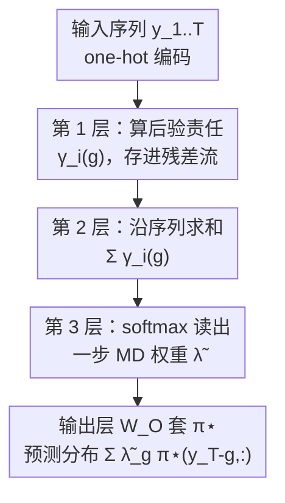

# Transformers Learn Latent Mixture Models In-Context via Mirror Descent

**会议**: ICLR 2026  
**OpenReview**: [https://openreview.net/forum?id=SHidElLSVt](https://openreview.net/forum?id=SHidElLSVt)  
**代码**: 无  
**领域**: 学习理论 / 上下文学习 / 机制可解释性  
**关键词**: in-context learning, mirror descent, mixture of transition distributions, 注意力机制, 隐变量推断

## 一句话总结
本文提出基于「转移分布混合（MTD）」的上下文学习任务，让 transformer 在上下文中推断每个历史 token 的因果重要性（混合权重 $\lambda$），并给出一个三层 disentangled transformer 的显式构造，证明它**精确实现了一步镜像下降（Mirror Descent）**，且该一步估计量是贝叶斯最优预测器的一阶近似；从零训练的 transformer 在预测分布、注意力模式与所学转移矩阵上都与该构造高度吻合。

## 研究背景与动机
**领域现状**：机制可解释性已经能解释一部分上下文学习（ICL）现象——人们发现 transformer 会在内部「实现」某种已知算法。比如在线性回归任务上，它学到的是基于梯度的优化（preconditioned gradient descent）；在马尔可夫链上，它学到的是对转移概率做计数的估计器（counting estimator）。这些工作把「transformer 在前向传播里跑了什么算法」讲清楚了。

**现有痛点**：但这些成功都局限在**因果结构固定**的问题上。线性回归里，模型只需知道「每个偶数 token 依赖前一个奇数 token」；马尔可夫链里，模型只需知道「下一个 token 只依赖前一个」。也就是说，token 之间的依赖关系是**静态、预先约定好的**，模型不需要从上下文里推断「谁影响谁」。

**核心矛盾**：真实序列数据（尤其是语言）恰恰违反这种简单性。一句话的含义不是词义的固定拼接，而来自词与词之间**动态、需从上下文推断的因果链接**。如论文图 1 的例子「The dog that saw the bird threw the ball, and then ran to ___」，要预测 fetch，模型不能靠「就近原则」，而必须推断隐结构：dog 是施事、ball 是相关客体、bird 是干扰项。一个历史 token 的影响力不是它位置的函数，而是它**被推断出来的角色**的函数。这种对未观测隐变量（句法角色、说话人意图、话题）的推断能力是智能的标志，但既有 ICL 理论完全没覆盖。

**本文目标**：把「估计历史 token 的重要性」形式化成一个隐变量上下文学习问题，并回答核心问题——**transformer 能否在上下文中推断隐结构？它学到的是什么算法？**

**切入角度**：作者引入统计学里的「转移分布混合（Mixture of Transition Distributions, MTD）」模型作为合成任务。MTD 把「下一个 token 的分布」写成对若干历史滞后（lag）的混合，每个 lag 上套同一个转移矩阵 $\pi^\star$，而**混合权重 $\lambda$ 决定每个历史位置的相对影响**。关键巧思在于：$\pi^\star$ 是静态的、可以在预训练时存进权重里（in-weight 学习），而 $\lambda$ 每条序列都不同、必须从单条序列里现场推断（in-context 学习）。这正好同时刻画了 LLM 的两种学习模式。

**核心 idea**：证明 transformer 通过「实现一步镜像下降」来从上下文推断混合权重 $\lambda$，从而动态判断哪些历史 token 是因果相关的——把基于梯度的 ICL 解释从回归任务推广到了离散 token 的序列建模。

## 方法详解

### 整体框架
任务设定如下：固定一个 $q\times q$ 的行随机转移矩阵 $\pi^\star$；对每条序列，先从 $\mathrm{Dirichlet}(\alpha=1)$ 采一个混合权重向量 $\lambda$，再按 MTD 模型（阶数 $m$）生成 token 序列 $y=(y_1,\dots,y_T)$。MTD 的预测分布是

$$P(Y_t=y_t \mid y_1^{t-1}, \lambda) = \sum_{g=1}^{m} \lambda_g\,\pi(y_{t-g}, y_t),$$

即「对前 $m$ 个滞后位置各应用一次 $\pi$，再按 $\lambda$ 加权混合」。模型的目标是预测下一个 token，等价于**在上下文中把这条序列特有的隐权重 $\lambda$ 估计出来**。

最优解是贝叶斯预测分布，其权重是后验均值 $\hat\lambda^{\text{Bayes}}_g=\mathbb{E}[\lambda_g\mid y_1^t,\alpha]$。但 Dirichlet 先验与 MTD 似然**不共轭**，后验没有闭式，积分无法直接算——这就逼出了用迭代优化做点估计。由于 $\lambda$ 活在概率单纯形 $\Delta^{m-1}$ 上，作者选用**镜像下降（Mirror Descent）**：以负熵为势函数时它退化为指数梯度（Exponentiated Gradient）算法，更新规则是乘性的、天然贴合单纯形几何。本文不迭代到收敛，而是从单纯形中心 $\lambda^{(0)}=(1/m,\dots,1/m)$ 出发**只走一步**，得到一个非迭代、带正则的 MLE 近似。

整篇方法的骨架就是：**把这个「一步 MD 估计量」用一个三层 disentangled transformer 精确搭出来**，每一层负责估计公式里的一块，最后用输出矩阵套上 $\pi^\star$ 给出预测分布。

### 关键设计

**1. MTD 上下文学习任务：把「token 重要性」转写成隐混合权重的可控测试床**

既有 ICL 理论的盲区是依赖结构固定、模型不必推断「谁影响谁」。MTD 用一个隐开关变量 $Z_t\in\{1,\dots,m\}$ 来选「当前 token $Y_t$ 由哪个滞后位置 $Y_{t-g}$ 生成」，$P(Z_t=g)=\lambda_g$；边缘化掉 $Z_t$ 就得到上面那个混合预测分布。它只需 $m-1+q(q-1)$ 个参数，比完整 $m$ 阶马尔可夫链的 $q^m(q-1)$ 省得多，却能表达不同的「有效上下文」。最妙的是任务设计把两种学习显式解耦：转移矩阵 $\pi^\star$ 全局共享、可在预训练时写进权重（in-weight）；混合权重 $\lambda$ 每序列重采、只能从单条序列推断（in-context）。这一刀切开正好对应 LLM「记不住完整高阶 n-gram、却能存低阶统计并按上下文动态重加权」的现实处境，给「in-weight 与 in-context 如何协作」提供了干净的研究对象。

**2. 一步镜像下降估计量：用单步指数梯度逼近不可解的后验均值**

后验均值算不出来，作者退而求其次取点估计，但 MLE/MAP 同样不可解析、且 MAP 是后验众数（与最优所需的后验均值不重合），因此用迭代法。镜像下降在负熵势 $\Psi(\lambda)=-H(\lambda)$ 下给出乘性更新

$$\lambda_g^{(k+1)}=\frac{\lambda_g^{(k)}\exp(\eta\,\nabla_\lambda \ell(\lambda^{(k)})_g)}{\sum_{h}\lambda_h^{(k)}\exp(\eta\,\nabla_\lambda \ell(\lambda^{(k)})_h)}.$$

从均匀初始化只走一步，得到闭式估计量

$$\hat\lambda^{\text{MD}}_g=\frac{\exp\!\big(\eta m\sum_{k=m+1}^{t}\gamma_k(g)\big)}{\sum_{j}\exp\!\big(\eta m\sum_{k=m+1}^{t}\gamma_k(j)\big)},\quad \gamma_k(g)=\frac{\pi(y_{k-g},y_k)}{\sum_{h}\pi(y_{k-h},y_k)}.$$

这里 $\gamma_k(g)$ 是「在均匀先验下，第 $k$ 步由滞后 $g$ 负责生成」的**后验责任（responsibility）**——它只用一次转移概率的比值就能算。把这些责任沿序列累加、过一个 softmax（学习率 $\eta$ 控制锐度），就得到对 $\lambda$ 的估计。整个估计量「算责任 → 求和 → softmax」三步结构，正是后面三层 transformer 要对号入座搭出来的东西。

**3. 三层 transformer 显式构造：用相对位置编码把责任、求和、读出各放一层**

这是本文的技术核心，给出一个单头、$d_0=q$、$d_R\ge m$ 的三层 disentangled transformer，**精确**实现上面的一步 MD 估计量。disentangled transformer 去掉 MLP、用拼接代替残差（保留各层全部计算）、用单个注意力矩阵代替 Q/K 分离，便于把每一步算什么看得一清二楚；关键是用相对位置编码（RPE）做信息路由。三层分工如下：

- **第 1 层（算责任）**：把注意力矩阵设成 $W_A^{(1)}=(\log\pi^\star)^\top$，于是 one-hot 输入下注意力分数 $e_{ij}=\log\pi^\star(y_j,y_i)+$ 位置偏置。位置查找表 $R_A^{(1)}$ 用大常数 $\delta_1$ 把注意力**限制在前 $m$ 个滞后**上，softmax 后注意力权重恰好等于责任 $A^{(1)}_{ij}=\gamma_i(i-j)$；再用 $R_V^{(1)}$ 的 one-hot 把「滞后 $g$ 的责任」拷进残差流里专门的维度，输出 $\hat h^{(1)}_i=\sum_g \gamma_i(g)\,\mathrm{Concat}(e_{y_{i-g}}, e_g)$，底部子块就显式存着责任向量 $\Gamma_i=(\gamma_i(1),\dots,\gamma_i(m))$。
- **第 2 层（求和）**：关掉内容注意力（$W_A^{(2)}=0$）和 value-RPE（$R_V^{(2)}=0$），只靠位置偏置让末位查询对位置 $m+1\dots T$ 做**均匀注意力** $1/(T-m)$，于是输出在对应子块里得到 $\frac{1}{T-m}\sum_{j=m+1}^T\Gamma_j$，正是一步 MD 所需的平均责任。
- **第 3 层（读出）**：把 $R_A^{(3)}$ 构造成对齐到平均责任子块的「缩放 one-hot」选择器，用点积把第 $g$ 个平均责任读出来当注意力分数 $\propto \beta\sum_i\gamma_i(g)/(T-m)$，softmax 后注意力权重恰好就是 MD 权重 $\tilde\lambda_g$，其中 $\beta$ 是可学习的缩放学习率。最后输出层 $\widetilde W_O$ 把 $\pi^{\star\top}$ 存在对应子块，作用到 $\sum_g\tilde\lambda_g e_{y_{T-g}}$ 上，给出预测分布 $\sum_g\tilde\lambda_g\,\pi^\star(y_{T-g},:)$，与 MTD 预测分布形式完全一致。

> ⚠️ 上述各层的 $\delta_1,\delta_2,\delta_3$ 都是在「取极限趋于无穷」意义下让 softmax 退化为硬选择/均匀注意力，具体矩阵形式以原文 Proposition 3 证明为准。

### 损失函数 / 训练策略
从零训练时用 Adam，对序列**最后一个 token** 的预测做 MSE 损失，训练 $5\times10^5$ 步，batch size $B=128$（每步重采 $\{\lambda_i\}$）。对照分析时，$\hat\lambda^{\text{MD}}$ 的 $\eta$ 与构造模型的 $\beta$ 都用网格搜索调到最小化与真值的 KL。理论侧还给出两条支撑：① 一步 MD 与贝叶斯后验均值在「无证据点 $g=0$」处一阶等价，当 $\eta=\frac{1}{m+1}$ 时成立（Theorem 1）；② 由相对光滑常数 $L_{\text{rel}}\le (T-m)m^2$ 推出稳定步长 $\eta=\Theta(1/T)$ 的缩放律（Theorem 2），与 transformer 学到的行为吻合。

## 实验关键数据

### 主实验
合成 MTD 任务上，比较「从零训练的 disentangled / standard transformer」「理论构造 $\tilde T_{\text{constr}}$」「一步 MD 估计 $\hat\lambda^{\text{MD}}$」「贝叶斯最优 $\hat\lambda^{\text{Bayes}}$（MCMC 算）」与真值转移概率的 KL 散度。

| 对比对象 | 短序列表现 | 长序列表现 | 关键结论 |
|----------|-----------|-----------|----------|
| 训练 transformer（disentangled / standard） | 贴合一步 MD 与构造 | 同步变次优 | 训练模型确实学到构造解 |
| 一步 MD $\hat\lambda^{\text{MD}}$ | 是贝叶斯的好代理 | 偏离贝叶斯 | 验证 Theorem 1 一阶等价 |
| 注意力图 / $\mathrm{softmax}(W_A^{(1)})$ | 责任高低位置、对角带结构与构造一致；首层注意力逼近真值 $\pi^\star$（例：SeqLen 192，KL=0.0376） | — | 训练模型的内部机制 = 构造机制 |

### 多步 MD 与更深模型

| 配置 | 对照 | 关键发现 |
|------|------|---------|
| 5 层训练 transformer $\tilde T_{\text{train}}$ | 多步 MD $\hat\lambda^{\text{MD},k}$ | 性能紧贴 **2 步 MD**（$k=2$）曲线 |
| 长序列 / 多种子 | — | 偶尔跌破 2 步曲线，提示学到的估计未必绑定 2 步 MD、可能利用了额外结构 |

作者强调这是**性能比较而非收敛/最优性断言**：不主张 transformer 收敛到 2 步 MD 解，只说明更深模型有能力实现「精度至少与多步 MD 相当」的估计器。

### 关键发现
- 三层构造不是纸面存在：从零用梯度下降训练的 transformer（无论 disentangled 还是 standard）在预测分布、注意力模式、所学转移矩阵三方面都收敛到构造解，说明「实现一步 MD」是可被 SGD 自然学到的解。
- 一步 MD 的好坏依赖序列长度：短序列梯度小、一阶近似准，逼近贝叶斯；长序列高阶项变大就偏离——这正是 Theorem 1 的边界。
- 早停即隐式正则：迭代 MD 到收敛会退化成次优的 MLE，而少走几步（早停）反而更贴近贝叶斯均值，等价于在熵正则路径 $\min_\lambda -\ell(\lambda)+\gamma H(\lambda)$ 上选了个好的正则点。

## 亮点与洞察
- **把抽象算法逐层「焊」进权重**：最巧的是用 RPE 做信息路由，让第 1 层算责任、第 2 层求和、第 3 层 softmax 读出，三层恰好对应一步 MD 的「责任 → 累加 → softmax」三段——这是一种可复用的「按算法步骤拆层」构造范式。
- **in-weight 与 in-context 的干净解耦**：$\pi^\star$ 存权重、$\lambda$ 推上下文，这个设定本身就是一个能单独研究两种学习如何协作的测试床，可迁移去研究别的「全局知识 + 局部适配」问题。
- **学习率缩放 $\eta=\Theta(1/T)$ 的理论与实证对齐**：从相对光滑常数推出的步长缩放，竟和 transformer 训练后表现出的行为一致，是「构造不是硬凑、而是模型真会这么做」的有力旁证。
- **把梯度式 ICL 解释推广到离散序列**：此前「transformer 在前向跑优化算法」主要在连续回归里讲清，本文第一次在离散 token 的隐变量序列建模上给出同等清晰的算法级解释。

## 局限与展望
- **合成任务、已知 $\pi^\star$**：构造与多数分析假设转移矩阵已知且固定、阶数 $m$ 已知，距离真实语言里结构未知、词表巨大、依赖跨度可变还有距离。
- **只精确构造了一步**：多步 MD 的显式构造「非平凡，留作未来工作」；5 层模型贴合 2 步 MD 只是性能层面的观察，并未证明它在实现多步 MD，作者自己也指出偶尔跌破 2 步曲线、可能利用了别的结构。
- **改进思路**：把构造推广到未知 $\pi^\star$、把「早停 MD ≈ 熵正则路径上的好点」这一隐式正则视角延展到真实 LLM、以及验证「中间层责任表示是否被跨步复用」，都是顺势可做的方向。

## 相关工作与启发
- **vs 线性回归 ICL（Von Oswald / Akyürek / Ahn 等）**：他们证明 transformer 在回归上实现（预条件）梯度下降，但依赖结构固定、无需推断隐变量；本文把舞台换到离散序列 + 隐混合权重，证明实现的是**镜像下降**而非普通 GD（因为要在单纯形上优化）。
- **vs 马尔可夫链 ICL（Nichani / Edelman / Bietti 等）**：他们的 transformer 学的是对转移概率的计数估计，依赖也只到前一个 token；本文把任务推到高阶、且核心难点是**动态推断哪个滞后相关**，机制从「计数」升级为「算责任 + 一步 MD」。
- **vs 用混合模型/HMM 研究 ICL（Pathak / Xie 等）**：前人也用混合模型或 HMM 框架研究 ICL，但没揭示 transformer 推断隐混合权重的**具体机制**；本文给出层级化的显式构造，把「黑箱里到底跑了什么」讲到了算法和矩阵级别。

## 评分
- 新颖性: ⭐⭐⭐⭐⭐ 首次在离散序列隐变量任务上给出「transformer = 一步镜像下降」的精确构造，把梯度式 ICL 解释拓到新领域。
- 实验充分度: ⭐⭐⭐⭐ 合成任务上多角度验证（预测分布/注意力/转移矩阵/多步），但限于合成设定与已知 $\pi^\star$。
- 写作质量: ⭐⭐⭐⭐⭐ 从动机、模型、构造到理论分析层层递进，三层构造的逐层推导清晰可复述。
- 价值: ⭐⭐⭐⭐⭐ 为理解注意力机制中的隐变量推断提供了新的算法级视角，in-weight/in-context 解耦测试床有方法论价值。

<!-- RELATED:START -->

## 相关论文

- [\[ICLR 2026\] In-Context Algorithm Emulation in Fixed-Weight Transformers](in-context_algorithm_emulation_in_fixed-weight_transformers.md)
- [\[ICLR 2026\] Continuum Transformers Perform In-Context Learning by Operator Gradient Descent](continuum_transformers_perform_in-context_learning_by_operator_gradient_descent.md)
- [\[ICLR 2026\] Transformers with Endogenous In-Context Learning: Bias Characterization and Mitigation](transformers_with_endogenous_in-context_learning_bias_characterization_and_mitig.md)
- [\[ICLR 2026\] Adversarially Pretrained Transformers May Be Universally Robust In-Context Learners](adversarially_pretrained_transformers_may_be_universally_robust_in-context_learn.md)
- [\[ICLR 2026\] Critical Attention Scaling in Long-Context Transformers](critical_attention_scaling_in_long-context_transformers.md)

<!-- RELATED:END -->
