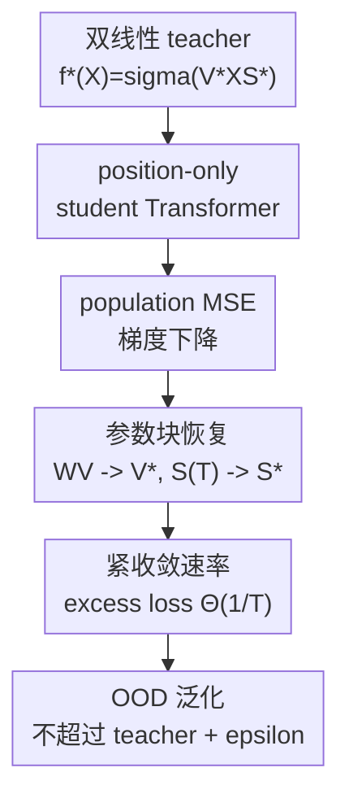

# Transformers Trained via Gradient Descent Can Provably Learn a Class of Teacher Models

**会议**: ICLR 2026  
**OpenReview**: [https://openreview.net/forum?id=ukiRIdgoIF](https://openreview.net/forum?id=ukiRIdgoIF)  
**代码**: 无  
**领域**: 学习理论 / Transformer理论 / 可证明优化  
**关键词**: Transformer理论、梯度下降、teacher-student学习、双线性结构、OOD泛化

## 一句话总结
这篇论文证明，一层带 position-only attention 的 Transformer 在人口风险上用梯度下降训练时，可以以紧的 $\Theta(1/T)$ 速率学习一大类共享双线性结构的 teacher model，并在温和二阶矩条件下继承 teacher 的分布外泛化能力。

## 研究背景与动机
**领域现状**：Transformer 的经验成功已经覆盖 NLP、视觉、强化学习等很多任务，但理论解释往往只能盯住单个简化任务，例如 in-context 线性回归、patch association、sparse token selection 或 group-sparse linear model。这样的理论结果很有启发，却很难回答一个更宽的问题：同一个 self-attention 机制为什么能在看起来差异很大的结构化任务里都学得动。

**现有痛点**：已有工作通常把任务、数据分布和 Transformer 简化结构绑得很紧。比如 sparse token selection 的理论会专门分析目标 token 如何由 query 指定，group-sparse linear classification 的理论会专门分析类别标签由某个 feature group 决定。这些设置能给出清晰的学习动力学，但结论不容易迁移到卷积平均池化、图卷积或回归式 group-sparse predictor 这类相邻任务。

**核心矛盾**：Transformer 理论需要足够简化才能证明训练收敛，但如果简化到只覆盖一个玩具任务，就解释不了 Transformer 在多类结构化模型之间复用同一种注意力机制的能力。本文抓住的共同点是：许多 teacher 的输出都可以写成一个“值矩阵作用在输入特征上，再经过一个稀疏平均式 score 矩阵混合 token”的双线性形式。

**本文目标**：作者希望建立一个统一的 teacher-student 框架，证明 student Transformer 不只是预测函数值接近 teacher，而是能够恢复 teacher 的核心参数块，包括 value matrix 和 attention/softmax score pattern；同时还要说明训练好的 student 在非训练分布上不会比 teacher 差太多。

**切入角度**：论文把 teacher 写成 $f^*(X)=\sigma(V^*XS^*)$。其中 $V^*$ 对应每个输出通道的线性 filter，$S^*$ 对应 token、patch、节点或 feature group 之间的稀疏平均关系。这样一来，卷积层加平均池化、规则图上的图卷积、固定目标集合的 sparse token selection、group-sparse linear regression 都能落到同一个形式里。

**核心 idea**：用一个一层 position-only attention Transformer 作为 student，通过人口均方误差上的梯度下降去拟合双线性 teacher，并证明训练轨迹会同时恢复 $V^*$ 和 $S^*$。

## 方法详解

### 整体框架
本文不是提出一个新的实用训练算法，而是在一个足够干净的理论模型里解释 Transformer 可以学什么、如何学、学到什么程度。整个框架先定义一类双线性 teacher model，再把一层 Transformer 简化成 value matrix $W_V$ 与 key-query matrix $W_{KQ}$ 两个可训练块，最后分析梯度下降在 population loss 上的轨迹。

Teacher 接收输入矩阵 $X\in\mathbb{R}^{d\times D}$，输出

$$
f^*(X)=\sigma(V^*XS^*),
$$

其中 $S^*\in\mathbb{R}^{D\times D}$ 的每一列只有 $K$ 个非零项且值为 $1/K$。这意味着 teacher 的每个输出 token 只平均若干个相关输入位置，再由 $V^*$ 做通道变换。Student Transformer 则把输入特征 $X$ 与固定位置编码 $P$ 拼成 $Z$，用 $W_{KQ}$ 只根据位置编码生成 attention score，用 $W_V$ 只作用在特征上。

论文分析的训练目标是 population MSE：

$$
L(W_V;W_{KQ})=\frac{1}{2}\mathbb{E}_{X,Y}\|Y-\mathrm{TF}(Z;W_V,W_{KQ})\|_F^2,
$$

其中标签由 $Y=f^*(X)+E$ 给出，$E$ 是零均值噪声。优化使用普通梯度下降，从 $W_V^{(0)}=0, W_{KQ}^{(0)}=0$ 出发，分别更新 $W_V$ 和 $W_{KQ}$。理论证明的重点是：虽然 Transformer 的参数化包含 softmax attention 的非线性，训练轨迹仍会保持一种低维结构，使问题可以化约为少数标量动态的收敛分析。

### 关键设计
**1. 双线性 teacher 类：把不同结构化任务压到同一个 $V^*XS^*$ 形式**

本文的第一个关键动作是把“Transformer 能学不同任务”转成“Transformer 能学同一种代数结构”。Teacher 的输出 $f^*(X)=\sigma(V^*XS^*)$ 里，$V^*$ 管每个通道怎么读输入特征，$S^*$ 管哪些 token、patch、节点或 feature group 应该被平均。由于 $S^*$ 每列只有 $K$ 个 $1/K$，它既可以表示卷积平均池化的局部 patch group，也可以表示 cycle graph 上每个节点聚合自己和相邻节点，还可以表示固定目标 token 集合或 label-relevant group。

这个统一形式的好处是，它没有把注意力理论锁死在某个单一任务上。卷积层加平均池化可以写成 $\sigma(V^*X[\mathbf{1}_{g_1},\ldots,\mathbf{1}_{g_J}]/K)$；规则图卷积可以写成每列对邻域节点取均值；sparse token selection 则是让目标 token 对应的行在 $S^*$ 中非零。也就是说，attention 要学习的不是一个抽象的“选择能力”，而是一个具体的稀疏平均矩阵 $S^*$。

**2. position-only attention：把 attention score 的学习集中到位置结构上**

标准 self-attention 同时用输入特征和位置编码计算 attention，直接分析完整 Transformer 的训练轨迹会非常困难。论文采用 position-only attention：$W_V$ 只乘在输入特征 $X$ 上，$W_{KQ}$ 只通过固定位置编码 $P$ 产生 score。Student 的形式可以概括为

$$
\mathrm{TF}(Z;W_V,W_{KQ})=\sigma(W_V X S(W_{KQ})),
$$

其中 $S(W_{KQ})$ 是由 $P^\top W_{KQ}P/\sqrt{D}$ 经过 softmax 得到的 attention score。这样 student 与 teacher 在形式上对齐：$W_V$ 对应 $V^*$，$S(W_{KQ})$ 对应 $S^*$。

这个简化不是随意删模块。作者先观察完整一层 Transformer 训练后的参数热图，发现主要更新集中在 value 矩阵左块和 key-query 矩阵右下块；这些块正好对应简化模型里的 $W_V$ 和 $W_{KQ}$。因此 position-only attention 更像是在保留训练中真正活跃的理论核心，而不是换一个完全不同的模型。

**3. 梯度下降轨迹不变量：把矩阵训练化约成可控的标量动态**

最难证明的地方在于，softmax attention 的参数 $W_{KQ}$ 并不会线性地接近 $S^*$。论文的证明思路是展示训练过程中 $W_V^{(t)}$ 与 $W_{KQ}^{(t)}$ 会保持特殊分解：

$$
W_V^{(t)}=C_1(t)V^*,
$$

而 $W_{KQ}^{(t)}$ 可以写成“目标位置方向的正项”减去“非目标位置方向的负项”。若 $G_i$ 表示第 $i$ 列 $S^*$ 中非零位置集合，那么证明草图中有类似

$$
W_{KQ}^{(t)}=C_2(t)\sum_i\sum_{i'\in G_i}p_{i'}p_i^\top-C_3(t)\sum_i\sum_{i'\notin G_i}p_{i'}p_i^\top.
$$

这个结构解释了为什么 attention 会逐渐把概率质量推到 teacher 指定的位置集合上：目标位置的 logit 被抬高，非目标位置的 logit 被压低。于是参数恢复问题不再是任意高维矩阵的非凸优化，而是分析 $C_1(t),C_2(t),C_3(t)$ 如何随梯度下降演化。最终 $C_1(t)\to 1$，attention score $S^{(t)}\to S^*$，student 才真正“学会”teacher 的参数块。

**4. 从参数恢复到 OOD 泛化：让 student 的风险跟随 teacher 而不是只拟合训练分布**

Theorem 3.1 证明的是训练分布为高斯输入、标签来自 noisy teacher 时的参数恢复和 excess loss 收敛。论文进一步问：如果测试分布不是高斯，标签甚至不一定由 teacher 生成，训练好的 student 是否还能稳定？Theorem 3.2 的回答是，只要 OOD 输入列和响应列有有界二阶矩，那么足够训练后

$$
L_{\mathrm{OOD}}(W_V^{(T)},W_{KQ}^{(T)})\leq \frac{1}{2}\mathbb{E}\|\widetilde{Y}-f^*(\widetilde{X})\|_F^2+\epsilon.
$$

这条结论的含义很直接：student 在 OOD 上至多比 teacher 多一个 $\epsilon$ 的损失。它没有声称 teacher 在任意分布上都好，而是说只要 teacher 对某个 OOD 分布表现如何，训练好的 Transformer 就能模仿到接近那个水平。这比只报告训练 loss 收敛更有说服力，因为它把“参数块恢复”连接到了实际的分布外预测风险。

### 一个完整示例
以“学习卷积层 + 平均池化”为例，输入图像被拆成 $D$ 个 patch，每个 patch 是 $x_i\in\mathbb{R}^d$。Teacher 先用 $M$ 个卷积核组成的 $V^*$ 对每个 patch 做线性响应，再把相邻 $K$ 个 patch 按 pooling group 平均，最后经过 ReLU 或 Leaky ReLU。这个过程可以写成 $f^*(X)=\sigma(V^*XS^*)$，其中 $S^*$ 是按 pooling group 排列的块对角矩阵，每个块内元素约为 $1/K$。

Student Transformer 看到的是同样的 patch 特征加固定位置编码。训练开始时，attention score 接近均匀分布，$W_V$ 也还没有对齐卷积核。随着 population MSE 上的梯度下降推进，$W_V$ 的方向快速向 $V^*$ 靠拢；与此同时，$W_{KQ}$ 会让同一 pooling group 内的位置之间 attention logit 变大，让组外位置变小。收敛后，attention heatmap 呈现块对角图案，每个块内的主要值接近 $1/4$（论文 synthetic CNN 实验中 $K=4$），这正对应 teacher 的平均池化矩阵。

MNIST 实验提供了一个更接近真实数据的版本。作者先训练一个两层 CNN，再抽出第一层卷积加 $3\times3$ 平均池化作为 teacher；student Transformer 用 MSE 去拟合这个 hidden output。最终 $W_V$ 与 teacher 卷积核 $V^*$ 的 cosine similarity 超过 0.9，attention heatmap 也大体复现平均池化结构。没有学好的位置主要集中在图片边界的纯背景 patch，这说明失败不是理论结构完全不对，而是这些位置几乎没有信息可供监督信号区分。

### 损失函数 / 训练策略
训练目标是 population mean squared error，而不是有限样本 empirical risk：

$$
L(W_V;W_{KQ})=\frac{1}{2}\mathbb{E}_{X,Y}\|Y-\mathrm{TF}(Z;W_V,W_{KQ})\|_F^2.
$$

标签为 $Y=f^*(X)+E$，因此即使用 ground-truth teacher 也存在不可约噪声项

$$
L_{\mathrm{opt}}=\frac{1}{2}\mathbb{E}\|E\|_F^2.
$$

论文关心的是 excess loss $L(W_V;W_{KQ})-L_{\mathrm{opt}}$。梯度下降更新为

$$
W_V^{(t+1)}=W_V^{(t)}-\eta\nabla_{W_V}L(W_V^{(t)};W_{KQ}^{(t)}),
$$

$$
W_{KQ}^{(t+1)}=W_{KQ}^{(t)}-\eta\nabla_{W_{KQ}}L(W_V^{(t)};W_{KQ}^{(t)}),
$$

初始化为 $W_V^{(0)}=0,W_{KQ}^{(0)}=0$。在 $D\geq\Omega(\mathrm{poly}(M,K))$ 且 $\eta\leq O(M^{-1}D^{-5/2})$ 的条件下，Theorem 3.1 给出 attention score、value matrix 和 excess loss 的联合收敛保证。

## 实验关键数据

### 主实验
| 任务 / 设置 | 关键观察 | 理论对应 | 结论 |
|--------|------|----------|------|
| Synthetic CNN + average pooling, ReLU / Leaky ReLU | excess training loss 在 log-log 图上后期斜率约为 $-1$ | Theorem 3.1 的 $\Theta(1/T)$ excess loss 收敛 | Transformer 能恢复平均池化式 $S^*$ 和卷积核方向 |
| Synthetic GCN on cycle graph, ReLU / Leaky ReLU | attention heatmap 呈循环三对角结构，显著项约为 $1/3$ | 每列 $K=3$ 个邻域节点非零 | position-only attention 学到图邻域聚合模式 |
| Sparse token selection | 只有目标 token 对应行获得显著 attention | 固定目标集合的 $S^*$ 恢复 | student 能在不显式输入目标位置的设置下学习选择结构 |
| Group-sparse linear predictor | label-relevant group 对应行被显著关注 | group-sparse regression teacher | 补充了 prior work 更偏分类的理论设置 |
| MNIST teacher CNN | $W_V$ 与 teacher 卷积核的 cosine similarity 超过 0.9 | 参数块恢复的实证对应 | 在真实图像 hidden-output 监督下仍能学到 teacher 结构 |

### 消融实验
| 配置 / 分析 | 关键指标 | 说明 |
|------|---------|------|
| 训练 loss 曲线 | synthetic 六组任务后期斜率约 $-1$ | 支持 $\Theta(1/T)$ 的 tight convergence guarantee |
| OOD loss 曲线 | synthetic 六组任务约为 $-0.5$ 斜率 | 与 Theorem 3.2 中由参数误差推出的 $O(1/\sqrt{T})$ 型 OOD 收敛趋势一致 |
| $W_V$ 方向对齐 | 六组 synthetic 任务从早期开始 cosine similarity 持续接近 teacher | 说明 value matrix 的学习不是只靠最终预测 loss 偶然变小 |
| Attention heatmap | CNN 为块对角、GCN 为循环三对角、selection/group-sparse 只亮目标行 | 直接验证 $S^{(T)}$ 在结构上逼近 $S^*$ |
| MNIST 边界 patch | 首尾九行附近 attention 学习失败更明显 | 这些 patch 多为纯背景，监督信号弱，解释真实数据中与理论设置的偏差 |

### 关键发现
- 这篇论文的实验重点不是刷 benchmark，而是检查理论预言的三件事是否同时出现：loss 收敛、$W_V$ 对齐、attention score pattern 恢复。三者都出现时，才能说明 student 真的在模仿 teacher 的内部结构。
- Synthetic 任务覆盖 CNN、GCN、sparse token selection、group-sparse predictor，说明统一 teacher 类不是只为某一个例子量身定制。
- MNIST 实验虽不是严格满足高斯输入和 population loss 假设，但仍看到快速训练收敛、$W_V$ cosine similarity 超过 0.9、attention heatmap 接近 teacher pooling 结构，给理论提供了外部有效性证据。
- OOD 曲线没有证明任意分布下 Transformer 都优于 teacher，而是支持“student 继承 teacher 表现”的观点；这也是 Theorem 3.2 的准确含义。

## 亮点与洞察
- 最大亮点是把多个看似不同的任务统一到 $V^*XS^*$。这个表示非常克制：$V^*$ 解释特征变换，$S^*$ 解释结构聚合，正好对应 Transformer 中 value path 与 attention score path 的分工。
- 论文没有只证明函数值逼近，而是证明 $W_V$ 与 $S^{(T)}$ 都向 teacher 的真实参数块收敛。这比“loss 小”更强，因为它说明训练学到的是可解释的内部结构。
- Theorem 3.1 给出 matching upper/lower bound，excess loss 为 $\Theta(KD^4/(\eta T))$。下界让结论更硬：在当前设置中 $D^4$ 依赖不是证明松掉的残差，而是由 Frobenius loss 聚合所有列和 $W_{KQ}$ 梯度里的 $1/\sqrt{D}$ 因子共同带来的。
- OOD 泛化定理的表述很清醒：student 不保证超越 teacher，只保证足够接近 teacher 的 OOD loss。这对理论解释 Transformer 的“模仿能力”比泛泛说鲁棒性更准确。
- 对后续理论工作而言，这篇论文提示了一条路线：与其直接分析完整 Transformer 在任意任务上的能力，不如找出任务族共享的代数结构，再证明 attention 学到的是这个结构的参数化表示。

## 局限与展望
- 模型简化较强。Position-only attention 有经验观察支撑，但它仍不是完整 Transformer；多层、多头、残差、LayerNorm、MLP block 等现代架构要素都没有进入理论核心。
- 训练分析基于 population loss 和高斯训练输入，实际有限样本训练的泛化、优化噪声、batch size 影响没有被完整覆盖。实验用在线 mini-batch 模拟 population training，但这和真实大规模训练仍有距离。
- Teacher 类虽然比单一任务广，但仍依赖每列 $S^*$ 有固定 $K$ 个 $1/K$ 非零项，适合描述稀疏平均式结构。现实 attention 中非均匀权重、内容依赖选择和动态 token routing 更复杂。
- 收敛速率含有 $D^4$ 或 OOD 定理中的更高维度依赖，说明理论上长序列需要很大迭代数。论文证明这个速率在当前设置下 tight，但如何通过架构或训练策略改善维度依赖仍是开放问题。
- MNIST 真实数据实验只验证了 teacher CNN 第一层 hidden-output 监督，离端到端分类或大型视觉/语言任务还有明显差距。后续可以考虑更真实的 teacher，如多头 attention teacher、非均匀图聚合或内容依赖 sparse selection。

## 相关工作与启发
- **vs Wang et al. (2024) sparse token selection**: Wang et al. 研究目标 token 位置由 query 给定且可随样本变化的 sparse selection；本文研究目标集合固定但不显式输入给模型的设置，并给出带 matching upper/lower bound 的 $\Theta(1/T)$ 收敛率。两者任务设定不同，本文更强调 attention 从训练目标中自己恢复固定结构。
- **vs Zhang et al. (2025c) group-sparse linear model**: 既有工作偏向 group-sparse linear classification，本文覆盖 group-sparse linear regression，并把它放进同一个 $V^*XS^*$ teacher 类里分析。区别在于本文关注的是统一参数恢复，而不是单个分类机制。
- **vs in-context linear regression 理论**: In-context linear regression 解释 Transformer 如何在上下文中拟合一个线性模型；本文解释的是 Transformer 如何在监督学习中恢复 teacher 的结构聚合矩阵。前者强调上下文算法能力，后者强调训练动力学和结构模仿。
- **vs patch association / ViT 理论**: Patch association 工作说明 ViT 可以抽取图像 patch 的空间结构；本文把类似的结构聚合抽象为 $S^*$，并同时覆盖卷积平均池化和图卷积。这种抽象让不同任务之间的共同机制更容易比较。

## 评分
- 新颖性: ⭐⭐⭐⭐☆ 把多类 teacher 统一成双线性结构并证明参数块恢复，很有理论整合价值；但模型仍是简化 Transformer。
- 实验充分度: ⭐⭐⭐⭐☆ 实验很好地验证理论预言，覆盖 synthetic 和 MNIST；不过不是 benchmark 型实验，也没有大规模真实任务。
- 写作质量: ⭐⭐⭐⭐☆ 主线清楚，定理含义解释充分；附录证明较长，对读者的理论背景要求较高。
- 价值: ⭐⭐⭐⭐☆ 对理解 attention 学习结构化聚合很有启发，尤其适合后续学习理论工作扩展到更真实的 Transformer 架构。

<!-- RELATED:START -->

## 相关论文

- [\[ICLR 2026\] Transformers Learn Latent Mixture Models In-Context via Mirror Descent](transformers_learn_latent_mixture_models_in-context_via_mirror_descent.md)
- [\[ICLR 2026\] Continuum Transformers Perform In-Context Learning by Operator Gradient Descent](continuum_transformers_perform_in-context_learning_by_operator_gradient_descent.md)
- [\[ICLR 2026\] Interactive Learning of Single-Index Models via Stochastic Gradient Descent](interactive_learning_of_single-index_models_via_stochastic_gradient_descent.md)
- [\[ICLR 2026\] Can Transformers Really Do It All? On the Compatibility of Inductive Biases Across Tasks](can_transformers_really_do_it_all_on_the_compatibility_of_inductive_biases_acros.md)
- [\[ICLR 2026\] Two-Layer Convolutional Autoencoders Trained on Normal Data Provably Detect Unseen Anomalies](two-layer_convolutional_autoencoders_trained_on_normal_data_provably_detect_unse.md)

<!-- RELATED:END -->
