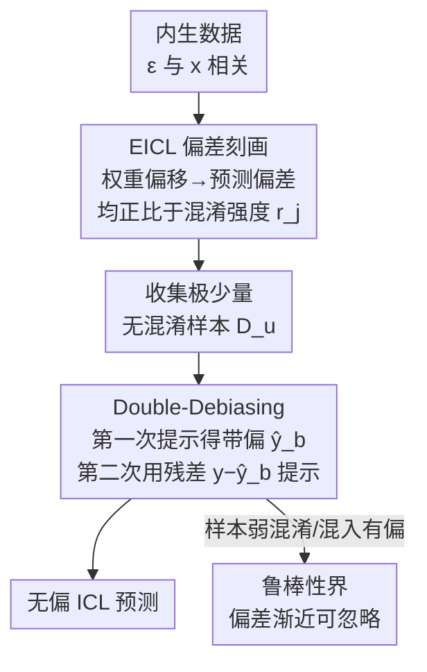

# Transformers with Endogenous In-Context Learning: Bias Characterization and Mitigation

**会议**: ICLR 2026  
**OpenReview**: [https://openreview.net/forum?id=guKWBA2HWf](https://openreview.net/forum?id=guKWBA2HWf)  
**领域**: 学习理论 / In-Context Learning  
**关键词**: 上下文学习, 隐藏混淆, 内生性, 预测偏差, 无梯度去偏

## 一句话总结
本文提出"内生上下文学习"(Endogenous ICL, EICL)这一新问题设定——允许标签噪声 $\epsilon$ 与特征 $X$ 相关(隐藏混淆),从理论上证明在这种数据上预训练的 Transformer 会产生与混淆强度成正比的 ICL 预测偏差,并提出无需微调的 Double-Debiasing (DDbias) 方法:用极少量无混淆样本对模型"提示两次"(原标签一次、残差一次)即可纠偏。

## 研究背景与动机

**领域现状**:近年来一条主流的 ICL 理论工作证明了"无梯度的 ICL 推理 ≈ 隐式梯度下降"——即把若干 $(x,y)$ 对喂给预训练好的线性 Transformer 后,它对新输入 $x^*$ 的前向预测,等价于用这些样本对某个"元权重"(meta-weight)做一步隐式梯度下降。围绕这一等价性,大量分析进一步刻画了预训练 Transformer 的收敛权重应满足什么条件。

**现有痛点**:这些理论几乎都建立在一个隐含假设上——**因果充分性**(Assumption 1):标签生成 $y = \langle x, w_\star\rangle + \epsilon$ 中的噪声 $\epsilon$ 与特征 $x$ 独立($\epsilon \perp\!\!\!\perp X$)。但现实任务中,隐藏混淆变量(hidden confounder)广泛存在:某个未观测因素会同时影响 $x$ 和 $y$,导致 $\epsilon$ 与 $x$ 相关(内生性 endogeneity)。一旦如此,现有 ICL 理论的结论就不再贴合真实数据结构。

**核心矛盾**:经典回归(OLS/工具变量 IV)虽然有成熟的内生性偏差理论,但它**无法直接搬到 ICL 上**——ICL 的预训练损失是逐序列前向预测、推理是 few-shot 注意力聚合(没有显式解参数这一步),与 OLS"一次性联合求解 $w_\star$"在训练损失、表示动力学、推理机制上都有本质差异。因此 OLS 的内生偏差推导在 ICL 里失效。

**本文目标**:回答两个问题——(1) 在内生数据上预训练的 Transformer,其 ICL 预测是否真的有偏?(2) 若有偏,能否设计一个低成本(只用少量提示样本、不微调)的策略来纠正?

**切入角度**:作者沿用线性自注意力 + 隐式 GD 的可分析框架,但把数据生成机制改为内生($\epsilon \not\perp\!\!\!\perp X$),从预训练动力学出发追踪偏差如何从"权重偏移"传导到"ICL 预测偏差"。

**核心 idea**:理论上,把偏差刻画为"正比于混淆强度 $r_j = \mathbb{E}[X_j\epsilon]$";方法上,既然偏差源于混淆,就用极少量**无混淆**样本两次提示模型,让第二次对"残差"做隐式 GD,从而抵消偏差——全程无梯度、不动模型参数。

## 方法详解

### 整体框架

本文是一篇"理论刻画 + 配套方法"的工作,主线分两段:**先证明问题、再给出解法**。

第一段(刻画偏差)在 EICL 设定下追踪偏差的两级传导。问题设定(Problem 1)允许隐藏混淆 $\epsilon$ 同时影响 $x^{(i)}$ 和 $y^{(i)}$,并用 $r_j = \mathbb{E}[X_j\epsilon]$ 度量第 $j$ 维特征上的混淆强度。作者先在无混淆情形下构造一组"接地参数"(U_weights)$S_u, T_u$ 作为理想基准(Lemma 1:它对应在 $w_\star$ 上做无偏隐式 GD);然后 **Theorem 1** 证明在混淆数据上预训练得到的参数 $S_b, T_b$ 会偏离 $S_u, T_u$,偏移量正比于 $r_j$;**Theorem 2** 进一步证明这一权重偏移会经由"元权重"传导到 ICL 推理,产生正比于 $r_j$ 的预测偏差。

第二段(纠正偏差)提出 **DDbias**:收集极少量无混淆样本,对冻结的 Transformer 提示两次——第一次拿到带偏预测 $\hat y_b$,第二次把标签换成残差 $y - \hat y_b$ 再提示。**Theorem 3** 证明第二次提示等价于对残差做隐式 GD,**Proposition 1** 证明其极限是无偏 ICL 预测;**Proposition 2/3** 进一步给出当"无混淆样本"实际上弱混淆或混入部分有偏样本时的鲁棒性界。

### 关键设计

**1. EICL 问题设定:把隐藏混淆引入 ICL 的数据生成**

现有 ICL 理论默认 $\epsilon \perp\!\!\!\perp X$(因果充分),本文针锋相对地放开这一假设(Problem 1):允许 $\epsilon \not\perp\!\!\!\perp X$,即存在一个未观测因素同时驱动 $x^{(i)}$ 和 $y^{(i)}$。为便于分析,作者用 Assumption 2 给出可操作的混淆结构 $X_j = r_j\epsilon + \kappa_j$,其中 $\kappa_j$ 是零均值单位方差的纯噪声,$r_j = \mathbb{E}[X_j\epsilon]$ 就是第 $j$ 维的**混淆强度**——它正是后续所有偏差结论的"刻度"。再配合 Assumption 3(无干扰,即 SUTVA),整个设定既保留了 ICL 注意力分析的可处理性,又第一次让"内生性"进入 Transformer 预训练理论。这一步的价值在于:它说明"为什么不能直接用 OLS/IV 理论"——ICL 的推理来自注意力块与 $K,Q,V$ 训练动力学的交互,而非显式求解参数,因此需要专门为 ICL 重新推导偏差。

**2. 两级偏差传导定理:权重偏移 → 预测偏差,均正比于混淆强度**

这是全文的理论核心。作者先构造无混淆下的接地参数 $S_u, T_u$(U_weights),它对应在真权重 $w_\star$ 上做无偏隐式 GD;以此为基准,**Theorem 1** 给出预训练阶段的参数偏移
$$\Delta^j_{\text{pre}}(S,T) = U\left(r_j K + R\right)U^\top,$$
其中 $K, R$ 是关于 $\epsilon$ 的矩、$w_\star$ 和协方差特征值 $\lambda$ 的常数矩阵——关键是偏移**正比于 $r_j$**:混淆越强,预训练权重偏离理想越远。接着作者定义 **ICL Gradient Divergence**(Def 2),把权重偏移翻译成预测偏差:$\Delta w_{\text{est}}[j] := w_u[j] - w_b[j]$,进而 $\Delta y^{(i)} = \sum_j (w_u - w_b)[j]\, x^{(i)}[j]$。**Theorem 2** 则给出预测偏差的下界,同样**正比于 $r_j$**:
$$\Delta w_{\text{est}}[j] \;\geq\; r_j \cdot O_n\!\Big(\textstyle\sum_l r_l \sum_v w_\star[v]\,\sigma^2\Big) + O\!\Big(\kappa_Z\textstyle\sum_l \tfrac{r\kappa_Z}{q_l}\Big).$$
Remark 2 点出它与 OLS 内生偏差的两点**本质区别**:(a) **偏差可抵消**——全局偏差依赖各维混淆强度之和 $\sum_l r_l$,当 $\sum_l r_l = 0$ 时可相互抵消,这是 OLS 没有的性质;(b) **依赖注意力几何**——混淆与注意力交互会额外贡献偏差项,这在 OLS/IV 中完全不存在。这两点正是"ICL 偏差 ≠ OLS 偏差"的理论新意。

**3. Double-Debiasing:用残差提示做无梯度纠偏**

既然偏差源于混淆,DDbias 的思路是引入极少量**无混淆**样本 $D_u = \{x_{rc}^{(i)}, y_{rc}^{(i)}\}$($\epsilon \perp\!\!\!\perp x$)做两次提示:第一步先用 $D_u$ 提示冻结的带偏模型,拿到带偏预测 $\hat y_b^{(i)}$;第二步把标签替换成**残差** $y_{rc}^{(i)} - \hat y_b^{(i)}$ 再次提示,对新样本的输出即为去偏预测。**Theorem 3** 证明第二次提示等价于对残差损失做隐式 GD:
$$L_{\text{deb}}(w) = \frac{1}{2n}\sum_{i=1}^n \big(y^{(i)} - \hat y_b^{(i)} - w^\top x_{rc}^{(i)}\big)^2,$$
**Proposition 1** 进一步证明优化 $L_{\text{deb}}$ 收敛到**无偏** ICL 预测。其精妙之处在于:全程**不修改模型参数、不需辅助标签、不需构造工具变量**,只靠"换标签再提示一次"就把偏差吃掉——这与现有方法(IV 需要有效工具变量、数据融合去混淆需要在无偏数据上微调)形成鲜明对比,完全契合 ICL"只推理不训练"的本质。

**4. 弱混淆/混合样本下的鲁棒性界**

现实中"无混淆样本"往往做不到完美无偏(可能因干预不彻底、噪声相关、数据源异质而残留 $\mathbb{E}[x_j\epsilon]\neq 0$)。作者为两种情形给出鲁棒性保证:**Proposition 2**(弱混淆样本)与 **Proposition 3**(混合样本——比例 $\rho$ 的"无混淆"批次实际有偏),证明 DDbias 估计的偏差有界
$$\mathbb{E}[y_{GT} - \hat y_{DEB}] \leq C'\left(\frac{1}{\sqrt{(1-\rho)\,n_b\,\lambda^*}} + \rho\,\bar r\right),$$
因此当无混淆样本数 $n_b \to \infty$ 或污染比例 $\rho \to 0$ 时偏差渐近可忽略,渐近无偏的充分条件是 $\rho\bar r = o(1)$ 且 $\frac{1}{\sqrt{(1-\rho)n_b\lambda^*}} = o(1)$。这一步把 DDbias 从"理想无混淆样本"推广到"现实中不那么干净的样本",显著增强了实用性。

### 损失函数 / 训练策略
预训练沿用标准 ICL 回归损失 $L_{\text{icl}}(S,T) = \mathbb{E}_{(M,w_\star)}\big[(\text{TF}^{\text{pred}}_{S,T}(M) + y^{(n+1)})^2\big]$(读出项取负号源于 Transformer 输出矩阵的读出约定)。DDbias **不引入任何额外训练**:它是推理期的两次前向提示,第二次隐式优化的残差损失 $L_{\text{deb}}$ 由注意力机制自动完成,无需反传梯度。

## 实验关键数据

实验全部围绕"验证理论 + 验证 DDbias 有效"展开。数据生成包含线性(无混淆/混淆两套,$d=5$,上下文长度 20,通过乘因子 $\{0.5,1.0,1.5,2.0\}$ 调节 $r_j$,记为 Conf@x)、IV 对照、非线性/部分混淆,以及真实 NLP 数据(Yelp 情感评论的 RPI / ROR 两个任务)。Transformer 用线性自注意力,层数取 1(TF@1)与 3(TF@3),Adam 优化、结果跑 5 次取平均。

### 主实验

真实数据上,DDbias 随 ICL 样本增多(15→30→60)持续降低 MAE,最终超过强因果基线:

| 数据集/指标 | Vanilla LLaMA | DMCEE | SC | DDbias(15) | DDbias(30) | DDbias(60) |
|------|------|------|------|------|------|------|
| RPI (MAE) | 23.8 | 21.2 | 22.5 | 22.8 | 19.4 | **16.7** |
| ROR (MAE) | 0.46 | 0.28 | 0.24 | 0.36 | 0.18 | **0.16** |

非线性/更深 Transformer(ReLU + LayerNorm + Softmax,L=5/7)上,DDbias 在各种混淆强度下都把预测误差砍掉一半以上,且偏差随 $r$ 单调增大——印证理论"偏差正比于混淆强度":

| 配置 | Conf@0.5 | Conf@1.0 | Conf@1.5 | Conf@2.0 |
|------|------|------|------|------|
| L=5 Biased(原始 TF) | 0.280 | 0.370 | 0.475 | 0.600 |
| L=5 DDbias(本文) | **0.115** | **0.150** | **0.200** | **0.260** |
| L=7 Biased(原始 TF) | 0.320 | 0.450 | 0.600 | 0.750 |
| L=7 DDbias(本文) | **0.135** | **0.175** | **0.225** | **0.290** |

### 消融实验

部分混淆鲁棒性(Weak Conf@0.10):达到同一 ICL 预测误差所需的无混淆样本比例,oracle(完美无偏)与 weak(弱混淆)下都很小,验证 Proposition 2/3:

| ICL 预测误差 | 0.090 | 0.092 | 0.095 | 0.100 |
|------|------|------|------|------|
| 样本比例(oracle, ×10⁻³) | 6.4 | 3.2 | 2.4 | 1.6 |
| 样本比例(weak, ×10⁻³) | 8.6 | 7.2 | 6.3 | 3.5 |

### 关键发现
- **混淆强度是统一刻度**:Fig.1(c-d) 显示预训练权重偏离 U_weights 的幅度随 $r_j$ 增大,Fig.2 显示 ICL 预测偏差与回归权重 $\hat w$ 偏离 $w_\star$ 也随 $r_j$ 增大——Theorem 1/2 在权重和预测两级都被实验证实。
- **极少量无混淆样本就够**:Fig.2 表明随提示/预训练样本比增大,偏差迅速下降、$\hat w$ 对齐真值,且只需很小比例的无偏样本即可去偏,效率突出。
- **对污染样本鲁棒**:即便无混淆样本弱混淆或混入有偏样本(Tab.5),DDbias 仍保持有效,所需样本量仅略增。
- **相对 IV 的适用面更广**:在"有无偏样本但 IV 失效"等控制场景下,DDbias 不依赖有效工具变量,失败模式仅为样本部分混淆,而 IV 在弱/无效工具时直接失效。

## 亮点与洞察
- **把"内生性"第一次引入 ICL 理论**:以往 ICL 分析默认因果充分,本文指出真实数据普遍存在隐藏混淆,并证明现有 OLS/IV 内生偏差理论因 ICL 的注意力推理机制而不可直接套用——这是一个被忽视但很真实的缺口。
- **"提示两次"就能去偏的设计极简且契合 ICL 本质**:第二次用残差当标签提示,等价于对残差做隐式 GD,完全不碰模型参数,把"去混淆"从需要微调/工具变量的重活变成一次纯推理操作。
- **偏差可抵消($\sum_l r_l = 0$)这一性质很有启发**:它揭示 ICL 偏差是各维混淆强度的全局求和,与 OLS 逐维偏差不同,意味着某些混淆结构下偏差可能自然相消——这是理解 Transformer 鲁棒性的一个新视角。
- 残差提示的思路可迁移到其他"冻结大模型 + 少量干净样本纠偏"的场景,而不限于线性回归。

## 局限与展望
- **理论建立在线性自注意力 + 线性数据生成上**:虽然实验补充了非线性/更深模型,但核心定理(Theorem 1/2/3)的闭式刻画依赖线性 TF 简化(省略 softmax),向真实多层非线性 Transformer 的理论推广仍待完善。
- **依赖"能拿到少量无混淆样本"**:DDbias 的无偏性前提是存在 $\epsilon \perp\!\!\!\perp x$ 的样本(如随机流量/推荐 A/B),在无法做随机化的领域,这一前提可能难以满足;Proposition 2/3 虽给出弱混淆鲁棒性,但污染过重时仍会退化。
- **真实数据仅限两个 Yelp 回归任务**:规模和任务多样性有限,DDbias 在更复杂的多维标签、分类任务或大规模 LLM 上的表现尚未充分验证。
- 改进方向:把混淆强度 $r_j$ 的估计与 DDbias 结合(自适应判断样本是否足够无偏)、以及向 softmax 注意力/多层非线性给出更紧的偏差界。

## 相关工作与启发
- **vs ICL=隐式 GD 一系工作(Ahn et al. 2023 / Von Oswald et al. 2023 / Akyürek et al. 2022)**:他们在因果充分假设下证明 ICL 等价隐式 GD;本文继承这套分析工具,但放开独立性假设,补上"内生数据下偏差怎么产生、怎么纠正"这一空白。
- **vs IV-based ICL 去偏(Liang et al. 2024)**:并发工作意识到隐藏混淆并用工具变量纠正,需要有效 IV;本文的 DDbias 不需构造 IV、只需少量无混淆样本,适用场景(随机流量/推荐 A/B)与失败模式都不同,且不必微调。
- **vs 数据融合去混淆(Kallus et al. 2018 / Li et al. 2024)**:它们需在无偏数据上微调 Transformer,与 ICL"只推理不训练"相悖;DDbias 是纯推理期操作,更契合 ICL 的无梯度本质。

## 评分
- 新颖性: ⭐⭐⭐⭐⭐ 首次把隐藏混淆/内生性引入 ICL 理论,并指出 OLS/IV 偏差理论为何失效。
- 实验充分度: ⭐⭐⭐⭐ 线性/非线性/部分混淆/真实 NLP 多设定验证理论,但真实任务规模偏小。
- 写作质量: ⭐⭐⭐⭐ 理论脉络清晰、定理逐级递进,符号较密需要细读。
- 价值: ⭐⭐⭐⭐ 提供理解 ICL 鲁棒性的新视角 + 一个极简可用的无梯度去偏方法。

<!-- RELATED:START -->

## 相关论文

- [\[ICLR 2026\] In-Context Algorithm Emulation in Fixed-Weight Transformers](in-context_algorithm_emulation_in_fixed-weight_transformers.md)
- [\[ICLR 2026\] Transformers Learn Latent Mixture Models In-Context via Mirror Descent](transformers_learn_latent_mixture_models_in-context_via_mirror_descent.md)
- [\[ICLR 2026\] Continuum Transformers Perform In-Context Learning by Operator Gradient Descent](continuum_transformers_perform_in-context_learning_by_operator_gradient_descent.md)
- [\[ICLR 2026\] Adversarially Pretrained Transformers May Be Universally Robust In-Context Learners](adversarially_pretrained_transformers_may_be_universally_robust_in-context_learn.md)
- [\[ICLR 2026\] Critical Attention Scaling in Long-Context Transformers](critical_attention_scaling_in_long-context_transformers.md)

<!-- RELATED:END -->
