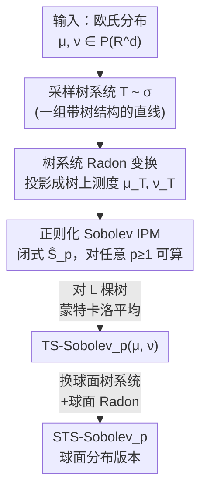

# Tree-sliced Sobolev IPM

**会议**: ICLR 2026  
**OpenReview**: [https://openreview.net/forum?id=HHNQSXaLkF](https://openreview.net/forum?id=HHNQSXaLkF)  
**代码**: https://github.com/thanhquangtran/TS-Sobolev  
**领域**: 最优传输 / 概率度量 / 表示学习  
**关键词**: 积分概率度量, Sobolev IPM, Tree-Sliced Wasserstein, 高阶最优传输, 球面分布

## 一句话总结
本文用「树上可闭式求解的正则化 Sobolev IPM」替换 Tree-Sliced Wasserstein (TSW) 内核里那个只能在 $p=1$ 闭式求解的 1-Wasserstein，得到 TS-Sobolev：一族对任意阶 $p\ge 1$ 都能高效计算的树切片度量，$p=1$ 时精确退回 TSW，$p>1$ 时计算复杂度与 $p=1$ 的 TSW 完全相同，并在梯度流、扩散模型、自监督和主题建模等下游任务上全面超越 SW/TSW 系列。

## 研究背景与动机

**领域现状**：比较两个概率分布是机器学习的基础操作（点云、词袋文档都是分布）。最优传输（OT）能给出尊重几何结构的距离，但 $O(n^3\log n)$ 的复杂度让它对大数据不可用。Sliced Wasserstein (SW) 把高维分布往随机一维方向投影、利用一维 OT 的闭式解、再对各切片求平均，把复杂度压到排序级别 $O(n\log n)$。近年的 **Tree-Sliced Wasserstein (TSW)** 更进一步：把分布投影到「树度量空间」而非一维线，因为树上 1-Wasserstein 同样有闭式解，却能比单条直线表达更复杂的拓扑结构，下游性能更好。

**现有痛点**：TSW 的高效完全依赖于「树上 1-Wasserstein 有闭式解」这一事实——而这个解析解**只对 $p=1$ 成立**。对一般的 $p>1$，树上的 $p$-Wasserstein 没有已知闭式解，算起来很贵，于是 TSW 实际上被锁死在 $p=1$。

**核心矛盾**：但在基于梯度的学习里，大家其实更想要高阶度量（$p>1$）。$p>1$ 的 Wasserstein 具有严格凸性、梯度更平滑，优化景观更友好；而 $p=1$ 的梯度是常数（与误差大小无关），训练时不够稳定。于是出现了「想用 $p>1$ 的优化优势」和「树上 $p>1$ 算不动」之间的根本张力。

**切入角度与核心 idea**：作者绕开「直接算树上 $p$-Wasserstein」这条死路，转而回到**积分概率度量（IPM）**框架。IPM 通过在某个函数类里找一个最能区分两分布的「评论函数（critic）」来定义距离；其中 **Sobolev IPM** 把 critic 约束在 Sobolev 范数的单位球内，理论性质好但历来没有闭式解。关键转机是 Le et al. (2025) 证明了：**树上的正则化 Sobolev IPM 对任意 $p\ge1$ 都有闭式解**。本文正是把这个闭式 Sobolev IPM 嵌进 TSW 的树切片框架，一句话概括即「用可闭式求解的正则化 Sobolev IPM 取代 1-Wasserstein 作为树上内核」，从而解锁任意阶 $p$。

## 方法详解

### 整体框架

TS-Sobolev 的鸟瞰非常清晰：它沿用 TSW 的「把欧氏分布投影到随机树、在树上算一个闭式距离、再对很多棵树求期望」三段式管线，**唯一改动是把树上那一步的距离从 1-Wasserstein 换成正则化 Sobolev IPM**。

具体地，给定两个欧氏空间分布 $\mu,\nu\in\mathcal P(\mathbb R^d)$：① 从采样分布 $\sigma$ 抽出一个**树系统** $\mathcal T$（一组带树结构的直线）；② 用**树系统上的 Radon 变换** $R^\alpha_{\mathcal T}$ 把 $\mu,\nu$ 的密度投影成树上的测度 $\mu_{\mathcal T},\nu_{\mathcal T}$；③ 在该树上计算**正则化 Sobolev IPM** $\hat S_p(\mu_{\mathcal T},\nu_{\mathcal T})$（闭式，对任意 $p$ 都能算）；④ 对 $L$ 棵随机树系统做蒙特卡洛平均，得到最终距离。形式上

$$\text{TS-Sobolev}_p(\mu,\nu):=\left(\int_{\mathbb T}\hat S_p(\mu_{\mathcal T},\nu_{\mathcal T})^p\,d\sigma(\mathcal T)\right)^{1/p}.$$

因为整套树系统、采样分布 $\sigma$、分裂映射 $\alpha$ 都直接复用 Db-TSW 的成熟配置，且 $p=1$ 时 $\hat S_1$ 精确等于树上 1-Wasserstein，所以 TS-Sobolev 是 TSW 的**严格泛化 + 即插即用替换**。

### 关键设计

**1. 正则化 Sobolev IPM：给树上 $p>1$ 一个闭式且优化友好的内核**

这是全文的发动机，直接解决「树上 $p>1$ 没闭式解」的痛点。标准 Sobolev IPM 定义为在 Sobolev 单位球 $B(p')$ 内找 critic $f$ 最大化两分布期望之差 $S_p(\mu,\nu)=\sup_{f\in B(p')}|\int f\,d\mu-\int f\,d\nu|$（$p'$ 是 $p$ 的共轭指数），本身不可解。作者采用 Le et al. (2025) 的**正则化**版本，它对树上连续测度有显式积分解

$$\hat S_p(\mu,\nu)^p=\int_{\mathcal T}\hat w(x)^{1-p}\,\big|\mu(\Lambda(x))-\nu(\Lambda(x))\big|^p\,\omega(dx),$$

其中 $\Lambda(x)$ 是以 $x$ 为根的子树、$\hat w(x):=1+\omega(\Lambda(x))$ 是权重函数。对节点上的离散测度，积分进一步化简为沿树边 $E$ 的高效求和 $\hat S_p(\mu,\nu)^p=\sum_{e\in E}\beta_e\,|\mu(\gamma_e)-\nu(\gamma_e)|^p$，其中系数 $\beta_e$ 可预计算（$p=2$ 时为 $\log(1+\frac{w_e}{1+\omega(\gamma_e)})$，其余情形为 $\frac{(1+\omega(\gamma_e)+w_e)^{2-p}-(1+\omega(\gamma_e))^{2-p}}{2-p}$）。

这个形式不仅闭式可算，还自带两个优化优势：其一，$p>1$ 时梯度随误差幅值 $|\mu(\Lambda(x))-\nu(\Lambda(x))|$ 缩放（而非 $p=1$ 的常数梯度），优化更平滑；其二，$\hat w(x)^{1-p}$ 这一项会**压低靠近根部的全局梯度**，让优化把精力放在叶子端的细粒度局部结构上——这正是它在扩散模型上能保住图像细节的理论来源，也是相对标准 $p$-Wasserstein 的独有好处。

**2. 树切片框架：把欧氏高维分布搬到能用 Sobolev IPM 的树上**

Sobolev IPM 只对「支撑在树上的测度」有效，而真实数据住在 $\mathbb R^d$，这个设计负责架桥。作者复用 Db-TSW 的树切片机制：一条直线是 $\mathbb R^d\times S^{d-1}$ 的元素，$k$ 条线再赋予树结构就构成**树系统** $\mathcal T$，其上所有点构成一个连续树度量空间。通过**树系统上的 Radon 变换** $R^\alpha_{\mathcal T}f(x,l_i)=\int_{\mathbb R^d}f(y)\,\alpha(y,\mathcal T)_i\,\delta(t_x-\langle y-x_i,\theta_i\rangle)\,dy$（$\alpha$ 是把质量分配到各条线的分裂映射），把欧氏密度投影成树上测度。该算子是**单射**的，保证了信息不被投影抹掉；而采用 $E(d)$-不变（平移+正交变换不变）的分裂映射 $\alpha$ 是关键——本文证明（Theorem 3.2）正是这种不变性**保证了 TS-Sobolev 是 $\mathcal P(\mathbb R^d)$ 上的合法度量**，比 2-Wasserstein 仅「拥有」该不变性更进一步，是度量性的根基。同时 Theorem 3.3 给出 $\text{TS-Sobolev}_p^p\le\text{TSW}$ 且 $p=1$ 取等，从理论上钉死「TS-Sobolev 是 TSW 的泛化」。

**3. 蒙特卡洛聚合与复杂度对齐：高阶度量却不付额外代价**

式 (9) 里对所有树系统求期望的积分不可解，用 $L$ 棵采样树系统做蒙特卡洛估计 $\widehat{\text{TS-Sobolev}}_p=(\frac1L\sum_{i=1}^L\hat S_p(\mu_{\mathcal T_i},\nu_{\mathcal T_i})^p)^{1/p}$，逼近误差以 $O(L^{-1/2})$ 收敛（Theorem 3.5）。最关键的是复杂度账：整体为 $O(Lkn\log n+Lkdn)$（$k$ 为每棵树线数、$d$ 为维度），**与一阶 Db-TSW 完全相同**，因为预计算 $\beta_e$ 只增加可忽略的 $O(Lkn)$。这意味着用户白拿了 $p>1$ 的优化优势，却没有付出任何运行时代价；超参上则存在「增大 $k$ 提升表达力 vs 增大 $L$ 降方差」的自然权衡。

**4. 球面扩展 STS-Sobolev：同一套机制搬到超球面**

许多表示学习把特征归一化到超球面（如自监督的 uniformity 项），所以作者把框架推广到 $\mu,\nu\in\mathcal P(S^d)$。做法是把欧氏树系统换成**球面树系统**、把 Radon 变换换成**球面 Radon 变换**，其余完全对称，定义 $\text{STS-Sobolev}_p(\mu,\nu):=(\int_{\mathbb T}\hat S_p(\mu_{\mathcal T},\nu_{\mathcal T})^p\,d\sigma(\mathcal T))^{1/p}$。由于实现沿用了 STSW 的分裂映射与采样方式，$p=1$ 时 STS-Sobolev 精确退回球面 TSW (STSW)，保持了与欧氏版一致的「泛化 + 即插即用」性质。

### 损失函数 / 训练策略

TS-Sobolev 本身是一个距离，按下游任务插入不同目标即可。例如自监督学习里替换对比损失的 uniformity 项：$L=\frac1n\sum_i\|z_i^A-z_i^B\|_2^2+\frac\lambda2(\text{STS-Sobolev}_p(z^A,\nu)+\text{STS-Sobolev}_p(z^B,\nu))$，其中 $\nu=U(S^d)$ 是球面均匀分布；主题建模里则用 STS-Sobolev 替换 VAE 的 KL 正则项。实验主要取 $p\in\{1.2,1.5,2\}$。

## 实验关键数据

### 主实验

**欧氏梯度流（Table 1，Wasserstein 距离，越小越好）**：在 8 Gaussians 与 Gaussian 30d 上，TS-Sobolev 的最终收敛优于所有 SW/TSW 基线。

| 数据集 | 指标(2500 iter) | TS-Sobolev$_{1.2}$ | 最强基线 Db-TSW | TSW-SL |
|--------|------|------|----------|------|
| 8 Gaussians | W 距离 | **8.88e-7** | 2.50e-6 | 1.17e-6 |
| Gaussian 30d | W 距离(×10⁻¹) | **1.40** | 1.78 | 1.93 |

**扩散模型（Table 2，CIFAR-10 无条件生成，FID 越低越好）**：把 TS-Sobolev 接进 DDGAN 的 AGME 损失。

| 模型 | FID ↓ | 时间/epoch(s) |
|------|------|------|
| Db-TSW-DD$^\perp$（最强基线） | 2.53 | 85 |
| **TS-Sobolev$_{1.5}$-DD** | 2.302 ± 0.004 | 84 |
| **TS-Sobolev$_2$-DD** | **2.277 ± 0.003** | 84 |

FID 较最强基线降低 0.228 / 0.253，且每 epoch 训练时间与其它树切片变体相当——性能提升不以效率为代价。

**球面自监督（Table 3，CIFAR-10 + ResNet18 线性评测，准确率越高越好）**：STS-Sobolev$_2$ 取得 80.6% (Encoded) / 77.65% (Projected)，超过直接对手 STSW (80.53 / 76.78) 以及 SSW、S3W 系列。

**主题建模（Table 5，主题一致性 $C_V$ 越高越好）**：

| 设置 | 方法 | BBC | M10 |
|------|------|------|------|
| 欧氏 | 最强基线 (TSW-SL/EBRPSW) | 0.796 / 0.490 | — |
| 欧氏 | **TS-Sobolev$_2$** | **0.805** | **0.497** |
| 球面 | 最强基线 (SSW/STSW) | 0.755 | 0.408 |
| 球面 | **STS-Sobolev$_2$** | **0.776** | **0.423** |

### 关键发现

- **阶数 $p$ 的影响有最优区间**：欧氏梯度流里 TS-Sobolev$_{1.2}$ 最好，而 TS-Sobolev$_2$ 在 Gaussian 30d 上反而退化（最终 3.68，差于 $p=1.2$ 的 1.40），说明 $p$ 太大未必好；但在扩散、自监督、主题建模这些更复杂任务上 $p=2$ 往往最优。$p$ 是个需要按任务调的超参。
- **$\hat w(x)^{1-p}$ 的根部降权是细节保持的关键**：作者将扩散模型上 FID 的提升归因于该项让优化聚焦叶子端的细粒度局部结构，从而保住图像细节（理论与实证见原文 Appendix F.8，⚠️ 细节以原文为准）。
- **高阶不加成本**：实测 TS-Sobolev 运行时几乎与一阶 Db-TSW 相同，验证了复杂度分析。

## 亮点与洞察
- **"换内核"式的优雅泛化**：不去硬攻「树上 $p$-Wasserstein 闭式解」这道难题，而是换一类同样刻画分布差异、但恰好有闭式解的度量（Sobolev IPM），就把 TSW 从 $p=1$ 解放到任意 $p$。这是把别人刚证出的理论结果（Le et al. 2025）精准嫁接到工程框架的典范。
- **$p=1$ 精确退回 + 复杂度对齐**，意味着它是真正的 drop-in replacement：任何现在用 Db-TSW 的代码，换成 TS-Sobolev 不增加成本、还多了一个可调的 $p$ 旋钮。
- **根部降权权重 $\hat w(x)^{1-p}$** 是可迁移的洞察：在任何树/层次结构的距离上，给靠近根的全局差异降权、放大叶子端局部差异，都可能有助于细粒度任务，这个 trick 可借鉴到层次化表示或多尺度损失设计。

## 局限与展望
- **作者承认的局限**：TS-Sobolev 只能比较**平衡测度**（总质量相等），无法处理不平衡 OT（输入分布质量不同）的情形；作者把扩展到 unbalanced OT 列为未来方向。
- **自己发现的局限**：阶数 $p$ 缺乏自动选择机制，从 Gaussian 30d 上 $p=2$ 反而变差可见 $p$ 对任务敏感，目前要靠经验/调参；正则化 Sobolev IPM 是一个**有偏**于标准 Sobolev IPM 的代理，正则化带来的近似偏差对最终度量性质的影响文中未深入量化。
- **改进思路**：可探索按任务/数据自适应选 $p$（甚至每棵树/每条边用不同 $p$），以及把根部降权权重做成可学习的尺度函数。

## 相关工作与启发
- **vs TSW (Db-TSW / TSW-SL)**：两者共用树切片+树系统+Radon 框架，区别只在树上内核——TSW 用 1-Wasserstein（仅 $p=1$ 闭式），本文用正则化 Sobolev IPM（任意 $p\ge1$ 闭式）。本文证明 $p=1$ 时二者相等、且 TSW 是其上界，优势是解锁了 $p>1$ 的优化友好性而不加成本。
- **vs 标准 Sobolev IPM**：标准 Sobolev IPM 理论优美但无闭式解、难落地；本文借助 Le et al. (2025) 的正则化版本在树上获得闭式解，代价是引入正则化近似。
- **vs Sliced Wasserstein 系列 (SW / MaxSW / SWGG)**：SW 投影到一维线，表达力受限；本文投影到树度量空间，能刻画更复杂拓扑，下游普遍更优。
- **vs 球面切片 (SSW / S3W / STSW)**：STS-Sobolev 把同一套 Sobolev 内核思想搬到球面，$p=1$ 退回 STSW，在自监督和球面梯度流上超越这些球面切片基线。

## 评分
- 新颖性: ⭐⭐⭐⭐ 不是全新框架，但「用闭式 Sobolev IPM 替换 1-Wasserstein 解锁任意阶 $p$」的切入点干净有力。
- 实验充分度: ⭐⭐⭐⭐ 覆盖梯度流、扩散、自监督、主题建模、欧氏与球面双设置，基线全面。
- 写作质量: ⭐⭐⭐⭐ 理论与动机衔接清晰，复杂度账算得明白；部分关键机制细节压在附录。
- 价值: ⭐⭐⭐⭐ 即插即用、零额外成本、多一个 $p$ 旋钮，对所有用 TSW 的下游都有直接实用价值。

<!-- RELATED:START -->

## 相关论文

- [\[ICLR 2026\] Revisiting Tree-Sliced Wasserstein Distance through the Lens of the Fermat–Weber Problem](revisiting_tree-sliced_wasserstein_distance_through_the_lens_of_the_fermatweber_.md)
- [\[ICLR 2026\] Data-Aware and Scalable Sensitivity Analysis for Decision Tree Ensembles](data-aware_and_scalable_sensitivity_analysis_for_decision_tree_ensembles.md)
- [\[ICLR 2026\] Curse of Slicing: Why Sliced Mutual Information is a Deceptive Measure of Statistical Dependence](curse_of_slicing_why_sliced_mutual_information_is_a_deceptive_measure_of_statist.md)
- [\[ICLR 2026\] Better Learning-Augmented Spanning Tree Algorithms via Metric Forest Completion](better_learning-augmented_spanning_tree_algorithms_via_metric_forest_completion.md)
- [\[ICML 2026\] Tree-Structured Orthonormal Decomposition of the Aitchison Simplex](../../ICML2026/learning_theory/tree-structured_orthonormal_decomposition_of_the_aitchison_simplex.md)

<!-- RELATED:END -->
