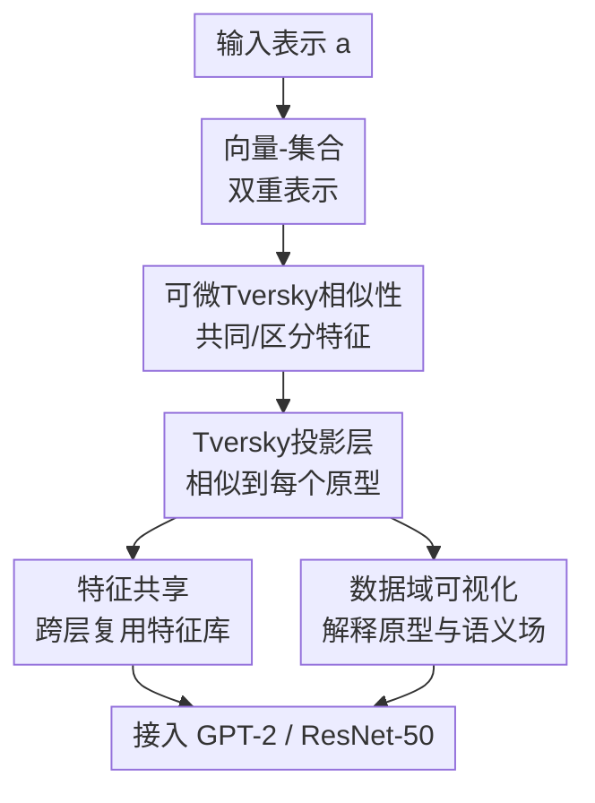

# Tversky Neural Networks: Psychologically Plausible Deep Learning with Differentiable Tversky Similarity

**会议**: ICLR 2026  
**OpenReview**: [https://openreview.net/forum?id=koKWoKaMrE](https://openreview.net/forum?id=koKWoKaMrE)  
**代码**: https://github.com/mdoumbouya/tversky-networks-iclr2026  
**领域**: 学习理论 / 可解释神经网络  
**关键词**: Tversky相似性, 心理学相似性, 原型学习, 可解释神经网络, 语言建模  

## 一句话总结
这篇论文把 Tversky 的“共同特征 + 区分特征”心理学相似性理论改写成可用梯度下降训练的神经网络层，用 Tversky Projection 替代线性投影后，在 GPT-2 语言建模和 ResNet-50 图像分类中同时展示了更强的表达能力、一定的参数效率和更好的可解释性。

## 研究背景与动机
**领域现状**：现代深度学习里，“相似性”几乎默认就是几何相似性。

线性层把输入向量和权重列做点积，注意力把 query 和 key 做缩放点积，分类头把表示和类别原型比较后再接 softmax。

这种做法等价于把概念放进一个向量空间，再用点积、余弦或距离度量它们有多像。

它工程上极其成功，也几乎成了神经网络模块的底层语法。

**现有痛点**：心理学很早就指出，人类判断相似性并不总满足几何度量的公理。

最典型的是相似性可以是非对称的：我们更自然地说“儿子像父亲”，而不是“父亲像儿子”。

如果一个相似性函数被强制写成对称距离或内积，它很难表达“参照物更显著、被比较物更具体”这类人类相似性判断。

已有 Tversky loss 或语义相似性网络只在特定任务里用过 Tversky 思想，尚未把它做成能替代线性投影层的通用深度学习模块。

**核心矛盾**：Tversky 的原始理论是集合论式的：对象由一组特征组成，相似性由共同特征和各自独有特征决定。

但神经网络里对象和特征通常是连续向量，集合交、集合差以及“某个特征是否存在”听起来都不可微。

如果不能把这些集合操作变成可训练表达，Tversky 相似性就只能停留在认知心理学解释层，很难进入主流网络架构。

**本文目标**：作者希望构造一个通用、可微、可学习的 Tversky 相似性函数，并基于它给出类似线性层的基础模块。

这个模块要能接入已有架构，比如 ResNet-50 的分类头和 GPT-2 的语言模型头 / 注意力输出投影，同时最好保留 Tversky 理论的可解释性：可以看共同特征、区分特征和语义场。

**切入角度**：论文的关键观察是，对象仍然可以保留向量表示，但同时把它解释成“与哪些可学习特征向量有正点积”的特征集合。

也就是说，一个对象 $x$ 既是 $\mathbb{R}^d$ 中的向量，也是集合 $X=\{f_k\in\Omega\mid x\cdot f_k>0\}$。

这个双重表示让集合交和集合差可以由点积、指示门控和聚合函数写出来，从而在几乎处处分段可微的意义下接入梯度训练。

**核心 idea**：用“可学习特征库 + 原型库 + Tversky 对比公式”替代线性层的“权重矩阵点积”，让神经网络不只比较输入和原型的几何夹角，而是显式比较它们共享了哪些特征、各自多出了哪些特征。

## 方法详解

### 整体框架
Tversky Neural Network 的基本单位不是重新设计整套网络，而是替换网络中大量出现的投影层。

给定输入表示 $a\in\mathbb{R}^d$，Tversky Projection Layer 不再计算 $aW$，而是把 $a$ 分别拿去和一组可学习原型 $\Pi_i$ 做 Tversky 相似性，输出每个原型对应的相似性分数。

为了做到这一点，模型额外学习一个特征库 $\Omega=\{f_k\}_{k=1}^{|\Omega|}$，用正点积判断某个特征是否出现在对象或原型中，再用共同特征、输入独有特征、原型独有特征组合出最终分数。

这张图里的核心贡献有四个：先把连续向量转成可训练的特征集合，再定义可微 Tversky 相似性，然后把它封装成能替换线性层的投影层，最后利用集合表示做特征共享和解释分析。

其中“数据域可视化”不是提升指标的必要步骤，但它展示了这套表示为何比普通线性层更容易解释。

### 关键设计
**1. 向量-集合双重表示：把心理学特征集合接进连续神经网络**

原始 Tversky 理论假设对象 $a$ 和 $b$ 分别对应特征集合 $A$ 和 $B$，相似性写成共同特征与区分特征的函数。

论文保留这个思想，但把“特征”本身也参数化成向量。

给定特征库 $\Omega$，对象 $x$ 中特征 $f_k$ 的强度由点积 $x\cdot f_k$ 表示；如果 $x\cdot f_k>0$，就认为该特征属于对象集合 $X$。

这样做的好处是，网络不用额外标注“鸟有黄腿”“数字有上弧线”这类离散特征，而是在任务训练中自己学习特征库。

对象的显著性也自然可定义为所有已出现特征强度之和：$f(A)=\sum_k a\cdot f_k\cdot \mathbf{1}[a\cdot f_k>0]$。

这对应 Tversky 理论里“更显著的刺激更容易成为参照物”的假设，也给后面的可解释分析留下接口。

**2. 可微Tversky相似性：用共同特征奖励和区分特征惩罚替代点积**

Tversky 的对比模型可以写成 $S(a,b)=\theta f(A\cap B)-\alpha f(A-B)-\beta f(B-A)$。

这里 $A\cap B$ 表示输入和原型共有的特征，$A-B$ 表示输入有但原型没有的特征，$B-A$ 表示原型有但输入没有的特征。

论文把三项都写成可训练向量上的聚合。

共同特征项只在 $a\cdot f_k>0$ 且 $b\cdot f_k>0$ 时激活，并用 $\Psi(a\cdot f_k,b\cdot f_k)$ 汇总强度；$\Psi$ 可以是 min、max、mean、product、gmean 或 softmin。

差集项则有两种版本：一种只惩罚“只在 A 中出现、不在 B 中出现”的特征；另一种还惩罚“二者都有但 A 更强”的部分，论文实验里称为 ignorematch 与 substractmatch。

这让相似性不再只是“朝向是否接近”，而能区分“我和原型共同有多少关键特征”“我多了哪些不该有的特征”“原型有而我缺了哪些特征”。

更重要的是，$\alpha$、$\beta$、$\theta$ 是可学习标量，因此模型可以自己决定共同特征和两种区分特征的相对权重。

当 $\alpha\ne\beta$ 时，相似性天然可以非对称，这正是几何度量最难表达、但 Tversky 理论最想保留的性质。

**3. Tversky投影层：把“相似到原型”做成线性层的替代品**

线性投影层输出的是输入 $a$ 与每个权重列的点积；Tversky Projection Layer 输出的是输入 $a$ 与每个原型 $\Pi_i$ 的 Tversky 相似性。

形式上，输出第 $i$ 维为 $S_{\Omega,\alpha,\beta,\theta}(a,\Pi_i)$，所有原型的分数组成 $\mathbb{R}^p$ 向量。

因此它可以放在分类头、语言模型头、注意力输出投影等原来使用线性层的位置。

这层的表达能力比单个线性层更强。

论文用 XOR 给出一个直观证据：单个线性投影无法表达 XOR 的非线性决策边界，而一个带少量特征和原型的 Tversky 投影层可以通过集合匹配完成。

比如 $[0,1]$ 和 $[1,0]$ 各自与正类原型共享一个特征，而 $[0,0]$ 和 $[1,1]$ 因为空集或独有特征惩罚更接近负类原型。

这不是说 Tversky 层要替代所有非线性网络，而是说明“投影层本身”已经不再局限于线性几何。

**4. 特征共享与可解释性：让特征库既省参数又能形成语义场**

Tversky 层有两个参数库：原型库 $\Pi$ 决定输出维度，特征库 $\Omega$ 决定比较依据。

这两个库可以分开，也可以在语义兼容的层之间共享。

在 GPT-2 里，注意力块输出投影和语言模型头都处理 token 表示，因此可以共享同一个 token 特征库；语言模型头还可以把 token embedding 当作原型，这类似传统语言模型里的 weight tying。

这个设计解释了为什么论文能在某些 GPT-2 设定里一边减少参数，一边降低困惑度。

更有意思的是，集合表示允许直接写语义场表达式。

例如 $A\cap B-C$ 可以表示 A 与 B 共有但 C 没有的特征集合；在词表上，它能捕捉比较级、最高级、情感、反义关系等概念；在图像上，它能找出两只鸟共有的“鹬类”特征，或某只鸟独有的黄腿、弯喙等视觉属性。

这使模型的解释不只是“某个激活很高”，而是可以问“哪些共同特征导致了相似，哪些区分特征导致了不相似”。

### 一个完整示例
以论文里的 XOR 构造为例，输入有四个二进制点：$x_0=[0,0]$、$x_1=[0,1]$、$x_2=[1,0]$、$x_3=[1,1]$。

目标是让 $x_1$ 和 $x_2$ 判为 1，让 $x_0$ 和 $x_3$ 判为 0。

线性层做不到这一点，因为正负样本不是线性可分的。

Tversky 投影层可以学习两个特征 $f_0,f_1$ 和两个原型 $p_0,p_1$。

其中 $p_1$ 含有两个正类相关特征，$p_0$ 可以理解为空特征原型。

对于 $x_1$，它与 $p_1$ 共享 $f_1$，所以共同特征奖励让 $S(x_1,p_1)$ 变高。

对于 $x_2$，它与 $p_1$ 共享 $f_0$，也会更接近正类原型。

对于 $x_0$，它基本不含这些特征，更像空原型 $p_0$。

对于 $x_3$，虽然它在普通几何空间里看起来“特征更多”，但 Tversky 对比模型可以把它相对 $p_1$ 的不匹配或区分特征惩罚纳入分数，使其回到负类。

这个例子说明，Tversky 层的非线性来自“特征是否出现 + 共同/区分特征组合”，不是来自额外堆叠多层感知机。

### 损失函数 / 训练策略
论文没有提出一个新的通用训练损失，而是把 Tversky Projection Layer 当成可替换模块接入原任务损失。

在图像分类中，ResNet-50 的最后全连接层被 Tversky 投影层替换，仍按分类交叉熵训练。

在语言建模中，GPT-2 的语言模型头，或进一步连同注意力块输出投影，都可替换为 Tversky 投影，训练目标仍是下一 token 的语言建模损失，指标用 perplexity。

Tversky 参数包括特征库 $\Omega$、原型库 $\Pi$ 以及 $\alpha,\beta,\theta$。

特征是否出现由正点积门控决定，因此实现上是分段可微的；在门控边界处可能不可导，但和 ReLU 一类门控类似，可以通过梯度下降训练。

超参数主要包括特征库大小、共同特征聚合函数 $\Psi$、差集聚合方式、原型是否与 embedding tying、是否跨层共享特征库，以及初始化方式。

XOR 的附录实验显示，uniform 初始化比 normal 或 orthogonal 初始化更容易收敛，向量归一化会降低收敛概率，product + substractmatch 在该小任务上更稳定；但特征库越大并不单调更好，说明 Tversky 层仍需要常规超参搜索。

## 实验关键数据

### 主实验
论文在两个方向验证 Tversky Projection Layer：语言建模用 GPT-2 / PTB，图像识别用 ResNet-50 / MNIST / NABirds。

| 任务 | 模型设置 | 基线 | Tversky版本 | 变化 |
|------|----------|------|-------------|------|
| PTB语言建模 | GPT-2 从头训练，prototype tying | 112.81 PPL / 124.44M 参数 | 103.99 PPL / 81.14M 参数 | PPL 降低 7.8%，参数减少 34.8% |
| PTB语言建模 | GPT-2 从头训练，不 tying | 111.79 PPL / 163.04M 参数 | 98.22 PPL / 116.59M 参数 | PPL 降低 12.1%，参数减少 28.5% |
| PTB语言建模 | GPT-2 微调，不 tying，只换 head | 30.52 PPL / 163.04M 参数 | 28.33 PPL / 175.62M 参数 | PPL 降低 7.2%，参数增加 7.7% |
| NABirds分类 | ResNet-50 从头训练 | 62.84 ± 0.45 | 65.20 ± 0.26 | 提升 2.36 个百分点 |
| NABirds分类 | ImageNet预训练、全模型微调 | 82.37 ± 0.25 | 82.96 ± 0.07 | 提升 0.59 个百分点 |
| MNIST分类 | ResNet-50 从头训练 | 99.54 ± 0.04 | 99.56 ± 0.06 | 基本持平，略高 |

### 消融实验
下面的表不是传统“删模块”消融，而是论文围绕 Tversky 层替换位置、参数共享和超参数选择做的分析。

| 配置 / 现象 | 关键指标 | 说明 |
|-------------|----------|------|
| GPT-2 只替换语言模型头，微调且不 tying | 30.52 → 28.33 PPL | 单独替换输出层就能降低困惑度，但参数变多 |
| GPT-2 替换注意力输出投影 + 语言模型头，从头训练且 tying | 112.81 → 103.99 PPL，124.44M → 81.14M 参数 | 特征共享让性能和参数效率同时改善 |
| GPT-2 微调且 prototype tying | 18.31 → 18.62 PPL | 当基线直接继承预训练 embedding，而 Tversky 原型/特征仍随机初始化时，会轻微变差 |
| ResNet-50 冻结 ImageNet backbone 的 NABirds | 40.25 → 38.73 | 只训练最后投影层时，Tversky 层不一定优于线性层 |
| XOR 小任务 | 单个 Tversky 投影可表示 XOR | product 交集聚合和 substractmatch 差集聚合表现最好，特征数不是越多越好 |

### 关键发现
- **Tversky 层最适合“从头适配”而不是硬接一个已经为线性层调好的预训练头**：在从头训练 GPT-2 和 ResNet-50 时收益最明显；在微调且 prototype tying 的 GPT-2 设置中，随机初始化的 Tversky 参数反而吃亏。
- **参数效率来自特征共享，而不是 Tversky 层天然更小**：ResNet-50 分类头加入特征库后参数会增加；GPT-2 中跨层共享特征库才带来 34.8% 参数减少。
- **可解释性不是附带口号**：MNIST 原型可视化中，Tversky 原型更像人类能识别的笔画组合，而线性层权重更像难解释纹理。
- **集合语义场扩大了解释粒度**：模型可以用 $A\cap B$、$A-B$ 这类表达式直接检索共同特征或区分特征，对文本和视觉刺激都能形成可读分析。

## 亮点与洞察
- **把一个老心理学理论真正做成了神经网络积木**：论文的贡献不只是“借用 Tversky 名字做 loss”，而是从对象表示、相似性公式、投影层、参数共享到可视化都围绕 Tversky 特征匹配理论展开。
- **重新解释线性层**：作者把线性层和 Tversky 层统一看作“输入到原型的相似性计算”，区别只在于相似性函数是几何点积还是特征集合对比；这个视角对理解分类头、语言模型头和 weight tying 都很有启发。
- **非对称相似性进入深度模块**：通过不同权重惩罚 $A-B$ 和 $B-A$，模型可以表达“a 像 b”和“b 像 a”不等价，这比普通 dot product 更贴近人类相似性判断。
- **解释可以从“看神经元”变成“写集合表达式”**：语义场分析能用共同特征和区分特征检索词义、形态、情感、鸟类视觉属性等，比单纯 heatmap 更接近概念层解释。
- **XOR 例子很有教育意义**：它用最小任务说明 Tversky 投影层本身带有非线性表达能力，帮助读者理解这不是“换一个相似度名字”的线性层变体。

## 局限与展望
- **计算和实现成本更高**：Tversky 层需要维护特征库，还要对输入、原型和每个特征做匹配；特征库变大时，训练时间和显存都会增加。
- **超参数空间较复杂**：特征库大小、交集聚合函数、差集形式、原型 tying、特征共享、初始化都会影响结果，论文也承认最优特征数无法事先确定。
- **门控会带来死特征风险**：如果某些特征或原型长期不被激活，就可能没有梯度，类似 MoE 里的 dead expert；论文在大实验中没有明显观察到，但在 XOR 小域里能看到这个问题。
- **公平比较仍需更多控制**：ResNet-50 中 Tversky 版本参数更多，部分提升可能来自额外容量；GPT-2 虽展示了更少参数也更好，但还需要更大模型、更大语料和更成熟调参来确认可扩展性。
- **心理学合理性还没有做人类实验闭环**：论文展示的 salience 排序和语义场很符合直觉，但还没有系统用人类相似性判断数据检验深度模型中的 Tversky 表示是否真的更接近人类。

## 相关工作与启发
- **vs 线性层 / dot-product similarity**: 线性层把类别、token 或注意力键值看作几何空间中的原型，本文把原型比较改成共同特征和区分特征的集合对比；优势是非对称、可解释、表达力更强，代价是模块更复杂。
- **vs Tversky loss for segmentation**: Tversky loss 通常把预测 mask 和真实 mask 当作像素集合来处理类别不平衡；本文的特征不是像素或体素，而是任意模态、任意层都可学习的向量特征库，因此更像通用网络层。
- **vs Semantic Similarity Networks**: 以往 Tversky 相似性学习常依赖刺激对相似度标注或人工特征，本文不需要额外特征注释，而是端到端学习特征库和原型库。
- **vs ProtoPNet / ProtoTree**: 原型网络强调可解释分类证据，但多局限于卷积 patch；本文提出的数据域投影参数可视化试图解释任意深度投影层的参数，包括普通全连接层和 Tversky 层。
- **vs 词向量代数**: 词向量加减能表达 analogy，但对反义、多义和语义场边界不够灵活；Tversky 的集合代数允许直接写 $A\cap B-C$ 这样的概念表达式，对语义分析更自然。
- **启发**：如果后续研究想做“更像人类概念比较的深度网络”，这篇论文给出了一条路线：不要只在 loss 或评估指标上修补相似性，而是把相似性函数本身做成网络的基础算子。

## 评分
- 新颖性: ⭐⭐⭐⭐⭐ 把 Tversky 心理学相似性系统改造成可训练投影层，并接入视觉和语言模型，概念和模块都很新。
- 实验充分度: ⭐⭐⭐⭐ 覆盖 XOR、GPT-2、ResNet-50 和解释分析，证据链较完整；但规模仍偏中小，公平控制和人类实验还可加强。
- 写作质量: ⭐⭐⭐⭐⭐ 论文从心理学动机到公式、模块、实验和解释闭环清楚，XOR 与语义场例子让抽象机制容易理解。
- 价值: ⭐⭐⭐⭐ 如果后续能解决效率和调参问题，Tversky 层可能成为一类兼具表达力与解释性的替代投影模块，对可解释 AI 和认知启发深度学习都有价值。

<!-- RELATED:START -->

## 相关论文

- [\[ICLR 2026\] Random Label Prediction Heads for Studying Memorization in Deep Neural Networks](random_label_prediction_heads_for_studying_memorization_in_deep_neural_networks.md)
- [\[ICLR 2026\] On Universality of Deep Equivariant Networks](on_universality_of_deep_equivariant_networks.md)
- [\[ICLR 2026\] Implicit bias produces neural scaling laws in learning curves, from perceptrons to deep networks](implicit_bias_produces_neural_scaling_laws_in_learning_curves_from_perceptrons_t.md)
- [\[ICLR 2026\] The Logical Expressiveness of Topological Neural Networks](the_logical_expressiveness_of_topological_neural_networks.md)
- [\[ICLR 2026\] Scaling Laws and Spectra of Shallow Neural Networks in the Feature Learning Regime](scaling_laws_and_spectra_of_shallow_neural_networks_in_the_feature_learning_regi.md)

<!-- RELATED:END -->
