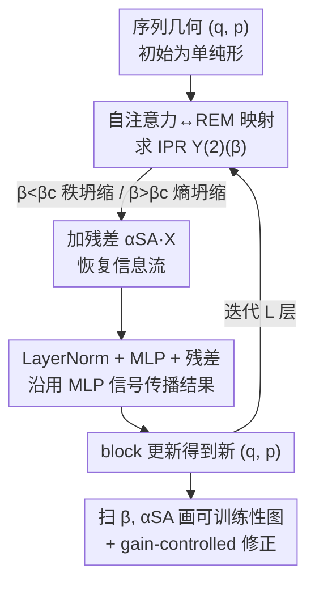

# Two Failure Modes of Deep Transformers and How to Avoid Them: A Unified Theory of Signal Propagation at Initialisation

**会议**: ICLR 2026  
**OpenReview**: [https://openreview.net/forum?id=utSqpxQHXq](https://openreview.net/forum?id=utSqpxQHXq)  
**领域**: 学习理论 / Transformer 信号传播  
**关键词**: 初始化, 信号传播, 秩坍缩, 熵坍缩, 随机能量模型

## 一句话总结
本文借助统计物理里的随机能量模型（REM），给出深层 Transformer 在初始化时信号传播的渐近精确理论，把"秩坍缩"与"熵坍缩"两种失效统一为由 query/key 初始化方差 $\beta$ 控制的同一个相变，并据此导出一套算法来画"可训练性图"，直接告诉实践者残差强度和初始权重该怎么取才能让深层模型训得动。

## 研究背景与动机

**领域现状**：在全连接网络里，"信号传播"理论已经很成熟——通过追踪两个输入在前向传播中相似度的演化，人们找到了所谓"混沌边缘"（edge of chaos）的最优初始化。但 Transformer 里全连接层和自注意力层交替出现，刻画信息流的关键量从"两个输入的相似度"变成了"一个序列内 token 之间的相似度"，而自注意力层带来了全连接网络没有的麻烦。

**现有痛点**：自注意力有两种臭名昭著的初始化失效。**秩坍缩**（rank collapse）：注意力把所有 token 映成几乎相同的表示，输出矩阵退化为秩一，序列信息被彻底抹掉，并诱发梯度消失；Dong et al. 证明纯注意力网络会以层数的双指数速率坍缩。**熵坍缩**（entropy collapse）：query 只盯着初始化决定的一小撮固定 token，注意力分布的香农熵极低，导致训练不稳定。以往工作要么只研究其中一种，要么对自注意力做了过强的近似——比如假设注意力是均匀的（Noci et al.），或对 softmax 分子分母分别取期望的"退火"近似（Cowsik et al.），后者恰恰丢掉了大初始权重引发熵坍缩的关键行为。

**核心矛盾**：缺一个**定量、统一**的描述，既能说清两种失效从何而来，又能给出"到常数级别"的精确初始化处方。难点全在自注意力层——它有强非线性的 softmax 加归一化，难以精确处理。

**本文目标**：建立一个把自注意力、LayerNorm、残差连接、MLP 都纳入的完整 Transformer block 信号传播理论；据此回答"给定架构，初始权重尺度和残差强度取多少才可训练"。

**切入角度**：作者注意到，单行注意力 $A_{tt'}=e^{a_{tt'}}/\sum_\tau e^{a_{t\tau}}$ 与统计物理里随机能量模型的玻尔兹曼分布 $p(s)=e^{-\beta E(s)}/Z$ **数学结构完全一致**——都是"随机参数的指数再归一化"。于是可以把无穷长序列极限下的自注意力当成一个 REM 来精确求解。

**核心 idea**：把自注意力映射到 REM，用统计物理的大偏差工具求出一个临界温度 $\beta_c$；$\beta<\beta_c$ 对应秩坍缩、$\beta>\beta_c$ 对应熵坍缩，两种失效被同一个相变统一起来。

## 方法详解

### 整体框架

本文不是提出新模型，而是提出一套**分析工具**：在初始化时（参数都是 i.i.d. 随机），追踪一个序列里 token 两两之间的几何关系随深度的演化，从而预测模型能否训得动。

核心做法是把序列几何压缩成两个标量序参量：平均平方范数 $q=\mathbb{E}\langle q_{tt}\rangle$ 和平均重叠 $p=\mathbb{E}\langle q_{ts}\rangle$（其中 $q_{ts}=\frac1d X_t\cdot X_s$），平均余弦相似度即 $\rho=p/q$。关键观察是：初始化时 token 近似落在高维单纯形顶点（$q_{tt}\approx 1,\ q_{ts}\approx 0$），且在无穷长序列极限下这个单纯形结构**逐层保持**，只是 $(q,p)$ 的数值在变。于是只要给出"一个 Transformer block 如何把 $(q,p)$ 映到 $(q',p')$"，迭代它就能跟踪相似度随深度怎么走。

整条 block 更新链路如下：自注意力（含 REM 求解出的更新）→ 加残差 → LayerNorm → MLP → 加残差 → LayerNorm。把它迭代 $L$ 次，再扫描不同的 $\beta$（query/key 方差）和 $\alpha_{SA}$（注意力残差强度），就能画出可训练性图，分出三个区：秩坍缩区、熵坍缩区、以及小初始权重+强残差的可训练蓝区。

### 关键设计

**1. 把自注意力映射到随机能量模型：用统计物理精确啃下 softmax**

难点在于 softmax 的强非线性，以往要么假设均匀注意力、要么对分子分母分别取期望，都在大初始权重时失真。本文的突破是发现：一行注意力权重 $A_{tt'}=e^{a_{tt'}}/Z$ 与 REM 的玻尔兹曼态概率 $p(s)=e^{-\beta E(s)}/\mathrm{Tr}\,e^{-\beta E(s)}$ 共享同一数学结构——分母是配分函数 $Z(\beta)=\sum_\tau e^{a_{t\tau}}$。初始化时注意力得分 $a_{tt'}=\frac1{\sqrt d}(W_QX_t)^\top(W_KX_{t'})$ 是均值 0、方差 $\sigma_a^2$ 的高斯量，正对应 REM 里随机抽取的能量。差别在于注意力得分之间是**相关**的：$\mathbb{E}[a_{ts}a_{\tau\sigma}]=\sigma_a^2 q_{t\tau}q_{s\sigma}$，本文把 REM 推广到带这种几何相关结构的版本，使临界温度依赖于 $(q,p)$。

由此还引出一个**新的初始化标度律**：MLP 里权重方差取 $O(1/d)$ 让预激活保持 $O(1)$；而 REM 类比表明，自注意力得分方差应取 $O(\log T)$（$T$ 是序列长度），以匹配自由度为 $N$、配分项数 $O(e^N)$ 的 REM。因为注意力只对 $T$ 个 token 求和，得分应按 $O(\sqrt{\log T})$ 标度，于是用一个常数"逆温度" $\beta$ 来控制：

$$\sigma_Q^2=\sigma_K^2=\sigma_a/d,\qquad \sigma_a=\beta\sqrt{\log T}.$$

这个针对"无穷长序列"的标度律是本文相对 infinite-width 文献的独立补充。

**2. 一个相变统一秩坍缩与熵坍缩：临界 $\beta_c$ 划开两种失效**

把两种失效统一起来，靠的是 Result 1。定义临界初始化尺度 $\beta_c(q,p)\equiv\sqrt{\tfrac{2}{q(q-p)}}$，在 $d\to\infty,\ T\to\infty$ 下，单层自注意力对平均余弦相似度的更新为

$$\Phi_S(\rho)=\frac{\rho}{(1-\rho)Y^{(2)}(\beta)+\rho}=\begin{cases}1,&\beta<\beta_c\\[4pt]\dfrac{\rho}{1-\beta^{-1}\sqrt{2(1-\rho)}},&\beta>\beta_c\end{cases}$$

判别熵坍缩的指标是逆参与率（IPR）$Y^{(2)}_t=\sum_s A_{ts}^2$，它满足

$$\lim_{T\to\infty}\mathbb{E}\,Y^{(2)}_t=Y^{(2)}(\beta)=\begin{cases}0,&\beta<\beta_c\\[2pt]1-\beta_c/\beta,&\beta>\beta_c\end{cases}$$

物理意义很直白：$\beta<\beta_c$ 时注意力"摊开"，等价于对所有 token 取平均，余弦相似度饱和到 1，输出退化为秩一——这就是**秩坍缩**（若无残差则不可训练，但残差能救）；$\beta>\beta_c$ 时 token 多样性被保住，可 IPR 不为零，说明注意力"局域化"到由初始化（而非学习）决定的少数 token 上——这就是**熵坍缩**，而且**残差救不了**。$\beta_c$ 把两者隔成一个尖锐相变。这正是本文新意所在：Noci et al. 默认模型整体处于秩坍缩相，完全漏掉了熵坍缩；Cowsik et al. 的退火近似又抓不住熵坍缩背后的大偏差行为。

实践上还有有限尺寸修正：配分函数 $Z(\beta)$ 的中心极限定理在更低的阈值 $\tilde\beta_c=\beta_c/2$ 就先失效，所以渐近预测在 $\beta<\tilde\beta_c$ 内最准，临界点附近会出现理论与仿真的偏差（平滑过渡而非突变）。

**3. 反向传播的梯度分析：解释"小初始化为什么也会梯度消失"**

只看前向还不够。Result 2 给出 query/key 权重梯度的 Frobenius 范数（$T\to\infty$）：

$$\frac{T}{d^2\sqrt{\log T}}\,\mathbb{E}\Big\|\frac{\partial L}{\partial W_Q}\Big\|_F^2=C\beta\,\sigma_v^2\,q(q-p)\Big[(q-p)\big(Y^{(2)}-2Y^{(3)}\big)+p\,(Y^{(2)})^2\Big].$$

它揭示梯度在两种情形下消失：其一 $q=p$（注意力均匀、所有 token 被映成同一个），这恢复了 Noci et al."输入已坍缩则梯度消失"的旧结论；其二，即便输入 token 仍有多样性（$p\neq q$），只要 $\beta<\beta_c$，IPR $Y^{(2)},Y^{(3)}\to 0$，梯度照样消失（有限序列下阈值降到 $\tilde\beta_c$）。这就摆出一个看似悖论：$\beta<\beta_c$ 梯度消失，$\beta>\beta_c$ 又困在熵坍缩，那梯度从哪来？解答是——Result 2 依赖初始化时的单纯形结构，而残差连接在**第一次反传**就给嵌入注入了非零梯度（与 $\beta$ 无关），破坏了单纯形假设，从而让"梯度消失"结论仅在初始化时成立、随后即失效。这正是残差连接不可或缺的深层原因。

**4. 拼出完整 block 算法与 gain-controlled 修正：从理论到可训练性图**

把自注意力结果与 LayerNorm、MLP 拼起来就得到可迭代的 block 更新（以 BERT 的 post-norm 为例即 Algorithm 1）。自注意力层的序参量演化为 $q_S=\sigma_v^2[p+(q-p)Y^{(2)}]$、$p_S=\sigma_v^2 p$；残差按 $q\leftarrow q_S+q\,\alpha_{SA}^2,\ p\leftarrow p_S+p\,\alpha_{SA}^2$ 叠加；MLP 沿用 Poole/Schoenholz 的全连接信号传播结果（ReLU 下有闭式 $f(\rho)$）；LayerNorm 则把 $p\leftarrow p/q,\ q\leftarrow 1$。迭代它扫 $(\beta,\alpha_{SA})$ 即得图 1 的可训练性图。临界 $\beta_c$ 是全局性质，而残差强度临界值 $\alpha_c$ 依赖深度——理论能为任意深度算出"保证信号传播所需的最小残差强度"。

理论还能直接服务三个应用：① 验证 BERT 的相似度演化预测；② 对比 pre-LN vs post-LN，证明 pre-LN 让秩坍缩推迟得多、确实更稳；③ 提出 **gain-controlled attention**——只要把自注意力输出里序列方向上的均值减掉（类似神经科学的增益控制），就能与 pre/post-LN 配合同时缓解两种坍缩。注意 LayerNorm 本身对防熵坍缩至关重要，因为 $\beta_c(q,p)$ 反比于 $q$；而要把信号无穷深地传下去，只需用 gain-controlled attention 并让 MLP 初始化在混沌边缘。

### 损失函数 / 训练策略
本文是初始化时的理论分析，不引入新训练目标；实验用标准掩码语言建模（BERT 风格）在 TinyStories 上训练，验证不同 $\beta,\alpha_{SA}$ 下的可训练性预测。

## 实验关键数据

### 主实验
理论预测与经验测量高度吻合，并能正确预判 60 层 BERT 在 TinyStories 上的成败。

| 验证场景 | 理论 vs 实测 | 结论 |
|----------|-------------|------|
| BERT token 平均余弦相似度随深度演化（不同 $\alpha_{SA}$） | 实测点紧贴理论曲线 | 足够大的残差 $\alpha_{SA}$ 阻止相似度饱和到 1（防秩坍缩） |
| 60 层 BERT 测试损失（每个相区各取 2 个初始化） | 与可训练性图预测一致 | 落在秩/熵坍缩区的初始化训不动，蓝区能训 |
| query 梯度 Frobenius 范数（多组 $T,d$） | 按 Result 2 标度后曲线重合 | 梯度在 $\beta<\tilde\beta_c$ 处趋零 |

### 消融 / 分析实验

| 配置 | 关键现象 | 说明 |
|------|---------|------|
| 单层 Transformer 扫 $\beta$ 小→大 | 小 $\beta$（蓝）注意力熵随训练分散、可学；大 $\beta$（红）熵迅速近零 | 两相训练行为截然不同，$\beta_c(\rho{=}0)=\sqrt 2$ |
| pre-LN vs post-LN | pre-LN 的 $\langle\rho\rangle\to 1$（秩坍缩）出现得晚得多 | 印证 pre-LN 更稳 |
| vanilla vs gain-controlled（30 层 BERT） | gain-controlled 在 vanilla 失败的区间仍能训练成功 | 减去均值即可缓解秩坍缩 |

### 关键发现
- **唯一可行初始化**是小方差 $\beta<\beta_c$ 配上残差连接；大方差必陷熵坍缩、残差也救不了。
- 残差强度临界值 $\alpha_c$ 随深度增大——越深的模型越需要强残差，理论能给出每个深度的最小残差。
- 因果（自回归）模型不完全适用：早期 token 上下文短、不满足单纯形几何，秩坍缩不在整序列层面发生，而可能出现在靠后位置的 token 表示中。

## 亮点与洞察
- **REM 类比是真正的"啊哈"**：把难啃的 softmax 自注意力等同于统计物理里一个被研究透的可解模型，从而拿到大偏差/相变这类精确工具——这是统一两种失效的钥匙。
- **两种失效其实是同一相变的两侧**：以往秩坍缩、熵坍缩被分开讨论，本文用一个 $\beta_c$ 把它们摆在同一张相图上，物理图像极其清爽。
- **可直接落地的处方**：可训练性图把"残差强度 × 初始权重尺度"画成可读的相区，工程上拿来就能选超参，而非靠试错。
- **gain-controlled attention** 提示了一个简单的架构改动（减序列方向均值）就能同时躲开两种坍缩，值得在大规模上验证。

## 局限与展望
- 理论建立在**无穷长序列 + 无穷宽**的极限和初始化时的单纯形几何上；有限尺寸需额外修正，临界点附近本就预测不准。
- 主要针对**非因果（encoder）**Transformer；自回归模型只能近似处理靠后 token，理论尚不完整。
- 分析**只在初始化时**严格成立——一旦反传更新破坏单纯形结构，结论即失效，无法直接外推到训练全过程。
- gain-controlled attention 仅有 30 层的初步实验，大规模有效性留作未来工作。

## 相关工作与启发
- **vs Noci et al. (2022)**：他们假设模型整体处于秩坍缩相、只用均匀注意力近似，因而完全漏掉熵坍缩；本文用 REM 精确处理 softmax，把两种失效统一，并把"输入坍缩则梯度消失"推广到"$\beta<\beta_c$ 即梯度消失"。
- **vs Cowsik et al. (2024)**：他们对 softmax 分子分母分别取期望的"退火"近似，抓不住大初始权重的大偏差行为（即熵坍缩）；本文走互补的无穷长序列极限，正好捕捉到它。
- **vs Noci et al. (2023) / Naderi et al. (2024)**：他们走无穷宽+深的比例极限并去掉 LayerNorm 来推 SDE；本文指出 LayerNorm 对防熵坍缩至关重要（$\beta_c\propto 1/\sqrt q$），并用本框架说明 gain-controlled attention 能与 LN 配合同时缓解两类坍缩。

## 评分
- 新颖性: ⭐⭐⭐⭐⭐ REM↔自注意力映射 + $O(\sqrt{\log T})$ 标度律，把两种失效统一进一个相变，角度新。
- 实验充分度: ⭐⭐⭐⭐ 理论预测与 BERT/TinyStories 实测吻合、梯度标度验证扎实，但大模型与 gain-controlled 仅初步。
- 写作质量: ⭐⭐⭐⭐⭐ 物理直觉与数学推导衔接清晰，相图把抽象理论可视化得很好。
- 价值: ⭐⭐⭐⭐⭐ 给深层 Transformer 初始化提供到常数级别的处方，理论与工程兼顾。

<!-- RELATED:START -->

## 相关论文

- [\[ICLR 2026\] How to Square Tensor Networks and Circuits Without Squaring Them](how_to_square_tensor_networks_and_circuits_without_squaring_them.md)
- [\[ICLR 2026\] On the Computational Limits of AI4S-RL：A Unified $\varepsilon$-$N$ Analysis](on_the_computational_limits_of_ai4s-rl_a_unified_varepsilon-n_analysis.md)
- [\[ICLR 2026\] On Universality of Deep Equivariant Networks](on_universality_of_deep_equivariant_networks.md)
- [\[ICLR 2026\] Critical Attention Scaling in Long-Context Transformers](critical_attention_scaling_in_long-context_transformers.md)
- [\[ICLR 2026\] Variational Deep Learning via Implicit Regularization](variational_deep_learning_via_implicit_regularization.md)

<!-- RELATED:END -->
