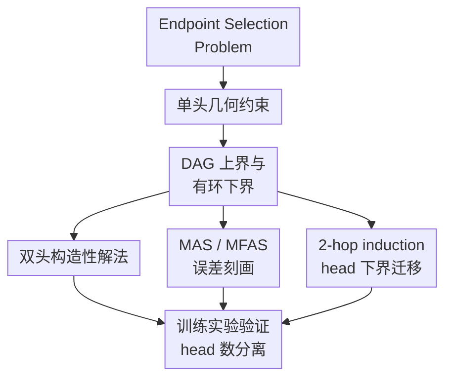

# Two (narrow) heads are better than (an arbitrarily wide) one

**会议**: ICLR2026  
**OpenReview**: [https://openreview.net/forum?id=RRmPbbZsvl](https://openreview.net/forum?id=RRmPbbZsvl)  
**论文**: OpenReview  
**代码**: supplementary material  
**领域**: 学习理论 / Transformer 表达能力  
**关键词**: Transformer理论, 多头注意力, 表达能力下界, Endpoint Selection Problem, 归纳头  

## 一句话总结
本文用 Endpoint Selection Problem 证明：在一层 attention-only Transformer 中，任意宽、任意精度的单头注意力都无法解决带环有向图上的端点选择，而两个窄头已经能在所有有向图上零误差求解，从而给出一个清晰的多头注意力表达能力分离结果。

## 研究背景与动机
**领域现状**：Transformer 的成功很大程度来自 attention 机制，尤其是多头注意力在大模型中承担了大量选择、复制、路由和组合信息的工作。但完整 LLM 规模太大，训练数据和优化轨迹也太复杂，想直接证明某个真实模型内部为什么具备某种能力几乎不可行。因此理论研究常把模型缩到一两层、少量 head、attention-only，再用算法任务或图任务刻画不同架构的边界。

**现有痛点**：已有下界往往依赖宽度、精度或 head 数的联合约束，例如要求 $H(d+1)p$ 小于某个量时任务不可解。这样的结论很有价值，但还没有回答一个更尖锐的问题：如果单个 attention head 可以无限宽、数值无限精细，它是否仍然有本质弱点？如果答案是有，那么多头不是简单的参数增加，而是带来结构性的计算能力。

**核心矛盾**：单头注意力在一个查询位置只能形成一次 softmax 加权平均。它可以把多个 token 混成一个上下文向量，但所有选择条件必须通过同一个几何方向和同一个凸组合同时满足。对于有向图中带环的选择任务，这种单一凸组合会遇到循环约束：沿着一圈边走回来时，模型既要保持一致的端点偏好，又要根据 selector 翻转选择方向，几何上无法同时成立。

**本文目标**：作者希望构造一个足够简单、又能暴露 attention head 表达力差异的任务。这个任务要能证明单头的无条件不可能性，要能展示两个 head 的构造性可解性，还最好能连接到 induction head、图遍历等更广泛的 Transformer 推理现象。

**切入角度**：论文提出 Endpoint Selection Problem（ESP）：给定有向边 $(u,v)$、selector token $1$ 或 $2$、固定 query token `#`，模型要输出 selector 指定的端点。这个任务看起来只是“从两个 token 中选一个”，但因为边来自一个有向图，所有边共享同一组 token embedding 和同一套 attention 参数，图的环结构会把局部选择约束串成全局矛盾。

**核心 idea**：用 ESP 把“一个 head 的一次凸组合”转化为图上的半空间可满足性问题，证明有环时单头不可解；再用两个 head 分别对齐两个端点位置，说明增加一个窄 head 就能绕开单头的全局几何瓶颈。

## 方法详解
### 整体框架
这篇论文的方法不是提出新的训练算法，而是构造一个理论测试床，并围绕它建立上下界和实验验证。整体路线是：先定义 ESP 和 attention-only 模型；再证明单头在 DAG 上可解、在任意带环图上不可解；随后构造双头模型解决所有有向图；最后把最优单头误差和 Maximum Acyclic Subgraph 联系起来，并用训练实验观察优化器是否能找到理论允许的解。

ESP 的输入序列固定为 $(u, v, i, \#)$，其中 $(u,v)$ 是图 $G=(V,E)$ 的一条有向边，$i \in \{1,2\}$ 是 selector。若 $i=1$，正确输出是 $u$；若 $i=2$，正确输出是 $v$。输入分布在所有边和两个 selector 上均匀，即共有 $2m$ 个样本。模型是一层 attention-only Transformer，最后只看末位 `#` 处的输出，并在温度趋近 $0$ 时取最大 logit 对应 token。

论文关注的不是泛化误差，而是表示能力：是否存在一组参数能对给定图上的所有 ESP 样本零误差。这个视角让问题变得很干净，因为任何训练失败都先和“解是否存在”分开讨论。理论部分证明：DAG 的结构允许单头把顶点按拓扑序编码，从而让 selector 对端点偏好产生一致控制；一旦图中有有向环，单头所需满足的不等式会沿环相互冲突；两个 head 则可以分别关注位置 $1$ 和位置 $2$，让 selector 抑制错误位置、放大正确位置，于是不再被单个凸组合卡住。

### 关键设计
**1. ESP：把端点选择变成 attention 表达力的最小压力测试**

ESP 的巧妙之处在于它几乎不含多余成分。输入只有两个顶点、一个 selector 和一个固定 query，输出也只是两个顶点之一。如果把它当成普通索引查找，会误以为任务太简单；但固定 query token `#` 切断了 selector 与端点位置之间的直接 query-key 对齐，模型必须通过同一个末位查询把“边的两个端点”和“selector 的含义”合成一个上下文向量。

这种设计让任务既足够简单，方便证明；又足够表达图结构，能够区分 DAG 和带环图。对每条边 $(u,v)$，模型必须同时满足 $(u,v,1,\#) \mapsto u$ 与 $(u,v,2,\#) \mapsto v$。当这些边组成一个有向环时，端点偏好会沿环传递，最终回到起点产生矛盾。换句话说，ESP 不是考模型记住某条边，而是考同一组 attention 参数能否在整个有向图上实现一致的条件选择规则。

**2. 单头下界：一次凸组合无法同时满足有环图的半空间约束**

单头 attention 在 query 位置产生的上下文向量，本质上是输入 token embedding 的一个 softmax 加权平均。对边 $(a,b)$，当 selector 为 $1$ 时，上下文向量必须落在输出 $a$ 的半空间里；当 selector 为 $2$ 时，它必须落在输出 $b$ 的半空间里。若用 $x_a,x_b$ 表示两个顶点的输出方向，那么正确选择 $a$ 等价于上下文向量 $v$ 满足 $v \cdot (x_a-x_b) > 0$，正确选择 $b$ 等价于 $v \cdot (x_a-x_b) < 0$。

论文把这个条件抽象成一组不等式。对同一条边，selector token 贡献一个向量，非 selector token 的加权和贡献另一个向量；这些向量的非负系数来自 softmax 权重。对于两点环 $(a,b)$ 和 $(b,a)$，四个选择条件会要求同一批向量同时落在相互冲突的半空间。Lemma 1 证明这种四重不等式不可满足；Lemma 2 再通过归纳把二环矛盾推广到任意长度的有向环。于是 Theorem 2 得到最强结论：只要图中存在 cycle，任意维度、任意精度的单层单头 attention-only Transformer 都不能零误差解决 ESP。

这个下界的力度在于它不靠“模型太窄”或“数字精度不够”。即使把 embedding 维度放到无限大，单头仍然只有一个 attention 分布和一个合成向量，这个结构限制不会消失。因此论文标题里 “arbitrarily wide one” 指的不是经验上的训练不好，而是表示空间再宽也无法绕开的几何限制。

**3. DAG 上界与 MAS 误差：单头能做的部分等价于抽出无环子图**

单头并非完全无能。对 DAG，作者构造了一个维度 $n+1$ 的 embedding：每个顶点用标准基表示，顶点按拓扑序编号，selector $1$ 和 $2$ 则被设计成沿相反方向的数值坡度。这样当输入边 $(v_i,v_j)$ 满足 $i<j$ 时，selector $1$ 总能让第一个端点胜出，selector $2$ 总能让第二个端点胜出。也就是说，DAG 的拓扑序给了单头一个全局一致的“方向”，所有局部选择都不会绕回来自我矛盾。

对一般图，作者进一步指出：如果图中有一个包含 $m'$ 条边的无环子图，那么同样构造可以让单头在这些边上全对，而在剩余边上至少能保住一半 selector 情况。于是误差至多为 $1/2 - m'/(2m)$。当 $m'$ 取 Maximum Acyclic Subgraph（MAS）的大小时，最优单头误差精确等于

$$
\mathrm{err}_{1\text{-head}} = \frac{1}{2} - \frac{|\mathrm{MAS}|}{2m} = \frac{|\mathrm{MFAS}|}{2m}.
$$

这条公式把 Transformer 表达能力和经典图优化问题连起来。因为 MAS / MFAS 是 NP-hard 且有近似困难，论文得到一个很有意思的推论：不仅单头在有环图上不能零误差，连找到最优或近似最优的单头错误率也继承了组合优化的困难。

**4. 双头构造：两个窄 head 分别锁定两个位置，selector 决定谁胜出**

双头上界展示了这篇论文最直观的分离：只加一个 head，就能解决任意有向图上的 ESP。构造里，两个 head 的 attention 矩阵分别让 query `#` 读取输入位置 $1$ 和位置 $2$ 的位置信息。selector token 通过一个大的负值 $-M$ 抑制错误位置，使得当 $i=1$ 时位置 $1$ 的权重大于位置 $2$，当 $i=2$ 时位置 $2$ 的权重大于位置 $1$。value 和 output projection 则只保留顶点身份，把最终最大 logit 给到被选中的端点。

这个构造可以用 $O(n)$ 维标准基完成，也可以把顶点嵌入到二维单位圆上，用 $d=5$ 的常数维 embedding 加 $O(\log n)$ 精度完成。后者说明“两个窄 head”并不是靠巨大宽度取胜，而是靠 head 的并行结构取胜：两个 attention 分布可以分别形成两个视角，再在输出处相加比较。单头只有一个分布，必须在同一个平均里同时处理两个端点和 selector；双头则能把位置选择拆开，因此不受环结构的不等式矛盾约束。

**5. 下界迁移到 2-hop induction head：ESP 不是孤立玩具任务**

论文还把 ESP 嵌入到 2-hop induction head 问题中。直观地说，ESP 输入 $(a,b,i,\#)$ 可以变成类似 $(1,a,2,b,\#,i,\#)$ 的序列，其中固定 token 占据若干位置，真正变化的仍然是 $a,b$ 和 selector $i$。在这种构造下，模型要做的 next-token prediction 与 ESP 完全等价：selector 为 $1$ 时输出 $a$，selector 为 $2$ 时输出 $b$。

因此，单头无法解决带环 ESP 的下界可以迁移到 2-hop induction head：即使维度和精度不受限制，一层单头 attention-only Transformer 也不能完成这个两跳复制任务。这个结果重要在于 induction head 是 mechanistic interpretability 和 in-context learning 研究中的核心电路之一，ESP 给出了一个更容易分析的代理任务，并说明其中暴露的限制不是只属于人工构造的图选择问题。

### 损失函数 / 训练策略
理论部分不依赖具体训练损失，而是讨论参数存在性。实验部分使用 decoder-only Transformer，采用 causal self-attention，不含 feed-forward 层；保留 residual connection 和 layer normalization，并 tying input embedding 与 output projection。训练使用 Adam，作者不限制 embedding dimension、学习率、batch size 或训练迭代等超参，目的是观察梯度优化是否能找到理论上存在的解。

数据集由图生成：DAG 使用 transitive tournament，即顶点按 $1,\dots,|V|$ 排序并加入所有 $u<v$ 的有向边；带环图包括不同 MFAS 大小的图和 complete digraph。评估指标是从图中所有 ESP 序列上计算的准确率，也就是模型对每条边和两个 selector 是否输出正确端点。

## 实验关键数据

### 主实验
论文的实验主要验证理论分离是否能在梯度训练中出现。最清楚的对比来自 transitive tournament 和 complete digraph：前者是 DAG，后者包含大量双向边和环。

| 图类型 | 模型 | 理论预期 | 实验观察 | 结论 |
|--------|------|----------|----------|------|
| Transitive tournament (DAG) | 1-head attention-only | 可零误差求解 | 多数组合达到约 $99\%$-$100\%$ | 单头在 DAG 上确实足够 |
| Transitive tournament (DAG) | 2-head attention-only | 可零误差求解 | 多数组合达到约 $99\%$-$100\%$ | 双头也能稳定解决 DAG |
| Complete digraph | 1-head attention-only | 不能零误差；最优准确率至少可到 $75\%$ | 最好结果常在约 $64.55\%$-$72.40\%$ | 优化器难以接近理论最优单头解 |
| Complete digraph | 2-head attention-only | 可零误差求解 | 多数组合达到 $100\%$ | 双头在含环图上形成清晰优势 |

一个值得注意的细节是，complete digraph 上的单头理论最优并非随机猜测。因为 complete digraph 有 $m=n(n-1)$ 条有向边，其中一个 transitive orientation 可形成 $n(n-1)/2$ 条边的 MAS，所以 Theorem 1 给出误差 $1/4$、准确率至少 $75\%$。但实验中，训练出的单头模型往往低于这个界限，说明“存在一个最优单头构造”和“梯度下降能找到它”之间还有距离。

### 消融实验
论文还比较了不同图结构、head 数和 FFN 是否加入时的表现。这里的“消融”更接近架构与图难度分析，而不是常规模块删除实验。

| 配置 | 关键指标 | 说明 |
|------|---------|------|
| 1-head on DAG | 接近或达到 $100\%$ accuracy | 符合 DAG 可解上界，说明单头不是普遍弱，而是被环结构卡住 |
| 1-head on simple cyclic graphs | 在 $|\mathrm{MFAS}|=1$ 时可接近全局最优 | 简单环反馈较少，优化器还能学到 MAS 上的正确方向 |
| 1-head on complete digraph | 约 $64.55\%$-$72.40\%$ best accuracy | 大量环使全局约束复杂，训练也难以达到 $75\%$ 理论可达值 |
| 2-head on complete digraph | $100\%$ accuracy | 一个额外 head 就足以突破单头结构瓶颈 |
| 1-head + bounded-width FFN | 可用相近参数量匹配 2-head attention-only | FFN 能补充非线性表达力，但这已经不是纯单头 attention 的能力 |

### 关键发现
- head 数带来的不是简单参数量收益。complete digraph 上，任意宽单头 attention-only 仍然不能零误差，而两个窄 head 可以零误差，这支持“attention head 是离散计算资源”的观点。
- DAG 与 cyclic graph 的差异非常关键。单头可以利用拓扑序把所有边方向线性化；环则让这种全局排序不存在，从而触发几何矛盾。
- 优化难度和表示能力不同。理论上单头在 complete digraph 可以达到 $75\%$ accuracy，但实际梯度训练低于该值，说明最优单头解可能难找，也呼应 MAS / MFAS 带来的 NP-hard 结构。
- FFN 能改变故事。附加 bounded-width FFN 后，1-head 模型可以用可比参数量解决 complete digraph 上的 ESP，这说明本文结论主要针对 attention-only 的纯注意力表达边界，而不是完整 Transformer 的所有可能变体。

## 亮点与洞察
- 这篇论文最强的地方是下界不依赖维度和精度。很多 Transformer 理论下界会被“那我把宽度加大呢？”削弱直觉冲击，而本文证明单头再宽也无法穿过有环 ESP 的几何矛盾。
- ESP 是一个很好的“最小反例”。它不像复杂图算法那样把难点藏在多步推理里，而是把困难压缩到四个 token 的端点选择中，迫使读者看到单头 attention 的结构性限制。
- MAS / MFAS 连接让结果更有层次。论文不仅说单头不能零误差，还精确刻画了单头能正确处理的最大无环部分，并把寻找最优误差和 NP-hard 图优化联系起来。
- 双头构造非常有解释力。两个 head 分别对齐两个位置，selector 决定哪一路赢，这个机制很像 induction head / copy circuit 中多个 head 分工协作的简化版本。
- 对 mechanistic interpretability 的启发是：某些能力可能不能归因于“某个 head 很宽很强”，而需要多个 head 形成互补几何视角。剪枝或合并 head 时，如果只看单头重要性，可能会低估这种组合结构。

## 局限与展望
- 模型设定很简化。理论主体是单层 attention-only Transformer，不包含标准 Transformer 中的 FFN、残差、层归一化、多层堆叠和复杂 positional encoding 交互。实验虽然加入了 residual 与 layer norm，但核心证明仍是纯 attention 边界。
- ESP 是人工构造任务。它抓住了端点选择和两跳 induction 的核心结构，但距离真实 LLM 中的长上下文推理、语义组合和任务泛化仍有明显距离。
- 双头上界是存在性构造，不等于训练总能找到对应解。实验显示双头容易学到 ESP 解，但更复杂任务上 head 分工是否也能稳定出现，还需要进一步研究。
- 单头 + FFN 的实验提醒我们，完整 Transformer 的表达力来源不止 head 数。后续可以研究 attention head、FFN 宽度、层数之间是否存在更细粒度的可替代关系。
- 论文主要讨论零误差表示能力。真实模型中常关心分布外泛化、样本复杂度和训练动态，ESP 框架可以继续扩展到概率边、超图、多步 traversal 或 noisy selector，观察这些因素如何改变 head hierarchy。

## 相关工作与启发
- **vs Peng et al. 2024 的 function composition 下界**: Peng 等人的结果给出 head、维度和精度乘积不足时的组合函数下界；本文则给出单头在有环 ESP 上的无条件不可能性，不需要限制维度或精度。
- **vs Sanford et al. 的 induction head 下界**: Sanford 等人研究一层 Transformer 无法完成 induction head 任务时的规模要求；本文通过 ESP 到 2-hop induction head 的变换，把更简洁的图选择下界迁移到经典 induction head 场景。
- **vs Bhattamishra et al. 的 Index Lookup**: Index Lookup 中模型可以用 index token 直接对齐位置；ESP 固定 query token，让 selector 不能简单充当查询位置，因此暴露出单头 attention 在条件选择上的更强限制。
- **vs Wang et al. / Nichani et al. 的小 Transformer 图与因果结构能力研究**: 这些工作展示小模型可以学到路径、因果或 induction 结构；本文更偏“边界刻画”，说明小模型在哪些图结构上必然失败、增加哪个结构单元可以恢复能力。
- **对后续研究的启发**: 可以用类似 ESP 的小任务族给 Transformer 架构建立更细的 hierarchy，例如 $k$ 个 head 能解决哪些 $k$ 跳或多端点选择任务，FFN 是否能替代 head，深度和 head 数之间是否存在可证明的 trade-off。

## 评分
- 新颖性: ⭐⭐⭐⭐⭐ 用一个极简 ESP 任务给出单头与双头注意力的无条件表达力分离，问题设计和证明角度都很漂亮。
- 实验充分度: ⭐⭐⭐⭐ 理论论文所需验证比较到位，覆盖 DAG、complete digraph、MFAS 图和 FFN 补充实验；但实验规模和真实任务外推仍有限。
- 写作质量: ⭐⭐⭐⭐ 主线清晰，定理之间衔接自然；部分符号推导较密，需要读者熟悉 attention 几何和图优化。
- 价值: ⭐⭐⭐⭐⭐ 对 Transformer 理论、mechanistic interpretability 和多头注意力为什么有用都提供了一个可复用的分析范式。

<!-- RELATED:START -->

## 相关论文

- [\[ICLR 2026\] Better Bounds for the Distributed Experts Problem](better_bounds_for_the_distributed_experts_problem.md)
- [\[ICLR 2026\] Achieving Approximate Symmetry Is Exponentially Easier than Exact Symmetry](achieving_approximate_symmetry_is_exponentially_easier_than_exact_symmetry.md)
- [\[ICLR 2026\] Random Label Prediction Heads for Studying Memorization in Deep Neural Networks](random_label_prediction_heads_for_studying_memorization_in_deep_neural_networks.md)
- [\[ICLR 2026\] Learning the Inverse Temperature of Ising Models under Hard Constraints using One Sample](learning_the_inverse_temperature_of_ising_models_under_hard_constraints_using_on.md)
- [\[ICLR 2026\] On the Convergence of Two-Layer Kolmogorov-Arnold Networks with First-Layer Training](on_the_convergence_of_two-layer_kolmogorov-arnold_networks_with_first-layer_trai.md)

<!-- RELATED:END -->
