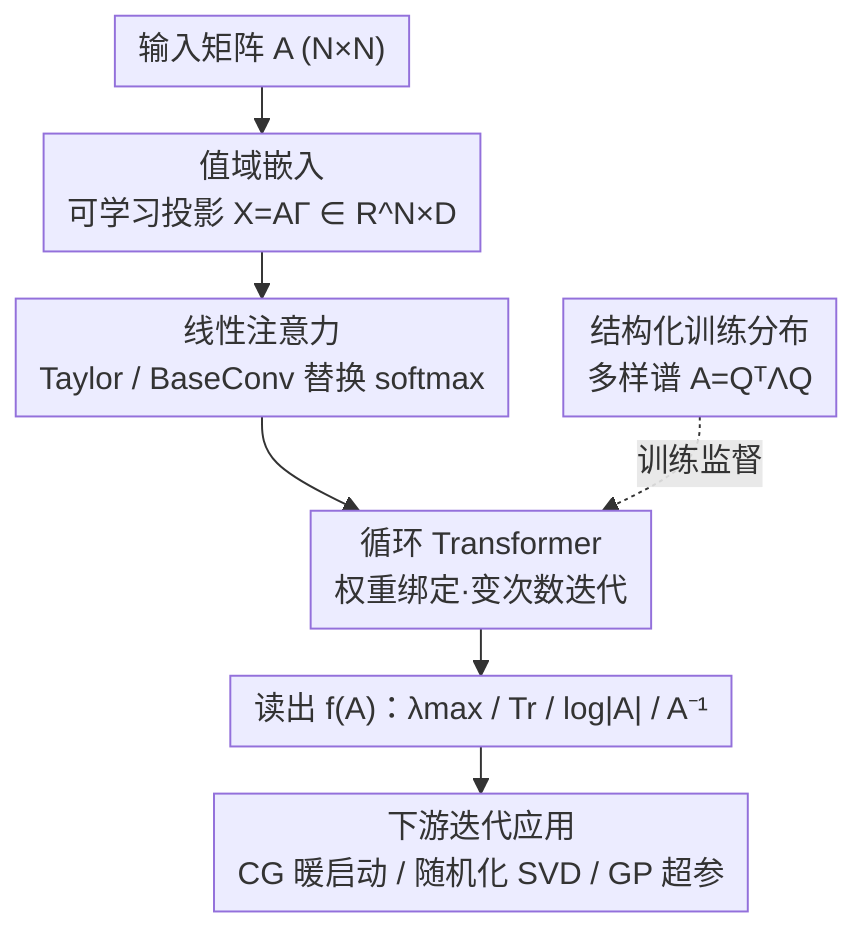

# Understanding and Relaxing the Limitations of Transformers for Linear Algebra

**会议**: ICLR 2026  
**OpenReview**: [https://openreview.net/forum?id=GBkRMi3qjD](https://openreview.net/forum?id=GBkRMi3qjD)  
**代码**: 有（论文中提供，"release code here"）  
**领域**: 学习理论 / Transformer 表达能力  
**关键词**: 数值线性代数, 统计插值, 循环 Transformer, 线性注意力, OOD 泛化

## 一句话总结
本文系统揭示了"用 Transformer 做矩阵运算"这一方向的三大顽疾——计算开销爆炸、对分布外矩阵（甚至单位阵）惨败、本质上只是在做统计插值而非学算法——并通过可学习投影、线性注意力、循环与结构化训练分布四项干预，提出 RangeFormer，首次把 Transformer 矩阵运算推到 $1000\times1000$ 规模并成功用于高斯过程、随机化 SVD 等下游迭代任务。

## 研究背景与动机

**领域现状**：矩阵运算（线性求解 $A^{-1}b$、特征分解、对数行列式 $\log|A|$、求迹 $\mathrm{Tr}(A)$ 等）是高斯过程、归一化流、二阶优化器等几乎所有科学计算管线的底层原语。既然 Transformer 正从"每种模态各自架构"走向"万物皆 Transformer"，一个自然的拷问是：Transformer 究竟能不能胜任矩阵运算这种核心原语？此前相关工作极少（Charton 2022、Yang 2024 等），主流做法是把矩阵 $A$ 拍平成实数序列或字符串 token，再让 Transformer 映射到运算结果。

**现有痛点**：作者指出这条路有三个触目惊心的失败模式。其一是**算力与显存爆炸**——拍平后序列长度变成 $N^2$，单个 Transformer block 需要 $O(N^4D+N^2D^2)$ 算力、$O(N^4+N^2D)$ 显存，在 80GB A100 上 $N>50$ 就 OOM。其二是**分布外泛化极差**——在标准高斯随机矩阵 $A_{i,j}\sim\mathcal{N}(0,1)$ 上训练的模型，遇到单位阵 $I$、对角阵、Toeplitz 阵这类"平凡"矩阵就崩，连 $N=50$ 训练换到 $N=45$ 测试都能让误差恶化近 10 倍。其三、也是最根本的，**模型学的是统计而非算法**。

**核心矛盾**：为什么会这样？作者用随机矩阵理论给出了诊断。对称高斯矩阵的特征值有可预测的分布（$\mathbb{E}[\lambda_{\max}(A)]/\sqrt{N}\to 2\sigma$），于是 Transformer 只要记住训练数据的统计规律就能在同分布上拿高分——它学到的是"高斯谱长什么样"，而非"怎么算特征值"。一旦输入换成谱结构不同的矩阵，记忆失效，模型彻底瞎猜。换言之，问题不在于参数不够多，而在于训练信号（单一高斯分布）+ 架构（无迭代偏置）共同把模型推向了**统计插值**而非**算法发现**。

**本文目标**：把上述三个子问题各个击破——降算力、提 OOD 泛化、注入算法偏置——并验证改进后的模型能否真正用于需要反复迭代矩阵运算的下游应用。

**切入角度**：作者强调本文首要目标是"理解 Transformer 在线性代数上的能力边界"，方法干预是为理解服务的。诊断阶段的关键观察是：经典数值线代算法（共轭梯度、Krylov 子空间法）都是**迭代式**的，难度越大迭代越多；而拍平式 Transformer 是一次前向定死，谈不上迭代。这个对照启发了循环架构。

**核心 idea**：用"可学习投影直接吃矩阵的值域（range）+ 线性注意力 + 权重绑定的循环 + 结构化多样谱训练分布"四项干预，把一个"基本坏掉"的系统改造成能在真实世界 OOD 矩阵上称职工作的 RangeFormer。

## 方法详解

### 整体框架

本文先建立基线再逐步干预。基线 **NumFormer**（数值 Transformer）把矩阵 $A$ 拍平成 $\mathrm{vec}(A)$，每个标量经线性层 $W^{(I)}\in\mathbb{R}^{1\times D}$ 嵌入得 $X\in\mathbb{R}^{N^2\times D}$，过标准 Transformer（公式 $X\leftarrow X+\mathrm{Attn}(X)$、$X\leftarrow X+\mathrm{MLP}(X)$ 堆 $L$ 层）后用线性层读出 $Y$，对 $A^{-1}$ 用核范数损失 $\|Y-f(A)\|_*$、对标量目标用 $|Y-f(A)|$。它已经比字符串版 **STRFormer**（把数字编码成 token、用交叉熵）好一个数量级，但仍受 $O(N^4)$ 显存所困。

RangeFormer 在 NumFormer 上叠加四项干预，把数据通路从"拍平 $N^2$ 序列"改造成"以矩阵行为序列、$D$ 列为嵌入"，并注入迭代偏置和多样训练谱。下图给出从输入矩阵到运算结果、再到下游应用的整体流向（虚线为训练侧的数据分布干预）：

四项干预对应四个关键设计；结构化训练分布是训练侧监督来源，循环结构是其能真正"用上迭代"的载体。

### 关键设计

**1. 值域嵌入：用可学习投影绕开 $N^2$ 序列长度**

拍平的致命伤是序列长度等于 $N^2$，注意力层因此背上 $O(N^4+N^2D)$ 显存。本设计不再拍平，而是学一个投影矩阵 $\Gamma\in\mathbb{R}^{N\times D}$，直接把矩阵作用到它身上得到 $X=A\Gamma\in\mathbb{R}^{N\times D}$，把矩阵的行当作序列维、列当作嵌入维。这样序列长度从 $N^2$ 降回 $N$，嵌入阶段的复杂度降到 $O(N^2+ND)$。之所以叫"值域"（range），是因为 $A\Gamma$ 探测的正是算子 $A$ 在一组（可学习的）方向上的作用，即 $A$ 的值域信息——这比逐元素读数字更贴合"算子"语义。该干预在参数量反而减少的情况下还带来了性能小幅提升。

**2. 线性注意力：去掉 softmax 的非线性畸变并再降复杂度**

即便序列短了，标准 softmax 注意力对线性代数原语仍不友好：其尺度归一化和非线性形式会给矩阵乘法这类操作引入近似畸变（Giannou 2023、Liu 2025 均有论证），而矩阵运算本质上大量依赖干净的矩阵乘。本设计改用线性注意力替代——Taylor attention（Arora 2023）或 BaseConv（Liu 2025）——既避免了 softmax 的畸变，又因为不必显式构造完整的 $S\times S$ 注意力矩阵，把整体复杂度进一步压到算力 $O(ND^2)$、显存 $O(ND+D^2)$。值域嵌入与线性注意力合力，把显存从 $O(N^4)$ 一路降到 $O(ND+D^2)$，于是能在比旧方法跑 $N=50$ 更短的时间里训练 $N=1000$ 的矩阵。

**3. 循环 Transformer：把"算法偏置"硬塞进架构**

诊断阶段发现 NumFormer 逐层遍历时误差并不单调下降（图 2），说明它根本没在执行迭代算法。本设计把公式 (1) 里各层权重**绑定（weight-tying）**成一个循环 Transformer：同一组参数被反复施加，矩阵可被处理可变次数，难度/病态程度越高就迭代越多——这正是共轭梯度、随机 Lanczos 求积等经典迭代线代例程的工作方式。绑定之后，RangeFormer 在 OOD Toeplitz 矩阵的 $A^{-1}$ 任务上误差随层数**单调下降**（前期陡、后期平），而 NumFormer 纹丝不动。循环还有个意外红利：在随机化 SVD 应用里，逐层把噪声 $\Omega_0\sim\mathcal{N}(0,I)$ 推过各层得到 $\Omega\sim NN_\theta(A)$ 的过程，形式上类似扩散采样。

**4. 结构化训练分布：从统计插值迈向可泛化算法**

前述统计插值的病根在于只在高斯随机矩阵上训练——附录显示不同高斯矩阵的特征谱几乎一模一样，本质是同一个线性算子。本设计构造一个由两类元素组成的数据混合：**结构化矩阵**与**不同特征谱衰减的矩阵**。结构化部分借助 Potapczynski 2024 的连续 Einsum 参数化随机采样 Kronecker、低秩、Tensor Train、Block Tensor Train、Monarch 等多种结构（这种采样方式天然不会采到 $I$、$0$、对角、Toeplitz，恰好把它们留作 OOD 测试）；谱多样性部分则先用一系列函数形式生成多样的特征谱 $\Lambda$，再采随机正交基 $Q$ 合成 $A=Q^\top\Lambda Q$。即便矩阵元素仍采自 $\mathcal{N}(0,1)$，不同结构带来的谱已显著多样，迫使模型不能再靠"背高斯谱"取巧，从而把 OOD 性能拉高一个数量级。

### 损失函数 / 训练策略

每个矩阵运算单独训练一个模型。损失按目标类型选择：标量目标（$\mathrm{Tr}$、$\log|A|$、$\lambda_{\max}$）用绝对误差 $|Y-f(A)|$，矩阵目标（$A^{-1}$）用核范数 $\|Y-f(A)\|_*$。训练沿用 LLM 式单 epoch——每步现采新随机矩阵、永不重复数据。为解决尺寸泛化（图 4 显示固定尺寸训练对其他尺寸惨败），采用**变序列长度批处理**，在一批里混入 $\{N_1,\dots,N_R\}$ 多种尺寸（如 $50/30/10$）联合训练，模型即可外推到未见过的 $5/20/45$ 等尺寸。在 $N=1000$ 尺度（尤其线性求解）模型直接训练无法收敛，需**课程学习**：先训出能解 $N=100$ 的 checkpoint，再以它为起点去解 $N=1000$，否则损失根本不下降。

## 实验关键数据

### 主实验

评测集分两组 OOD 矩阵：$\mathcal{S}$ 含单位阵、对角阵、Toeplitz 等典范结构矩阵；$\mathcal{M}$ 含 100+ 个来自 matrix market 的真实矩阵（有限元、结构工程、流体、电网等）。下表为四项运算在 matrix market 上的相对误差量级对比。

| 任务 / 设置 | STRFormer | NumFormer（基线） | RangeFormer | 关键结论 |
|--------|------|------|----------|------|
| $\lambda_{\max},\mathrm{Tr},\log\|A\|,A^{-1}$（MM，$N\le20$） | 常解码失败 | 误差高 | 比基线低约一个数量级 | RangeFormer 全面领先 |
| 可跑最大尺寸 | $\le50$ | $\le50$（$N>50$ OOM） | 高达 $1000\times1000$ | 显存 $O(N^4)\!\to\!O(ND+D^2)$ |
| 单位阵 $I$ 上 least-squares | 解码失败 | 严重退化 | 显著改善 | 旧方法连平凡阵都崩 |

### 消融实验

图 5(左) 给出在 $20\times20$ matrix market 的 $A^{-1}$ 任务上，从 NumFormer 逐项叠加干预对相对误差的累积效果。

| 配置 | 相对误差（MM）趋势 | 说明 |
|------|---------|------|
| Base（NumFormer + 高斯训练） | 最高（≈0.9–1.0） | 统计插值基线 |
| + Loop（循环/迭代偏置） | 下降 | 注入算法偏置，误差随层单调降 |
| + Range（值域嵌入） | 进一步下降 | 参数更少仍小幅提升 |
| + Attn（线性注意力） | 进一步下降 | 主要带来算力/显存收益 |
| + Dist（结构化训练分布） | 最低 | OOD 性能提升最显著的一项 |

### 关键发现

- **训练分布（Dist）贡献最大**：在把 RangeFormer 从高斯训练切到结构化数据混合后，单位阵、零阵、Toeplitz、MM 集合的 OOD 误差全面大幅下降——印证"病根在数据单一导致统计插值"。
- **循环让误差真正单调下降**：NumFormer 逐层误差不降（图 2、图 6 左），RangeFormer 逐层单调降，说明循环确实把模型推向迭代式算法行为。
- **尺寸鲁棒性**：用多尺寸批处理训练（$50/30/10$）后，模型在未见过的 $5/20/45$ 尺寸上仍稳定，摆脱了 $N=50\!\to\!45$ 就恶化 10 倍的脆弱性。
- **下游可用**：CG 用 $x_0=NN_\theta(A)$ 暖启动在 bcsstk02 上收敛显著更快；RFSVD（$D=16$）比标准 RSVD 更贴近真实谱；GP 用 RangeFormer 算 $\log|K_\phi|$ 与 $K_\phi^{-1}y$ 学 RBF 长度尺度，测试 RMSE 0.87978 对比 Cholesky 的 0.87996，几乎一致。

## 亮点与洞察

- **"统计插值 vs 算法发现"的诊断很漂亮**：用随机矩阵理论（$\mathbb{E}[\lambda_{\max}]/\sqrt N\to2\sigma$）+ 掩码探针（把输入逐步掩成零阵，模型输出从 $\mathbb{E}[\lambda_{\max}]$ 滑向 $\min\lambda_{\max}$）+ 谱预测（对 Toeplitz 仍硬套高斯的线性衰减），三招把"模型在背统计而非学算法"坐实，比单纯报 OOD 掉点有说服力得多。
- **值域嵌入是点睛之笔**：从"逐元素读数字"换成"用 $A\Gamma$ 探测算子值域"，一举把序列长度 $N^2\to N$，这是显存从 $O(N^4)$ 崩到 $O(ND+D^2)$ 的关键，且更贴合"矩阵是算子"的本质语义。
- **循环 ≈ 迭代法 ≈ 扩散**：把权重绑定循环类比共轭梯度/Krylov 迭代，又在随机化 SVD 里把"逐层推噪声"类比扩散采样，一个机制串起两套直觉，迁移性强。
- **可迁移思路**：当一个"序列模型解结构化问题"的方案 OOD 崩盘时，先别急着加参数，查一查训练分布是否让任务退化成可记忆的统计——这套诊断范式可迁到 in-context regression、符号回归等任务。

## 局限与展望

- **作者明确不与经典求解器竞争**：定位是"暴露并放松 Transformer 的局限"，而非主张取代 LAPACK——正如 Transformer 不该和计算器比算术。下游实验只证明"有希望与经典法互补"。
- **每个运算单训一个模型**：$\lambda_{\max}$、$\mathrm{Tr}$、$\log|A|$、$A^{-1}$ 各训一个专用模型，离"一个通用矩阵运算 Transformer"还远。
- **大尺度仍需课程学习兜底**：$N=1000$ 不靠 $N=100$ 暖启动就不收敛，说明可扩展性还带着脆弱性，并非端到端一把训成。
- **改进思路**：把多运算统一进单模型、探索是否能让模型自适应决定循环次数（而非固定）、把结构化数据混合进一步覆盖更病态的真实谱，可能是下一步方向。

## 相关工作与启发

- **vs STRFormer（Charton 2022）**：他们把矩阵元素编码成浮点字符串 token、用交叉熵训练；本文证明字符串表示牺牲数值精度，且在 OOD matrix market 上常常解码失败，性能比 NumFormer 差一个数量级。
- **vs NumFormer（本文基线）**：去掉字符串、改用线性嵌入 + 近似损失，已是对 STRFormer 的实质改进（作者称 NumFormer 本身也是此前未提出的新方法），但仍受 $O(N^4)$ 显存与统计插值所困——RangeFormer 正是在它之上叠四项干预。
- **vs in-context regression 系（von Oswald 2023、Fu 2024）**：他们论证 Transformer 逐层近似类似梯度下降/牛顿法、误差单调降；本文在矩阵运算场景反例——NumFormer 逐层误差不降，说明"Transformer 自发学到迭代算法"的结论不能无条件外推，必须显式加循环偏置。
- **vs 循环 Transformer 系（Giannou 2023、Saunshi 2025、Yang 2024）**：本文借用权重绑定循环作为算法偏置载体，但把它和值域嵌入、线性注意力、结构化数据组合，专门服务于数值线代的 OOD 泛化与可扩展性。

## 评分
- 新颖性: ⭐⭐⭐⭐⭐ 首次系统诊断"Transformer 做线代=统计插值"，并首次把 Transformer 矩阵运算用于 GP/RSVD 等下游迭代管线
- 实验充分度: ⭐⭐⭐⭐ 诊断实验设计精巧、干预消融清晰、三个下游应用扎实，但多以相对误差量级/图示呈现，缺少更细的绝对数值大表
- 写作质量: ⭐⭐⭐⭐⭐ "诊断→干预→下游"主线清楚，随机矩阵理论与探针论证有说服力
- 价值: ⭐⭐⭐⭐⭐ 为"Transformer 能否成为通用智能系统底层原语"提供了诚实的边界刻画与可行的改进路线，方向开创性强

<!-- RELATED:START -->

## 相关论文

- [\[ICLR 2026\] Transformers Are Inherently Succinct](transformers_are_inherently_succinct.md)
- [\[ICML 2026\] Understanding the Parameter Space Geometry of Transformers Encoding Boolean Functions](../../ICML2026/learning_theory/understanding_the_parameter_space_geometry_of_transformers_encoding_boolean_func.md)
- [\[ICLR 2026\] Probability Distributions Computed by Autoregressive Transformers](probability_distributions_computed_by_autoregressive_transformers.md)
- [\[ICLR 2026\] Quantitative Bounds for Length Generalization in Transformers](quantitative_bounds_for_length_generalization_in_transformers.md)
- [\[ICLR 2026\] Efficient Turing Machine Simulation with Transformers](efficient_turing_machine_simulation_with_transformers.md)

<!-- RELATED:END -->
