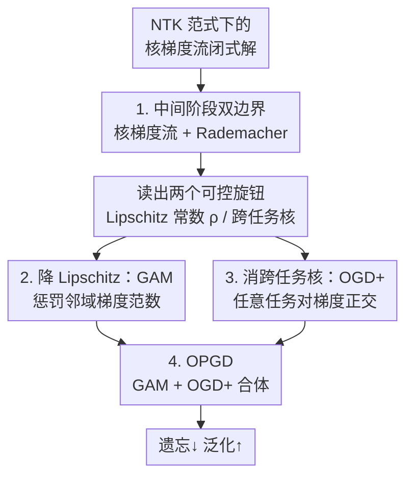

# Understanding the Dynamics of Forgetting and Generalization in Continual Learning via the Neural Tangent Kernel

**会议**: ICLR 2026  
**OpenReview**: [https://openreview.net/forum?id=NE2yIxdo1w](https://openreview.net/forum?id=NE2yIxdo1w)  
**代码**: 无  
**领域**: 持续学习理论 / 学习理论  
**关键词**: 持续学习, 神经正切核(NTK), 灾难性遗忘, 泛化界, 正交梯度下降

## 一句话总结
本文在 NTK 范式下首次刻画了持续学习"训练过程中"（而非收敛后）遗忘与泛化误差的动态上下界，证明**降低损失关于预测的 Lipschitz 常数**和**把跨任务核压到零**这两件事同时缓解遗忘、改善泛化，并据此设计出 OGD+ 与 OPGD 两个算法，在 Permuted/Rotated MNIST 与 Split CIFAR-100 上验证了理论。

## 研究背景与动机

**领域现状**：持续学习（CL）要在一串顺序到来的任务上都保持好性能，核心敌人是**灾难性遗忘**——学新任务时把旧任务的知识覆盖掉。实践上已有大量方法（正则化、回放、梯度投影），但理论解释一直滞后。

**现有痛点**：已有的 CL 理论分析有两大局限。其一，多数工作只研究**线性模型**且假设受限的数据分布（如高斯），无法覆盖更一般的网络和非平稳数据流。其二，少数基于 NTK 的分析（Bennani 2020、Doan 2021、Karakida & Akaho 2022）虽然摆脱了线性假设，却只盯着**收敛后的模型**，刻画不了训练中间阶段遗忘和泛化怎么随迭代演化。

**核心矛盾**：要给"遗忘"建界，本质上比给"泛化"建界更难。泛化界通常只需要对总体损失（population loss）给一个**上界**；但遗忘的定义是"最终模型在旧任务上的损失"减去"当初专门训练该任务得到模型的损失"的平均，里面那个减项需要总体损失的**下界**。也就是说，刻画遗忘必须同时拿到总体损失的**双边界（上界+下界）**，这在 CL 里一直没解决。

**本文目标**：分解为两个子问题——(i) 怎样刻画训练**中间阶段**（任意迭代 $t$）的遗忘与泛化，而不是只看收敛点；(ii) 怎样为每个任务的总体损失同时拿到上、下界，从而把遗忘界做出来。

**切入角度**：作者在 **NTK 范式**下工作。无限宽网络的训练动态会退化成一个**核梯度流（kernel gradient flow）**——一个关于时间 $t$ 的常微分方程，且核 $K_\tau$ 在该任务训练全程不变，还有闭式解。这把"中间阶段的模型预测"变成了 $t$ 的解析函数，可以直接对任意迭代步分析；再配合 **Rademacher 复杂度**就能给出双边界。

**核心 idea**：用核梯度流刻画中间训练动态、用 Rademacher 复杂度补出总体损失的双边界，从而把遗忘/泛化界写成显式依赖迭代数 $t_T$ 的形式；分析这些界发现两个可控旋钮——**损失的 Lipschitz 常数 $\rho$** 和**跨任务核 $K_k(X_\tau,X_k)$**——压低任意一个都同时减遗忘、增泛化，再把这两个旋钮翻译成算法 OGD+ 和 OPGD。

## 方法详解

### 整体框架

本文是一篇"理论先行、算法落地"的工作，整条线是：**先在 NTK 下把遗忘与泛化的中间阶段上界推出来（Theorem 1）→ 从界里读出两个可控因素（Lipschitz 常数、跨任务核）→ 每个因素各给一个机制（GAM 降 Lipschitz、OGD+ 消跨任务核）→ 把两者合并成最终算法 OPGD**。

设定上，有 $T$ 个顺序任务，任务 $\tau$ 的模型 $f_\tau$ 从上一个任务的收敛参数初始化（$\theta^0_{\tau+1}=\theta^*_\tau$）。用 MSE 损失，NTK 范式下任务 $\tau$ 的训练动态退化为核梯度流

$$\frac{d}{dt}f^t_\tau(x) = -\frac{1}{n_\tau}K_\tau(x,X_\tau)\big(f^t_\tau(X_\tau)-Y_\tau\big),$$

其中 $K_\tau$ 全程固定，因此这是个有闭式解的 ODE。遗忘 $F_{t_T}$ 与总体泛化误差 $G_{t_T}$ 都用**总体损失**定义（而非离散数据集或线性模型），适用于任意函数类。Theorem 1 给出二者显式依赖迭代 $t_T$ 的上界，从界的结构里抽出两个关键量：$\rho$（损失对预测的 Lipschitz 常数）和 $K_k(X_\tau,X_k)$（跨任务核）。后面的算法就是分别拧这两个旋钮。

### 关键设计

**1. 中间阶段双边界：核梯度流 + Rademacher 复杂度补出总体损失下界**

这一设计直击前面的"核心矛盾"：遗忘必须要总体损失的双边界，而旧理论要么困在收敛点、要么只有上界。作者先把遗忘 $F_{t_T}$ 和泛化 $G_{t_T}$ 都定义在总体损失上：

$$F_{t_T} = \frac{1}{T-1}\sum_{\tau=1}^{T-1}\Big(L_{D_\tau}(f^{t_T}_T) - L_{D_\tau}(f^*_\tau)\Big),\qquad G_{t_T} = \frac{1}{T}\sum_{\tau=1}^{T}L_{D_\tau}(f^{t_T}_T).$$

关键在于：NTK 范式下模型预测有闭式解 $f^t_\tau(x)=\sum_{i=1}^{\tau-1}\tilde f^*_i(x)+\tilde f^t_\tau(x)$，其中 $\tilde f^t_\tau$ 显式含一个随迭代变化的因子 $E_{\tau,t}=I-\exp(-\frac{t}{n_\tau}K_\tau(X_\tau,X_\tau))$。把它代进去，再用 **Rademacher 复杂度**把经验损失和总体损失联系起来，作者得到 Theorem 1——首个对 vanilla CL 遗忘与泛化在**任意中间迭代 $t_T$** 都成立的上界。这个界显式含 $t_T$（藏在 $E_{k,t^*_k}$ 里），所以能直接拿来分析"训练越久遗忘/泛化怎么变"，这是收敛点分析做不到的。界里出现的两类主项——含 $\rho$ 的 Rademacher 项和含 $\|K_k(X_\tau,X_k)\cdots\|$ 的跨任务项——正是后面两个旋钮的来源。

**2. 降 Lipschitz 常数：用 GAM 惩罚邻域梯度范数让损失面更平**

Theorem 1 的界里，含 $\rho$（损失对预测的 Lipschitz 常数，定义为对任意预测 $u,v$ 有 $|\ell(u,y)-\ell(v,y)|\le\rho\|u-v\|$）的项越小界越紧。Lemma 1 进一步证明：固定 $t_T$ 时，$\rho$ 越小则 $F^{upper}_{t_T}$、$G^{upper}_{t_T}$ 都越小；而且存在阈值 $\rho^*$，一旦 $\rho>\rho^*$，两个界都随迭代 $t_T$ **单调上升**（Remark 1：除非干脆不更新 $t_T=0$，那又退化成学不会新任务）。结论是非平凡的：在非 CL 场景里降 $\rho$ 主要改善泛化，而在 CL 里它**同时还减遗忘**。

落地上，作者先给出惩罚梯度范数（PGN）的训练损失 $L^{PGN}_{S_\tau}(\theta_\tau)=L_{S_\tau}(\theta_\tau)+\alpha_\tau\|\nabla_{\theta_\tau}L_{S_\tau}(\theta_\tau)\|^2$ 来近似压低 $\rho$；实践中改用 **GAM**（Gradient-norm Aware Minimization），它惩罚的是参数**邻域内**的最大梯度范数

$$L^{GAM}_{S_\tau}(\theta_\tau)=L_{S_\tau}(\theta_\tau)+\alpha_\tau b_\tau \max_{\theta'_\tau\in B(\theta_\tau,b_\tau)}\|\nabla_{\theta'_\tau}L_{S_\tau}(\theta'_\tau)\|^2,$$

因此鼓励**平坦极小值**、避开尖锐极小，比 PGN 更鲁棒。

**3. 消跨任务核：OGD+ 把任意任务对的梯度都拉成正交**

界里的第二个主项是跨任务核 $K_k(X_\tau,X_k)$，它的每个元素是两个任务样本上模型梯度的内积，度量任务间干扰——范数越大干扰越强、遗忘和泛化误差越大。理想情况是让它**全为零**，即不同任务数据上的梯度互相正交。标准 OGD（Farajtabar 2020）把当前任务梯度投影到此前所有任务子空间 $E_1\oplus\cdots\oplus E_{\tau-1}$ 的正交补上，Lemma 2 证明它能让**相邻**两任务的跨任务核归零 $\tilde K_k(X_{k-1},X_k)=0$，所以 OGD 比 SGD 界更紧。

但相邻归零还不够。作者提出 **OGD+**：把梯度子空间重定义为 $E'_k:=\mathrm{span}\{\nabla_\theta f^*_k(x^m_l)\mid l\in[k],m\in[n_l]\}$——即用当前任务模型在**此前所有任务样本**上的梯度张成子空间，投影算子 $P'_k:=P_{E'^{\perp}_{k-1}}$。Lemma 3 证明 OGD+ 能把**任意任务对** $\tau<k$ 的跨任务核都归零 $\hat K_k(X_\tau,X_k)=0$，因此界严格比 OGD 更紧。OGD 与 OGD+ 的差别在梯度的"存与放"：OGD 存"当前任务在自己数据上的梯度"并永久保留；OGD+ 存"当前任务在所有先前数据上的梯度"，但训完下一任务就**释放**。代价是 OGD+ 正交约束更强，在分布差异大的 Split CIFAR-100 上会因可行梯度子空间被压缩、**塑性（plasticity）下降**而略逊于 OGD——这正是引出 OPGD 的动机。

**4. OPGD：把"降 Lipschitz"与"消跨任务核"合体**

OGD+ 强化了跨任务正交，却忽视了任务内性能、可能损塑性；而 Lemma 4 证明：在 OGD+ 基础上再降 $\rho$，能让 $F^{upper+}_{t_T}$、$G^{upper+}_{t_T}$ 都严格更小；且当 $\rho$ 低于某阈值 $\rho'$ 时，泛化界 $G^{upper+}_{t_T}$ 随 $t_T$ **单调下降**（训得越久越好），而遗忘界 $F^{upper+}_{t_T}$ 随 $t_T$ 上升——揭示了"延长训练改善泛化、但同时加剧遗忘"的根本权衡（Remark 6）。

于是作者把两个旋钮拼成 **OPGD（Orthogonal Penalized Gradient Descent）**：每个任务每步先按 GAM 损失更新（降 $\rho$、提升任务内性能），再对得到的（已惩罚）梯度施加 OGD+ 正交投影，最后释放上一任务的存储梯度、换成当前任务在所有先前样本上的梯度。这条"理论 → 算法"的链条让 OPGD 同时享受两个机制：GAM 防尖锐极小、OGD+ 消任务干扰。

### 损失函数 / 训练策略
训练统一用 MSE 损失（NTK 分析所需）。OPGD 的单步更新（Algorithm 1）：先算 GAM 的两部分梯度 $g_1=\nabla_\theta L_{S_\tau}$ 和邻域扰动点处的 $g_2$，按 $g=(1-\alpha)g_1+\alpha g_2$ 合成；再做正交投影 $g\leftarrow g-\sum_{v\in S_\tau}\mathrm{proj}_v(g)$；最后 $\theta\leftarrow\theta-\eta g$。任务训完后，对 $S_\tau\cup M$（当前任务数据 + 记忆库）上的梯度做 Gram-Schmidt 正交化存入 $S$，并采样 $M_\tau$ 扩充记忆库 $M$。关键超参：学习率 $\eta$、平衡系数 $\alpha$、扰动半径 $b$。

## 实验关键数据

### 主实验
三个标准 CL benchmark：Permuted MNIST（15 任务）、Rotated MNIST（15 任务）、Split CIFAR-100（20 任务，每任务 5 类）。指标为平均准确率 ACC（越高泛化越好）和后向迁移 BWT（越高遗忘越少）；全部为作者复现、5 次平均。

| 方法 | PMNIST ACC | PMNIST BWT | RMNIST ACC | RMNIST BWT | CIFAR-100 ACC | CIFAR-100 BWT |
|------|-----------|-----------|-----------|-----------|---------------|---------------|
| SGD | 70.29 | −25.33 | 68.79 | −28.09 | 52.08 | −30.63 |
| GAM | 72.61 | −22.47 | 72.85 | −20.60 | 61.70 | −22.63 |
| OGD | 82.17 | −12.38 | 77.52 | −18.43 | 63.91 | −20.57 |
| OGD+ | 86.22 | −8.11 | 86.15 | −9.02 | 61.84 | −23.47 |
| **OPGD** | **86.27** | **−7.73** | **89.15** | **−3.69** | **68.17** | **−12.58** |

OPGD 在三个 benchmark 上 ACC、BWT 全面领先，平均相对增益 +4.59% ACC、+36.73% BWT。OGD+ 在两个 MNIST 上明显优于 OGD，但在分布更复杂的 Split CIFAR-100 上反而略逊于 OGD（ACC 61.84 vs 63.91），印证了"过度正交损塑性"的判断；OPGD 通过降 Lipschitz 把塑性补回来，CIFAR-100 ACC 提到 68.17。

### 消融实验
本文的"消融"由方法谱系天然构成——逐步加上每个机制看增益：

| 配置 | 机制 | CIFAR-100 ACC | 说明 |
|------|------|---------------|------|
| SGD | 无 | 52.08 | vanilla 基线 |
| GAM | 仅降 Lipschitz | 61.70 | 单独降 $\rho$ 即大涨 ~9.6% |
| OGD | 仅相邻任务正交 | 63.91 | 单独消跨任务核 |
| OGD+ | 任意任务对正交 | 61.84 | 过度正交，复杂分布下掉点 |
| OPGD | OGD+ + GAM | 68.17 | 两机制合体最优 |

### 关键发现
- **两个旋钮各自有效、合起来更强**：单独 GAM（降 $\rho$）就能把 CIFAR-100 从 52.08 拉到 61.70，单独 OGD 拉到 63.91；OPGD 把两者叠加到 68.17，验证理论里两项可控因素是互补的。
- **过度正交是把双刃剑**：OGD+ 把任意任务对都正交化，在简单同分布的 MNIST 上收益巨大（BWT 从 −18.43 改善到 −9.02），但在分布漂移大的 CIFAR-100 上反而压缩了可行梯度子空间、损塑性而掉点——这是 OPGD 存在的理由。
- **遗忘-泛化权衡可被实验看见**：Figure 1 显示 OPGD 的 ACC 随迭代稳步上升（对应 Lemma 4 中 $G$ 随 $t$ 下降），而每个任务区间内 BWT 在下降（遗忘随迭代加剧）；SGD 不控制 $\rho$ 时后期 ACC 甚至倒退，正好对应 Remark 1 的"$\rho>\rho^*$ 时界随 $t$ 单调上升"。

## 亮点与洞察
- **把"遗忘需要双边界"这个老大难拆解掉**：用 NTK 闭式解锁定中间阶段预测、再用 Rademacher 复杂度补出总体损失下界，是这篇能给出"训练中"遗忘界的关键杠杆，值得迁移到其他需要双边界的动态分析。
- **理论旋钮直接映射到现成工具**：$\rho$ ↔ GAM、跨任务核 ↔ OGD，两个抽象量都能找到已有算法对应，避免凭空造机制，"理论→算法"的链条干净利落。
- **OGD+ 对 OGD 的改法很巧**：只是把"在自己数据上的梯度、永久保留"换成"在所有先前数据上的梯度、用完即弃"，存储语义一变就把正交从"相邻任务"升级到"任意任务对"，且释放机制控住了存储开销。
- **暴露了正交方法的塑性代价**：明确指出过强正交在大分布漂移下会压缩可行子空间、损塑性，这一观察对所有梯度投影类 CL 方法都是提醒。

## 局限与展望
- **NTK/无限宽假设**：全部理论建立在 NTK 范式（无限宽、核固定、MSE 损失）上，真实有限宽网络、交叉熵损失下界是否仍成立未给保证。
- **benchmark 偏简单**：实验止于 MNIST 变体和 Split CIFAR-100，更大规模、类别更多、任务边界更模糊的现实 CL 场景未验证；ACC/BWT 之外没报告计算/显存开销，而 OGD+ 需要存"所有先前样本上的梯度"，存储成本可能不低。
- **权衡未被消解，只是被刻画**：遗忘-泛化权衡（训得久泛化好但遗忘多）依然存在，OPGD 是同时压低两条曲线而非消除权衡；如何自适应选 $\alpha$、$b$、$\rho$ 阈值仍靠调参。
- **OGD+ 在复杂分布下的退化**靠 OPGD 间接修补，但何时该用 OGD+、何时该退回 OGD 缺少自动判据。

## 相关工作与启发
- **vs Bennani et al. (2020)**：同在 NTK 下分析 CL，他们给泛化界但**没有遗忘界**、不分析训练动态；本文遗忘与泛化双界齐全且覆盖中间阶段。
- **vs Doan et al. (2021) / Karakida & Akaho (2022)**：他们有遗忘界但定义在离散数据集上、只看**收敛模型**、不含训练动态；本文用总体损失定义、刻画任意迭代 $t$。
- **vs 线性 CL 理论（Evron 2022 / Lin 2023 等）**：他们靠线性模型 + 高斯等受限分布拿到显式刻画，不适用一般模型；本文 NTK 范式摆脱分布假设、适用任意函数类。
- **vs 标准 OGD（Farajtabar 2020）**：OGD 只保证相邻任务跨任务核为零；OGD+ 改存储语义后保证任意任务对为零，界严格更紧。

## 评分
- 新颖性: ⭐⭐⭐⭐⭐ 首个 NTK 下中间阶段遗忘+泛化双边界，且把两个理论旋钮落成算法
- 实验充分度: ⭐⭐⭐ 验证了理论预测但 benchmark 偏小，缺开销/大规模分析
- 写作质量: ⭐⭐⭐⭐ 理论→算法主线清晰，Q1/Q2/Q3 递进推动好读
- 价值: ⭐⭐⭐⭐ 为梯度投影类 CL 方法提供了理论依据与改进范式

<!-- RELATED:START -->

## 相关论文

- [\[ICLR 2026\] Training-Free Determination of Network Width via Neural Tangent Kernel](training-free_determination_of_network_width_via_neural_tangent_kernel.md)
- [\[ICLR 2026\] Memory-Statistics Tradeoff in Continual Learning with Structural Regularization](memory-statistics_tradeoff_in_continual_learning_with_structural_regularization.md)
- [\[ICLR 2026\] Understanding In-Context Learning on Structured Manifolds: Bridging Attention to Kernel Methods](understanding_in-context_learning_on_structured_manifolds_bridging_attention_to_.md)
- [\[ICML 2026\] Catastrophic Forgetting is Low-Rank: A Function-Space Theory for Continual Adaptation](../../ICML2026/learning_theory/catastrophic_forgetting_is_low-rank_a_function-space_theory_for_continual_adapta.md)
- [\[ICLR 2026\] PAC-Bayes Bounds for Cumulative Loss in Continual Learning](pac-bayes_bounds_for_cumulative_loss_in_continual_learning.md)

<!-- RELATED:END -->
