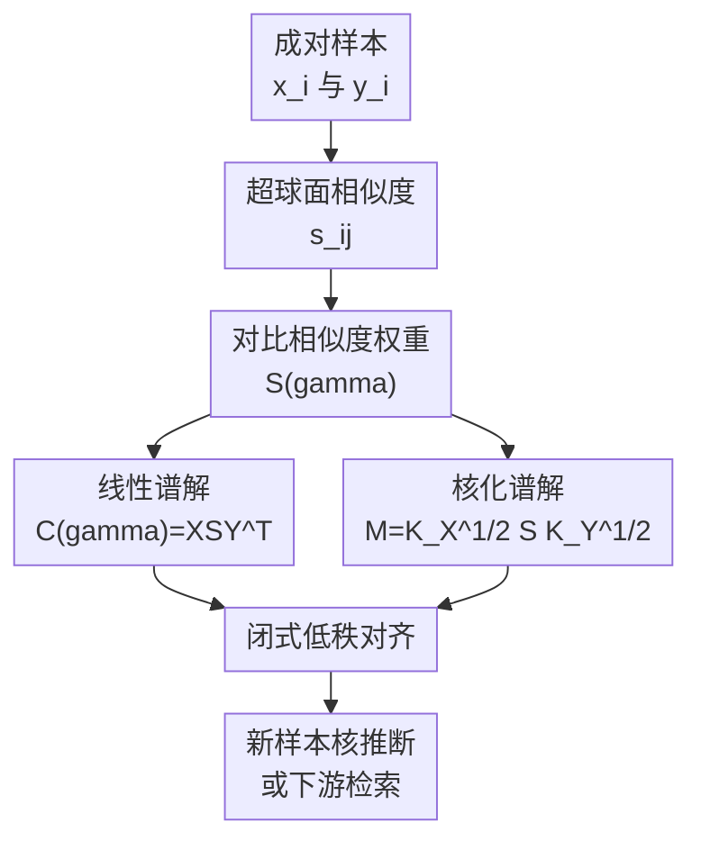

# UniCon: Unified Framework for Efficient Contrastive Alignment via Kernels

**会议**: ICLR 2026  
**OpenReview**: [https://openreview.net/forum?id=BjL4CSNJug](https://openreview.net/forum?id=BjL4CSNJug)  
**代码**: https://github.com/suihangke/UniCon.git  
**领域**: 学习理论 / 对比学习 / 多模态对齐  
**关键词**: 对比学习, 核方法, RKHS, 谱分解, 多模态对齐

## 一句话总结
UniCon 把 CLIP/InfoNCE 等对比学习目标改写成由对比相似度权重矩阵 $S(\gamma)$ 驱动的谱问题，并进一步用核方法推广到非线性编码器，从而用闭式谱更新替代长时间 SGD 训练，在多模态检索上保持甚至提升效果的同时带来数量级加速。

## 研究背景与动机
**领域现状**：对比学习已经是自监督表征学习和视觉-语言对齐的核心训练范式。CLIP、InfoNCE、Supervised Contrastive Learning 等方法都在做同一件事：把正样本对拉近，把负样本对推远，并让图像、文本或不同增强视图落到同一个表示空间里。实际系统里，这通常意味着先用深度编码器抽特征，再用 minibatch 上的对比损失反复反向传播。

**现有痛点**：这种训练方式虽然有效，但代价很重。对比损失的每一步梯度只利用当前 batch 的局部相似度结构，优化过程需要很多 epoch 才逐渐逼近稳定的对齐子空间。已有理论工作在某些线性设定下指出，对比学习和 SVD/PCA 一类谱方法之间有联系，但这些结论很难直接覆盖非线性编码器、核空间、以及一张图对应多条文本描述这类 many-to-many 对齐场景。

**核心矛盾**：对比学习表面上是一个非凸、迭代、深度网络训练问题，但它真正想恢复的是跨视图或跨模态之间的主导配对结构。如果这个主导结构能被某个矩阵算子显式表达，那么很多 SGD 步骤可能只是低效地追踪同一个低秩谱子空间。

**本文目标**：作者希望回答三个问题：第一，能否把一大类对比损失统一写成同一个可分析的目标；第二，在线性编码器下，是否可以直接给出全局闭式解；第三，在非线性编码器或冻结预训练特征的设定下，能否通过 RKHS/核方法保留这种谱求解形式。

**切入角度**：论文从相似度矩阵的梯度结构入手，不直接设计新的 contrastive loss，而是构造一个对比相似度权重矩阵 $S(\gamma)$。这个矩阵记录了正负样本对在当前损失下应该如何加权，进而把“最小化对比损失”转换成“最大化一个带正则的 trace objective”。

**核心 idea**：用 $S(\gamma)$ 把对比学习目标转成谱更新问题，再用核矩阵 $K_X, K_Y$ 把线性 SVD 解提升到 RKHS 中的非线性对齐。

## 方法详解
### 整体框架
UniCon 的整体思路不是替换 CLIP/InfoNCE 的语义目标，而是重写它的求解方式。给定成对样本 $\{(x_i,y_i)\}_{i=1}^N$，方法先在单位超球面上计算两种模态或两种视图之间的相似度 $s_{ij}$，再根据具体对比损失的导数构造 $S(\gamma)$。随后，线性情形下对 $C(\gamma)=XS(\gamma)Y^\top$ 做低秩 SVD；非线性情形下则对 $M=K_X^{1/2}S(\gamma)K_Y^{1/2}$ 做谱分解，并用得到的核系数完成训练样本和新样本的表示推断。

这条流程的关键在于：损失函数仍然可以是 CLIP/InfoNCE/triplet/SupCon 一类熟悉目标，但优化过程不再依赖长时间 SGD，而是把当前对齐问题压缩成一次或少数几次矩阵谱更新。

### 关键设计
**1. 对比相似度权重矩阵：把损失梯度翻译成可谱分解的配对结构**

普通对比学习的困难在于，不同 loss 的写法看起来差别很大：InfoNCE 有 softmax 温度，triplet loss 有 margin，SupCon 有多个正样本，CLIP 又是双向图文归一化。UniCon 先把这些目标写成统一的广义对比损失，其中 $\phi, \psi, \nu, \epsilon_{ij}$ 分别控制外层形状、相似度变换、正样本缩放和样本对是否参与损失。这样做的好处不是形式好看，而是后面可以对所有这些 loss 统一求导。

由这个统一形式出发，论文定义 $S(\gamma)$ 来收集每一对 $(x_i,y_j)$ 在梯度里的权重。直观地说，$S(\gamma)$ 的某个元素不只是“这是不是正样本”，而是“在当前 loss 和当前相似度下，这一对应该以多大强度推动表示更新”。作者证明，对比损失对编码器参数的梯度等价于负的 trace objective 梯度：$\partial L/\partial \theta_k=-\partial \operatorname{tr}(F_{\theta_1}(X)S(\gamma)F_{\theta_2}(Y)^\top)/\partial \theta_k+\partial R/\partial \theta_k$。这一步是整篇论文的桥，因为它把一个看似只能迭代优化的 loss 变成了一个可由矩阵结构支配的问题。

**2. 线性谱解：用加权跨模态协方差替代长时间 SGD**

在线性编码器 $f_{\theta_1}(x)=F_1x, f_{\theta_2}(y)=F_2y$ 下，trace objective 的核心矩阵变成 $C(\gamma)=XS(\gamma)Y^\top$。它可以理解为一张加权跨模态协方差表：正样本、负样本、多正样本以及具体 loss 的导数，都已经被 $S(\gamma)$ 吸收进去。优化目标因此变成最大化 $\operatorname{tr}(F_1C(\gamma)F_2^\top)$，同时用 $\rho \lVert F_1^\top F_2\rVert_F^2/2$ 控制解的规模。

论文给出的结论很直接：最优的 $F_1^\top F_2$ 由 $C(\gamma)$ 的前 $r$ 个奇异方向决定，即 $F_1^\top F_2=\frac{1}{\rho}\sum_{i=1}^r\sigma_i u_i v_i^\top$。这说明 SGD 在对比损失上反复走的小步，在线性设定下本质上是在追踪 $C(\gamma)$ 的主导奇异子空间。UniCon 的做法是直接计算这个子空间，所以在合成线性实验里能用约 $0.02$ 秒达到 $100\%$ matching accuracy，而 SGD-CLIP 需要数百个 epoch 才到同一水平。

**3. 核化 RKHS 解：让非线性对齐仍然保留闭式谱结构**

现实中的视觉-文本关系通常不是线性投影能完全解释的，尤其当输入是冻结 ResNet、SBERT 或 CLIP 特征时，剩下的对齐关系仍可能带有明显非线性。UniCon 的处理方式是把编码函数放到两个 RKHS 中，用 representer theorem 写成 $f_{\theta_1}^{(a)}(\cdot)=\sum_i A_{ia}k_X(x_i,\cdot)$ 和 $f_{\theta_2}^{(a)}(\cdot)=\sum_j B_{ja}k_Y(y_j,\cdot)$。此时训练样本上的表示只依赖 Gram 矩阵 $K_X,K_Y$ 和系数 $A,B$。

在这个表示下，原来的 trace 项变成 $\operatorname{tr}(A^\top K_XS(\gamma)K_YB)$，核心谱对象则是 $M=K_X^{1/2}S(\gamma)K_Y^{1/2}$。对 $M$ 做前 $r$ 阶 SVD 后，就得到核空间里的最佳低秩对齐关系。新样本 $x_*,y_*$ 不需要重新训练，只要构造与训练样本的核相似向量 $\kappa_X(x_*),\kappa_Y(y_*)$，再用 $f_{\theta_1}(x_*)=A^{*\top}\kappa_X(x_*)$、$f_{\theta_2}(y_*)=B^{*\top}\kappa_Y(y_*)$ 推断表示即可。论文实验中使用角核，强调它在速度和准确率之间比较稳。

**4. Many-to-many 与批聚合：把理论解接到真实检索数据上**

图文数据并不总是一图一文。MSCOCO 中一张图常有五条 caption，监督对比学习中一个类别也有多个正样本。UniCon 在定义广义损失时就引入 $P_X(i)$ 和 $P_Y(j)$，让一个 anchor 可以对应多个正样本集合，而不是把所有非对角项都简单当作负样本。这让 $S(\gamma)$ 能同时覆盖 one-to-one CLIP 对齐和 many-to-many SupCon/多 caption 检索。

另一个现实问题是规模。完整 $N\times N$ 的核矩阵和权重矩阵在大数据上会很贵，所以论文采用 batch-level 的 $S^{(b)}(\gamma)$，再把多个 batch 的闭式解做质量加权聚合。对病态或奇异的 Gram 矩阵，方法用 Tikhonov 正则把 $K$ 替换为 $K+\lambda I$，并建议随机 SVD 或 Nyström 近似降低内存和时间。这里的取舍很清楚：UniCon 的理论最优性依赖静态输入空间，而大规模实现需要用批聚合近似这个全局谱算子。

### 损失函数 / 训练策略
UniCon 覆盖的不是单个 loss，而是一族对比损失。统一形式里，样本相似度先通过 $\psi(s_{ij}-\nu s_{ik})$ 比较负样本和正样本，再由 $\phi(\cdot)$ 聚合；不同选择可以恢复 CLIP/InfoNCE、triplet loss 和 many-to-many SupCon。方法真正训练的对象不是传统神经网络参数的连续小步更新，而是由 $S(\gamma)$ 诱导的低秩谱解。

线性设定的训练策略是构造 $C(\gamma)$ 并取前 $r$ 个奇异值/向量。核化设定中，先计算两侧核矩阵，形成 $M=K_X^{1/2}S(\gamma)K_Y^{1/2}$，再做 rank-$r$ SVD，得到 $A^*,B^*$ 或它们的乘积关系。实践中如果输入空间来自冻结特征提取器，UniCon 就是在固定特征上一次性学习对齐子空间；如果输入编码器还会继续 finetune，那么每次谱更新只是在当前编码器输出上的条件最优子问题。

## 实验关键数据

### 主实验
论文从合成数据、CIFAR-10 单模态增强视图对齐、Flickr30k 图文检索、MSCOCO 检索与零样本迁移几个层面验证 UniCon。最重要的结论不是“所有指标无条件碾压”，而是它在相近或更高准确率下显著缩短训练时间，尤其在冻结特征的图文检索场景中非常明显。

| 设置 | 方法 | 训练时间 | 关键指标 | 结论 |
|------|------|----------|----------|------|
| 线性合成跨模态匹配 | SGD-CLIP | 0.32 s / 400 epochs | 100% matching accuracy | 能收敛，但需要迭代 |
| 线性合成跨模态匹配 | UniCon | 0.02 s | 100% matching accuracy | 一次谱更新达到同等匹配 |
| 非线性合成匹配 | SGD-CLIP | 0.65 s / 500 epochs | 84% matching accuracy | MLP 反向传播较慢 |
| 非线性合成匹配 | UniCon | 0.04 s / 2 epochs | 86% matching accuracy | 更快且略高 |
| CIFAR-10 增强视图对齐 | SGD-CLIP | 41.98 s | 62.21% linear probe accuracy | 单模态效果略高 |
| CIFAR-10 增强视图对齐 | UniCon | 23.38 s | 61.82% linear probe accuracy | 速度更快，准确率接近 |

Flickr30k 上，UniCon 在更强的冻结特征上收益尤其明显。RN-18+SBERT 时，图到文 R@1 低于 SGD-CLIP，但文到图和平均 R@10 更高；RN-50+SBERT 与 CLIP ViT-B/32 时，UniCon 同时提升准确率和速度。

| Backbone | 方法 | 训练时间 | 平均 R@1 | 平均 R@10 | 主要观察 |
|----------|------|----------|----------|-----------|----------|
| RN-18 + SBERT | SGD-CLIP | 45.6 s | 0.042 | 0.219 | 弱特征下常规 SGD 稳定 |
| RN-18 + SBERT | UniCon | 1.7 s | 0.054 | 0.253 | 平均检索更好，约 27× 加速 |
| RN-50 + SBERT | SGD-CLIP | 45.0 s | 0.042 | 0.219 | 与 RN-18 baseline 表现相近 |
| RN-50 + SBERT | UniCon | 0.81 s | 0.161 | 0.515 | 谱解明显挖出更强跨模态结构 |
| CLIP ViT-B/32 | SGD-CLIP | 45.3 s | 0.236 | 0.597 | 预训练特征已很强 |
| CLIP ViT-B/32 | UniCon | 0.76 s | 0.353 | 0.701 | 准确率更高且约 60× 加速 |

### 消融实验
论文没有用传统“移除模块 A/B”的形式组织大量消融，而是通过设定变化、数据效率和跨数据集迁移来分析方法性质。下面表格把最能说明机制的实验整理成对照。

| 配置 | 关键指标 | 说明 |
|------|----------|------|
| 线性 UniCon | 0.02 s 达到 100% matching accuracy | 验证线性理论中的 $C(\gamma)$ 谱解可以替代长时间 SGD |
| 非线性 UniCon | 0.04 s 达到 86% matching accuracy | 验证核化后仍能处理非线性潜变量变换 |
| CIFAR-10 UniCon | 61.82% / 23.38 s | 单模态增强视图对齐中，速度优于 SGD，准确率只低 0.39 个百分点 |
| MSCOCO RN-50+SBERT UniCon | 11.11 s，I→T R@10=0.388，T→I R@10=0.439 | 相比 SGD-CLIP 的 5121.72 s，约 461× 加速且指标更高 |
| MSCOCO CLIP ViT-B/32 UniCon | 11.15 s，I→T R@10=0.685，T→I R@10=0.644 | 相比 1066.60 s 的 SGD-CLIP，约 96× 加速 |
| 仅 200 张 MSCOCO 图像 | 平均 R@10=66.45% | 说明对齐子空间可能不需要完整数据集才能被粗略恢复 |

MSCOCO 训练并迁移到 Flickr30k 的结果也支持“谱子空间具有可迁移结构”这个判断。用 CLIP ViT-B/32 特征训练时，UniCon 在 Flickr30k zero-shot 上达到 I→T R@5=0.808、R@10=0.879，T→I R@5=0.766、R@10=0.848；这不是简单训练更久能解释的，因为 UniCon 的训练时间只有约 11 秒。

### 关键发现
- UniCon 的最大贡献是训练效率：在 MSCOCO 上报告了约 96× 到 461× 的加速，并且不是用明显牺牲准确率换来的。
- 线性与非线性合成实验分别对应理论里的 $C(\gamma)$ 和 $M$，说明论文不是只做经验 trick，而是在验证“对比学习约等于低秩谱发现”这条主线。
- 在冻结强特征上，UniCon 的优势更明显。CLIP ViT-B/32 已经提供高质量图文特征，UniCon 只需恢复残余对齐子空间，就能提升 Flickr30k 和 MSCOCO 检索指标。
- CIFAR-10 上 UniCon 准确率略低于 SGD-CLIP，说明闭式谱更新不是在所有单模态分类代理任务上都严格更强；它的主要优势更像是快速找到对齐结构，而不是替代所有表征学习细节。

## 亮点与洞察
- UniCon 把“训练一个 contrastive model”重解释为“发现一个 rank-$r$ 对齐子空间”。这个视角很有价值，因为它解释了为什么对比学习常常学到类似 PCA/SVD 的全局结构，也解释了为什么冻结特征上的对齐可以非常快。
- $S(\gamma)$ 是一个很巧的中间对象。它不依赖某个特定 loss，而是通过 loss 的导数把 CLIP、InfoNCE、triplet、SupCon 等目标放进同一个矩阵权重框架里。
- 核化部分让论文不止停留在线性理论。通过 $K_X^{1/2}S(\gamma)K_Y^{1/2}$，作者把非线性编码器和 RKHS 表示接到同一个 SVD 解法上，这比单纯说“线性情况下可解”更有延展性。
- 对多模态系统而言，这篇论文暗示了一种实用路线：对于已经很强的冻结图像/文本编码器，不一定总要重新做长时间 contrastive finetuning，可以先尝试谱式对齐或作为 warm start。

## 局限与展望
- 理论最干净的结论依赖静态输入空间。若视觉和文本编码器本身也在训练，UniCon 的谱更新只是当前特征下的条件最优解，不能直接保证整个深度网络端到端全局最优。
- 核矩阵和 $S(\gamma)$ 的规模仍然可能成为瓶颈。论文提出 batch aggregation、随机 SVD、Nyström 和 Tikhonov 正则，但这些近似会带来新的超参数与估计误差。
- 实验主要集中在冻结特征、检索和线性 probing。对于真正大规模 CLIP 预训练、长尾噪声图文对、以及动态数据流，UniCon 是否还能稳定保持同样级别的加速，需要更大规模验证。
- $S(\gamma)$ 的构造依赖当前相似度和 loss 导数，当初始特征质量很差或 batch 中正负样本关系噪声很大时，谱更新可能会快速放大错误结构。未来可以结合鲁棒权重、hard negative 过滤或分布漂移感知的 batch selection。

## 相关工作与启发
- **vs CLIP / InfoNCE**: CLIP 和 InfoNCE 定义了图文或视图之间的对比目标，通常用 SGD 优化；UniCon 保留这类目标的配对语义，但把求解过程改成由 $S(\gamma)$ 驱动的谱更新，优势是训练速度和理论可解释性。
- **vs Nakada et al. 2023 的线性 SVD 分析**: 既有工作指出线性多模态对比学习与加权协方差 SVD 有关；UniCon 扩展了这个方向，加入 many-to-many 对齐、保留更一般的对比损失权重，并进一步用 RKHS 推到非线性设定。
- **vs kernel alignment / spectral embedding**: 传统核方法擅长用 Gram 矩阵刻画样本相对结构，但未必直接处理现代 CLIP-style contrastive loss；UniCon 的启发在于把 loss 的梯度权重嵌入核算子，使核谱分解服务于对比对齐。
- **vs 常规参数高效微调**: LoRA、adapter 或 projection head finetuning 仍依赖反向传播；UniCon 更像是一种解析式对齐层或 warm-start 模块，可用于冻结 backbone 后的快速跨模态校准。

## 评分
- 新颖性: ⭐⭐⭐⭐⭐ 用 $S(\gamma)$ 统一对比损失并连接线性/核化谱解，理论视角清晰且有辨识度。
- 实验充分度: ⭐⭐⭐⭐ 覆盖合成、单模态和多模态检索，并有速度对比；但大规模端到端预训练和噪声数据实验还不够。
- 写作质量: ⭐⭐⭐⭐ 主线明确，公式较密集但逻辑完整；部分实现细节和消融组织还可以更系统。
- 价值: ⭐⭐⭐⭐⭐ 对学习理论、对比学习效率、多模态冻结特征对齐都有启发，尤其适合作为谱式 warm start 或快速检索适配方法。

<!-- RELATED:START -->

## 相关论文

- [\[ICLR 2026\] "Noisier" Noise Contrastive Estimation is (Almost) Maximum Likelihood](noisier_noise_contrastive_estimation_is_almost_maximum_likelihood.md)
- [\[ICLR 2026\] On the Computational Limits of AI4S-RL：A Unified $\varepsilon$-$N$ Analysis](on_the_computational_limits_of_ai4s-rl_a_unified_varepsilon-n_analysis.md)
- [\[ICLR 2026\] Pretrain–Test Task Alignment Governs Generalization in In-Context Learning](pretraintest_task_alignment_governs_generalization_in_in-context_learning.md)
- [\[ICLR 2026\] Enabling Fine-Tuning of Direct Feedback Alignment via Feedback-Weight Matching](enabling_fine-tuning_of_direct_feedback_alignment_via_feedback-weight_matching.md)
- [\[ICLR 2026\] Efficient Turing Machine Simulation with Transformers](efficient_turing_machine_simulation_with_transformers.md)

<!-- RELATED:END -->
