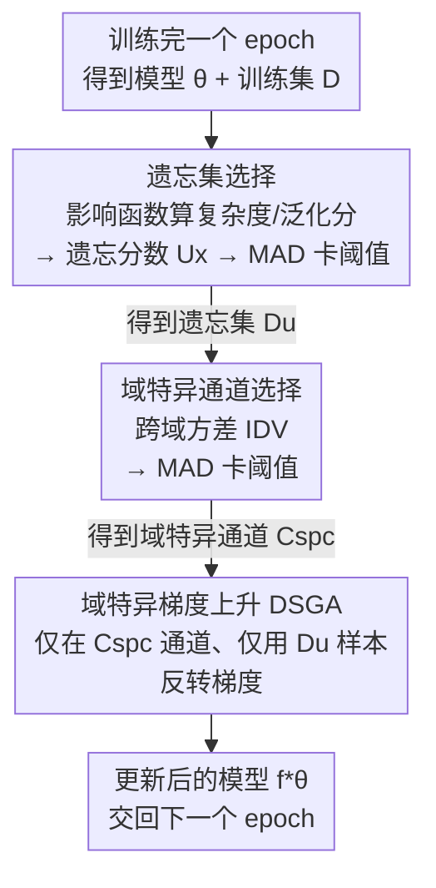

# Unlearning During Training: Domain-Specific Gradient Ascent for Domain Generalization

**会议**: ICLR 2026  
**OpenReview**: [https://openreview.net/forum?id=9ufS5Jl0O0](https://openreview.net/forum?id=9ufS5Jl0O0)  
**领域**: 域泛化 / 泛化理论 / 机器遗忘  
**关键词**: 域泛化, 机器遗忘, 影响函数, 域特异通道, 梯度上升

## 一句话总结
本文提出 Identify and Unlearn (IU)：一个模型无关的"训练中遗忘"模块，每个 epoch 结束后用影响函数挑出"徒增模型复杂度却几乎不提升泛化"的训练样本，用跨域方差 (IDV) 精确定位捕获域特异特征的通道，再对这些通道在这些样本上做梯度上升 (DSGA)，从而在保留域不变特征的前提下抹除域特异依赖，在 7 个基准、15+ 个 DG baseline 上平均涨点最高 3.0%。

## 研究背景与动机

**领域现状**：域泛化 (Domain Generalization, DG) 想让模型只在多个有标注的源域上训练，就能泛化到训练时完全没见过的目标域，避免域适应 (DA/UDA) 那种"必须拿到目标域数据"的限制。主流做法分三类：数据增强、表示学习（学域不变特征）、训练策略（meta-learning / 集成 / 课程学习等）。

**现有痛点**：这些方法本质都是在**训练目标里加约束**，试图从一开始就阻止模型学到域特异特征。但它们都缺一个"事后纠错"的机制——一旦模型在训练途中**已经**捕获了某些域特异特征，这些方法没有任何手段把它们再删掉。

**核心矛盾**：域特异依赖不是一次性产生的，而是在训练的不同阶段**动态涌现**的。只在训练目标上做文章，等于"只设防、不排查"，无法应对中途才冒出来的偏置。这就需要一个**持续运行、自适应纠正**的过程。

**本文目标**：设计一个机制，能够（i）识别出"正在引入域特异偏置"的训练样本，（ii）定位承载域特异特征的通道，（iii）只抹掉这些样本在这些通道上的影响，同时保住域不变特征。

**切入角度**：作者借两条已有原理——影响函数（Koh & Liang, 2017，能估单个样本对参数/验证性能的影响）和"复杂度更低的模型泛化更好"（即在训练表现相当时，让模型变复杂却不帮泛化的样本，大概率是在喂域特异偏置）。把机器遗忘 (Machine Unlearning) 这个原本用于"删数据满足隐私请求"的工具，第一次借来当作**提升 DG 泛化**的手段。

**核心 idea**：把"遗忘"塞进训练循环——每个 epoch 后挑出"高复杂度、低泛化贡献"的样本，只在域特异通道上对它们做梯度上升（即反向优化、主动遗忘），选择性地把域特异特征"忘掉"。

## 方法详解

### 整体框架

IU 是一个挂在任意 DG baseline 上的**后置模块**：正常训练完一个 epoch 后，它插进来跑一轮"识别 + 遗忘"，再把更新后的模型交回去继续下一个 epoch。一轮 post-epoch 干预由三步串成：先用影响函数算出每个样本的遗忘分数、用 MAD 阈值卡出"遗忘集" $D_u$；再用跨域方差 IDV 算出每个通道的域特异程度、同样用 MAD 卡出"域特异通道集" $C_{spc}$；最后只在 $C_{spc}$ 这些通道、只用 $D_u$ 这些样本做梯度上升，得到去除了域特异依赖的新模型 $f^*_\theta$。

整个 IU 不改 baseline 的训练目标、不引入新网络结构，纯粹是"训练间隙的一次外科手术"，因此天然 model-agnostic。

### 关键设计

**1. 遗忘分数 (Unlearning Score)：用影响函数挑出"添乱"的样本**

要"事后纠错"，第一步得知道纠谁——哪些样本在偷偷往模型里塞域特异偏置。作者把这件事量化成两个基于影响函数的分数。**复杂度分数** $C_x$ 衡量"删掉样本 $x$ 会让参数变化多大"，用参数改变量的 $\ell_2$ 范数表示：$C_x = \lVert -H_\theta^{-1}\nabla_\theta L(x,\theta)\rVert_2$，其中 $H_\theta^{-1}$ 是逆 Hessian。$C_x$ 越大，说明这个样本对模型复杂度的影响越大。**泛化分数** $G_x$ 衡量样本 $x$ 对整个验证集 $D_{val}$ 性能的正向贡献：$G_x = \sum_{z\in D_{val}} -\nabla_\theta L(z,\theta)^T H_\theta^{-1}\nabla_\theta L(x,\theta)$。

两者合成总的遗忘分数 $U_x = (G_x)^\alpha / C_x$。$U_x$ 越**低**，意味着这个样本"几乎不帮泛化、却大幅推高复杂度"——正是该被遗忘的候选。指数 $\alpha$ 用来缓解作者所谓的 Score Equivalence Bias：没有它时，泛化分和复杂度分差异很大的两个样本可能拿到相同的 $U_x$，削弱筛选区分度。阈值用 MAD（中位数绝对偏差）卡：$\tau_U = \tilde{U}_x - k\cdot\text{median}(|U_{x_i}-\tilde{U}_x|)$，分数低于 $\tau_U$ 的进入遗忘集 $D_u$。选 MAD 而非均值绝对偏差，是因为它不假设具体分布、对离群点更鲁棒，全程固定 $k=2$。

**2. 跨域方差 IDV：精确分辨哪些通道是"域特异"的**

光挑出样本还不够——如果对这些样本"全盘遗忘"，会把宝贵的域不变特征也一起抹掉。所以得先锁定**只承载域特异特征的通道**，手术刀才下得准。已有方法用 Aggregated Variance (AV)，即把所有源域的激活混在一起算总方差，隐含假设"域特异通道在全数据上方差大"。这个假设有两个硬伤：一是对域不平衡极敏感，主导域会绑架统计量；二是它捕的主要是**域内**离散度而非**域间**差异，会系统性误判。论文给的反例很形象：一个对毛发边缘敏感的纹理通道，在照片（真实毛发）、卡通（粗描边）、油画（笔触）、素描（轮廓线）里**每个域内方差都很高**，AV 会给它高分、误判成域特异，但它其实跨域行为一致、是域不变的。

IDV 换了个更对的定义：一个通道是域特异的，当且仅当它的**域内方差在各源域之间差异很大**。形式上 $\text{IDV}(c) = \text{Variance}\big(\{v_c^{(d)}\}_{d=1}^N\big)$，其中 $v_c^{(d)} = \frac{1}{N_d}\sum_i (x_{c}^{(d,i)} - \mu_c^{(d)})^2$ 是通道 $c$ 在域 $d$ 内的激活方差。即"先算每个域内的方差，再算这些方差跨域的方差"。它把每个域当独立分析单元、且与域大小无关，所以既 domain-aware 又 domain-size agnostic，天然抗域不平衡，也不会把"全局都吵"的噪声通道误当成真正的域特异通道。同样用 MAD 阈值，IDV 超阈值的通道进入 $C_{spc}$。

**3. 域特异梯度上升 (DSGA)：只在该忘的地方反转梯度**

有了遗忘集 $D_u$ 和域特异通道 $C_{spc}$，最后一步是真正"遗忘"。DSGA 只对域特异通道的参数 $\theta_c$、只用 $D_u$ 里的样本做**梯度上升**（注意是加号，与常规下降相反）：$\theta_c = \theta_c + \nabla_{\theta_c} L(x,\theta),\ x\in D_u,\ c\in C_{spc}$。直觉是：对这些"添乱样本"主动升高损失，等于把模型在域特异通道上的预测信心打散。作者还配了理论分析支撑：把表示拆成域不变 $f_{inv}$ 和域特异 $f_{spc}$ 两部分、参数对应拆成 $\theta_{inv}$ 与 $\theta_{spc}$，证明只更新 $\theta_{spc}$ 的梯度上升会增大条件熵 $H(y\mid f_{spc})$，从而降低互信息 $D_{spc}=I(y;f_{spc})$（模型对域特异特征的依赖↓）；而 $\theta_{inv}$ 不动，$D_{inv}$ 基本不变。这正是"选择性遗忘"的关键——只削域特异依赖，保住域不变依赖。

### 损失函数 / 训练策略
IU 不改 baseline 的主训练损失，只在每个 epoch 后插入一次基于影响函数的样本/通道筛选 + DSGA 更新。一个可选增强是对遗忘分数做 EMA（指数滑动平均）平滑，记作下标 $\text{IUE}$：跨 epoch 平滑 $U_x$ 的轨迹，降噪、拉开样本间区分度，让遗忘集选得更稳更准。

## 实验关键数据

### 主实验
在 DomainBed 协议下评测 7 个基准（PACS / OfficeHome / VLCS / Terra Incognita / DomainNet / Digits-DG / NICO++），采用 leave-one-domain-out，把 IU/IUE 挂到 15+ 个不同范式的 DG baseline 上。下表节选几个代表 baseline 的平均准确率（%）：

| 基准 | ERM | ERM$_{IU}$ | ERM$_{IUE}$ | MMD | MMD$_{IUE}$ | EFDMix | EFDMix$_{IUE}$ |
|------|-----|-----------|------------|-----|------------|--------|---------------|
| PACS | 83.0 | 85.7 | 86.0 | 83.2 | 84.9 | 84.6 | 86.6 |
| OfficeHome | 68.2 | 69.8 | 70.0 | 67.7 | 70.4 | 71.2 | 73.1 |
| VLCS | 77.2 | 80.0 | 80.6 | 77.2 | 80.7 | 78.3 | 80.1 |
| Terra | 41.7 | 44.2 | 44.5 | 46.6 | 48.9 | 49.9 | 51.5 |
| DomainNet | 40.7 | 42.2 | 43.1 | 31.7 | 34.6 | 44.2 | 45.6 |
| Digits | 79.4 | 82.1 | 82.9 | 79.9 | 81.9 | 82.1 | 84.3 |
| NICO++ | 79.8 | 81.2 | 81.5 | 80.2 | 83.0 | 82.6 | 84.8 |

三点观察：(1) 不论 baseline 属于哪一范式，挂上 IU 后全部涨点，印证其 model-agnostic 与"事后遗忘域特异特征"的有效性；(2) EMA 平滑（IUE）在 IU 基础上再稳定提升；(3) 连 UDIM、VL2V 这类已在标准基准上接近饱和的强 baseline，IU 也能挤出温和但一致的增益。

### 消融实验
拆开 IU 的两个组件——遗忘集选择 (USS) 与域特异通道选择 (DSCS)：

| 配置 | PACS | OfficeHome | VLCS | Terra | DomainNet | 说明 |
|------|------|-----------|------|-------|-----------|------|
| ERM | 83.0 | 68.2 | 77.2 | 41.7 | 40.7 | 基线 |
| ERM$_{USS}$ | 78.9 | 64.3 | 72.6 | 37.6 | 37.4 | 只有 USS：对遗忘集全参数反梯度 |
| ERM$_{DSCS}$ | 76.7 | 62.5 | 70.4 | 36.3 | 34.6 | 只有 DSCS：对全训练集在域特异通道反梯度 |
| ERM$_{IU}$ | 85.7 | 69.8 | 80.0 | 44.2 | 42.2 | 两者结合（完整 IU） |

### 关键发现
- **两个组件必须配合，单独用都掉点**：只做 USS（全参数反梯度）会连域不变知识一起删掉，PACS 从 83.0 掉到 78.9；只做 DSCS（全训练集都在域特异通道反梯度）会过度简化、削弱表示能力，掉得更狠到 76.7。两者结合才把性能从 83.0 抬到 85.7——说明"挑对样本"和"挑对通道"是互补的，缺一不可。
- **IDV 的判别信号呈双峰长尾**：绝大多数通道 IDV 值很低（域不变），一小撮形成高值长尾（域特异），这种清晰的双峰让 MAD 阈值能干净地切出域特异通道。
- **EMA 让遗忘分数更可分**：跨 epoch 平滑后，不同样本的分数轨迹更平滑、分布更展开，信噪比提升、离群影响样本更突出，因此 IUE 普遍优于 IU。

## 亮点与洞察
- **把"机器遗忘"从隐私工具迁成泛化工具**：传统 MU 是为删数据满足隐私请求，本文把同一套"主动遗忘"机制重定向到"删域特异特征以提升 OOD 泛化"，是一个很漂亮的换用场景——这个迁移思路（遗忘不该被记住的东西）可以推广到去偏、抗捷径学习等任务。
- **IDV 的"方差的方差"定义很巧**：用一句"域内方差在域间是否差异大"就绕开了 AV 把域内离散度误当域间差异的坑，且天然抗域不平衡。这个"先组内统计、再组间求方差"的模式可复用到任何需要分辨"组特异 vs 组共性"的特征筛选场景。
- **训练中持续干预而非一次性后处理**：把遗忘做成 per-epoch 的循环，对应了"域特异依赖动态涌现"的观察，比训练完再修一刀更贴合问题本质。

## 局限与展望
- **依赖影响函数与逆 Hessian**：$C_x$、$G_x$ 都要算 $H_\theta^{-1}$，在大模型上精确计算代价高，实际多用近似，近似误差会传导到遗忘集质量（论文正文未详述其近似与开销，⚠️ 以原文附录为准）。
- **理论分析建立在强假设上**：Theorem 1 依赖"表示可干净拆成域不变/域特异、参数也对应解耦"这一理想化前提，真实网络里两者并非如此可分，$\theta_{inv}$ 完全不受影响只是近似。
- **超参与阈值敏感性**：$\alpha$、MAD 的 $k$、域特异通道阈值都需设定；论文固定 $k=2$、把 $\alpha$ 的敏感性放进附录，主文对调参鲁棒性的覆盖有限。
- **改进方向**：把 IDV 从"通道级"细化到更细粒度的特征子空间，或把遗忘频率自适应到"域特异依赖涌现"的实际节奏（而非每 epoch 固定一次），可能进一步提效。

## 相关工作与启发
- **vs 表示学习类 DG（特征对齐 / 对抗 / IRM）**：它们在训练目标里**预防**模型学域特异特征；IU 是事后**纠错**，挂在它们之上做增量遗忘，因此能和这类方法叠加涨点而非互斥。
- **vs Aggregated Variance (AV) 通道筛选**：AV 用跨样本池化的总方差找域特异通道，对域不平衡敏感、易把域不变的纹理通道误判；IDV 用跨域的"方差的方差"，domain-aware 且 domain-size agnostic，定位更准。
- **vs 传统机器遗忘 (MU)**：传统 MU 目标是"为隐私/安全忘掉特定数据点"；本文的目标是"选择性忘掉妨碍泛化的域特异特征"，是把 MU 第一次用于增强 DG，问题设定根本不同。

## 评分
- 新颖性: ⭐⭐⭐⭐⭐ 首次把机器遗忘当作 DG 工具，IDV 的"方差的方差"定义和 per-epoch 选择性梯度上升都有原创性。
- 实验充分度: ⭐⭐⭐⭐⭐ 7 个基准 × 15+ baseline 全面涨点，消融清楚拆出 USS/DSCS 的互补性。
- 写作质量: ⭐⭐⭐⭐ 动机递进清晰、图例（毛发通道反例）很有说服力，理论部分假设偏强但表述完整。
- 价值: ⭐⭐⭐⭐ model-agnostic 即插即用，能给已饱和的强 baseline 再挤出增益，实用性高。

<!-- RELATED:START -->

## 相关论文

- [\[NeurIPS 2025\] How Many Domains Suffice for Domain Generalization? A Tight Characterization via the Domain Shattering Dimension](../../NeurIPS2025/learning_theory/how_many_domains_suffice_for_domain_generalization_a_tight_characterization_via_.md)
- [\[ICLR 2026\] A Theoretical Analysis of Mamba's Training Dynamics: Filtering Relevant Features for Generalization in State Space Models](a_theoretical_analysis_of_mambas_training_dynamics_filtering_relevant_features_f.md)
- [\[ICML 2026\] Semi-Supervised Noise Adaptation: Transferring Knowledge from Noise Domain](../../ICML2026/learning_theory/semi-supervised_noise_adaptation_transferring_knowledge_from_noise_domain.md)
- [\[ICLR 2026\] Memorizing Long-tail Data Can Help Generalization Through Composition](memorizing_long-tail_data_can_help_generalization_through_composition.md)
- [\[ICLR 2026\] Gradient Descent Dynamics of Rank-One Matrix Denoising](gradient_descent_dynamics_of_rank-one_matrix_denoising.md)

<!-- RELATED:END -->
