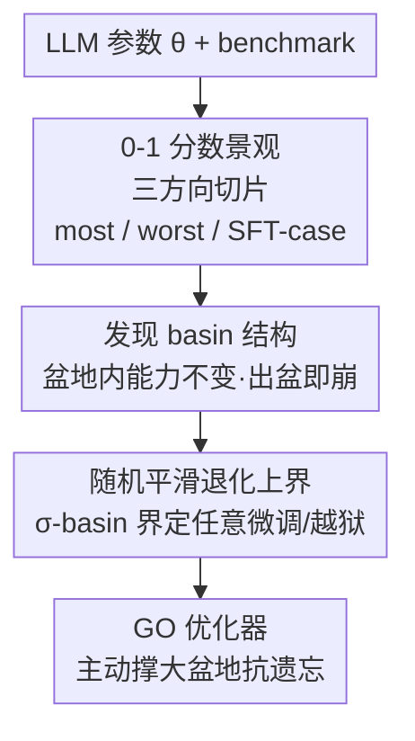

# Unveiling the Basin-like Loss Landscape in Large Language Models

**会议**: ICLR 2026  
**OpenReview**: [https://openreview.net/forum?id=l4q2Zk2yfk](https://openreview.net/forum?id=l4q2Zk2yfk)  
**领域**: 学习理论 / 损失景观 / LLM 安全  
**关键词**: 损失景观, basin, 随机平滑, 灾难性遗忘, 对齐脆弱性

## 一句话总结
本文发现 LLM 的损失景观随模型规模增大而呈现出一片片"盆地（basin）"——盆地内任意扰动参数性能几乎不变、出了盆地能力骤崩；据此用随机平滑（randomized smoothing）证明任意微调/越狱造成的能力退化都被盆地半径所界定，并提出 GO 优化器主动把盆地撑大来缓解灾难性遗忘。

## 研究背景与动机

**领域现状**：LLM 普遍走"预训练 → 多阶段对齐（安全、数学、代码）"的范式。人们一直困惑于对齐的脆弱性：为什么用看似无害（benign）的数据继续微调，有时会破坏先前对齐获得的能力？为什么只用十几条对抗样本微调几步，就能让整个安全护栏崩塌？为什么白盒下 LLM 又特别容易被越狱（jailbreak）？

**现有痛点**：这三个现象通常被分开解释（分别归因于分布漂移、浅层对齐、输入空间攻击），缺一个统一的几何框架把它们串起来。早期工作（Li et al. 2018）研究的是小模型在**似然（likelihood）**上的平滑损失景观，无法直接刻画"能力是否稳定"这件离散的事。

**核心矛盾**：似然平滑 ≠ 能力稳定。模型在某个方向上似然缓慢变化，但 benchmark 上的"答对/答错"可能是个 0-1 的硬跳变。要解释"能力为什么会塌"，必须在**任务成功率（0-1 score）**定义的景观上看，而不是在似然面上看。

**本文目标**：(1) 找到一个能直接刻画能力稳定性的损失景观；(2) 在其上解释 benign 微调、对抗微调、越狱三类脆弱性；(3) 给出可证明的退化上界并据此设计抗遗忘的训练方法。

**切入角度**：把损失定义成"benchmark 是否答对/越狱是否被防住"的 0-1 翻转值，再沿随机方向（most-case）、最坏方向（worst-case）、真实微调方向（SFT-case）三种方向切片观察。作者观察到：随机方向上几乎都是平的，存在一片"盆地"；最坏方向上则是悬崖。

**核心 idea**：LLM 的能力被关在一片片**盆地**里——盆地越大越抗遗忘、越抗越狱；而 benign 微调若停留在盆地内就不损能力，对抗微调则恰好沿最坏方向走出盆地。"放大盆地"即可同时缓解三类问题。

## 方法详解

### 整体框架

本文不是一个"训练 pipeline"，而是一条**从观测到理论再到优化**的研究链：先用 0-1 benchmark 分数定义损失景观，在三类方向（most/worst/SFT-case）上切片，发现并刻画 basin 结构；再用随机平滑把"盆地半径 $\sigma$"翻译成对**任意微调与越狱**的退化上界；最后顺着这个界提出 GO 优化器，在预训练阶段主动把盆地撑大，实证验证"抗高斯噪声 = 抗微调遗忘"。

形式化地，记语言模型 $f_\theta$，参数 $\theta\in\mathbb{R}^d$，在数据集 $D$ 上的 benchmark 分数泛函为 $S_{f,D}(\theta)=\mathbb{E}_{x\in D}[O(f_\theta(x))]$，其中 $O$ 是把模型输出判为正确/安全=1、否则=0 的裁判 oracle。为可视化，对分数做翻转 + min-max 归一化的变换 $T$（这样"损失"越低越好，且跨任务可比）。沿方向 $\delta$ 的一维切片即 $L(\alpha)=T\circ S_{f,D}(\theta+\alpha\delta)$。

### 关键设计

**1. 用 0-1 benchmark 分数定义损失景观，并沿三类方向切片**

针对"似然平滑无法刻画能力稳定性"这一痛点，作者放弃光滑的似然面，改用生成式 benchmark 的成功率定义损失：MMLU 测基础语言、GSM8K 测数学、HumanEval 测代码、AdvBench 测安全，每个样本答对/防住记 0、否则记 1（标准 0-1 损失）。关键是用**三类方向**去切这个高维景观：

- **most-case（随机方向）**：取 $\delta\sim N(0,I)$，可视化 $L(\alpha)=T\circ S_{f,D}(\theta+\alpha\delta)$。作者实测不同随机方向给出几乎一致的曲线，因此一条随机方向就能代表"绝大多数方向"的几何。
- **worst-case（最坏方向）**：解 $\delta=\arg\max_\delta L(\theta+\alpha\delta),\ \text{s.t.}\ \|\delta\|_2^2=\mathbb{E}[\|N(0,I)\|_2^2]$，用 SGD 优化并每步把范数投影到单位长度（Madry 式 PGD），且范数与 most-case 对齐以便公平比较。
- **SFT-case（真实微调方向）**：取 $\delta=\frac{\theta_{sft}-\theta_0}{\|\theta_{sft}-\theta_0\|_2}\cdot\sqrt{\mathbb{E}[\|N(0,I)\|_2^2]}$，即真实微调位移方向，同样归一化到相同范数。

三视角的并置正是全文的观测骨架：most-case 看"绝大多数扰动安不安全"，worst-case 看"最坏能坏到什么程度"，SFT-case 看"真实微调落在两者之间的哪儿"。

**2. Basin 现象：随机方向是盆地、最坏方向是悬崖、真实微调介于两者之间**

这是本文的核心发现。在 most-case 景观上，每种能力都呈现一片**盆地**：盆地内模型性能几乎一字不变（Table 1 显示 benchmark 值字面意义上不动），一旦越出边界则所有能力骤崩。盆地有清晰结构：预训练先形成一片宽阔的"基础能力盆地"，随后每个对齐阶段在其附近"挖"出更窄的"专项能力盆地"（安全/数学/代码）。盆地大小与模型、数据强相关——Llama/Qwen 的安全盆地几乎和基础盆地一样大、代码盆地则较小（意味着代码能力在 benign 微调下更易被遗忘）；Mistral 的安全盆地明显偏小（更容易在新数据上丢安全）。更关键的是，**盆地随规模涌现**：Qwen-0.5B 的景观还像小模型那样连续光滑，模型越大盆地越显著。作者用 Clopper-Pearson 区间做假设检验，对 Qwen2.5-7B 在 AdvBench 上以 99% 置信度断言：扰动尺度 $\sigma=0.01$ 时超过 90% 的方向都构成严格盆地——证明 basin 是全局性质而非采样巧合。

与之对照，worst-case 景观恒为一道**悬崖**：沿最坏方向只挪一小步，全部能力立刻清零。这呼应了对抗样本的经典解释——高维空间里几乎必然存在一个使性能骤降的方向，而 LLM 参数维度远大于早期小模型，最坏方向因此更具破坏性。SFT-case 则落在两极之间：benign 微调（用与原训练分布相近的数据）的景观近似 most-case 盆地、保住能力；分布有 gap 的 normal 微调景观更窄更陡、更快遗忘；对抗微调则几乎贴着最坏方向走，模型迅速学会以"Sure, here is"开头、安全护栏瞬塌（而数学/代码等其它能力反而基本保留）。

**3. 随机平滑给出的退化上界：盆地半径界定任意微调与越狱**

观测之后需要一个不依赖数据集/超参的统一保证。作者把盆地软化为 $\sigma$-basin 定义：若加高斯噪声后性能几乎不变，

$$S_{f,D}(\theta)-\mathbb{E}_{\epsilon\sim N(0,\sigma^2 I)}[S_{f,D}(\theta+\epsilon)]\le\tau,$$

则称模型在该 benchmark 上有 $\sigma$-basin（$\tau\to0$ 即严格盆地）。核心招数是把**随机平滑从输入空间搬到参数空间**：既然盆地内加噪几乎不改性能，就用平滑模型 $\mathbb{E}_\epsilon[S_{f,D}(\theta+\epsilon)]$ 代替原模型。随机平滑理论保证这个平滑泛函至多 $\tfrac{1}{\sqrt{2\pi}\sigma}$-Lipschitz（弱定理），于是任意微调（无论 benign 还是对抗）造成的退化被位移范数线性界定：

$$\mathbb{E}_\epsilon[S_{f,D}(\theta_{sft}+\epsilon)]\ge\mathbb{E}_\epsilon[S_{f,D}(\theta_0+\epsilon)]-\frac{1}{\sqrt{2\pi}\sigma}\|\theta_{sft}-\theta_0\|_2.$$

更紧的强定理用逐点 Lipschitz 给出

$$\mathbb{E}_\epsilon[S(\theta_{sft}+\epsilon)]\ge\Phi\!\Big(\Phi^{-1}\big(\mathbb{E}_\epsilon[S(\theta_0+\epsilon)]\big)-\tfrac{\|\theta_{sft}-\theta_0\|_2}{\sigma}\Big),$$

其中 $\Phi$ 是标准正态 CDF。两个结论：原模型平滑性能 $p_A$ 越高、盆地 $\sigma$ 越大，对微调后性能的下界保证越强（实测增大 $\sigma$ 线性增强保证）。作者还把这套界**延拓到输入空间解释越狱**：嵌入层 $W$ 列满秩，故权重扰动 $\delta W\,x$ 与输入扰动 $W\,\delta x$ 可产生同一激活，对权重扰动的鲁棒性即蕴含对输入扰动（token 替换）的局部鲁棒性。定理 4.5 给出替换 $k$ 个 token 后的退化下界 $\Phi\big(\Phi^{-1}(\cdot)-\sqrt{\sum_i\|We_i-We_i'\|_2^2}/\sigma\big)$——这解释了为何替换 $\ell_2$ 距离极小的 token（如带/不带前导空格的 BPE 子词、特殊符号）不改输出，但作者也诚实声明该界只覆盖"近流形"的语义相近替换，对大改 tokenization（如随机大小写、改变 token 数）的攻击不成立。

**4. GO 优化器：主动把盆地撑大以抑制灾难性遗忘**

理论指出"盆地越大保证越强"，那能否主动撑大盆地？作者把 SFT 总退化分解为两项：被强定理界定的项 $\mathbb{E}_\epsilon[S(\theta_0+\epsilon)]-\mathbb{E}_\epsilon[S(\theta_{sft}+\epsilon)]$，加上"对高斯噪声的脆弱度"项 $S_{f,D}(\theta_0)-\mathbb{E}_\epsilon[S(\theta_0+\epsilon)]$；当 $\mathbb{E}_\epsilon[S(\theta_0+\epsilon)]\to1$ 时**两项同时趋零**。因此只要优化"加高斯噪声后仍表现好"，就同时压住两个退化来源。GO（Gaussian-augmented Optimizer）据此把训练损失改为参数加噪后的期望交叉熵：

$$L_{train}(x,\theta)=-\mathbb{E}_{\epsilon\sim N(0,\sigma^2 I)}[\log p(x\,|\,\theta+\epsilon)].$$

实现上即：每步对参数加 $\epsilon\sim N(0,\sigma^2 I)$ 做前向、算损失、反传、再用标准优化器（如 Adam）更新。其关键立场是**直接优化平均情形（高斯）鲁棒性**，区别于 SAM 优化最坏情形 sharpness、Continuous Dropout 只是隐式代理——因为作者的中心前提是"高斯退化是 benign 微调退化的经验上界"（benign 微调本意在改进模型，理应比盲目随机噪声更温和），所以直接压高斯退化最对口于"保住已有能力"。

## 实验关键数据

### 主实验：三类方向上的景观形状（Qwen2.5-7B 等）

| 视角 | 方向构造 | 观察到的几何 | 含义 |
|------|----------|--------------|------|
| most-case | $\delta\sim N(0,I)$ | 盆地：内部性能几乎不变，出界骤崩 | 绝大多数扰动安全，盆地随规模涌现 |
| worst-case | PGD 解最坏方向（范数对齐） | 悬崖：挪一小步全能力清零 | 高维下必有破坏性方向 |
| SFT-benign | Qwen2.5-7B → 官方 1M 版位移 | 近似 most-case 盆地 | 盆内保能力 |
| SFT-normal | Alpaca 1 epoch | 更窄更陡 | 分布 gap 加剧遗忘 |
| SFT-adversarial | AdvBench 仅 10 步 | safety 瞬塌、其它能力保留 | 沿最坏方向、学会"Sure, here is" |

盆地大小的模型/能力依赖（定性，源自 Fig.1 / Table 1）：

| 模型 | 安全盆地 | 代码盆地 | 解读 |
|------|----------|----------|------|
| Llama-3.1-8B | 大（≈基础盆地） | 小 | 代码比安全更易被 benign 微调遗忘 |
| Qwen-2.5-7B | 大 | 小 | 同上 |
| Mistral-8B | 明显偏小 | — | 更易在新数据上丢失安全 |

假设检验：Qwen2.5-7B / AdvBench，99% 置信度下 $\sigma=0.01$ 时 >90% 方向构成严格盆地；且其在安全任务上具 $\sigma=0.003$ 的盆地（$\mathbb{E}_\epsilon[S]\ge0.9$）。

### 消融 / 优化器对比：GO vs 其它 landscape-aware 优化器

在 NanoGPT 流程下用 GPT2-127M、OpenWebText 预训练 8× Chinchilla 步（GO 取 $\sigma=0.01$），再用 Adam 在 Alpaca 上微调，观测遗忘：

| 优化器 | 思路 | 盆地 / SFT 退化（Fig.5） |
|--------|------|--------------------------|
| AdamW | 标准 | 盆地最小、SFT 退化最大 |
| SAM | 最坏情形 sharpness | 改善有限 |
| Continuous Dropout | 隐式正则代理 | 改善有限 |
| **GO（本文）** | 显式平均情形高斯鲁棒 | **盆地最大、SFT 退化最低** |

> 注：原文以曲线（Fig.5）与 Table 4 呈现，缓存未含逐格数值；上表为定性排序，确切数字以原文为准。

### 关键发现
- **"抗高斯噪声 = 抗微调遗忘"存在严格对应**：压低高斯扰动下的退化，会直接转化为下游微调时更小的遗忘——这是 GO 有效的实证根据，也佐证了高斯退化是 benign 微调退化经验上界的前提。
- **盆地随训练持续变宽**：盆地不是初始化决定的静态属性，而是预训练轨迹中逐渐涌现、持续加宽（Fig.7），呼应 SGD 隐式偏好平坦极小的理论——暗示"过训练"在 loss 饱和后仍可能继续改善景观几何。
- **对抗微调的破坏是定向的**：它几乎贴着最坏方向走，因此十几步就专门击穿安全，而数学/代码能力基本不受影响——脆弱性来自方向而非步数。

## 亮点与洞察
- **把"对齐脆弱性"几何化为一个统一图景**：benign 微调（盆内）、对抗微调（沿最坏方向出盆）、白盒越狱（输入扰动等价于权重扰动）三件看似无关的事，被同一张 most/worst-case 景观图讲清，且最坏方向的破坏力随参数维度增大——这解释了"大模型反而更易被几条样本击穿安全"。
- **随机平滑搬到参数空间是最巧的一步**：以往随机平滑认证输入鲁棒性，本文把它用于参数空间，于是 benign 与对抗微调被同一个 $\tfrac{1}{\sqrt{2\pi}\sigma}$-Lipschitz 界统一覆盖，"盆地半径"第一次有了可证明的下游含义。
- **可迁移 trick**：GO 仅是"前向时给参数加高斯噪声"，几乎零改动即可插进任意预训练 pipeline，作为 SAM/Dropout 之外面向"平均情形鲁棒"的抗遗忘正则——适合做持续学习/安全对齐保持的默认增强。

## 局限与展望
- **规模仍偏小**：GO 的正面验证主要在 GPT2-127M 上，盆地观测在 7B-8B 级；作者自承探索属"preliminary"，是否在前沿规模成立需大规模研究。
- **输入空间界只是启发式**：定理 4.5 仅认证近流形的语义相近 token 替换，对改变 token 数、随机大小写等"off-manifold"越狱不成立，不能当作对越狱的完整证明。
- **0-1 景观依赖生成式 benchmark**：盆地现象主要出现在生成式（0-1）评测上，似然式评测下景观仍连续光滑；盆地的成因（mode connectivity + SGD 平坦偏好）仍属假设，未完全坐实。
- **GO 早期更慢**：加噪需优化整个邻域，训练初期慢于 Adam（后期凭过参数化追平），大规模下的算力代价待评估。

## 相关工作与启发
- **vs Li et al. 2018（损失景观可视化）**：他们在小模型的似然/0-1 面上做经典景观可视化；本文专注 LLM、用生成式 benchmark 的 0-1 分数，并发现"盆地随规模涌现"这一新现象与其下游安全含义。
- **vs SAM（Foret et al. 2020）/ Continuous Dropout**：SAM 压最坏情形 sharpness、CDrop 是隐式代理；GO 显式优化平均情形高斯鲁棒，更对口"benign 微调退化的上界"，因此抗遗忘更强。
- **vs 越狱/有害微调防御（Qi et al. 2023、Vaccine、Safe-LoRA 等）**：那些是具体防御手段；本文提供的是统一的景观-理论解释框架，并指出"放大盆地"这一上游、可证明的改进方向。

## 评分
- 新颖性: ⭐⭐⭐⭐⭐ 把 LLM 损失景观的"盆地"现象与对齐脆弱性、越狱、抗遗忘用随机平滑统一起来，视角新颖。
- 实验充分度: ⭐⭐⭐⭐ 三模型景观 + 假设检验 + GO 验证较扎实，但 GO 仅在 127M 上、规模偏小。
- 写作质量: ⭐⭐⭐⭐⭐ 观测→理论→优化的逻辑链清晰，定义与定理交代完整。
- 价值: ⭐⭐⭐⭐⭐ 为理解"对齐为何脆弱"和"如何抗遗忘"提供了可证明的几何抓手。

<!-- RELATED:START -->

## 相关论文

- [\[ICLR 2026\] Automata Learning and Identification of the Support of Language Models](automata_learning_and_identification_of_the_support_of_language_models.md)
- [\[ICLR 2026\] Diffusion Language Models are Provably Optimal Parallel Samplers](diffusion_language_models_are_provably_optimal_parallel_samplers.md)
- [\[ICLR 2026\] FlowNIB: An Information Bottleneck Analysis of Bidirectional vs. Unidirectional Language Models](flownib_an_information_bottleneck_analysis_of_bidirectional_vs_unidirectional_la.md)
- [\[ICLR 2026\] Overparametrization bends the landscape: BBP transitions at initialization in simple Neural Networks](overparametrization_bends_the_landscape_bbp_transitions_at_initialization_in_sim.md)
- [\[ICLR 2026\] Language Identification in the Limit with Computational Trace](language_identification_in_the_limit_with_computational_trace.md)

<!-- RELATED:END -->
