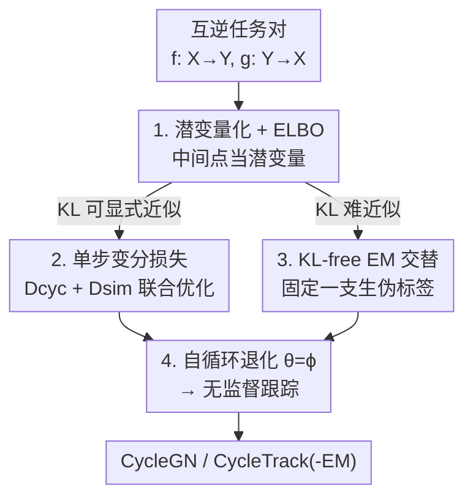

# Variational Inference for Cyclic Learning

**会议**: ICLR 2026  
**OpenReview**: [https://openreview.net/forum?id=c1jWNZ1Zqg](https://openreview.net/forum?id=c1jWNZ1Zqg)  
**代码**: 有（CycleGN 与 CycleTrack 源码公开，论文未给具体链接）  
**领域**: 学习理论 / 弱监督学习 / 变分推断  
**关键词**: 循环一致性, 变分推断, ELBO, EM 算法, 无监督跟踪

## 一句话总结
本文把循环学习（cyclic learning）里的中间数据点视作潜变量、把跨域映射写成条件概率，从而用变分推断把"循环一致性"目标推导成一个证据下界（ELBO），并据此给出两种通用训练策略——单步联合优化与 EM 交替优化；该框架既为 CycleGAN 提供了理论解释、给出无 GAN 的替代品 CycleGN，又在无监督跟踪上做出 SOTA 的 CycleTrack / CycleTrack-EM。

## 研究背景与动机

**领域现状**：循环学习是弱监督/自监督的一种强范式——设计一对互逆任务（A→B 与 B→A），利用"数据点经过一圈处理后应回到自身"这个性质（cycle-consistency）来构造损失，从而摆脱人工标注。代表作 CycleGAN（无配对图像翻译）、CyCO / SC-Tune（指代理解↔指代生成的 REC-REG 循环）、各种无监督跟踪（前向-后向轨迹一致）都属此类。

**现有痛点**：这些方法都是**领域特定的手工实现**，缺乏统一理论。具体表现为两个硬伤：其一，损失函数无法跨域迁移——CycleGAN 的损失没法直接搬到视频对齐任务上；其二，很多方法仍**依赖伪标签**——无监督跟踪通常要先用一个基础跟踪器产生初始轨迹，本质上没真正"无监督"。

**核心矛盾**：循环一致性这个约束本身是普适的，但大家只在各自任务里"凑"出一个能用的损失，**没人把它抽象成一个可推导、可迁移的概率目标**。于是循环学习的潜力被任务工程掩盖，换个任务就得重新设计损失。

**本文目标**：建立一个统一的概率框架，覆盖**成对循环任务**（A→B 与 B→A 由两个不同函数 $f,g$ 实现）和**自循环任务**（A→B 与 B→A 由同一个函数实现，$\theta=\phi$），并从中导出适用于任意循环任务的训练策略。

**切入角度**：作者的关键观察是——循环里的中间点（既不是起点也不是终点的那些数据）其实就是**潜变量**，而跨任务的转移就是**可学习的条件分布**。一旦这么看，最大化"绕一圈回到自己"的对数似然 $\log p_\theta(x)$ 就能像 VAE/EM 那样引入变分分布、拆成 ELBO。

**核心 idea**：把循环一致性 reformulate 成"对引入潜变量后的 ELBO 做最大化"，再据此机械地推出两种优化器，从而让循环学习从"手工损失"升级成"有理论保证的通用范式"。

## 方法详解

### 整体框架
框架的出发点是把生成任务看成学一个映射 $f:\mathcal{X}\to\mathcal{Y}$。当 $y=f(x)$ 可逆时，存在唯一逆映射 $x=g(y)=f^{-1}(y)$，这是保证循环一致性的必要条件。此时给定观测 $\hat{y}$，$x$ 的分布退化为集中在单点 $\hat{x}=g(\hat{y})$ 的狄拉克分布，于是条件概率写成

$$p_\theta(x|y)=\delta(x-g_\theta(y)),\qquad p_\phi(y|x)=\delta(y-f_\phi(x)).$$

有了这个概率化的转移关系，"从 $x$ 出发绕一圈回到 $x$"就等价于最大化 $\log p_\theta(x)$。引入变分分布 $q_\phi(y|x)$ 后，标准变分推断给出

$$\log p_\theta(x)=\mathbb{E}_{q_\phi(y|x)}\!\left[\log\frac{p_\theta(x,y)}{q_\phi(y|x)}\right]+D_{KL}\big(q_\phi(y|x)\,\|\,p_\theta(y|x)\big),$$

其中第一项就是 ELBO，可进一步分解为"重构期望 − 与先验对齐的 KL"：

$$\ell_{\theta,\phi}(x)=\int q_\phi(y|x)\log p_\theta(x|y)\,dy-D_{KL}\big(q_\phi(y|x)\,\|\,p(y)\big).$$

对称地考虑"从 $y$ 出发回到 $y$"，把两个方向相加就得到双向 ELBO $\ell_{\theta,\phi}(x,y)$，它与最大对数似然之间的间隙正好是两项 KL：$D_{KL}(q_\phi(y|x)\|p_\theta(y|x))+D_{KL}(q_\theta(x|y)\|p_\phi(x|y))$。最大化 ELBO 即隐式地把变分分布逼向先验、又逼向模型后验，这恰好刻画了循环学习的本质——学一对既符合两域边缘结构、又满足循环重构约束的随机映射。

在这个统一目标之上，作者给出两条具体落地路径：一条是 VAE 式的**单步联合优化**（把 ELBO 近似成一个可直接反传的损失），另一条是 EM 式的**交替优化**（当 KL 无法显式近似时改用伪标签迭代）。最后把成对循环退化到 $\theta=\phi$ 即得到**自循环**版本，并应用到无监督视觉跟踪。

### 关键设计

**1. 中间点潜变量化：把循环一致性写成 ELBO**

这一步直接针对"各任务各凑损失、无法迁移"的痛点。作者不再把循环损失当成一个工程技巧，而是把循环里的中间观测 $y$ 当作潜变量、把 $f_\phi,g_\theta$ 当作参数化的条件分布 $p_\phi(y|x),p_\theta(x|y)$，于是"绕一圈回到自身"被严格地写成最大化 $\log p_\theta(x)$。借助变分恒等式，目标拆成 ELBO 加上一项 KL 间隙（见上式），最大化 ELBO 等价于同时收紧 $q_\phi(y|x)$ 与真后验 $p_\theta(y|x)$ 的差距。与 VAE 的关键区别在于：这里的潜变量 $y$ 不是纯粹用来建模 $x$ 分布的自由隐变量，而是**域 $\mathcal{Y}$ 里真实存在的观测**，它有自己的结构、必须满足从数据估出的边缘先验 $p(y)$——因此学习目标不只是重构 $x$，而是学一对在两域上都概率自洽的双向映射。这是全文第一个统一成对与自循环任务的变分概率框架。

**2. 单步变分损失：把 ELBO 近似成 Dcyc + Dsim 的可反传目标**

ELBO 里有积分和 KL，没法直接当损失。作者在确定性映射假设（$q_\phi(y|x)$ 塌缩成 $\delta(y-f_\phi(x))$）下把两项分别落地。重构项化简为

$$\int q_\phi(y|x)\log p_\theta(x|y)\,dy=\log\delta\big(x,g_\theta(f_\phi(x))\big),$$

最大化它等价于最小化一个循环距离 $D_{cyc}(x,g_\theta(f_\phi(x)))$（当且仅当 $x=\hat{x}$ 为零的距离函数）；KL 项则化简为 $-\log p(f_\phi(x))+\text{const}$，即鼓励映射输出落到先验高密度区，当 $p(y)$ 难以显式建模时用一个域相似度 $D_{sim}(f_\phi(x),\mathcal{Y})$（如 Wasserstein 距离）替代。把双向相加即得单步联合损失

$$\mathcal{L}(x,y)=D^X_{cyc}(x,g_\theta(f_\phi(x)))+D^X_{sim}(f_\phi(x),\mathcal{Y})+D^Y_{cyc}(y,f_\phi(g_\theta(y)))+D^Y_{sim}(g_\theta(y),\mathcal{X}).$$

它的意义在于：循环损失 $D_{cyc}$ 保证"回到自身"，而 $D_{sim}$ 保证中间产物 $\hat{y}$ 确实落在目标域里——缺了后者模型会收敛到只满足循环、却不符合目标域的平凡解。把这个分解对到 CycleGAN（见表 1），其对抗损失 $L_{GAN}$ 正好充当 $D_{sim}$（GAN 判别器隐式最小化 JS 散度，是 KL 的对称变体）、$L_1$ 循环损失充当 $D_{cyc}$，于是 CycleGAN 被证明只是本框架 Eq. 12 的一个特例——这就解释了它为什么有效。

**3. KL-free EM 交替优化：当 Dsim/KL 无法可靠估计时改用伪标签迭代**

单步法依赖 $D_{sim}$ 准确逼近 KL，但很多任务的目标分布太复杂、$D_{sim}$ 估不准，反而带来训练不稳定。作者借 EM 思路绕开它：把两个映射看成耦合的潜变量模型，交替"固定一支、为另一支生成伪标签"。具体地（Algorithm 1），$E_\theta\text{-}M_\theta$ 阶段先用当前前向 $f_\phi$ 由 $x$ 生成 $\hat{y}=f_\phi(x)$（E 步，stop-gradient），再最小化 $D_{cyc}(x,g_\theta(\hat{y}))$ 更新反向 $g_\theta$（M 步）；对称地 $E_\phi\text{-}M_\phi$ 阶段采样 $y$、生成 $\hat{x}=g_\theta(y)$、用 $D_{cyc}(y,f_\phi(\hat{x}))$ 更新 $f_\phi$。这相当于"假设当前 $q_\phi(y|x)$ 已逼近真后验、令 KL=0，再最大化期望对数似然"的坐标上升。它的妙处是**彻底不需要定义 $D_{sim}$**：那一个自然要问——既然没有 $D_{sim}$ 约束，怎么保证 $\hat{y}=f_\phi(x)\in\mathcal{Y}$？答案来自交替结构本身：在另一个 M 步里要求 $f_\phi(g_\theta(y))\approx y$，这就强制 $f_\phi$ 的输出落进 $\mathcal{Y}$（对称地保证 $g_\theta$ 的输出落进 $\mathcal{X}$）。把它实例化到图像翻译就得到无 GAN 的 CycleGN（表 2）。

**4. 自循环退化（θ=ϕ）：把框架搬到无监督跟踪并避开平凡解**

当成对任务里 $f_\phi=g_\theta$（同一个函数当往返映射），框架退化为自循环。这里有个陷阱：若直接令 $g_\theta(g_\theta(x))=x$，平凡解 $g_\theta(x)=x$ 就会满足它。作者用域约束破掉它——由于 $\hat{y}=g_\theta(x)$ 必须属于 $\mathcal{Y}$ 而非 $\mathcal{X}$，把目标重写成带条件域的 $g_\theta(g_\theta(x,X,Y),Y,X)=x$，对应 ELBO $\ell_\theta(x|Y,X)=\mathbb{E}_{q_\theta}[\log p_\theta(x|y,Y,X)]-D_{KL}(q_\theta(y|x,X,Y)\|p(y))$，损失为 $\mathcal{L}(x)=D_{cyc}(x,g_\theta(g_\theta(x,X,Y),Y,X))+D_{sim}(g_\theta(x,X,Y),Y)$。在视觉跟踪里，$X,Y$ 是模板帧与搜索帧、$x$ 是模板里的目标框，跟踪器 $T$ 的损失由 Eq. 16 推出：循环项 $L_b(x,T(T(x,X,Y),Y,X))$ 保证前向-后向轨迹一致，相似项 $L_b(T(x,X,Y),\tilde{y})$ 把预测框拉向检测器在 $Y$ 帧产生的最近邻框 $\tilde{y}$（按 IoU 选）。由于现有跟踪器做不到端到端可微的首尾相接，作者从零搭了 CycleTrack：把模板框经 MLP 变成位置 token、与未裁剪帧 token 拼接输入，主干用 ViT 编码器 + STARK 特征增强器 + 并行 FCOS 头输出置信度加权框；单步训练版叫 CycleTrack、EM 训练版叫 CycleTrack-EM。

### 损失函数 / 训练策略
- **单步**：直接最小化 Eq. 12 的四项和（双向 $D_{cyc}+D_{sim}$），端到端联合更新 $\theta,\phi$；CycleGAN 即此模式（$D_{sim}\!=\!$ 对抗损失）。
- **EM**：按 Algorithm 1/2 交替更新，每个 M 步只用 $D_{cyc}$，靠 stop-gradient 的 E 步生成伪标签；自循环（$\theta=\phi$）可在一个 EM 过程里联合优化双向任务，不必像成对任务那样等一个 EM 收敛再启动下一个。
- 跟踪里 $L_b$ 用 STARK 同款的加权 L1 + GIoU；CycleGN 每 200 样本在 $E_\theta\text{-}M_\theta$ 与 $E_\phi\text{-}M_\phi$ 间切换，共 100 epoch，其余配置与 CycleGAN 一致。

## 实验关键数据

### 主实验

无配对图像翻译（Cityscapes，FCN-score，越高越好）：

| 任务 | 方法 | 用 GAN | Per-pixel acc. | Per-class acc. | Class IOU |
|------|------|:---:|:---:|:---:|:---:|
| labels→photo | CycleGAN | ✓ | 0.52 | 0.17 | 0.11 |
| labels→photo | **CycleGN (ours)** | ✗ | 0.52 | 0.14 | 0.10 |
| photo→labels | CycleGAN | ✓ | 0.58 | 0.22 | 0.16 |
| photo→labels | **CycleGN (ours)** | ✗ | 0.51 | 0.16 | 0.10 |

CycleGN 在**完全不用对抗判别器**的情况下，仅靠把生成网络输出推近目标域实例，就逼近 CycleGAN、且全面超过 CoGAN / BiGAN-ALI / SimGAN / Feat.+GAN 等其它损失配置——验证了"单步范式 = ELBO 近似"这一理论解释的可行性。

无监督视觉跟踪（AUC / Precision，越高越好）：

| 设置 | 方法 | LaSOT AUC | LaSOT Prec. | TrackingNet AUC | TrackingNet Prec. |
|------|------|:---:|:---:|:---:|:---:|
| 无监督（检测器标注） | ULAST*-on（次优） | 47.1 | 45.1 | 65.4 | 59.2 |
| 无监督 | CycleTrack | 51.0 | 49.7 | 75.9 | 71.5 |
| 无监督 | **CycleTrack-EM** | **56.5** | **57.9** | **77.3** | **74.4** |
| 严格无监督（光流标注） | ULAST-on（次优） | 43.3 | 40.7 | — | — |
| 严格无监督 | CycleTrack | 45.0 | 42.2 | 65.6 | 59.0 |
| 严格无监督 | **CycleTrack-EM** | **51.2** | **49.9** | **69.1** | **64.7** |

两种设置下都大幅领先此前最好的无监督跟踪器，且**无需基础跟踪器提供伪轨迹**——直接用全图处理实现循环学习范式。

### 消融实验

| 配置 | 现象 | 说明 |
|------|------|------|
| 完整 EM（含 E 步 stop-gradient） | 正常收敛 | CycleTrack-EM 标准训练 |
| 去 E 步 / 只留 $D_{cyc}$ | 收敛到明显平凡解（Fig. 5） | 去掉前向冻结=去掉 stop-gradient，$\hat{y}$ 不再受目标域约束 |
| CycleGAN 去对抗损失只留循环损失 | 性能显著退化 | 与"单步去 $D_{sim}$"现象同构 |

### 关键发现
- **$D_{sim}$ / E 步是不可省的那一半**：只用循环一致性损失 $D_{cyc}$ 数学上等价于在 EM 里去掉 stop-gradient 的 E 步，生成的 $\hat{y}$ 会脱离目标域，模型塌缩到平凡解——这同时解释了 CycleGAN 去掉对抗损失后为何崩。
- **单步还是 EM，取决于 KL 能否被可靠近似**：图像翻译里 GAN 判别器是稳健的 KL 代理，故单步 CycleGAN 优于 EM 的 CycleGN；而跟踪里"对齐最近检测框"不可靠（目标可能完全没被检到）、$D_{sim}$ 估计差，于是 EM 的 CycleTrack-EM 反超单步 CycleTrack。
- **循环学到的映射不保证是想要的那个**：无配对约束下模型只学到"某个满足循环一致性的映射"，可能学成 $X\!\leftrightarrow\!A$、$B\!\leftrightarrow\!Y$ 这类偏离 $X\!\leftrightarrow\!Y$ 的局部最优；跟踪里则可能退化成"借检测器标注偏置重定位目标"的基础检测器。

## 亮点与洞察
- **把工程技巧升格成理论**：循环一致性长期是"凑出来好用"的损失，本文用"中间点=潜变量"一句话就把它接进变分推断的标准机器，ELBO、KL 间隙、VAE/EM 类比全都顺下来——这种"换个视角，旧方法瞬间有了出处"的洞察很漂亮。
- **同一框架长出两个优化器**：单步（VAE 式联合）与 EM（坐标上升式交替）不是拍脑袋并列，而是从同一个 ELBO 按"KL 能不能显式近似"自然分叉，且二者优劣有可解释的判据，可迁移到任何循环任务的选型。
- **CycleGAN 的"理论身份证"**：表 1 把 CycleGAN 四个损失一一对到 Eq. 12，说明对抗损失只是 $D_{sim}$ 的一种实现（JS≈KL），这个对应关系可复用——任何想给现有循环方法找理论依据的工作都能照搬这套映射。
- **EM 自带"伪标签合法性"证明**：不靠 $D_{sim}$ 也能保证 $\hat{y}\in\mathcal{Y}$，靠的是另一支 M 步的约束反向托住，这个论证思路对设计无 GAN/无伪标签的自监督训练很有启发。

## 局限与展望
- **循环一致性不充分**：作者自己承认，无额外约束时学到的映射只满足循环、未必是目标映射（photo↔map 的中间假图质量差、跟踪误定位到显著干扰物），需要引入循环以外的约束来缓解。
- **EM 有局部最优风险**：$g_\theta$ 可能同时适配 $g_\theta(a)=x$ 与 $g_\theta(y)=b$ 两个模式，最终学成 $X\!\leftrightarrow\!A$、$B\!\leftrightarrow\!Y$ 的"错对"，一旦进入这种稳态，内层 $p(y|x)=q_\phi(y|x)$ 的假设就再也无法满足。
- **确定性映射假设较强**：单步损失的推导依赖 $q_\phi(y|x)$ 塌缩成狄拉克分布，对多对多/随机映射的循环任务是否适用、$D_{sim}$ 用 Wasserstein 之外的度量表现如何，文中未展开。
- **CycleTrack 需从零搭**：因现有跟踪器不可微首尾相接，方法被迫自造架构，迁移到其它已有 backbone 的成本不明。

## 相关工作与启发
- **vs CycleGAN**：CycleGAN 用对抗损失 + L1 循环损失端到端训练；本文证明它是 Eq. 12 的特例（对抗损失=$D_{sim}$、JS≈KL），并给出去掉判别器的 EM 替代 CycleGN，说明"对抗"不是循环翻译的必需品，只是 $D_{sim}$ 的一种稳健实现。
- **vs VAE**：两者都引入潜变量、都得到"重构 + KL 对齐先验"的目标；区别在于 VAE 的潜变量是用来建模 $x$ 分布的自由隐变量，本文的 $y$ 是域 $\mathcal{Y}$ 里有真实结构、需满足边缘先验 $p(y)$ 的观测变量，目标是学双向映射而非生成新样本。
- **vs 经典 EM**：标准 EM 的 E 步求潜分布后验、M 步更新参数；本文的 E/M 被重定义为"固定网络参数+采样数据"与"最大化分布函数"，$E_\phi\text{-}M_\phi$ 充当 $p_\theta(x|y)$ 的 E 步、$E_\theta\text{-}M_\theta$ 充当其 M 步，本质仍是坐标上升，但优化的是映射而非数据分布。
- **vs 依赖伪标签的无监督跟踪（USOT / ULAST 等）**：它们需基础跟踪器产生初始轨迹做伪监督；CycleTrack 直接用全图处理实现循环范式、无需伪轨迹，且在 LaSOT/TrackingNet 上大幅领先。

## 评分
- 新颖性: ⭐⭐⭐⭐⭐ 首个统一成对与自循环任务的变分概率框架，把循环一致性接进变分推断并据此解释 CycleGAN，视角原创。
- 实验充分度: ⭐⭐⭐⭐ 图像翻译 + 无监督跟踪两个差异极大的任务双线验证、含失败案例与去 E 步消融；但每任务仅 1-2 个数据集，理论假设的边界探得不够。
- 写作质量: ⭐⭐⭐⭐ 推导链条清晰、表 1/表 2 的对应关系很有说服力；但记号 $x,y$ 与 $\mathbf{x},\mathbf{y}$、$E_\theta\text{-}M_\theta$ 命名略绕，初读需反复对照。
- 价值: ⭐⭐⭐⭐⭐ 给整类循环学习方法提供了可迁移的理论模板与优化器选型判据，且产出两个 SOTA 实例，对后续弱监督研究有方法论意义。

<!-- RELATED:START -->

## 相关论文

- [\[ICLR 2026\] Variational Deep Learning via Implicit Regularization](variational_deep_learning_via_implicit_regularization.md)
- [\[ICLR 2026\] Diffusion Bridge Variational Inference for Deep Gaussian Processes](diffusion_bridge_variational_inference_for_deep_gaussian_processes.md)
- [\[ICLR 2026\] Multiple-Prediction-Powered Inference](multiple-prediction-powered_inference.md)
- [\[ICLR 2026\] Best-of-Majority: Minimax-Optimal Strategy for Pass@k Inference Scaling](best-of-majority_minimax-optimal_strategy_for_passk_inference_scaling.md)
- [\[ICLR 2026\] Robust Amortized Bayesian Inference with Self-Consistency Losses on Unlabeled Data](robust_amortized_bayesian_inference_with_self-consistency_losses_on_unlabeled_da.md)

<!-- RELATED:END -->
