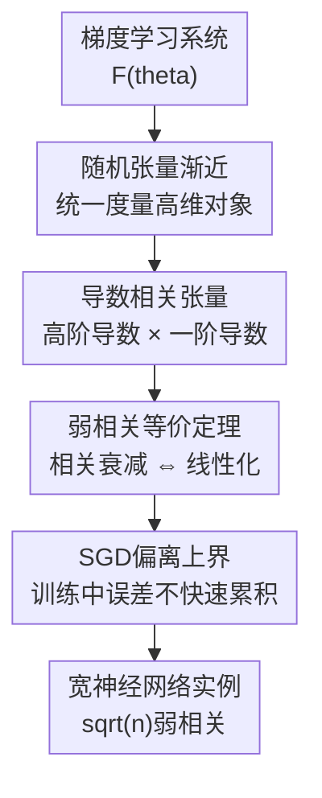

# Weak Correlations as the Underlying Principle for Linearization of Gradient-Based Learning Systems

**会议**: ICLR2026  
**OpenReview**: [https://openreview.net/forum?id=vokk8t1gnp](https://openreview.net/forum?id=vokk8t1gnp)  
**代码**: 有（论文称实验代码已开源）  
**领域**: 学习理论 / 训练动力学  
**关键词**: 弱导数相关, NTK线性化, 随机张量渐近, 宽神经网络, SGD动力学

## 一句话总结
本文提出“弱导数相关”是梯度学习系统出现参数空间线性化的根本判据：只要初始化处一阶导数与高阶导数的相关随宽度衰减，训练动力学就会靠近 NTK 线性模型，并且这种偏离可在 SGD 训练过程中得到宽度相关的上界。

## 研究背景与动机
**领域现状**：宽神经网络在无限宽极限下常被神经切线核（Neural Tangent Kernel, NTK）描述。这个视角把非线性网络在输入上仍然复杂的函数，近似成参数附近的一阶 Taylor 模型：训练时核基本保持初始化状态，函数值按照一个固定核诱导的线性动力学演化。

**现有痛点**：NTK 理论已经解释了宽网络的指数收敛、核极限和一部分泛化现象，但它更像是在描述“发生了线性化之后会怎样”。真正更基础的问题是：为什么一个由大量非线性参数组成的系统，会在梯度下降下表现得像线性系统？已有工作常从具体网络结构、Hessian 与 gradient 的范数比、或者某类宽网络的图展开来证明，结论有用但不够统一。

**核心矛盾**：线性化不是简单地说参数变化小，也不是说模型本身变成线性函数。它要求高阶 Taylor 项在训练更新中被系统性压低。可是高阶项是否重要，取决于高阶导数如何与梯度更新方向耦合；只看高阶导数的大小，无法直接解释它们是否真的会进入学习动力学。

**本文目标**：作者试图给出一个更内在的判据：把梯度学习系统看作一般的参数化假设函数 $F(\theta)$，定义初始化处一阶导数与高阶导数之间的相关张量，然后证明“这些相关足够弱”与“训练动力学线性化”在适当条件下等价。

**切入角度**：梯度下降每一步的更新方向本身由一阶导数 $\nabla F$ 决定。如果高阶导数 $\nabla^{D+d}F$ 与若干个 $\nabla F$ 的收缩相关很弱，那么高阶 Taylor 项即使存在，也很难沿实际训练方向累积成可见的非线性偏离。这比只考察 Hessian 范数更贴近训练路径。

**核心 idea**：用“弱导数相关”统一刻画 NTK 线性化：线性化的原因不是非线性项不存在，而是高阶导数与梯度驱动方向在初始化处近似不相关，导致它们在宽度极限下对动力学贡献消失。

## 方法详解
### 整体框架
本文不是提出新的优化器，而是建立一套分析框架。它先为随机张量定义适合高维极限的渐近记号，再把梯度下降中出现的 Taylor 高阶项改写成导数相关张量，最后证明这些相关张量的衰减率与线性化误差的衰减率等价。

整个逻辑可以理解为：从一般梯度学习系统出发，沿训练更新方向展开 $F(\theta)$；每个高阶项都会变成“高阶导数与若干一阶导数”的收缩；如果这些收缩在宽度 $n$ 增大时衰减，就得到 NTK 式固定核动力学。对宽神经网络，作者进一步说明常见宽网络满足这种弱相关结构，并用实验比较线性化误差与相关强度的宽度趋势。

### 关键设计
**1. 随机张量渐近记号：用概率意义下的范数上界描述高维相关**

这篇论文首先处理一个技术但关键的问题：导数相关不是标量，而是带输入索引、输出索引和参数索引的随机张量。若只看每个元素的期望或方差，很难保证乘法、收缩、求和之后仍然有稳定的渐近规则。作者因此使用 subordinate tensor norm，并定义随机张量的 $O(f)$：直观地说，若对任何比 $f(n)$ 稍大的函数 $g(n)$，都有 $\|M_n\| \le g(n)$ 的概率趋近于 $1$，则记 $M=O(f)$。

这个定义的好处是它像普通大 $O$ 记号一样可以做代数运算。后面所有“某个相关是 $O(1/\sqrt{n})$”的说法，不是指某个坐标平均值小，而是指整个相关张量在高概率意义下受控。对于宽网络这种参数数目随宽度增长的对象，这一点很重要，因为线性化需要控制的是训练方向上的整体收缩，而不是个别坐标。

**2. 导数相关张量：把高阶 Taylor 项改写成训练方向上的相关强度**

核心定义是导数相关 $C_{D,d}$。略去索引细节，它的形式可以写成：

$$
C_{D,d}(\theta)=\frac{\eta^{D/2+d}}{D!d!}\,\nabla^{D+d}F(\theta)^T(\nabla F(\theta))^{\times d}.
$$

这里 $d$ 表示有多少个一阶导数副本参与收缩，$D+d$ 表示被考察的高阶导数阶数，$\eta$ 的幂次用于和学习率尺度对齐。最熟悉的特例是 $D=0,d=1$：此时 $C_1=\eta \nabla F^T\nabla F$，正是 NTK 核 $\Theta$。因此本文不是另起炉灶，而是把 NTK 看成导数相关族里的最低阶成员。

为什么这个定义抓住了线性化？梯度下降更新满足 $\Delta\theta=-\eta\nabla F\,C'(F,\hat y)$。当把 $F(\theta+\Delta\theta)$ 对 $\theta$ 做 Taylor 展开时，二阶、三阶乃至更高阶项都会包含 $\nabla^k F$ 与若干个 $\nabla F$ 的收缩。也就是说，真正决定高阶非线性项能否影响训练的，不只是 $\nabla^kF$ 大不大，而是它与梯度方向是否相关。弱相关就是把这个直觉公式化。

**3. 线性化等价定理：把“弱相关导致线性化”提升为双向判据**

本文最重要的结果是两个等价定理。第一个定理讨论固定学习率尺度下的弱相关：若对某个增长函数 $m(n)\to\infty$，高阶相关满足类似 $C_d=O(1/m(n))$、$C_{D,d}=O(1/\sqrt{m(n)})$ 的衰减，那么固定训练步数内，真实模型 $F(\theta(s))$ 与线性化模型 $F_{lin}(s)$ 的差距是 $O(1/m(n))$，导数本身相对初始化的变化也是小量。

第二个定理更强，允许学习率重新缩放 $\eta\to r(n)\eta$。在这种设置下，若除 NTK 本身外的导数相关按 $C_{D,d}=O((1/\sqrt{m(n)})^d)$ 衰减，则线性化误差按 $O(r(n)/m(n))$ 控制。这个形式解释了为什么外部尺度或学习率缩放会改变 lazy training 的程度：它并不是神秘地“让模型更线性”，而是在不同阶相关项前面乘上不同的 $r(n)$ 幂次，从而改变高阶项进入动力学的速度。

更值得注意的是，作者证明的是等价而不只是充分条件。若系统在这些梯度学习路径上呈现线性化，那么相应的导数相关也必须弱。证明思路是把一步更新后的 $F-F_{lin}$ 和导数变化展开为 $C_{D,d}$ 的级数；由于可以改变目标函数和学习率尺度，不同阶项不能总靠偶然抵消来变小，因此每一阶相关本身都必须衰减。

**4. SGD偏离上界与宽网络实例：说明弱相关不只解释初始几步**

传统 NTK 线性化结果常关注固定步数或确定性梯度下降，而实际训练更多使用 SGD。本文利用弱相关框架推导了 SGD 训练过程中偏离线性化的上界：在指数弱相关、学习率低于稳定阈值、线性化解早期以时间尺度 $T$ 指数接近目标的条件下，对 $s=1,\dots,S$ 有

$$
F(\theta(s))-F_{lin}(s)=O\left(\frac{s^0}{m(n)}\right).
$$

这里 $s^0$ 表示上界在所考虑阶段内不随训练步数线性爆炸。直观含义是：只要弱相关结构成立，非线性偏离不会因为 SGD 的随机路径而快速累积到压过宽度衰减的程度。

在宽神经网络部分，作者依赖并扩展 tensor programs 形式化，说明常见宽网络具有半线性结构，可以归纳得到 $\sqrt n$ 量级的弱相关。激活函数的高阶导数增长也会影响线性化速率；例如文中指出全连接网络里类似 $\sup_n \phi^{[n]}/(n+1)!$ 的量会控制相关衰减能否保持良性。这使框架能解释架构、参数化和激活函数为什么会改变 NTK 极限接近速度。

### 一个完整示例
假设一个网络在初始化 $\theta_0$ 处训练一步。线性化模型只保留一阶项：

$$
F_{lin}(1)=F(\theta_0)+\nabla F(\theta_0)\Delta\theta.
$$

真实模型还包含二阶项、三阶项等：

$$
F(\theta_0+\Delta\theta)=F(\theta_0)+\nabla F(\theta_0)\Delta\theta+\frac{1}{2}\nabla^2F(\theta_0)[\Delta\theta,\Delta\theta]+\cdots.
$$

由于 $\Delta\theta$ 本身由 $\nabla F$ 决定，二阶项本质上会变成 $\nabla^2F$ 与两个一阶导数方向的收缩。若这个收缩对应的 $C_{0,2}$ 随宽度变大而趋近于 $0$，二阶项就不会显著改变函数值；若更高阶 $C_{0,3},C_{0,4},\dots$ 也按幂次衰减，整条 Taylor 尾项都会被压低。于是网络参数仍然可以更新，但函数演化看起来像固定 Jacobian 的线性系统。

这个例子也说明了本文和“参数位移很小”解释的区别。参数可以在高维空间里移动，关键是移动方向与高阶曲率方向的相关是否弱。如果高阶导数沿梯度方向恰好强相关，那么即使每一步很小，也可能积累出非线性特征学习；如果相关弱，高阶项就像在大量近独立方向上平均掉，NTK 线性化自然出现。

### 损失函数 / 训练策略
理论设置采用单输入 batch 的梯度下降式监督学习。给定输入 $x_s$ 和标签 $\hat y(x_s)$，参数更新为：

$$
\theta(s+1)-\theta(s)=-\eta\nabla F(\theta(s))(x_s)C'(F(\theta(s))(x_s),\hat y(x_s)).
$$

线性化动力学使用初始化核 $\Theta_0$：

$$
F_{lin}(s+1)=F_{lin}(s)-\Theta_0(\cdot,x_s)C'(F_{lin}(s)(x_s),\hat y(x_s)).
$$

分析要求系统在初始化处 proper normalization：函数值、第一步变化、核尺度和高阶导数尺度都不能在宽度极限下失控。对 SGD 偏离上界，还需要学习率低于相关的稳定阈值，并假设线性化解在早期训练中以指数速度靠近目标。实验部分则用全连接网络、MSE loss、mini-batch SGD 和不同宽度/学习率缩放来观察真实网络与一阶线性化模型之间的差异。

## 实验关键数据

### 主实验
作者做了两组验证。第一组比较不同宽度下网络与线性近似的相对误差，并同时估计二阶、三阶导数相关；第二组在 MNIST 上系统扫宽度和学习率缩放，观察线性化误差的幂律斜率。由于论文主要是理论工作，实验目标不是刷新分类精度，而是验证“相关衰减”和“线性化误差衰减”是否同向。

| 实验设置 | 数据 / 模型 | 观测指标 | 关键现象 |
|----------|-------------|----------|----------|
| Appendix A.1 宽度实验 | MNIST / CIFAR10 / FMNIST，全连接网络，ReLU/Sigmoid/Erf，1-3层 | 网络与线性近似的相对损失，二阶/三阶相关近似 | 宽度增大时，真实网络与线性模型更接近；导数相关估计也随宽度下降 |
| Appendix A.2 学习率缩放实验 | MNIST，两层隐藏层 MLP，宽度 $2048$ 到 $19484$，100 seeds | 测试集 $MSE_{test}(f,f_{lin})$ 的 log-log 斜率 | 学习率随宽度缩小时，线性化误差下降更快，符合尺度影响线性化的定性结论 |
| 理论-实验对应 | NTK/Taylor 一阶近似 vs 非线性网络 | 宽度幂律趋势 | 实验斜率不完全等于理论上界，但方向一致：更宽、更 lazy 的设置更线性 |

### 消融实验
论文没有传统意义上的“去掉模块 A/B”的模型消融，而是通过改变学习率宽度缩放指数 $\alpha$ 来检验外部尺度对线性化的影响。设 $\eta(n)=\eta_0 n^\alpha$，$\eta_0=0.1$，实验报告了不同 $\alpha$ 下线性化误差随宽度的 log-log 斜率。

| 配置 | 关键指标 | 说明 |
|------|----------|------|
| $\alpha=0$ | 斜率约 $-1.14$ | 常数学习率下，宽度增大仍降低线性化误差 |
| $\alpha=-0.25$ | 斜率约 $-1.14$ | 轻微缩小学习率，趋势与常数学习率接近 |
| $\alpha=-0.5$ | 斜率约 $-1.30$ | 更接近 lazy regime，误差下降略快 |
| $\alpha=-0.75$ | 斜率约 $-1.73$ | 学习率缩放增强线性化，宽度收益更明显 |
| $\alpha=-1.0$ | 斜率约 $-2.72$ | 学习率按 $1/n$ 缩放，线性化误差下降最快 |

### 关键发现
- 宽度越大，网络输出与一阶线性化输出的差异越小，这和弱相关随宽度衰减的理论图景一致。
- 二阶、三阶导数相关的近似计算显示出随宽度下降的趋势，支持“高阶项沿梯度方向被弱化”的解释。
- 学习率缩放确实改变线性化速率；这对应 Theorem 3.2 中 $r(n)$ 对高阶相关项的放大或压低作用。
- 实验斜率比理论期望更复杂，作者也承认可能是宽度仍未进入真正渐近区间，或者理论给的是上界而非精确等式。
- 这组实验的价值在于验证理论机制，而不是说明 NTK 模型在实际任务上优于有限宽网络。

## 亮点与洞察
- 把 NTK 线性化的原因从“核保持不变”往前推进了一步：核保持不变本身需要解释，而弱导数相关给出了更底层的可检验结构。
- 导数相关 $C_{D,d}$ 的定义很巧妙，因为它直接对应训练更新方向上的 Taylor 高阶项；这比孤立地看 Hessian norm 更贴近梯度学习动力学。
- 等价定理是本文最强的理论卖点。很多理论只证明某个条件足以导致线性化，而本文试图说明弱相关与线性化互为表里，使它成为一般梯度学习系统的判据。
- 随机张量渐近记号虽然抽象，但解决了宽网络分析中常见的“元素级平均不等于整体控制”问题，可以作为分析其他高维随机对象的工具。
- 对 NTK inferiority paradox 的讨论有启发：如果完全线性化意味着缺少某些有益 inductive bias，那么有限宽网络胜过无限宽核模型可能正来自未消失的高阶相关。
- 这篇论文也给模型设计一个反向视角：并非越接近 NTK 极限越好，真正有用的系统可能需要在弱相关带来的可控性和非消失相关带来的特征学习偏置之间找到位置。

## 局限与展望
- 理论条件比较强，包括解析性、proper normalization、学习率阈值、线性化解早期指数收敛等；这些条件在现代大模型训练中是否自然成立，还需要进一步验证。
- 论文主要处理监督学习和梯度下降式更新，虽然附录讨论可推广性，但对 Adam、动量、归一化层、残差路径、注意力模块等实际训练组件的直接刻画还不够具体。
- 实验规模相对理论问题较小，主要是 MLP 和图像分类小数据设置；它能支持机制趋势，但还不能说明大规模 Transformer 的线性化现象也按同样斜率出现。
- 导数相关的高阶估计仍然有计算成本，实验里需要采样近似。若想把它变成实用诊断工具，还需要更稳定、更低成本的估计方法。
- 等价定理强调初始化处的弱相关，但现实训练中相关结构可能随训练阶段改变。未来可以研究弱相关如何在 feature learning regime 中逐渐破坏或重组。
- 一个有价值的后续方向是把弱相关当作架构/初始化/学习率的设计指标：希望 lazy 的系统可强化弱相关，希望保留有益 bias 的系统则可允许特定非消失相关。

## 相关工作与启发
- **vs NTK (Jacot et al., 2018; Lee et al., 2019)**: NTK 描述宽网络在固定初始化核下的线性动力学，本文解释为什么高阶非线性项会消失，并把 NTK 本身纳入导数相关族的低阶特例。
- **vs Chizat et al. 的 lazy training 视角**: Chizat 等强调外部尺度会控制模型是否进入 lazy regime，本文进一步说明尺度改变的是不同阶导数相关项的相对权重，因此能更细地解释学习率/参数化如何影响线性化速率。
- **vs Liu et al. 的 Hessian-gradient ratio**: Hessian 与 gradient 的范数比给出线性化的一个充分条件；本文的导数相关更像是沿真实训练方向的谱范数式收缩，并要求高阶相关在初始化处衰减。
- **vs Huang & Yau 的 neural tangent hierarchy**: tangent hierarchy 研究宽网络高阶核的慢时间尺度演化，本文用更一般的相关张量表达类似时间尺度，并推广到不局限于某类宽网络结构的梯度学习系统。
- **vs Dyer & Gur-Ari 的 Feynman diagram 方法**: Feynman 图能计算宽网络相关函数的渐近平均，本文强调直接控制随机张量的渐近行为而非只看平均值，因此目标是更统一、更可用于等价证明的判据。
- **启发**: 如果把强相关看作模型内在偏置的来源，那么分析训练系统不应只问“是否线性化”，还应问“哪些相关应该消失，哪些相关值得保留”。这对理解有限宽网络、特征学习和大模型预训练中的 inductive bias 都有潜在价值。

## 评分
- 新颖性: ⭐⭐⭐⭐⭐ 从弱导数相关给出线性化等价判据，理论切入点很有辨识度。
- 实验充分度: ⭐⭐⭐⭐☆ 实验能验证核心趋势和学习率缩放效应，但规模与现代模型仍有距离。
- 写作质量: ⭐⭐⭐⭐☆ 主线清楚，物理和随机张量工具有启发性，不过部分证明依赖较重的附录形式化。
- 价值: ⭐⭐⭐⭐⭐ 对 NTK、lazy training、feature learning 边界和宽网络动力学都有基础理论价值。

<!-- RELATED:START -->

## 相关论文

- [\[ICLR 2026\] Does Weak-to-strong Generalization Happen under Spurious Correlations?](does_weak-to-strong_generalization_happen_under_spurious_correlations.md)
- [\[ICLR 2026\] A New Approach to Controlling Linear Dynamical Systems](a_new_approach_to_controlling_linear_dynamical_systems.md)
- [\[ICLR 2026\] On learning linear dynamical systems in context with attention layers](on_learning_linear_dynamical_systems_in_context_with_attention_layers.md)
- [\[ICLR 2026\] Continuum Transformers Perform In-Context Learning by Operator Gradient Descent](continuum_transformers_perform_in-context_learning_by_operator_gradient_descent.md)
- [\[ICLR 2026\] Strong Correlations Induce Cause Only Predictions in Transformer Training](strong_correlations_induce_cause_only_predictions_in_transformer_training.md)

<!-- RELATED:END -->
