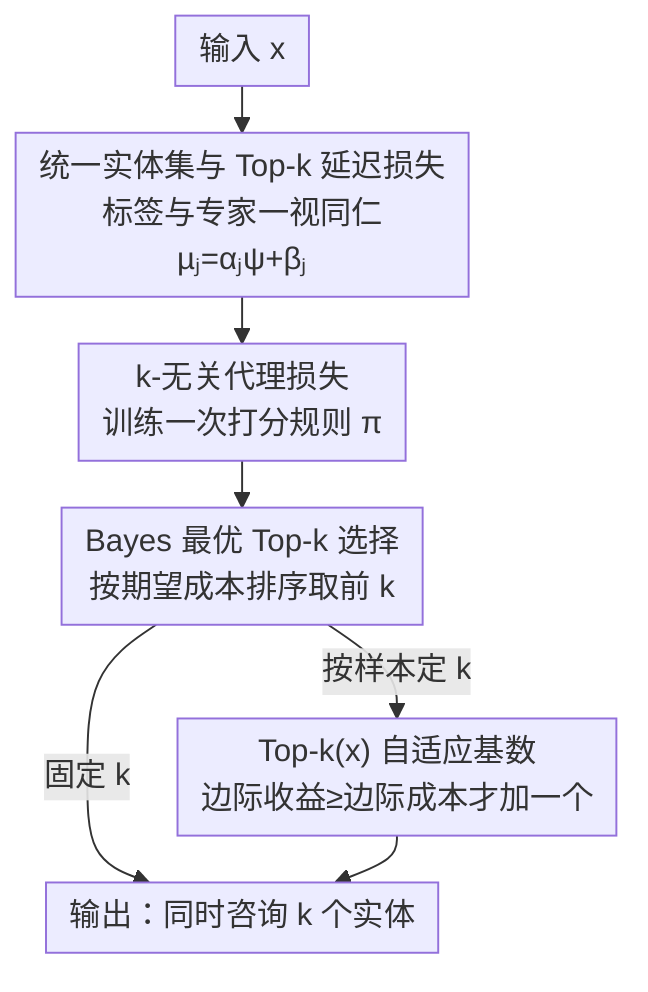

# Why Ask One When You Can Ask k? Learning-to-Defer to the Top-k Experts

**会议**: ICLR 2026  
**论文**: [OpenReview](https://openreview.net/)（⚠️ 具体链接以原文为准）  
**代码**: 有（作者声明公开发布全部代码与配置，⚠️ 具体地址以原文为准）  
**领域**: 学习理论 / Learning-to-Defer / 代理损失一致性  
**关键词**: Learning-to-Defer, Top-k 延迟, 代理损失, Bayes 一致性, 自适应基数

## 一句话总结
本文把"学习何时把样本甩给专家"的 Learning-to-Defer（L2D）框架从"只能问一个专家"推广到"同时问 k 个最划算的实体"，给出一个**与 k 无关、训练一次即可任意切换 k** 的代理损失，并首次证明它在单阶段/两阶段两种范式下都满足 Bayes / H-一致性；进一步提出按样本难度自适应选专家数的 Top-k(x)，在精度–成本权衡上稳压只问一个专家的旧方法。

## 研究背景与动机
**领域现状**：Learning-to-Defer 让一个机器学习系统学会"知道自己不行的时候把样本转交给外部专家"，显式地在"预测精度"和"咨询专家的成本"之间做权衡。它有两条主线：**两阶段**（base 预测器和专家都离线训好不动，只额外学一个 rejector 决定是自己预测还是甩给某个专家）和**单阶段**（把预测任务和延迟决策放进同一个增广分类器里联合训练）。

**现有痛点**：所有现存 L2D 框架都被钉死在**单专家延迟**上——每个 query 只能转交给恰好一个实体。可现实里的高风险决策天然是"会诊式"的：肿瘤病例要放射科、病理科、肿瘤内科、外科一起看，欺诈检测、网络安全、司法复核也都是多方意见聚合才靠谱。只问一个专家不仅丢掉了集体智慧，还会放大单个专家的偏差和错误。

**核心矛盾**：把单专家规则直接推到"问 k 个"并不平凡。L2D 现有的损失里写满了"恰好选一个"的排他性指示函数（如 $\mathbb{1}\{\hat h(x)\neq y\}\mathbb{1}\{\hat h(x)\le n\}$），一旦允许选 k 个，选中集合可能**同时**含真标签和多个精度/成本各异的专家，旧损失彻底失效。而一个看似自然的替代 $\mathbb{1}\{y\in\Pi_k(x)\}$ 又有三个硬伤：(i) 把"正确"退化成"只要 y 被选进来就行"，无视被咨询的专家本身可不可靠；(ii) 不累计同时咨询多个实体的总成本；(iii) 产生不可分解的集合级指示量，让代理损失没法设计。

**本文目标**：(1) 给出一个能统一单/两阶段、且真正反映"多实体精度+成本"的 top-k 延迟损失；(2) 找到一个可优化、有一致性保证、且**不依赖 k** 的代理损失；(3) 让专家数能随样本自适应。

**切入角度**：把"类别标签"和"专家"**一视同仁地当成实体（entity）**，于是单/两阶段的差别只是实体集 $\mathcal A$ 的构造不同；再借鉴 top-k 分类里"按代价排序取前 k"的思路，把延迟变成一个集合选择问题。

**核心 idea**：用"给每个实体打分 → 取期望成本最低的 k 个"代替"只取最划算的那 1 个"，并证明对应代理损失的优化目标与 k 无关，从而一套策略训一次、部署时随预算自由调 k。

## 方法详解

### 整体框架
系统对每个输入 $x$ 都用一个统一的打分规则 $\pi(x,\cdot)$ 给所有"实体"打分（实体 = 自己预测某个类 / 转交给某个专家）；推理时按分数排序取前 k 个组成**选择集** $\Pi_k(x)$，把样本同时交给这 k 个实体；训练时则最小化一个与 k 无关的代理损失来学这个打分规则。Top-k(x) 在此之上再叠一个**基数函数** $k_\theta(x)$，按样本自己决定该问几个。

### 关键设计

**1. 统一实体视角 + Top-k 真实延迟损失：把"问几个"变成可累计成本的集合选择**

旧 L2D 损失的排他性来自"标签和专家是两类东西、只能选一个"。本文一刀把它们都叫**实体**：单阶段实体集 $\mathcal A_{1s}=\{1,\dots,n\}\cup\{n+1,\dots,n+J\}$（前 n 个是"预测类别 j"，后 J 个是"转交专家 $m_{j-n}$"）；两阶段 $\mathcal A_{2s}=\{1,\dots,J+1\}$（1 是 base 预测器，其余是专家）。每个实体 j 配一个**增广成本** $\mu_j(x,z)=\alpha_j\,\psi(\hat a_j(x),z)+\beta_j$，其中 $\psi$ 是任务相关的误差度量（分类用 0-1 损失，回归可用 RMSE/mAP），$\alpha_j$ 罚预测错误、$\beta_j$ 是固定咨询费。于是 top-k 真实延迟损失就是简单地把选中实体的成本加起来：

$$\ell_{def,k}(\Pi_k(x),z)=\sum_{j=1}^{|\mathcal A|}\mu_j(x,z)\,\mathbb{1}\{j\in\Pi_k(x)\}.$$

这个写法一举解决前面三个硬伤：它**累计**所有被选实体的预测错误与咨询费，而不是只看 y 在不在集合里；它对每个实体可分解，给代理设计留了口子；并且 $k=1$ 时精确退回单阶段（Def 3.1）和两阶段（Def 3.2）的经典损失。举例：二分类 + 2 专家时 $\mathcal A=\{1,2,3,4\}$，若 $\Pi_2(x)=\{3,1\}$，损失就是 $\mu_3+\mu_1$，同时反映"既转交了专家 $m_1$、又预测了类别 1"的代价。

**2. k-无关代理损失：训一次，部署时任意调 k**

真实损失里有硬排序算子 $\Pi_k$，不连续不可导。作者先证一条上界（Lemma 4.3）：利用"成本和 $\sum_j\mu_j$ 不依赖打分规则 $\pi$"以及"$\mathbb{1}\{j\in\Pi_k(x)\}\le\Phi^u_{01}(\pi,x,j)$"，得到

$$\ell_{def,k}(\Pi_k(x),z)\le\sum_{j\in\mathcal A}\Big(\sum_{i\neq j}\mu_i(x,z)\Big)\Phi^u_{01}(\pi,x,j)-(|\mathcal A|-1-k)\sum_{j\in\mathcal A}\mu_j(x,z),$$

其中 $\Phi^u_{01}$ 取交叉熵族（comp-sum，涵盖 logistic、指数、广义交叉熵、MAE）。第二项与 $\pi$ 无关，最小化上界只需优化第一项，于是得到代理族

$$\Phi^u_{def,k}(\pi,x,z)=\sum_{j\in\mathcal A}\Big(\sum_{i\neq j}\mu_i(x,z)\Big)\Phi^u_{01}(\pi,x,j),$$

**这个表达式里根本没有 k**。这正是全文的杀手锏：一套打分规则 $\pi$ 训一次就能在任意基数 k 上复用，推理时按预算/风险临时调要问几个专家，无需重训。值得一提的是，这个代理在代数形式上和 Mao et al. (2024c) 的回归延迟损失重合，但本文的推导说明它其实是**所有 k 的凸上界**——形式没变，覆盖的延迟目标、决策规则和理论保证却从 top-1 扩到了一般 top-k。

**3. Bayes 最优 Top-k 选择与统一一致性：按期望成本排序取前 k，且证明确实收敛到它**

光有凸上界不够，得保证"最小化代理 → 最小化真实风险"。作者先刻画 Bayes 最优策略（Lemma 4.5）：对每个实体算期望成本 $\mu_j^B(x)=\inf_{g}\mathbb E_{Z|x}[\mu_j(x,Z)]$，**最优 top-k 集合就是期望成本最小的那 k 个**：

$$\Pi_k^B(x)=\arg\min_{|\Pi_k|=k}\sum_{j\in\Pi_k}\mu_j^B(x)=\{[1]^\uparrow_{\mu^B},\dots,[k]^\uparrow_{\mu^B}\}.$$

$k=1$ 时它精确退回 Mozannar–Sontag 的单阶段 Bayes 策略、Narasimhan/Mao 的两阶段分配，乃至选择性预测里 Chow's rule（把"弃权"当成 $\alpha_\perp=0,\beta_\perp=\lambda$ 的特殊实体）——也就是说本文严格**统一并推广**了选择性预测、经典级联（cascade）和单/两阶段 L2D。然后核心定理 4.7 给出**首个 top-k 延迟的一致性界**：在 $\mathcal H_\pi$ 对称、完备、正则的温和假设下，超额延迟风险被 $kS\,\Gamma_u^{-1}(\cdot)$ 控制（$S=(|\mathcal A|-1)\sum_j\mathbb E[\mu_j]$，$\Gamma_u$ 随 logistic/指数/MAE 取不同凸函数），从而同时建立 $\mathcal H_h$-、$(\mathcal H_r,\mathcal H_g)$- 和 Bayes-一致性：数据增多时学到的策略收敛到 Lemma 4.5 的 Bayes 最优 top-k 规则。界里 k 显式出现（咨询越多、成本项 $kS$ 越大），定量刻画了"多问几个"的代价。

**4. Top-k(x)：让样本自己决定问几个专家**

固定 k 对所有样本一刀切并不理想——有的样本一个自信判断就够，有的需要聚合多方。Top-k(x) 引入基数函数 $k_\theta:\mathcal X\to\mathcal A$，对每个 $x$ 选 $\hat k_\theta(x)=\arg\max_i k(x,i)$。它的损失在"选中集的预测误差 $d(\cdot)$"上加一项咨询成本正则 $\lambda\,\xi\big(\sum_{i=1}^{\hat k_\theta(x)}\beta_{[i]}\big)$，对应代理 $\mathcal H_k$-一致。关键是它给出一条透明的边际决策规则：从 k 加到 k+1 当且仅当

$$-\delta D_x(k+1)\ge\lambda\big[\xi(S_{k+1})-\xi(S_k)\big],$$

即"多聚合一个实体带来的预测误差下降"压过"它的边际咨询成本"才值得加。正则 $\lambda$ 直接调节这个权衡：大 $\lambda$ 倾向保守少问、小 $\lambda$ 倾向多聚合。作者强调这是风险最小化的**必然推论**而非启发式拍脑袋。

### 损失函数 / 训练策略
代理损失统一取交叉熵族 comp-sum：$\Phi^u_{01}(h,x,j)=\Psi_u\big(\sum_{j'}e^{h(x,j')-h(x,j)}-1\big)$，$u=1$ 给 logistic、$u\neq1$ 给 $\frac{1}{1-u}[(1+v)^{1-u}-1]$（含指数、广义交叉熵、MAE）。两阶段先离线训好 base 预测器与专家、再单独训 rejector；单阶段联合训增广分类器。Top-k 与 Top-k(x) 的打分规则/基数函数训练流程见原文 Algorithm 1/2，结果按 4 次独立运行取均值±标准差，随机基线策略额外重复 50 次。

## 实验关键数据

主文报告 California Housing（回归，两阶段）结果，CIFAR-100/SVHN/CIFAR-10 等更多设定在附录。横轴为预算 $\beta$、纵轴为不同 RMSE 度量，对比 Top-1 L2D（Mao et al. 2024c）、Top-k、Top-k(x) 与"最优实体数"oracle。

### 主实验（California Housing，两阶段，RMSE×100，越低越好）

| 度量 | Top-k(x)（自适应） | Top-k（固定 k） | 说明 |
|------|------|------|------|
| RMSE_min | **6.23** @ β=0.156, k̄=4.77 | 6.21 @ β=0.2, k=6 | Top-k(x) 用更小预算/更少实体逼平 Top-k 的最佳值 |
| RMSE_avg | **8.53** @ β=0.095 | 10.08（同预算达不到最优） | 度量非单调时，问太多反而更差，Top-k(x) 优势更明显 |
| RMSE_w-avg | 最优 @ β=0.095 | 该预算下无法达到 | 同上 |
| Top-1 L2D 基线 | — | — | 全程被 Top-k / Top-k(x) 压制 |

### 分析实验（按度量类型看 Top-k(x) 的增益来源）

| 配置 | 关键现象 | 解读 |
|------|---------|------|
| RMSE_min（单调度量） | Top-k(x) 以 k̄≈4.77 达到 Top-k 需 k=6 才有的精度 | 自适应避免给简单样本过度分配冗余/昂贵实体 |
| RMSE_avg / w-avg（非单调度量） | 问太多/太贵实体会拉低整体性能，Top-k(x) 仍取得最优 | 按样本调节实体数对"聚合会反噬"的场景至关重要 |
| 固定 k 扫描 k=1…6 | 性能随 k 变化、非处处单调 | 印证"统一 k 不如自适应 k" |

### 关键发现
- **Top-k(x) 的核心价值是省预算**：在单调度量上用约 80% 的预算（0.156 vs 0.2）、更少的实体数就逼平固定 Top-k 的最优精度，说明 Top-k 会对简单样本"过度会诊"。
- **当度量非单调时（RMSE_avg/w-avg），多即是少**：聚合过多或过贵的实体会反伤整体，此时自适应基数从"锦上添花"变成"必需"，Top-k(x) 比 Top-k 低约 1.5 个 RMSE 点（8.53 vs 10.08）。
- **k=1 全程退化为已知最优规则**，因此本文在所有预算点都不弱于单专家基线——这是"严格推广"在实验上的体现。

## 亮点与洞察
- **"代理与 k 无关"是真正的工程红利**：一次训练、部署时按预算自由调专家数，省去为每个 k 重训的成本——这对"白天预算紧只问 1 个、夜间高风险病例问 5 个"这类动态部署极有吸引力。
- **把标签和专家统一成"实体"** 是个很优雅的抽象：它让选择性预测、级联、单/两阶段 L2D 都成为同一框架在不同 $(\alpha_j,\beta_j,\mathcal A)$ 下的特例，证明里 $k=1$ 自然回收所有旧结论。
- **边际决策规则 $-\delta D_x(k+1)\ge\lambda[\xi(S_{k+1})-\xi(S_k)]$ 可直接迁移**到任何"按需调用多个昂贵模块"的场景（如 LLM 多 agent 路由、检索召回数自适应），把"问几个"从超参变成可学习、可解释的风险权衡。

## 局限与展望
- **实验规模偏学术基准**：主文只在 California Housing 上展开，图像数据集放附录，且专家是固定的人工构造集；真实多专家会诊（专家间相关、成本随时间变）尚未验证。
- **聚合方式较朴素**：损失累计各实体成本、$d(\cdot)$ 可用 top-k 准确率/多数投票，但如何**最优融合** k 个实体的输出（而非简单计成本）原文未深入，是 L2D 多专家方向天然的下一步。
- **假设条件偏理想**：一致性界依赖 $\mathcal H_\pi$ 对称/完备/正则与（两阶段）Bayes 成本可达；可极小性 gap 在富假设类下才消失，有限容量网络上的实际差距未量化。
- **成本模型是线性可加的** $\mu_j=\alpha_j\psi+\beta_j$，现实中专家间可能存在协同/冗余的非可加成本，框架暂不覆盖。

## 相关工作与启发
- **vs 单专家 L2D（Mozannar–Sontag 2020 / Mao et al. 2024a,c）**: 他们每个 query 只延迟给一个实体、只在 $k=1$ 有一致性；本文用同一代理把决策规则、目标和一致性全部推广到 top-k，$k=1$ 严格回收他们的结论。
- **vs Top-k 分类（Cortes et al. 2024 等）**: 他们做"输出 top-k 个标签"且证明了 $\mathcal H$-一致；但延迟比分类多一层复杂度——成本同时依赖预测精度与异质专家、错误传播因"自己预测 vs 延迟"而不同，故他们的结论不能直接套用，本文给了专门的 top-k 延迟一致性分析。
- **vs 经典级联 / 选择性预测（Viola–Jones、Chow's rule）**: 本文证明它们都是 top-k 选择集的严格特例（级联见附录 A.6，弃权见 Corollary 4.6），从而把级联推理与多专家延迟统一在一个框架下。

## 评分
- 新颖性: ⭐⭐⭐⭐⭐ 首个 top-k / 自适应 top-k(x) L2D 框架，且代理与 k 无关，统一了多条既有范式
- 实验充分度: ⭐⭐⭐ 理论扎实但实验偏学术基准、专家集人工构造，缺真实高风险域验证
- 写作质量: ⭐⭐⭐⭐ 抽象清晰、$k=1$ 回收旧结论的叙述很有说服力，但理论密度高、附录承载大量关键内容
- 价值: ⭐⭐⭐⭐ "训一次任意调 k"对动态预算部署有直接实用价值，且为多专家延迟开了新方向

<!-- RELATED:START -->

## 相关论文

- [\[ICLR 2026\] The Lie of the Average: How Class Incremental Learning Evaluation Deceives You?](the_lie_of_the_average_how_class_incremental_learning_evaluation_deceives_you.md)
- [\[ICLR 2026\] When Shift Happens - Confounding is to Blame](when_shift_happens_-_confounding_is_to_blame.md)
- [\[ICLR 2026\] Why Less is More (Sometimes): A Theory of Data Curation](why_less_is_more_sometimes_a_theory_of_data_curation.md)
- [\[ICLR 2026\] When Bias Meets Trainability: Connecting Theories of Initialization](when_bias_meets_trainability_connecting_theories_of_initialization.md)
- [\[ICLR 2026\] Better Bounds for the Distributed Experts Problem](better_bounds_for_the_distributed_experts_problem.md)

<!-- RELATED:END -->
