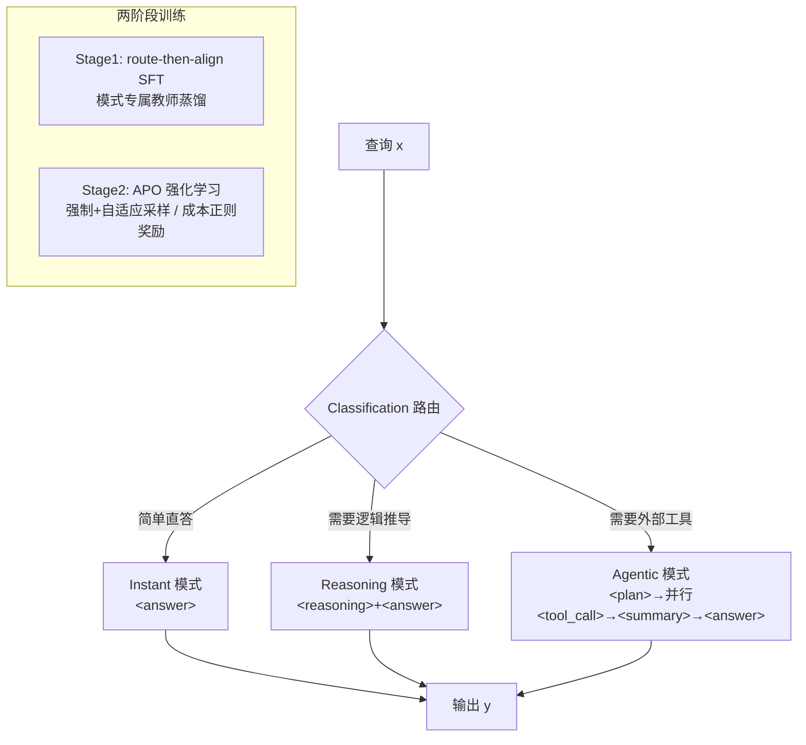

# A$^2$FM: An Adaptive Agent Foundation Model for Tool-Aware Hybrid Reasoning

**会议**: ICLR 2026  
**OpenReview**: [https://openreview.net/forum?id=3kvV1nfWVq](https://openreview.net/forum?id=3kvV1nfWVq)  
**代码**: 待确认  
**领域**: LLM Agent / 混合推理  
**关键词**: 自适应路由, 工具调用, 混合推理, 强化学习, 成本效率  

## 一句话总结
A2FM 在同一个 backbone 里塞进 instant / reasoning / agentic 三种执行模式，先学"该走哪条路"再对齐各模式轨迹，并用一套带成本正则的强化学习（APO）让模型在简单题上少花钱、难题上不掉准，32B 规模上把单次正确答案的成本砍掉约 45%。

## 研究背景与动机
**领域现状**：当下的大模型沿两条岔路演化——以 o3、DeepSeek-R1 为代表的"推理型"模型擅长内部长链思维，却不会调用外部工具；以 GLM-4.5、Kimi K2、OAgents 为代表的"智能体型"模型精于搜索、浏览、代码执行，但在需要多步逻辑推导时往往落后。两类能力互补却割裂。

**现有痛点**：已有的混合系统（如 Qwen3）把推理和工具能力分阶段训练、相互松耦合，推理时缺少一个统一的控制器来决定"这道题到底该想还是该查"；闭源的 GPT-5 虽然能力全面但完全不公开数据与训练管线，无从复现。另一条"何时思考"的工作只在纯文本设定里调节思维链长度，没有把"内部推理 vs 外部行动"的选择纳入考虑，更没考虑工具调用带来的额外延迟和金钱成本。

**核心矛盾**：简单地把多种模式混在一起并不够——模型不仅要保住准确率，还得压低计算成本，而那些处于"边界"的查询既难以正确路由、数据又常常被浪费。简单题上推理型会过度思考、智能体型会过度调用工具，两边都在浪费算力。

**本文目标**：用一个共享 backbone 把三种执行能力统一起来，让模型自己学会"按题选模式"，在准确率与成本之间取得更好的折中。

**核心 idea**：

- **三模式统一（含 instant 兜底）**：在 reasoning 与 agentic 之外补一个 instant 模式，专门直答简单题，从机制上避免对简单输入做无谓的推理或工具调用。
- **route-then-align 训练范式**：监督微调阶段先让模型学会任务感知的路由分类，再在共享策略下对齐各模式专属的轨迹格式。
- **APO 成本正则强化学习**：用一套带成本惩罚的自适应奖励 + 跨模式的强制/自适应采样，鼓励"能 instant 就 instant"，只有确实需要外部证据或更深推理时才升级模式。

## 方法详解

### 整体框架
A2FM 把"决策"拆成两层：一个路由策略 $\pi_{route}(m\mid x)$ 先从模式集合 $M=\{\text{instant},\text{reasoning},\text{agentic}\}$ 里挑一个模式，被选中的模式再由对应的模式策略 $\pi_m(y\mid x)$ 生成轨迹——instant 直接给答案、reasoning 产出思维链、agentic 产出工具交互轨迹。整体优化目标是在任务分布上最大化 $\sum_{m}\pi_{route}(m\mid x)Q_m(x)$，其中 $Q_m(x)$ 是模式 $m$ 在该输入上的期望准确率。落地分两个阶段：Stage 1 做 route-then-align 监督微调打好"会分类 + 会按格式生成"的底子，Stage 2 用 APO 强化学习把路由器调到"准且省"。

### 关键设计

**1. 三模式 + 标签化轨迹：把"该怎么答"显式写进格式。** 模型每次回答都先吐一对 `<classification>` 标签来声明走哪条路，之后按模式各行其是。instant 模式直接在 `<answer>` 里给结论、最小化思考；reasoning 模式先在 `<reasoning>` 里展开思维链再给 `<answer>`；agentic 模式则交替进行高层推理与工具调用。值得注意的是它的 agentic 轨迹在 Agent Foundation Model 基础上重新设计了 Plan 与 Summary 的用法：`<plan>` 只在开头出现一次，把查询拆成可并行执行的多个子目标；`
` 则在过程中动态运作，可以同时聚合已解子任务、终止已完成线程、按需开新线程。轨迹以 `<plan>` 开始，并行执行 N 个工具（各包在 `<tool_call>` 里）、把结果收进 `<tool_response>`，这种显式并行架构让多工具能同时跑，显著提升工具使用的效率与效果。训练时工具返回结果会被 mask 掉（沿用 Search-R1 的做法），让模型专注于推理与路由而非死记工具输出。

**2. route-then-align 监督微调 + 模式专属教师蒸馏。** Stage 1 的核心是让模型先学会把查询分类成三种模式之一，再生成与该模式一致的轨迹——"先路由、后对齐"。数据上用了两个启发式（基于难度的采样调整、对分类模糊查询的特殊处理）来保证训练集既多样又有挑战性。蒸馏时采用互补的"模式专属教师"：reasoning 模式由强推理的 DeepSeek-R1 来教，agentic/instant 模式则由通用能力更广的 DeepSeek-V3.1 来教，让每种模式都从最适合它的老师那里学，从而在共享 backbone 下得到更可靠的对齐。

**3. APO 的双重采样：强制 + 自适应，保证每种模式都被探到。** Stage 2 的 APO 建立在 GRPO 之上，但针对模式选择做了两处关键改造，其一就是 rollout 策略。对每条查询，APO 既做"强制 rollout"也做"自适应 rollout"：强制设定下，通过 prefix injection（在回答开头插入预设的分类标签）把模型按 agentic / reasoning / instant 三种模式各跑 $\rho$ 次，这保证每条查询都在所有模式下被探索过，从而能无偏地估计各模式的相对成功率——这正是后面自适应奖励的数据基础；此外再采 $\gamma$ 次"自适应 rollout"让模型自主选模式，用来奖励正确的自我路由。每组样本数 $G=3\rho+\gamma$，prefix-injection token 和工具返回 token 都不计入 loss（因为不是模型生成的）。论文实现里 $\rho=\gamma=3$，即每条 prompt 12 个 rollout。

**4. 成本正则的自适应奖励：能 instant 就别花冤枉钱。** APO 的第二处改造是奖励设计，总奖励是三项相乘 $r_{total}=r_{acc}\times r_{adaptive}\times r_{format}$，任一项失败（答错、用错模式、格式违规）都会直接把奖励打掉，强约束正确性的同时鼓励效率。准确率项 $r_{acc}=\mathbb{I}[M_j(x,\hat y)=1]$ 用 LLM-as-Judge 给二值判定，避开 F1/EM 这类规则指标无法覆盖开放式输出的问题；格式项 $r_{format}$ 检查输出是否符合所选模式的 schema（比如 instant 里冒出工具标签就判 0）。最关键的是自适应项：若一条查询能被 instant 模式以高于阈值 $\tau$ 的准确率解出，就标记为"简单题"，此时

$$r_{adaptive}=\begin{cases}1-p^{\alpha}, & \text{选了非 instant 模式}\\ 1, & \text{否则}\end{cases}$$

其中 $p$ 是该查询所有强制 rollout 的经验成功率、$\alpha>0$ 是缩放因子。这样一来，简单题上正确用 instant 永远拿满分，而在简单题上动用推理或工具会按"这题本来有多容易被直答"成比例地受罚；对难题则不施加惩罚，优先保证正确性。训练上严格 on-policy、并省去 KL 散度项以加速训练、探索更高效的模式选择。

## 实验关键数据

backbone 为 Qwen2.5-32B-Instruct；SFT 训 3 epoch、max length 32768，APO 训 2 epoch、lr 1e-6、每 prompt 12 rollout（$\rho=\gamma=3$）、$\alpha=2$。基线分通用 LLM、agent 框架、32B agent foundation model 三类。

### 主实验

| 类别 | Benchmark | A2FM (自适应) | A2FM-best 模式 | 对照最强 |
|------|-----------|--------------|---------------|---------|
| Agentic | XBench-DS | **56.0** | 54.0 | AFM-Search 54.0 |
| Agentic | GAIA | 57.3 | **60.7** (Agentic) | OAgents 58.3 |
| Agentic | BrowseComp | 13.4 | 14.4 (Agentic) | DeepDive 14.8 |
| Reasoning | MATH500 | 95.0 | 95.2 | o1 96.4 |
| Reasoning | AIME24 | **74.5** | 74.5 | o1 74.3 |
| Reasoning | AIME25 | 70.4 | 70.4 | o1 79.2 |
| General | GPQA-d | 63.1 | 67.7 (Agentic) | Claude4 68.3 |
| General | SuperGPQA | 54.7 | 56.0 (Agentic) | Claude4 55.7 |
| General | HLE | 16.7 | **20.6** (Agentic) | QwQ 8.2 |

亮点：AIME24 上以 74.5% 创 32B 新 SOTA，比 Claude 4 Sonnet 高 +33.3 分；HLE 上 agentic 变体 20.6% 超第二名（QwQ 8.2%）足足 +12.4 分；GPQA-d / SuperGPQA 相对 Qwen2.5-32B 基座分别提升 +13.6 / +15.9 分。

### 成本效率（SuperGPQA, cost-of-pass）

| 模式 | 每正确答案成本($) | 相对降幅 |
|------|------------------|---------|
| Reasoning | 0.00889 | — |
| Agentic | 0.00732 | -17.6% |
| **Adaptive** | **0.00487** | **-45.2% vs 推理 / -33.5% vs 智能体** |

自适应执行每道正确答案的成本约为纯推理执行的一半。

### 消融与路由分析

| 实验 | 结果 |
|------|------|
| APO 自适应奖励消融 (SuperGPQA) | 去掉自适应奖励：score 55.6 / instant 占比 50.2%；加上后：score 54.7 / instant 占比 58.6%——准确率仅降 0.9，instant 使用大增 |
| 路由准确率 vs 人工标注 | GAIA 92.2% / BrowseComp 94.0% / AIME24 100% |
| 难度自适应 (SuperGPQA) | 简单题 instant 占 61.1%，难题降到 8.3%；instant 准确率全程稳定在 ~55% |
| Pareto 收敛 | 收敛时 53.8% 准确率 / 77.1% 非 instant，对比 "Best Mode" oracle (55.4% / 100%)：准确率仅差 1.6 分，非 instant 触发降 22.9 分 |

### 关键发现
- 路由失败极少：GAIA 上 44 个错误里只有 5 个是路由错，其余 39 个都来自所选模式内部的执行失误；混淆矩阵显示 reasoning↔agentic 几乎不互相误判，路由错误几乎全是"过早选 instant"或"对简单题不必要地调工具"。
- AIME 全部被路由进 reasoning 模式，自适应与强制 reasoning 结果完全一致，说明路由器对纯推理任务判别稳健。

## 亮点与洞察
- **把"要不要思考/要不要用工具"做成了模型内生的统一决策**，而不是外挂一个二值开关或分阶段训练，第一次在共享 backbone 下同时统辖直答、推理、工具三种行为。
- **instant 模式是被低估的关键拼图**：它不仅省成本，更是自适应奖励能成立的锚点——"这题 instant 能不能解"直接定义了简单/难题边界。
- **成本正则奖励 + 强制采样估成功率** 的组合很巧妙：先用强制 rollout 无偏估出每模式成功率 $p$，再用 $1-p^\alpha$ 把惩罚和"这题有多容易"挂钩，避免一刀切惩罚。
- 评估用 cost-of-pass（每正确答案的美元成本）而非单纯 token 数，把效率讨论拉到了更贴近部署的维度。

## 局限与展望
- 自适应模式相比"强制最佳模式"仍有约 1.6 分的准确率缺口（GAIA 上自适应 57.3 vs agentic 60.7），路由分类噪声是主要来源，边界查询的路由仍有提升空间。
- 实验只在 Qwen2.5-32B-Instruct 单一 backbone、32B 单一规模上验证，跨规模/跨基座的可迁移性未知。
- 依赖 LLM-as-Judge 提供准确率信号，judge 模型本身的偏差可能传导进奖励；强制 rollout（每 prompt 12 次、含三模式各跑 $\rho$ 次）带来的训练采样开销较大。
- instant 模式准确率稳定在 ~55%，对真正困难但被误判为简单的查询仍有"过早直答"的风险。

## 相关工作与启发
- **长度感知方法**（RL 长度正则 / SFT 思维链压缩）只在纯文本里缩短 CoT，A2FM 把这条思路推广到了"推理 vs 行动"的更大选择空间。
- **能力感知路由 / when-to-think**（如 LHRM、BPO）大多用线性探针 + 二值策略判断难度，且缺乏 agentic 工具集成；A2FM 把路由从二值升级成三模式，并补上工具能力。
- agentic 轨迹设计借鉴 Agent Foundation Model，但把 Plan/Summary 改造成支持并行多工具执行；工具输出 mask 沿用 Search-R1；强化学习骨架基于 GRPO 但去 KL、加成本正则。
- 启发：对任何"既要效果又要省钱"的 agent 系统，"先用强制探索估各路线成功率、再用成本正则奖励校准默认行为"是一个可复用的范式。

## 评分
- 新颖性: ⭐⭐⭐⭐ 三模式统一 + route-then-align + 成本正则的 APO 组合新颖，尤其 instant 模式与自适应奖励的耦合设计有巧思。
- 实验充分度: ⭐⭐⭐⭐ 覆盖 agentic/reasoning/general 三类共 10 个 benchmark，含成本效率、路由准确率、Pareto 收敛、奖励消融等多维分析；但只在单一 backbone/规模上验证。
- 写作质量: ⭐⭐⭐⭐ 动机清晰、方法分层明确、图表（模式分配/cost-of-pass/混淆矩阵）支撑到位。
- 价值: ⭐⭐⭐⭐ 在准确率不掉的前提下把单次正确成本砍掉约 45%，对真实部署的混合 agent 系统有直接参考价值。

<!-- RELATED:START -->

## 相关论文

- [\[ICLR 2026\] Empowering LLM Tool Invocation with Tool-call Reward Model](empowering_llm_tool_invocation_with_tool-call_reward_model.md)
- [\[ICLR 2026\] Exploratory Memory-Augmented LLM Agent via Hybrid On- and Off-Policy Optimization](exploratory_memory-augmented_llm_agent_via_hybrid_on-_and_off-policy_optimizatio.md)
- [\[ICLR 2026\] Nemotron-Research-Tool-N1: Exploring Tool-Using Language Models with Reinforced Reasoning](nemotron-research-tool-n1_exploring_tool-using_language_models_with_reinforced_r.md)
- [\[ICLR 2026\] GTool: Graph Enhanced Tool Planning with Large Language Model](gtool_graph_enhanced_tool_planning_with_large_language_model.md)
- [\[AAAI 2026\] History-Aware Reasoning for GUI Agents](../../AAAI2026/llm_agent/history-aware_reasoning_for_gui_agents.md)

<!-- RELATED:END -->
