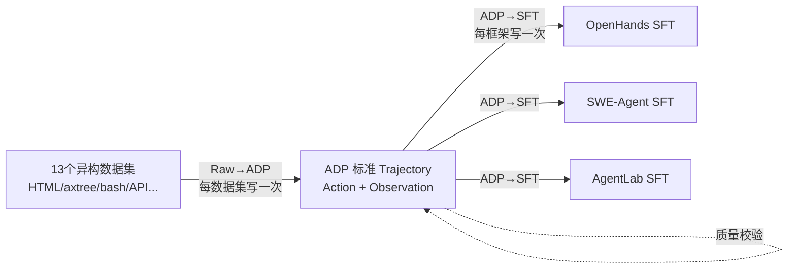

# Agent Data Protocol: Unifying Datasets for Diverse, Effective Fine-tuning of LLM Agents

**会议**: ICLR 2026  
**OpenReview**: [https://openreview.net/forum?id=tG6301ORHd](https://openreview.net/forum?id=tG6301ORHd)  
**代码**: [https://agentdataprotocol.com](https://agentdataprotocol.com)  
**领域**: LLM Agent / Agent SFT / 数据标准化  
**关键词**: Agent Data Protocol, 智能体微调, 数据统一表示, 跨任务迁移, SWE-Bench, WebArena  

## 一句话总结
提出一种轻量的「智能体数据中间语言」ADP，把 13 个格式各异的智能体训练集统一成同一套 Trajectory/Action/Observation 模式，再分发到不同 agent 框架做 SFT，平均比 base 模型涨约 20%，在编码/浏览/工具使用等任务上达到 SOTA 或接近 SOTA。

## 研究背景与动机
- **领域现状**: LLM 预训练有取之不尽的互联网数据，但 agent 后训练（SFT）需要记录多步交互轨迹，远比静态输入-输出对难收集。社区其实已经积累了大量 agent 数据集（人工标注、合成生成、agent rollout 录制），覆盖网页导航、软件工程、工具调用等。
- **现有痛点**: 大规模 agent SFT 在学术界依旧罕见，瓶颈不是缺数据，而是**缺标准化**。每个数据集都有自己的格式、动作空间、观测结构（有的网页用 HTML、有的用 accessibility tree），导致数据集之间无法拼接、共享、复用，分散闲置。
- **核心矛盾**: 想把 $D$ 个数据集喂给 $A$ 个 agent 框架，传统做法要为每个「数据集×框架」对各写一个 Raw→SFT 转换器，工程量是二次方 $O(D\times A)$，重复劳动严重，集成脆弱缓慢。
- **本文目标**: 提供一个足够表达力、又简单可解析的统一表示，让任何数据集只需转一次、任何框架只需写一个转换脚本，就能即插即用地共享整个数据池。
- **核心 idea**: **【中间语言 hub-and-spoke】** 引入 ADP 作为 agent 数据集与训练管线之间的「interlingua」，把多对多转换坍缩成「Raw→ADP→SFT」的轮辐式管线，工程量从二次方降到线性 $O(D+A)$。

## 方法详解

### 整体框架
ADP 用 Pydantic schema 把任意 agent 轨迹抽象成一个 `Trajectory` 对象——本质洞察是：尽管表面千差万别，绝大多数 agent 交互都能拆解为「智能体发出的动作 (Action) + 环境返回的观测 (Observation)」的交替序列。整条管线分三步：原始数据→ADP 标准格式、ADP→各框架 SFT 格式、自动化质量校验。

### 关键设计

**1. 统一 Trajectory 模式：用三类动作 + 两类观测覆盖全谱系任务。** ADP 把每条轨迹表示为 `Trajectory(id, content, details)`，其中 `content` 是动作-观测交替序列。动作分三类——`APIAction`（含 `function`/`kwargs`/`description`，刻画工具调用，如把网页导航 `goto(url=google.com)` 表示成 `APIAction(function=goto, kwargs={url:...})`）、`CodeAction`（含 `language`/`content`，刻画代码生成执行）、`MessageAction`（自然语言沟通）。观测分两类——`TextObservation`（带 `source` 区分 user/environment 的文本反馈）和 `WebObservation`（含 `html`/`axtree`/`url`/`viewport`/可选截图，支撑复杂浏览场景）。这套最小但完备的原语，把 web、coding、SWE、tool use 统一到同一语义空间，使原本不兼容的数据集得以拼接。

**2. 双向转换管线，职责彻底解耦。** 管线拆成两个方向：Raw→ADP 把每个数据集的私有动作/观测映射到 ADP 标准空间（**每个数据集只做一次**，之后它就成了任何框架都能用的标准资源）；ADP→SFT 把标准轨迹翻译成具体框架的 scaffolding、系统提示、上下文管理与对话格式（**每个框架只维护一个脚本**，新增数据集无需改动 agent 侧代码）。这正是把成本从 $O(D\times A)$ 压到 $O(D+A)$ 的关键——论文实测 13 个数据集的 Raw→ADP 共约 4892 LOC，而三个框架的 ADP→SFT 平均仅约 77 LOC（OpenHands ~150、SWE-Agent ~50、AgentLab ~30）。若要服务 $A=100$ 个框架，无 ADP 需约 $100\times4892\approx489{,}200$ LOC，有 ADP 仅需 $4892 + 100\times77$ LOC 量级。

**3. 自动化质量校验保证可训练性。** 转换不是简单 reformat，第三步会做严格自动校验：检查工具调用格式是否合法、大多数（阈值设为 80%，可调）工具调用是否配有英文 thought 解释、对话是否正常结束等。这保证了合并后的百万级语料在格式与语义上的一致性，避免脏数据污染 SFT。基于这套管线，作者把 13 个数据集统一并采样平衡（大集下采样、小集全用）后，发布了目前最大的公开 agent 训练集 ADP Dataset V1，含约 1.3M 条轨迹。

## 实验关键数据

### 主实验表格（Best 7–8B ADP-trained agents，节选）

| 基准 | Agent 框架 | 模型 | 训练数据 | 准确率 |
|---|---|---|---|---|
| SWE-Bench Verified | SWE-Agent | Qwen2.5-7B-Coder | — / ADP | 0.4% → **20.2% (+19.8%)** |
| SWE-Bench Verified | OpenHands | Qwen2.5-7B-Coder | — / ADP | 2.8% → **20.4% (+17.6%)** |
| WebArena | AgentLab | Qwen2.5-7B-Coder | — / ADP | 4.5% → **21.0% (+16.5%)** |
| AgentBench OS | OpenHands | Qwen2.5-7B-Coder | — / ADP | 3.5% → **27.1% (+23.6%)** |
| GAIA | OpenHands | Qwen2.5-7B | — / ADP | 7.3% → **9.1% (+1.8%)** |

随规模放大增益保持：32B 在 SWE-Bench 用 SWE-Agent 达 **40.3% (+38.1%)**，匹敌甚至超过 Claude 3.5 Sonnet 的 33.6%；OpenHands 上 36.8% (+26.2%)。整体平均比 base 涨约 20%。

### 消融实验表格（跨任务迁移：多样数据 vs 单任务数据）

| 基准 | 模型 | 单任务训练 | ADP 多样数据 |
|---|---|---|---|
| SWE-Bench | Qwen2.5-7B-Instruct | SWE-smith Only 1.0% | **10.4%** |
| SWE-Bench | Qwen3-8B | SWE-smith Only 11.0% | **16.6%** |
| WebArena | Qwen2.5-7B-Instruct | Go-Browse Only 16.0% | **20.1%** |
| AgentBench OS | Qwen3-8B | AgentInstruct Only 21.5% | **25.7%** |
| GAIA | Qwen2.5-7B-Instruct | AgentInstruct Only 0.6% | **9.1%** |

### 关键发现
- **跨任务正迁移**: 混合多域 ADP 语料不仅在目标任务上优于单域微调，还**避免了单域微调常引发的负迁移**（在其他任务上掉点）。
- **跨数据集分析能力**: 统一表示后可量化分析——13 个数据集平均 10.1 轮交互（1～26.8 不等，SWE 类最长）；动作分布呈明显领域偏好（web 偏 API 动作、coding 偏 code 动作、SWE 混合）；多数数据集 function thought 覆盖率 ≥90%，说明「带推理解释」是良好标注数据集的普遍特征。
- **工程成本**: ADP→SFT 平均仅约 77 LOC，新框架接入即可解锁整个数据池。

## 亮点与洞察
- **抓住了真问题**: 把「agent SFT 罕见」从「缺数据」重新定位为「缺标准化」，并用一个工程上极简的 interlingua 解决，定位精准。
- **二次方→线性**: hub-and-spoke 的成本论证清晰，LOC 实测数据让「省工程量」不再是口号。
- **副产品价值高**: 统一表示顺带带来跨数据集量化分析能力，以及目前最大的公开 agent 训练集（1.3M 轨迹），社区可直接复用。
- **泛化性强**: 同一套语料无需领域定制，就在 coding/browsing/tool use/research 四类基准、3 个框架、7B~32B 三种规模上一致涨点。

## 局限与展望
- **表达力边界**: 当前 Action/Observation 原语主要面向文本、代码、网页，多模态（如纯视觉 GUI 控制、机器人物理交互）的表达是否无损仍需验证。
- **依赖原始标注质量**: ADP 只做格式统一，无法凭空提升底层数据质量；rollout 类数据仍受限于采集时 baseline agent 的能力上限。
- **采样混合权重的影响**: 平衡采样（大集下采样）的具体配比对结果影响较大，论文放在附录，最优混合策略仍是开放问题。
- **校验阈值经验化**: 80% function-thought 覆盖率等阈值为人工设定，跨数据集是否最优未充分探究。

## 相关工作与启发
- **与已有标准化努力的区别**: 此前 Zhang et al. 2024、Chen et al. 2024 等也尝试数据标准化，但多是任务专属或 agent 专属的统一，ADP 主打**社区级、与框架无关**的表示标准。
- **数据中心 AI 的范式**: 延续「数据比模型更稀缺」的 agent 训练观，把精力投在数据基础设施而非新架构上。
- **启发**: 任何「多生产者×多消费者」且格式碎片化的场景（如多模态指令数据、RL 轨迹、评测协议），都可借鉴这种「中间语言 + 双向转换器 + 自动校验」的轮辐式架构来摊薄工程成本。

## 评分
- **新颖性**: ⭐⭐⭐⭐ 思路简单但定位精准，把数据标准化做成社区级 interlingua，是被低估但很实用的方向。
- **实验充分度**: ⭐⭐⭐⭐⭐ 13 数据集 × 4 基准 × 3 框架 × 3 规模全面验证，含跨任务迁移消融与 LOC 成本实证。
- **写作质量**: ⭐⭐⭐⭐ 动机—设计—成本论证—实验链条清晰，图 1/图 2 直观；schema 细节略显堆砌。
- **价值**: ⭐⭐⭐⭐⭐ 开源 1.3M 轨迹的最大公开 agent 训练集 + 标准协议，显著降低大规模可复现 agent SFT 的门槛。

<!-- RELATED:START -->

## 相关论文

- [\[ICLR 2026\] LLMs are Greedy Agents: Effects of RL Fine-tuning on Decision-Making Abilities](llms_are_greedy_agents_effects_of_rl_fine-tuning_on_decision-making_abilities.md)
- [\[ICLR 2026\] Repurposing Synthetic Data for Fine-grained Search Agent Supervision](repurposing_synthetic_data_for_fine-grained_search_agent_supervision.md)
- [\[CVPR 2026\] CGL: Advancing Continual GUI Learning via Reinforcement Fine-Tuning](../../CVPR2026/llm_agent/cgl_advancing_continual_gui_learning_via_reinforcement_fine-tuning.md)
- [\[ICLR 2026\] MCP Security Bench (MSB): Benchmarking Attacks Against Model Context Protocol in LLM Agents](mcp_security_bench_msb_benchmarking_attacks_against_model_context_protocol_in_ll.md)
- [\[ICLR 2026\] Orak: A Foundational Benchmark for Training and Evaluating LLM Agents on Diverse Video Games](orak_a_foundational_benchmark_for_training_and_evaluating_llm_agents_on_diverse_.md)

<!-- RELATED:END -->
