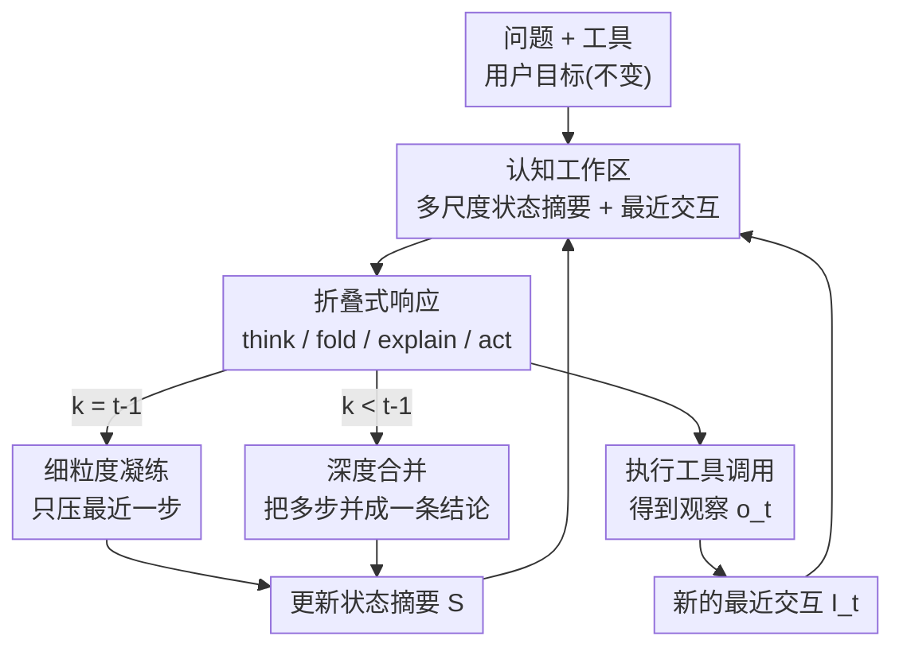

# AgentFold: Long-Horizon Web Agents with Proactive Context Folding

**会议**: ICLR2026  
**OpenReview**: [https://openreview.net/forum?id=IuZoTgsUws](https://openreview.net/forum?id=IuZoTgsUws)  
**代码**: https://github.com/Alibaba-NLP/DeepResearch （模型 AgentFold-30B-A3B-Preview）  
**领域**: LLM Agent / Web Agent  
**关键词**: 上下文折叠, 长程任务, web agent, 认知工作区, 信息检索

## 一句话总结
AgentFold 把 web agent 的上下文当作可主动雕刻的"认知工作区"，每一步在推理时额外输出一个"折叠指令"，对历史轨迹做细粒度凝练或多步深度合并，使 100 轮交互后上下文仅约 7k token；仅 30B 激活 3B 的模型就在 BrowseComp 上拿到 36.2%，超过 671B 的 DeepSeek-V3.1 和 OpenAI o4-mini。

## 研究背景与动机
**领域现状**：基于 LLM 的 web agent 已成为信息检索的新范式，能不知疲倦地搜索、浏览、综合网页信息。当下绝大多数 agent 沿用 ReAct 框架——以"推理-动作-观察"三元组循环迭代，把每一步的完整记录持续追加进上下文。

**现有痛点**：长程任务（动辄几十上百步浏览）暴露出一个根本矛盾，作者称之为"上下文的全面性 vs 简洁性"权衡：

- ReAct 这类 **append-only**（只追加）方法保留了全部信息，但原始网页数据噪声极大，几十步后关键线索被埋没在垃圾里，导致 agent 决策退化、上下文膨胀（100 轮后可达数十万 token）。
- 另一类方法（MEM1、MemAgent 等）走向另一极端：**每一步都把全部历史机械地重新总结一遍**。上下文是干净了，但任何一次总结都可能把当下看似无关、其实后面才需要的细节**不可逆地丢掉**，而且每步重写整个历史会让 KV cache 失效、推理昂贵。

**核心矛盾**：保留细节就会被噪声淹没，压缩噪声又会误删细节。现有方法用**静态、预定义**的上下文策略（要么全留、要么每步全压），无法在"该留什么、该抽象什么、该丢什么"上做出**因时因地**的判断。

**切入角度**：作者从人类认知的"回溯式巩固"（retrospective consolidation）出发——人解决问题既不是把所有信息都背下来，也不是每走一步就刻板地复述一遍，而是在**关键节点回头看**：丢掉无关步骤、提炼中间发现、把已完成的子任务抽象成结论。这种"延迟到子任务结果明朗后再合并"的能力，正是长程推理的关键。

**核心 idea**：把"上下文管理"从被动副产品升级为 agent 一个**可学习的显式动作**——每一步推理时主动输出一个"折叠指令"，在**多个尺度**上雕刻自己的历史轨迹，从而绕开"留噪声"与"丢细节"的二选一。

## 方法详解

### 整体框架
AgentFold 要解决的是：让 web agent 在上百步的长程检索中，上下文始终保持简洁、聚焦、又不丢关键线索。它的整体转法是把上下文显式拆成"长期记忆 + 即时工作记忆"，并让 agent 在每一步推理时**同时**产出一个动作和一个折叠指令，用折叠指令实时改写长期记忆。

具体地，第 $t$ 步给 agent 的上下文是一个四元组 $C_t = (Q, T, S_{t-2}, I_{t-1})$：$Q$ 是不变的用户问题（锚点），$T$ 是可用工具列表，$S_{t-2}$ 是**多尺度状态摘要**（Multi-Scale State Summaries，长期记忆），$I_{t-1}$ 是**最近一次交互**（Latest Interaction，高保真工作记忆）。agent 基于 $C_t$ 生成一个连贯文本，解析为四元组 $R_t = (th_t, f_t, e_t, a_t)$——思考 $th_t$、折叠指令 $f_t$、解释 $e_t$、动作 $a_t$。折叠指令立刻把 $S_{t-2}$ 更新成 $S_{t-1}$；动作执行后得到观察 $o_t$，与解释、动作一起拼成新的 $I_t=(e_t,a_t,o_t)$。如此构成一个 **perceive → reason → fold → act**（感知→推理→折叠→行动）的自调节循环，直到 agent 认为信息足够、给出最终答案。

### 关键设计

**1. 认知工作区：把上下文从"日志"改造成可雕刻的四分区**

针对 ReAct 把上下文当成一摞越堆越高的流水账这一痛点，AgentFold 把上下文显式划分为四个用途分明的部分：① **问题** $Q$ 作为锚点，时刻提醒终极目标；② **工具列表** $T$ 定义可执行的动作空间；③ **多尺度状态摘要** $S$ 作为精炼过的长期记忆；④ **最近交互** $I$ 作为完整无损的即时工作记忆。关键在于第③部分的"多尺度"性质：状态摘要是一串有序摘要块 $S_t = (s_{x_1,y_1}, s_{x_2,y_2}, \dots, s_{x_m,y_m})$，每个 $s_{x,y}$ 是第 $x$ 到 $y$ 步这一连续区间的文本摘要，且这些区间无缝拼接（$x_1=1$，$y_m=t-2$，$x_{i+1}=y_i+1$）。当 $y=x$ 时是某一独立步骤的细摘要，$y>x$ 时则是把多步合并后的粗摘要——同一份记忆里**不同重要性的历史用不同分辨率保存**：关键发现留成细块，无关中间步压成粗块。这样长期记忆既保住了连贯的叙事线，又把噪声压到最低；而最近交互 $I$ 始终保留原始细节，保证当前决策不丢信息。两者一粗一细，正好对应人类"稳定目标 + 巩固知识 + 易变工作记忆"的认知分工。

**2. 折叠指令：一个 JSON 格式统一表达两种尺度的上下文操作**

这是方法的核心机制，专门解决"全留 vs 全压"的二选一。折叠指令 $f_t$ 是一个 JSON 对象 $f_t = \{\text{range}: [k, t-1],\ \text{summary}: \sigma_t\}$，其中 $k$ 是折叠的起始步 ID，$\sigma_t$ 是 agent 自己生成的替换摘要文本。这个单一格式靠 $k$ 的取值同时支持两种模式：

- **细粒度凝练（Granular Condensation）**：当 $k = t-1$，只把最近一次冗长的交互压成一个紧凑摘要块（如 `[Compressed Step 5] 发现新候选 XYZ，需进一步探索`），其余历史原封不动。它服务于增量推进，以最高分辨率保留轨迹。
- **深度合并（Deep Consolidation）**：当 $k < t-1$，把最近交互连同一串之前的摘要块一起**收回**，融合成一条更粗尺度的结论块（如 `[Compressed Step 5 to 9] 查了多个来源后确认 XYZ 不满足全部条件`）。它专治"某个子调查已经做完、过程细节不再重要"的情形——比如 agent 花了十几步验证一个事实、踩了一堆失败的网页和报错，深度合并允许它把这整段冗长序列抽象成一句结论。

形式上，该指令把 $S_{t-2}$ 变成 $S_{t-1}$：撤回所有落在区间 $[k, t-1]$ 内的摘要块，替换成单个新块 $s_{k,t-1} = \sigma_t$。与每步全量总结的根本区别在于，AgentFold **可以延迟合并**，等到子任务结果明朗了再决定怎么折叠，从而做出更有信息量、不短视的取舍。

**3. 折叠式响应：把"管理上下文"内化为推理的一部分，形成自调节回路**

针对"上下文管理是被动副产品"的痛点，AgentFold 让每一步的响应不是单一命令，而是 $R_t = (th_t, f_t, e_t, a_t)$ 四元组。$th_t$ 是详细的思维链，agent 在此**同时**权衡"接下来做什么动作"和"如何折叠历史"；由这段内部斟酌派生出折叠指令 $f_t$、解释 $e_t$（动作动机的精炼）和动作 $a_t$（工具调用或最终答案）。作者强调这两件事会产生**认知协同**：被要求写出折叠指令，逼着 agent 批判性回看轨迹、提炼最显著的信息，这种反思本身就让它对当前状态理解得更透、下一步动作更准；反过来，规划下一步动作又迫使它审视近期历史找关键线索，而"什么当下相关"恰恰是"什么值得折叠保留"的实时信号。行动与反思的这种紧耦合，构成一个**自我调节的循环**，同时提升动作质量和记忆连贯性。第一步是特例——没有历史，故省略折叠指令。

**4. Fold-Generator 数据合成与 SFT：把脆弱的 prompt 技巧炼成稳健的内生能力**

训练 AgentFold 需要一种现实中不存在的数据：既展示了情境化动作、又展示了策略性上下文管理的轨迹。作者发现即便最强的 LLM 也无法仅靠 prompt 稳定产出这种结构化多段响应，于是构建 **Fold-Generator** 数据流水线：用 GLM-4.5、DeepSeek-V3.1 等高指令遵循能力的开源大模型驱动，沿用 WebSailor 的同一问题集以便公平对比，再用**拒绝采样**严格过滤——凡是格式不合规、工具参数异常、结尾错误或环境报错过多的步骤/轨迹一律丢弃，并对工具调用少于 10 次的轨迹下采样。最终得到一批高质量的 $\{(C_t, R_t^*)\}$ 上下文-黄金响应对，对开源 LLM（Qwen3-30B-A3B-Instruct-2507）做常规 SFT。这一步的意义不只是实现细节：它把"折叠"从依赖 prompt 的脆弱指令变成内化进权重的稳健技能，并把"生成-过滤"这种计算密集策略蒸馏进单次前向，使最终模型推理时既能干又高效。

### 损失函数 / 训练策略
训练目标就是标准监督微调（SFT）：在 Fold-Generator 产出的上下文-响应对上，教模型用一次前向直接生成完整的结构化输出（思考+折叠+解释+动作）。基座为 Qwen3-30B-A3B（总 30B、激活 3B），最大工具调用数设为 100，超出则强制终止。作者明确表示本文仅用直白的 SFT、未做强化学习等深度优化，把进一步提升留作后续工作。

## 实验关键数据

### 主实验
评测覆盖 3 个信息检索基准（BrowseComp、BrowseComp-ZH、WideSearch-en 的 Item-F1）+ 1 个通用基准（GAIA 纯文本子集），少于 200 样本的取 3 次平均。

| 基准 | 指标 | AgentFold-30B-A3B | DeepSeek-V3.1-671B | OpenAI o4-mini | OpenAI o3 |
|--------|------|------|----------|------|------|
| BrowseComp | Acc | **36.2** | 30.0 | 28.3 | 49.7 |
| BrowseComp-ZH | Acc | 47.3 | **49.2** | 44.3 | 58.1 |
| WideSearch | Item-F1 | **62.1** | - | - | 60.0 |
| GAIA | Acc | 67.0 | 63.1 | - | 70.5 |

关键看点：仅 30B/激活 3B 的 AgentFold 在 BrowseComp 上以 36.2% 超过 671B 的 DeepSeek-V3.1（30.0%）和 OpenAI o4-mini（28.3%），WideSearch 上 62.1% 更是超过包括 o3、Claude-4-Sonnet 在内的所有专有 agent；体量相差约 20 倍仍占优，说明上下文管理能弥合与超大模型的差距。仅在 BrowseComp-ZH 上略逊 671B 的 DeepSeek-V3.1。

### 上下文动态分析（相当于消融/机制验证）
作者在 BrowseComp 上采样 200 条轨迹分析上下文行为，并把 AgentFold 与 ReAct 直接对比：

| 配置 / 现象 | 关键指标 | 说明 |
|------|---------|------|
| AgentFold token 增长 | 100 轮后 ≈7k token | 从约 3.5k 亚线性增长到 7k，仅占 128k 容量的极小部分 |
| ReAct token 增长 | 第 100 轮比 AgentFold 多 ≈84k token（92%） | 近线性失控增长，每实例约多耗 7GB 显存 |
| 块数（block count） | 亚线性 vs ReAct 线性 | 深度合并把多步并成单块，结构始终简单可控 |
| 扩展交互轮数 | 256 轮仍持续涨点 | 30B 的 AgentFold 在各轮数上限都超过 355B 的 GLM-4.5 |

### 关键发现
- **折叠机制是上下文不膨胀的直接原因**：token 数 100 轮才从 3.5k 翻倍到 7k，而 ReAct 同期多出约 84k token，省下近 7GB 显存——长程任务上效率优势随轮数复利式扩大。
- **超长程扩展能力**：GLM-4.5（355B）的 append-only 上下文在 64 轮后饱和、性能停滞甚至下滑，而 AgentFold 的准确率一路涨到 256 轮仍在提升，证明主动上下文管理是解锁长程任务的关键。
- **失败也能被有用地折叠**：案例研究（第 17 步）显示，agent 把第 6–16 步一整段失败尝试深度合并成一句"此路不通"的结论，剪掉噪声细节、保留教训，随即换方向重新规划检索——展示了它对自身轨迹推理、从长串失败中学习的能力。
- **KV cache 友好**：因为更新局部化在折叠操作上，细粒度凝练时第 1~$t-2$ 步前缀完全不变、cache 可全复用；深度合并虽缩短可复用前缀，但大幅压短总长、降低后续显存底线——比每步重写全历史的方法高效得多。

## 亮点与洞察
- **把"上下文工程"变成可学习的一等动作**，这是最让人"啊哈"的点：以往上下文压缩要么是固定策略、要么靠外挂记忆模块，AgentFold 直接让 agent 在推理时输出折叠指令，把"该记什么、该抽象什么、该忘什么"交给模型自己学，从静态策略跃迁到"自我感知的知识管理者"。
- **一个 JSON 字段（range 的起点 $k$）统一两种尺度操作**的设计很巧妙：$k=t-1$ 是细压、$k<t-1$ 是深合并，无需两套接口，格式简洁又表达力强，便于 SFT 学习。
- **延迟合并**这一点直击全量总结方法的软肋——等子任务结果明朗再折叠，避免了"过早不可逆删除细节"，这个思路可迁移到任何需要长程记忆压缩的 agent（如代码 agent、研究助手）。
- **prefix-preserving 与 KV cache 复用**把"上下文管理"和"推理效率"绑到一起，不是单纯省 token，而是连带省显存、省重算，工程价值很实。

## 局限与展望
- 作者承认本文只用了直白的 SFT、未做 RL 等深度优化，折叠策略的上限可能远未触及——这是最明显的留白。
- 100 轮上限下仍有超过 20% 任务被强制终止（多记为失败），而此时上下文才约 7k token、远未用满 128k——说明失败更多受限于交互轮数预算而非上下文容量，简单放宽轮数或许就能涨点，但论文因时间所限把详细探索留给未来。
- 折叠指令完全由模型自行决定 $k$ 和摘要内容，一旦它误判把仍有用的细节深度合并掉，错误同样不可逆；论文未系统量化这种"误折叠"的发生率与代价。
- 横向比较需谨慎：不同 agent 的工具、数据集、轮数预算不完全可比，BrowseComp 等基准上的高低不宜直接当作模型能力的绝对排序。

## 相关工作与启发
- **vs ReAct 类（WebSailor / WebDancer / WebThinker 等）**：它们 append-only 累积全部历史，信息完整但长程必然上下文饱和、噪声淹没信号；AgentFold 主动折叠，保留信息完整性的同时把噪声压掉，本质是在 ReAct 的"只追加"上增加了"可回收"。
- **vs 每步全量总结（MEM1 / MemAgent）**：它们用刻板的逐步压缩策略、且主要在 HotpotQA 这类较简单检索任务上验证，风险是单次总结就误删关键细节、且每步重写历史让 KV cache 失效；AgentFold 用灵活的"回看"机制、在不同尺度上选择性折叠多步交互，更适合复杂长程任务，且前缀大多可保留、cache 友好。
- **vs 外部上下文增强（注入用户画像 / 历史对话的记忆系统）**：那一类是 Intra-Task 之外引入外部知识；AgentFold 聚焦 **Intra-Task Context Curation**——只管理任务自身产生的上下文，目标是长程内的相关性与效率，两者正交、可互补。

## 评分
- 新颖性: ⭐⭐⭐⭐⭐ 把上下文管理升级为可学习的显式动作、用多尺度折叠绕开"留噪声 vs 丢细节"二选一，范式层面的创新
- 实验充分度: ⭐⭐⭐⭐ 多基准 + token/block/轮数扩展 + 案例研究较完整，但缺 RL 对比与"误折叠"量化
- 写作质量: ⭐⭐⭐⭐⭐ 动机与机制讲得清晰，认知工作区的类比贴切，公式与案例配合到位
- 价值: ⭐⭐⭐⭐⭐ 30B 超 671B、支持 500+ 轮且 cache 友好，对长程 web agent 的实用与启发价值都很高

<!-- RELATED:START -->

## 相关论文

- [\[ICML 2026\] ACON: Optimizing Context Compression for Long-horizon LLM Agents](../../ICML2026/llm_agent/acon_optimizing_context_compression_for_long-horizon_llm_agents.md)
- [\[ACL 2026\] OCR-Memory: Optical Context Retrieval for Long-Horizon Agent Memory](../../ACL2026/llm_agent/ocr-memory_optical_context_retrieval_for_long-horizon_agent_memory.md)
- [\[CVPR 2026\] WebGym: Scaling Training Environments for Long-Horizon Visual Web Agents with Realistic Tasks](../../CVPR2026/llm_agent/webgym_scaling_training_environments_for_long-horizon_visual_web_agents_with_rea.md)
- [\[ICLR 2026\] AgentGym-RL: An Open-Source Framework to Train LLM Agents for Long-Horizon Decision Making via Multi-Turn RL](agentgym-rl_an_open-source_framework_to_train_llm_agents_for_long-horizon_decisi.md)
- [\[ICLR 2026\] MEM1: Learning to Synergize Memory and Reasoning for Efficient Long-Horizon Agents](mem1_learning_to_synergize_memory_and_reasoning_for_efficient_long-horizon_agent.md)

<!-- RELATED:END -->
