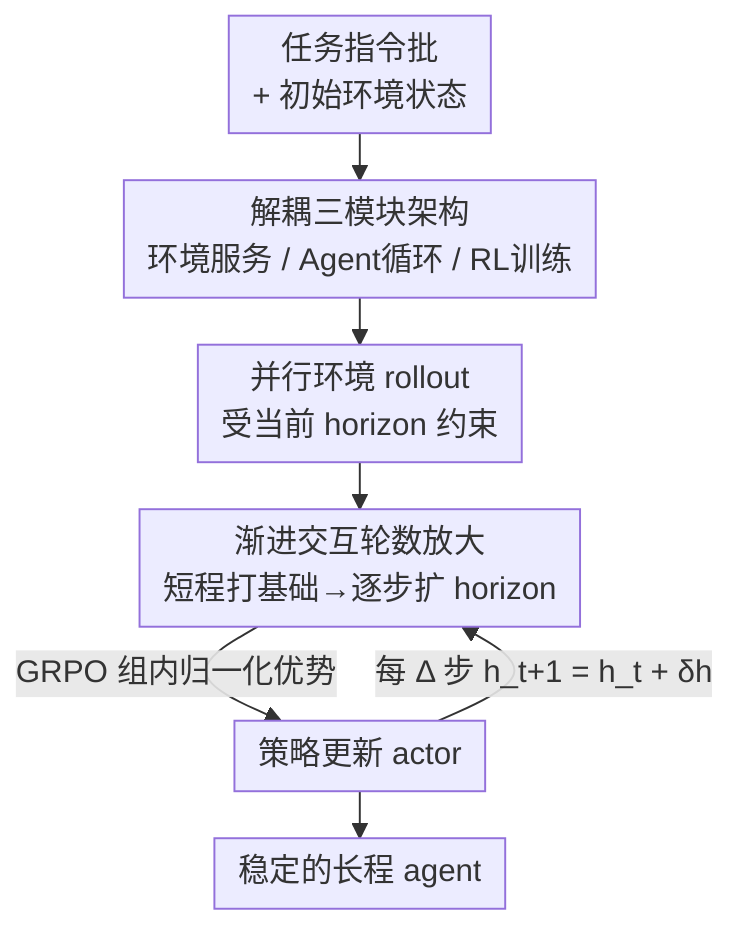

# AgentGym-RL: An Open-Source Framework to Train LLM Agents for Long-Horizon Decision Making via Multi-Turn RL

**会议**: ICLR2026  
**OpenReview**: [https://openreview.net/forum?id=ZgCCDwcGwn](https://openreview.net/forum?id=ZgCCDwcGwn)  
**代码**: https://github.com/WooooDyy/AgentGym-RL  
**领域**: Agent / 强化学习 / LLM 训练  
**关键词**: LLM Agent、多轮强化学习、长程决策、交互式环境、课程学习

## 一句话总结
本文开源了一个解耦的多轮强化学习框架 AgentGym-RL，能在 Web 导航、深度搜索、数字游戏、具身控制、科学任务五大真实场景里从零训练 LLM agent，并提出 ScalingInter-RL——一种"先短程后长程"逐步放大交互轮数的分阶段训练法，让 7B 模型在 27 个任务上追平甚至超过 OpenAI o3、Gemini-2.5-Pro。

## 研究背景与动机
**领域现状**：LLM 的应用已经从聊天机器人扩展到能处理长程真实世界决策任务的自主 agent。要让 agent 像人一样"在与环境的主动交互中习得新技能"，强化学习（RL）是最自然的路径——它在 LLM 推理（o1、DeepSeek-R1）上已经验证了威力。学界也开始把 RL 搬到多轮交互 agent 上。

**现有痛点**：但开源社区一直缺一个统一的 RL 框架，能在"多样且真实"的环境里把 agent 从零训出来。已有的工作要么任务复杂度有限、要么环境种类单一，很难支撑系统的 agentic RL 研究。此外作者发现一个更微妙的工程难题：直接用大交互预算（比如允许 10 轮交互）去训长程 agent，训练极不稳定，经常崩溃，模型会陷入冗余、重复的无效动作。

**核心矛盾**：长程交互能力是解决复杂任务的关键，但长程交互预算和训练稳定性之间存在直接的 trade-off——交互轮数大了探索更深但训练崩溃，轮数小了稳定但能力被天花板封死。同时，能力增长真正的瓶颈是"与环境的外部交互"（external interaction），而不只是模型内部的链式推理（internal reasoning）。

**本文目标**：分解为两个子问题——(1) 提供一个模块化、可扩展、覆盖多种真实场景的统一 agentic RL 框架；(2) 设计一种能稳定地把交互轮数 scale 上去的训练策略。

**切入角度**：作者从一个观察出发：基线模型在测试时增大交互轮数，性能会先涨后平台化（plateau），说明它们缺乏靠长程交互解决复杂任务的能力；而训练时若一上来就放大轮数则会崩溃。既然短程稳定、长程能力强，那就别二选一，让交互预算随训练"从短到长"渐进生长。

**核心 idea**：用一个统一解耦的 agentic RL 框架（AgentGym-RL）打底，再叠加一种课程式的交互轮数渐进放大策略（ScalingInter-RL）——先短程交互打基础策略、再逐步扩大 horizon 鼓励深度探索，兼得稳定与长程能力。

## 方法详解

### 整体框架
AgentGym-RL 把一个 agentic RL 系统拆成三个职责清晰、互相解耦的模块：**环境模块**负责把每个环境封装成独立服务、对外暴露 `/observation`、`/available_actions`、`/step`、`/reset` 等 HTTP API；**Agent 模块**封装 LLM 的"推理-动作"循环，接收观察、多轮推理、输出动作（如调用环境 API）；**训练模块**提供统一的 RL pipeline，管理轨迹采集、优势估计、策略优化、奖励塑形的整个生命周期，同时支持在线（PPO/GRPO/RLOO/REINFORCE++）与离线（SFT/DPO/self-improvement）算法。这种 server-client 解耦让"换环境、换算法、换 backbone"变成即插即用。

任务本身被建模成一个部分可观测马尔可夫决策过程（POMDP）$(U, S, A, O, T, r)$：给定指令 $u \in U$，agent 按策略 $\pi_\theta$ 生成动作序列 $a_k \sim \pi_\theta(\cdot|s_k)$，环境返回观察 $o_k$ 并转移状态 $T(s_k, a_k) = s_{k+1}$，经过 $N$ 轮交互后给出一个结果奖励 $r(\tau) \in [0,1]$。训练目标是标准的策略梯度期望回报 $J(\theta) = \mathbb{E}_{\tau \sim \pi_\theta}[r(\tau)]$。

在这个框架之上，本文的训练算法贡献是 **ScalingInter-RL**：它不改 RL 算法本身，而是在 rollout 时给"交互轮数上限"挂一个随训练步数单调递增的课程表，把短程稳定与长程探索串成一条流水线。整体流转是：批量任务 → 并行环境客户端 rollout（受当前 horizon 约束）→ 计算优势（GRPO）→ 更新 actor → 每隔 $\Delta$ 步放大一次 horizon → 循环。

### 关键设计

**1. 解耦的环境-Agent-训练三模块架构：让 agentic RL 变成即插即用**

痛点直接来自"开源社区缺统一框架"——以往做 agentic RL，环境、agent、算法往往耦合在一起，换一个环境就要重写训练代码。AgentGym-RL 把三者彻底解耦：每个环境是一个独立服务（可部署多副本支持并行请求），通过 HTTP 与 client 通信，只暴露 `/observation`、`/step`、`/reset` 这种标准 API；agent 模块只管"看观察、推理、出动作"；训练模块只管 RL 生命周期。新环境通过继承基类即可接入，新 RL 算法在统一接口下切换。这样做的好处是把"系统工程"和"算法研究"剥离开，研究者能在同一套基建上公平对比不同算法/环境，也是它能一口气覆盖五大异构场景的前提。

**2. 五大异构真实场景：用跨域差异性逼出真正会决策的 agent**

很多 agent benchmark 任务单一、环境同质，训出来的 agent 泛化性可疑。AgentGym-RL 刻意纳入五类差异极大的环境：WebArena（Web 导航）、RAG-based 环境（深度搜索）、TextCraft（数字游戏）、BabyAI（具身控制）、SciWorld（科学任务）。它们在状态空间、动作空间、奖励结构上差异巨大——有的规则清晰、因果直接（TextCraft/BabyAI/SciWorld），有的开放、反馈噪声大（WebArena/Deep Search）。这种跨域异构本身就是一个训练+评测的试金石，迫使框架（和被训的 agent）不能靠某一类环境的捷径取巧。论文也据此得出洞察：RL 在规则清晰的模拟世界里收益最大（SciWorld 从 1.50% 飙到 50.50%），在开放噪声环境里收益受限。

**3. ScalingInter-RL 渐进交互轮数放大：用课程式 horizon 调度破解"长程探索 vs 训练稳定"的两难**

这是全文最核心的训练贡献。直接训长程（如固定 10 轮）会崩溃，模型陷入重复无效动作；固定短程稳定但能力封顶。ScalingInter-RL 的做法是给交互轮数上限设一个单调递增的课程表 $\{h_1 < h_2 < \cdots < h_n\}$：训练初期用很短的 horizon，让 agent 在简单任务上专注 exploitation、把基础解题技能练扎实；随训练推进，每隔 $\Delta$ 步按 $h_{t+1} = h_t + \delta_h$ 放大一次 horizon（$\delta_h$ 是自适应增量），此时 agent 被鼓励去更深地探索环境。形式上，阶段 $t$ 的轨迹 $\tau_t \sim \pi_\theta(\tau | h_t)$ 满足 $K_t \le h_t$，优化目标始终是受交互预算约束下的期望最终奖励 $J(\theta) = \mathbb{E}_{\tau \sim \pi_\theta}[r(\tau)]$。

为什么有效：短 horizon 阶段相当于给后续长程训练打了一个稳定的"地基"，等策略已经会做基本任务再放开探索预算，就避开了一上来在巨大轨迹空间里乱撞导致的高方差崩溃。论文的训练曲线（Deep Search）显示，10 轮一步到位会崩，而 ScalingInter-RL 渐进放大最终既稳又达到更高、更高效的长程表现。消融还表明它对超参（初始轮数、阶段切换频率、轮数间隔）不敏感——$[5,8,10]$、$[5,10,15]$ 这些课程表都能稳定取得 38~39 分级别的表现。

**4. 以 GRPO 为默认优化器：用组内归一化优势压低梯度方差**

框架支持多种 RL 算法，但实验里默认且推荐 GRPO。原因是优势计算方式的差异：GRPO 对同一 query 采样多条轨迹、以它们的平均值作为 baseline 再做归一化，能削弱单条轨迹离群值的影响，优化更鲁棒；而 REINFORCE++ 在 batch 内归一化，容易产生高方差梯度。实测 GRPO 在 TextCraft/BabyAI/SearchQA 上一致大幅领先 REINFORCE++，甚至 3B-GRPO 超过 7B-REINFORCE++，说明这是超越模型规模的算法级优势。

### 损失函数 / 训练策略
优化采用策略梯度法，原始估计为 $\nabla_\theta J(\theta) = \mathbb{E}_{\tau \sim \pi_\theta}\left[r(\tau)\sum_{k=0}^{K}\nabla_\theta \log \pi_\theta(a_k|s_k)\right]$，实际训练用 GRPO（组内归一化优势）。backbone 为 Qwen2.5-3B / Qwen2.5-7B，训练与评测都用 ReAct 范式。ScalingInter-RL 的阶段切换点按 RL 总优化步数设定，而非精细调参——作者强调它已被证明足够有效，无需 extensive tuning。

## 实验关键数据

### 主实验
覆盖 5 大场景共 27 个任务。开源模型经 AgentGym-RL 训练后平均提升 33.65 分，追平/超过 OpenAI o3、Gemini-2.5-Pro。下表为 Deep Search benchmark 上的 Overall（%）对比节选：

| 模型 | NQ | TriviaQA | HotpotQA | 2Wiki | Overall |
|------|------|------|------|------|------|
| GPT-4o | 20.0 | 70.0 | 30.0 | 32.0 | 26.8 |
| Gemini-2.5-Pro | 22.0 | 62.0 | 28.0 | 48.0 | 36.5 |
| OpenAI o3 | 28.0 | 70.0 | 46.0 | 64.0 | **49.5** |
| Qwen2.5-7B-Instruct（基线） | 18.0 | 54.0 | 18.0 | 6.0 | 18.8 |
| AgentGym-RL-7B | 44.0 | 64.0 | 40.0 | 36.0 | 34.0 |
| ScalingInter-7B | 52.0 | 70.0 | 42.0 | 44.0 | **38.3** |

7B 经 ScalingInter-RL 后 Deep Search Overall 从基线 18.8 升到 38.3（+19.5），逼近 Gemini-2.5-Pro（36.5），仍落后 o3（49.5）。在其他场景里：WebArena 提升 15+ 分，TextCraft 提升近 50 分（达 SOTA），SciWorld 从 1.50% 飙到 50.50%。

规模 vs 计算：ScalingInter-RL-7B 平均成功率 61.8%，显著超过 Llama3.1-70B（46.9%）、Qwen2.5-72B（42.8%）——说明堆参数收益有限，堆 post-training + 推理时计算更划算。

### 消融实验
ScalingInter-RL 课程表超参消融（Deep Search，Performance 为分数）：

| 交互轮数表 | 阶段切换频率 | 性能 |
|------|------|------|
| [5,8,10] | 100 | 38.3 |
| [5,8,10] | 75 | 37.8 |
| [5,8,10] | 125 | 38.5 |
| [3,8,13] | 100 | 36.8 |
| [8,10,12] | 100 | 37.6 |
| [5,10,15] | 100 | **39.1** |
| [5,7,9] | 100 | 37.8 |

RL 算法消融（GRPO vs REINFORCE++，节选）：

| 配置 | TextCraft | BabyAI | SearchQA |
|------|------|------|------|
| 3B GRPO | 75.00 | 93.33 | 25.75 |
| 3B REINFORCE++ | 28.00 | 70.00 | 13.25 |
| 7B GRPO | 89.00 | 92.22 | 34.00 |
| 7B REINFORCE++ | 73.00 | 84.44 | 24.00 |

### 关键发现
- **渐进 horizon 是稳定长程训练的关键**：固定 10 轮训练会崩溃（模型重复无效动作），ScalingInter-RL 既稳又达到更高终值；且对课程表超参不敏感（多组配置都在 37~39 分）。
- **GRPO 的组内归一化优势是算法级红利**：3B-GRPO 超过 7B-REINFORCE++，方差更低、优化更鲁棒。
- **环境类型决定 RL 收益**：规则清晰、因果直接的模拟世界（SciWorld +近50分）收益最大；开放噪声环境（WebArena/Deep Search）因任务复杂、反馈含噪，收益受限——提示未来要在奖励/反馈结构设计上下功夫。
- **测试时交互轮数也能 scale**：所有模型随轮数增多而提升，ScalingInter-RL agent 始终大幅领先；Pass@K 上 SciWorld 的 Pass@2 甚至超过所有基线的 Pass@64。

## 亮点与洞察
- **"scale 外部交互而非内部推理"这个判断很有价值**：把 LLM 推理时代的 inference-compute scaling 迁移到 agent，作者明确指出 agent 的进步主要来自与环境的外部交互预算，而不只是更长的内部思维链——这给"agent 该往哪堆算力"提供了方向。
- **课程式 horizon 调度是个可复用的 trick**：任何"长程交互一训就崩"的 agentic RL 都能套用"先短后长渐进放大"，本质是把巨大的轨迹探索空间分阶段释放，先稳后探。这个思路可迁移到工具调用链、多步代码 agent、长程对话等场景。
- **解耦架构 + 五场景统一基建**的工程价值：把环境/agent/算法剥离成 server-client，让 agentic RL 研究从"每篇论文重写一套系统"变成"在同一基建上换组件"，配合可视化 UI 回放轨迹，复现性显著提升。
- **最让人"啊哈"的点**：7B 模型靠对的训练范式（RL + 渐进交互）就能追平 o3/Gemini-2.5-Pro 级别的闭源大模型，且 Pass@2 超对手 Pass@64——印证"训练范式 > 参数规模"在 agent 任务上尤其成立。

## 局限与展望
- **开放噪声环境收益受限**：WebArena、Deep Search 这类开放任务因复杂度高、反馈含噪，RL 提升明显小于规则清晰的模拟世界，说明方法对奖励信号质量较敏感，开放环境下仍是短板。
- **仍落后顶尖闭源模型**：Deep Search Overall 上 ScalingInter-7B（38.3）逼近 Gemini-2.5-Pro（36.5）但仍明显落后 o3（49.5），"追平"是平均口径，在最难的搜索任务上差距仍在。
- **结果奖励为主**：建模用的是 $r(\tau) \in [0,1]$ 的稀疏结果奖励，长程任务里 credit assignment 仍困难，论文也把"环境反馈/奖励结构设计"列为未来方向。
- **自适应增量 $\delta_h$ 的"自适应"机制原文交代较略**（⚠️ 具体调度细节以原文 Appendix B 为准），实际复现时课程表设计仍需经验。
- **改进思路**：在开放环境引入过程奖励/中间反馈、把渐进 horizon 与自适应难度课程结合、探索更长 horizon（>15 轮）下的稳定性上限。

## 相关工作与启发
- **vs AgentGym（Xi et al., 2025b）**：AgentGym 提供基础交互环境但以 SFT 为主、靠静态示范语料；AgentGym-RL 在其上把在线 RL 放到训练栈核心，让 agent 靠持续交互自我提升，并扩展了环境多样性、算法支持、工程优化与可视化。
- **vs 现有 agentic RL 工作（Search-R1 等）**：它们多受限于任务复杂度有限、环境同质；本文用五大异构真实场景 + 统一框架补齐"从零训练、跨域真实"这块空白，且 ScalingInter-7B 在 Deep Search 上超过 SearchR1-7B（38.3 vs 25.0）。
- **vs LLM 推理的 inference-compute scaling（o1/DeepSeek-R1）**：那条线 scale 的是内部推理算力；本文主张 agent 该 scale 外部交互预算，并用 ScalingInter-RL 把"训练时交互轮数"也做成可 scale 的维度，是对推理 scaling 思想在交互式 agent 上的延伸。

## 评分
- 新颖性: ⭐⭐⭐⭐ 框架本身是工程整合，但"渐进 horizon 解长程训练稳定性"这一训练范式有清晰新意
- 实验充分度: ⭐⭐⭐⭐⭐ 5 场景 27 任务、对比近 20 个开闭源模型、多组消融与 scaling 分析
- 写作质量: ⭐⭐⭐⭐ 动机-方法-实验逻辑清晰，部分调度细节（自适应增量）下放附录略显简略
- 价值: ⭐⭐⭐⭐⭐ 开源框架 + 数据 + 可复现 pipeline，对社区做 agentic RL 是直接的基建贡献

<!-- RELATED:START -->

## 相关论文

- [\[ICLR 2026\] LLMs are Greedy Agents: Effects of RL Fine-tuning on Decision-Making Abilities](llms_are_greedy_agents_effects_of_rl_fine-tuning_on_decision-making_abilities.md)
- [\[ICLR 2026\] Unlocking Long-Horizon Agentic Search with Large-Scale End-to-End RL](unlocking_long-horizon_agentic_search_with_large-scale_end-to-end_rl.md)
- [\[ACL 2026\] SOLAR-RL: Semi-Online Long-horizon Assignment Reinforcement Learning](../../ACL2026/llm_agent/solar-rl_semi-online_long-horizon_assignment_reinforcement_learning.md)
- [\[ICLR 2026\] Meta-RL Induces Exploration in Language Agents](meta-rl_induces_exploration_in_language_agents.md)
- [\[ICLR 2026\] AgentFold: Long-Horizon Web Agents with Proactive Context Folding](agentfold_long-horizon_web_agents_with_proactive_context_folding.md)

<!-- RELATED:END -->
