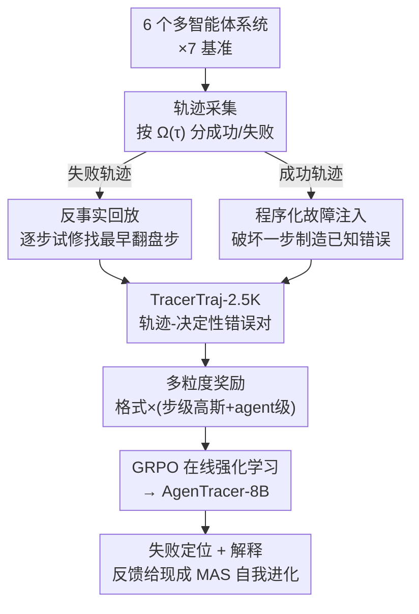

# AgenTracer: Who Is Inducing Failure in the LLM Agentic Systems?

**会议**: ICLR2026  
**OpenReview**: [https://openreview.net/forum?id=l05DseqvuD](https://openreview.net/forum?id=l05DseqvuD)  
**代码**: https://github.com/bingreeky/AgenTracer  
**领域**: LLM Agent / 多智能体系统 / 失败归因  
**关键词**: 失败归因, 多智能体系统, 反事实回放, 故障注入, 强化学习

## 一句话总结
AgenTracer 用"反事实回放 + 程序化故障注入"自动标注多智能体失败轨迹、造出 TracerTraj-2.5K 数据集，再用多粒度强化学习训出一个 8B 的轻量"失败追踪器"，在 Who&When 基准上把决定性错误定位到具体智能体和步骤，agent 级准确率反超 Gemini-2.5-Pro、Claude-4-Sonnet 等巨型模型最多 18.18%，并能给 MetaGPT、MaAS 等现成系统反馈、带来 4.8~14.2% 的性能提升。

## 研究背景与动机
**领域现状**：当下复杂任务越来越依赖 LLM 多智能体系统——多个 agent 分工协作、调用外部工具、按编排协议轮流行动，在数据科学、科学发现、软件工程等场景上明显超过单体 agent。

**现有痛点**：但这种"复杂度换性能"的代价是系统极度脆弱。UC Berkeley 的实证研究发现 OpenHands、MetaGPT 等流行框架的失败率高达 86.7%，失败模式从任务分解不当到角色不服从五花八门。一旦任务失败，要在动辄几十步、跨多个 agent 的冗长轨迹里找出"到底是谁、在哪一步搞砸的"——这就是**失败归因（failure attribution）**任务，目前几乎全靠人工逐条读日志。

**核心矛盾**：自动化失败归因卡在两个地方。其一是**方法**：现有最强推理模型（OpenAI-o1、DeepSeek-R1）直接拿来做归因，在 GAIA 轨迹上准确率不到 10%，巨型模型在这个任务上意外地无能。其二是**训练资源**：能用的标注数据极少——MAST 只有 200 条、Who&When 只有 127 条人工标注轨迹，根本不足以训练一个专用追踪器。

**本文目标**：① 造一条能大规模自动标注多智能体失败轨迹的流水线；② 训出一个又快又准、能读懂长程协作轨迹的失败定位器。

**切入角度**：作者抓住一个关键概念——**决定性错误（decisive error）**：一条失败轨迹里可能有很多次要偏差，但真正该追责的是"最早的那个、纠正它就足以让系统从失败翻盘成功"的动作。只要能可靠地找出这个 $(i^*, t^*)$（错误智能体 + 决定性步骤），既能自动造标注数据，也能定义清晰的训练目标。

**核心 idea**：用"反事实地修一步看结果会不会翻盘"来自动标注决定性错误，用这批数据强化学习训出一个小模型，专门干失败追踪这件事。

## 方法详解

### 整体框架
AgenTracer 分两大块：前半段是**自动轨迹标注流水线（AgenTracer pipeline）**，后半段是**追踪器训练（AgenTracer-8B）**。

先从 6 个覆盖手工/半自动/全自动三种自动化程度的多智能体系统、7 个跨编码/通用 agent/数学的基准上采集原始轨迹，按系统评测函数 $\Omega(\tau)\in\{0,1\}$ 把轨迹分成成功集 $T_{\text{succ}}$ 和失败集 $T_{\text{fail}}$。对失败轨迹用**反事实回放**逐步试修、找出最早能翻盘的决定性错误；对成功轨迹用**程序化故障注入**人为破坏一步、制造出"决定性错误已知"的合成失败样本。两路标注合并成 **TracerTraj-2.5K**（2000+ 条高保真"轨迹—错误"对）。最后以 Qwen3-8B 为底座，用 GRPO 在线强化学习配上**多粒度奖励**训出 AgenTracer-8B，输入一条失败轨迹及环境反馈，输出决定性错误步骤和对应智能体；推理时它能给失败系统快速定位 + 解释，驱动多智能体系统自我纠错。

### 关键设计

**1. 反事实回放：用"最小修一步能否翻盘"锚定失败轨迹的决定性错误**

人读冗长日志找不准"谁该背锅"，根因在于一条轨迹里次要偏差和致命错误混在一起。作者形式化了决定性错误：设 $\Omega(\tau)$ 为成败二值评测，$R(\tau, t, a'_t)$ 为"把第 $t$ 步动作 $a_t$ 换成理想动作 $a'_t$、并重新模拟后续所有步"的纠正算子，则所有决定性 agent-步骤对为

$$C(\tau) = \{(i, t)\mid i=\mu(t)\ \text{and}\ \Omega(\tau)=0\ \wedge\ \Omega(R(\tau, t, a'_t))=1\},\quad (i^*, t^*)=\arg\min_{(i,t)\in C(\tau)} t$$

即"纠正后能让失败翻成成功、且时间上最早"的那一步。实现上由一个分析器智能体 $\pi_{\text{analyzer}}$（基于 DeepSeek-R1）执行反事实干预：它拿到完整失败上下文——轨迹 $\tau$、环境反馈 $F$（代码执行报错、工具报错等）和真值解 $G$，对每一步提出一个**最小侵入式**的纠正动作 $a'_t \leftarrow \pi_{\text{analyzer}}(s_t, a_t, H_t, F, G)$，只修局部错误而不直接泄露完整答案；从 $t=0$ 顺序试修，第一个让 $\Omega(R(\tau,t,a'_t))=1$ 成立的步即为 $t^*$，活跃 agent $i^*=\mu(t^*)$ 即问题智能体，产出标注 $(\tau, \langle i^*, t^*\rangle)$。这比让 LLM 直接"看一眼日志猜谁错"可靠得多，因为每个标签都被"修了真的就成功"这件事验证过。

**2. 程序化故障注入：反过来从成功轨迹合成"错误已知"的高精度样本**

光靠失败轨迹标注，数据规模和多样性都受限，而且反事实回放本身有不确定性。作者反向操作：拿一条已知成功的轨迹 $\tau\in T_{\text{succ}}$，随机选 $K$ 个注入点，在某步用扰动算子 $\Pi$（同样基于 DeepSeek-R1）把原动作 $a_t$ 破坏成 $\tilde{a}_t=\Pi(a_t)$，生成新轨迹 $\tilde{\tau}=R(\tau, t, \tilde{a}_t)$。若这一注入真的把系统从成功打成失败（$\Omega(\tilde{\tau})=0$），那么按构造，$\langle\mu(t), t\rangle$ 就是 $\tilde{\tau}$ 的决定性错误——标签**天然已知、零标注噪声**：

$$D^+ = \{(\tilde{\tau}, \langle i^*, t^*\rangle)\mid \tau\in T_{\text{succ}},\ \tilde{\tau}=R(\tau, t, \Pi(a_t)),\ \Omega(\tilde{\tau})=0,\ \langle i^*, t^*\rangle=\langle\mu(t), t\rangle\}$$

它和反事实回放得到的 $D^-$ 合并成 $D_{\text{tracer}}=D^-\cup D^+$ 即 TracerTraj-2.5K。两路一正一反互补：回放保证覆盖真实失败分布，注入保证标签精确且能批量扩充。

**3. 多粒度奖励：用"格式硬门控 × (步级高斯 + agent 级)"给失败定位一个平滑可学的信号**

失败定位天然是稀疏信号——步号要么对要么错，直接 0/1 奖励训练极不稳定。作者设计了一个门控式多粒度奖励，对每个候选预测 $\hat{p}_k=\langle\hat{i}_k, \hat{t}_k\rangle$：

$$R(\hat{p}_k) = \mathbb{I}_{\text{format}}\cdot\big(\lambda\cdot r_{\text{step}}(\hat{t}_k) + (1-\lambda)\cdot r_{\text{agent}}(\hat{i}_k)\big)$$

三部分各司其职：**格式奖励** $\mathbb{I}_{\text{format}}$ 是严格二值门——推理必须包在 `<think>...</think>`、答案包在 `<answer>...</answer>` 且格式为 `<agentID>|<stepID>`，否则整条奖励清零，保证输出可解析；**agent 级奖励** $r_{\text{agent}}(\hat{i}_k)=\mathbb{I}(\hat{i}_k=i^*)$ 是粗粒度二值，判错误智能体是否找对；**步级奖励**用高斯核让奖励随预测步号偏离真值平滑衰减

$$r_{\text{step}}(\hat{t}_k) = \exp\!\left(-\frac{(\hat{t}_k - t^*)^2}{2\sigma^2}\right)$$

$\sigma$ 控制对距离的惩罚锐度（取 1）。高斯核给"差一两步"的预测部分信用，把陡峭的 0/1 地形磨成平滑曲面，稳住了训练；硬门控则保证模型不会为了刷奖励而输出不可解析的内容。$\lambda$ 取 0.5，步级与 agent 级各占一半。

**4. 无 KL、动态裁剪的 GRPO 在线强化学习：让 8B 底座学会读长程协作轨迹**

有了数据和奖励，作者以 Qwen3-8B 为底座、用 GRPO 在线强化学习把它训成追踪器（方法与具体 RL 算法正交）。对每条轨迹 $\tau$，旧策略 $\pi_{\text{old}}$ 采样一组 $G$ 个候选决定性错误对，按上面的多粒度奖励算优势 $A_k=(R_k-\text{mean})/(\text{std}+\epsilon)$。沿用 RLVR 实践去掉 KL 散度项，并引入动态裁剪参数

$$B_s = \max\!\Big(0.2\cdot B_0,\ B_0\big(1-\tfrac{s}{S_{\text{total}}}\big)\Big)$$

随训练步 $s$ 推进逐渐收紧——前期大裁剪鼓励探索、后期收紧转向稳定利用。这套设计让一个 8B 模型也能在动辄几十步的多智能体交互里做出比巨型模型更准的归因。

### 一个完整示例
以论文 Magnetic-One 销售数据任务为例：Manager 让 Web Surfer 取季度销售 CSV → File Surfer 存盘 → Coding Agent 写脚本找销量最高地区，但脚本因**列名写错**报错 → 后续 agent 识别错误、补上正确列名 "Region Name" → 重跑得出 "North" → 最终汇报 "North"。Qwen3-8B 直接把"错误步=第 6 步、错误 agent=Coding Agent"当成答案，理由是日志里第 6 步有显式报错 "Script fails due to incorrect column name"——它被表面的报错信息带偏了。但反事实回放追的是"最早纠正就能翻盘"的那一步，而第 6 步的显式报错往往只是下游症状而非根因。这正是 AgenTracer 区别于"看一眼日志找最显眼报错"的浅层判断之处——它追的是最早的决定性错误，而不是最晚崩出来的那一步。

### 损失函数 / 训练策略
RL 目标（去 KL、带动态裁剪的 GRPO）：

$$\mathcal{L}_{\text{RL}} = -\mathbb{E}_{\tau,\{\hat{p}_k\}}\!\left[\frac{1}{G}\sum_{k=1}^{G}\min\big(\rho_k A_k,\ \text{clip}(\rho_k, 1-B_s, 1+B_s)A_k\big)\right]$$

其中 $\rho_k=\pi_{\text{tracer}}(\hat{p}_k|\tau)/\pi_{\text{old}}(\hat{p}_k|\tau)$。关键超参：batch size 32、rollout 数 8、学习率 $1\times10^{-6}$、$\lambda=0.5$、$\sigma=1$，在 8×H100 上用 verl 平台训练，分析器与扰动算子均用 DeepSeek-R1。

## 实验关键数据

### 主实验
在 Who&When 基准（手工 handcraft 子集 + 自动 automated 子集，各分 agent 级 / step 级，每格左为 w/ 真值 G、右为 w/o G）上对比：

| 模型 | handcraft Agent级 | handcraft Step级 | automated Agent级 | automated Step级 |
|------|------|------|------|------|
| Qwen3-8B（底座） | 42.10/39.50 | 1.72/3.45 | 58.73/60.32 | 3.97/5.56 |
| GPT-4.1 | 43.10/37.93 | 3.44/3.44 | 55.55/59.52 | 29.52/21.90 |
| DeepSeek-R1 | 56.90/53.44 | 13.29/6.90 | 66.67/65.08 | 31.32/29.52 |
| Gemini-2.5-Pro | 51.72/51.72 | 9.72/6.90 | 61.11/57.14 | 29.52/25.86 |
| Claude-4-Sonnet | 56.90/50.00 | 17.24/18.97 | 57.93/51.11 | 40.65/38.83 |
| **AgenTracer-8B** | **69.10/63.82** | **20.68/20.68** | **69.62/63.73** | **42.86/37.30** |

仅 8B 的 AgenTracer 在 handcraft agent 级 w/ G 上达 69.10%，比 GPT-4.1 高 26.0%、比 Claude-4-Sonnet 高 12.2%；step 级也全面领先。在 TracerTraj 三个子集（Code/MATH/Agentic）上同样领先：如 TracerTraj-agentic step 级比底座 Qwen3-8B 提升 22.68%、比 DeepSeek-R1 高 9.04%、比 Gemini-2.5-Pro 高 17.57%。

### 下游增益
把 AgenTracer-8B 的反馈接到现成多智能体系统（MetaGPT、MaAS、OWL）做多轮自我纠错，相比 Self-Refine、CRITIC 等经典反思基线，带来 **4.8~14.2%** 的性能提升（GAIA / MATH-500 / HumanEval-Plus 等）。

### 关键发现
- **巨型模型在失败归因上意外无能**：Qwen3-8B、Llama-3.2-3B 在 Who&When 手工集 step 级准确率不到 10%；连 DeepSeek-R1、GPT-4.1 在自动集 agent 级也只有 31.32% / 29.52%。
- **给真值 G 反而可能误导**：TracerTraj-math 上 Claude-4-Sonnet w/ G 是 46.03%、w/o G 反而 50.79%；handcraft 上 Qwen3-Coder 也是 51.72% vs 60.35%。说明真值监督有时会把归因带偏，更难、更现实的 w/o G 设置才是关键，而 AgenTracer 在 w/o G 下依旧稳健。
- **多路标注 + 多粒度奖励是性能来源**：反事实回放保证真实失败覆盖、故障注入保证标签精确，高斯步级奖励把稀疏定位信号磨平滑、稳住 RL 训练。

## 亮点与洞察
- **把"修一步能否翻盘"当成标注信号**，是这篇最漂亮的地方：它用因果反事实的方式给"决定性错误"一个可验证的定义，比让 LLM 主观猜"谁错了"靠谱得多，标签质量直接锁死在"改了真的就成功"上。
- **正反两路造数据互补**：失败轨迹回放 + 成功轨迹注入，一个保覆盖一个保精度，巧妙绕开了"标注数据只有一两百条"的瓶颈。这套"从成功样本反向制造已知错误"的思路可迁移到任何需要细粒度错误标注的序列任务（如 RL 信用分配、长链推理纠错）。
- **小模型反超巨型模型**：再次印证"专用任务上，精准数据 + 对路奖励训出的小模型可碾压通用大模型"，且 8B 的推理成本让它真能挂到生产系统里做在线 debug。
- **高斯步级奖励**把离散定位变成平滑回归式信号，这个 trick 对任何"预测序列中某个位置"的任务都通用。

## 局限与展望
- **依赖 DeepSeek-R1 当分析器/扰动算子**：标注质量受这个外部强模型的上限制约，分析器若提的"理想纠正动作"本身不够理想，决定性错误的定位就会有偏。
- **反事实回放成本高**：对每条失败轨迹要逐步试修并重模拟后续，长轨迹上开销不小，论文未充分讨论可扩展性。
- **决定性错误的"唯一最早"假设**：真实失败可能是多个错误耦合的结果，"纠正最早一步就翻盘"未必总成立，对这类纠缠失败的归因还需进一步研究。
- **step 级绝对准确率仍偏低**（handcraft 约 20%），说明精确到"哪一步"依然很难，距离真正可靠的自动 debug 还有空间。

## 相关工作与启发
- **vs Who&When (Zhang et al. 2025c)**：Who&When 提出失败归因任务、揭示巨型推理模型在此任务上灾难性失败，但只提供 127 条人工标注、无可扩展数据合成方案；AgenTracer 补上了自动化大规模标注流水线 + 轻量高精度追踪器，把"发现问题"推进到"解决问题"。
- **vs MAST (Cemri et al. 2025)**：MAST 首次刻画多智能体失败、归纳出 14 种失败模式，但只有 200 条标注、偏分析；AgenTracer 偏自动化定位与可部署。
- **vs LLM-as-a-Judge**：LaaJ 用 LLM 当评估器，但在多 LLM 系统上效果有限；AgenTracer 不靠主观打分，而靠反事实验证的 grounded 归因。
- **vs MARL 信用分配 / CollabUIAgents**：传统 MARL 信用分配在 LLM agent 上几乎空白，最接近的 CollabUIAgents 用 LLM 产生每次交互的二值奖励、本质不可靠；AgenTracer 通过有原则的归因隐式实现了 grounded 的信用分配。

## 评分
- 新颖性: ⭐⭐⭐⭐⭐ 用反事实回放定义并自动标注"决定性错误"、正反两路造数据，是失败归因方向少见的扎实新框架。
- 实验充分度: ⭐⭐⭐⭐ 两大基准 + 三子集 + 多基线 + 下游增益验证齐全，但 step 级绝对准确率与可扩展性讨论略欠。
- 写作质量: ⭐⭐⭐⭐⭐ 问题定义清晰、形式化到位、图示和算法伪代码完整，可读性强。
- 价值: ⭐⭐⭐⭐⭐ 直击多智能体系统脆弱、难 debug 的痛点，8B 模型可落地、能反馈自我进化，工程价值高。

<!-- RELATED:START -->

## 相关论文

- [\[ICLR 2026\] EvoTest: Evolutionary Test-Time Learning for Self-Improving Agentic Systems](evotest_evolutionary_test-time_learning_for_self-improving_agentic_systems.md)
- [\[ICML 2026\] AgentXRay: White-Boxing Agentic Systems via Workflow Reconstruction](../../ICML2026/llm_agent/agentxray_white-boxing_agentic_systems_via_workflow_reconstruction.md)
- [\[ACL 2026\] FAMA: Failure-Aware Meta-Agentic Framework for Open-Source LLMs in Interactive Tool Use Environments](../../ACL2026/llm_agent/fama_failure-aware_meta-agentic_framework_for_open-source_llms_in_interactive_to.md)
- [\[ICLR 2026\] Helmsman: Autonomous Synthesis of Federated Learning Systems via Collaborative LLM Agents](helmsman_autonomous_synthesis_of_federated_learning_systems_via_collaborative_ll.md)
- [\[ICML 2026\] ReflexGrad: Within-Episode Failure Recovery in LLM Agents via Progress-Gated Dual-Process Routing](../../ICML2026/llm_agent/reflexgrad_within-episode_failure_recovery_in_llm_agents_via_progress-gated_dual.md)

<!-- RELATED:END -->
