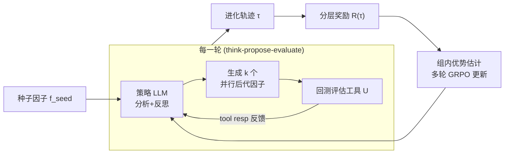

# AlphaAgentEvo: Evolution-Oriented Alpha Mining via Self-Evolving Agentic Reinforcement Learning

**会议**: ICLR 2026  
**OpenReview**: [https://openreview.net/forum?id=lNmZrawUMu](https://openreview.net/forum?id=lNmZrawUMu)  
**代码**: 待确认  
**领域**: LLM Agent / 量化金融 / Agentic RL  
**关键词**: 量化选股因子挖掘, 自进化智能体, Agentic RL, GRPO, 分层奖励, 多轮工具调用  

## 一句话总结
把量化"挖因子"从脆弱的"搜索—回测—重启"循环，重写成一条**连续进化轨迹**：用一个 4B 的 LLM 智能体，在多轮工具调用中由分层奖励引导自我探索，学会长程规划和反思，最终用 4B 参数就超过用 GPT-5-mini / DeepSeek-R1 驱动的因子进化方法。

## 研究背景与动机
**领域现状**：Alpha 挖掘（alpha mining）是从巨大且嘈杂的搜索空间里找出能跑赢市场的预测性因子。学界主流有两条进化路线——传统遗传编程（GP）和近期的多智能体框架。

**现有痛点**：
- **GP 类方法**靠启发式搜索和随机变异，既看不懂自然语言指令，也不会从失败尝试里提炼经验，可解释性低、探索效率差，还容易生成捕捉伪相关的因子。
- **LLM / 多智能体框架**虽然能接受人类指令，却缺乏自进化机制（长期规划、对过往结果的反思推理），很容易陷在重复的局部修改里，探索同样低效。

**核心矛盾**：现有工作流本质上是**短视的**——它们 search、backtest、restart，而不是系统性地"进化"因子。每个候选因子被当成独立试验，丢失了跨轮次累积、保持内在逻辑与可解释性的机会。

**本文目标**：提出一个**进化导向**的范式，把刻意规划（deliberate planning）和反思推理（reflective reasoning）耦合进多轮轨迹，让因子在一条连续轨迹上被逐步打磨。

**核心 idea**：**首个面向量化因子挖掘的自进化 Agentic RL 框架**——AlphaAgentEvo。把 GRPO 从单轮文本优化扩展成多轮"工具在环"的 ARL，再配一个**分层奖励函数**，引导智能体从"满足基本要求（合法工具调用）"逐步爬升到"复杂目标（持续性能提升）"，沿途自发习得长程规划与反思推理，从而对市场状态（如市场风格切换）主动反应。

## 方法详解

### 整体框架
AlphaAgentEvo 把"挖因子"建模成**学一个进化策略 $\pi$**，而不是直接优化单个因子。给定一个专家设计的种子因子 $f_{seed}$，策略与回测工具交互 $T$ 轮，产出一族进化后的因子 $F_\pi(f_{seed})$。每一轮里，策略 LLM 先 think（分析+反思历史因子及其反馈），再 propose（生成多个并行后代因子作为工具调用），由外部评估工具 $U$ 统一 evaluate；整条轨迹被一个分层奖励打分，同种子的轨迹组成一组做组内优势估计并更新策略。

### 关键设计

**1. 进化策略目标：在种子邻域里搜更强又可解释的因子。** 不同于静态挖因子直接优化单个 $f$，本文把目标定义为学习进化策略 $\pi$，在种子分布 $D_{seed}$ 上最大化进化族里最优因子的表现，同时兼顾分布内（$D_{evo}$）与分布外（$D_{test}$）市场：

$$\pi^\star = \arg\max_\pi \mathbb{E}_{f_{seed}\sim D_{seed}}\Big[\max_{f\in F_\pi(f_{seed})}\big(\mathbb{E}_{X\sim D_{evo}}s(f;X) + \lambda\,\mathbb{E}_{X\sim D_{test}}s(f;X)\big)\Big]$$

关键是带了个**结构相似度约束** $\mathrm{sim}(f, f_{seed}) \le \delta$：相似度用因子的抽象语法树（AST）重叠度衡量。这个约束把策略锁在每个种子的局部邻域里搜索，产出的因子既更强又仍可解释，而不是在无约束全局优化中过拟合噪声。

**2. 把 GRPO 从单轮搬到多轮工具在环。** 现有 RL 微调多为单轮、按回应评估、跨轮耦合弱；而因子进化天然是多轮工具在环过程。作者把 GRPO 扩成 ARL：每轮由策略生成推理 token 和工具调用 token 触发工具，再接上工具返回 token，全部拼进轨迹，但**只有策略生成的 token（用掩码 $M_{i,t}$ 标记）才贡献梯度**。第 $t$ 轮生成时，策略 LLM 以整段历史轨迹 $\tau_{1:t-1}$ 为条件，从而实现对过往尝试的反思推理。优势用组内归一化估计 $\hat{A}_g = \frac{R(\tau_g)-\mu_T}{\sigma_T}$，目标函数在标准 GRPO 的 clip + KL 惩罚基础上，按有效长度 $\frac{1}{\sum_t M_{i,t}}$ 归一化并屏蔽工具发出的 token。这一改造让模型能在一条长轨迹里 plan、analyze、reflect，跳出"搜索—回测—重启"的启发式循环。

**3. 分层奖励：把稀疏嘈杂的回测信号变成稠密多维信号。** 单标量奖励在因子挖掘里行不通（搜索空间巨大、数据噪声大、有伪相关）。作者把多个目标拼成层级结构：**Tool Call Reward** $R_{tool}=\alpha_{succ}N_{succ}-\alpha_{fail}N_{fail}$ 奖励合法工具调用、惩罚失败；**Consistency Reward** $R_{cons}$ 用相似度下阈 $h_{low}{=}0.1$ 软约束因子别偏离种子太远（保住可解释性）；**Exploration Reward** $R_{expl}=\sum_{f_i}\alpha_{exp}(1-\max_{f_j\in F_{<i}}\mathrm{sim}(f_i,f_j))$ 奖励与已提出因子不相似的多样探索；**Performance Reward** $R_{perf}$ 用对数缩放 $\alpha_{perf}\log(1+\exp(s(f^\*)-\max(0,s(f_{seed}))))$ 处理噪声指标；**Streak Reward** $R_{streak}=\alpha_{streak}N_{streak}$ 给一条轨迹里最长连续性能提升加 booster。最终聚合成：

$$R(\tau)=\frac{\min(R_{cons},C_{cons})+\min(R_{expl},C_{expl})}{\min(R_{tool},C_{tool})}+\min(R_{perf},C_{perf})\cdot\min(R_{streak},C_{streak})$$

每项都被上限 $C_j$ 截断防止单项主导；把工具调用当成分母里的"成本"，避免靠频繁调用暴力搜索。这套结构让智能体从"基本合规"渐进爬到"高层目标"，既防止塌缩成重复模式，又保证一致性与探索的平衡。

## 实验关键数据

### 主实验表格
在自建 **AlphaEvo500**（350 训练 / 50 验证 / 100 测试种子）上，HS300 与 CSI500 两个市场（2024–2025）：

| 方法 | HS300 Pass@3 | HS300 Pass@5 | CSI500 Pass@3 | CSI500 Pass@5 |
|------|------|------|------|------|
| Qwen3-4B-thinking | 0.36 | 0.47 | 0.68 | 0.78 |
| GPT-5-mini | 0.75 | 0.88 | 0.73 | 0.82 |
| DeepSeek-R1 | 0.68 | 0.71 | 0.71 | 0.86 |
| ToolRL-4B | 0.75 | 0.81 | 0.73 | 0.76 |
| GEPA (GPT-5-mini) | 0.87 | 0.90 | 0.86 | 0.91 |
| **AlphaAgentEvo-1.7B** | 0.77 | 0.90 | 0.76 | 0.78 |
| **AlphaAgentEvo-4B** | **0.97** | **0.97** | **0.93** | **0.95** |

外部测试集 **Alpha158**（含 GP 基线）上，GP 即便 50 后代 pass@3 也仅 0.022–0.094；AlphaAgentEvo-4B 在牛市段 pass@5 达 **0.994**（近乎饱和），熊市段 pass@3 达 0.581。亮点：**1.7B 版本即超过 GPT-5-mini，4B 版本超过最强基线 GEPA**，但 GEPA 用的是闭源 SOTA 推理模型。

### 消融实验表格
去掉两个关键奖励组件（pass@3）：

| 设置 | AlphaEvo500 Pass@3 | Alpha158 Pass@3 |
|------|------|------|
| w/o exploration reward | 0.54 | 0.513 |
| w/o consistency reward | 0.51 | 0.510 |
| **完整模型** | **0.65** | **0.581** |

训练显著提升合法率（AlphaEvo500: 0.938→0.973）。探索奖励与方向感知（consistency）奖励两者都关键且互补。

### 关键发现
- **智能体级自进化**（非仅因子级）：跨轮 IR 增益加速、探索与一致性同步上升，证明策略本身在每轮变强，而非只是单个因子在变好。
- **多样性与可迁移性**：top-20 因子的平均/最大结构相似度仅 0.039 / 0.263，远低于 DeepSeek-R1（max 0.583）和 Qwen3-4B（max 0.600），说明没有 reward hacking、没过拟合到狭窄/伪相关模式。

## 亮点与洞察
- **范式重写**：把"挖因子"从一次性试错重写成连续进化轨迹，这个 framing 本身就把可解释性（AST 邻域约束）和累积学习一并解决了。
- **以小搏大**：4B 开源模型靠 ARL 训练超过闭源 SOTA 驱动的方法，强力证明了"训练智能体策略"比"调用更强的现成模型"更划算。
- **奖励工程的样板**：分层奖励把金融回测的稀疏噪声反馈转成稠密多维信号，工具调用进分母当成本、相似度同时管"别跑偏"和"要多样"，是把领域先验注入 RL 的好例子。

## 局限与展望
- **依赖专家种子因子**：整个进化锚定在 $D_{seed}$ 的局部邻域，强约束保住了可解释性，但也意味着方法本质是"改进种子"而非"从零发现"，上限受种子库质量制约。
- **市场与时段有限**：训练只用一年 A 股数据（HS300/CSI500），跨市场、跨资产类别、跨更长周期的鲁棒性仍待验证。
- **奖励超参多**：分层奖励里 $\alpha_\bullet$、上限 $C_\bullet$、阈值 $h_{low}$、$\delta$ 等需调，迁移到新场景的调参成本未知。
- **评估指标取舍**：因部分种子是布尔选股信号（未选股票取 NaN），作者放弃 IC 类指标只用 IR/AER，可能与业界常用评估口径有差异。

## 相关工作与启发
- **因子挖掘进化路线**：传统 GP（Lin et al. 2019 等）vs LLM 多智能体（AlphaAgent, Tang et al. 2025）vs 反思式提示进化（GEPA）。本文指出前者不会从失败学习、后者缺自进化机制，定位清晰。
- **Agentic RL / 工具在环 RL**：在 GRPO（Shao et al. 2024）基础上扩多轮，与 ToolRL（Qian et al. 2025）同属工具调用 RL，但强调多轮长程规划——ToolRL 正是因缺多轮规划而无法泛化到更长 horizon。
- **启发**：把"领域评估器"当作 RL 环境、用结构相似度同时充当探索奖励与可解释性约束，这套"双刃相似度"设计可迁移到代码生成、分子设计等同样"搜索空间大+要可解释+有结构表示"的任务。

## 评分
- **新颖性**: ⭐⭐⭐⭐ 首个面向量化因子挖掘的自进化 Agentic RL 框架，把多轮 GRPO + 分层奖励 + AST 邻域约束组合得很自洽，framing 有新意。
- **实验充分度**: ⭐⭐⭐⭐ 两数据集×两市场×四类基线（GP/多智能体/工具RL/LLM驱动），含消融、进化轨迹分析、多样性与可迁移性分析，覆盖面广；扣分在仅一年训练数据、单一资产市场。
- **写作质量**: ⭐⭐⭐⭐ 痛点—矛盾—方法递进清晰，奖励设计与目标函数公式完整，图表支撑充分。
- **价值**: ⭐⭐⭐⭐ 4B 超闭源 SOTA 的结果对量化与小模型 Agentic RL 都有实用价值，"领域评估器即环境 + 双刃相似度"的思路可外推。

<!-- RELATED:START -->

## 相关论文

- [\[ICLR 2026\] MobileRL: Online Agentic Reinforcement Learning for Mobile GUI Agents](mobilerl_online_agentic_reinforcement_learning_for_mobile_gui_agents.md)
- [\[ICLR 2026\] Agentic Context Engineering: Evolving Contexts for Self-Improving Language Models](agentic_context_engineering_evolving_contexts_for_self-improving_language_models.md)
- [\[ICLR 2026\] WebSeer: Training Deeper Search Agents through Reinforcement Learning with Self-Reflection](webseer_training_deeper_search_agents_through_reinforcement_learning_with_self-r.md)
- [\[ICLR 2026\] MemGen: Weaving Generative Latent Memory for Self-Evolving Agents](memgen_weaving_generative_latent_memory_for_self-evolving_agents.md)
- [\[ICML 2026\] On Information Self-Locking in Reinforcement Learning for Active Reasoning of LLM Agents](../../ICML2026/llm_agent/on_information_self-locking_in_reinforcement_learning_for_active_reasoning_of_ll.md)

<!-- RELATED:END -->
