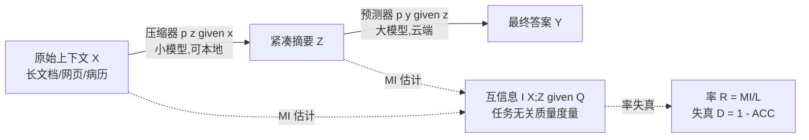

# An Information Theoretic Perspective on Agentic System Design

**会议**: ICLR 2026  
**OpenReview**: [https://openreview.net/forum?id=isFHz8qf20](https://openreview.net/forum?id=isFHz8qf20)  
**代码**: 待确认  
**领域**: LLM Agent / 多智能体系统  
**关键词**: 压缩器-预测器系统, 互信息估计, 率失真理论, 信息瓶颈, 本地-云端协同, Deep Research  

## 一句话总结
把 agentic 系统里"小模型压缩上下文、大模型读压缩后推理"的通用范式抽象成一条带噪信道，用一个可直接由推理引擎计算的互信息估计量来度量压缩质量，从而以任务无关的方式回答"该把算力堆在压缩器还是预测器"——答案是堆压缩器。

## 研究背景与动机
- **领域现状**: "Deep Research"、"Claude Code" 等现代 agentic LM 系统普遍采用多模型架构来突破单模型上下文窗口的限制。剥开表面差异，它们都收敛到一个反复出现的模式：较小的**压缩器**(compressor)把原始海量上下文蒸馏成紧凑文本，再交给较大的**预测器**(predictor)消费并产出最终答案。
- **现有痛点**: 压缩器-预测器系统的设计**基本靠试错**。换一个新模型、调一个组件，工程师没有原则性方法判断性能增益该归功于压缩器的蒸馏还是预测器的推理。要做归因，只能对整个复合系统做昂贵的、任务特定的成对扫参(pairwise sweep)。
- **核心矛盾**: 根因在于我们**无法度量压缩器到底保留了原始上下文里多少信息**——而这恰恰决定了预测器能推理到什么程度。缺少把压缩器输出独立于下游性能来评估的任务无关指标。
- **本文目标**: 提供一个任务无关、可廉价计算的压缩质量度量，并据此给出 agentic 系统的设计原则(压缩器 vs 预测器该如何分配算力)。
- **核心 idea**: **【信息论视角】** 把压缩器看作原始数据与预测器之间的一条**带噪信道**，用上下文 $X$ 与其压缩 $Z$ 之间的**互信息 $I(X;Z)$** 作为压缩器效能的任务无关度量——其角色类比于困惑度(perplexity)作为下游性能的任务无关代理。

## 方法详解

### 整体框架
把系统抽象为两阶段的信息瓶颈过程：上下文 $X$ 经压缩器 $p(z\mid x)$ 得到紧凑摘要 $Z$，再经预测器 $p(y\mid z)$ 产出答案 $Y$，即 $X \xrightarrow{p(z\mid x)} Z \xrightarrow{p(y\mid z)} Y$。压缩器是带噪信道，论文用互信息度量它通过信道传递了多少关于 $X$ 的信息，再用率失真分析把"传了多少比特"与"下游错了多少"联系起来，最后落到一条可操作的设计准则上。

### 关键设计

**1. 可被推理引擎直接算的互信息估计量：避开全词表概率与辅助模型**
度量 $Z$ 含有多少关于 $X$ 的信息即 $I(X;Z)$，但经典变分界要么需要底层分布、要么需要训练辅助网络，都不实用。论文从 KL 散度表示出发 $I(X;Z)=\mathbb{E}_{x,z\sim p(x,z)}\left[\log\frac{p(z\mid x)}{p(z)}\right]$，其中 $p(z)$ 不可解，于是用蒙特卡洛把边缘 $p(z)$ 近似为对数据样本的平均：

$$\hat I(X;Z)=\frac{1}{NM}\sum_{i=1}^{N}\sum_{j=1}^{M}\left[\log p(z_{ij}\mid x_i)-\log\left(\frac{1}{N}\sum_{l=1}^{N}p(z_{ij}\mid x_l)\right)\right]$$

它只需压缩器暴露的 log 概率、不需要全词表分布，因此能跑在 SGLang 这类加速推理引擎上。估计量有上界 $\hat I\le\log N$。实践中对每个上下文要把查询 $Q$ 分离出来，实际估的是 $I(X;Z\mid Q)$；有限样本会偶尔产生小负值，直接 clip 到 0。一个工程细节是 1–3B 小模型会给无意义 token 串赋高似然(校准差)，所以 log 概率统一用一个 7–8B 的**代理模型**(且来自不同模型族以减偏)来算。

**2. 率失真分析：把"比特效率"与"下游错误率"挂钩**
有了 MI 还不够，论文借率失真理论把通信质量与任务表现统一起来。定义**率(比特效率)** $R=\frac{I(X;Z\mid Q)}{L}$(每个输出 token 携带的互信息比特数，$L$ 为压缩输出 token 数)，**失真** $D=1-\mathrm{ACC}(Z)$。随着率上升，失真应收敛到一个不可约下界。论文对率失真数据拟合衰减指数曲线，发现信息率与下游性能、困惑度强相关($r=-0.84,\ R^2=0.71$),从而把 MI 变成一个**无需端到端评测就能预测系统性能的代理信号**。这同时解释了为什么把预测器从 70B 继续往 405B 扩、失真几乎不再下降。

**3. "前置算力到压缩器"的设计准则与组件重要性排序**
基于上面两点做跨五数据集、三模型族的系统扫描后，论文用逻辑回归预测 LONGHEALTH/FINANCEBENCH 上的二元正确性，得出清晰的重要性层级：**压缩器模型族 > 压缩器规模 > 预测器规模**。结论是把算力"前置"(front-load)到压缩器、甚至放到本地设备上，去换取更小、更便宜的云端预测器——因为更大的压缩器不仅更准，还更简洁(每 token 携带更多比特)，使得 FLOPs-per-generation 随模型规模呈**亚线性**增长。

## 实验关键数据

### 主实验：压缩器 vs 预测器扩展

| 操作 | 数据集 | 准确率变化 |
|------|--------|-----------|
| QWEN-2.5 压缩器 1.5B→7B | LONGHEALTH | +60% |
| 预测器 70B→405B | LONGHEALTH | 仅 +12% |
| 预测器 70B→405B | FINANCEBENCH | 仅 +1% |
| 7–8B vs 1–1.5B 压缩器 | LONGHEALTH | 最高 3.1× 更准，超 GPT-4O-only 基线 4pp |
| 7–8B vs 1–1.5B 压缩器 | FINANCEBENCH | 最高 2.6× 更准，恢复 GPT-4O 基线 97% |

QWEN-2.5 压缩器 1.5B→7B 仅增加 **1.3%** FLOPs-per-generation；7–12B 压缩器比 1–1.5B 同族最高**简洁 4.6×**。一个 7B QWEN-2.5 相比 1.5B 同胞：准确率 1.6×、简洁 4.6×、每 token 互信息 5.4×。

### 信息率与性能相关性

| 指标 | 结果 |
|------|------|
| 信息率 vs 困惑度(FINEWEB 抽取式) | $r=-0.84,\ R^2=0.71$ |
| 压缩器误差构成 | 含错误答案 36.3% / 无答案 33.3% / 漏细节 30.4% |
| 是否偏好同族压缩器 | 否，失真主要由模型族与规模决定 |

### Deep Research 落地

| 配置 | RACE 分 | API 成本 |
|------|---------|----------|
| GPT-4O + 未压缩网页 (基线) | — | 100% |
| QWEN-2.5-14B 压缩 + GPT-4O 预测 | +2.3% | 仅 28.1% |
| 本地 3B 压缩器 | 恢复 99% frontier 准确率 | 26% API 成本(降 74%) |

### 关键发现
- 压缩器质量**压倒性地**决定系统性能；扩压缩器比扩预测器划算得多。
- 更大压缩器同时更准 + 更简洁，带来 FLOPs 亚线性增长——可"以本地算力换云端算力"。
- MI 率是端到端评测的廉价代理；压缩器扩展规律对 prompt 指定的简洁程度(3/6/9 句)鲁棒。

## 亮点与洞察
- **把工程经验上升为可度量的理论**：第一次用一个能在生产推理引擎上直接算的 MI 估计量，把 compressor-predictor 系统的设计从试错变成可量化归因。
- **反直觉但实用的结论**：大家本能想堆更强的"大脑"(预测器)，论文证明该堆"眼睛/耳朵"(压缩器)——且压缩器够小可本地化，直接转化为 74% 的 API 降本。
- **MI 估计量绕开了两大工程障碍**：不需要全词表 log 概率、不需要训练辅助判别器，因此能挂在 SGLang 上廉价批量算。

## 局限与展望
- MI 估计在 1–3B 尺度依赖代理模型和 log 概率，引入潜在方差与偏差；clip 负值也是工程妥协。
- 主要聚焦 GPT 风格**非推理**模型和**单轮**通信，对推理增强模型、迭代式多智能体工作流的泛化性有限。
- 把压缩等同于"摘要"，未覆盖结构化抽取、函数调用生成等其他压缩形态；FLOPs-per-generation 也未考虑设备特定优化。
- 展望：INFONCE 等替代估计量、基于率失真的压缩器训练目标、信息论指导的压缩器路由/回退策略、MoE 模型的不同扩展行为。

## 相关工作与启发
- **信息瓶颈**(Tishby et al., 2000; Shwartz-Ziv & Tishby, 2017)：本文把单模型表示的"压缩 vs 预测"权衡推广到两个 LM 之间的通信信道。
- **缩放定律**(Kaplan et al., 2020; Hoffmann et al., 2022)：MI 之于压缩质量，类比困惑度之于下游性能——都是任务无关代理。
- **多智能体系统**(Narayan et al., 2025; Hadfield et al., 2025)：印证"小模型读原始上下文、大模型编排"即数据面/控制面分离的有效性，并首次从信道角度量化中间通信。
- **启发**：任何"小模型预处理 + 大模型决策"的级联系统(RAG、工具调用、记忆压缩)都可借用此 MI 框架做组件归因与算力分配，而不必端到端扫参。

## 评分
- 新颖性: ⭐⭐⭐⭐⭐ — 把 agentic 系统设计重述为信息论问题，并给出可落地的 MI 估计量，视角新且自洽。
- 实验充分度: ⭐⭐⭐⭐ — 五数据集 × 三模型族 × 多预测器尺寸的系统扫描 + Deep Research 真实落地，扎实；但偏非推理单轮设置。
- 写作质量: ⭐⭐⭐⭐⭐ — 四个引导性问题串起全文，结论清晰可操作，图表组织得当。
- 价值: ⭐⭐⭐⭐⭐ — "扩压缩器、放本地、降 74% 成本"对工业级 agentic 系统部署有直接指导意义。

<!-- RELATED:START -->

## 相关论文

- [\[ICLR 2026\] BED-LLM: Intelligent Information Gathering with LLMs and Bayesian Experimental Design](bed-llm_intelligent_information_gathering_with_llms_and_bayesian_experimental_de.md)
- [\[ICLR 2026\] A Benchmark for Deep Information Synthesis (DeepSynth)](a_benchmark_for_deep_information_synthesis.md)
- [\[ICLR 2026\] Trade in Minutes! Rationality-driven Agentic System for Quantitative Financial Trading](trade_in_minutes_rationality-driven_agentic_system_for_quantitative_financial_tr.md)
- [\[ICLR 2026\] FlowSearcher: Synthesizing Memory-Guided Agentic Workflows for Web Information Seeking](flowsearcher_synthesizing_memory-guided_agentic_workflows_for_web_information_se.md)
- [\[ICLR 2026\] UI-Ins: Enhancing GUI Grounding with Multi-Perspective Instruction-as-Reasoning](ui-ins_enhancing_gui_grounding_with_multi-perspective_instruction_as_reasoning.md)

<!-- RELATED:END -->
