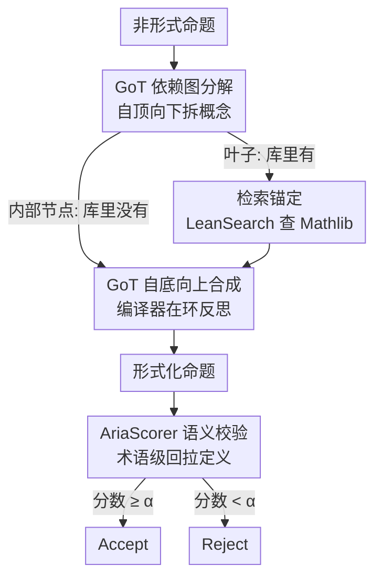

# Aria: an Agent for Retrieval and Iterative Auto-Formalization via Dependency Graph

**会议**: ICLR2026  
**OpenReview**: [https://openreview.net/forum?id=CPxZClPMiy](https://openreview.net/forum?id=CPxZClPMiy)  
**代码**: 待确认  
**领域**: LLM Agent / 自动形式化 / 定理证明  
**关键词**: 自动形式化, Lean, 思维图, 检索增强, 语义校验

## 一句话总结
Aria 把"把自然语言数学命题翻译成 Lean 形式化代码"做成一个**检索 + 迭代合成**的 agent：先用"思维图"（Graph-of-Thought）把命题自顶向下拆成概念依赖图、能在 Mathlib 里检索到的概念就锚定、查不到的就自底向上现合成新定义，再配一个会从 Mathlib 拉回每个 Lean 术语真实定义的语义检查器 AriaScorer 把关；在研究级猜想数据集上别人全 0%、它做到 42.9%。

## 研究背景与动机

**领域现状**：交互式定理证明器（Lean 4 + Mathlib）是形式化数学的主战场，但写形式化命题极度依赖人工和专家知识。社区于是用 LLM 做"自动形式化"（auto-formalization），即把自然语言命题翻译成形式化代码。其中**命题的形式化是第一步、也是地基**——证明可以慢慢搜，但一个被翻译错的命题会让后面所有努力全白费。

**现有痛点**：现有 LLM 一次性（one-pass）生成形式化命题有三类硬伤：(1) **幻觉**——调用 Mathlib 里根本不存在、或与当前库版本不兼容的函数；(2) **语义错位**——代码能编译通过，但数学含义和原命题不一致（"类型对了、意思错了"）；(3) **无法合成新定义**——研究级数学的本质就是创造新对象，而一次性生成无论怎么加检索，都没法凭空造出库里没有的概念。问题在难题（科研级 / 猜想级命题）上急剧放大。

**核心矛盾**：LLM 的预训练知识是**静态且会过时**的，而 Mathlib 在飞速演化；同时形式化又要求**动态地创造**库中不存在的概念。一次性生成既跟不上库的版本、也造不出新定义，这是它在猜想级命题上必然崩盘的根因。另一边，即便代码编译通过，仅靠表面文本相似度的语义检查器（如 LeanScorer）也抓不出"措辞接近但定义不同"的隐蔽错误。

**本文目标**：拆成三个子问题——(a) 怎么让生成始终对齐**当前版本**的 Mathlib（治幻觉）；(b) 怎么让系统能**自己合成**库里没有的新定义（治不可合成）；(c) 怎么**严格判定**形式化命题语义是否忠实（治假阳性）。

**切入角度**：模仿一个人类数学家做形式化的工作流——遇到不懂的概念就递归往下拆，直到拆到自己认识（库里有）的基本概念，然后自底向上一层层把定义搭回来。数学抽象有个关键性质：**任何概念，无论多复杂，都只需用它的直接前置概念来定义**——这正好天然适配一张依赖图。

**核心 idea**：用"两阶段思维图 + 编译器在环反思 + 检索"的 agent 流程替代一次性生成，并用"术语级回拉 Mathlib 真实定义"的检查器替代表面文本比对。

## 方法详解

### 整体框架
Aria 系统由两大件组成：**形式化 agent**（GoT 自动形式化流水线，§3.1）和**语义检查器 AriaScorer**（§3.2）。给定一条非形式命题，agent 先用 GoT 规划器把它**自顶向下**展开成一张概念依赖图（每个节点是一个定义 / 结构 / 类）；对每个节点用 LeanSearch 驱动的检索去 Mathlib 锚定——锚定成功的就是叶子，锚定不到的标记为"待合成"的内部节点、继续往下展开它的子概念。展开到所有叶子都能落地后，agent **自底向上**合成：对每个待合成概念，收集它所有已验证的子依赖代码作上下文，让 LLM 生成 Lean 定义，丢给编译器查语法，错了就把报错回灌给 LLM 反思重写，对了就标记为已合成、供父节点使用，直到顶层目标命题被形式化。最后这条命题连同原始非形式命题一起送进 AriaScorer 做语义把关，输出 Accept / Reject。

### 关键设计

**1. GoT 依赖图分解：把"翻译一整条难命题"拆成"逐个落地概念"**

直接让 LLM 一口气翻译科研级命题几乎必错，因为它无法同时驾驭命题里盘根错节的概念依赖。Aria 的规划模块（Planning Module）把形式化建模成"构造并求解一张概念依赖图"：图里每个节点是一个数学概念、有向边表示依赖。系统对目标命题做**自顶向下展开**——在每个节点上调用 LeanSearch（一个索引持续跟随 Mathlib 最新版本更新的专用搜索引擎）检索候选，返回一组按语义相关度排序的 (形式代码, 非形式描述) 候选。由于排名第一的结果未必是真正需要的规范定义，Aria 再用一个 LLM 当"推理器"去审视候选、挑出**唯一最合适的规范定义**；若推理器判定没有合适匹配（即该概念在 Mathlib 里没有现成对应），就把这个节点当作内部节点、触发对它子概念的继续展开，并标记它"待合成"。这条设计直接落地了前面那个抽象原则：**复杂概念 = 其直接前置概念的组合**，所以只要不断往下拆，最终一定能拆到 Mathlib 里有的叶子。

**2. GoT 自底向上合成 + 编译器在环反思：让 agent 能现造库里没有的新定义**

展开一结束，agent 立刻转入**自底向上合成**阶段，这是它区别于"检索增强一次性生成"的核心能力——能为库里不存在的概念（如图中的 "Cohen-Macaulay Module"）凭空造出可验证的形式化定义。机制是：对某个待合成的目标概念，先收集它在依赖图里**所有直接子节点已验证通过的形式代码**作为上下文，让 LLM 据此生成该目标的 Lean 定义；生成的代码立刻送 Lean 编译器查语法，若编译失败，就把**报错信息连同失败代码**一起回灌给 LLM 作为反馈让它修正（compiler-in-the-loop reflection），若成功则标记为已合成、向上供父节点使用。这样合成始终建立在"子依赖已被编译器验证"的坚实地基上，逐层往上搭，直到顶层命题。注意这一步只保证**语法正确**，挡不住"类型对了但语义错了"，所以才需要下面的 AriaScorer。

**3. AriaScorer 术语级语义接地：把每个 Lean 术语的真实定义拉回来再判对错**

编译通过 ≠ 数学含义忠实。已有的 LeanScorer 用"子任务分解 + 匹配"做语义检查：把原始非形式命题由 LLM 拆成原子的假设和结论子任务，逐个判定其形式子句与非形式子句的匹配程度，打上 **Perfectly Match / Minor Inconsistency / Major Inconsistency** 三档标签，再用一个**模糊积分（Sugeno 模糊积分）**把这些标签聚合成 $[0,1]$ 的最终分数——只要出现一个 major 错误分数即为 0，全部完美匹配为 1，随着 minor 不一致累积分数从 1 逐渐衰减，最后用阈值 $\alpha\in[0,1]$ 做二值 Accept/Reject 决策。但 LeanScorer 只看表面文本相似度，抓不出"措辞接近、定义实则不同"的隐蔽错误。AriaScorer 在它之上加了关键一步——**术语级检索与解释**：用 Lean 静态分析器 jixia 抽出形式命题里引用的**每一个 Lean 术语**，去 Herald 整理的"非形式化 Mathlib 数据集"里回查每个术语的 name / kind / type / value / 非形式名 / 非形式描述，把这些**权威定义连同原始命题、子任务列表、few-shot 样例**一起注入 LLM 的子任务评估上下文。于是 LLM 不再凭对术语名字的表面印象打分，而是**基于术语的真实语义**推理，能识别诸如参数顺序颠倒、意外类型强制转换等表面比对漏掉的细微不一致，并压制三类常见幻觉：(i) 漏看 Lean 术语定义里隐含的前置约束；(ii) 把 Lean 定义错当成更熟悉的数学习惯含义；(iii) 对 Lean 术语瞎编解释。

### 一个完整示例
以图 1 的命题为例：「设 $R$ 是 Noetherian 环，$M$ 是 $R$ 上的 Cohen-Macaulay 模，则 $M\otimes_R R[\mathbf{x}]$ 是多项式环上的 Cohen-Macaulay 模」。
- **分解**：从顶层命题展开，得到 noetherian ring、polynomial ring、Cohen-Macaulay module、Krull dimension、depth、ideal、regular sequence 等概念节点。其中 noetherian ring → `IsNoetherianRing`、Krull dimension → `Order.krullDim` 等能在 Mathlib 里直接检索锚定（叶子）；而 "Cohen-Macaulay Module" 在库里**没有**现成对应，被标记为待合成的内部节点，并继续展开出它依赖的 depth、regular sequence 等子概念。
- **合成**：自底向上先合成 `depth`（用 `sSup {n | ∃ s : List R, ...}` 这样的可编译定义），再用它作上下文合成 `IsCohenMacaulayModule` 这个 class，每一步都过编译器、报错就反思重写。
- **拼装目标**：所有依赖就位后，合成顶层定理 `isCohenMacaulayModule_tensor_mvPolynomial (...) := by sorry`，得到一条编译通过的形式化命题。
- **校验**：AriaScorer 把这条命题里的 `IsNoetherianRing`、`IsCohenMacaulay`、`Order.krullDim` 等术语逐个回拉定义，对照子任务逐条判 Perfectly Match / Minor Inconsistency，聚合分数与阈值 $\alpha$ 比较——通过则 Accept。

## 实验关键数据

### 主实验
端到端自动形式化对比（成功率 %）。Compiler = 编译通过率，Final acc. = 同时通过编译**和** AriaScorer 语义检查的更严格指标。Conjectures 列由人工核验。Kimina 在 ProofNet 上的分数因可能的数据污染标注 `*`。

| 方法 | ProofNet Compiler | ProofNet Final | FATE-H Final | FATE-X Compiler | FATE-X Final | Conjectures Final |
|------|------|------|------|------|------|------|
| **Aria** | **91.6** | **68.5** | **71.0** | 69.0 | **44.0** | **42.9** |
| Goedel-V2 (pass@128) | – | – | 43.0 | 63.0 | 24.0 | 0 |
| Gemini-2.5-Pro (pass@1) | 55.8 | 27.8 | 31.0 | 27.0 | 21.0 | 0 |
| Goedel-V2 (pass@1) | 59.6 | 32.0 | 27.0 | 27.0 | 16.0 | 0 |
| Kimina (pass@1) | 70.4* | 24.7* | 0.0 | 5.0 | 1.0 | 0 |
| Herald (pass@1) | 48.5 | 18.3 | 12.0 | 8.0 | 5.0 | 0 |

最醒目的是 Conjectures（14 条真实同调猜想）：**所有 baseline 都是 0%，Aria 做到 42.9%**。在 FATE-X 上 Aria 用平均 17.7 次 API 调用，Final acc. 44.0% 仍高于 Goedel-V2 pass@128（用了 7 倍以上的调用、Final 仅 24.0%）——说明优势来自架构而非单纯堆算力。

### AriaScorer 语义检查器对比（FATE-X 上，对 Aria 的输出做判别）

| 检查器 | Accuracy | Precision | Recall | F1 |
|--------|---------|-----------|--------|-----|
| **AriaScorer (α=0)** | **89.9%** | 90.9% | **96.2%** | **93.5%** |
| AriaScorer (α=0.9) | 82.6% | **95.5%** | 80.8% | 87.5% |
| LeanScorer (α=0) | 71.0% | 77.6% | 88.5% | 82.1% |
| LeanScorer (α=0.9) | 73.9% | 81.5% | 84.6% | 83.0% |
| Back Translation | 33.3% | 87.5% | 13.5% | 23.3% |
| Gemini-2.5-Pro 直接判 | 76.8% | 83.3% | 86.5% | 84.9% |

LeanScorer 正是 AriaScorer **去掉术语级接地**的消融版（同一基座 Gemini-2.5-Pro 重实现），二者对比即是术语接地一项的净增益：F1 从 82.1% 升到 93.5%。$\alpha$ 体现召回/精确率权衡：$\alpha=0$ 对数学等价形式更宽容、召回拉满；$\alpha=0.9$ 精确率冲到 95.5%、适合实际部署少假阳性。Back Translation 要求几乎逐字匹配，精确率高但召回崩到 13.5%。

### 消融实验（Conjectures / FATE-X）

| 配置 | 关键现象 | 说明 |
|------|---------|------|
| Full Aria | Conjectures 成功 6 条 | 完整系统 |
| w/o Reflection | 在 FATE-X 和 Conjectures 上性能崩塌 | 编译器在环反思是拿到正确代码的必需件 |
| w/o GoT 规划 | 成功猜想从 6 条降到 1 条 | 失去对新概念施加逻辑结构的能力，越难的数据集越依赖它 |
| w/o RAG 检索 | Conjectures 成功率直接 0% | 没有检索接地就无法防住"凭空捏造不存在概念"的地基级幻觉 |

### 关键发现
- 三大件（Reflection / GoT / RAG）缺一不可，且**越难的数据集越依赖 GoT**——它把"翻译"重构成"求解依赖图"，是处理猜想级概念依赖的关键。
- RAG 决定了"会不会幻觉出根本不存在的概念"，去掉就在 Conjectures 上彻底归零；GoT 决定了"能不能合成库里没有的新概念"。
- baseline 的两类失败被定位清楚：大推理模型（如 Gemini）因 Mathlib 专家知识不足而**幻觉接口**；专用形式化器（Goedel/Kimina）缺数学推理力，倾向于**照搬训练数据格式**而不真懂底层逻辑。Aria 在强推理模型上叠 GoT+检索，恰好两头都补。

## 亮点与洞察
- **"递归拆到认识为止 + 自底向上合成"把不可合成变可合成**：抓住"复杂概念只需其直接前置概念定义"这一数学抽象性质，让 agent 第一次能自主造出 Mathlib 里没有的新定义——这是它在猜想上从 0 到 42.9% 的根本原因，思路可迁移到任何"需要逐层搭建未知抽象"的形式化 / 程序合成任务。
- **编译器当免费且可信的奖励信号**：合成每个节点都过 Lean 编译器、报错回灌反思，等于把"语法正确"这件事外包给一个零幻觉的 oracle，无需额外训练就能稳住生成质量。
- **语义检查从"比文本"升级到"比定义"**：用静态分析器抽术语 + 回拉 Mathlib 权威定义注入评估上下文，治住了表面相似度判别器最致命的假阳性（措辞像、定义不同），这个"把符号回拉到真实语义再判"的范式对任何形式语言的语义对齐都有借鉴价值。
- **公平性做得扎实**：用 API 调用数而非纯成功率比效率，并把 Goedel-V2 拉到 pass@128 正面比，结论"赢在架构不是赢在算力"才站得住。

## 局限与展望
- **只解决"命题形式化"、不含证明**：作者明确本文止步于把命题翻译对，定理证明（写出 `by ...` 的真证明）留作未来工作；命题里仍是 `:= by sorry`。
- **多次 LLM 调用、成本不低**：FATE-X 上平均 17.7 次调用/题，GoT + 反思天然比一次性生成贵，规模化形式化大批量命题时成本是现实约束。
- **强依赖外部基础设施**：LeanSearch 的索引时效、Herald 非形式化数据集的覆盖度、jixia 静态分析的健壮性，任何一环退化都会拖累整体；对 Mathlib 里**完全没有任何相关前置概念**的全新领域，检索接地可能失效。
- **评测规模偏小**：Conjectures 仅 14 条、AriaScorer 真值由 2 位代数博士标注，统计置信区间有限；阈值 $\alpha$ 需按部署场景调，缺乏自适应选取机制。

## 相关工作与启发
- **vs 一次性 SFT / ICL 形式化器（Kimina、Herald、Goedel-V2）**：它们一步生成、即便加检索也造不出新定义，在猜想上全 0%；Aria 用 GoT 把任务变成"求解依赖图 + 自底向上合成"，能现造新概念，这是质的差别。
- **vs RAG 形式化（Lu et al. 2025）**：单纯检索增强只能锚定**已存在**的定义，遇到库里没有的概念就束手；Aria 把检索当作"判断该锚定还是该合成"的分流开关，检索失败恰好触发合成。
- **vs LeanScorer（语义检查）**：LeanScorer 用子任务分解 + 模糊积分聚合，但只比表面文本；AriaScorer 多了术语级回拉真实定义这一步，F1 从 82.1% 提到 93.5%，且 LeanScorer 正好充当其消融基线。
- **vs Back Translation 语义判别**：回译要求近乎逐字匹配，召回极低（13.5%）；术语接地式判别在保持高精确率的同时召回拉满。

## 评分
- 新颖性: ⭐⭐⭐⭐⭐ "递归分解 + 自底向上合成新定义"让 agent 第一次能形式化库里没有的猜想级概念，是真正的能力突破而非增量。
- 实验充分度: ⭐⭐⭐⭐ 多难度 benchmark + 等算力公平对比 + 三模块消融 + 检查器独立验证都到位，扣分在 Conjectures（14 条）和真值标注规模偏小。
- 写作质量: ⭐⭐⭐⭐⭐ 动机层层递进、图 1/图 2 把两条流水线讲得很清楚，案例（Cohen-Macaulay 模）具象化到位。
- 价值: ⭐⭐⭐⭐⭐ 命题形式化是定理证明的地基，把猜想级形式化从 0 推到 40%+，为前沿数学的自动化打开了一条现实路径。

<!-- RELATED:START -->

## 相关论文

- [\[ACL 2025\] GeAR: Graph-enhanced Agent for Retrieval-augmented Generation](../../ACL2025/llm_agent/gear_graph-enhanced_agent_for_retrieval-augmented_generation.md)
- [\[ICLR 2026\] R-WoM: Retrieval-augmented World Model for Computer-use Agents](r-wom_retrieval-augmented_world_model_for_computer-use_agents.md)
- [\[ICLR 2026\] MobileIPL: Enhancing Mobile Agents Thinking Process via Iterative Preference Learning](mobileipl_enhancing_mobile_agents_thinking_process_via_iterative_preference_lear.md)
- [\[ICLR 2026\] GTool: Graph Enhanced Tool Planning with Large Language Model](gtool_graph_enhanced_tool_planning_with_large_language_model.md)
- [\[ACL 2026\] OCR-Memory: Optical Context Retrieval for Long-Horizon Agent Memory](../../ACL2026/llm_agent/ocr-memory_optical_context_retrieval_for_long-horizon_agent_memory.md)

<!-- RELATED:END -->
