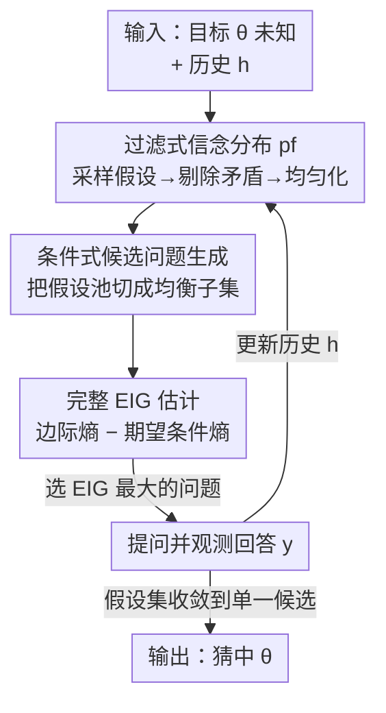

# BED-LLM: Intelligent Information Gathering with LLMs and Bayesian Experimental Design

**会议**: ICLR 2026  
**OpenReview**: [https://openreview.net/forum?id=qyylZMLYT8](https://openreview.net/forum?id=qyylZMLYT8)  
**代码**: 待确认  
**领域**: LLM Agent / 主动信息收集 / 贝叶斯实验设计  
**关键词**: 期望信息增益、序贯贝叶斯实验设计、主动提问、信念过滤、20 Questions

## 一句话总结
把序贯贝叶斯实验设计（BED）套到 LLM 上，让模型每一轮都挑"期望信息增益（EIG）最大"的问题去问用户，从而把 LLM 变成会主动、自适应收集信息的多轮对话 agent；在 20 Questions 和电影偏好推断上，平均成功率比直接 prompting 高出 37.4 个百分点。

## 研究背景与动机
**领域现状**：很多真实任务需要 LLM "主动把信息问出来"——澄清用户意图、做个性化、当多轮对话 agent、在决策流水线里当自动 agent（医疗问诊、故障排查、偏好学习、自动问卷）。这些任务的共性是：信息不会一次性给全，必须**一轮轮地、根据已收集到的回答来挑下一个问题**。

**现有痛点**：现代 LLM 在单轮里能写出漂亮、有洞察的问题，但一到多轮交互就拉胯——它们很难把问题"裁剪"到已经收集到的回答上。已有研究显示 LLM 在多轮猜谜游戏、任务澄清、IT 自动化、多步工具调用上都表现糟糕。

**核心矛盾**：直接把历史塞进上下文让 LLM "自己更新信念"（in-context updating）看似便宜，但实测即便 GPT-4o 这种强模型也常常**采样出与历史矛盾的假设、并过早过度自信**，而且历史越长问题越严重。根因是 LLM 的 in-context 更新并不等价于贝叶斯更新，对上下文信息一视同仁地用不起来。

**本文目标**：给 LLM 一套**有原则的、信息论驱动的**自适应提问机制，既要忠实地吸收历史，又要在 LLM 这种"采样容易、算熵难"的概率模型上保持计算可行。

**切入角度**：作者借用序贯贝叶斯实验设计（sequential BED）框架——它本来就是给"有生成模型、要自适应做设计决策"的场景设计的，核心是每步选"期望信息增益（EIG）最大"的实验。把"问哪个问题"当成"选哪个实验设计"，问题就转化成了一个序贯 BED 问题。

**核心 idea**：用 LLM 的预测分布构造一个关于目标 $\theta$ 与回答 $y$ 的联合概率模型，每一轮迭代地"选最大化 EIG 的问题 → 观测回答 → 更新信念"，而不是让 LLM 凭感觉直接生成下一个问题。

## 方法详解

### 整体框架
设目标量为 $\theta$（要猜的实体、用户的偏好画像等），初始只有一个先验信念 $p(\theta)$。每一轮 $t$，agent 向用户抛出一个问题 $x_t$、收到回答 $y_t$，把历史记为 $h_{t-1}=(x_i,y_i)_{i=1}^{t-1}$。BED 的核心是一个联合生成模型 $p(\theta, y; x)$，并以**期望信息增益**为目标来选问题：

$$\text{EIG}_\theta(x) = H[p(y;x)] - \mathbb{E}_{p(\theta)}\big[H[p(y|\theta;x)]\big]$$

即"回答的边际熵"减去"给定 $\theta$ 后回答的期望条件熵"——直观上就是：一个好问题既要答案**事先难猜**（边际熵高），又要在**知道答案后 $\theta$ 就被确定**（条件熵低）。BED-LLM 把这个目标搬到 LLM 上，每轮跑五步循环：(A) 从过滤后的信念里抽一组候选假设 $\Theta^{\text{cand}}$；(B) 让 LLM 生成一批多样化的多选题候选 $X^{\text{cand}}$；(C) 对每个候选问题估计 EIG；(D) 选 EIG 最大的问题问出去；(E) 观测回答、更新历史，回到 (A)。

整个方法的精髓不在"用 BED"这个口号，而在三处关键建模决策：**联合模型怎么因子分解、信念怎么更新、EIG 怎么估**。下图给出每轮循环的数据流（节点名即下文关键设计名）：

> 贯穿这套循环的建模底座是**先验–似然联合模型**（关键设计 1），它决定了 B 里的信念和 D 里的似然如何拼成 $p(\theta,y;x)$。

### 关键设计

**1. 先验–似然联合模型：把不确定性放在"回答空间"而非"假设空间"**

在 LLM 上构造联合模型有两条路：**先验–似然配对** $p(\theta;h)\,p(y;[\theta,x])$（先采 $\theta$、再在 $\theta$ 进上下文的条件下采 $y$），或**数据–估计配对** $p(y;[h,x])\,p(\theta;[h,x,y])$（先采 $y$、再据 $y$ 反推 $\theta$）。关键观察是：在 LLM 上这两种顺序**诱导出的联合分布并不相等**——一般地 $p_{\text{LLM}}(\theta)\,p_{\text{LLM}}(y;[\theta,x]) \neq p_{\text{LLM}}(y;x)\,p_{\text{LLM}}(\theta;[x,y])$，所以这是一个必须主动做、且影响巨大的设计决策。

BED-LLM 选先验–似然配对，初始联合模型为 $p(\theta,y;x)=p(\theta)\,p_{\text{LLM}}(y;[\theta,x])$。为什么？因为要估 EIG（公式里有熵项）就必须对某个条件分布算出**具体概率**，而 LLM "采样准但估熵难"——空间越复杂、维度越高，熵估计越不可靠。先验–似然配对让我们把"要算熵的那一项"放在**回答 $y$ 的空间**上（$H[p_{\text{LLM}}(y;[\theta,x])]$），而本文任务里 $y$ 的空间（多选答案）远比 $\theta$ 的空间（任意实体 / 用户画像）简单。作者给出一条可操作的判据：**$\theta$ 比 $y$ 复杂就用先验–似然，$y$ 比 $\theta$ 复杂就用数据–估计**。此外先验–似然还有个好处——信念状态 $p_f(\theta;h)$ 能被直接读出，从而保证当前信念与下一个问题 $x_t$ 无关（这是合法 BED 的理论要求）。

**2. 过滤式信念分布 $p_f(\theta;h)$：用拒绝采样补救 LLM 的"健忘与过度自信"**

直接用 $p_{\text{LLM}}(\theta;h)$ 当信念会出两个毛病：采样出与历史矛盾的假设、过早把概率质量压到少数几个假设上。完整贝叶斯更新虽正确但要海量 LLM 调用、不可行。BED-LLM 走折中路线，构造一个改造过的分布 $p_f(\theta;h)$，与 $p_{\text{LLM}}(\theta;h)$ 有两点不同。第一是**一致性过滤**：对每个采样到的 $\theta$，用似然 $p_{\text{LLM}}(y_i;[\theta,x_i])$ 逐一检查它与历史里每个问答对是否兼容，只要某个已观测答案的似然低于预设阈值就**拒绝**这个 $\theta$（阈值用来在"对模型不确定性的鲁棒"和"严格的历史一致性"之间权衡）；为省算力还加了**假设保留机制**——上一轮里仍与最新问答兼容的假设直接留用、不重新生成。第二是**促多样性**：不独立逐个生成假设，而是用鼓励多样性的 prompt 批量生成，过滤去重后**强加均匀分布**。消融里把这步换回原始 in-context 信念（ICL Beliefs），成功率会断崖式下跌，说明这步是核心而非锦上添花。

**3. 条件式候选问题生成：让 LLM 提"把假设池切成两半"的问题**

由于无法在所有可能问题的空间上直接优化 EIG，BED-LLM 让 LLM **先提一批候选、再从中选**。提候选有两种：**无条件生成**（只给历史 $h$，让 LLM 自由提问）和**条件生成**（同时给历史 $h$ 和已采样的假设集 $\Theta^{\text{cand}}$，prompt 它提那些能把假设池"切"成大致均衡子集的问题）。条件生成相当于把 EIG 的直觉"喂"给 LLM，引导它提信息量高的问题；为保多样性，用较高温度一次联合采 $M$ 个问题。条件生成在**离散、假设清晰**的场景（20 Questions）很有效，但在假设复杂重叠的场景（偏好推断）反而容易过拟合到 $\Theta^{\text{cand}}$，所以那里改用无条件生成。所有问题都限定为**多选格式**，以简化不确定性量化。

**4. 完整 EIG（非确定性似然）：拒绝"确定性似然"近似，多算一项条件熵**

以往把信息论用于 LLM 提问的工作几乎都假设"给定 $(\theta,x_t)$ 后答案是确定的"，这样 EIG 就退化成只剩边际预测熵 $H[p(y_t;x_t,h_{t-1})]$——也就是 Split / "切分假设池"那类目标。BED-LLM 指出这是错的：期望似然熵 $\mathbb{E}_{p(\theta;h)}[H[p(y_t|\theta;x_t,h)]]$ 衡量的是"一旦知道 $\theta$，这个问题还答不答得清楚"，把它留在目标里才能**避开那些含糊、有歧义、对学 $\theta$ 没用的问题**。论文里 $\tilde{x}_4$（"是欧洲人吗"）和 $\tilde{x}_5$（"更喜欢鞭挞金属还是死亡金属"）边际熵一样高，但 $\tilde{x}_5$ 的条件熵也高（就算知道是谁也答不准），两项抵消、几乎学不到东西——只看边际熵的方法会把两者打成平手而浪费一轮。BED-LLM 用一个 **Rao-Blackwell 化估计量**算完整 EIG：

$$\text{EIG}_\theta(x_t;h_{t-1}) \approx \frac{1}{N}\sum_{n=1}^{N}\sum_{y_t}p_{\text{LLM}}(y_t;[\theta_n,x_t])\log p_{\text{LLM}}(y_t;[\theta_n,x_t]) - \sum_{y_t}\hat{p}(y_t;[h_{t-1},x_t])\log\hat{p}(y_t;[h_{t-1},x_t])$$

其中 $\hat{p}(y_t;[h,x_t])=\frac{1}{N}\sum_n p_{\text{LLM}}(y_t;[\theta_n,x_t])$，$\theta_n\sim p_f(\theta;h)$。能这么算的前提就是设计 1 把似然放在了 $y$ 空间——概率可直接从 LLM 的 logits 读出。由 Rao-Blackwell 定理，这个估计量方差严格低于纯采样估计；且两项都来自同一批似然评估，留全 EIG **不增加任何额外调用**，所以"确定性似然近似"既不更准也不省钱，没有理由用。

### 一个完整示例
以 20 Questions 为例，历史 $h_2=$（"出生于 20 世纪？"→"是"，"是男性？"→"是"）。
- **(A) 提信念**：从 $p_{\text{LLM}}(\theta;h_2)$ 采假设并剔除矛盾的，得到 $\Theta^{\text{cand}}=\{$ 奥巴马、史蒂夫·欧文、休·劳瑞、Banksy、猫王 … $\}$，对其取均匀分布。
- **(B) 生成候选问题**：LLM 提出 $\tilde{x}_1$"出生在南极？"、$\tilde{x}_2$"出生于 19 世纪？"、$\tilde{x}_3$"是艺术家？"、$\tilde{x}_4$"是欧洲人？"、$\tilde{x}_5$"更爱鞭挞金属？"。
- **(C) 估 EIG**：$\tilde{x}_1$（所有人都答"否"）和 $\tilde{x}_2$（与历史冗余）EIG≈0；$\tilde{x}_3$ 切分不均 EIG≈0.15；$\tilde{x}_4$ 切分均衡且答案清脆 EIG≈0.80；$\tilde{x}_5$ 边际熵高但条件熵也高 EIG≈0.01。
- **(D) 选问**：选 EIG 最大的 $\tilde{x}_4$"是欧洲人？"问出去。
- **(E) 更新**：观测答案 $y_3$，置 $h_3=(h_2,(x_3,y_3))$，回到 (A)。当过滤后的假设集收敛到单个候选时，直接问"是不是某某？"作为最后一问。

## 实验关键数据

两个场景：**20 Questions**（最多 20 个 yes/no 问题猜目标实体，Animals / Celebrities / Things 三套各 100 个目标）和**偏好推断**（5 个多选题推断用户电影口味，200 个用户画像）。回答由一个独立的 answerer LLM 给出，它只看到真值 $\theta^*$ 和单个问题、看不到 questioner 的上下文；并测试 questioner 与 answerer 用**不同 LLM**的失配场景。

### 主实验（20 Questions 终局成功率，节选）

| 数据集 / 模型 | Prompt-Only | Split（旧 SOTA） | CoT | **BED-LLM** |
|---|---|---|---|---|
| Animals / GPT-4o | 45 | 83 | 62 | **93** |
| Animals / Mistral-Large | 33 | 85 | 35 | **95** |
| Celebrities / Mistral-Large | 19 | 63 | 42 | **91** |
| Celebrities / Qwen2.5-72B | 32 | 56 | 48 | **84** |
| Things / GPT-4o | 34 | 40 | 49 | **64** |
| Things / Llama-3.1-8B | 10 | 12 | 10 | **26** |

BED-LLM 在**所有数据集 × 所有 LLM** 上都显著领先；终局成功率通常是 Prompt-Only 的两倍以上，平均比直接 prompting 高 37.4 个百分点，且**从不掉点**。在偏好推断上，BED-LLM 推荐的电影平均评分也高于 Prompt-Only 和 Entropy，在 questioner / answerer 异构时优势最明显。

### 消融实验（每个消融只改 BED-LLM 的一个核心组件）

| 配置 | 改了什么 | 典型表现（vs BED-LLM） |
|---|---|---|
| **Full（BED-LLM）** | — | 最优 |
| Entropy | 用边际预测熵替代完整 EIG | 明显下滑，仅略好于 Split |
| Data–Estimation | 换成数据–估计联合模型 | 大幅下滑，甚至差于 Entropy |
| ICL Beliefs | 去掉信念过滤、用原始 $p_{\text{LLM}}(\theta;h)$ | 断崖式下跌（多数设置最差） |
| Implicit Max. | 用 LLM 自行判断替代显式 EIG 估计 | 远不如显式 EIG，但优于 Prompt-Only |

### 关键发现
- **信念过滤（ICL Beliefs 消融）贡献最大**：去掉拒绝采样直接用原始 in-context 信念，成功率最低——说明"忠实吸收历史"是整套方法成立的地基。
- **非确定性似然的价值在于"能算真 EIG"**：Entropy 用了 BED-LLM 的似然但只优化边际熵，结果与 Split 接近而非接近 BED-LLM，证明收益主要来自完整 EIG 目标本身，而非边际熵变化。
- **联合模型的因子分解是关键决策**：Data–Estimation 甚至差于 Entropy，印证"在本文任务里该把不确定性放在 $y$ 空间"的论断。
- **对模型失配鲁棒**：questioner 与 answerer 用不同 LLM 时优势依然保持，对真实用户场景很重要。

## 亮点与洞察
- **把"问哪个问题"严格形式化成"选哪个实验设计"**：这不是又一个 prompt 技巧，而是给主动信息收集装上了信息论的方向盘，每个设计决策都有理论交代。
- **一针见血指出"确定性似然假设"的坑**：以往工作让 EIG 退化成边际熵，会被"答案本身就模糊"的问题骗到；多算一项条件熵几乎零成本，却把这类废问题筛掉了——这个洞察可迁移到任何用信息增益选 query 的主动学习 / 主动检索场景。
- **用拒绝采样补救 LLM in-context 更新的不忠实**："采样 → 用似然查一致性 → 拒绝矛盾样本 → 均匀化"这套轻量流程，比指望 LLM 自己忠实更新历史靠谱得多，是个很实用的工程范式。
- **把建模选择讲成判据**：$\theta$ 复杂用先验–似然、$y$ 复杂用数据–估计——这条"按谁的熵更好估来选因子分解"的判据，对所有想在 LLM 上做概率推断的人都有参考价值。

## 局限与展望
- **算力开销**：每轮要采假设、过滤、对每个候选问题在每个假设上评似然，调用量比直接 prompting 大得多；论文有运行时表，但大规模实时部署的成本仍是问题。
- **依赖 LLM logits 与多选格式**：完整 EIG 估计需要拿到 $p_{\text{LLM}}(y;[\theta,x])$ 的具体概率（用 logits），对只给文本输出的闭源 API 不友好；问题被限制成多选也牺牲了开放式提问的灵活性。
- **条件生成在复杂假设空间会过拟合**：偏好推断里只能退回无条件生成，说明"切分假设池"的招数不通用。
- **过滤阈值是个需要调的超参**：一致性过滤的似然阈值在鲁棒性与严格一致性间权衡，论文未深入其敏感性。
- **答案空间需够简单**：整套方法的可行性建立在"$y$ 空间比 $\theta$ 空间简单"上，对 $y$ 也很复杂的任务（如开放式长回答）不直接适用。

## 相关工作与启发
- **vs Prompt-Only / CoT**：它们让 LLM 直接生成下一个问题（CoT 多一步 ReAct 式推理），没有显式假设生成、没有信息获取目标；BED-LLM 用显式 EIG 最大化，结构化推理本身（CoT）并不能补上这道差距。
- **vs Split（旧 SOTA）**：Split 选"最均匀切分假设集"的问题，等价于在确定性似然下最大化边际预测熵；BED-LLM 用非确定性似然算完整 EIG，并因此能筛掉"答案本身就含糊"的问题。Cooper 等、Hu 等、Kobalczyk 等、Mazzaccara 等、Piriyakulkij 等的方法都可视为 Split 这一目标的变体。
- **vs 完整序贯 BED（经典做法）**：经典 BED 用近似推断做完整贝叶斯更新，在 LLM 上要海量似然评估、不可行，也没利用 LLM 作为生成模型的自回归优势；BED-LLM 用过滤式信念在"完整贝叶斯"和"纯 in-context"之间取折中。
- **启发**：这套"用 LLM 当概率模型 + 信息论目标驱动交互"的范式，可推广到医疗问诊、主动检索、自动问卷、科学探究等任何"要把信息一步步问/查出来"的 agent 任务。

## 评分
- 新颖性: ⭐⭐⭐⭐⭐ 首个把先验–似然配对 + 非确定性似然完整 EIG 用于 LLM 信息收集，建模决策讲得透彻。
- 实验充分度: ⭐⭐⭐⭐⭐ 6 个 LLM × 3 数据集 + 偏好推断，含 5 个消融与模型失配测试，结论自洽。
- 写作质量: ⭐⭐⭐⭐⭐ 把 BED 与 LLM 的衔接、因子分解判据、EIG 估计讲得清晰，图 1 的具体走例很有说服力。
- 价值: ⭐⭐⭐⭐ 给主动信息收集装上信息论方向盘，范式可迁移；落地成本与对 logits 的依赖是主要门槛。

<!-- RELATED:START -->

## 相关论文

- [\[ICLR 2026\] An Information Theoretic Perspective on Agentic System Design](an_information_theoretic_perspective_on_agentic_system_design.md)
- [\[ICLR 2026\] A Benchmark for Deep Information Synthesis (DeepSynth)](a_benchmark_for_deep_information_synthesis.md)
- [\[ICLR 2026\] Sculptor: Empowering LLMs with Cognitive Agency via Active Context Management](sculptor_empowering_llms_with_cognitive_agency_via_active_context_management.md)
- [\[ICLR 2026\] FlowSearcher: Synthesizing Memory-Guided Agentic Workflows for Web Information Seeking](flowsearcher_synthesizing_memory-guided_agentic_workflows_for_web_information_se.md)
- [\[ICLR 2026\] InfoMosaic-Bench: Evaluating Multi-Source Information Seeking in Tool-Augmented Agents](infomosaic-bench_evaluating_multi-source_information_seeking_in_tool-augmented_a.md)

<!-- RELATED:END -->
