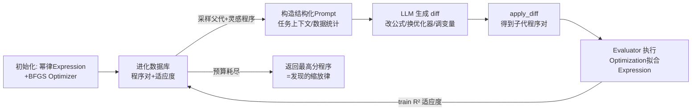

# Can Language Models Discover Scaling Laws?

**会议**: ICLR 2026  
**OpenReview**: [https://openreview.net/forum?id=TPTtWC0pGk](https://openreview.net/forum?id=TPTtWC0pGk)  
**代码**: 已开源（论文提供 Website / HuggingFace / GitHub 链接）  
**领域**: LLM Agent / 自动科学发现  
**关键词**: 缩放律发现, 进化式智能体, 符号回归, AI Scientist, 超人表现  

## 一句话总结
本文提出 **SLDAgent**——一个协同进化「公式生成器 + 参数优化器」的进化式智能体，并配套首个缩放律发现基准 **SLDBench**，首次证明 LLM 智能体能自动发现出在全部 8 个任务上外推精度都超过人类专家手工推导的缩放律。

## 研究背景与动机
**领域现状**：缩放律（scaling law）是基础模型开发的基石——从 Kaplan/Chinchilla 的预训练损失 $L=\theta_0+\theta_1/N^{\theta_2}+\theta_3/D^{\theta_4}$，到近期的 MoE、词表大小、SFT、领域混合、学习率-批大小等新场景，缩放律不断涌现，用于预测大规模模型性能、选最优配置和挑选预训练 checkpoint。

**现有痛点**：发现新场景的缩放律几乎完全依赖人类专家凭直觉和经验提出数学形式，再手工拟合系数。这个过程**慢、费力、且常常次优**，需要反复「假设-实验」循环，还受限于人类分析多变量复杂关系的能力。

**核心矛盾**：缩放律发现（SLD）同时要求**符号性**（必须是可泛化的数学公式）和**开放性**（公式空间无限、没有先验答案）。现有 AI Scientist 类智能体擅长自动化工程流程，但在开放式问题构造、原则化实验设计和长程鲁棒执行上力不从心；论文实测发现，把强 LLM 直接套进 Codex/Claude Code 等现成 CLI 智能体，依旧造不出比人类更好的缩放律。

**本文目标**：严谨回答「LLM 智能体能否比人类更高效、更准确地发现支配它们自身行为的缩放律？」

**核心 idea**：**进化搜索 + 公式/优化协同进化**——借鉴人类研究是「在已有提案上代代改进」的过程，把缩放律发现建模成在可执行程序空间上的进化优化，让 LLM 持续变异「公式表达式」和「参数拟合例程」这对子程序，用外推数据上的 $R^2$ 作清晰、连续、无需学习奖励模型的适应度信号。

## 方法详解

### 整体框架
SLDBench 把每个任务定义为：给定一组观测试验 $\mathcal{D}=\{(x_i,j_i,y_i)\}$（$x$ 是模型规模/数据量/批大小等特征，$y$ 是损失/困惑度/准确率，$j$ 是实验设置索引），要求产出一个符号表达式 $f_\theta:x\mapsto\hat y$ 以及每个设置各自拟合的参数 $\{\theta_j\}$，使其在「最大规模」留出的外推测试集上 $R^2$ 尽量接近 1。SLDAgent 则是一个进化式编码智能体：每个候选「程序」由一对子程序组成——`Expression(x, θ)` 定义符号模型 $f_\theta$，`Optimization` 例程负责把参数拟合到数据上；LLM 不断变异这对子程序，子代被执行、评分、回写进化数据库，种群持续改进，最终返回适应度最高的程序作为发现的缩放律。

### 关键设计

**1. 公式-优化协同进化（co-evolution of Expression & Optimization）：把「猜公式」和「拟合系数」一起搜**。SLDAgent 没有采用通用、问题无关的程序进化（如 AlphaEvolve 那种只演化一个函数），而是把每个候选拆成 `Expression` 和 `Optimization` 两个可分别变异的子程序。这样做的动机是 SLD 的特殊性：光有好公式但优化器拟不准系数，或反之，都拿不到高分。智能体从基线程序对（典型为幂律 `Expression` + 标准 BFGS `Optimization`）出发，LLM 在一次变异里可以改公式形态、换优化算法（如改 BFGS 为 SGD、调初始化）、或调全局变量，使两个子程序朝同一目标协同上升。论文消融证明这种协同进化比问题无关进化更能榨干 LLM 能力。

**2. 进化搜索循环 + 探索-利用的概率采样**：每步从数据库按概率混合策略选父代——**利用**高分程序（70%）、**多样性**（20%）、**精英**顶尖程序（10%），再连同若干高分「灵感」程序一起塞进结构化 prompt（含任务上下文、数据统计如取值范围/均值/方差）。LLM 据此提出对父代代码的修改 diff，子代程序被执行：其 `Optimization` 在 seen 数据上拟合 `Expression`，算出训练集 $R^2$ 作为适应度回写数据库，迭代固定预算后终止。**测试集全程不被触碰**，保证外推评估的诚实性。

**3. 多岛 + MAP-Elites 防早熟**：沿用 AlphaEvolve，用五座「岛屿」并行演化、并以 MAP-Elites 按「适应度分数、复杂度、新颖度」三个维度结构化种群，主动维持多样性、避免过早收敛到局部最优。系统搭建在 OpenEvolve 框架之上。

**4. 发现的公式更「有原则」而非仅更准**：案例分析揭示 SLDAgent 不是靠堆参数过拟合。例如 SFT 任务，人类律 $L=\theta_2+\frac{\theta_0}{D^{\theta_1}+\theta_3}$ 里 $\theta_3$ 与 $D^{\theta_1}$ 同量纲、可解释性差；SLDAgent 律 $L=\theta_2+\frac{\theta_0}{1+(D/\theta_3)^{\theta_1}}$ 用无量纲比值 $(D/\theta_3)^{\theta_1}$，使 $\theta_3$ 保留「数据规模」的自然单位、直接刻画曲线从陡降转向饱和的特征尺度。又如 MoE 任务，发现的 $L=\frac{\theta_1 N^{\theta_2}}{1+\theta_3 E^{\theta_4}}+\theta_5 N^{0.6\theta_2}+\theta_6$ 干净地分离了参数驱动项、专家衰减因子和不可约损失下限 $\theta_6$，保证 $E\to\infty$、$N\to\infty$ 时收敛到有限极限；而人类的 log-linear 指数形式在外推时对拟合符号高度敏感、可能发散（$R^2$ 0.891 vs 0.732）。

## 实验关键数据

### 主实验表格（固定 GPT-5，对比 8 个智能体架构，$R^2$ 5 次平均）

| 方法 | parallel | vocab | SFT | domain_mix | moe | d_constrain | lr&bsz | u_shape | **Avg R²** |
|---|---|---|---|---|---|---|---|---|---|
| Aider | 0.991 | 0.132 | 0.131 | 0.514 | 0.119 | 0.718 | -0.659 | -0.474 | 0.184 |
| OpenHands | 1.000 | 0.182 | 0.640 | 0.899 | 0.466 | 0.534 | -0.909 | -0.278 | 0.317 |
| CodeX | 0.999 | 0.977 | 0.855 | 0.933 | 0.649 | 0.763 | -0.039 | -0.740 | 0.550 |
| Goose | 1.000 | 0.962 | 0.899 | 0.944 | 0.813 | 0.894 | 0.280 | -0.232 | 0.695 |
| **Human** | 1.000 | 0.966 | 0.957 | 0.671 | 0.703 | 0.911 | -0.076 | -1.000 | 0.517 |
| **SLDAgent** | **1.000** | **0.987** | **0.993** | **0.988** | 0.773 | **0.944** | **0.604** | -0.305 | **0.748** |

SLDAgent 以 0.748 居首，远超次优 Goose（0.695）和人类（0.517），在 parallel 上追平人类、其余任务全面超越人类。

### 消融/跨模型表格（SLDAgent vs 各厂商原生 CLI，$R^2$ Avg）

| 模型 | 原生 CLI | SLDAgent | 增益 |
|---|---|---|---|
| Gemini-2.5-Flash | 0.077 | 0.506 | **+0.429** |
| Gemini-3-Pro | 0.382 | 0.636 | +0.254 |
| Claude-Haiku-4.5 | 0.419 | 0.519 | +0.100 |
| Claude-Sonnet-4.5 | 0.472 | 0.590 | +0.118 |
| o4-mini | 0.349 | 0.657 | +0.308 |
| GPT-5 | 0.550 | 0.748 | +0.198 |

无论换哪个 LLM，SLDAgent 都稳定抬升其原生 CLI 智能体表现，说明**决定性因素是智能体设计而非底座 LLM**。

### 关键发现
- **超人表现**：配 GPT-5 时，SLDAgent 在 8 个任务上全部追平或超过人类专家。
- **任务难度谱很宽**：parallel 几乎所有智能体都接近满分；lr&bsz 与 u_shape 极难（弱智能体常出现强负 $R^2$，连人类在 u_shape 上也只有 -1.000），SLDAgent 是唯一在近乎全套任务上都稳健的方法。
- **应用一（预训练超参）**：发现的 $L(N,D,lr,bsz)$ 显式公式允许令 $\partial L/\partial lr=\partial L/\partial bsz=0$ 解析求最优；外推到 1B 模型/100B token，解析最优点的实际验证损失 2.0776 与真实最优 2.0762 仅差 0.067%。
- **应用二（微调选模型）**：用 6.25% 子集拟合 SFT 律预测全量表现，从 14 个候选里选最优 LLM，SLDAgentLaw 平均 RelAcc 达 100%、PearCorr 87.7%，全面超过 RectifiedLaw / SubTuning 等 5 个基线。

## 亮点与洞察
- **首次实证「AI 能发现支配自己的缩放律且优于人类」**：把 AI Scientist 从「写代码/跑实验」推进到「产出可泛化的符号科学知识」，且这些知识真能反哺研究社区。
- **基准本身有价值**：SLDBench 聚合 5000+ 真实训练实验、8 个异质任务，用「连续、可直接从外推数据计算、无需学习奖励模型」的 $R^2$ 作目标，区别于「重发现已知公式」的符号回归和「自动化工程」的 MLE-Bench。
- **可解释性是副产品而非妥协**：发现的公式在量纲一致性、渐近行为上比人类律更有原则，证明进化搜索找到的不是过拟合而是「更对」的结构。
- **智能体 > 模型**：同一 GPT-5 下不同智能体差距巨大（0.184→0.748），强调系统设计的杠杆作用。

## 局限与展望
- **u_shape 仍是硬伤**：作为对抗性外推场景，连 SLDAgent（-0.305）也没真正攻克，人类同样失败（-1.000），说明非单调缩放预测仍开放。
- **模型容量瓶颈**：小模型（Gemini-2.5-Flash / Claude-Haiku-4.5）在 lr&bsz 等难任务上即便用 SLDAgent 仍低于人类基线，搜索框架无法完全弥补底座能力。
- **任务覆盖有限**：目前 8 个任务且依赖已有开源数据，作者表示会持续扩展；对全新、无任何先验的缩放场景泛化性待验证。
- **评估在沙箱内、无网络**：实际科研中数据获取、实验设计的开放性尚未纳入闭环。

## 相关工作与启发
- **进化式编码智能体**：直接受 AlphaEvolve / OpenEvolve 启发（多岛、MAP-Elites、程序进化），把其从「优化矩阵乘法、Ramsey 数下界」迁移到科学公式发现。
- **AI Scientist 谱系**：与 Lu et al. 的自动论文、Swanson 的自动药物发现同属自动科学发现，但本文聚焦「符号化+开放式」这一更深层智能。
- **缩放律文献**：站在 Chinchilla、StepLaw、MoE/词表/SFT/领域混合等一系列人类缩放律之上，把它们当作强基线去超越。
- **启发**：把「目标清晰、连续、可计算但最优解未知」的科学问题统一交给进化搜索 + LLM 变异，可能是 AI4Science 的一类通用范式；协同进化「模型形态 + 拟合过程」的思路也可迁移到其他符号建模任务。

## 评分
- **新颖性**: ⭐⭐⭐⭐⭐ 首次证明 AI 智能体能发现超越人类的缩放律，并提出首个 SLD 基准，概念上开辟新范式。
- **实验充分度**: ⭐⭐⭐⭐⭐ 8 任务 × 8 智能体 × 6 LLM × 5 次重复，外加两个真实下游应用（预训练超参、微调选模型）和公式形态深度分析，非常扎实。
- **写作质量**: ⭐⭐⭐⭐ 动机清晰、案例分析（SFT/MoE 公式对比）很有说服力；任务命名和表格密集，初读略需对照。
- **价值**: ⭐⭐⭐⭐⭐ 既给社区开源基准+框架，又能解析求出近最优预训练超参、做高效选模型，理论与实用价值兼具。

<!-- RELATED:START -->

## 相关论文

- [\[ICLR 2026\] Agentic Context Engineering: Evolving Contexts for Self-Improving Language Models](agentic_context_engineering_evolving_contexts_for_self-improving_language_models.md)
- [\[ICLR 2026\] GPS: Graph-guided Proactive Information Seeking in Large Language Models](gps_graph-guided_proactive_information_seeking_in_large_language_models.md)
- [\[ICLR 2026\] ToolWeaver: Weaving Collaborative Semantics for Scalable Tool Use in Large Language Models](toolweaver_weaving_collaborative_semantics_for_scalable_tool_use_in_large_langua.md)
- [\[ICLR 2026\] Scaling Agent Learning via Experience Synthesis](scaling_agent_learning_via_experience_synthesis.md)
- [\[ICLR 2026\] Nemotron-Research-Tool-N1: Exploring Tool-Using Language Models with Reinforced Reasoning](nemotron-research-tool-n1_exploring_tool-using_language_models_with_reinforced_r.md)

<!-- RELATED:END -->
