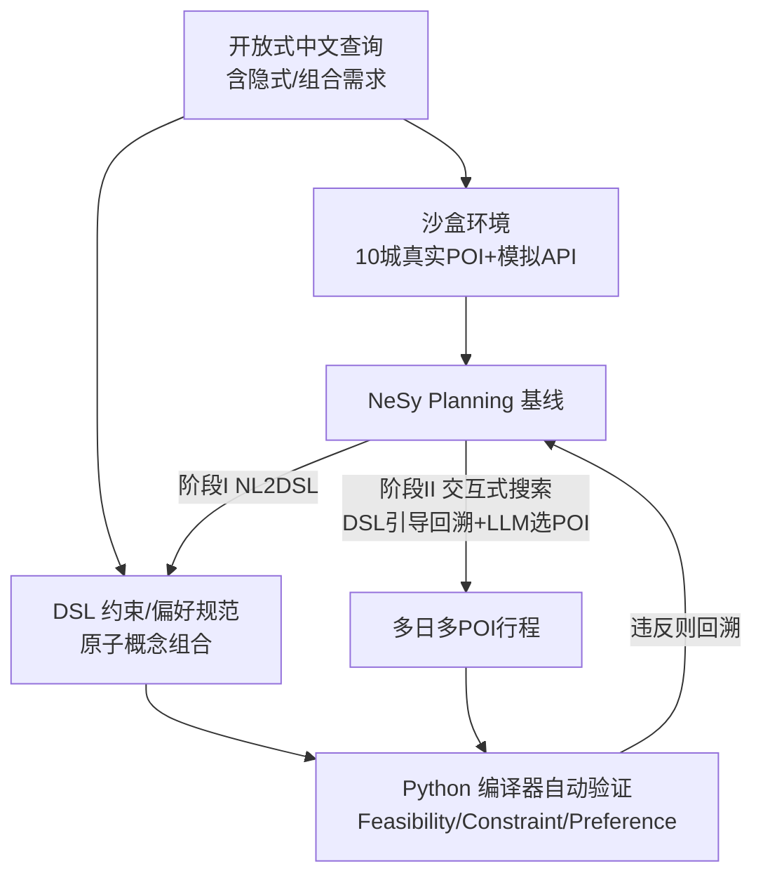

<!-- 笔记 -->
# ChinaTravel: An Open-Ended Travel Planning Benchmark with Compositional Constraint Validation for Language Agents

**会议**: ICLR 2026  
**OpenReview**: [https://openreview.net/forum?id=0YRVlxY9BH](https://openreview.net/forum?id=0YRVlxY9BH)  
**代码**: 有（Project Page / Codebase / Dataset 均开放，南京大学 LAMDA + 华为诺亚）  
**领域**: LLM Agent / 旅行规划 Benchmark / 神经符号规划  
**关键词**: Language Agent, Travel Planning, Compositional Constraint, Domain-Specific Language, Neuro-Symbolic  

## 一句话总结
ChinaTravel 用一套可组合的领域专用语言（DSL）把"开放式自然语言旅行需求"自动翻译成可验证的逻辑约束与偏好目标，配上 1154 名真实用户的中文查询，构建出首个真正开放、需要上下文落地与未见约束组合泛化的多日多 POI 旅行规划基准，并实证神经符号 agent 在约束满足率上比纯 LLM 高出 10 倍（37.0% vs 2.60%）却仍远未解决。

## 研究背景与动机
**领域现状**：旅行规划被视为 Language Agent 的标志性场景——它把巨大的实际需求和严格的约束满足问题耦合在一起，agent 需要调用航班、火车、景点、餐厅、酒店等多种工具，跨空间、时间、预算等维度做相互依赖的决策。此前 TripPlanning（Zheng et al. 2024）和 TravelPlanner（Xie et al. 2024）是该领域的主流基准。

**现有痛点**：现有基准都建立在"槽位填充（slot-filling）"范式上——agent 只需为固定属性（预算、日期、房型等）抽取数值。作者指出这带来四个根本缺陷：(i) **任务偏置**，偏重城际行程而忽略城内调度这种约束更密集的场景；(ii) **僵硬的约束验证**，依赖固定规则列表，无法泛化到未见需求；(iii) **合成查询**，全是模板化 LLM 合成的句子，缺乏真实语义；(iv) **误导性的 NeSy 评测**，只暴露纯 LLM 的约束遵守短板，却忽略神经符号方法。一个尖锐的证据是：TravelPlanner 发布几个月后，Hao et al. (2025) 用"LLM 抽约束 + 形式化验证"的神经符号管线就把成功率从 4% 拉到 97%——说明模板化、固定约束的设定已接近饱和，根本没暴露 NeSy 方法在真实自然语言交互上的瓶颈。

**核心矛盾**：真实人类需求是**可组合的、多样的、且常常隐式表达**的（"带着不能吃辣的孩子出行"暗含排除川渝菜系），而槽位填充范式只能表达固定命题逻辑，无法表达"用餐预算 1000 元"或"第二天 18 点前到上海"这类跨事件的组合约束，每加一条新需求都要人工写规则。

**本文目标**：构建一个能随真实需求空间演化、同时保持可自动验证的开放式旅行规划基准。

**核心 idea**：**用 DSL 把约束验证从"固定规则列表"升级为"组合语言空间"** —— 提供一小套基本概念函数 + 类 Python 语法，让任意需求都能写成原语的组合，并直接用 Python 编译器自动验证计划，从而既可扩展又可自动化；再叠加 1154 名真实用户的开放式查询，逼出"上下文落地"和"未见概念组合泛化"两大真正的开放世界挑战。

## 方法详解

### 整体框架
ChinaTravel 由三层构成：(1) 一个收录中国 10 个热门城市真实数据的 **沙盒环境**（720 架飞机、5770 趟列车、3413 个景点、4655 家餐厅、4124 家酒店，全部带名称/位置/营业时间/价格/类型标注，并模拟商用 API 接口），用 25 条环境约束作可行性度量；(2) 一套 **可组合 DSL**，把空间/时间/成本/类型维度的原子概念组合成逻辑约束（硬）与偏好目标（软），用 Python 编译器自动验证 feasibility / constraint satisfaction / preference ranking 三类指标；(3) 一个 **四阶段构建管线**产出的开放式数据集——含 154 条真人验证查询（Human-154）与 1000 条真人测试查询（Human-1000）。作者还给出一个 **NeSy Planning** 基线作为初步解法。

### 关键设计

**1. 可组合的领域专用语言（DSL）：把约束从命题逻辑拉进组合语言空间。** 这是全文的引擎。TravelPlanner 只有 5 个固定概念（总预算、房规、房型、菜系、交通），每个映射到一个具体需求，本质是命题逻辑——系统只推理原子命题的真值关系，无法触及旅行事件的内部结构与关系，因此表达不了"用餐预算 ≤1000"或"day2 18 点前到上海"。ChinaTravel 的 DSL 提供变量（指代行程活动）、布尔运算（`not`/`and`/`or`）、数值比较与计算（`<`/`>`/`==`/`+`/`-`/`*`/`/`）、属性函数（`cost(var)`、`type(var)`、`time(var)`）、关系函数（`dist(expr1, expr2)`）、赋值副作用（`var = expr`）、集合运算（并/交/差）、枚举（`for var in {var}`）与条件副作用（`if expr : effect`）。于是一条复杂需求可以写成原语的组合，例如"参观博物馆"被翻译为 $\exists x \in \text{Attraction\_visiting},\ x.\text{type}=\text{museum}$，"品尝北京菜"翻译为 $\exists x \in \text{Restaurants\_visiting},\ x.\text{cuisine}=\text{Beijing Cuisine}$，"预算 5000"翻译为 $\text{total\_budget} \le 5000$。关键收益是：新需求不再需要逐条写规则引擎，而是直接编译执行验证，使约束空间从 TravelPlanner 的约 10 种组合指数级扩张到 Human-1000 的 100 种类型（其中 85 种是模板里从未出现的新约束）。

**2. 软偏好的目标化建模：把"尽量多看景点"变成可自动比较的优化目标。** 旅行需求不只有硬约束，还有大量软偏好——"软"意味着它们不是二值的约束满足问题，而是基于连续值的定量比较。常见偏好包括最大化参观景点数、最小化 POI 间交通时间、靠近某个特定 POI。ChinaTravel 把这些偏好用同一套 DSL 形式化为最小化/最大化目标（例如 $\max \sum_x \mathbb{1}[x \in \text{Attraction\_visiting}]$），从而对偏好满足度也能自动评测、做 preference ranking，而不必人工判分。这一设计让基准能同时考核"满足硬约束"和"在可行解里挑更优的"两种能力。

**3. 四阶段构建 + 真人开放需求注入：让基准随真实需求空间演化。** 数据不是一次性合成的，而是闭环迭代出来的：阶段 I 人工搭建数据库与仿商用 API；阶段 II 用 DeepSeek-V2.5 把随机构造的查询骨架转成自然语言，按复杂度分 Easy（1 条额外约束）/Medium（3-5 条），并鼓励表达多样化（"尝北京菜"→"试试当地美食"）；阶段 III 质量控制与自动验证——人工核对查询是否符合符号骨架、用 Python 编译器执行 DSL 验证、并用启发式搜索保证每条查询至少有一个可行解；阶段 IV 是最关键的差异点——在第一轮闭环开发后，通过问卷收集 250+ 真人需求，严格质控后得到 154 条含模板里没有的新约束（如出发时间、用餐成本）的 Human-154，再经问卷平台 WJX 扩展出 Human-1000。正因为真实用户不断引入新的复合约束、不可能在开发期穷举，DSL 的可扩展可验证特性才让基准能"拥抱演化的需求空间"，系统性地暴露开放世界挑战。

**4. C-LPR 度量与 NeSy Planning 基线：堵住作弊、给出解耦式解法。** 为防止评测被"谎报成本以满足预算"这类不现实的约束优先级钻空子，作者提出 **Conditional Logical Pass Rate (C-LPR)**：只在计划先通过环境约束的前提下，再统计逻辑约束的满足率：$\text{C-LPR}=\frac{\sum_{p\in P}\mathbb{1}_{\text{passed(Env},p)}\cdot\sum_{c\in C_p}\mathbb{1}_{\text{passed}(c,p)}}{\sum_{p\in P}|C_p|}$，从而度量"现实边界内有意义的约束满足"。配套的 NeSy Planning 基线分两阶段：阶段 I **NL2DSL**用 Reflexion + DSL 语法检查器迭代（5 轮）把自然语言翻成逻辑/偏好 DSL；阶段 II **交互式搜索**用神经符号求解器按符号草图顺序排活动、由 LLM 驱动 POI 推荐，逐步生成多日行程并做 DSL 验证，违反约束就回溯直到找到可行解（每条查询符号搜索限时 5 分钟，不含 LLM 推理）。其核心思想是把**理解（灵活处理自然语言）、规划（DSL 引导的回溯/验证）、执行（精确工具调用）三者解耦**，从而在上下文丰富的长程场景里兼顾适应性与约束遵守。

## 实验关键数据

### 主实验表格（Main Results，关键摘录）

| 方法（backend） | 子集 | DR | EPR(Mic.) | LPR(Mic.) | C-LPR | **FPR** |
|---|---|---|---|---|---|---|
| Act (DeepSeek) | Easy | 70.4 | 49.9 | 64.6 | 30.6 | **0** |
| ReAct one-shot (GPT-4o) | Easy | 77.5 | 68.3 | 74.1 | 52.3 | **5.33** |
| **NeSy Planning (DeepSeek)** | Easy | 75.3 | 75.3 | 70.4 | 52.6 | **52.6** |
| **NeSy Planning (DeepSeek)** | Human-154 | 51.9 | 53.2 | 47.0 | 37.6 | **37.0** |
| **NeSy Planning (DeepSeek)** | Human-Test(1000) | 44.6 | 44.5 | 38.7 | 23.3 | **23.3** |
| TTG (oracle, SCIP) | Easy | 18.3 | 21.5 | 17.2 | 15.0 | 8.66 |
| LLM-Modulo (GPT-4o, oracle verifier) | Easy | 91.6 | 88.2 | 95.5 | 84.6 | 7.00 |
| NeSy Planning* (Oracle Translation, DeepSeek) | Easy | 82.6 | 81.7 | 82.2 | 75.3 | **74.0** |

> 核心数字：纯 LLM 方法 EPR 几乎为零、FPR 普遍为 0（DeepSeek 在 Easy 仅 6% EPR/5% FPR 是唯一例外，疑因中文训练语料更广）；ReAct one-shot 在 Macro LPR 上亮眼却 FPR=0，说明它靠"抄近路"绕过约束。NeSy Planning 在三个子集上把 FPR 拉到 52.6% / 37.0% / 23.3%，相对纯神经方法约束满足率提升约 10×（37.0% vs 2.60%）。

### 消融/诊断实验（成本与已有 NeSy 方法的失效）

| 方法 | #Input tok | #Output tok | 成本($) |
|---|---|---|---|
| Act | 88K | 2K | 0.219 |
| ReAct (0-shot) | 206K | 3K | 0.638 |
| ReAct (1-shot) | 1058K | 4K | 2.43 |
| LLM-modulo | 362K | 11K | 1.12 |
| **NeSy Planning** | 467K | 3K | **0.306** |

- **TTG（MILP 求解器）不可行**：约束规模约 $O(N^3T)$，即便下采样到 $N=22$、1 小时槽 $T=24$，一个 2 天实例就有约 60 万条约束；放宽到 15 分钟/查询，Easy 仅 18% 有解、FPR 进一步降到 8%；2 天行程仅 23% 求出解、3 天仅 6%。
- **LLM-modulo 反馈回路不 scale**：GPT-4o 累积错误最低（µ=3.2±0.8），但每轮成功纠错数 3-5 轮后迅速衰减到 ≤1，多轮 refinement 失速还徒增成本延迟。

### 关键发现
- **上下文落地（Intent Grounding）难**：Human-1000 中 78.4% 的 DSL 语句含需要文化/上下文推断的"语义 POI"（TravelPlanner 仅 5.4%）；在真实语义 POI 上，DeepSeek-V3 准确率 94%→76%、GPT-4o 79%→53%。
- **未见概念组合泛化崩塌**：未见 DSL 结构占 84% 的样本，但结构对齐准确率只有 12%（按频率加权 9%）；而已见模式（16%）能到 93%。这是 NeSy Planning 标准模式与 Oracle Translation 模式间巨大差距的根因。
- **语法合规反而丢约束**：Reflexion + 语法检查虽能快速把解析错误降到 0，却诱导 LLM 在迭代中"删约束"（GPT-4o 平均比 DeepSeek-V3 少生成约 2 条约束），导致 GPT-4o 在 Human-154/1000 上反而不如 DeepSeek-V3。
- **超长视野压垮单遍生成**：每条查询 >1200 候选 POI（TravelPlanner 244 的 4 倍）、密集 POI 网络生成 540M 上下文 token（远超 GPT-4o 128K / DeepSeek-V3 64K 上限），证明传统单遍文本生成不适用，需层次分解或符号规划。

## 亮点与洞察
- **把"约束验证"本身做成可组合语言**是最大创新点：用一小套原语 + Python 编译器，既能表达跨事件的复杂逻辑（用餐预算、到达时刻），又天然可自动验证、可指数级扩展约束空间，绕开了"每条需求人工写规则"的死结。
- **真人查询不是点缀而是诊断工具**：Human-154/1000 直接逼出"语义 POI 落地"和"未见组合泛化"两个用合成数据永远测不到的开放世界瓶颈，并给出量化（78.4% vs 5.4%、12% vs 93%）。
- **C-LPR 是一个被低估的评测贡献**：它用"先过环境约束再算逻辑约束"堵住了"谎报数值刷分"的作弊路径，比 FPR 更能反映现实意义上的约束满足。
- **诚实地承认 NeSy 也没解决**：作者没有把 NeSy Planning 包装成银弹，而是明确指出 37% 的天花板和三大持续挑战（DSL 语法合规丢约束、上下文落地、未见组合泛化），把基准定位成"暴露瓶颈"而非"刷分"。

## 局限与展望
- **NeSy Planning 仅是初步基线**：标准模式与 Oracle Translation 间的大 gap 说明 NL2DSL 翻译质量是当前主要瓶颈，作者未给出训练式解法，只指出可能需要 domain-adaptive training。
- **地域与语言局限**：数据集聚焦中国 10 城与中文查询（虽提供英文版），文化落地知识（菜系、地域口味）高度依赖中国常识，跨地域迁移性待验证。
- **符号搜索时限的工程性**：5 分钟/查询的搜索预算与 5 轮 Reflexion 都是人为设定，真实可交互延迟下的表现未充分讨论。
- **偏好评测相对单薄**：软偏好的 preference ranking 在主表中体现不足，主要指标仍围绕硬约束的 FPR/C-LPR。
- **展望**：未见组合泛化（84% 样本、12% 对齐）是真正开放的研究问题，作者建议走"类人推理、把已有知识泛化到新问题"的路线，而非穷举需求。

## 相关工作与启发
- **对比 TravelPlanner / TripPlanning**：本文的全部设计都是对"槽位填充范式接近饱和"的回应——Hao et al. (2025) 在 TravelPlanner 上用 NeSy 管线把成功率从 4% 拉到 97% 正是促使作者把约束验证升级为组合 DSL 的直接动机。
- **神经符号规划谱系**：方法上承接 LLM-modulo（Kambhampati et al. 2024）、TTG（Ju et al. 2024，MILP 化）、以及 Hao/Pan/Yao/Xiong 等 NeSy 管线，但通过 DSL 扩展到多日多 POI 的真实长程场景，并实证前两者在该规模下失效。
- **对组合性认知的呼应**：作者反复引用 Fodor (1975/2008)、Piantadosi et al. (2016) 关于人类认知组合性的论述，把"约束应当可组合"提升为方法论原则。
- **启发**：这套"用可验证 DSL + 真人开放查询暴露泛化瓶颈"的范式可迁移到其他约束密集型 agent 任务（日程编排、供应链、行程外的资源调度），其中 C-LPR 式的"先可行再合规"评测思想尤其值得借鉴。

## 评分
- **新颖性**: ⭐⭐⭐⭐⭐ —— 把约束验证本身做成可组合 DSL、并用真人查询逼出上下文落地与未见组合两大开放挑战，是对现有 slot-filling 基准范式的实质性突破。
- **实验充分度**: ⭐⭐⭐⭐⭐ —— 覆盖 6 个 LLM × 5 类方法（含 TTG/LLM-modulo/NeSy）、三套子集、多维指标（DR/EPR/LPR/C-LPR/FPR）+ Intent Grounding 与语法泛化诊断，且诚实暴露各方法失效根因。
- **写作质量**: ⭐⭐⭐⭐ —— 动机—缺陷—设计的逻辑链清晰，DSL 表格与图示到位；正文有少量拼写/语法瑕疵，部分诊断分析略密。
- **价值**: ⭐⭐⭐⭐⭐ —— 数据/代码/沙盒全开放，为约束感知的 Language Agent 提供了可演化、可自动验证的真实测试床，具备成为该方向标准基准的潜力。

<!-- RELATED:START -->

## 相关论文

- [\[ICLR 2026\] WebWeaver: Structuring Web-Scale Evidence with Dynamic Outlines for Open-Ended Deep Research](webweaver_structuring_web-scale_evidence_with_dynamic_outlines_for_open-ended_de.md)
- [\[ICLR 2026\] Natural Language PDDL (NL-PDDL): Open-world Goal-oriented Commonsense Regression Planning in Embodied AI](natural_language_pddl_nl-pddl_for_open-world_goal-oriented_commonsense_regressio.md)
- [\[ICLR 2026\] GTool: Graph Enhanced Tool Planning with Large Language Model](gtool_graph_enhanced_tool_planning_with_large_language_model.md)
- [\[ICML 2025\] Open Source Planning & Control System with Language Agents for Autonomous Scientific Discovery](../../ICML2025/llm_agent/open_source_planning_control_system_with_language_agents_for_autonomous_scientif.md)
- [\[ICLR 2026\] DreamPhase: Offline Imagination and Uncertainty-Guided Planning for Large-Language-Model Agents](dreamphase_offline_imagination_and_uncertainty-guided_planning_for_large-languag.md)

<!-- RELATED:END -->
