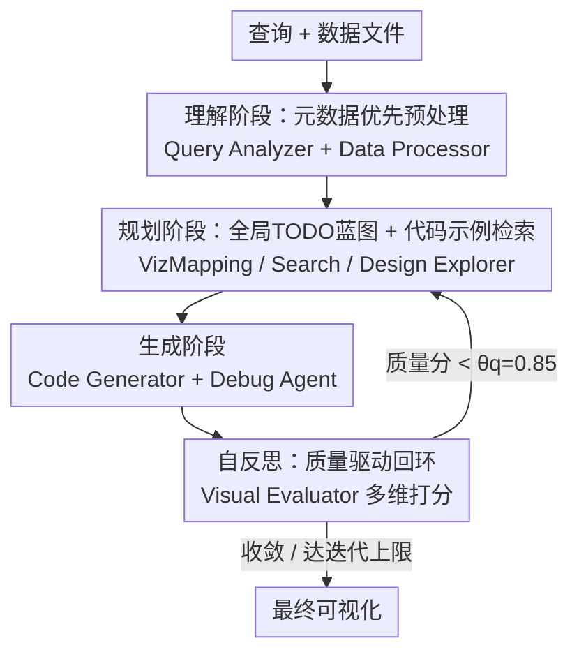

# CoDA: Agentic Systems for Collaborative Data Visualization

**会议**: ICLR 2026  
**OpenReview**: [https://openreview.net/forum?id=M4RKeHIAxw](https://openreview.net/forum?id=M4RKeHIAxw)  
**项目页**: [https://coda-agent.github.io/CoDA/](https://coda-agent.github.io/CoDA/)  
**领域**: Agent / LLM 代码生成 / 数据可视化  
**关键词**: 多智能体系统, 自然语言转可视化, 元数据预处理, 自反思, 代码生成  

## 一句话总结
CoDA 把"自然语言生成数据可视化"重新建模成一个多智能体协作问题，用 8 个各司其职的 LLM 智能体分阶段完成理解、规划、生成与自反思，靠"只读元数据不读原始数据"绕开 token 上限、靠"质量驱动的反思回环"反复打磨图表，在 MatplotBench / Qwen / DA-Code 上把整体得分较强基线最高提升 41.5%。

## 研究背景与动机
**领域现状**：自然语言转可视化（NL2Vis）是数据科学里高频但繁琐的环节——分析师据称把超过三分之二的时间花在数据清洗和反复手搓图表上。早期靠 Voyager、Draco 这类基于规则的系统把设计知识写成约束，但只能套预定义模板，碰到自由的自然语言查询就束手无策；近年的 LLM 方法（如 CoML4VIS）用思维链直接生成绘图代码，灵活了不少。

**现有痛点**：LLM 直接生成路线有两类硬伤。一是把原始数据整个塞进上下文，多文件、大文件场景下极易触发 token 上限、产生幻觉；二是现有的"多智能体"框架（VisPath、MatplotAgent）虽然引入了协作，但协作主要集中在最开始的"查询解析"上，缺乏针对数据本身的元数据分析，导致数据处理脆弱、迭代精修时鲁棒性差。

**核心矛盾**：作者认为这些系统有一个共同的根本缺陷——**把推理和协调都压在初始查询解析这一步**，对真正棘手的环节（多文件大数据、代码运行报错、输出质量的迭代修正）几乎没有持续的反思与纠错机制。这种"浅层智能体对齐"在复杂场景下必然崩。

**本文目标**：构建一个能同时扛住三件事的系统——处理大规模/多源数据、协调语言学/统计/设计等不同专长、把"评估—反馈—精修"做成持续回环。

**切入角度**：把可视化从"一次性的单体代码生成"重新看成"一群有不同职业人格的专家协作解决问题"，像真实数据团队那样分工，并通过共享状态动态适配。

**核心 idea**：用一支专门化的 LLM 智能体团队，把任务拆成理解→规划→生成→自反思四个阶段，期间**只摘要数据的元数据而非加载原始数据**，并用**基于图像的质量评估驱动反思回环**，让可视化生成变成一个有韧性、能自我演化的流程。

## 方法详解

### 整体框架
CoDA（Collaborative Data-visualization Agents）输入是一条自然语言查询加上若干数据文件（CSV/JSON/SQL/XLSX/README 等），输出是一张经过精修的可视化图。整条流水线由 8 个专门化智能体组成，串成四个阶段：**理解**（Query Analyzer 抽意图、拆全局 TODO；Data Processor 抽元数据）→ **规划**（Search Agent 检索示例代码、VizMapping Agent 选图表类型与数据映射、Design Explorer 定配色排版等设计规范）→ **生成**（Code Generator 合成 Python 代码、Debug Agent 执行并联网搜错修复）→ **自反思**（Visual Evaluator 对渲染出的图像打多维质量分）。

智能体之间不直接对话，而是通过一个**共享记忆缓冲区**交换结构化消息，把上游产物（元数据指导规划、规划指导编码）逐级往下传。关键在最后的反馈回环：如果 Visual Evaluator 给出的质量分低于阈值 $\theta_q=0.85$，问题会被定向路由回对应的上游智能体（例如美观度差就退回 Design Explorer），系统在质量收敛或达到反思次数上限（默认 3 轮）时停机。

### 关键设计

**1. 协作式多智能体分工：把单体生成拆成八个有职业人格的专家**

传统系统把可视化当成"解析查询→吞数据→出代码"的单趟单体流程，复杂查询一来就不稳。CoDA 的核心动作是按**专长深度**做分工——每个智能体只负责一个定义清晰的能力域，避免单个模型被所有事压垮。八个智能体的 I/O 是明确约定的：Query Analyzer 输出可视化类型、绘图要点和全局 TODO 列表；Data Processor 输出数据形状/列名等信息和"是否需要聚合"之类的洞察；VizMapping Agent 把查询语义映射到图表原语（如趋势用折线图）、定义数据到视觉的绑定；Design Explorer 产出配色/布局/排版规范和质量指标；Code Generator 合成可执行代码；Debug Agent 带超时执行代码、诊断报错并联网搜解决方案修复；Visual Evaluator 对输出图像打分并提优先修复项。这种"模块可互换"的设计也让系统易扩展（可并行、可换新工具/模型），并通过质量驱动停机保证鲁棒。和 VisPath/MatplotAgent 的区别在于：它们的协作浅，CoDA 把协作贯穿到规划、构建、批评、反思全链路。

**2. 元数据优先预处理：只摘结构不吞原始数据，绕开 token 上限**

LLM 直接路线最致命的是把整张表/整个多文件数据集塞进上下文，既爆 token 又招幻觉。Data Processor 的做法是用 pandas 这类轻量工具，只从数据文件里抽取**元数据摘要**——schema、统计量、数据模式（形状、列名、需要哪些聚合/变换），而绝不上传原始数据本身。下游的 VizMapping、Design Explorer 都基于这些摘要做决策并校验图表与数据的兼容性。这一步是"用上下文换上下文"的关键权衡：把 O(数据规模) 的输入压成 O(模式描述) 的常数级摘要，使系统能稳定处理多源、大文件场景，而不会因为一个大 CSV 就直接溢出。这也是 CoDA 在 DA-Code 这种需要在代码仓里导航的真实 SWE 场景里能赢的原因——单 LLM 基线受限于原始仓库摄入的 token 上限，看不到子图缩放这类细节。

**3. 全局 TODO 蓝图 + 代码示例检索：给规划阶段一张地图和一本工具书**

规划阶段解决两个独立的脆弱点。其一，Query Analyzer 把查询拆解成一份**全局 TODO 列表**（如"数据过滤、聚合、选图表类型、highlight 峰值"），作为跨智能体的高层蓝图统一调度，防止各智能体各干各的、意图碎片化。消融显示去掉它 OS 从 79.5% 掉到 75.1%（−4.4%），EPR 也跌 5%，因为 VizMapping 没有 TODO 交叉参照就会选错图表类型。其二，Search Agent 作为一个工具去 Matplotlib 文档/Python Graph Gallery 等检索相关绘图代码示例并按相关性排序，把 LLM"记不全冷门 API 语法"的短板补上。消融显示去掉它 OS 掉到 76.0%（−3.5%），主因是 EPR 暴跌 9%——自定义子图这类特殊可视化没有示例托底就频频语法报错。两者一个管"做什么"、一个管"怎么写对"，共同把规划做扎实。

**4. 质量驱动的自反思回环：用图像评估当人眼，反复退回重做**

很多智能体系统只在初始规划阶段做适配，生成之后就撒手，导致输出质量没人兜底。CoDA 在末端放了 Visual Evaluator，它直接对**渲染出来的图像**做多维质量评估（清晰度、准确性、美观、布局、正确性），核对 TODO 是否完成，并给出强项、问题和优先修复项。评分一旦低于阈值 $\theta_q=0.85$，对应问题就被路由回上游对口智能体迭代精修；分数收敛或达到反思上限才停。值得强调的是——这个 Evaluator 只作为系统**内部的自我精修引导信号**，并不被用作论文报告的评测指标（评测另用独立的 ground-truth 判分），避免"自己给自己打分"的循环论证。消融显示迭代从 1 轮到 3 轮 OS 从 75.6% 升到 79.5%，3 轮后边际收益递减（5 轮仅 80.1%），所以默认设 3 轮，在精度和延迟间取平衡。

## 实验关键数据

### 主实验
统一用 gemini-2.5-pro 作底座，最多 3 轮精修，停机阈值 $\theta_q=0.85$。指标为执行通过率 EPR、可视化成功率 VSR、整体得分 OS。

| Benchmark | 指标 | MatplotAgent | VisPath | CoML4VIS | CoDA |
|-----------|------|------|------|------|------|
| MatplotBench | OS (%) | 55.0 | 38.0 | 53.0 | **79.5** |
| MatplotBench | EPR (%) | 97.0 | 75.0 | 76.0 | **99.0** |
| MatplotBench | VSR (%) | 56.7 | 37.3 | 69.7 | **79.8** |
| Qwen Code Interp. | OS (%) | 65.0 | 81.6 | 79.1 | **89.0** |

在 MatplotBench 上 OS 较最佳替代提升 24.5%，对 VisPath 的最大提升达 41.5%；Qwen 上较最佳基线提升 7.4%。更难的 DA-Code（仓库级 SWE 可视化）上 CoDA 拿到 39.0%，几乎是 DS-STAR（20.5%）的两倍，较最强的 DA-Agent（gemini-2.5-pro，19.23%）有近 20 个百分点的绝对增益。

跨底座实验（MatplotBench OS）验证增益来自架构而非单一模型：gemini-2.5-pro 79.5%、gemini-2.5-flash 77.7%、claude-4-sonnet 75.2%、开源 Qwen3-VL 73.7%，四个模型族下都稳居最高。

### 消融实验
| 配置 | OS (%) | 说明 |
|------|--------|------|
| CoDA (完整, 3 轮) | 79.5 | 默认配置 |
| 迭代 1 轮 | 75.6 | 浅层一次性生成，掉 3.9% |
| 迭代 5 轮 | 80.1 | 3 轮后边际收益极小（+0.6%） |
| w/o 全局 TODO | 75.1 | 掉 4.4%，意图碎片化、EPR −5% |
| w/o Search Agent | 76.0 | 掉 3.5%，EPR 暴跌 9%（语法错） |

### 关键发现
- **三大组件都被统计显著验证**：自反思迭代、全局 TODO、示例检索缺一不可，且各自影响 OS 的不同侧面——TODO 主要保 EPR 和整体协调，Search Agent 主要保 EPR（语法正确性），反思回环主要拉 VSR（视觉质量）。
- **效率反而比同类多智能体更省**：CoDA 总 token 50,219、14.8 次 LLM 调用、849.3s/例，全面优于 MatplotAgent（60,969 token、15.4 次、990.6s），却把 OS 从 51.0% 拉到 79.5%；说明元数据预处理省下的上下文足以抵消多智能体通信开销。
- **人类专家评估也认可**：三位专家对 200 张图做成对偏好，CoDA Elo 1701 远超 MatplotAgent（1506），五个美学维度均分最高且方差最小，说明反思机制不仅提 benchmark 分，也真的提升了人感知的视觉质量。

## 亮点与洞察
- **"用元数据换上下文"是最朴素也最关键的一招**：不读原始数据只读 schema/统计量，一举把 token 爆炸、幻觉、多文件失败三个问题同时压住，且天然支撑仓库级场景——这个思路可直接迁移到任何"LLM 要处理大型结构化数据"的任务（表格 QA、数据清洗 agent）。
- **把内部评估器和外部评测严格分开**，避免自评循环论证，是值得借鉴的实验诚实性细节：Visual Evaluator 只当精修信号，报告指标另用 ground-truth。
- **多智能体不一定更贵**：通过元数据压缩输入，CoDA 在 token 和墙钟时间上都比单链路多智能体更省，打破了"协作=昂贵"的直觉。

## 局限与展望
- 作者承认主要局限是多轮智能体通信带来的计算开销，未来可考虑蒸馏智能体或适配多模态输入。
- 评估高度依赖 LLM-as-judge（VSR、OS 都由 LLM 打分），尽管有人类专家评估佐证，但判分模型自身的偏好/幻觉仍可能影响绝对数值。
- 三大消融均在 MatplotBench 上做，未在更难的 DA-Code 上拆解各组件贡献，组件在仓库级场景的相对重要性尚不清楚。
- 反思阈值 $\theta_q=0.85$ 和 3 轮上限是基于验证集调的经验值，跨数据集的可迁移性未充分讨论。

## 相关工作与启发
- **vs CoML4VIS（LLM 单链路）**: 它用思维链直接吞表生成，1 次调用、6,138 token 极省，但复杂模糊查询下只有 62.6% OS；CoDA 多花调用换来元数据预处理和反思精修，复杂场景鲁棒性显著更高。
- **vs VisPath / MatplotAgent（已有多智能体）**: 它们的协作集中在初始查询解析、缺元数据分析，迭代精修脆弱；CoDA 把协作贯穿规划/构建/批评/反思全链路，并补上数据侧的元数据分析。
- **vs DS-STAR / DA-Agent（数据科学 agent）**: 在仓库级 DA-Code 上，CoDA 靠 Query Analyzer 把仓库导航子任务路由给 Data Processor 抽元数据、Code Generator 与 Visual Evaluator 迭代解依赖冲突，整体得分接近 DS-STAR 的两倍。

## 评分
- 新颖性: ⭐⭐⭐⭐ 元数据优先 + 全链路反思的组合工程化扎实，单点创新不算颠覆但整合到位。
- 实验充分度: ⭐⭐⭐⭐⭐ 三 benchmark + 四底座 + 消融 + 效率 + 人类专家评估，覆盖很全。
- 写作质量: ⭐⭐⭐⭐ 框架和智能体 I/O 表述清晰，但部分指标分析略堆砌。
- 价值: ⭐⭐⭐⭐ 对实际数据可视化自动化有直接落地价值，元数据思路可复用性强。

<!-- RELATED:START -->

## 相关论文

- [\[ICLR 2026\] Helmsman: Autonomous Synthesis of Federated Learning Systems via Collaborative LLM Agents](helmsman_autonomous_synthesis_of_federated_learning_systems_via_collaborative_ll.md)
- [\[ICLR 2026\] KRAMABENCH: A Benchmark for AI Systems on Data-to-Insight Pipelines over Data Lakes](kramabench_a_benchmark_for_ai_systems_on_data-to-insight_pipelines_over_data_lak.md)
- [\[ICLR 2026\] AgenTracer: Who Is Inducing Failure in the LLM Agentic Systems?](agentracer_who_is_inducing_failure_in_the_llm_agentic_systems.md)
- [\[ICML 2026\] CoDA-Bench: Can Code Agents Handle Data-Intensive Tasks?](../../ICML2026/llm_agent/coda-bench_can_code_agents_handle_data-intensive_tasks.md)
- [\[ICLR 2026\] EvoTest: Evolutionary Test-Time Learning for Self-Improving Agentic Systems](evotest_evolutionary_test-time_learning_for_self-improving_agentic_systems.md)

<!-- RELATED:END -->
