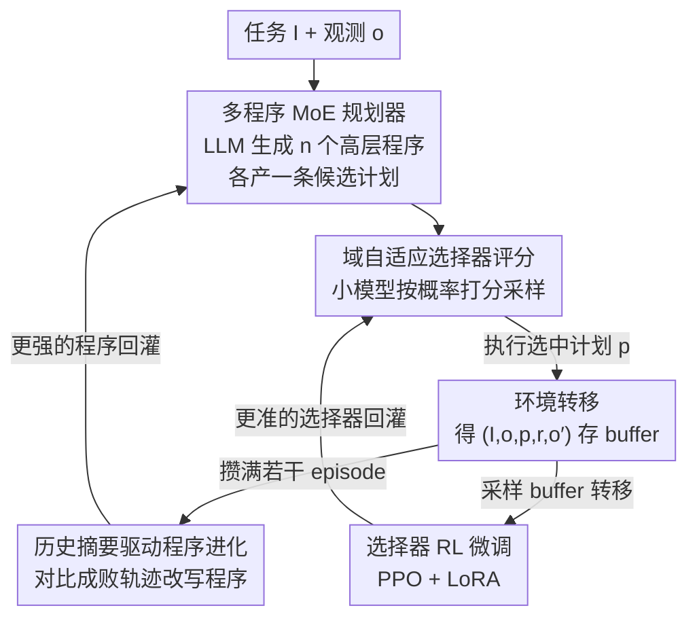

# Code Driven Planning with Domain-Adaptive Selector

**会议**: ICLR2026  
**OpenReview**: [https://openreview.net/forum?id=yDbJHQlrbf](https://openreview.net/forum?id=yDbJHQlrbf)  
**代码**: 补充材料随论文提供（待确认公开仓库）  
**领域**: LLM Agent / 序列决策规划  
**关键词**: LLM 规划、代码驱动、域自适应选择器、混合专家、强化学习

## 一句话总结
CoPiC 让 LLM 一次性生成多个"高层规划程序"（而非逐步问 LLM 要计划），由这些程序自己跟环境闭环交互产出候选计划，再用一个经 RL 微调的小模型"域自适应选择器"挑出最契合长期回报的计划执行，从而在 ALFWorld / NetHack / 星际争霸 II 造兵三个环境上把成功率平均提升 19.14%、token 开销平均削减 79.39%。

## 研究背景与动机
**领域现状**：把 LLM 当作 AI agent 的任务规划器，已是序列决策问题里的主流做法——LLM 凭借海量世界知识，能把"把花瓶放进保险箱"这类高层指令拆解成可执行的自然语言计划，在家居场景（ALFWorld）和游戏里都比传统学习型 agent 更高效、更通用。

**现有痛点**：LLM 的通用知识和具体环境之间存在鸿沟，容易产生幻觉，生成"看似合理但根本执行不了"的计划（去拿不存在的物体、调用环境里没有的动作）。为了纠偏，现有方法（ReAct、Reflexion、AdaPlanner、REPL-Plan 等）走"即时反馈"路线：每走一步就把环境观测喂回 LLM，让它反复重规划。这带来两个硬伤——一是 **频繁查询 LLM 导致 token 开销爆炸**；二是这种逐步纠正只盯着 **眼前的短期反馈**，贪婪地修补当前一步，反而拼不出兼顾长期回报的好计划。

**核心矛盾**：把"针对某个具体观测量身定制的静态计划"反复生成、反复修，本质上无法适应动态变化的环境——观测一变，整条静态计划就得推倒重来，于是查询次数随交互步数线性膨胀，且每次只优化局部。问题根子在于：规划的产物是"一条死计划"，而不是"一套能随观测自动调整的策略"。

**本文目标**：（1）大幅压低 LLM 查询成本；（2）让规划对准长期回报而非短期反馈；（3）弥合 LLM 通用知识与环境特定需求之间的鸿沟。

**切入角度**：作者注意到 LLM 的代码生成能力远比自然语言计划可靠——既然如此，何不让 LLM 生成"高层规划程序"？程序是一段能读入当前观测、当场算出动作序列的闭环代码，它天生能随观测自适应，一次生成、反复复用，无需每步都回头问 LLM。但单个程序受限于 LLM 的通用知识，难以覆盖所有观测情形，于是再叠一层 **混合专家（MoE）**：让多个程序各当一个专家产出多样候选，并训一个 **域自适应选择器** 从中挑出最对的那条。

**核心 idea**：用"LLM 生成的多个高层规划程序（MoE 当 planner）+ RL 微调的域自适应选择器（当 estimator）"替代"逐步查询 LLM 重规划"，前者把昂贵的 LLM 调用从"每步一次"降到"每轮进化一次"，后者把短期贪婪纠正换成对准长期回报的打分选择。

## 方法详解

### 整体框架
CoPiC 要解决的核心问题是：在一个部分可观测马尔可夫决策过程（POMDP，记作 $\langle S, O, A, R, P, I\rangle$）里，给定语言任务 $I$ 和观测 $o$，找出一条对准长期回报的动作序列计划 $p$，同时把 LLM 查询成本压到最低。整套框架由 **两个模块**（LLM 规划器 + 域自适应选择器）在 **两个阶段** 之间交替运行构成。

- **规划阶段（Planning Phase）**：LLM 规划器先用"Init Prompt"生成 $n$（默认 $n=3$）个高层规划程序 $\{\rho_i\}_{i=1}^n$，每个程序读入 $I$ 和当前观测 $o$、当场算出一条候选计划 $p_i$，凑成候选集 $\{p_i\}_{i=1}^n$；域自适应选择器 $C_\theta$ 给每条候选打分，按分数采样出最契合长期回报的计划 $p$ 去和环境交互，产生新观测 $o'$ 和奖励 $r$，把转移 $(I, o, p, r, o')$ 存进 buffer。
- **学习阶段（Learning Phase）**：用积攒的交互结果做两件事——一是把最近若干 episode 的轨迹做"历史摘要"，喂回 LLM 让它进化出更强的规划程序；二是用 PPO + LoRA 微调选择器，让它更会挑长期回报高的计划。

两阶段反复交替，规划程序越进化越准、选择器越练越懂这个域，整体性能随之螺旋上升。一个关键卖点是 **零样本域适应**：CoPiC 只在训练任务上学，测试时无需再微调选择器、也不再额外查询 LLM，就能泛化到没见过的测试任务。

### 关键设计

**1. 多程序 MoE 规划器：用"一套会自适应的代码"替代"一条死计划"**

针对"静态计划随观测变化反复推倒重来、查询成本爆炸"的痛点，CoPiC 不让 LLM 直接吐计划，而是让它生成 **高层规划程序** $\rho_i(p_i \mid I, o)$——一段闭环代码，输入是当前环境观测，输出是基于该观测当场算出的动作序列。这样观测一变，程序自己重算计划即可，不必每步回头查 LLM。由于单个程序受限于 LLM 的通用知识、难以覆盖所有观测情形，作者引入 **混合专家（MoE）**：一次生成 $n$ 个程序（默认 $n=3$），每个程序当一个专家，产出一条候选计划，凑成多样的候选集 $\{p_i\}_{i=1}^n$，即 $\{\rho_i(p_i\mid I,o): I\times O\to\Delta(A^T)\}_{i=1}^n$。论文给的星际争霸"造 SCV"程序例子很直观：程序里写着"补给小于 8 就先造补给站、缺基地就先造基地、再训练 SCV"这类带条件分支的领域逻辑，把"该先干什么"编码进代码而非每步问 LLM。和 AdaPlanner（每个任务生成一段静态程序、本质缺乏动态性）、REPL-Plan（递归调 REPL 生成可复用 API）相比，CoPiC 为每类任务产出 **多个动态程序**，构成一组合理候选，这是后续"选择"得以发挥的前提。

**2. 域自适应选择器评分：把短期贪婪纠正换成对准长期回报的打分采样**

候选集有了，到底执行哪一条？这一步针对"即时反馈只优化眼前一步、拼不出长期好计划"的痛点。选择器 $C_\theta(p\mid o, I, \{p_i\}_{i=1}^n)$ 从一个 **小型语言模型**（用 TinyLlama）初始化，借鉴 TWOSOME，打分分三步走：(1) **计算计划概率**——把"选择器 prompt"（当前观测文本描述 $d_{cp}$ + 各候选计划文本 $d_{p_i}$ + 评估指令）喂进去，按语言模型对该计划描述各 token 的条件概率连乘得到 $\text{prob}(d_{p_i}\mid d_{cp})=\prod_{k=1}^{N_i}\text{prob}(w_i^k\mid d_{cp}, w_i^1,\dots,w_i^{k-1})$；(2) **计划文本长度正则**——概率连乘天然让长计划似然偏低，故用 $\text{logit}(d_{p_i}\mid d_{cp})=\log(\text{prob}(d_{p_i}\mid d_{cp}))/W_i$ 除以词数 $W_i$ 消去长度偏差（实验里用词数 $W_i$ 而非 token 数 $N_i$）；(3) **归一化打分**——不同候选集似然之和不一致，用带温度的 softmax 归一：

$$\text{score}(p_i)=\frac{\exp(\text{logit}(d_{p_i}\mid d_{cp})/\tau)}{\sum_{j=1}^n \exp(\text{logit}(d_{p_j}\mid d_{cp})/\tau)}$$

训练时温度 $\tau=1.0$ 平衡探索与利用，测试时 $\tau=0.0$ 取确定性输出。最终按这组分数采样出计划 $p\sim\{(p_i,\text{score}(p_i))\}_{i=1}^n$ 去执行。关键在于：这个选择器经 RL 微调后**带有域先验**，能识别"保护宠物的命比短期打怪收益更划算"这类长期策略，而纯 LLM 打分（LLM-as-a-Judge）没有这种域知识——消融里 RL 微调的选择器比 GPT-4.1-as-a-Judge 成功率高 19.88%、token 少 27.14%。

**3. 历史摘要驱动的程序进化：让规划程序对比成败轨迹自我纠错**

规划程序初版往往不完美，这个学习阶段模块负责把它越练越准。在和环境交互 $N$ 个 episode 后，取最近 $M$（$M\le N$）个 episode 的历史，整理成 $\{\langle \text{trajectory}_i, \text{signal}_i\rangle\}_{i=N-M+1}^N$ 的"历史摘要"格式——其中 $\text{trajectory}_i=(o_i^0,p_i^0,o_i^1,p_i^1,\dots)$ 是交互记录，$\text{signal}_i\in\{\text{True},\text{False}\}$ 标记该 episode 是否完成任务。随后把成功示例、当前规划程序、历史摘要拼成"Feedback Prompt"，让 LLM **对比失败轨迹和成功轨迹**（例如"没靠近容器就试图打开它"这种错误），定位程序的薄弱处并做针对性 debug，进化出一组更强的规划程序。消融显示：在 ALFWorld 的 Clean/Heat/Cool 三任务上，平均成功率从初版 75.60% 经第 2 轮升到 91.44%、第 4 轮达到 100.00%，可见程序进化对最终性能至关重要。

**4. 选择器 RL 微调：用 PPO + LoRA 把域经验灌进打分器**

光靠初始化的小模型选择器还不够"懂域"，这一步用强化学习把交互中攒下的域经验喂进去。CoPiC 采用 **参数高效的 LoRA 架构** 在 **PPO** 框架下微调选择器：给小模型最后一个 transformer block 加上 LoRA 参数和 MLP 层，分别充当 PPO 里的 actor 和 critic。从 replay buffer 取转移按 PPO 目标微调时，**只更新 LoRA 参数和新增 MLP，语言模型本体冻结**，既省算力又稳。这一设计让选择器在与环境交互中持续获取域特定知识，给出比"无先验 LLM 打分"更准的计划评估——消融里去掉选择器（改成从候选里随机选）后，同等交互成本下 Heat/Cool 两任务成功率平均掉了 20%~60%，足见选择器既省查询成本、又实打实提升了计划质量。

### 一个完整示例
以 ALFWorld 的"把花瓶放进保险箱（put some vase in safe）"为例走一遍闭环：

1. **生成程序**：LLM 用 Init Prompt（含 ALFWorld 的 Python agent 定义、异类任务的 few-shot 示例、任务描述）生成 $n=3$ 个规划程序，比如其中一个写了 `pick_and_place` 逻辑——先判断手里是否已握目标物，若有则找保险箱放下、找不到就先探索。
2. **产候选**：三个程序各读当前观测，分别产出一条候选计划，如"去货架 1 拿花瓶 / 去抽屉 1 打开抽屉 / 去保险箱 1 放花瓶"。
3. **选择器打分**：把当前观测 + 三条候选拼成 Selector Prompt 喂给 TinyLlama，按"概率 → 长度正则 → softmax 归一"算出分数，采样选中"去抽屉 1 打开抽屉 1"执行。
4. **环境转移**：执行后环境给出新观测 $o'$ 和奖励 $r$，转移 $(I,o,p,r,o')$ 入 buffer。
5. **学习阶段**：攒够 episode 后，历史摘要把成功/失败轨迹对比喂回 LLM 进化程序（修掉"没靠近就开抽屉"之类的 bug），同时 PPO+LoRA 微调选择器。下一轮规划就用进化后的程序和更准的选择器，直到稳定通关。

### 损失函数 / 训练策略
- **选择器**：以 PPO 目标微调（论文正文给的是直觉描述，PPO objective 见原文附录 Eq.11，⚠️ 具体形式以原文为准），actor/critic 分别由 LoRA 参数和外接 MLP 层承担，LLM 本体冻结。
- **规划程序**：不走梯度，靠 in-context learning——用"历史摘要 + 成功示例 + 当前程序"组成的 Feedback Prompt，让 LLM 通过对比成败轨迹改写代码来"进化"。
- **关键超参/设置**：规划程序数 $n=3$；选择器用 TinyLlama；ALFWorld 和星际造兵用 GPT-3.5 当 base LLM，NetHack 因复杂度高改用 GPT-4o；结果取 5 个随机种子均值。

## 实验关键数据

### 主实验
三环境（ALFWorld / NetHack / 星际争霸 II 造兵）综合：CoPiC 平均成功率（SR）提升 **19.14%**、token 开销（Cost）下降 **79.39%**、平均交互步数减少 30.43%。

ALFWorld 六类任务上 CoPiC 对比代表性 baseline（Cost 单位 M = 百万 token）：

| 任务 | CoPiC SR↑ | CoPiC Cost↓ | AdaPlanner SR / Cost | Reflexion SR / Cost | REPL-plan SR / Cost |
|------|-----------|-------------|----------------------|---------------------|---------------------|
| Pick | 100.00 | 0.05M | 100.00 / 0.63M | 91.67 / 2.09M | 82.50 / 0.66M |
| Examine | 100.00 | 0.04M | 64.44 / 1.95M | 86.67 / 1.51M | 83.33 / 0.41M |
| Clean | 100.00 | 0.33M | 91.61 / 0.89M | 73.55 / 2.54M | 89.03 / 0.75M |
| Heat | 100.00 | 0.26M | 76.52 / 0.74M | 75.65 / 1.88M | 91.30 / 0.61M |
| Cool | 100.00 | 0.28M | 89.52 / 1.57M | 73.33 / 1.46M | 88.57 / 0.47M |
| Pick Two | 95.29 | 0.06M | 87.06 / 1.58M | 81.18 / 1.65M | 100.00 / 0.43M |

ALFWorld 整体 SR +16.96%、Cost −83.76%；即便换成和 baseline 同设定的在线测试集学习版 CoPiC(TSL)，仍比 baseline 高 17.17% SR、省 87.16% token。NetHack 上 SR +13.72%、Cost −70.96%（"升到 3 级"这种难任务查询量直降 96.11%、SR 仍 +10%）；星际造兵 Hard 任务 SR +44.75%、Cost −87.86%。

### 消融实验

| 配置 | 关键发现 | 说明 |
|------|---------|------|
| 完整 CoPiC | 三环境全面领先 | 程序 MoE + RL 选择器协同 |
| w/o 选择器（随机选） | Heat/Cool 同成本下 SR 平均低 20%~60% | 选择器既省成本又提质量 |
| w/o 程序进化（冻结选择器重学程序） | Clean/Heat/Cool 均值 75.60%→91.44%（2 轮）→100%（4 轮） | 程序进化是高性能关键 |
| CoPiC(LaJ)，即 GPT-4.1-as-a-Judge | RL 选择器比它 SR +19.88%、token −27.14% | 域知识 vs 无先验打分 |
| 开源 LLM（DeepSeek/Qwen2.5-Coder-14B） | 比 AdaPlanner SR +26.29%、Cost −85.09% | 闭源/开源 LLM 都支持 |

### 关键发现
- **选择器贡献最大也最巧**：去掉它（随机选候选）掉点最狠，证明"挑得对"比"生成得多"更关键；而它之所以挑得准，是因为 RL 微调注入了域先验——同样面对 NetHack，它能识别"保命宠物利于长期打怪"，而 baseline 即便 prompt 里写了"保护宠物"仍为短期收益去攻击宠物。
- **省 token 的根因是范式变了**：把"每步查 LLM"换成"每轮进化一次程序 + 小模型打分"，难任务（NetHack 升级）token 直降 96%。
- **零样本域适应**：只在训练任务上学，测试任务无需再微调选择器、不再额外查 LLM 就能泛化——这是 CoPiC 区别于 Reflexion/AdaPlanner/REPL-Plan（都依赖测试集在线学习）的独特能力。
- **数据效率更高**：ALFWorld 学习曲线显示，CoPiC 用更少环境交互就达到更高渐近性能。

## 亮点与洞察
- **"程序当 planner、小模型当 estimator"的解耦很巧**：把昂贵的 LLM 调用从"每步一次"挪到"每轮进化一次"，把高频的逐步评估交给一个轻量小模型，等于把"贵但聪明"和"便宜但够用"各放在该放的位置——这是 token 暴降 79% 的结构性原因，而非靠某个 trick。
- **MoE + 选择器的组合直击 LLM 规划的两难**：单程序覆盖不了所有观测（通用 vs 特定的鸿沟），多程序产出多样候选、再用域自适应选择器收口，把"生成多样性"和"选择准确性"分工到两个模块，思路可迁移到任何"LLM 生成候选 + 学习型打分器筛选"的任务（代码生成、检索重排、工具调用）。
- **长度正则 + 温度退火的打分细节值得复用**：用词数而非 token 数做长度正则消除长计划的似然偏置、测试时温度归零取确定性，是把"LM 似然"改造成"可比较打分"的实用工程经验。
- **RL 微调小模型而非 LLM**：LoRA + PPO 只动小模型的少量参数，既把域经验沉淀进打分器，又避免了微调大 LLM 的天价成本，是"用小模型承接领域适应"的好范例。

## 局限与展望
- **依赖 LLM 的代码生成可靠性**：整套框架的前提是 LLM 能生成质量过关的高层规划程序，对代码能力弱的 LLM 或难以程序化表达的环境（高度非结构化、规则隐晦）可能退化；论文也主要在 ALFWorld/NetHack/星际造兵这类规则相对明确的环境验证。
- **环境规模仍有限**：作者承认目前只做到星际"造兵"子任务，明确把"完整星际 II 对局、文明、更复杂真实场景"列为未来工作——更长 horizon、更大动作空间下程序进化和选择器能否 scale 仍待验证。
- **奖励函数需可得**：选择器的 RL 微调依赖环境奖励 $R$，论文强调奖励设计"直接、不含专家知识"，但真实场景里稠密/可靠奖励本身就稀缺。
- **改进思路**：可探索让选择器对候选做更细粒度（步级而非计划级）的长期价值估计；或把程序进化的"对比成败轨迹"自动化为可微反馈，减少对 LLM in-context 改写的依赖。

## 相关工作与启发
- **vs Reflexion / ReAct（即时反馈派）**：它们靠逐步执行反馈或反思文本更新动作，规划质量虽提升但 LLM 查询频繁、延迟高、只盯短期；CoPiC 用程序驱动生成 + 选择器对准长期回报，从根上砍掉高频查询。
- **vs AdaPlanner（程序化但静态）**：AdaPlanner 给每个任务生成一段静态程序、缺乏动态性且依赖任务专属 prompt；CoPiC 为每类任务产出 **多个动态程序** + 域自适应选择器整体refine，免去定制化 prompt。
- **vs REPL-Plan**：REPL-Plan 递归调 REPL 工具生成可复用 API；CoPiC 走 MoE 多程序 + 选择器采样最优，强调"多样候选 + 学习型筛选"。
- **vs Prospector / SayCan（带打分模块）**：它们要么用 LLM 直接打分（缺环境先验、有打分误差），要么用离线专家数据预训打分模型（贵且对分布外泛化差）；CoPiC 用规划程序在线高效产数据来微调选择器，规避了这两条路的短板。
- **vs LLM-DP 等 PDDL 派**：PDDL 方法里 LLM 只做文件补全/计划总结，真正规划仍靠外部 solver 搜索；CoPiC 直接用 LLM 生成的程序完成规划，无需外部 solver。

## 评分
- 新颖性: ⭐⭐⭐⭐⭐ "程序当 planner + 小模型当 estimator"的解耦范式新颖，MoE + 域自适应选择器组合直击 LLM 规划的成本与长期回报两难。
- 实验充分度: ⭐⭐⭐⭐⭐ 三类异构环境、多条强 baseline、5 种子、开源/闭源 LLM、四组消融，覆盖全面。
- 写作质量: ⭐⭐⭐⭐ 框架两阶段叙述清晰、公式完整，唯部分细节（如 PPO 目标）下放附录。
- 价值: ⭐⭐⭐⭐⭐ token 降 79%、SR 升 19% 且零样本域适应，对成本敏感的 LLM agent 落地有直接参考价值。

<!-- RELATED:START -->

## 相关论文

- [\[ICLR 2026\] OrchestrationBench: LLM-Driven Agentic Planning and Tool Use in Multi-Domain Scenarios](orchestrationbench_llm-driven_agentic_planning_and_tool_use_in_multi-domain_scen.md)
- [\[AAAI 2026\] Reflection-Driven Control for Trustworthy Code Agents](../../AAAI2026/llm_agent/reflection-driven_control_for_trustworthy_code_agents.md)
- [\[ICML 2026\] AutoRPA: Efficient GUI Automation through LLM-Driven Code Synthesis from Interactions](../../ICML2026/llm_agent/autorpa_efficient_gui_automation_through_llm-driven_code_synthesis_from_interact.md)
- [\[ICLR 2026\] Modeling Others' Minds as Code](modeling_others_minds_as_code.md)
- [\[ICML 2026\] NaviAgent: Graph-Driven Bilevel Planning for Scalable Tool Orchestration](../../ICML2026/llm_agent/naviagent_graph-driven_bilevel_planning_for_scalable_tool_orchestration.md)

<!-- RELATED:END -->
