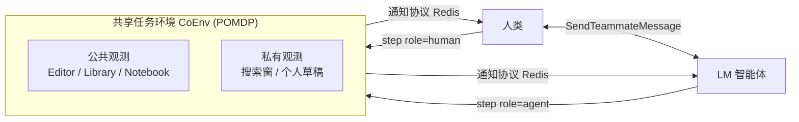

# Collaborative Gym: A Framework for Enabling and Evaluating Human-Agent Collaboration

**会议**: ICLR 2026  
**OpenReview**: [https://openreview.net/forum?id=GDYueXtKXT](https://openreview.net/forum?id=GDYueXtKXT)  
**代码**: [https://github.com/SALT-NLP/collaborative-gym](https://github.com/SALT-NLP/collaborative-gym)  
**领域**: llm_agent  
**关键词**: 人机协作, 双控环境, 非轮流交互, 智能体评测, 混合主动系统  

## 一句话总结
提出 Collaborative Gym（Co-Gym）——首个支持人与 LM 智能体在共享任务环境中**双向通信、非轮流协作**的开放框架，并配套一套同时考核协作结果与协作过程的评测套件。

## 研究背景与动机
- **领域现状**：LLM 智能体研究高度聚焦于"全自主"（fully autonomous）路线——让智能体独立完成网页导航、个人助理、编程、科研发现等任务，把人类完全排除在回路之外。
- **现有痛点**：大量真实场景天然需要人类参与（用户的潜在偏好、领域专业知识、对关键决策的控制权），但现有人机协作基础设施要么是**单控**（single-control，只有一方能操作环境），要么是**双控但强制轮流**（dual-control turn-taking，如 CowPilot、τ²-Bench），且往往局限于单一环境（浏览器/数据库）。轮流结构与真实人类协作中"双方异步、随时插话、边干边说"的形态严重不符。
- **核心矛盾**：人机协作有望凭借互补专长取得超越任意一方单干的效果，但**缺少能复现真实异步协作动态、又能系统评测协作质量的统一平台**，导致"协作到底有没有用、如何设计会协作的智能体"两个根本问题无法回答。
- **本文目标**：构建一个对智能体实现无约束、支持多任务、放开轮流限制、并能同时量化结果与过程的人机协作开发与评测框架。
- **核心 idea**：**【环境层双控 + 交互层非轮流 + 评测层过程化】** ——用统一的环境接口支持人和智能体对共享工作区的双向操作，用"协作动作 + 通知协议"替代轮流结构，再用结果指标 + 过程审计指标双重考核协作。

## 方法详解

### 整体框架
Co-Gym 由三大组件构成：(1) **协作驱动的环境设计**，把任务建模为部分可观测马尔可夫决策过程（POMDP），并在 `step` 中引入 `role` 参数让人和智能体共享同一环境；(2) **非轮流交互协议**，由两个"协作动作"与一个跨进程的"通知协议"组成，让双方可异步操作；(3) **评测套件**，同时度量协作结果（交付率、任务表现）与协作过程（主动权熵、满意度）。框架既提供带可靠用户模拟器的**模拟条件**，也提供带聊天面板与共享工作区的真实 **Web 应用条件**。

### 关键设计

**1. 协作驱动的环境抽象（CoEnv）：把双控写进 step 签名。** Co-Gym 不限制智能体怎么实现，而是定义一个统一的环境接口，将每个任务形式化为 POMDP $(S, A, T, R, U, O)$。要新增任务（CoTravelPlanningEnv、CoRelatedWorkEnv、CoTabularAnalysisEnv 等）只需声明工具集、动作空间 $A$、观测空间 $O$、转移函数 $T$ 与初始任务描述。关键改造是 `step` 函数引入 `role` 参数，返回 `obs, reward, done, private = env.step(role, action)`，使同一环境能根据操作者身份分别更新状态。观测空间进一步区分**公共组件**（如双方共见的 Editor，类比白板）与**私有组件**（如智能体自己的搜索窗，类比个人笔记本），用 `private` 标志位区分动作影响的是共享区还是私有区——这让"边协作边各自查资料"成为可能。

**2. 非轮流交互：协作动作 + 通知协议解耦"说"与"做"。** 为模仿人类协作中靠沟通而非固定回合来协调的特性，Co-Gym 在任务动作之外增加两个元动作：`SendTeammateMessage`（向队友发消息，智能体可在没有人类消息时**主动发起**）和 `WaitTeammateContinue`（保活信号，表示"我先等你")。双方都可以连续发多条消息而不必等待回应，从而打破轮流。由于人类能持续观察环境而智能体需要被显式告知变化，框架配套一个基于 **Redis** 的通知协议，监听四类事件：①共享观测更新（广播给所有人）、②私有观测变化（仅通知关联方）、③新消息（通知接收方）、④环境静默超过时间阈值（广播）。例如智能体更新 Editor 时双方都收到新观测；人类发消息时只有智能体被通知——这套事件驱动机制让异步协作在多进程下可靠运转。

**3. 过程化评测套件：不止看做没做完，更看怎么协作的。** 结果维度有两项：**交付率（Delivery Rate）**，二值指标，衡量是否在步数上限内交付；**任务表现（Task Performance）**，对已交付样本用任务专属评分函数（确定式指标或 LM/人类评判）打分并归一化到 $[0,1]$。过程维度引入两项审计指标：**主动权熵（Initiative Entropy）**，把协作视为混合主动系统，用 LM 标注哪些发言"推进任务执行或建立共识"算作占据主动，再以熵衡量主动权在团队成员间的均衡度——分布越均匀熵越高：

$$H_{init} = \begin{cases} -\sum_{i=1}^{N} p_i \log_N(p_i) & \forall i,\ p_i > 0 \\ 0 & \exists i,\ p_i = 0 \end{cases}$$

其中 $p_i$ 是成员 $i$ 占据主动的发言比例，$N$ 为参与方数；以及**整体满意度（Overall Satisfaction）**，协作结束后由人类用 1–5 Likert 量表评分，补充任务表现的不足。

## 实验关键数据

实验对比三类智能体（全自主 / 协作 / 协作+情境规划）× 四个 LM（GPT-4o、GPT-4-turbo、Claude-3.5-sonnet、Llama-3.1-70B），覆盖旅行规划、相关工作写作、表格分析三任务，分模拟与真实两种条件。其中"协作+情境规划"智能体采用两阶段决策：先做"执行任务动作/发消息/什么都不做"的三向决策，再生成具体动作；所有智能体均基于 ReAct + Scratchpad 记忆实现。

### 主实验表格（模拟条件，节选 Task Performance）

| 智能体类型 (LM) | Travel Plan | Related Work | Tabular |
|---|---|---|---|
| 全自主 (Claude-3.5) | 0.577 | 0.617 | 0.358 |
| 协作 (Claude-3.5) | 0.653* | 0.621 | 0.359 |
| 协作+情境规划 (Claude-3.5) | 0.682* | 0.736* | 0.365* |
| 协作+情境规划 (GPT-4o) | 0.667* | 0.658* | 0.434* |

（*表示相对同 LM 全自主智能体显著提升 $p<0.05$）

### 真实条件结果表格（每任务 50 样本，对手为全自主智能体）

| 指标 | Travel | Related Work | Tabular |
|---|---|---|---|
| 人类评分 Task Perf. | 0.788 | 0.604 | 0.804 |
| 胜率 vs 全自主 | **86%** | 66% | **74%** |
| 整体满意度 (1–5) | 3.78 | 3.06 | 4.06 |
| 主动权熵 $H_{init}$ | 0.88 | 0.63 | 0.74 |

### 关键发现
- **交付率与质量的权衡**：模拟条件下（步数上限 30）协作智能体交付率反而低于全自主——因需频繁随人类动作调整计划而更易超步数；但**已交付样本的任务质量更高**，情境规划版在三任务上全面显著领先。
- **真实用户偏爱协作**：99 名真人贡献 150 条轨迹（6.3k 动作、77k 词沟通），协作智能体在旅行规划取得 86% 胜率、表格分析 74%，满意度普遍高于全自主。
- **持续暴露的短板**：真实条件下仍有 **65%** 案例出现沟通失败、**40%** 出现情境感知失败；模拟分析显示失败主因是智能体忽视人类消息（46%）、重复催促（26%）、重复或遗漏动作（33%）。
- **主动权越均衡越好**：情境规划显著抬高 $H_{init}$，对应更高质量，说明真正的"你来我往"而非一方主导才带来增益。

## 亮点与洞察
- **范式级贡献**：首次把"非轮流（异步）"作为人机协作的一等公民，用协作动作 + 通知协议优雅解决了"智能体看不见环境变化"的工程难题，比强制轮流更贴近真实团队协作。
- **环境抽象干净**：只往 `step` 加一个 `role` 参数 + 公共/私有观测区分，就把单智能体环境扩展成双控环境，迁移成本低、可扩展性强（开源后已加入计算机使用等新环境）。
- **评测有思想**：把"主动权熵"这一对话学概念引入智能体评测，配合模拟+真实双条件，是少见的同时量化"结果好不好"与"协作健不健康"的尝试。
- **MIT 开源 + 真实 Web 应用**：可直接用于开发落地的协作智能体产品，而非纯学术沙盒。

## 局限与展望
- **协作反而拖慢交付**：固定步数上限下协作智能体更难按时交付，提示当前 LM 在频繁适配人类意图时决策效率不足，未来需更好的记忆与规划脚手架。
- **沟通与情境感知是硬伤**：65%/40% 的失败率说明 LM 在"听懂并记住人类说了什么、感知环境何时变化"上仍很脆弱，需底层模型与 agent scaffolding 同步进步。
- **任务覆盖有限**：论文仅评测三任务，且模拟人类由 LLM 扮演（虽验证过质量），与真实人类的偏好多样性仍有差距。
- **评测指标主观性**：任务表现部分依赖 LM/rubric 评判，满意度依赖小样本人类打分，跨任务可比性与稳健性有待扩大规模验证。

## 相关工作与启发
- **对比 CowPilot / τ²-Bench**：同为双控，但二者强制轮流且局限单环境（浏览器/数据库），Co-Gym 用通知协议放开轮流并支持多环境，把"何时、如何协作有益"做成可广泛研究的问题。
- **对比 WorkArena / τ-Bench**：这些是单控设置，人类无法与智能体共享操作；Co-Gym 的 `role` 化 `step` 是关键差异。
- **启发**：把"主动权"量化进评测、用事件通知替代轮流、用公共/私有观测建模"共享白板 vs 个人笔记"，这些设计可迁移到多智能体协作、人机结对编程、协同写作等更广场景。

## 评分
- **新颖性**: ⭐⭐⭐⭐⭐ 首个非轮流双控人机协作框架，范式与评测均有原创性。
- **实验充分度**: ⭐⭐⭐⭐ 三任务 × 四模型 × 模拟/真实双条件 + 99 名真人，规模扎实；但任务数与真人样本仍可扩展。
- **写作质量**: ⭐⭐⭐⭐ 三组件结构清晰、图示与表格充分，框架抽象表达准确。
- **价值**: ⭐⭐⭐⭐⭐ MIT 开源、可扩展、直指人机协作这一被忽视的关键方向，对学界与产品落地都有高价值。

<!-- RELATED:START -->

## 相关论文

- [\[ICLR 2026\] OpenAgentSafety: A Comprehensive Framework for Evaluating Real-World AI Agent Safety](openagentsafety_a_comprehensive_framework_for_evaluating_real-world_ai_agent_saf.md)
- [\[ACL 2025\] Leveraging Dual Process Theory in Language Agent Framework for Real-time Simultaneous Human-AI Collaboration](../../ACL2025/llm_agent/dpt_agent_dual_process.md)
- [\[ACL 2025\] MultiAgentBench: Evaluating the Collaboration and Competition of LLM Agents](../../ACL2025/llm_agent/multiagentbench_evaluating_the_collaboration_and_competition_of_llm_agents.md)
- [\[ICLR 2026\] Grounding Computer Use Agents on Human Demonstrations](grounding_computer_use_agents_on_human_demonstrations.md)
- [\[ICLR 2026\] Empowering Efficiency and Efficacy in WebAgent via Enabling Info-Rich Seeking](empowering_efficiency_and_efficacy_in_webagent_via_enabling_info-rich_seeking.md)

<!-- RELATED:END -->
