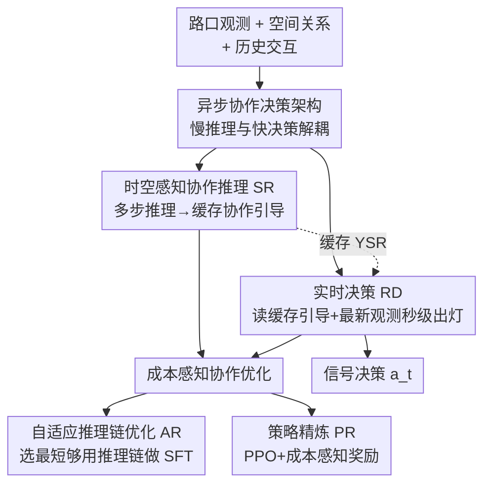

# CoLLMLight: Cooperative Large Language Model Agents for Network-Wide Traffic Signal Control

**会议**: ICLR2026  
**OpenReview**: [https://openreview.net/forum?id=KeJqoEVOeY](https://openreview.net/forum?id=KeJqoEVOeY)  
**代码**: 待确认  
**领域**: 多智能体 / LLM Agent / 交通信号控制 / 强化学习  
**关键词**: 协作式 LLM 智能体, 交通信号控制, 时空推理, 异步决策, 成本感知优化

## 一句话总结
CoLLMLight 给路网里每个路口配一个 LLM 智能体，让它们通过"异步时空推理 + 实时决策"双模块互相协作（而非各管各的路口），再用"成本感知优化"（自适应推理链微调 + PPO 强化学习）把推理深度按交通复杂度自动伸缩，在四个真实路网上零样本超越所有传统、RL 和单体 LLM 基线，同时把决策延迟压到黄灯时长以内。

## 研究背景与动机
**领域现状**：交通信号控制（TSC）经历了从交通工程方法（FixedTime、MaxPressure）到强化学习方法（CoLight、Advanced-CoLight 等）再到 LLM 智能体（LLMLight）的演进。LLM 方法的吸引力在于：它用语言驱动推理来做信号决策，可解释性强，而且能跨不同路网泛化——这是 RL 方法的老大难（RL 把协作隐式编码进网络权重里，换个没见过的路网就水土不服）。

**现有痛点**：现有 LLM-based TSC 智能体有一个根本缺陷——**它们把每个路口当成独立智能体，路口之间不通信、各自为政**。论文用一个很直观的例子说明（Figure 1）：一个独立智能体看到东侧车道排队最长，于是放行东西向交通清空本地队列，从局部看完全合理；但它没意识到这会导致上游回堵（spillback），最终拖垮全网效率。而协作智能体能利用邻居路口的信息，预判到"北面有大量车流正涌向我的北侧车道"，于是提前放行南北向，避免拥堵。

**核心矛盾**：要让 LLM 智能体协作，面临三重张力。① 协作本身比单路口控制复杂得多——智能体得推理路口间的动态交互、预判本地动作如何影响上下游车流，协作信号很难提取；② LLM 的多步推理带来显著的计算开销和延迟，**这和 TSC "几秒内必须出决策"的硬实时要求直接冲突**；③ 协作质量与推理效率难以兼顾——交通场景复杂度差异巨大（低流量路口 vs 高密度枢纽），固定推理策略要么在简单场景浪费算力，要么在复杂场景分析不足。

**本文目标**：造出第一个面向全网的协作式 LLM 信号控制框架，同时解决"协作有效性 ↔ 实时性 ↔ 推理成本"三难。

**切入角度**：作者的关键观察是——**深度协作推理不必和实时决策耦合在同一条关键路径上**。既然协作推理需要时间，那就把它"异步"地跑在后台，把结果缓存起来当上下文喂给一个轻量的实时决策模块。这样既保留了深度时空推理，又不阻塞秒级出信号。

**核心 idea**：用"异步双模块架构"把慢推理与快决策解耦，再用"成本感知优化"让推理深度随交通复杂度自适应伸缩，从而让协作式 LLM 智能体既会协作又跑得起实时。

## 方法详解

### 整体框架
CoLLMLight 把路网建模为有向图：路口集合 $I$ 与车道集合 $L$（直行 $L_{go}$、左转 $L_{left}$、右转 $L_{right}$ 三类），每个路口 $i$ 由一个共享策略 $\pi$ 的 LLM 智能体控制。在每个换灯时刻 $t$，第 $i$ 个智能体接收三类输入：本路口及邻居的交通观测 $O^i_t$、与邻近路口的空间关系 $G^i$、自己与邻居的历史交通交互 $T^i_t$，然后选出信号动作 $a^i_t = \pi([O^i_t, G^i, T^i_t], A^i)$，目标是优化全网交通效率（平均排队长度、行程时间、等待时间）。

整体上 CoLLMLight 由两大组件构成：**异步协作决策架构**（推理时的运行机制）和**成本感知协作优化**（训练时如何把 LLM 调到既会协作又高效）。前者在每个时刻 $t$ 异步跑两个模块——慢的时空感知协作推理（SR）把推理结果缓存成 $Y^{SR}_t$，快的实时决策（RD）拿当前观测 $O_t$ 加上最新缓存的协作引导 $Y^{SR}$ 秒级出信号。后者先用自适应推理链优化（AR）做监督微调，再用 PPO 强化学习（PR）按成本感知奖励进一步精炼推理与决策策略。

### 关键设计

**1. 异步协作决策架构：让慢推理不拖累快决策**

这是直接针对"LLM 多步推理 vs 秒级实时性"这个硬冲突的设计。作者把一个智能体拆成两个异步运行的模块：**时空感知协作推理（SR）**负责慢工出细活的多步推理，**实时决策（RD）**负责秒级出灯。关键在于二者解耦——SR 在后台异步跑，把生成的协作控制引导 $Y^{SR,i}$ 缓存起来；RD 决策时不必等 SR 跑完，而是直接读取上一轮缓存好的 $Y^{SR,i}$，结合当前最新观测 $O^i_t$ 快速决策：$a^i_t = f^{RD}_{LLM}(\text{Prompt}(O^i_t, Y^{SR,i}))$。

特别值得注意的是 RD 并非盲从缓存的协作建议——它把 $Y^{SR,i}$ 当作上下文参考，**最终判断仍以最新观测 $O^i_t$ 为准**。当突发交通变化让历史推理结果失效时，RD 会自适应地优先相信实时观测。这个设计让框架对"陈旧 SR"和"通信失败"两种扰动都很鲁棒（鲁棒性实验里 ATT 只轻微上升），因为 SR 推理的是历史交通状态、对间歇性通信不敏感，而 RD 又锚定实时观测、不会被过期引导带偏。

**2. 时空感知协作推理（SR）：把全网协作拆成可解释的推理步骤**

针对"协作信号难提取"的痛点，SR 模块把路口周围的时空上下文 $(O^i_t, G^i, T^i_t)$ 转成人类可读的 prompt 喂给 LLM：$Y^{SR,i}_t = f^{SR}_{LLM}(\text{Prompt}(O^i_t, G^i, T^i_t))$。其中观测由车道级特征聚合而成——每条车道 $l$ 的特征 $o^l_t = (n^{queue}_l, n^{move}_l, \tau_l, \rho_l)$ 分别是排队车数、行驶车数、平均等待时间、占有率 $\rho_l \in [0,1]$；空间关系 $G^i$ 用包含 $i$ 及邻居的有向子图表示；时间动态 $T^i_t$ 是固定时间窗 $\Delta t$ 内的历史观测-动作序列。

SR 不是一锅烩地推理，而是按需激活四个可解释步骤：**关键车道识别**（判断哪些车流对当前或将发生的拥堵贡献最大、赋予更高优先级）、**空间交互分析**（检查目标路口与邻居的车道级依赖，看彼此交通如何相互影响）、**时间模式分析**（识别短期车流演化趋势、预判近未来拥堵）、**反思**（评估近期信号决策的效果、避免重复无效控制）。这四步分析最终汇成"基于预测短期交通模式的条件式信号建议"，缓存供 RD 取用。智能体"按需自适应选择推理步骤"的能力会在后续优化阶段进一步打磨。

**3. 成本感知协作优化：让推理深度随交通复杂度自动伸缩**

这是兼顾"协作质量 ↔ 推理效率"的核心，分两阶段。**第一阶段——自适应推理链优化（AR）**：从模拟器采样多样交通场景，对每个场景用 GPT-4o 生成多条长度不一的 SR 推理链（每条配一个 RD 输出），然后挑出"最短的 SR 推理链就足以支撑出 RD 达到最优长期全网性能（最低平均排队长度）"的那个 SR–RD 对，编进监督微调集 $D_{SFT}$，最小化负对数似然 $L_{SFT}(\theta) = -\sum_{(X,Y^*)} \sum_w \log P_{\pi_\theta}(y^*_w | X, Y^*_{<w})$。这一步教会模型"用最少的推理把事办好"。

**第二阶段——策略精炼（PR）**：用 PPO 联合精炼 SR 和 RD。RD 的奖励很直接——把智能体选的信号 $a$ 和长期最优信号 $a^*$（在模拟里枚举所有候选相位、选使长期平均排队长度最小者）比对，相同 $+1$、否则 $-1$。SR 的奖励 $R_{SR}$ 则是这套框架最巧的部分——它把下游 RD 奖励、推理长度 $L$ 和一个二值效用分 $U \in \{0,1\}$（由 RD 过程评判"这段 SR 是否提供了有用的协作引导"）揉在一起：

$$R_{SR} = R_{RD} \cdot \left[\beta\left(1 - \frac{L}{L_{max}}\right) + (1-\beta)U\right]$$

其中 $L_{max}$ 是最大推理长度，$\beta \in [0,1]$ 权衡推理简洁度与质量。这个奖励的精妙在于：只有当 RD 决策正确（$R_{RD}=+1$）时奖励才为正，逼着 SR 真正服务于决策；同时 $\left(1 - \frac{L}{L_{max}}\right)$ 项鼓励短推理、$U$ 项鼓励有用推理——于是模型学会了在简单交通下产出短链、在复杂交通下自动加长推理（实验里 SR token 长度随路口车辆数上升而上升，而固定长度的 L3-8B/R1-8B 不会）。最后用 PPO 的截断代理目标 $J_{PPO}(\theta) = \hat{E}_k[\min(r_k(\theta)\hat{A}_k, \text{clip}(r_k(\theta), 1-\epsilon, 1+\epsilon)\hat{A}_k)]$ 优化，$r_k(\theta)$ 是新旧策略概率比、$\hat{A}_k$ 是优势估计。

### 一个完整示例
设想纽约路网一个高密度路口的智能体在时刻 $t$ 决策。后台 SR 模块（异步、不阻塞）拿到本路口与四个邻居的车道特征、空间子图和过去 $\Delta t$ 窗口的历史序列后，先做关键车道识别——发现北进口车道占有率 $\rho$ 高且上游邻居刚放行了大批南向车流；再做空间交互分析——确认这批车 1-2 步后会涌到本路口北侧；时间模式分析预判北侧队列将快速增长；反思步骤回看上一轮放行东西向并未缓解、反而加剧了回堵。SR 综合出条件式建议"若北侧来车持续，应优先放行南北直行（NTST）"，缓存为 $Y^{SR}$。等到真正换灯的瞬间，RD 模块不必等任何推理——它读取缓存的 $Y^{SR}$ 再叠加最新观测 $O_t$，发现实时数据也印证北侧压力，于是秒级选定 NTST 相位放行。整条决策路径上 RD 延迟保持在 1-2 秒（低于 3-5 秒黄灯时长），而费时的 SR 推理早已在后台算好。

### 损失函数 / 训练策略
所有学习型方法（含 CoLLMLight）都只在合成数据集 Syn-Train 上训练，然后零样本迁移到四个真实路网。训练分两步：先用 $D_{SFT}$ 做监督微调（公式 7，教格式合规 + 自适应推理深度），再用 PPO（公式 10）配合成本感知奖励 $R_{RD}$（公式 8）与 $R_{SR}$（公式 9）做强化学习精炼。主力模型 CoLLMLight-8B 由 Llama3.1-8B 微调而来。

## 实验关键数据

### 主实验
在 CityFlow 模拟器上、四个真实路网（New York 1/2、Jinan、Hangzhou）零样本评测，指标为平均行程时间 ATT、平均等待时间 AWT、平均排队长度 AQL（均越低越好）。CoLLMLight-8B 在所有数据集、所有指标上全面 SOTA：

| 数据集 | 指标 | CoLLMLight-8B | LLMLight-8B（前 SOTA） | 提升 |
|--------|------|------|----------|------|
| New York 1 | ATT | **1000.4** | 1187.4 | ↓15.7% |
| New York 1 | AWT | **90.5** | 143.1 | ↓36.8% |
| New York 1 | AQL | **1816.8** | 2297.9 | ↓20.9% |
| New York 2 | ATT | **1345.1** | 1599.4 | ↓15.9% |
| Jinan | ATT | **267.9** | 268.6 | ↓0.3% |
| Hangzhou | ATT | **308.5** | 312.0 | ↓1.1% |

关键观察：① **复杂路网增益最大**——在密集路口的纽约提升最显著（ATT 降 ~16%、AWT 降 ~37%），而简单稀疏的 Jinan/Hangzhou 上 LLMLight 这类纯局部决策也够用、差距缩小，恰恰印证"密度越高越需要协作"。② **优化策略胜过单纯堆参数**——更大的通用 LLM（Qwen3-32B、Llama3.1-70B 装进 CoLLMLight 框架）都被优化过的 CoLLMLight-8B 一致超越，说明成本感知优化比 scaling 更有效。③ RL 基线零样本表现飘忽（Advanced-CoLight 在纽约好、AttendLight 在济南/杭州好），暴露其把策略锚死在训练交通模式上、鲁棒性差；CoLLMLight 用显式语义推理解读交通状态，泛化更稳。

### 消融实验
**SR 模块消融**（ATT，秒）：

| 配置 | New York 1 | New York 2 | 说明 |
|------|---------|---------|------|
| Async SR | 1000.4 | 1345.1 | 完整模型（异步） |
| Sync SR | 1005.7 | 1351.0 | 同步推理 |
| w/o SR | 1155.1 | 1477.3 | 去掉 SR，仅靠实时观测 |

去掉 SR 后 ATT 在纽约显著上升（1000→1155），证明协作推理的价值；而 Async 与 Sync 性能几乎持平，说明异步设计在避免延迟的同时不损推理有效性。

**优化阶段消融**（New York 1，ATT / SR token 数）：

| 配置 | ATT↓ | Token↓ | 说明 |
|------|---------|--------|------|
| Ours | 1000.4 | 484.2 | 完整（AR + PR） |
| w/o AR | 1066.3 | 738.5 | 去自适应推理链优化 |
| w/o PR | 1034.2 | 543.9 | 去策略精炼 |
| w/o Both | 1196.5 | 809.2 | 两者都去 |

### 关键发现
- **AR 是主力**：去掉 AR 后 SR 推理 token 暴涨（纽约 1 约 +52%、济南约 +55%），ATT 也明显上升，说明自适应推理链优化对"按需推理"至关重要；PR 在此基础上进一步提升性能与效率。
- **推理深度真的会自适应**（Figure 4）：CoLLMLight 的 SR token 长度随观测到的车辆数（交通复杂度）上升而上升，轻流量下产出短链；而 L3-8B、R1-8B 不论复杂度都用固定长度、且一律更长。
- **实时性达标**：CoLLMLight 的 RD 延迟在 batch=1/5/10 下分别约 1.02/1.80/2.46 秒，均低于 3-5 秒黄灯时长；SR 虽因多步推理较慢但异步运行、不阻塞决策，且 SR 延迟在同尺度模型里最低。
- **鲁棒性**：在"陈旧 SR（50% 概率延迟一步）"和"通信失败（50% 概率丢一个邻居状态）"两种扰动下，纽约 1 的 ATT 仅从 1000.4 升到 1017.7/1028.1，退化轻微。

## 亮点与洞察
- **异步解耦是化解"LLM 慢推理 vs 实时控制"冲突的关键招**：把"该慢慢想的协作推理"和"必须秒出的信号决策"拆成两条异步通道、用缓存当桥梁——这个思路可迁移到任何"需要深度推理但又有硬实时约束"的智能体场景（高频交易、机器人避障、实时调度）。
- **成本感知奖励 $R_{SR}$ 设计得很妙**：用 $R_{RD} \cdot [\beta(1-L/L_{max}) + (1-\beta)U]$ 把"推理对不对决策有用 + 推理够不够短"耦合进一个标量，逼模型学会"该长则长、该短则短"，而不是像 R1 那样一律过度推理。这是用 RL 治"过度思考"的一个干净范式。
- **把 LLM 推理拆成四个可解释步骤**（关键车道识别 / 空间交互 / 时间模式 / 反思）既给了协作以结构化抓手，又保留了语言推理的可解释性，是 RL 隐式协作给不了的。
- **"显式语义推理"带来的零样本泛化**让人印象深刻：只在合成数据上训练就能直接迁移到四个真实城市路网，戳中了 RL-TSC 多年的泛化痛点。

## 局限与展望
- **依赖 GPT-4o 造训练数据**：AR 阶段的优质短推理链来自 GPT-4o 在模拟器里的采样，蒸馏质量受教师模型上限约束，且换领域要重新造数据。
- **强依赖模拟器的"长期最优信号 $a^*$"**：RD 奖励要在模拟里枚举所有相位、选长期排队最短者作为监督信号，真实部署中拿不到这种 oracle，sim-to-real 差距未充分讨论。
- **协作仅限一跳邻居**：观测和空间关系建立在直接邻居子图上，对需要多跳协调的大尺度路网（如绿波带、区域级潮汐）能否扩展，论文未验证。
- **评测局限于 CityFlow 单一模拟器、各数据集仅模拟一小时**：更长时段、更极端事件（事故、施工、恶劣天气）下的稳定性有待考察。
- **可改进方向**：把 $a^*$ 的获取从"模拟枚举"换成可学习的价值估计以减少对模拟器的依赖；引入分层/区域级协作处理多跳依赖；探索更小的本地模型 + 共享 SR 缓存以进一步降本。

## 相关工作与启发
- **vs LLMLight（前 SOTA 单体 LLM-TSC）**：LLMLight 把每个路口当独立智能体、所有推理与决策都挤在 RD 里做，在简单稀疏路网（济南/杭州）尚可，但在密集路口的纽约因缺乏协作而掉点。CoLLMLight 引入跨路口异步时空推理，在复杂路网上一致领先，且把推理从决策关键路径上剥离，延迟反而更低。
- **vs RL 协作方法（CoLight / CosLight / Advanced-CoLight）**：这些方法把协作隐式编码进图注意力或协作者矩阵等神经结构里，协作"看不见摸不着"，且策略锚死在训练交通模式上、换路网就退化。CoLLMLight 用显式语义推理做协作，可解释且零样本泛化更稳。
- **vs 通用大模型直接套框架（Qwen3-32B / Llama3.1-70B）**：直接拿更大的通用 LLM 装进 CoLLMLight 框架虽有不错结果，但一致输给经成本感知优化的 8B 模型——证明"会按需推理"比"参数更多"更重要。

## 评分
- 新颖性: ⭐⭐⭐⭐⭐ 首个面向全网的协作式 LLM 信号控制框架，异步解耦 + 成本感知奖励两个设计都切中要害。
- 实验充分度: ⭐⭐⭐⭐⭐ 四真实路网零样本、对比 12+ 基线、含延迟/鲁棒性/推理行为多维分析，消融到位。
- 写作质量: ⭐⭐⭐⭐ 动机用 Figure 1 讲得很清楚，方法公式完整；但部分超参与 prompt 细节下放附录。
- 价值: ⭐⭐⭐⭐⭐ 同时攻克 LLM-TSC 的协作、实时、成本三难，对智慧交通和"实时约束下的 LLM 智能体"都有借鉴意义。

<!-- RELATED:START -->

## 相关论文

- [\[ICLR 2026\] DreamPhase: Offline Imagination and Uncertainty-Guided Planning for Large-Language-Model Agents](dreamphase_offline_imagination_and_uncertainty-guided_planning_for_large-languag.md)
- [\[ICLR 2026\] GTool: Graph Enhanced Tool Planning with Large Language Model](gtool_graph_enhanced_tool_planning_with_large_language_model.md)
- [\[AAAI 2026\] AutoTool: Efficient Tool Selection for Large Language Model Agents](../../AAAI2026/llm_agent/autotool_efficient_tool_selection_for_large_language_model_agents.md)
- [\[ACL 2026\] Context-Value-Action Architecture for Value-Driven Large Language Model Agents](../../ACL2026/llm_agent/context-value-action_architecture_for_value-driven_large_language_model_agents.md)
- [\[ICLR 2026\] NetArena: Dynamic Benchmarks for AI Agents in Network Automation](netarena_dynamic_benchmarks_for_ai_agents_in_network_automation.md)

<!-- RELATED:END -->
