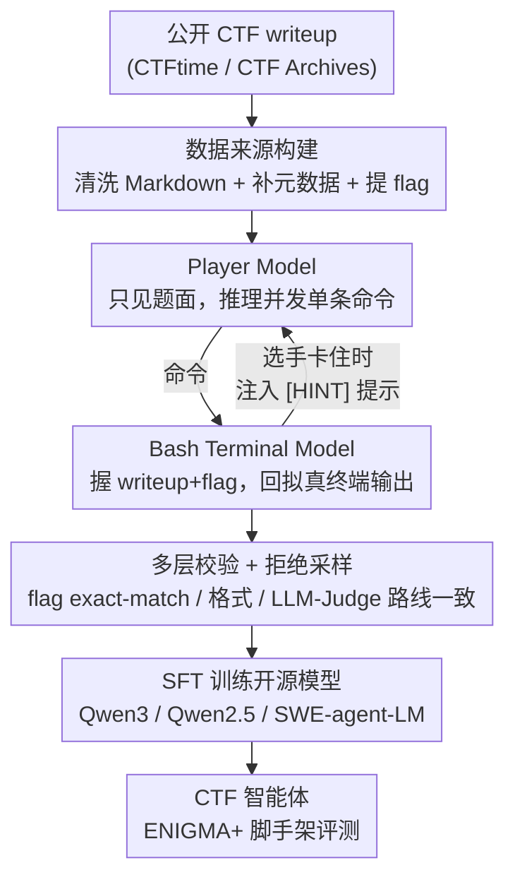

# Cyber-Zero: Training Cybersecurity Agents without Runtime

**会议**: ICLR2026  
**OpenReview**: [https://openreview.net/forum?id=1gRTeAik4G](https://openreview.net/forum?id=1gRTeAik4G)  
**代码**: https://github.com/amazon-science/Cyber-Zero （有）  
**领域**: LLM Agent / 网络安全 / 数据合成  
**关键词**: 网络安全智能体, CTF, 轨迹合成, 无运行时, persona 模拟

## 一句话总结
针对网络安全（CTF）任务缺乏可执行运行时环境、难以采集真实 agent 轨迹的痛点，本文提出 Cyber-Zero——第一个**无运行时**的轨迹合成框架：用公开的 CTF writeup 加 persona 驱动的双 LLM 模拟（一个扮演选手、一个扮演 Bash 终端）逆向"重演"出多轮交互轨迹，再用这些合成轨迹做 SFT，让开源模型在三个 CTF 基准上最高获得 +13.1% 的绝对提升，32B 模型逼近 Claude-3.5-Sonnet 而成本大幅更低。

## 研究背景与动机

**领域现状**：把 LLM agent 用到软件工程任务（如修 GitHub issue）已经很成熟，关键秘诀是有**可执行的运行时环境**——agent 可以真的跑命令、看真实反馈、试错迭代，从而采集到大量真实的多轮交互轨迹来训练。CTF（Capture The Flag）竞赛已成为衡量模型网络安全推理能力的事实标准，ENIGMA 等框架在配合 o3、Claude-3.5-Sonnet 这类前沿闭源模型时已能解出不少题。

**现有痛点**：这些强表现**只属于闭源模型**，开源模型完全跟不上，开闭源之间存在巨大能力鸿沟。原因有两层：一是多数开源模型本就缺乏自主推理、长程规划、策略性用工具这些 agentic 能力；二是更要命的——**训练数据极度稀缺**。CTF 题目和软件工程不一样：竞赛环境往往是临时的、赛后就被关停，题目配置和执行上下文转瞬即逝；即便社区把题目开源，也没有可执行环境，于是**无法采集到那种真实的、带试错和探索的 agent 轨迹**。

**核心矛盾**：训练强 agent 需要真实多轮轨迹，而真实轨迹的采集又依赖可执行运行时——但网络安全领域恰恰没有可复现的运行时。"要数据就得有环境，要环境又拿不到"成了死结。

**本文目标**：在**完全没有可执行环境**的前提下，合成出高质量、长程、带真实试错痕迹的 CTF agent 轨迹，用来训练开源模型，把开闭源差距补上。

**切入角度**：作者注意到，参赛选手赛后写的 **writeup**（解题报告）里其实藏着完整的"运行时行为"——侦察步骤、试过的命令、调试策略、最终 exploit 都被文字记录下来了。既然真实环境拿不到，那就用 LLM 去**逆向"重演"**这段运行时：让一个 LLM 扮演执行命令的 Bash 终端、另一个扮演解题选手，二者你来我往把 writeup 里的解题过程"演"成结构化的多轮轨迹。

**核心 idea**：用 **persona 驱动的双 LLM 模拟**代替真实运行时，把自然语言 writeup 反向工程成可训练的 agent 交互序列——做到 runtime-free 的轨迹合成。

## 方法详解

### 整体框架

Cyber-Zero 把"一篇 CTF writeup"变成"若干条可训练的多轮 agent 轨迹"，整条流水线分三个主要阶段：**源数据收集 → persona 驱动的轨迹生成 → 训练数据构建**，最后接 SFT 训练并在自研的 ENIGMA+ 脚手架上评测。

输入是从 CTFtime / CTF Archives 抓来的海量公开 writeup（原始是带噪 HTML）；先清洗成干净 Markdown、补全缺失元数据（题目描述、文件、flag），筛出 6,188 篇高质量 writeup。然后是核心一环：用两个由 prompt 塑形的 LLM persona——**Player Model**（扮演只看到题面、不知道答案的安全工程师，负责推理并发命令）和 **Bash Terminal Model**（扮演终端，握有原始 writeup 和正确 flag，负责返回拟真的系统输出）——在没有任何真实环境的情况下"对演"出一轮轮交互；当选手卡住时，终端模型会以弱 oracle 身份注入极简提示把它拉回正轨。生成的轨迹再过一道**多层校验 + 拒绝采样**（必须 exact-match 命中 flag、格式合规、LLM-as-Judge 判定与原 writeup 路线一致），筛出合格轨迹去掉提示标记，最后用来 SFT Qwen3 等开源模型。

### 关键设计

**1. 从 writeup 逆向重建运行时：runtime-free 的数据来源**

这一步直接回应"没有可执行环境就拿不到轨迹"的死结：既然环境没了，就把选手留下的 writeup 当作运行时行为的代理。但原始 writeup 噪声极大，作者做了系统化清洗——用 markdownify 把带噪 HTML/XML 转成干净 Markdown；删掉只含外链或过短（<1000 字符）的低信息 writeup；再用 DeepSeek-V3-0324 补全缺失的题目描述、可用文件等元数据，并从正文里抽取 flag，**只保留 flag 可验证的样本**以确保逻辑自洽。最后人工剔除 47 个与评测集重叠的题目防污染，得到覆盖 2017–2025、543 场赛事、4,610 道题、6 大类别的 6,188 篇高质量 writeup。关键在于：writeup 本身就记录了侦察、试错、调试、最终 exploit 的**完整过程**，这正是合成长程轨迹所需要的"剧本"。

**2. persona 驱动的双 LLM 模拟：Player × Bash Terminal**

这是全框架最核心的创新，用来解决"没有运行时、单遍生成的轨迹又太线性、还容易幻觉"两个问题。作者用两个特制 persona 的 LLM 搭出一个完整的"解题生态"：

- **Player Model（选手）**：被设定为经验丰富、跨类别精通的安全工程师，要求**先用自然语言逐步推理、再发出动作**，且每轮只发一条命令、输出格式与 agent 脚手架兼容。关键是它**只拿到题面**（题目描述、可用文件、环境假设），**看不到原始 writeup 和正确 flag**——这逼它像真比赛一样从第一性原理解题，避免被 ground-truth 轨迹污染。
- **Bash Terminal Model（终端）**：模拟终端环境，对选手的命令返回**格式拟真**的系统响应（错误信息、输出保真度、状态一致转移都要像真的）。它与选手相反，**握有原始 writeup 和参考 flag**，因此能充当一个**弱 oracle** 去引导轨迹朝正确方向走。

两者轮流交互，把 writeup 里描述的解题过程"重演"成结构化多轮轨迹，自然带上了试错、调试、策略转向这些真实工作流特征。生成配置上，player 与 terminal 都用 DeepSeek-V3-0324，温度 $0.6$、top-p $0.95$，单条轨迹最多 40 个 agent-环境配对轮次，每篇 writeup 生成 3 条轨迹增加多样性。

**3. 选择性提示干预：让终端当弱 oracle 救场**

如果完全放任选手自己解，作者发现它**几乎抓不到 flag**，能收集到的成功轨迹少得可怜。于是终端模型实现了一个**选择性干预机制**：当选手反复犯错或走进死胡同时，终端会注入极简提示，用特殊标签 `[HINT]...[/HINT]` 包起来——比如提示"再检查一下某个文件"或"重新考虑上一步"，**点到为止、不泄露完整解法**，把选手重新拉回正轨。这一步是数据量的命门：没有它成功轨迹会大幅减少。但提示是"采集时的脚手架"而非"要学的内容"，所以在最终训练数据里，**所有 `[HINT]` 标签包裹的提示都被移除**，确保模型学到的是自主探索能力而不是依赖外部提示走捷径。终端同时维持强真实性约束，避免过度帮忙或直接纠错破坏轨迹的真实性。

**4. 多层校验 + 拒绝采样：保证合成轨迹可信**

无运行时合成的最大风险是幻觉和不真实的命令输出，所以作者借鉴 SWE-Gym 的思路，为拒绝采样微调设计了一道**多层校验**，逐层过滤：① 每条轨迹必须通过 **exact-match** 真的恢复出正确 flag；② 格式校验——Markdown 一致、与 agent 脚手架结构对齐、每个选手回合只含单条命令；③ 终端输出必须符合格式规范（准确的元数据头、拟真系统行为）；④ 用 **LLM-as-a-Judge**（DeepSeek-V3-0324，贪心解码求确定性）做二元判别，评估合成轨迹是否与原 writeup 走了**相似的整体解题路线**。只有四关全过的轨迹才进训练集，从而在没有真实环境验证的前提下尽量逼近"可信轨迹"的质量底线。

### 损失函数 / 训练策略

训练就是标准的**监督微调（SFT）+ 拒绝采样**：把合成并通过校验的轨迹当作示范数据。作者用 NVIDIA NeMo 框架，微调了 Qwen3、Qwen2.5-Instruct、SWE-agent-LM 三个模型族；受算力限制只保留 token 数 ≤ 32,768 的样本，最终 9,464 条轨迹；超参统一为全局 batch size $16$、学习率 $5\times10^{-6}$、训练 $2$ 个 epoch。

评测侧作者另做了一个工程贡献 **ENIGMA+**（在 ENIGMA 脚手架上的增强）：① 所有评测任务**并行执行**（每个 Docker 容器配独立网络接口与隔离环境），把 300+ 题的评测从 ENIGMA 的 1–3 天压到 5 小时内；② 用**统一的最大交互轮数（40 轮）**替代 ENIGMA 按成本（$3/题）的预算，让不同定价模型在公平条件下比较；③ 用 Simple Summarizer 替代 LLM Summarizer，因为二进制反编译输出可能超长撑爆上下文。此外作者还人工修复了影响约 6% 现有 CTF 基准的问题题目。

## 实验关键数据

### 主实验

在 InterCode-CTF（高中级）、NYU CTF Bench（大学级）、Cybench（专业级）三个基准、共 300+ 题上，用 Pass@1（贪心解码）评测。CYBER-ZERO 微调对所有模型族都带来一致提升：

| 模型 | InterCode-CTF (ZS→FT) | NYU CTF (ZS→FT) | Cybench (ZS→FT) | 平均 ∆ |
|------|------|------|------|------|
| Qwen3-8B | 46.5 → 64.8 | 0.8 → 6.3 | 5.0 → 10.0 | +9.0 |
| Qwen3-14B | 55.0 → 73.6 | 2.6 → 9.9 | 12.5 → 20.0 | +10.5 |
| **Qwen3-32B**（Cyber-Zero-32B） | 60.0 → 82.4 | 4.7 → 13.5 | 5.0 → 17.5 | **+13.1** |
| Qwen2.5-Instruct-14B | 44.0 → 68.1 | 3.1 → 7.3 | 5.0 → 17.5 | +10.8 |
| SWE-agent-LM-7B | 0 → 46.2 | 0 → 4.7 | 0 → 7.5 | +16.7 |

最佳模型 **Cyber-Zero-32B** 平均 Pass@1 达 33.4%，与 Claude-3.5-Sonnet（37.2%）、DeepSeek-V3-0324 同档，但成本大幅更低——Claude-3.7/3.5-Sonnet 完成成功任务平均要花 \$44.4 / \$22.2，Cyber-Zero-32B 成本仅其零头，呈现出明显的性价比优势（Figure 3 的成本-性能权衡）。

### 消融 / 分析实验

| 维度 | 关键发现 | 说明 |
|------|---------|------|
| 提示干预（hint） | 去掉则成功轨迹大幅减少 | 选手无引导几乎抓不到 flag，是数据量命门 |
| SWE agent 迁移 | SWE-agent-LM-7B 零样本全 0% | 代码/SWE 训练**不迁移**到安全任务，需领域专训 |
| 推理时算力（Pass@k） | k 增大持续提升，k>5 收益递减 | 微调模型候选更多样，但有效推理路径多在前几个样本 |
| 训练任务多样性 | 10%→100% 覆盖率单调提升 | InterCode-CTF 上 Cyber-Zero-14B 58.2%→73.6% |

### 关键发现
- **提示机制是数据采集的命门**：完全放任选手会因抓不到 flag 而几乎收不到成功轨迹，弱 oracle 的极简提示在"引导"和"不泄题"之间取得了关键平衡，且最终从训练数据中移除以防走捷径。
- **能力不会跨域白送**：专门为软件工程训练的 SWE-agent-LM 在 CTF 上零样本几乎为 0，且 32B 版还不如其基座 Qwen2.5-32B-Instruct——调试/补全技能并不能迁移到需要漏洞探测、与安全工具链交互的安全任务，凸显领域专训的必要。
- **专业级题更难合成覆盖**：任务多样性带来的增益在教育级（InterCode-CTF）上明显，但在专业级（Cybench）上较弱——复杂真实题需要更精细的推理，仅靠未验证的合成轨迹更难捕捉。

## 亮点与洞察
- **"环境没了就用 writeup 逆向重演运行时"是非常巧的转化**：把"采集真实轨迹"的难题，转成"用现成解题报告 + 双 LLM 对演"来生成，绕开了网络安全领域可执行环境稀缺这个硬约束，思路可迁移到任何"有人类解题记录、但环境不可复现"的领域（如历史漏洞复盘、临时竞赛题）。
- **信息不对称的双 persona 设计很关键**：选手"只见题面"逼出第一性原理解题、防 ground-truth 污染；终端"握有答案"才能当弱 oracle 兜底——这种刻意的信息不对称，是合成轨迹既真实又可控的核心。
- **把提示当"采集脚手架"而非"学习内容"**：用 `[HINT]` 标签生成时引导、训练前剥离，既保住了成功轨迹的产量，又避免模型学会依赖外部提示，这个"生成期用、训练期删"的小技巧很值得复用。
- **ENIGMA+ 的工程改进也很实在**：把 300+ 题评测从数天压到 5 小时、用统一轮数预算替代成本预算做公平比较，是让大规模 agent 评测可落地的实用贡献。

## 局限与展望
- **合成轨迹无真实环境验证**：尽管有多层校验，但终端输出毕竟是 LLM"演"出来的，难免有与真实系统行为的偏差；论文也承认专业级 Cybench 上增益偏弱，说明复杂真实题的合成保真度仍是瓶颈。
- **强依赖 writeup 的存在与质量**：方法本质是从人类解题报告逆向，对没有公开 writeup 的新题型/零日场景无能为力，覆盖范围被 writeup 生态限制。
- **校验仍依赖 LLM-as-Judge**：路线一致性的判别用的是 DeepSeek-V3-0324，judge 本身的偏差/幻觉可能放过低质轨迹或误杀好轨迹。
- **明显的 dual-use 风险**：作者在 Ethics 中坦承，runtime-free 让强网络安全 agent 的训练门槛大幅降低，攻防两用，需要研究界、模型开发者与安全机构协作来负责任地发布。
- **可改进方向**：可探索"少量真实环境抽样验证 + 大量合成"的混合策略来校准合成偏差；或引入更强的轨迹一致性度量替代单一 LLM judge。

## 相关工作与启发
- **vs ENIGMA（Abramovich et al., 2025）**：ENIGMA 是 agent 脚手架，靠集成专用安全工具和交互接口提升成功率，但强表现**依赖前沿闭源模型**；本文不改脚手架而是改**训练范式**——用合成轨迹直接提升开源模型的底层能力，并在 ENIGMA 基础上做了 ENIGMA+ 评测增强。
- **vs SWE-Gym / SWE-Fixer / SWE-RL 等软件工程 agent 训练**：它们都依赖**可执行环境**（codebase、issue 上下文）来采集轨迹；本文证明这套范式在网络安全域因环境稀缺无法照搬，且 SWE 训练**不迁移**到安全任务，需要 runtime-free 的领域专属方案。
- **vs 各类 CTF/安全基准（InterCode-CTF、NYU CTF Bench、Cybench）**：这些是**评测**集，且几乎都不提供训练数据（Table 1）；Cyber-Zero 是第一个**完全无运行时**还能产出 6,188 条可训练样本的框架，填补了"有评测无训练数据"的空白。

## 评分
- 新颖性: ⭐⭐⭐⭐⭐ 第一个无运行时的网络安全轨迹合成框架，"writeup 逆向 + 双 LLM persona 模拟"的思路新颖且可迁移
- 实验充分度: ⭐⭐⭐⭐ 覆盖三基准、三模型族、推理时算力与任务多样性两维 scaling，但合成保真度缺乏与真实环境轨迹的直接对照
- 写作质量: ⭐⭐⭐⭐ 动机清晰、流水线讲得明白，Figure 2 的轨迹示例很有助理解
- 价值: ⭐⭐⭐⭐⭐ 用低成本开源模型逼近闭源前沿，且方法范式可推广到其他"环境不可复现"的领域，实用价值高（但需正视 dual-use 风险）

<!-- RELATED:START -->

## 相关论文

- [\[ICML 2026\] ExCyTIn-Bench: Evaluating LLM Agents on Cyber Threat Investigation](../../ICML2026/llm_agent/excytin-bench_evaluating_llm_agents_on_cyber_threat_investigation.md)
- [\[NeurIPS 2025\] DefenderBench: A Toolkit for Evaluating Language Agents in Cybersecurity Environments](../../NeurIPS2025/llm_agent/defenderbench_a_toolkit_for_evaluating_language_agents_in_cybersecurity_environm.md)
- [\[ECCV 2024\] Agent3D-Zero: An Agent for Zero-shot 3D Understanding](../../ECCV2024/llm_agent/agent3d-zero_an_agent_for_zero-shot_3d_understanding.md)
- [\[ICLR 2026\] Go-Browse: Training Web Agents with Structured Exploration](go-browse_training_web_agents_with_structured_exploration.md)
- [\[ICLR 2026\] Efficient Agent Training for Computer Use](efficient_agent_training_for_computer_use.md)

<!-- RELATED:END -->
