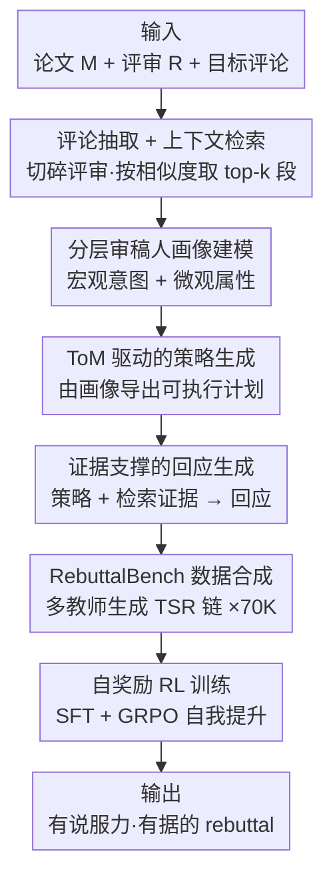

# Dancing in Chains: Strategic Persuasion in Academic Rebuttal via Theory of Mind

**会议**: ICLR2026  
**OpenReview**: [https://openreview.net/forum?id=zkCZDdeS9s](https://openreview.net/forum?id=zkCZDdeS9s)  
**代码**: https://github.com/Zhitao-He/RebuttalAgent  
**领域**: LLM Agent / 说服与心智理论 / RLHF  
**关键词**: 学术 rebuttal、心智理论（ToM）、策略性说服、自奖励 RL、奖励模型

## 一句话总结
本文提出 RebuttalAgent，把学术 rebuttal 当成"信息不对称下的策略博弈"而非简单技术辩论，用心智理论（ToM）建模审稿人心理状态，经"ToM→策略→回复"（TSR）三阶段生成有据可依的回应，并用 SFT + 自奖励 RL 训练，相比基座模型平均提升 18.3%，超过 GPT-4.1、o3 等闭源强模型。

## 研究背景与动机
**领域现状**：LLM 已经深度嵌入科研全流程——文献综述、数据可视化、假设生成、实验设计，甚至能写出通过同行评审的完整论文。但在科研中至关重要的一环——**对审稿意见的 rebuttal（反驳/答辩）**——却几乎无人系统研究。

**现有痛点**：现有方法主要是在评审数据集上做监督微调（SFT），本质是"直接模仿"。这类模型擅长复刻表层语言风格，产出的回应表面礼貌、却套路化、缺乏策略深度。它们学会了"说得客气"，却没学会"说到点子上"。

**核心矛盾**：rebuttal 的本质是一场**不完全信息动态博弈**（dynamic game of incomplete information）。作者要在严重信息不对称下说服审稿人：你不知道审稿人的知识背景、内在偏见，也不知道你的某句回应会引发怎样的连锁反应。成功的 rebuttal 不是表面客气，而是一连串权衡——何时让步、何时坚持、何时补证据、何时重构叙事。要做对这些权衡，前提是**能揣摩对方的心思**，也就是认知科学里说的心智理论（Theory of Mind, ToM）：建模他人的信念、意图、视角并预测其行为。表层模仿的方法恰恰缺这一环。

**本文目标**：让 agent 不再只是模仿语言，而是真正具备"换位思考 + 策略推理"的能力，把 rebuttal 从语言模仿任务转化为策略推理任务。这进一步分解为三个子问题——如何建模审稿人心理、如何由心理画像导出可执行策略、如何让生成的回应有证据支撑。

**切入角度**：作者借用心智理论这一认知科学概念，把它延伸为机器心智理论（Machine ToM）：让 LLM 先推断审稿人的立场、态度、核心关切、专业水平，再据此分配有限的回应篇幅——哪些是值得正面反驳的核心批评、哪些是可以巧妙重构的次要点。

**核心 idea**：用"ToM-Strategy-Response（TSR）"三阶段框架显式地"先想清楚怎么回、再决定回什么"，配合自奖励强化学习实现可扩展的自我提升。

## 方法详解

### 整体框架
RebuttalAgent 的目标：给定原始论文 $M$、某条审稿意见 $R_i$、以及其中需要回应的目标评论 $c_{\text{target}}$，生成一条有说服力的回应 $r_{\text{target}} = G(M, R_i, c_{\text{target}})$。作者要求这条回应同时满足三性——**有说服力**（不止于礼貌，要真正回应关切）、**情境感知**（理解显性批评背后的隐含假设乃至误解）、**证据支撑**（每个论点都能在 $M$ 中找到依据）。

整条管线分四步串起来。**数据准备**：先把杂乱的原始评审切成离散、可操作的目标评论（comment extraction），再对每条评论从论文里检索相关段落（context retrieval）。**TSR 推理**：这是核心，先用 ToM 构建分层审稿人画像，再由画像导出针对性策略，最后把策略落地为有据可依的回应。**数据合成**：用上面流程，借多个强教师模型为 7 万条评论各生成一条完整的"分析-策略-回应"链，构成 RebuttalBench。**Agent 训练**：先 SFT 灌入 TSR 推理能力，再用自奖励 RL（GRPO）做可扩展的自我提升。此外单独训练 Rebuttal-RM 作为自动评测裁判。

### 关键设计

**1. 分层审稿人画像建模：用 ToM 把"读懂审稿人"拆成宏观+微观两层**

直接照着评论字面回应，是表层模仿失败的根源——它没去揣摩字面背后的意图。本文用一个分层结构来"读心"。**宏观层**对整条评审建模一个整体心理画像，跨四个维度：整体立场（Overall Stance，如倾向接受/拒绝）、整体态度（Attitude，如建设性/敌意）、主导关切（Dominant Concern，如更在意呈现还是方法）、审稿人专业度（Expertise，专家/外行）。这层画像决定全局策略与语气。**微观层**则针对每一条具体评论，把它归类到四个关切维度：重要性（Significance）、方法论（Methodology）、实验严谨性（Experimental Rigor）、呈现（Presentation），并标注类型与严重程度（如"基线缺失/弱-严重"、"笔误-轻微"）。宏观决定怎么"定调"，微观决定每条怎么"对症下药"，二者结合让回应既精准命中又与全局策略一致。

**2. ToM 驱动的策略生成：在"理解"和"回复"之间插一个显式策略中间步**

如果让模型读完画像直接写回复，它很容易又退回到"对字面问题做反应"的老路。本文在画像与回复之间显式插入一个策略生成步骤：以完整审稿人画像 + 目标评论为条件，让 LLM 输出一段简洁、高层的策略（例如"1. 先承认并肯定；2. 分析当前状态与瓶颈；3. 提出具体解决方案"）。这一步的关键价值在于**强迫模型先决定"怎么回"，再决定"回什么"**——把静态的诊断画像翻译成动态、可执行的计划，确保最终文本不是对评论表层 query 的被动反应，而是与审稿人深层意图、态度、核心关切对齐的策略性回应。

**3. 证据支撑的回应生成：把策略落到论文真实证据上，避免空对空**

说服力光有策略不够，还得有据。回应生成阶段以两类输入为条件协同合成：**策略性输入**——ToM 审稿人画像 $P$ 与定制策略 $S$，决定回应如何贴合审稿人视角、语气与论证走向；**情境性输入**——检索到的相关段落 $\bigoplus_{p_j \in C_E} p_j$ 与原始回应 $r_{\text{orig}}$。形式化为 $r_{\text{target}} = G(R_i, c_{\text{target}}, P, S, \bigoplus_{p_j \in C_E} p_j, r_{\text{orig}})$。其中 $r_{\text{orig}}$ 一身两用：既是高保真上下文来源，又是措辞与结构的高质量参考蓝本（注意 $r_{\text{orig}}$ 只在数据合成阶段使用，最终模型推理时不依赖它）。这样最终文本被保证是策略对齐、事实落地、结构连贯的。

**4. 自奖励 RL：不靠外部奖励模型，让 SFT 后的 agent 给自己打分做 GRPO**

RL 阶段要进一步把回应优化得更具策略优势、更有说服力，但训练一个专门的外部奖励模型既贵又难扩展。本文引入自奖励机制：直接复用 SFT 后的模型 $G_{\text{SFT}}$ 评估自己的输出，沿四个维度给分，总奖励为 $R(o) = w_1 R_{\text{format}}(o) + w_2 R_{\text{think}}(o) + w_3 R_{\text{resp}}(o) + w_4 R_{\text{div}}(o)$。其中 $R_{\text{format}}$ 程序化检查输出是否含 `<Analysis>/<Strategy>/<Response>` 结构（二值奖励）；$R_{\text{think}}$ 由模型自评分析与策略块的质量（画像准确性、策略合理性）；$R_{\text{resp}}$ 自评最终回应的说服力、清晰度与证据使用；$R_{\text{div}}$ 把生成回应与一组预定义的模板化负样本比对，越语义不同得分越高——专门用来对抗"reward hacking"和泛泛而谈的同质化输出。随后用 GRPO 优化策略：对每个输入 $q$ 采样一组 $G$ 个候选，按组内相对奖励算优势 $A_i$，最大化带裁剪的代理目标 $J_{\text{GRPO}}(\theta)$ 并加 $\beta D_{\text{KL}}(\pi_\theta \| \pi_{\text{ref}})$ 正则。整套机制让 agent 无需外部专家标注奖励模型即可持续自我提升。

### 损失函数 / 训练策略
两阶段训练，基座为 Qwen3-8B。**SFT 阶段**：在 RebuttalBench（7 万条、每条含完整 TSR 链）上监督微调，让模型学会 TSR 结构化推理与基础 rebuttal 能力；数据来自多样评审、由多个强 LLM 合成以增强鲁棒性与跨风格泛化。**RL 阶段**：用上述自奖励信号 + GRPO 进一步优化策略。RebuttalBench 源自 Re2-rebuttal 数据集，用 GPT-4.1 解析出 20 万+ 评论-回应对，标注宏观/微观画像，**显式剔除需要补做新实验的评论**（如"和基线 X 比"），把能力聚焦在语言说服与策略论证、防止模型编造实验数据，最终精选 7 万条（6 万按类别筛 + 1 万随机）。

## 实验关键数据

### 主实验
评测主指标是 0-10 的整体质量分，并细分为 Clarity（C，逻辑组织）、Persuasiveness（P，论证与证据强度）、Constructiveness（Co，改进承诺与可落地修改）、Attitude（态度）四维。在 in-domain 测试集 R2-test（6000 条评论，来自 24 个会议 + 21 个 workshop）上：

| 模型 | 平均分 | 相对基座 Qwen3-8B 提升 |
|--------|------|------|
| Qwen3-8B（基座） | 7.96 | — |
| GPT-4.1 | 8.50 | — |
| DeepSeek-R1 | 8.64 | — |
| o3 | 9.21 | — |
| **RebuttalAgent** | **9.42** | **+18.3%** |

RebuttalAgent 取得最高整体分 9.42，超过 GPT-4.1、o3 等所有基线，Clarity 达 9.43、Persuasiveness 9.20，其中 Persuasiveness 与 Constructiveness 提升最大（最高达 34.6%）。

Rebuttal-RM 作为裁判，与人类评分的一致性（六项统计指标平均）也显著领先：

| 裁判模型 | 与人类一致性 Avg |
|--------|------|
| GPT-4.1 | 0.745 |
| DeepSeek-r1 | 0.705 |
| **Rebuttal-RM（本文）** | **0.812** |

Rebuttal-RM（Qwen3-8B 基座、102K 多源数据训练）平均 0.812，分别超过 GPT-4.1 和 DeepSeek-r1 约 9.0% 与 15.2%。

### 消融实验

| 配置 | 平均分 | 说明 |
|------|---------|------|
| RebuttalAgent（完整） | 9.42 | 完整模型 |
| w/o ToM | 9.04 | 去掉心智理论分析，掉 0.38 |
| w/o Strategy | 9.31 | 去掉显式策略步 |
| w/o Thinking | 9.37 | 去掉思考块 |
| SFT-only | 8.27 | 只 SFT 不 RL，掉 1.15 |
| RL-only | 8.79 | 只 RL 不 SFT |
| w/o $R_{\text{resp}}$ | 8.63 | 去掉回应质量奖励，掉点最多（−0.79） |

### 关键发现
- **回应质量奖励 $R_{\text{resp}}$ 贡献最大**：去掉它平均分从 9.42 掉到 8.63，是所有奖励信号里最关键的一个。
- **训练两阶段缺一不可**：只 SFT（8.27）或只 RL（8.79）都远不如完整流程（9.42），说明成功源自专用数据、完整训练、奖励机制三者的协同。
- **框架与骨干无关、可泛化到小模型**：把 TSR + 自奖励套到 Llama-3.1-8B 和 Qwen3-4B 上，分别从 7.44→9.20、7.69→8.98，证明它是 model-agnostic 的策略。
- **泛化到 out-of-domain**：在自建 Rebuttal-test（1000+ 条 post-2023 的 ICLR/NeurIPS 真实评审、处理出 2K 评论）上同样有效，验证了对新分布的泛化。

## 亮点与洞察
- **问题重定义最值钱**：把 rebuttal 从"语言模仿"重新定义为"不完全信息博弈下的策略说服"，并引入心智理论作为解法，这个视角转换本身就解释了为什么过去 SFT 方法只会"礼貌套话"。
- **"先想怎么回、再写回什么"的显式解耦**：在画像和回复之间插一个独立的策略生成步，强制模型把决策和措辞分开——这个 trick 可迁移到任何"高风险、需要权衡"的生成任务（谈判、客服投诉处理、外交辞令）。
- **自奖励 + 多样性奖励对抗 reward hacking**：$R_{\text{div}}$ 用预定义模板化负样本作对照，越像套话越扣分，巧妙地把"避免泛泛而谈"变成可优化信号，比单纯靠人写规则更省事。
- **配套造了一个比 GPT-4.1 更准的领域裁判**：Rebuttal-RM 把"如何可靠自动评估 rebuttal"这个评测难题也一并解决，对后续研究是可复用基础设施。

## 局限与展望
- **作者自设的边界**：显式剔除了"需要补做新实验"的评论，只聚焦语言说服——这意味着 agent 处理不了占 rebuttal 相当比例的"实证性诉求"，实际写 rebuttal 时这部分往往最致命。
- **自奖励的"既当运动员又当裁判"风险**：$R_{\text{think}}$ 和 $R_{\text{resp}}$ 都由 $G_{\text{SFT}}$ 自评，存在自我偏好放大的隐患；虽然 $R_{\text{div}}$ 缓解了同质化，但模型可能学会"讨好自己的评分倾向"。
- **评测仍以模型分为主**：主结果依赖 Rebuttal-RM 自动评分，尽管对齐人类较好，但与真实"审稿人是否加分"的因果链条仍有距离；论文虽用"加分实例"做高质量标注，但端到端"用了这套回应→分数真的涨了"的在线验证仍缺。
- **伦理边界微妙**：把"策略性说服"自动化，离"操纵审稿人"只一步之遥；作者加了 disclaimer（仅供参考、不替代作者本人分析），但工具一旦普及，评审博弈的军备竞赛值得警惕。

## 相关工作与启发
- **vs SFT-only 模仿方法（如 RebuttalFT）**: 它们直接在真实人写 rebuttal 上微调 Qwen3-8B，结果平均分仅 6.35，反而低于基座——说明盲目模仿真实回应会把噪声和套路一起学进去；本文用 TSR 链 + RL 显式建模策略，避开了这个陷阱。
- **vs Strategy-Prompt（提示工程模仿本文思路）**: 同样"先出策略再写回复"，但纯靠 GPT-4.1 提示、不训练，平均 8.37，明显低于本文 9.42——证明把 ToM/策略能力**训进模型权重**比临时提示更稳。
- **vs Self-Refined（自我反思迭代）**: 靠 GPT-4.1 反复自我修订得 8.72，仍不及本文——说明"无方向的自我反思"不如"有 ToM 画像导航的策略生成"。
- **启发**：TSR 这套"读心→定策略→落证据"的三段式，本质是给生成任务加一条可解释的推理脚手架，可迁移到任何需要换位思考的高风险沟通场景。

## 评分
- 新颖性: ⭐⭐⭐⭐⭐ 首次把心智理论引入学术 rebuttal，问题重定义 + TSR 框架视角独到
- 实验充分度: ⭐⭐⭐⭐ in/out-of-domain + 跨骨干 + 完整消融，但自动评测占主导、缺在线因果验证
- 写作质量: ⭐⭐⭐⭐ 动机推导清晰，框架图与公式齐全，标题"戴着镣铐跳舞"点题精彩
- 价值: ⭐⭐⭐⭐ 实用工具 + 可复用裁判模型，但伦理边界与"只管语言不管实验"的局限需正视

<!-- RELATED:START -->

## 相关论文

- [\[ICLR 2026\] STARK: Strategic Team of Agents for Refining Kernels](stark_strategic_team_of_agents_for_refining_kernels.md)
- [\[ICLR 2026\] Dyna-Mind: Learning to Simulate from Experience for Better AI Agents](dyna-mind_learning_to_simulate_from_experience_for_better_ai_agents.md)
- [\[ICLR 2026\] MC-Search: Evaluating and Enhancing Multimodal Agentic Search with Structured Long Reasoning Chains](mc-search_evaluating_and_enhancing_multimodal_agentic_search_with_structured_lon.md)
- [\[ICLR 2026\] Presenting a Paper is an Art: Self-Improvement Aesthetic Agents for Academic Presentations](presenting_a_paper_is_an_art_self-improvement_aesthetic_agents_for_academic_pres.md)
- [\[ICML 2026\] It's a TRAP! Task-Redirecting Agent Persuasion Benchmark for Web Agents](../../ICML2026/llm_agent/its_a_trap_task-redirecting_agent_persuasion_benchmark_for_web_agents.md)

<!-- RELATED:END -->
