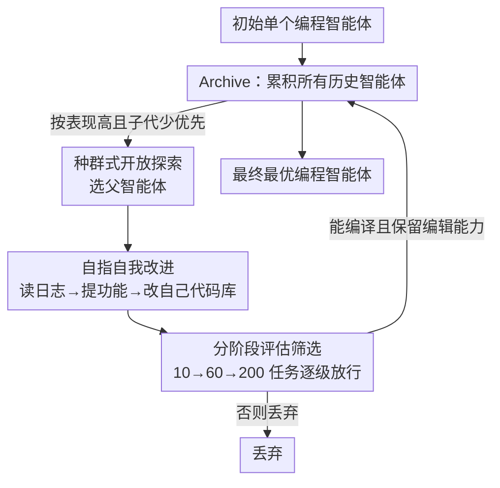

# Darwin Gödel Machine: Open-Ended Evolution of Self-Improving Agents

**会议**: ICLR 2026  
**OpenReview**: [https://openreview.net/forum?id=pUpzQZTvGY](https://openreview.net/forum?id=pUpzQZTvGY)  
**代码**: 有（论文承诺开源 code / prompts / 评测产物，发布版会去掉提权组件并默认沙箱）  
**领域**: Agent / 自我改进 / 开放式进化  
**关键词**: 自我改进、编程智能体、开放式探索、Darwin Gödel Machine、SWE-bench

## 一句话总结
DGM 让一个编程智能体不断改写自己的代码库来变得更会改代码，用「在 benchmark 上跑分」这一经验证据替代 Gödel Machine 理论上不可行的「形式证明」，并用一个不断生长的智能体 archive 做开放式探索，把 SWE-bench 从 20.0% 推到 50.0%、Polyglot 从 14.2% 推到 30.7%。

## 研究背景与动机
**领域现状**：今天的 AI 系统几乎都被固定的、人类设计好的架构框死，只能在预设边界内学习，没有能力重写自己的源码去自我改进。每一次能力进步都仍然高度依赖人类手工调整，这把 AI 进步的节奏死死拴在了人力上。元学习（meta-learning）能自动发现新算法，但受限于「一阶改进」和「人类设计的搜索空间」。

**现有痛点**：Schmidhuber 的 Gödel Machine 给出过一个理论上漂亮的方案——一个反复以「可证明有益」的方式改写自己的 AI。但在没有强约束假设的真实系统里，**根本无法形式化地证明某次修改对系统是净有益的**。比如给 LLM 编程智能体加更多工具（代码搜索、测试运行器）听上去总是好事，但实际效果高度依赖模型训练和任务上下文：一个为某套环境优化的测试工具，换个场景反而会把智能体搞糊涂。

**核心矛盾**：自我改进需要一个「这次改动到底好不好」的判据。形式证明这条路在实践中走不通；而如果只靠「贪心地在当前最优解上继续改」，系统又很容易卡在局部最优——一次糟糕的自我修改会让后续改进更难，甚至让智能体丢掉编辑代码库的基本能力，从此无法再自我修改。

**本文目标**：造一个能持续自我改进、且越改越会改的系统，同时回避形式证明的不可行性与单点贪心的早熟。

**切入角度**：作者把灵感从「证明」转向「达尔文式进化」——突变和适应不需要事先验证，而是先产生、再试验、再由自然选择保留。同时借鉴开放式（open-endedness）研究：维护一个历史智能体的库，把那些「有趣但尚不最优」的解当作未来突破的垫脚石（stepping stones）。

**核心 idea**：把「自我改进」本身定义成一个编程任务（改自己的代码库），用 coding benchmark 的跑分作为经验证据来验证每次修改；再用一个不断累积所有变体的 archive 做种群式开放探索，让进步像科学一样站在自己过去的肩膀上累积。

## 方法详解

### 整体框架
DGM 是一个自指（self-referential）、自我改进的系统：它写代码、改自己的代码，从而变成更好的编程智能体。系统从**单个**初始编程智能体出发（一个基于冻结预训练 FM、带 Bash 工具和文件编辑工具的轻量 agent），维护一个会不断生长的智能体 archive。整个过程是「自我修改」与「评估」两个阶段交替循环 80 轮、每轮产出一个新智能体：从 archive 里按策略选一个父智能体，让它读自己的评测日志、提出下一个要加的功能、把该功能实现进自己的代码库生成子智能体，再在 coding benchmark 上评估子智能体，只有「能编译且仍保留代码编辑能力」的子智能体才被加回 archive。关键假设是：coding benchmark 上的分数提升 = 编程能力提升 = 自我改进能力提升（因为自我改进本身就是改代码这件事）。

### 关键设计

**1. 把自我改进定义成「改自己代码」的编程任务，用经验证据替代形式证明**

这一条直接回应「形式证明在真实系统里不可行」的痛点。DGM 放松了 Gödel Machine「必须先证明修改有益才允许改」的要求，改成**事后用实验证据说话**：每次修改后在 coding benchmark 上实测，分数涨了就认。之所以这样能闭环，是因为作者把自我改进巧妙地等价成了一个编程任务——智能体用图灵完备的 Python 编辑自己的代码仓库（工具、prompt、workflow 都在这个仓库里）。于是「在编程任务上更强」与「更会改自己的代码」是同一件事的两面：你在 SWE-bench 上观察到的提升，既证明了下游任务变好，也证明了自我改进能力变强。这与 ADAS、Zelikman 等用「固定 meta-agent + 一个 meta-utility」的做法不同——那里下游任务表现和自我改进能力并不总对齐，而 DGM 让二者天然一致，从而打开了自我加速的可能。

**2. 种群式开放探索：维护 archive，按「表现高 × 子代少」采样父代**

只靠经验证据有个风险：会卡在搜索空间的局部最优。DGM 用开放式探索破局——不进化单个解，而是维护一个累积**所有**历史智能体的 archive，每轮从中挑父代分叉。父代的采样概率大致与其表现分数成正比、与其「已有的（具备代码编辑能力的）子代数量」成反比，可粗略记为 $p_i \propto s_i \cdot \frac{1}{1+n_i}$（⚠️ 精确形式以原文 Appendix C.2 为准），既偏好高分强者（exploitation），又偏好被探索得少的有潜力谱系（exploration）。关键是**所有智能体都保留非零采样概率**，意味着只要算力够，任何一条通往改进的路径都不会被永久封死。这让 archive 里的解能充当垫脚石——某个当时不起眼的智能体，可能在很久之后才催生重大改进（论文里 node 24 这类关键创新会引爆一大簇后续创新）。也正因为能从任意节点分叉，DGM 能跳出 SWE-bench 第 4、56 轮那种「子代一度比父代差」的欺骗性凹陷，继续沿那条路探索出超越所有前辈的新智能体；同一目标功能（如更细粒度的编辑工具）也能尝试多种实现，避开被某个次优实现困住。这与 Robeyns 等「只在最新版本上爬山」的贪心式做法形成对比。

**3. 分阶段评估：在嘈杂又昂贵的评测下筛选并守住「可自我修改」的底线**

由于 LLM 本身随机、全量评测又极贵（一次 SWE-bench 运行约两周、API 成本可观），DGM 用一个分阶段评估策略来省算力又控噪声：先用 10 个任务验证「基本的代码库编辑功能」是否还在——只有还能编辑代码的智能体才可能解题或继续自我修改，**否则直接丢弃**；通过的再上 60 任务；只有当 SWE-bench 上得分超过 40%（依据预实验噪声选的启发式阈值）且排进 archive 前二，才花成本上 200 任务做更准的能力估计（Polyglot 则是 10→50 任务）。这个「越有信心是强者、才给它越多评测预算」的漏斗，既把宝贵算力分配给最可能的候选，又通过「必须保留编辑能力才进 archive」这条硬门槛，保证 archive 里的每个智能体都还能继续自我改进，不会因一次自毁式修改而断了进化链。

## 实验关键数据

### 主实验
两个 coding benchmark：SWE-bench（仅 Python、常需多文件编辑，用人工过滤过的 Verified 子集）与 Polyglot（多语言、多为单文件从零实现；报 pass@1，比官方 leaderboard 的 pass@2 更严）。运行 80 轮自我改进后：

| 基准 | 起点（base agent） | DGM 终点 | 备注 |
|------|------|------|------|
| SWE-bench | 20.0% | **50.0%** | 与「可复现的开源 SoTA」相当 |
| Polyglot（全量） | 14.2% | **30.7%** | 远超代表性人工智能体 Aider |

DGM 自动发现的改进集中在工具与 workflow 两类：把编辑工具从「整文件查看/替换」升级为「按行查看 + 按字符串替换」的细粒度编辑；workflow 上学会多次尝试解题再用另一个 FM 评选最佳、以及生成新尝试时参考此前的尝试。

### 消融实验
对照两个去掉核心组件的基线（图 2，分数取各自评测子集）：

| 配置 | 行为 | 结果 |
|------|------|------|
| DGM（完整） | 自我改进 + 开放探索 | 持续上升，两基准均最优 |
| w/o self-improve | meta-agent 固定为 base agent（等价 ADAS） | 早期有提升，很快见顶停滞 |
| w/o open-ended exploration | 只保留最新版本、无 archive | 一次差的自我修改拖累后续，更难再进步 |

### 关键发现
- **两个组件缺一不可**：去掉自我改进会很快收益递减；去掉开放探索会因「只留最新版」而被一次坏修改卡住。说明「越改越会改」和「保留垫脚石」共同支撑了持续进步。
- **跨模型迁移**：在 SWE-bench 上用 Claude 3.5 Sonnet 搜出的智能体换 FM 仍有效——换 o3-mini 时 base 23.0%→DGM 33.0%，换 Claude 3.7 Sonnet 时 19.0%→59.5%（200 任务），说明改进不与特定 FM 强绑定。
- **跨基准/跨语言迁移**：SWE-bench 上进化的智能体零样本到 Polyglot 拿 28.9%（基线 14.2%），反向 Polyglot→SWE-bench 拿 24.5%（基线 20.0%）；只在 Python 上搜出的智能体迁到其他语言仍能逼平「全语言搜索」并大幅超过 base 和 Aider，说明学到的是通用编码技能而非 benchmark 漏洞。
- **开放探索的可视化证据**：archive 树里许多通往创新的路径要先经过低分节点，关键节点（如 node 24）一旦出现就引爆一大簇后续改进；最优智能体的谱系还包含两次性能下探后再反弹。

## 亮点与洞察
- **把「自我改进」收敛成「改自己代码」这一个编程任务**，是全文最关键的一招：它让「下游表现」与「自我改进能力」天然同向，从而把「benchmark 跑分」这个廉价信号合法地当成自我改进的验证证据，绕开了 Gödel Machine 的形式证明死结。
- **用达尔文式 archive 替代贪心爬山**，把开放式进化研究里「保留有趣但次优的垫脚石」「所有解保非零采样概率」的原则工程化，实测能跳出欺骗性凹陷——这套思路可迁移到任何「评估嘈杂、易早熟」的自动化设计/搜索问题（prompt 优化、网络结构搜索、agentic 模块设计）。
- **「越有信心越给评测预算」的分阶段漏斗** + **「必须保留编辑能力才进档」的硬门槛**，是在昂贵随机评测下做种群搜索的实用配方，可直接复用到其他 LLM-as-optimizer 的自动化管线。
- 安全上把整个自我改进圈在沙箱 + 资源/时间限制 + 可审计 archive 谱系内，并提出「自我改进也可被导向提升安全与可解释性本身」（如附录里针对 FM 幻觉做对策的初步尝试）——给「能力越强越危险」的范式提供了可操作的护栏样板。

## 局限与展望
- **算力与成本极高**：一次 SWE-bench 上的 DGM 运行约两周、API 花费可观，离「跑得起、跑得久」还有距离；能否跑更久从而超过闭源 SoTA 仍是开放问题。
- **受底层 FM 能力上限约束**：本版只改 prompt / 工具 / workflow，FM 本身冻结；作者明确把「重写自己的训练脚本、连 FM 一起更新」留作未来工作（计算量与复杂度都大得多）。
- **仍逊于闭源 SoTA**：能追平可复现的开源方案，但够不到由专家团队精雕细琢的闭源最优解，作者归因于 FM 推理能力尚不及顶尖人类专家。
- **「benchmark 跑分≈自我改进能力」是核心假设**：若评测无法覆盖安全、鲁棒、可解释等性质，自我改进循环可能在多代里放大错位（misalignment）；作者把 benchmark 增益视为「必要但不充分」的进步指标，并探讨把安全/推理等目标也纳入优化回路、甚至 co-evolve 任务分布以摆脱单一目标约束。
- **开放探索过程本身目前固定**（archive 维护、父代选择规则不可被 DGM 修改），把它也交给系统自我改进是潜在方向。

## 相关工作与启发
- **vs Gödel Machine（Schmidhuber, 2007）**：后者要求形式证明每次修改可证有益，实践不可行；DGM 用经验证据（benchmark 实测）替代证明，牺牲理论严格性换来可落地性。
- **vs ADAS / 固定 meta-agent（Hu et al., 2025; Zelikman et al., 2024b）**：它们用一个固定的 meta-agent 去改下游智能体，meta-utility 与自我改进能力不总对齐；DGM 是单一系统既解题又改自己，去掉了手工 meta-agent，实现自指改进——这正是其「w/o self-improve」基线。
- **vs Robeyns et al. (2025)（并行工作）**：同样让单智能体递归改自己的代码库，但只在最新版本上爬山；DGM 多了开放式探索循环，鼓励超越即时收益的修改、避免卡在次优——对应其「w/o open-ended exploration」基线。
- **vs 开放式/质量-多样性进化（Stanley & Lehman、Faldor et al. 等）**：DGM 继承「累积垫脚石、保多样性」的思想，但首次把它和「自指自我改进闭环」接上，让下游进步直接转化为更强的自我修改能力。

## 评分
- 新颖性: ⭐⭐⭐⭐⭐ 首次把「自指自我改进 + 开放式 archive 探索」闭环落地，用经验验证替代 Gödel Machine 形式证明，概念上极漂亮。
- 实验充分度: ⭐⭐⭐⭐ 两基准大幅提升 + 跨模型/跨基准/跨语言迁移 + 双消融基线扎实，但单 FM 家族为主、运行成本高导致重复次数有限。
- 写作质量: ⭐⭐⭐⭐⭐ 动机推导（科学累积↔达尔文进化↔Gödel Machine）清晰，安全讨论坦诚且具体。
- 价值: ⭐⭐⭐⭐⭐ 朝「自我加速、自我改进 AI」迈出可复现的一步，方法范式对自动化 agent/算法设计有广泛启发，同时提供安全护栏样板。

<!-- RELATED:START -->

## 相关论文

- [\[ICLR 2026\] Huxley-Gödel Machine: Human-Level Coding Agent Development by an Approximation of the Optimal Self-Improving Machine](huxley-godel_machine_human-level_coding_agent_development_by_an_approximation_of.md)
- [\[ICLR 2026\] ChinaTravel: An Open-Ended Travel Planning Benchmark with Compositional Constraint Validation for Language Agents](chinatravel_an_open-ended_travel_planning_benchmark_with_compositional_constrain.md)
- [\[ICLR 2026\] WebWeaver: Structuring Web-Scale Evidence with Dynamic Outlines for Open-Ended Deep Research](webweaver_structuring_web-scale_evidence_with_dynamic_outlines_for_open-ended_de.md)
- [\[ICLR 2026\] Agentic Context Engineering: Evolving Contexts for Self-Improving Language Models](agentic_context_engineering_evolving_contexts_for_self-improving_language_models.md)
- [\[ICLR 2026\] EvoTest: Evolutionary Test-Time Learning for Self-Improving Agentic Systems](evotest_evolutionary_test-time_learning_for_self-improving_agentic_systems.md)

<!-- RELATED:END -->
