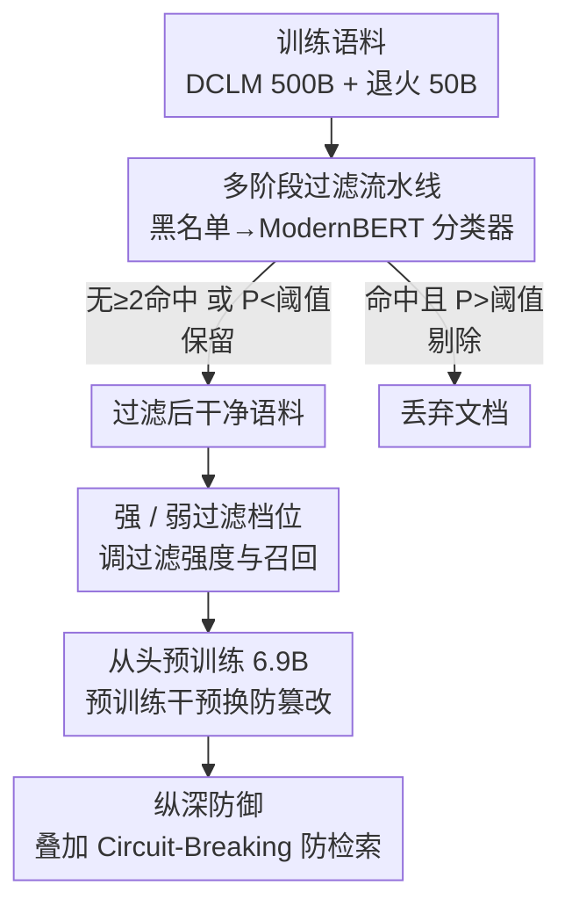

# Deep Ignorance: Filtering Pretraining Data Builds Tamper-Resistant Safeguards into Open-Weight LLMs

**会议**: ICLR2026  
**OpenReview**: [https://openreview.net/forum?id=xcf0QcTcGS](https://openreview.net/forum?id=xcf0QcTcGS)  
**代码**: 待确认  
**领域**: AI 安全 / LLM 安全  
**关键词**: 预训练数据过滤, 防篡改, 开源权重安全, 生物威胁知识, 纵深防御

## 一句话总结
作者提出一条「黑名单 + ModernBERT 分类器」的多阶段预训练数据过滤流水线，把双用途生物威胁相关文本从语料里删掉，再从头训练 6.9B 模型，使其在高达 10,000 步、3 亿 token 的对抗微调下仍守住「无害」——比现有后训练防御强一个数量级，且不损伤通用能力。

## 研究背景与动机
**领域现状**：开源权重大模型（open-weight LLM）带来透明、可研究、去中心化等好处，但任何下游用户都能拿到权重、任意改动。为防止模型被诱导输出生物/化学/核（CBRN）等危险知识，主流做法是**后训练阶段**打补丁——安全微调、机器遗忘（unlearning）、Circuit-Breaking、潜空间对抗训练（LAT）等，在训练好的模型上「擦掉」危险能力。

**现有痛点**：这些后训练防御极其脆弱。大量工作反复证明，攻击者只需几百步、甚至几十步对抗微调就能把安全护栏「解封」，恢复出被擦掉的危险知识。换句话说，后训练只是把危险知识「压住」而非「移除」，神经回路还在，稍一施压就复活。

**核心矛盾**：危险知识在**预训练阶段**就已经被模型学进了权重，后训练再怎么修补都是在已经长出的「危险回路」上做表面文章。要让模型真正「无知」，得让它**从一开始就没机会学到**这些知识。

**本文目标**：让模型对生物威胁代理知识（biothreat proxy knowledge）保持「稳健的无知」（robust ignorance），同时不掉通用能力，并且这种无知要扛得住大规模对抗微调。

**切入角度**：作者假设——如果某类危险知识**精确、且只来自训练语料里一小撮文档**，那么把这撮文档从预训练数据里过滤掉，模型就根本学不会，攻击者也就无从「唤醒」。这个假设对「知识」（precise facts）成立，但对「倾向」（toxicity 这类不需要精确知识的属性）未必成立——这是本文一个重要的边界澄清。

**核心 idea**：把安全防线从「后训练」前移到「预训练数据过滤」——用低成本流水线在喂给模型之前就删掉危险语料，用「数据层面的缺失」换来「权重层面的防篡改」。

## 方法详解

### 整体框架
整篇工作的核心是一条**可扩展的多阶段数据过滤流水线**，外加「过滤→从头预训练→评测防篡改→叠加纵深防御」的完整闭环。输入是动辄上亿篇文档的预训练语料（500B token 的 DCLM 主训练 + 50B token 的退火/midtraining 阶段），输出是一个对生物威胁知识「天生无知」的 6.9B 模型。

流水线分两级、由廉价到昂贵逐级升级（escalation）：绝大多数文档（约 91%）连黑名单都不命中，直接保留，根本不进分类器；只有命中黑名单的少数文档才升级给 ModernBERT 分类器做语义判定。这样整条过滤的算力开销不到训练总 FLOPS 的 1%。过滤后从头训练模型，再用对抗微调、潜空间攻击、输入空间攻击等手段系统检验它到底有多「防篡改」，最后发现单靠数据过滤挡不住「带答案的检索增强」，于是叠加 Circuit-Breaking 形成纵深防御。

### 关键设计

**1. 多阶段过滤流水线：用「廉价召回 + 精确复核」两级处理上亿文档**

直接对每篇文档跑大模型分类在上亿规模的语料上算力上不可承受，这是「想过滤但过滤不起」的核心痛点。作者把过滤拆成由廉价到昂贵的两级。**第一级关键词黑名单**：先用 Llama 3.3 70B 从 WMDP-Bio Forget 数据集的 24,453 篇文档里抽出一批关键术语（如 "pathogen"），然后扫描每篇训练文档，只要命中**两个及以上**黑名单词就「升级」，否则直接保留。这一步只是纯文本查找，CPU 即可、可任意并行，而 91.58% 的预训练文档、90.64% 的退火文档根本不命中，连复核都不需要。**第二级 ModernBERT 分类器**：黑名单召回高但误报多，于是对升级上来的文档再用一个微调过的 ModernBERT-Large 做语义判定——它在 198,184 篇专家标注 + LLM 标注的样本上微调，给每篇文档打一个「不安全概率」$P$，$P$ 高于阈值则剔除、低于则保留。由于分类器只处理被黑名单升级的少数文档、且模型很小，这一级仅消耗约 0.83% 的训练 FLOPS。两级串起来：黑名单负责「便宜地把可疑的捞出来」，分类器负责「精确地把真危险的挑出来」，整体过滤不到总算力的 1%，端到端跑完一遍 80 张 H100 约 1.5 天。

**2. 强 / 弱过滤档位：靠「要不要分类器复核」这一个开关调节过滤激进程度**

什么时候该宁可错杀（高召回）、什么时候该保科学语料（高精度）？作者用「过滤阶段数」这个旋钮给出两档。**强过滤（Strong Filter）**在预训练和退火两个阶段都**只用单级黑名单**——命中黑名单就直接删，不再升级复核，相当于把分类器关掉，结果删掉 8.42% 的预训练文档、9.36% 的退火文档，激进但召回最高。**弱过滤（Weak Filter）**的预训练阶段和强过滤一样，但在退火阶段补上 ModernBERT 复核（blocklist→classifier 两级），只删 4.96% 的退火文档，且把「被黑名单升级但被分类器判为安全」的文档**填回**语料以维持科学类数据的占比，从而少误伤正常生物/科学内容。这一设计的巧妙之处在于：增删过滤级数即可在「召回」和「精度」之间平滑权衡——想更激进就关掉分类器（强），想保住正常科学知识就加上分类器（弱），无需重训任何组件。

**3. 把安全防线前移到预训练，换来真正的防篡改**

后训练防御之所以一压就垮，是因为危险知识早已写进权重、回路尚在。作者的核心论点是：**只要模型在预训练阶段就没学到这些知识，攻击者后续就很难「微调出」它**。他们从头训练多个 6.9B 解码器模型（架构对齐 Pythia 6.9B），分别用未过滤、强过滤、弱过滤语料，训练 token 量都对齐到 550B 以保证可比。检验「防篡改」用的是货真价实的对抗微调：在 WMDP-Bio Forget 集上以 $2\times10^{-5}$ 学习率、batch 16、2048 上下文跑 2 个 epoch，含全参与 LoRA 两种微调，最多推到 10,000 步、约 3 亿 token；还叠加潜空间攻击（在 0/8/16/24/30 层注入通用扰动）和输入空间攻击（few-shot、通用 GCG-U）。结果是过滤模型在几乎所有攻击下都最稳——扛住 10,000 步对抗微调而生物威胁能力几乎不涨，比 Circuit-Breaking 等后训练基线的防篡改强**一个数量级以上**，且对良性微调（在 WikiText 上微调）完全免疫，而 CB 在良性微调下迅速失效。一个有意思的发现是：潜空间攻击在「选择题（MCQA）」设定下出人意料地有效，但在「填空（cloze）」设定下不行，作者推测这是模型学到了某种可泛化的「应试启发式」而非真懂知识。

**4. 纵深防御：数据过滤挡不住「带答案的检索」，用 Circuit-Breaking 补位**

数据过滤有个根本盲区——模型不必「知道」危险信息也能「转述」它。作者专门造了一个 1,000 题的开/闭卷 MCQA 基准（用 Claude 3.7 Sonnet 从 WMDP-Bio Forget 摘要生成、要求「专家无需上下文可答、非专家无上下文难答、给摘要则非专家也能答」）。结果显示：过滤模型在**开卷**（答案就在上下文里）设定下照样答得很好——也就是说，配上检索/搜索工具的「AI Agent」可以绕过数据过滤。但 Circuit-Breaking 恰好补上这个洞：它在检测到目标知识的表征时打乱激活，使模型即便答案在上下文里也「读不出来」。于是「数据过滤（防内化）+ Circuit-Breaking（防检索）」形成互补的纵深防御，组合后对各类攻击的抵抗都最强。不过作者诚实地指出一个未解的弱点：**没有任何防御能挡住「对抗微调 + 开卷检索」的集成攻击**——把两种攻击叠在一起仍能攻破，说明纵深防御也有上限。

### 损失函数 / 训练策略
模型为 6.9B 解码器 Transformer（架构同 Pythia 6.9B），采用分阶段训练：先在去重版 DCLM 上训 500B token，再做 50B token 的退火（annealing/midtraining，刷新学习率并上采样高质量与领域数据）。不做指令微调，因为评测聚焦单轮问答。过滤模型训练略超 1 个 epoch 以把总 token 对齐到 550B；模型只训到 WMDP-Bio 约 50% 准确率即止，余下算力都投入过滤实验，并非追求与同尺寸 SOTA 竞争。

## 实验关键数据

### 主实验

| 评测维度 | 指标方向 | Baseline（未过滤） | 数据过滤（强/弱） | Circuit-Breaking | 结论 |
|----------|----------|--------------------|--------------------|------------------|------|
| 通用能力（MMLU-NoBio/PIQA/LAMBADA/HellaSwag 均值） | 越高越好 | 高 | 与 baseline 持平 | 与 baseline 持平 | 过滤几乎不掉通用能力 |
| 生物威胁知识 WMDP-Bio（Cloze） | 越低越好 | 高 | **最低（接近随机）** | 略高于过滤 | 过滤在填空设定最强 |
| 生物威胁知识 WMDP-Bio（Robust MCQA） | 越低越好 | 高 | 优于 baseline | **略优于过滤** | CB 在选择题设定略好 |
| 对抗微调 10,000 步 / 300M token | 越低越好 | 迅速恢复 | **几乎不涨** | 数百步内被解封 | 过滤强 >1 个数量级 |
| 良性微调（WikiText） | 越低越好 | — | **完全免疫** | 迅速失效 | 过滤抗良性微调 |

### 消融 / 分析实验

| 配置 / 攻击 | 关键现象 | 说明 |
|------------|----------|------|
| 强过滤（单级黑名单） | 删 8.42% 预训练 / 9.36% 退火文档 | 召回最高、最激进 |
| 弱过滤（退火加 ModernBERT 复核） | 仅删 4.96% 退火文档并回填安全文档 | 更保科学语料 |
| 黑名单命中率 | 91.58% 预训练 / 90.64% 退火文档不命中 | 绝大多数文档无需进分类器 |
| 过滤算力占比 | ModernBERT ≈0.83%，整体 <1% 总 FLOPS | 流水线极廉价 |
| 潜空间攻击 | MCQA 下有效、Cloze 下无效 | 疑为 MCQA 应试启发式 |
| 开卷检索攻击 | 过滤模型照样答对，CB 可阻断 | 过滤防内化不防检索 |
| 微调 + 开卷集成攻击 | 所有防御均被攻破 | 纵深防御的上限 |

### 关键发现
- **贡献最大的是「预训练干预」本身**：把防线从后训练前移，使防篡改从「数百步被解封」跃升到「10,000 步仍守住」，量级差距来自危险知识根本没被学进权重。
- **过滤 vs CB 是互补而非替代**：过滤防「内化知识」、CB 防「上下文检索」，二者强项正好错开（cloze vs MCQA、闭卷 vs 开卷），组合最稳。
- **知识 ≠ 倾向**：数据过滤对「精确、只来自少数文档的知识」（如生物威胁事实）有效；但对「毒性、有害请求顺从」这类不需要精确知识的**倾向**，过滤反而可能降低鲁棒性（呼应 Maini 等人「坏数据可能造出好模型」的发现），作者据此修正了该假设的适用边界。

## 亮点与洞察
- **「Deep Ignorance」这个立意本身就很巧**：与其训练后费力擦除，不如让模型从未学会——「无知」在这里是被设计出来的安全属性，且这种无知比任何后训练护栏都更难被微调「治好」。
- **两级升级（escalation）的工程设计可直接迁移**：「廉价高召回粗筛 + 昂贵高精度复核，且只对粗筛命中者复核」是任何大规模内容过滤/审核都能复用的范式，把分类成本压到不足 1%。
- **诚实地划出方法边界**：作者没有把「数据过滤」吹成银弹，而是主动暴露两个洞——挡不住检索增强、挡不住集成攻击，并据此引出纵深防御，这种「自曝其短」让结论更可信。
- **公开 6.9B 模型套件作为研究底座**：同架构、同 token 量、仅训练数据不同的成对模型，是研究「删掉一部分训练数据如何因果性地改变模型机制」的天然对照实验台，对可解释性/遗忘研究价值很高。

## 局限与展望
- **作者承认的局限**：仅在 6.9B、单模态、无指令微调的特定配置上验证；只研究生物威胁代理知识、且用选择题评测；数据过滤挡不住检索增强攻击，也压不住「倾向」类有害行为。
- **防篡改的绝对量仍偏小**：10,000 步、3 亿 token 在绝对意义上不算多——能跑 100 步的攻击者通常也有资源多跑几千步。作者寄望于「高质量对抗微调数据本身难获取」（WMDP 数据集构建花费 >\$200,000）成为现实瓶颈，但「构造信息危害数据集的难度 ↔ 微调有效性」的关系尚未被研究清楚。
- **自己发现的局限**：黑名单种子词来自 WMDP-Bio，过滤目标与评测基准同源，可能高估了对「分布外危险知识」的覆盖；阈值与关键词数（≥2）等超参对召回/精度的影响缺乏系统消融。
- **改进思路**：训练更大、更强、含指令微调或多模态的「模型样本」以研究过滤随规模的变化；探究神经层面「深层无知 vs 浅层无知」的机制差异。

## 相关工作与启发
- **vs 后训练防篡改（Circuit-Breaking、LAT、TAR、unlearning）**：它们在已训好的模型上擦除危险回路，几百步微调即被解封；本文把干预前移到预训练数据，让危险知识根本没机会内化，防篡改强一个数量级——但二者互补，CB 能补上「防检索」这一过滤盲区。
- **vs Maini et al. 2025 / Li et al. 2025a（过滤毒性/有害文本）**：他们发现过滤有害文本有时反而让模型对输入空间攻击更脆弱，提出「安全不等于审查」「坏数据可能造出好模型」；本文澄清——该结论只适用于**倾向**（toxicity 等无需精确知识的属性），不适用于**精确知识**（科学事实），从而调和了看似矛盾的两类结果。
- **vs Lee et al. 2025（蒸馏小模型实现无害）**：同样支持「数据层面去除危险知识可得稳健安全模型」的结论，本文在 6.9B 从头预训练的规模上把这一思路做实并系统评测了防篡改。

## 评分
- 新颖性: ⭐⭐⭐⭐⭐ 把安全防线从后训练前移到预训练数据过滤，并系统证明其防篡改优势，是开源权重安全的范式转变。
- 实验充分度: ⭐⭐⭐⭐⭐ 从头训多个 6.9B 模型，覆盖对抗微调/潜空间/输入空间/检索增强多类攻击，最高推到 10,000 步、3 亿 token。
- 写作质量: ⭐⭐⭐⭐⭐ 论点清晰、主动暴露方法边界、对矛盾文献给出有说服力的「知识 vs 倾向」调和。
- 价值: ⭐⭐⭐⭐⭐ 给开源权重风险管理提供了可落地、低算力（<1% FLOPS）的新一层防御，并公开模型套件供后续研究。

<!-- RELATED:START -->

## 相关论文

- [\[ICLR 2026\] Open Data Synthesis for Deep Research](open_data_synthesis_for_deep_research.md)
- [\[ICLR 2026\] WebWeaver: Structuring Web-Scale Evidence with Dynamic Outlines for Open-Ended Deep Research](webweaver_structuring_web-scale_evidence_with_dynamic_outlines_for_open-ended_de.md)
- [\[ICLR 2026\] ScaleCUA: Scaling Open-Source Computer Use Agents with Cross-Platform Data](scalecua_scaling_open-source_computer_use_agents_with_cross-platform_data.md)
- [\[ICLR 2026\] VideoAgentTrek: Computer Use Pretraining from Unlabeled Videos](videoagenttrek_computer-use_pretraining_from_unlabeled_videos.md)
- [\[ICLR 2026\] A Benchmark for Deep Information Synthesis (DeepSynth)](a_benchmark_for_deep_information_synthesis.md)

<!-- RELATED:END -->
