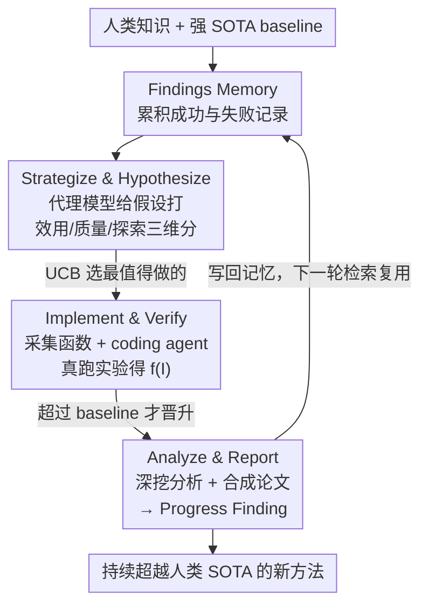

# DeepScientist: Advancing Frontier-Pushing Scientific Findings Progressively

**会议**: ICLR2026  
**OpenReview**: [https://openreview.net/forum?id=cZFgsLq8Gs](https://openreview.net/forum?id=cZFgsLq8Gs)  
**代码**: https://github.com/ResearAI/DeepScientist  
**领域**: LLM Agent / 自动科学发现 / 贝叶斯优化  
**关键词**: 自动科研, 目标导向发现, 贝叶斯优化, Findings Memory, AI Scientist

## 一句话总结
DeepScientist 把"自动科学发现"建模成一个目标导向的贝叶斯优化问题，用一块持续累积的 Findings Memory 在月级时间尺度上自主"提假设—实现验证—分析归纳"地迭代，烧掉 2 万多 GPU 小时、生成约 5000 个想法、验证约 1100 个，最终在三个前沿 AI 任务上分别把人类 2025 SOTA 超出 183.7%、1.9%、7.9%，且靠的是自主重设计核心方法而非简单拼接已有技术。

## 研究背景与动机
**领域现状**：随着 LLM 长文本生成与理解能力增强，"AI Scientist"系统（如 AI Scientist-v2）已经能端到端跑完整个科研循环——提出想法、写代码、做实验、产出论文，其产物甚至进过顶会 workshop。

**现有痛点**：这些系统在"没有明确科学目标"时，往往退化成盲目重组已有知识和方法，输出在人类评审眼里显得幼稚、缺乏真正的科学价值；它们大多只在小规模符号/合成任务上评测，没有锚定到强人类 baseline，导致"虽新但无用"。

**核心矛盾**：科学发现的本质是长周期、目标导向、试错驱动的持续推进（像半导体制程几十年把特征尺寸从微米压到个位数纳米），而现有 AI Scientist 要么是"一次性 idea→实验→论文"的 one-shot 流水线，要么是围着单个 idea 近乎无限试错——两种范式都无法在固定算力预算下、面向一个强 baseline 持续逼近并超越人类 SOTA。

**本文目标**：让一个 AI 系统在现代、高算力成本的真实 AI 研究问题上，从一个公认的强人类 SOTA 出发，月级时间内可靠地把某个评测指标推过 baseline，且过程完全自主。

**切入角度**：作者把"在固定算力下、相对强 baseline 持续改进某指标"这件事形式化成一个**目标导向的贝叶斯优化**问题——要找的是能最大化未知且极其昂贵的"真实科学价值函数" $f(\cdot)$ 的最优研究程序 $I^*$。既然每次实验代价巨大（解一个前沿 LLM 问题单次实现约需 $1\times10^{16}$ FLOPs），就不能暴力搜索，必须用代理模型 + 采集函数智能地权衡"挖掘有希望方向"与"探索未知区域"。

**核心 idea**：用贝叶斯优化的视角驱动科研，把一块同时记录成功与失败的 Findings Memory 当作代理模型的上下文，让系统在"利用 vs 探索"之间智能取舍地选下一个该验证的假设，从而真正推动科学前沿而非重组旧知识。

## 方法详解

### 整体框架
DeepScientist 是一个基于 LLM 的多智能体系统，核心配一块持续累积、全自动维护的 **Findings Memory**——里面既有前沿人类知识（论文、代码），也有系统自己的历史发现，每条记录都存着假设、实现细节、评测指标，以及成功和失败实验的日志。系统的核心任务是从所有候选研究程序的空间 $I$ 中，找到最大化昂贵真实价值函数 $f(\cdot)$ 的最优程序 $I^*$。

整个发现过程被结构化成一个**贝叶斯优化闭环**，每一轮（research cycle）走三个阶段：**Strategize & Hypothesize（提假设并用代理模型打分）→ Implement & Verify（用采集函数挑最值得做的，真跑实验）→ Analyze & Report（验证成功的才深挖分析、写成论文）**。每条发现在 Findings Memory 里有三种状态，随着这三个阶段逐级"晋升"：未验证的假设是 **Idea Finding**，被选中去真实验的是 **Implement Finding**，真的超过 baseline 的才升为 **Progress Finding**。所有记录——无论成败——都会被后续轮次检索复用，让系统从自己的成功和失败里持续学习。

### 关键设计

**1. Findings Memory：把科研建模成贝叶斯优化的"数据底座"**

现有 AI Scientist 最大的问题是没有跨实验的长期记忆——要么一次性跑完就忘，要么围着单个 idea 死磕。DeepScientist 用一块全自动维护、不允许人工编辑的列表式数据库解决这个问题：每条记录是一个结构化的科学发现，存着假设、实现、评测指标和成败日志。它是整个贝叶斯优化的"已观测数据集"——代理模型靠它估值、采集函数靠它选点、分析阶段靠它复用。由于单轮要面对上千条记录、远超 LLM 上下文长度，系统用一个独立的检索模型选出 Top-K 记录喂给 planner，实测一个任务检索出的子集通常落在约 $2\times10^{5}$ token 的长上下文窗口内，足以充分 contextualize 而不丢关键信息。关键在于：记忆里**故意保留失败**，因为"从失败中学、复用失败"恰恰是作者认为自动科学的新瓶颈所在。

**2. Stage I 代理模型：用 LLM 当廉价 surrogate 给上千假设打分**

要在巨大假设空间里选下一步，但每次真实验都极贵，于是这一阶段先用一个低成本的**代理模型 $g_t$**（本身是个 LLM）逼近真实价值函数 $f$。系统先分析 Findings Memory $M_t$，识别现有知识的局限、生成一批新假设 $P_{new}$；代理模型被检索到的 Top-K 记录 + 候选假设共同 contextualize 后，对每个候选 $I\in P_{new}$ 产出一个结构化估值向量 $V=\langle v_u, v_q, v_e\rangle$，分别量化它的预期**效用（utility）、质量（quality）、探索价值（exploration）**，都是 0–100 的整数分。每个新假设连同它的估值向量被初始化成一条 Idea Finding 写进记忆。这一步的意义是：用 LLM 的"科研直觉"在不花真实算力的前提下，对成千上万个想法先做一遍便宜的价值预估，把昂贵的真实实验留给真正有希望的少数。

**3. Stage II 采集函数：用 UCB 在"利用 vs 探索"间挑最该验证的那个**

代理打完分后，怎么从一堆 Idea Finding 里挑出唯一值得砸真实算力的那个？系统用经典的 **Upper Confidence Bound（UCB）** 采集函数把估值向量 $V$ 映射成一个可比较的分数：

$$I_{t+1} = \arg\max_{I\in P_{new}} \underbrace{\big(w_u v_u + w_q v_q\big)}_{\text{利用项 }\mu(I)} + \kappa \cdot \underbrace{v_e}_{\text{探索项 }\sigma(I)}$$

其中 $w_u, w_q$ 是权重、$\kappa$ 控制探索强度。作者刻意用最简单的任务无关配置 $w_u=w_q=\kappa=1$，三个任务都不调，体现"效用/质量/探索同等重要"的假设。被选中的最高分发现 $I_{t+1}$ 晋升为 Implement Finding，交给一个 **coding agent** 在带完整权限的沙箱里做仓库级实现——它能读完整代码库、联网搜文献和代码，先规划任务、再读代码理解结构、最后改代码跑出实验日志和结果 $f(I_{t+1})$，回写记忆闭环。把 UCB 用在这里很巧：它把"挖掘已知高价值方向"和"探索不确定新区域"统一进一个可优化目标，避免系统只会在安全区里打转。

**4. Stage III 多智能体分析与论文合成：只给成功者"深挖 + 成文"待遇**

这是记忆里最严格的一关，**只有验证成功（超过 baseline）才触发**。当一个 Implement Finding 真的赢了 baseline，记录晋升为 Progress Finding，由一组能调用 MCP 工具套件的专门 agent 接手：它们先自主设计并执行更深的分析实验（消融、在新数据集上评测等），用 MCP 工具管理实验生命周期、数据采集与结果解析；随后一个合成 agent 用同一套工具，把所有实验结果、分析洞察和产出物整理成一篇连贯、可复现的研究论文。这条"深挖 + 写论文"流水线确保系统不是只刷个数字，而是把每个真实进展沉淀成可被同行审阅、可被后续轮次检索复用的高置信度知识。

### 一个完整示例：AI 文本检测两周走完人类三年
以 AI Text Detection 任务为例，起点是 ICLR 2024 的 Fast-Detect GPT / Binoculars（靠困惑度、burstiness 等**全局统计**判文本是否 AI 生成）。DeepScientist 先做了大量尝试——处理 Boundary-Aware Extension 问题、试 Volatility-Aware 和 Wavelet Subspace Energy 等路线，多数失败但都进了记忆。随后在两周内连续产出三个逐级更强的方法：先是 **T-Detect** 用鲁棒 t 分布修正核心统计量；再概念性地演化出 **TDT** 和 **PA-TDT**，把文本当作信号、用小波和相位一致性分析定位异常。三者合起来把视角从"全局分布差异"转到"AI 文本的非平稳时频结构"，揭示出局部能量与相位变化才携带关键检测证据，最终把 AUROC 推高 7.9%、推理速度翻倍。整条轨迹与图 1 对照：人类研究者在 RAID 上从 2019 到 2025 缓慢爬升，DeepScientist 两周达到可比进度——这正是"progressively advancing frontier"的字面演示。

## 实验关键数据

### 主实验
三个前沿任务、各取一个公认强人类 SOTA 作起点，系统在 16 张 H800 上月级运行后均超越：

| 任务 | 指标 | 人类 SOTA | DeepScientist | 提升 |
|------|------|-----------|---------------|------|
| Agent Failure Attribution | Handcraft Acc. | 12.07 (All at Once) | 29.31 (A2P) | +142.8% |
| Agent Failure Attribution | Algorithm-Gen Acc. | 16.67 (All at Once) | 47.46 (A2P) | +183.7% |
| LLM Inference Accel. | Tokens/秒 | 190.25 (Token Recycling) | 193.90 (ACRA) | +1.9% |
| AI Text Detection | AUROC | 0.800 (Binoculars) | 0.863 (PA-TDT) | +7.9% |
| AI Text Detection | Latency | 117ms (Binoculars) | 60ms (PA-TDT) | -57ms（约 2× 快）|

三个被自主发现的方法各有真东西：**A2P**（Abduction-Action-Prediction）把失败归因从"对静态日志做模式识别"提升为"反事实因果推理"——先假设可疑动作背后的隐藏原因，再提出反事实修复，最后模拟若干未来步看任务是否会成功；**ACRA** 假设 LLM 解码存在反复出现、变长的稳定后缀，维护后缀索引历史、在稳定门通过时用对应的 next-token 统计覆盖首层 draft token，否则回退到 Token Recycling；**TDT/PA-TDT** 则把检测从全局统计转到时频/相位分析。

### 论文质量评估
系统端到端产出的 5 篇论文，分别用 AI 评审和人类 program committee 双重打分：

| 评估方式 | 维度 | DeepScientist | 对比 |
|---------|------|---------------|------|
| DeepReviewer-14B（vs 其他 AI Scientist） | Rating | 5.90 | 次高 Zochi 4.63；Accept Rate 60% vs 其他全 0% |
| 三位人类专家（含 ICLR AC） | Rating | 5.00 (均值) | 人类 ICLR 2025 论文均值 5.08（Krippendorff's α=0.739）|

### 关键发现
- **想法漏斗极陡**：系统共生成超 5000 个想法，仅约 1100 个被选去真实验，最终只有 21 个升为科学创新；三任务的"Total→Implemented→Progress"分别约为 2472→600→7、1077→196→12、1330→312→2。这印证作者的核心论断——**AI 的探索能力巨大，但真正的成功极其稀缺**。
- **算力—产出近线性**：scaling 实验显示投入算力与有价值科学发现的产出之间近乎线性，说明这条路有可预期的"加钱就更多发现"的规模效应。
- **新瓶颈是验证与失败复用**：既然成功如此稀少，有效的验证、过滤、以及对失败尝试的策略性复用，成了自动科学的新瓶颈——领域的核心问题不再是"AI 能不能创新"，而是"如何高效引导它强大却耗散的探索过程"。

## 亮点与洞察
- **把"科研"形式化成贝叶斯优化是真正的范式贡献**：代理模型（廉价 LLM 估值）+ 采集函数（UCB 选点）+ Findings Memory（已观测数据集）这三件套，正好对应贝叶斯优化的 surrogate / acquisition / observations，让"该做哪个实验"从拍脑袋变成可优化的决策——这个映射本身就很"啊哈"。
- **故意保留并复用失败**：绝大多数 AI Scientist 只盯成功，而本文把失败也结构化进记忆当作负样本去 contextualize 代理模型，直击"从失败中学"这个人类科研的核心却被自动系统长期忽略的环节。
- **可迁移**：三阶段 + 三状态晋升 + UCB 选点的骨架，几乎可以套到任何"固定预算下相对强 baseline 持续改进某指标"的工程/科研场景（如 AutoML、编译器优化、prompt 工程的自动迭代），只要换掉评测函数和 coding agent 的执行域。
- **首个大规模实证**：2 万 GPU 小时、5000 想法、月级运行，是目前关于"AI 能否在复杂任务上持续推过人类 SOTA"最有分量的经验证据。

## 局限与展望
- **成功率极低、代价极高**：5000 个想法只换来 21 个创新、烧 2 万 GPU 小时，单次实现就要 $\sim 10^{16}$ FLOPs，普通团队难以复现，性价比是硬伤。
- **依赖人类监督兜底**：实验中三位人类专家全程监督以验证输出、过滤幻觉，说明系统还没真正"全自动"到可放手——幻觉过滤这关仍要人。
- **任务挑选偏好可监督性**：三个任务都选了"frontier + 社区关注 + 人类可监督"的，对那些评测信号噪声大、或无现成强 baseline 的领域是否成立，本文没有回答。
- **横向提升幅度不可直接比**：+183.7% 与 +1.9% 不能放一起说"哪个更厉害"——LLM Inference Acceleration 本就是高度优化的成熟领域，留给改进的空间天然小，提升幅度受任务成熟度强烈影响。
- **改进思路**：让代理模型对探索价值 $v_e$ 的估计带不确定性量化（真正的后验方差而非整数打分），以及把失败记录做更结构化的因果归因，可能进一步提高选点效率、压低"稀缺成功"的代价。

## 相关工作与启发
- **vs AI Scientist / AI Scientist-v2（自动科学发现）**：它们证明 AI 能跑完整科研循环并产出新发现，但在合成/窄范围问题上评测、探索不锚定明确目标与强 baseline，易产出"新但无用"的结果；DeepScientist 把发现建模成相对强人类 baseline 的目标导向贝叶斯优化，用失败归因 + Findings Memory 优先选既新颖又可测量影响的假设。
- **vs AlphaEvolve / ASI-Arch / AlphaTensor（大规模试错优化）**：这些用海量试错在既定科学范式内做工程优化，提升代码/系统性能但不质疑基础假设；DeepScientist 明确瞄准强方法的核心局限，目标是提出并验证能确立新 SOTA 的新方法学方向，而非只优化实现。
- **vs CycleResearcher / DeepReview / co-scientists（半自动科研助手）**：它们各管写作、评审、假设生成等单一片段，把"从失败中学+探索"的关键闭环留给人；DeepScientist 是端到端自主、自己从实验里学、自我导向研究路径的 agent。

## 评分
- 新颖性: ⭐⭐⭐⭐⭐ 把自动科研形式化为目标导向贝叶斯优化、并配持续 Findings Memory，是清晰且原创的范式贡献。
- 实验充分度: ⭐⭐⭐⭐⭐ 三任务超越人类 SOTA + 双重论文评审 + 想法漏斗统计 + 算力 scaling，规模与维度都罕见。
- 写作质量: ⭐⭐⭐⭐ 框架与三阶段叙述清晰，但部分关键定义（代理模型实现、surrogate 训练细节）压在附录，正文略简。
- 价值: ⭐⭐⭐⭐⭐ 首个大规模证明 AI 能在复杂任务上持续推过人类 SOTA，并开源日志与代码，对自动科学社区影响重大。

<!-- RELATED:START -->

## 相关论文

- [\[ICLR 2026\] Expanding the Capability Frontier of LLM Agents with ZPD-Guided Data Synthesis](expanding_the_capability_frontier_of_llm_agents_with_zpd-guided_data_synthesis.md)
- [\[ICLR 2026\] Pushing Test-Time Scaling Limits of Deep Search with Asymmetric Verification](pushing_test-time_scaling_limits_of_deep_search_with_asymmetric_verification.md)
- [\[ICLR 2026\] TusoAI: Agentic Optimization for Scientific Methods](tusoai_agentic_optimization_for_scientific_methods.md)
- [\[ICLR 2026\] AutoFigure: Generating and Refining Publication-Ready Scientific Illustrations](autofigure_generating_and_refining_publication-ready_scientific_illustrations.md)
- [\[ICLR 2026\] SR-Scientist: Scientific Equation Discovery With Agentic AI](sr-scientist_scientific_equation_discovery_with_agentic_ai.md)

<!-- RELATED:END -->
