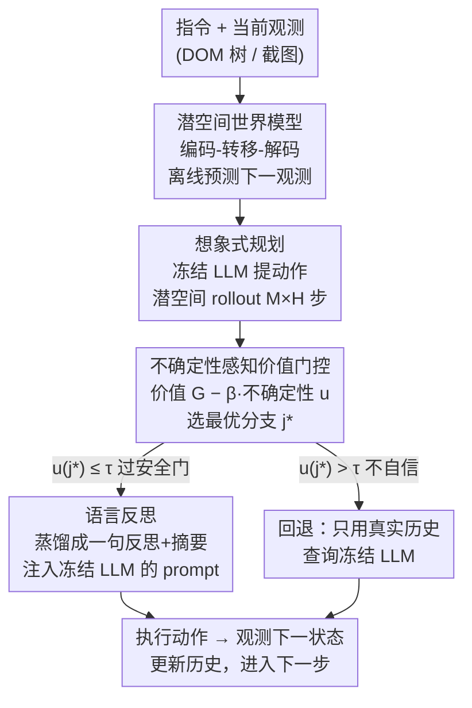

# DreamPhase: Offline Imagination and Uncertainty-Guided Planning for Large-Language-Model Agents

**会议**: ICLR2026  
**OpenReview**: [https://openreview.net/forum?id=81PJ2KPnmK](https://openreview.net/forum?id=81PJ2KPnmK)  
**代码**: https://anonymous.4open.science/r/DreamPhase-A8AD/README.md （匿名仓）  
**领域**: LLM Agent / 世界模型 / 离线规划  
**关键词**: LLM 智能体、潜空间世界模型、想象式规划、不确定性门控、语言反思

## 一句话总结
DreamPhase 让一个**冻结的策略 LLM** 不再靠真刀真枪地点网页来试错，而是先用一个学到的潜空间世界模型在脑子里「做梦」——模拟出 M 条多步未来轨迹，用「价值减不确定性」给每条打分并过一道安全门，把选中的那条蒸馏成一句自然语言反思塞回 prompt，从而在 WebShop 上把每回合真实 API 调用从 ARMAP-M 的约 40 次砍到 10 次以下（4× 降低），还把执行的不可逆动作减少约 5×，且无需微调 LLM。

## 研究背景与动机

**领域现状**：把 LLM 当成交互式智能体（网页导航、工具调用、具身任务）已是主流。但 LLM 在闭环决策上天然吃亏：它们在互联网静态数据上预训练，缺少「时序落地」的轨迹经验，难以推理动作的长期后果；而且像 GPT-4V、Gemini 这类强模型只开放受限 API，没法在任务数据上微调，只能靠提示词，碰到不确定、需要反馈或长程规划的任务就很脆。

**现有痛点**：为补上闭环能力，现有路线分两类，各有硬伤。**（i）在线 rollout 规划器**（ReAct + beam search、MCTS 等）在每一步都对真实 DOM 做几百次点击来评估多条未来分支——能前瞻、能纠错，但慢、贵（API 限流场景），且在「提交支付 / 下单」这类**不可逆**环境里有真实危险。**（ii）纯模仿 / 奖励模型智能体**贪心地从当前状态直接行动、不做显式搜索——省了交互开销，但极脆：一步走错就可能不可逆地把整条轨迹带偏，因为它没有任何前瞻或修正计划的能力。

**核心矛盾**：两类方法本质上都被「**安全 vs 效率**」的 trade-off 卡住，根因都是依赖与真实环境的实时交互——要前瞻就得多交互（不安全、贵），要省交互就只能贪心（脆）。

**本文目标**：在**不微调 LLM、不与真实环境多交互**的前提下，给智能体补上前瞻能力，同时提升样本效率、安全性和成本。

**切入角度**：作者主张「内部想象」（internal imagination）——把探索从真实环境**搬进一个学到的潜空间模拟器**里离线进行。只要世界模型够准、且能识别出自己「拿不准」的时候退回真实交互，就能两头兼顾。

**核心 idea**：训一个紧凑的**潜空间世界模型**离线模拟多步未来，用**不确定性感知的价值**给想象分支打分并过安全门，把最优分支**蒸馏成一句语言反思**注入冻结 LLM 的 prompt——用想象和语言反馈代替真实试错与参数更新。

## 方法详解

### 整体框架

DreamPhase 把决策建模为部分可观测 MDP $\mathcal{M}=(I,S,A,X,T,E,r)$：智能体收到指令 $\iota$、观测 $x_t$（网页 DOM 树或截图），要在尽量少碰真实环境的前提下选动作 $a_t$。它在每个时间步走四步、**全程不查环境**：(i) 用学到的潜空间世界模型把当前观测压成潜状态、形成预测性「信念」；(ii) 在潜空间并行 rollout 出 $M$ 条假设未来（每条 $H$ 步）；(iii) 给每条 rollout 算一个价值估计和一个不确定性度量；(iv) 把质量最高的那条想象结果蒸馏成一句简短自然语言反思，用来 condition 下一步动作。关键在于**策略 LLM 始终冻结**，它的行为只通过「内部模拟 + 语言反馈」演化，不更新任何参数。

整个流程对应论文的四个组件：世界模型（学会做梦）→ 想象式规划（生成 M 条分支）→ 不确定性感知的价值门控（评估并决策）→ 语言反思（把选中分支说给 LLM 听）。只有当最优分支足够自信（过安全门）才用想象出来的动作；否则**回退**到只用真实历史查询策略，保证分布漂移时的鲁棒性。

### 关键设计

**1. 潜空间世界模型：让智能体「在脑子里点按钮」而不真点**

针对「在线规划要靠几百次真实点击才能前瞻」的痛点，DreamPhase 训练一个潜空间世界模型来离线模拟环境动态，回答「如果我点这个按钮会发生什么」。模型分三块：编码器 $z_t=f_\theta(x_t)$ 把观测压成潜变量，随机转移模型 $z_{t+1}\sim q_\theta(z_{t+1}\mid z_t,\bar a_t,\iota)$ 给定当前潜状态和动作嵌入 $\bar a_t=\mathrm{emb}_A(a_t)$ 预测下一潜状态，解码器 $\hat x_{t+1}=g_\theta(\cdot\mid z_{t+1},\iota)$ 重建下一观测。观测（DOM 树）按深度优先遍历配上文本内容与空间布局（bounding box、元素类型）token 化成语言对齐的紧凑序列。训练目标是 token 重建（交叉熵）加潜空间 KL 正则：

$$\mathcal{L}_{\mathrm{LWM}}=\mathbb{E}\Big[\mathrm{CE}(\hat x_{t+1},x_{t+1})+\lambda_{\mathrm{KL}}\,\mathrm{KL}\big(q_\theta(z_{t+1}\mid h_t,a_t)\,\|\,\mathcal{N}(0,I)\big)\Big]$$

训练数据只用各 benchmark **训练集**上跑冻结 LLaMA-2-7B（ReAct 风格 + 轻随机化）记录的 $(\iota,x_t,a_t,x_{t+1})$ 轨迹，不碰测试集、不用额外语料——所以它和所有开源 baseline 共享同一策略骨干、同一环境划分、同一份交互数据，区别只在「怎么用这份数据」。作者特意强调（Remark 1）为什么不直接让 LLM「做梦」：LLM 不擅长模拟 DOM 这种低层结构，常生成语法非法或因果不一致的状态，且 token 级 rollout 既费内存又把策略推理和环境建模搅在一起；专门学的潜空间世界模型更模块化、更高效、生成的未来更守环境约束。

**2. 潜空间想象式 rollout：用冻结 LLM 提动作，并行铺开 M 条未来**

有了世界模型，每个时间步把当前观测编码成 $z_t$，然后并行生成 $M$ 条潜空间 rollout，每条模拟 $H$ 步（Algorithm 1）。每一步里：冻结策略 $\tilde a_{t+k}^{(j)}\sim\pi_{\mathrm{LLM}}(\cdot\mid h_{t+k}^{(j)})$ 从当前**想象历史**里提一个动作，世界模型转移到下一潜状态 $z_{t+k+1}^{(j)}$，解码出想象观测 $\tilde x_{t+k+1}^{(j)}$，再把这对动作-观测追加进想象历史。这样得到 $M$ 条想象分支 $\tilde\tau^{(j)}=(\{\tilde a_{t:t+H-1}^{(j)}\},\{z_{t+1:t+H}^{(j)}\})$。整个过程**不发任何环境请求**，把「环境动态」和「策略推理」解耦：LLM 只负责想动作，世界模型只负责推演后果，于是能安全地做反事实多步前瞻。

**3. 不确定性感知的价值门控：既要分高，又要拿得准才动手**

光有分支不够，得判断哪条「靠谱到可以照着做」。对每条想象分支，先用一个轻量价值头 $V_\phi$（在潜状态上工作）估折扣回报 $G^{(j)}=\sum_{k=1}^{H}\gamma^{k-1}V_\phi(z_{t+k}^{(j)}\mid\iota)$。再用**冻结策略上的 Monte-Carlo dropout** 估认知不确定性——一个互信息代理：用 $N$ 个随机 dropout 掩码得到动作分布 $p^{(j)}(\xi_n)$，

$$u^{(j)}=H\!\big[\bar p^{(j)}\big]-\frac{1}{N}\sum_{n=1}^N H\!\big[p^{(j)}(\xi_n)\big],\qquad \bar p^{(j)}=\frac1N\sum_{n=1}^N p^{(j)}(\xi_n)$$

其中 $H[\cdot]$ 是类别熵；$u^{(j)}$ 越大说明不同随机采样越「各执一词」、越不确定。最后用风险敏感打分 $\tilde G^{(j)}=G^{(j)}-\beta u^{(j)}$ 选最优分支 $j^\star=\arg\max_j\tilde G^{(j)}$，再过一道**安全门**：若 $u^{(j^\star)}\le\tau$ 就照想象动作 $\tilde a_t^{(j^\star)}$ 行动，否则**回退**去查真实环境。这道门是「安全 vs 效率」trade-off 的开关——自信时省交互，拿不准时退回真实交互，从而在分布漂移下保持鲁棒。论文还给出理论 remark：在一步预测 KL 上界 $\varepsilon$ 和误门控率 $\rho$ 下，$T$ 步累计 regret 满足 $\mathrm{Regret}_T\le C\sqrt{T\varepsilon}+B\rho T$——$\sqrt{T\varepsilon}$ 项来自模型近似误差，$B\rho T$ 来自偶尔接受了不可靠分支；当 $\varepsilon$ 小、$\rho$ 罕见时 regret 次线性增长。

**4. 语言反思与摘要：把想象结果说给冻结 LLM 听，零微调地操控行为**

选中分支后不去微调 LLM，而是把它**蒸馏成自然语言**塞回 prompt（受 Reflexion 等口头自反思启发）。一个轻量反思头 $R_\phi$ 解释「为什么 $\tilde\tau^{(j^\star)}$ 有希望、有什么潜在风险」，输出如「先搜索再按尺码筛选再加购物车；避开没有可见 Checkout 按钮的页面」；一个摘要器 $S_\eta$ 把核心动作压成简短脚本如「搜索 'Nike shoes'；打开第一个结果；点 Add to cart」。两者都只在约 30 token 预算内。最后把反思 $c_t$ 与摘要 $s_t$ 注入 prompt，冻结策略据此选动作 $a_t\sim\pi_{\mathrm{LLM}}(\cdot\mid\iota,x_t,c_t,s_t)$。这样模拟经验以**可解释、易消融**的短文本形式整合进策略，行为变好却不动一个参数。

### 一个完整示例

以 Game-of-24（输入数字 3, 7, 9, 11，凑出 24）对比 ARMAP 与 DreamPhase。**ARMAP（基线）**早早 commit：$11+9=20\to20-7=13\to13+3=16$，结果是 16 不是 24，无解停机。**DreamPhase** 先在想象阶段铺开多条分支：分支 1 $(11+9)-(7-3)\to16$（低价值）；分支 2 $(11-7)\times(9-3)\to24$（高价值、低不确定性）；另外三条价值 $\le0.4$ 或高熵被淘汰。选中分支 2，把反思注入后照着执行：$11-7=4\to9-3=6\to4\times6=24$，得到正确表达式 $(11-7)\times(9-3)=24$。这正体现了「先在脑子里把几条路都走一遍、挑一条又高分又拿得准的，再真正动手」的核心机制。

## 实验关键数据

### 主实验

在八个智能体任务上对比闭源模型与开源智能体（策略骨干统一为 LLaMA-2-7B，匹配解码与回合预算）：

| 方法（开源块） | SciWorld | BabyAI | Wordle | TextCraft | Tool-Weather | TODOList | Avg(8 任务) |
|------|------|------|------|------|------|------|------|
| AgentLM (ACL'24) | 1.6 | 0.5 | 4.0 | 4.0 | 0.0 | 15.0 | 5.3 |
| AgentGym (ACL'25) | 38.0 | 82.7 | 12.0 | 64.0 | 25.0 | 70.0 | 39.1 |
| ARMAP-M (ICLR'25) | 51.2 | 81.5 | 17.0 | 59.0 | 35.0 | 72.0 | 42.3 |
| **DreamPhase** | **72.4** | **82.3** | **34.0** | 62.0 | **45.0** | **77.0** | **50.1** |

DreamPhase 在开源块拿下最佳平均（50.1 vs ARMAP-M 42.3），在工具/操作密集任务上提升最大（不确定性门挡掉了低置信下的高风险动作）；7B 骨干下还逼近 GPT-4-Turbo（63.9）之外的多数商用模型。

跨骨干（WebShop / SciWorld seen-unseen / Game-of-24）结果（节选 Llama8B 组平均）：

| 方法 | Llama8B Avg | 说明 |
|------|------|------|
| Greedy | 28.4 | 贪心解码 |
| ARMAP-B | 33.5 | Best-of-N 搜索 |
| ARMAP-M | 31.7 | MCTS 搜索 |
| **DreamPhase** | **35.1** | 多数骨干/任务最佳或次佳，Game-of-24 提升尤其大；SW-unseen 全面领先（鲁棒于分布漂移） |

### 交互预算与延迟（WebShop，Llama-8B，N=1000 回合）

| 方法 | 平均 API 调用/回合 ↓ | vs ARMAP-M | 单步延迟(ms) ↓ | 成功率(%) ↑ |
|------|------|------|------|------|
| ARMAP-M（token 级搜索） | 39.8 ± 1.1 | — | ≈255 | 60.2 ± 0.6 |
| **DreamPhase（潜空间想象）** | **9.3 ± 0.4** | **4.3×** | **≈84** | **61.8 ± 0.6** |

真实交互砍到约 1/4、单步延迟降到约 1/3，成功率反而略升；想象开销仅约 12 ms。此外执行的不可逆动作在 WebShop 上减少约 5×、ALFWorld 上约 4.9×。

### 关键发现
- **价值-不确定性门控是性能与安全的双引擎**：它既挑出高价值分支（提分），又在 LLM「各执一词」时退回真实交互（防止照着错误想象行动），所以在工具/操作密集和 unseen 任务上增益最大。
- **省交互不等于掉点**：把约 40 次真实调用压到 10 次以下的同时成功率不降反升，说明「离线想象 + 偶尔退回」足以替代大量在线试错。
- **世界模型而非 LLM 做梦更稳**：专门学的潜空间模型生成的未来更守 DOM 约束，避免了 LLM 直接 rollout 的语法非法/因果不一致问题。

## 亮点与洞察
- **把「探索」从真实环境搬进潜空间模拟器**，一举绕开「安全 vs 效率」trade-off：前瞻在脑内进行，真实环境只承接最终高置信动作——这套思路可迁移到任何「交互昂贵 / 不可逆」的 agent 场景（金融操作、机器人、运维）。
- **不确定性当成「要不要相信自己想象」的开关**，用冻结策略上的 MC-dropout 互信息代理低成本估出，配一道安全门即可优雅回退，比纯搜索或纯贪心都更鲁棒。
- **用语言反思代替微调**：把想象结果蒸馏成 30 token 的可读文本注入 prompt，既零参数更新又可解释、可消融——对只开放 API 的闭源大模型尤其实用。
- 还给出了 $C\sqrt{T\varepsilon}+B\rho T$ 的 regret 上界，把「模型误差」和「误门控」两类损失显式拆开，给「世界模型该多准、门该多严」提供了理论指引。

## 局限与展望
- **依赖世界模型质量**：理论与实证都建立在一步预测 KL 上界 $\varepsilon$ 小的前提上；若环境动态难以在潜空间建模（强随机、长程依赖、视觉极复杂），想象会失真、门控会频繁回退，优势收窄。
- **训练数据来自冻结 LLaMA-2-7B 的 ReAct 轨迹**：世界模型只见过该策略覆盖到的状态分布，遇到策略从未探索的区域可能外推不准（作者用回退缓解，但回退多了就退化成普通在线方法）。
- **不确定性用 MC-dropout 互信息代理**，是否能可靠捕捉真实认知不确定性、$\beta$ 与 $\tau$ 如何在新任务上设定，仍偏经验（消融在附录）。
- 代码为匿名仓、部分实现细节（反思头/摘要器、delimiter、模板）放在附录，复现门槛偏高。

## 相关工作与启发
- **vs ARMAP（ICLR'25，token 级搜索 R/B/M）**：ARMAP 靠在线扩展（Reflexion / Best-of-N / MCTS）提成功率，代价是高延迟和大量真实环境调用；DreamPhase 用离线潜空间想象 + 不确定性门控，在更少真实交互下反超 ARMAP——核心区别是「把搜索从真实环境挪到潜空间」。
- **vs AgentLM（ACL'24，agent tuning）**：AgentLM 靠在多轮工具轨迹上做监督/偏好微调来增强落地，需要精选数据且改模型权重；DreamPhase **不微调**，靠注入想象蒸馏出的反思来 condition 冻结 LLM。
- **vs AgentGym（ACL'25）**：DreamPhase 沿用其统一评测协议，但贡献的是一种新的规划方法而非评测框架。
- **vs World Models / Dreamer 系**：继承「在学到的潜空间里想象做规划」的衣钵，但首次把它和**冻结 LLM 策略 + 语言反思**结合，用于 LLM 智能体的零微调决策。

## 评分
- 新颖性: ⭐⭐⭐⭐⭐ 「潜空间世界模型 + 不确定性门控 + 语言反思」三件套用于冻结 LLM 智能体，组合新颖且动机扎实
- 实验充分度: ⭐⭐⭐⭐ 八任务 + 四骨干 + 交互/延迟/不可逆动作多维度评估，但绝对分仍受限于 7B 骨干、消融多在附录
- 写作质量: ⭐⭐⭐⭐⭐ 逻辑清晰，算法、公式、定性案例齐全，trade-off 叙事到位
- 价值: ⭐⭐⭐⭐⭐ 为「交互昂贵/不可逆」场景的安全高效 agent 提供了一条可扩展、零微调的实用路径

<!-- RELATED:START -->

## 相关论文

- [\[ICLR 2026\] GTool: Graph Enhanced Tool Planning with Large Language Model](gtool_graph_enhanced_tool_planning_with_large_language_model.md)
- [\[ICLR 2026\] CoLLMLight: Cooperative Large Language Model Agents for Network-Wide Traffic Signal Control](collmlight_cooperative_large_language_model_agents_for_network-wide_traffic_sign.md)
- [\[ICLR 2026\] WebArbiter: A Principle-Guided Reasoning Process Reward Model for Web Agents](webarbiter_a_principle-guided_reasoning_process_reward_model_for_web_agents.md)
- [\[ICLR 2026\] GPS: Graph-guided Proactive Information Seeking in Large Language Models](gps_graph-guided_proactive_information_seeking_in_large_language_models.md)
- [\[NeurIPS 2025\] Zero-Shot Large Language Model Agents for Fully Automated Radiotherapy Treatment Planning](../../NeurIPS2025/llm_agent/zero-shot_large_language_model_agents_for_fully_automated_radiotherapy_treatment.md)

<!-- RELATED:END -->
