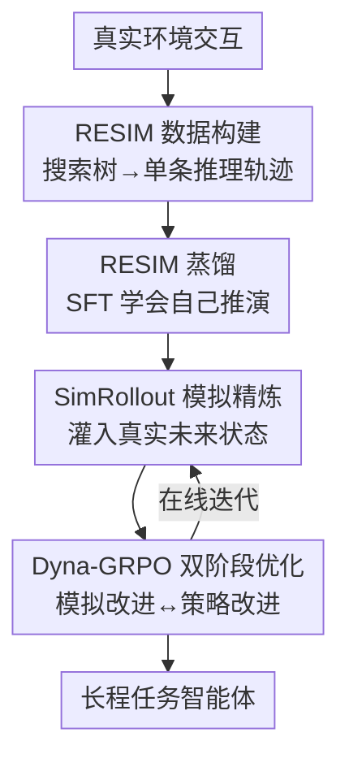

# Dyna-Mind: Learning to Simulate from Experience for Better AI Agents

**会议**: ICLR2026  
**OpenReview**: [https://openreview.net/forum?id=F848aPzCJy](https://openreview.net/forum?id=F848aPzCJy)  
**代码**: https://github.com/jasonyux/Dyna-Mind  
**领域**: LLM Agent / 强化学习 / 世界模型  
**关键词**: 智能体, 心理模拟, 长程任务, GRPO, 世界模型

## 一句话总结
Dyna-Mind 用"先把真实环境交互搭成搜索树、再蒸馏成一段含模拟的推理"（RESIM）教会 (V)LM 智能体在动手前先在脑子里推演几步未来，再用一种把"真实未来状态"灌进 RL 的 Dyna-GRPO 在线强化这种模拟能力，从而在 Sokoban、ALFWorld、AndroidWorld 三个长程交互任务上显著超过 GRPO/RLOO 和 Dyna-Think。

## 研究背景与动机
**领域现状**：推理模型（如 DeepSeek-R1）在数学、编程这类"一次性"问题上已接近专家水平，做法是让模型在动作前展开长链推理。学界自然想把同一套搬到网页导航、手机/电脑操作这类需要多步交互的智能体任务上。

**现有痛点**：可这类长程任务上推理模型的表现急剧下滑。作者实测发现：DeepSeek-R1 在结构规整的 Sokoban 上能近乎完美（成功率 96.6%），但一到布局复杂的 ALFWorld 就掉到 62.5%——而且"模拟分数"（模型脑补的下一状态对不对）和成功率高度正相关（$r\approx0.7\text{-}0.96$）。换句话说，模型不是不会推理，而是**脑子里的环境模型不准**，推演几步就跑偏。

**核心矛盾**：长程任务的成败取决于智能体能否构建准确的"世界模型"——在不真正执行的前提下，心里推演"如果我这么做，环境会变成什么样"，神经科学称之为"替代性试错"（vicarious trial and error）。但已有补法各有硬伤：要么像 Dyna-Think 直接蒸馏 DeepSeek-R1 生成的合成模拟数据，可这些数据本身就带 R1 的错误和偏差；要么走经典 Dyna 路线训一个独立世界模型，结果系统模块化、推理和模拟两张皮。

**本文目标**：把模拟能力**内化进智能体自己的推理过程**，且不依赖更强的教师模型、不引入独立世界模型，并能在线持续强化这种能力。

**切入角度**：与其让强模型"凭空想象"模拟数据，不如直接从**真实环境交互**里挖出可靠的未来状态——真实 rollout 走过的路就是 ground-truth 世界动态，拿它当监督信号天然不会脑补。

**核心 idea**：两阶段训练——阶段 1 把真实搜索树压缩成"带模拟的推理轨迹"做 SFT（RESIM），让模型学会自己生成推演；阶段 2 用把真实未来状态喂回 RL 的 Dyna-GRPO，在线继续打磨模拟与决策。

## 方法详解

### 整体框架
Dyna-Mind 要解决的是"让一个 (V)LM 智能体在长程交互任务里，动作前先在推理里推演若干步未来、并选出最优动作"。它把这件事拆成两个串行训练阶段：**阶段 1 RESIM** 负责"无中生有"地把模拟能力灌进模型——先用真实环境交互搭出搜索树，再用一个通用 LLM 把整棵树聚合成一段连贯的推理回答 $a^{\text{ReSim}}$，然后 SFT 让策略模型学会直接生成这种推理；**阶段 2 Dyna-GRPO** 负责在线强化——在 RL rollout 中把真实未来状态灌回去精炼模型的模拟，再用改造过的 GRPO 同时优化决策和模拟两件事。

任务被建模成马尔可夫决策过程 $(\mathcal{S},\mathcal{A},\mathcal{T},\mathcal{R})$：智能体 $\pi_\theta$ 在状态 $s_t$ 下生成动作 $a_t\sim\pi_\theta(\cdot|s_t)$，环境转移到 $s_{t+1}\sim\mathcal{T}(s_t,a_t)$，终止时给一个奖励 $r_T$。关键约定是：**任何"模拟未来"的文字都属于动作 $a_t$ 的一部分**（即模拟是写在推理里的），而带撇/不带撇的 $s$ 一律指环境给出的真实状态。

### 关键设计

**1. RESIM 数据构建：把真实搜索树压成一段"带模拟"的推理轨迹**

痛点直接对准 Dyna-Think 的软肋——靠强模型凭空生成的模拟数据会内嵌错误。RESIM 反过来，从真实交互里取监督信号。给定状态 $s$，它先用一个 rollout 模型 $\pi_\theta$ 从 $s$ 出发做深度优先搜索（DFS），生成 $b$ 条、最深 $d$ 步的部分 rollout；再用价值函数 $V_\nu$ 给每条 partial rollout 打分估计质量；最后用一个通用 (V)LM 把整棵树聚合成单条回答 $a^{\text{ReSim}}$——具体是先让它逐条总结每个 rollout（这里包含**来自环境的真实未来状态**），再把所有总结连成一段连贯推理，结合当前状态 $s$ 和最近 $h$ 步历史，选出最佳 plan 和下一步立即执行的动作。聚合出的最优动作真正在环境里执行，循环直到任务完成。妙处在于 $a^{\text{ReSim}}$ 本质是"把一棵真实搜索树的信息塞进一段推理"，所以它的模拟天然忠实于世界动态；而且这套框架不限于 DFS，换成 MCTS 或加入用户交互都能套。

**2. RESIM 蒸馏：让模型脱离搜索算法、自己生成推演**

构建出的每条 $a^{\text{ReSim}}$ 都把一整棵搜索树编码进了它的推理。RESIM 直接把 $a^{\text{ReSim}}$ 当 SFT 的训练目标：给定轨迹 $\tau=\{s_0,a^{\text{ReSim}}_0,s_1,a^{\text{ReSim}}_1,\cdots\}$，用监督学习训模型在仅看当前状态 $s_t$ 和至多 $h$ 步历史（与 REACT 等推理方法相同的输入）时，**直接吐出 $a^{\text{ReSim}}_t$**——即推理时不再需要任何搜索算法支撑。这一步把"算法 + 多模块搭出来的昂贵模拟"内化成模型的一次前向生成。由于 $a^{\text{ReSim}}$ 几乎全是"通过模拟做规划"的内容，蒸馏出的模型平均 token 量只有 DISTILL(R1) 的 $1/11$，却在 ALFWorld 上反超它。

**3. SimRollout：用真实未来状态精炼模型的模拟**

阶段 2 想在线强化，但标准 RL（如 GRPO）只给一个标量奖励 $R_T$，对"推理里的模拟到底准不准"毫无直接训练信号。SimRollout 是 Dyna-GRPO 的核心子过程，专门造出这种信号：在每个状态 $s_t$，先采一个回答 $a\sim\pi_\theta(\cdot|s_t)$，从中抽出它选定的动作计划 $\{\hat a_1,\cdots,\hat a_d\}$（深度 $d$ 动态决定、上限 5），把这些计划在真实环境里执行得到**真实下一状态** $\{s'_{t+1},\cdots,s'_{t+d}\}$；然后把这些真实未来状态拼回提示 $s_t^{\text{refine}}\equiv\{s_t\oplus a\oplus s'_{t+1}\oplus\hat a_2\oplus\cdots\}$，再让 $\pi_\theta$ 据此精炼出 $a^{\text{refine}}\sim\pi_\theta(\cdot|s_t^{\text{refine}})$。和 Reflexion 那种"回合结束后靠成败信息反思、且不用于训练"不同，这里是在每一步、用真实未来状态当镜子让模型修正自己的脑补，且产物会进 RL 优化。

**4. Dyna-GRPO：在"模拟改进"和"策略改进"之间交替优化**

沿用经典 Dyna 思想，Dyna-GRPO 把训练拆成两类迭代。**模拟改进阶段**：对每个任务先用组大小 $G/2$ 做 SimRollout，得到含/去真实未来状态两套精炼轨迹 $\tau'$ 与 $\tau'_{\text{refine}}$；再用 $G/2$ 做标准 rollout $\tau$；把 $\tau$ 和 $\tau'$ 合成大小 $G$ 的组跑 GRPO；最后用 $\tau'_{\text{refine}}$ 单独强化"模拟精炼"能力，奖励用一个特制 advantage——只有当精炼轨迹**既解对任务、又比标准 rollout 与 SimRollout 的均值奖励都高**时给 1.0，否则 0：

$$A_{\text{refine}}(\tau^{(i)}_{\text{refine}})=\begin{cases}1.0,&\text{若 }\tau^{(i)}_{\text{refine}}\text{ 正确且 }R(\tau^{(i)}_{\text{refine}})>\max(\bar R,\bar R_{\text{refine}})\\0.0,&\text{否则}\end{cases}$$

**策略改进阶段**：做**不带**未来状态的标准 rollout，用 episode 级 advantage 的标准 GRPO 优化，让模型把已习得的模拟能力真正融进决策。两阶段交替，使模型既学会"借未来信息把模拟修准"，又学会"没有未来信息时也能自己推演着做决策"。

### 损失函数 / 训练策略
RL 主体是 GRPO 目标 $J_{\text{GRPO}}$，重要性采样比 $\rho_\theta(a)=\frac{\pi_\theta(a|s)}{\pi_{\theta_{\text{ref}}}(a|s)}$，加 KL 正则 $\beta D_{KL}(\pi_\theta\|\pi_{\theta_{\text{ref}}})$。episode 级 advantage 用组内奖励标准化：

$$A_{\text{GRPO}}(\tau^{(i)})=\frac{R(\tau^{(i)})-\text{mean}(\{R(\tau^{(j)})\}_{j=1}^G)}{\text{std}(\{R(\tau^{(j)})\}_{j=1}^G)}$$

奖励设计为：非终止步 $R(s_t,a_t)=-0.1$，终止步成功 $10.0$、失败 $0.0$。底座统一用 Qwen2.5-7B-Instruct（文本）/ Qwen2.5-VL-7B/32B-Instruct（AndroidWorld）。

## 实验关键数据

### 主实验
文本游戏（Sokoban / ALFWorld，均基于 Qwen2.5-7B-Instruct，3 次平均）：

| 方法 | Gen.Token | Sokoban AVG | ALFWorld AVG |
|------|-----------|-------------|--------------|
| REACT(DeepSeek-R1) | 14.5x | 96.6（仅ID） | 62.5（仅ID） |
| RESIM（推理时） | 2.0x | 96.4（仅ID） | 87.7（仅ID） |
| Dyna-Think | 24.2x | 65.8 | 58.9 |
| DISTILL(RESIM)（阶段1） | 2.0x | 63.7 | 74.1 |
| DISTILL(RESIM)+GRPO | 2.1x | 73.1 | 87.0 |
| **DISTILL(RESIM)+DYNA-GRPO** | 1.9x | **77.1** | **90.8** |

AndroidWorld（Qwen2.5-VL，3 次平均）：

| 方法 | ID | OOD | AVG |
|------|----|----|-----|
| REACT(Qwen2.5-VL-72B) | 19.5 | - | - |
| RESIM（推理时） | 34.4 | - | - |
| DISTILL-32B(RESIM) | 32.8 | 15.6 | 24.2 |
| DISTILL-32B(RESIM)+GRPO | 35.3 | 20.3 | 27.8 |
| **DISTILL-32B(RESIM)+DYNA-GRPO** | 40.7 | 22.9 | **31.8** |

### 消融 / 模拟能力分析
专门测"模拟分数"（Sim Score $\in[0,1]$，由独立的 Qwen3-235B 当裁判，对比脑补未来状态与真实未来状态）：

| 方法 | Sokoban Succ / Sim | ALFWorld Succ / Sim |
|------|--------------------|---------------------|
| REACT(DeepSeek-R1) | 96.6 / 0.93 | 62.5 / 0.36 |
| RESIM | 96.4 / 1.00 | 87.7 / 1.00 |
| DISTILL(RESIM) | 71.9 / 0.62 | 78.9 / 0.37 |
| DISTILL(RESIM)+GRPO | 79.1 / 0.62 | 87.0 / 0.38 |
| **DISTILL(RESIM)+DYNA-GRPO** | 82.5 / **0.67** | 92.5 / **0.43** |

### 关键发现
- **模拟准不准是长程任务的瓶颈**：DeepSeek-R1 在 ALFWorld 上 Sim Score 仅 0.36，成功率随之低；RESIM 因 Sim Score=1.0（构造保证）两个环境都强。成功率与 Sim Score 相关系数 $r$ 高达 0.46–0.96。
- **Dyna-GRPO 同时抬高成功率和模拟分**：相比 GRPO，它在两个文本环境上既涨成功率又涨 Sim Score（如 ALFWorld 0.38→0.43），说明涨点确实来自模拟变准，不是单纯刷任务奖励。
- **效率优势明显**：DISTILL(RESIM) 输出 token 仅 R1 的 1/11，Dyna-GRPO 全程把生成长度维持在底座的约 1.9–2.1x，没有以暴涨推理长度换性能。
- **AndroidWorld 受限于底座**：RESIM 在真实手机环境只到 34.4%，误差分析归因于 rollout 模型 Qwen2.5-VL-72B 对部分 GUI 理解不全、连错后无法恢复。

## 亮点与洞察
- **"真实搜索树→单条推理"的蒸馏路线很巧**：把昂贵的多模块搜索（rollout 模型 + 价值函数 + 聚合 LLM）一次性压进模型的前向生成，推理时零算法依赖，还顺手把 token 砍到 R1 的 1/11——这是"用真实数据换掉合成数据偏差"的漂亮范例。
- **SimRollout 把"未来状态"当成可训练的监督信号**，解决了标量奖励 RL 对"模拟质量"无信号的根本盲点；这个"执行计划拿真实未来→拼回提示让模型修正"的思路可迁移到任何需要 world model 的 agent RL。
- **诚实地拆解涨点来源**：作者刻意只用三种方法都解对的轨迹做阶段 1 训练，排除"数据更多更杂"的混淆；又单独测 Sim Score 证明涨点来自模拟变准而非刷奖励，论证链条干净。

## 局限与展望
- **强依赖底座能力**：AndroidWorld 表现被 rollout 模型 Qwen2.5-VL-72B 的 GUI 理解能力卡住，作者承认需要更强基础模型才能进一步突破。
- **RESIM 数据构建昂贵**：需要 rollout 模型、价值函数、聚合 (V)LM 多模块协同，且 AndroidWorld 每个 episode 要 15–20 分钟，导致他们干脆跳过 rollout/价值函数训练、改用 prompt。
- **搜索算法与交互形式受限**：当前只用 DFS、只考虑 agent-环境交互；作者把 MCTS、agent-用户-环境交互留作未来工作。
- 自己看：模拟深度 $d$ 上限被硬截到 5 以保训练稳定，对更长程的依赖关系可能不够。

## 相关工作与启发
- **vs Dyna-Think**：两者都做两阶段、都想强化模拟能力，但 Dyna-Think 蒸馏 DeepSeek-R1 的合成模拟（含 R1 的错误偏差）、且 DDT 训独立的下一状态预测（VLM 无法生成图像故在 AndroidWorld 失效）；Dyna-Mind 从真实搜索树取监督、不训独立世界模型、不依赖强教师，文本任务上全面反超且 token 省一个量级。
- **vs 经典 Dyna 算法**：经典 Dyna 分别训世界模型和策略（模块化、两张皮），Dyna-Mind 把模拟内化进同一个智能体的推理过程，模拟和决策共享一套参数。
- **vs 搜索/多智能体方法**（MCTS、hierarchical multi-agent）：这些在推理时引入大量额外环境交互或复杂启发式编排开销，Dyna-Mind 把搜索的好处一次性蒸进单个 (V)LM，推理时无需算法支撑。

## 评分
- 新颖性: ⭐⭐⭐⭐⭐ "真实搜索树蒸馏 + 未来状态灌进 RL"两点都新且互补，直击合成模拟数据带偏差的痛点
- 实验充分度: ⭐⭐⭐⭐ 两合成 + 一真实环境，含 Sim Score 因果分析与多 RL 算法对比；AndroidWorld 因算力只跑到有限规模
- 写作质量: ⭐⭐⭐⭐⭐ 从神经科学动机到两阶段方法逻辑清晰，图表与论证链严谨
- 价值: ⭐⭐⭐⭐⭐ 为长程交互 agent 提供了一条"内化模拟、可在线强化"的可复用训练范式

<!-- RELATED:START -->

## 相关论文

- [\[ICLR 2026\] Scaling Agent Learning via Experience Synthesis](scaling_agent_learning_via_experience_synthesis.md)
- [\[CVPR 2026\] Learning to Select Visual Tools from Experience](../../CVPR2026/llm_agent/learning_to_select_visual_tools_from_experience.md)
- [\[ICLR 2026\] Dancing in Chains: Strategic Persuasion in Academic Rebuttal via Theory of Mind](dancing_in_chains_strategic_persuasion_in_academic_rebuttal_via_theory_of_mind.md)
- [\[ICML 2026\] Skill-Pro: Learning Reusable Skills from Experience via Non-Parametric PPO for LLM Agents](../../ICML2026/llm_agent/skill-pro_learning_reusable_skills_from_experience_via_non-parametric_ppo_for_ll.md)
- [\[ICML 2026\] Closing the Feedback Loop: From Experience Extraction to Insight Governance in Verbal Reinforcement Learning](../../ICML2026/llm_agent/closing_the_feedback_loop_from_experience_extraction_to_insight_governance_in_ve.md)

<!-- RELATED:END -->
