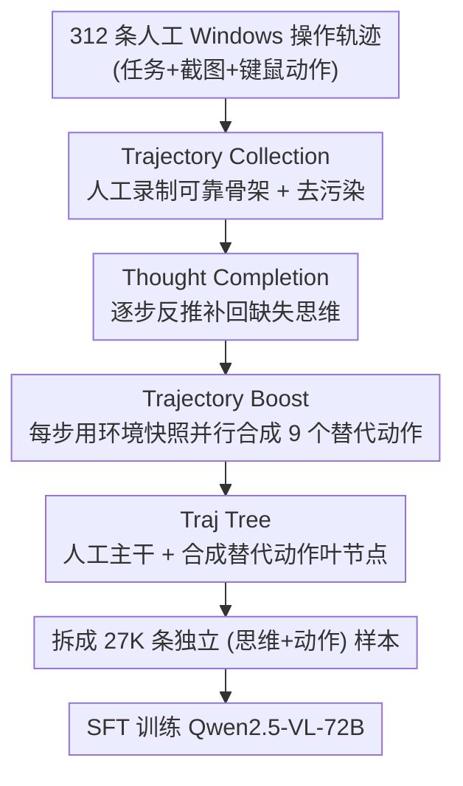

# Efficient Agent Training for Computer Use

**会议**: ICLR 2026  
**arXiv**: [2505.13909](https://arxiv.org/abs/2505.13909)  
**代码**: [https://github.com/GAIR-NLP/PC-Agent-E](https://github.com/GAIR-NLP/PC-Agent-E)  
**领域**: Agent  
**关键词**: computer use agent, trajectory augmentation, data efficiency, GUI agent, SFT

## 一句话总结
PC Agent-E 仅用 312 条人工标注的 Windows 操作轨迹，通过 Trajectory Boost 方法让 Claude 3.7 Sonnet 在每个时间步合成多样化的替代动作决策，训练后的 Qwen2.5-VL-72B 在 WindowsAgentArena-V2 上相对提升 141%，甚至超越教师模型 Claude 3.7 Sonnet 10%。

## 研究背景与动机

**领域现状**：Computer use agent 是当前 AI 的重要方向，目标是让模型像人类一样通过 GUI 操作电脑（点击、输入、导航）。当前主流方案分为模块化多智能体工作流和原生智能体模型两类，后者（如 Claude Computer Use、OpenAI Operator）因灵活性和可优化性成为主流范式。

**现有痛点**：开源模型在 computer use 任务上远落后于闭源系统（Claude 3.7 Sonnet），核心瓶颈在于**高质量轨迹数据的极度稀缺**。现有数据合成方法要么依赖大规模人工标注，要么通过端到端蒸馏从强模型采样完整轨迹，后者存在错误累积、速度慢（需要在线交互 VM 环境）等问题。

**核心矛盾**：如何用最少的人工标注数据获取最大化的 computer use 能力？直接用人工轨迹训练效果有限（单一路径），直接蒸馏效率低下且质量不稳定（900 小时 vs 3 小时）。

**本文目标** (a) 极少量人工数据如何高效利用？(b) 如何避免端到端蒸馏的错误累积？(c) 如何让开源模型达到闭源水平？

**切入角度**：受 DeepSeek-R1 等推理模型的数据合成启发，作者观察到 computer use 任务天然存在多条有效路径——同一时间步可以有多种合理的动作选择。因此可以利用人工轨迹作为环境快照，让强模型在每个时间步合成替代动作，而无需在线环境交互。

**核心 idea**：用人工轨迹的环境快照作为锚点，让前沿模型在每步离线合成多样动作决策来扩增轨迹数据，实现数据高效训练。

## 方法详解

### 整体框架
这篇论文要解决的是：开源 computer use agent 远落后于 Claude 这类闭源系统，而追平差距最直接的办法——堆高质量轨迹数据——又被标注成本和蒸馏的低效卡死。PC Agent-E 的整体思路是「少量人工轨迹 + 单步离线扩增」：先让两名标注者录 312 条真实的 Windows 操作轨迹当作可靠骨架，再为每一步补回缺失的思维过程，然后在每个时间步上让前沿模型离线合成多条替代动作，把单条轨迹「长」成一棵决策树（Traj Tree），最后把树上所有节点拆成独立样本去训练 Qwen2.5-VL-72B。推理时模型按 ReAct 范式工作：输入是当前截图、任务描述和历史记录，输出是「思维 + 动作」对。

### 关键设计

**1. Trajectory Collection：用人完成任务的天然正确性换取无需验证的高质量骨架**

数据稀缺是核心瓶颈，作者的应对不是大规模标注，而是只录一小批但保证每条都对。两名标注者用 PC Tracker 工具在 Windows 上完成 312 个任务，录制内容包括任务描述、截图序列和人类的键盘/鼠标动作，动作空间 $\mathcal{A}$ 覆盖 click、right click、double click、drag、scroll、press key、hotkey、type text、wait、finish、fail 共 11 种操作；标注者可以随时丢弃不满意的轨迹或修改任务描述。因为是人亲手做完的，结果正确性天然有保障，不需要任何额外验证环节，两个人一天就能完成全部标注，成本极低。为防止评测泄漏，再对任务做去污染：13-gram overlap 与语义相似度（阈值 0.85）双重过滤掉与测试集过近的样本。

**2. Thought Completion：给只有动作的人工轨迹补回 ReAct 训练所需的思维**

人录下来的轨迹只有动作没有推理，而要训练 ReAct 范式的 agent 必须有「思维 + 动作」成对的监督，这一步就是把缺失的思维补回去。对轨迹里的每个动作，作者把任务描述、历史动作连同已重建的思维、当前动作和对应截图一起喂给 Claude 3.7 Sonnet，让它反推出该动作背后的思维过程。补全是迭代进行的——后一步的上下文里包含前面各步已经重建好的思维，从而保持整条轨迹的推理连贯。补完之后轨迹既能直接用于训练，也为下一步的 Trajectory Boost 提供了必要的历史上下文。

**3. Trajectory Boost：用人工轨迹锚定环境状态，在每步离线合成多条替代动作把单轨迹扩成一棵树**

这是全文最核心的创新，针对的是端到端蒸馏「在线交互慢、多步累积误差」的痛点。作者观察到 computer use 任务每个时间步天然存在多条有效路径，于是把人工轨迹的每一步看成一个环境快照 $\langle T, o_k, h_k \rangle$（任务描述、当前观测截图、历史上下文），将快照输入 Claude 3.7 Sonnet 并行采样 9 个单步动作决策 $(t'_k, a'_k)$。这样每条人工轨迹就长成一棵 **Traj Tree**：人工轨迹是主干，每步合成的替代动作挂成叶节点。相比端到端蒸馏，这个设计同时拿下三点：其一，每步的环境状态都由人工轨迹锚定，模型只决策当前一步而不会顺着自己的错误偏离，从根上避免了错误累积；其二，合成是离线的、不与真实 VM 环境交互，因此可以自然并行化，速度比在线蒸馏快约 300 倍（3 小时 vs 900 小时）；其三，它同时吃到了人工轨迹的**真实性**和前沿模型的**多样性**，比单条人工路径或纯蒸馏样本都更有信息量。

### 损失函数 / 训练策略
- 训练基于 Qwen2.5-VL-72B，使用标准 SFT 损失
- Traj Tree 上的每个动作节点（包括人工和合成的）都转化为独立训练样本
- 训练样本格式与推理时 scaffold 直接对应：输入为截图+任务描述+历史，输出为 thought+action
- 所有合成节点的历史上下文仅包含主干（人工轨迹）的前序步骤，保持一致性
- 312 条轨迹最终产生 27K 训练样本，图像分辨率 1280×720，上下文长度 8192

## 实验关键数据

### 主实验

| 模型 | LibreOffice | Chrome | Edge | System | VS Code | VLC | Utils | Total |
|------|-------------|--------|------|--------|---------|-----|-------|-------|
| GPT-4o | 0.0 | 5.9 | 0.0 | 8.3 | 0.0 | 0.0 | 0.0 | 2.1 |
| Qwen2.5-VL-72B | 0.0 | 34.7 | 15.4 | 20.8 | 26.3 | 7.6 | 16.7 | 14.9 |
| UI-TARS-72B-DPO | 0.0 | 40.6 | 38.5 | 58.3 | 36.8 | 7.6 | 25.0 | 26.2 |
| Claude 3.7 Sonnet | 2.4 | 46.5 | 61.5 | 54.2 | 52.6 | 29.0 | 16.7 | 32.6 |
| Claude 3.7 (thinking) | 2.4 | 64.1 | 46.2 | 66.7 | 52.6 | 21.9 | 25.0 | 35.4 |
| **PC Agent-E** | **4.8** | **64.1** | 46.2 | 50.0 | **57.9** | **35.7** | **33.3** | **36.0** |

PC Agent-E 相对 Qwen2.5-VL-72B 提升 141%，超越 Claude 3.7 Sonnet 10%。

### 消融实验

| 方法 | 数据量 | WindowsAgentArena-V2 (%) | 说明 |
|------|--------|--------------------------|------|
| Base (Qwen2.5-VL-72B) | 0 | 14.9 | 基线 |
| Human only (s=1) | 2.7K | 17.2 | 仅用人工轨迹 |
| Direct Distillation (s=10) | 3120 traj | ~28 | 端到端蒸馏 |
| Trajectory Boost (s=10) | 27K | **36.0** | 本文方法 |

### 关键发现
- **Trajectory Boost 远优于单纯人工数据**：scaling factor 从 1 增到 10，性能从 17.2 跃升至 36.0，而仅用人工轨迹只能到 17.2
- **远优于直接蒸馏**：同等数据规模下，Trajectory Boost 比 Direct Distillation 高出约 8 个百分点，且时间效率高 300 倍（3h vs 900h）
- **跨平台泛化**：在 Linux 系统的 OSWorld 上，PC Agent-E 同样获得 34% 相对提升（4.4→10.9%），尽管训练数据全部来自 Windows
- **提升主要来自规划能力**：定性分析显示训练后模型产生更长的思维过程，self-correction 和 verification 能力显著增强，但知识和定位（grounding）能力未明显改善
- **Infeasible Hacking 现象**：弱模型在不可行任务上反而得分更高（Qwen 86.7% vs PC Agent-E 63.3%），说明当前评估存在漏洞

## 亮点与洞察
- **单步离线合成 vs 端到端在线蒸馏**：这是一个非常巧妙的 insight——computer use 任务每步天然有多条有效路径，用人工轨迹锚定环境状态、单步合成替代动作，避免了多步蒸馏的错误累积，同时实现 300x 加速
- **极致数据效率**：312 条轨迹→27K 样本→超越教师模型，这说明高质量的 diverse supervision 比大规模低质量数据更重要
- **WindowsAgentArena-V2 的评估改进**：修复了评估依赖、infeasible hacking、VM 状态不稳定等问题，对社区有独立贡献价值
- **Traj Tree 结构可迁移**：这个思路可用于任何基于环境快照的 sequential decision-making 任务（如 web navigation、mobile GUI、robotics），只要每步有多条有效路径

## 局限与展望
- **训练数据仅 312 条轨迹，覆盖范围有限**：主要集中在 Chrome、系统设置等常用应用，LibreOffice 等复杂场景表现仍弱（4.8%）
- **未利用图像历史**：推理时只用当前截图，不利用过去截图，作者也承认加入图像历史可能有益
- **知识和 Grounding 瓶颈未解决**：主要提升来自规划能力，对于需要特定软件知识的任务（如 VLC 功能）和精确定位的场景改进有限
- **合成动作未在真实环境中验证**：Trajectory Boost 的合成动作只是"看起来合理"但未实际执行，可能包含无法成功执行的动作
- **仅做了 SFT 未做 RL**：结合 RL（如 GRPO + 环境奖励）可能进一步提升

## 相关工作与启发
- **vs UI-TARS**: UI-TARS 使用大规模多步轨迹数据训练，PC Agent-E 证明用极少数据+智能增强可以超越大规模数据方案
- **vs Direct Distillation**: 端到端蒸馏需要在线交互，错误累积，慢 300x；Trajectory Boost 离线、可并行、质量更高
- **vs Self-Play/Self-Improvement**: 自我提升需要模型本身有较强能力，PC Agent-E 巧妙利用人工轨迹作为基础，避免了冷启动问题

## 评分
- 新颖性: ⭐⭐⭐⭐ Trajectory Boost 思路简洁优雅，但本质是利用人工轨迹+强模型单步合成，概念并不复杂
- 实验充分度: ⭐⭐⭐⭐⭐ 对比了多种基线、消融完整、跨平台泛化、test-time scaling、定性分析一应俱全
- 写作质量: ⭐⭐⭐⭐⭐ 结构清晰，图表精美，motivation 推导流畅
- 价值: ⭐⭐⭐⭐ 对 GUI agent 数据高效训练有重要参考价值，300x 加速和超越教师模型的结果令人印象深刻

<!-- RELATED:START -->

## 相关论文

- [\[ICLR 2026\] SCUBA: Salesforce Computer Use Benchmark](scuba_salesforce_computer_use_benchmark.md)
- [\[ICLR 2026\] VideoAgentTrek: Computer Use Pretraining from Unlabeled Videos](videoagenttrek_computer-use_pretraining_from_unlabeled_videos.md)
- [\[ICLR 2026\] ScaleCUA: Scaling Open-Source Computer Use Agents with Cross-Platform Data](scalecua_scaling_open-source_computer_use_agents_with_cross-platform_data.md)
- [\[ICLR 2026\] Grounding Computer Use Agents on Human Demonstrations](grounding_computer_use_agents_on_human_demonstrations.md)
- [\[ICLR 2026\] R-WoM: Retrieval-augmented World Model for Computer-use Agents](r-wom_retrieval-augmented_world_model_for_computer-use_agents.md)

<!-- RELATED:END -->
