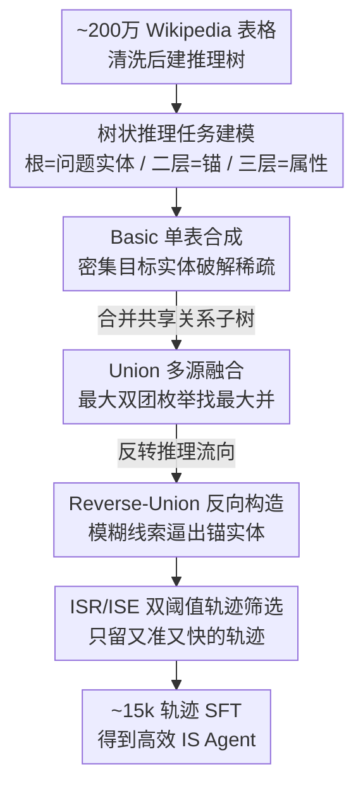

# Empowering Efficiency and Efficacy in WebAgent via Enabling Info-Rich Seeking

**会议**: ICLR2026  
**OpenReview**: [https://openreview.net/forum?id=MVFGY1nS6b](https://openreview.net/forum?id=MVFGY1nS6b)  
**代码**: 待确认  
**领域**: LLM Agent / 信息检索 Agent  
**关键词**: 信息搜索、Web Agent、数据合成、搜索效率、轨迹筛选

## 一句话总结
WebLeaper 把信息搜索（IS）任务重新建模成"树状推理"，用 Wikipedia 表格批量合成"目标实体密集"的训练任务（Basic / Union / Reverse-Union 三种变体），再用 ISR / ISE 两个指标筛掉低覆盖、低效率的轨迹，让 30B 级别的开源 Web Agent 在 5 个深度搜索榜上同时把"找得全"和"找得快"都拉到开源 SOTA。

## 研究背景与动机
**领域现状**：基于 LLM 的 Agent 把信息搜索（Information Seeking, IS）当作核心能力——给一个复杂自然语言问题，Agent 在 ReAct 框架里反复"思考 → 调搜索/访问工具 → 读观察"，逐步把答案需要的实体凑齐。OpenAI Deep Research、Gemini、Perplexity、Kimi-Researcher 等商用系统都建立在这套能力上。

**现有痛点**：以往工作几乎全都在卷"搜索深度"（更复杂的 QA 流水线、更强的微调策略），却很少管"搜索效率"。作者的预实验给出一个扎眼的数字：一个有竞争力的 IS Agent，其有效动作（真正在找到答案所需目标实体的动作）占比分布峰值只在 $0.04$ 附近——也就是说大多数情况下绝大部分动作都白费了，表现为重复改写 query、反复抓无关信息、搜索链冗长。低效不仅烧算力烧时间，还直接拖垮最终答对率。

**核心矛盾**：低效的根子在训练任务的设计上。典型 IS 任务里，"目标实体"（target entities）太稀疏——一道题就那么一两个最终答案。稀疏会带来两个连锁问题：一是 Agent 缺少"在有限上下文里快速定位有用信息"的练习机会，只能学到松散的搜索策略；二是它会让效率指标本身的测量产生偏差（目标实体越少，效率估计方差越大），训练信号不可靠，没法系统性地学"高效搜索"。

**本文目标**：拆成两个子问题——(1) 怎么构造"目标实体密集"的 IS 任务；(2) 怎么生成"既准又快"的解题轨迹来当训练监督。

**切入角度**：作者发现 Wikipedia 里的结构化表格天然就是"一组由特定关系连接起来的实体"，可以被组织成一棵推理树，把大量目标实体压进有限上下文里。树状结构既紧凑又分层，正好对症"实体稀疏"。

**核心 idea**：用"树状推理"重新表述 IS 任务，靠 Wikipedia 表格批量合成高密度任务，再用 ISR/ISE 双指标筛轨迹——让模型在"实体密集"的环境里被逼着学会高效搜索。

## 方法详解

### 整体框架
WebLeaper 是一个**数据合成框架**，本身不改 Agent 架构，而是产出更好的训练数据去 SFT 一个基座模型（这里是 Qwen3-30B-A3B-Thinking）。它的输入是约 200 万张爬来的 Wikipedia 表格，输出是约 15k 条"准且高效"的解题轨迹，喂给 SFT 后得到最终的 IS Agent。

整条管线分两大块：**实体密集任务合成**（QA synthesis）把表格变成一道道目标实体密集的题，按难度递进出三个变体——Basic（单表建一棵推理树）、Union（合并多棵共享关系的子树）、Reverse-Union（把推理流程反过来，先从模糊线索推锚点）；**信息引导的轨迹构造**（trajectory construction）用一个开源模型在这些题上跑 ReAct 轨迹，再用 ISR（覆盖率）和 ISE（效率）两道阈值把低质量轨迹筛掉。

理解任务建模前先记住三层树结构：根节点是**问题实体**（表格标题里抽出的主题，如"诺贝尔文学奖"），第二层是**锚实体 / 主键**（如某位获奖者"Czesław Miłosz"），第三层是该实体的**属性**（如 country: Poland、year: 1980）。问题给根，答案要求把所有第二、三层实体都找全——一道题因此天然带几十个目标实体。

### 关键设计

**1. 树状推理任务建模：把"实体稀疏"翻成"实体密集"**

痛点是老任务一题只有一两个目标实体，模型学不到在有限上下文里高效搜索，连效率指标都测不准。作者把 IS 过程形式化成一棵推理树 $T_i$：节点是实体、边是关系，Agent 从已知实体出发沿边推到目标实体。树的紧凑分层结构能在有限上下文里塞进尽可能多的目标节点。形式上一个任务是 $T=\langle q, R\rangle$，$q$ 是问题，$R\subset E$ 是所有目标实体的集合——关键在于 $R$ 不只含最终答案，还包含推理链上所有必经的中间实体。这一步是整个框架的地基：只有 $|R|=n$ 足够大，后面的效率信号才稳（见设计 4 的方差分析）。

**2. Basic 单表合成：用一张表直接造一棵密集树**

直接破解实体稀疏。沿用"一次找一个实体"的老办法造密集任务成本高得离谱，所以作者直接利用 Wikipedia 表格——它本身就是"一组被特定关系连起来的实体"。从约 200 万张爬取的表里多级清洗，只留大、规整、结构同质的表。建树时：表标题抽出的实体当根（问题实体）；用 LLM 挑出最有代表性、非冗余的一列（通常是主键）当第二层实体；其余各列的值当第三层属性实体。每个第二层实体连同它的第三层属性构成一个子树 $S_{i,j}$，整棵树 $T_i=\{S_{i,j}\}$。问题给根、答案要二三层全部，于是单表就能造出几十个目标实体的密集任务。

**3. Union 多源融合：合并共享关系的子树，逼模型跨源整合**

Basic 的树来自单一来源，结构太简单、问法受限。Union 要造跨多源的复杂推理结构：把 Basic 里**主题和结构相似**的多棵推理树合在一起。随机合并会产生语义不通的问题，所以作者把"找可合并的树组"形式化成 **Maximal Biclique Enumeration（最大双团枚举）**，只发现"极大并"，避免枚举所有组合的指数爆炸。直觉上：诺贝尔文学奖树和布克奖树都含"作者 →（has_nationality / has_name）"这类共享关系，算法识别这层共享结构，把不共享的关系（如只在诺贝尔树里的 has_gender）丢掉；再用 LLM 基于共享特征生成问题，如"哪些作者同时拿过诺贝尔文学奖和布克奖"——它要求先各自找出两组获奖者作为中间目标实体，再求交集得最终答案，天然逼模型整合分散互补的证据。

**4. Reverse-Union 反向构造 + ISR/ISE 双指标筛选：堵住关键词捷径、给出可靠效率信号**

Union 仍有漏洞：Agent 可以直接关键词搜"诺贝尔获奖者"再搜"布克奖获奖者"取交集，绕过真正的推理。Reverse-Union 反转推理流向来堵这条捷径，分两步：**Deductive Fuzz（演绎式模糊化）**——把问题实体定义成一组描述性的第三层属性，不直接点名锚实体，而是用它的属性来描述（如"那位写了'一群英国男孩流落荒岛'小说的 1980 年代获奖者"暗指 William Golding），Agent 必须先从线索推出锚实体；**Union-based Search Construction**——再从锚的子树里选一个第三层属性当 pivot（如他的国籍），让 Agent 用这个 pivot 在并好的树上发起新搜索，最终目标实体定义为"同享该 pivot 属性、且满足原交集条件"的那批第二层实体。这样锚实体只是桥，关键词捷径失效，被迫走多步推理。

配套的轨迹筛选用两个自定义指标。**ISR（Information-Seeking Rate，覆盖率）** 衡量找全程度：$\text{ISR}=\frac{|R\cap O|}{|R|}=\frac{|R\cap O|}{n}$，$O$ 是 Agent 实际拿到的实体集合，越高越全。**ISE（Information-Seeking Efficiency，效率）** 衡量每步找到几个目标：$\text{ISE}=\frac{n}{T}$，$T$ 是轨迹总步数，越高越快。作者还证明（Proposition 1）：设 $X_i$ 是找到第 $i$ 个新实体所花步数、i.i.d. 且均值方差有限，则 $\mathrm{Var}(\text{ISE})=O\!\left(\frac{1}{n}\right)$——目标实体越多，ISE 测得越稳。这正是"实体密集"和"效率监督"互相成就的闭环：密集任务让 ISE 成为可靠信号，可靠信号又能筛出高有效动作密度的轨迹来教模型专注规划。筛选时设覆盖阈值 $\text{ISR}>\alpha$（取 0.3）和效率阈值 $\text{ISE}>\beta$（取 0.1）；注意 ISE 只累计 **Visit** 动作里找到的实体，因为 Search 动作找到的实体不够精确、会被后续 Visit 更新。

### 损失函数 / 训练策略
标准 SFT，没有 RL。为保住基础深度搜索能力，把 WebLeaper 数据和 5,000 条 WebSailor-V2 数据混合训练。基座 Qwen3-30B-A3B-Thinking-2507，用 Megatron 框架，最终约 15k 样本在 64 张 H20 上约 6–8 小时训完。Agent 工具集两件套：**Search**（参数 {queries, filter_year}，返回 top URL 及摘要，支持按年份过滤）、**Visit**（参数 {urls, goal}，返回访问段落的摘要）。

## 实验关键数据

### 主实验
五个深度搜索榜（BrowseComp / GAIA / xbench-DeepSearch / Seal-0 / WideSearch），除 WideSearch 报 SR、Row F1、Item F1 外其余报 Pass@1。粗体为开源 Agent 最高分。

| Model / Framework | BrowseComp | GAIA | xbench-DS | Seal-0 | WideSearch SR |
|--------|------|------|------|------|------|
| Claude-4-Sonnet（闭源） | 12.2 | 68.3 | 64.6 | – | 2.3 |
| OpenAI-o3（闭源） | 49.7 | 70.5 | 66.7 | 18.9 | 4.5 |
| Kimi-K2-Instruct-1T | 14.1 | 57.7 | 50.0 | – | 1.1 |
| WebSailor-32B | 10.5 | 53.2 | 53.3 | 21.3 | 0.0 |
| WebShaper-QwQ-32B | – | 53.3 | 35.0 | – | 0.0 |
| **WebLeaper-Union** | 22.1 | **69.9** | 62.3 | 35.1 | **4.0** |
| **WebLeaper-Reverse-Union** | **23.0** | 67.0 | **66.0** | **37.2** | **4.0** |

WebLeaper 在所有 5 个榜上稳超开源对手：BrowseComp 上 30B 模型（23.0）大幅压过 1T 的 Kimi-K2（14.1）；GAIA、xbench-DS、Seal-0 上甚至追平或超过建立在 Claude-4-Sonnet / OpenAI-o3 上的方案。训练数据全来自 Wikipedia，却在 5 个面向真实活网的榜上同步提升，说明学到的是"高效搜索"这种可泛化技能，而非过拟合 Wikipedia 结构。

### 消融实验
数据来源消融（括号内为相对"仅用 WebSailor-V2-5k"的差值，† 表示混入了 WebSailor-V2-5k）：

| Data Source | BrowseComp | WideSearch | GAIA | Seal-0 | xbench-DS | Avg. |
|------|------|------|------|------|------|------|
| WebSailor-V2-5k | 25.17 | 33.15 | 67.69 | 34.23 | 60.00 | 44.05 |
| Basic-5k† | 20.67 (-4.50) | 32.26 (-0.89) | 40.78 (-26.91) | 30.03 (-4.20) | 58.33 (-1.67) | 36.41 (-7.64) |
| Union-5k† | 27.50 (+2.33) | 41.70 (+8.55) | 69.90 (+2.21) | 35.14 (+0.82) | 62.33 (+2.33) | 47.31 (+3.26) |
| Reverse-Union-10k† | 27.67 (+2.50) | 44.07 (+10.92) | 66.99 (-0.70) | 37.24 (+3.01) | 66.00 (+6.00) | 48.39 (+4.34) |

### 关键发现
- **Basic 单独用反而掉点**（平均 -7.64，GAIA 暴跌 26.91）：单表任务太简单，模型从几个来源就能拼出答案，学到的是"抄近路"的表面线索，损害泛化——这反向印证了"必须靠 Union/Reverse-Union 增加跨源整合难度"。
- **Union 全面正向**（平均 +3.26）：合并异源、提高构造复杂度，逼模型在分散互补证据上推理。
- **Reverse-Union 增益最大**（平均 +4.34，WideSearch +10.92、xbench-DS +6.00）：反向流程额外注入推理复杂度，让模型不易一眼看出"从哪开始检索"，显著强化规划与决策。
- **ISR+ISE 联合筛选最好**：单看 ISR 或 ISE 都不如二者并用，在 GAIA / BrowseComp 上联合约束生成的轨迹既目标明确又简洁，减少冗余探索。

## 亮点与洞察
- **把"找得全"和"找得快"拆成两个可度量、可证明的指标**：ISR 管覆盖、ISE 管效率，还顺手证了 $\mathrm{Var}(\text{ISE})=O(1/n)$——这句方差分析把"为什么要造实体密集任务"从直觉变成了数学必要性，是全文最巧的一手。
- **用 Wikipedia 表格 + 树状建模批量造密集任务**，绕开"一次找一个实体"的高成本合成，这个数据工程思路可迁移到任何"需要密集中间监督"的 Agent 训练。
- **Maximal Biclique Enumeration 当合并器**：把"找可融合的多源任务"形式化成图论里的极大双团枚举，避免组合爆炸，是把数据合成做"对"而非做"多"的关键。
- **Reverse-Union 的反向模糊化**专门针对"关键词捷径"这一具体漏洞而设计——这种"先想清楚 Agent 会怎么偷懒、再设计任务堵死它"的对抗式数据构造思路很值得借鉴。

## 局限与展望
- **只做 SFT、没上 RL**：作者把数据质量做到位，但 IS 是天然的序贯决策问题，配合 RL（用 ISR/ISE 当 reward）可能进一步放大效率收益。
- **强依赖 Wikipedia 半结构化表格**：方法的密集任务全靠表格的"实体-关系"结构，迁到没有干净表格的领域（如纯文本科研文献、企业内网）时如何造树仍是问号。
- **BrowseComp / WideSearch 绝对分仍低**（23.0 / SR 4.0）：在最难的榜上离闭源 o3 差距明显，"高效"并不能完全补偿基座规模带来的能力上限。
- **ISE 只计 Visit 实体**是个工程取舍，Search 找到的实体被排除，可能低估某些"靠搜索就定位"的高效轨迹；阈值 $\alpha=0.3,\beta=0.1$ 的敏感性文中未充分展开。

## 相关工作与启发
- **vs WebSailor / WebShaper / WebDancer**：这些工作主攻"搜索深度"和复杂任务合成，本文正交地补上"搜索效率"这一维，并把 WebSailor-V2 数据当基础混合训练，是站在它们肩上而非取代。
- **vs WebSailor 的去捷径思路**：WebSailor 也关注防止模型走简单关键词路径，本文的 Reverse-Union 把这一动机进一步形式化成"反向推理 + 演绎模糊化"的具体构造法。
- **vs 商用 Deep Research（OpenAI/Gemini/Perplexity）**：那些是闭源大系统，本文用 30B 开源基座 + 精造数据，在多数榜上追平甚至反超，证明"数据质量 > 参数规模"在 IS 任务上成立。

## 评分
- 新颖性: ⭐⭐⭐⭐ 把"搜索效率"独立成可度量目标，并用树状建模 + 双团枚举 + 反向模糊化系统造数据，角度新。
- 实验充分度: ⭐⭐⭐⭐ 五个真实榜 + 数据来源消融 + 轨迹筛选消融，结论自洽；但缺 RL 对比和阈值敏感性。
- 写作质量: ⭐⭐⭐⭐ 定义—方法—实验逻辑清晰，三变体递进讲得明白，含方差证明。
- 价值: ⭐⭐⭐⭐ 给 IS Agent 训练提供了一套可复用的"密集任务合成 + 效率筛选"配方，30B 打平闭源很有说服力。

<!-- RELATED:START -->

## 相关论文

- [\[ICLR 2026\] Collaborative Gym: A Framework for Enabling and Evaluating Human-Agent Collaboration](collaborative_gym_a_framework_for_enabling_and_evaluating_human-agent_collaborat.md)
- [\[AAAI 2026\] DEPO: Dual-Efficiency Preference Optimization for LLM Agents](../../AAAI2026/llm_agent/depo_dual-efficiency_preference_optimization_for_llm_agents.md)
- [\[ACL 2026\] ExpSeek: Self-Triggered Experience Seeking for Web Agents](../../ACL2026/llm_agent/expseek_self-triggered_experience_seeking_for_web_agents.md)
- [\[ICLR 2026\] Sculptor: Empowering LLMs with Cognitive Agency via Active Context Management](sculptor_empowering_llms_with_cognitive_agency_via_active_context_management.md)
- [\[ICLR 2026\] Empowering LLM Tool Invocation with Tool-call Reward Model](empowering_llm_tool_invocation_with_tool-call_reward_model.md)

<!-- RELATED:END -->
